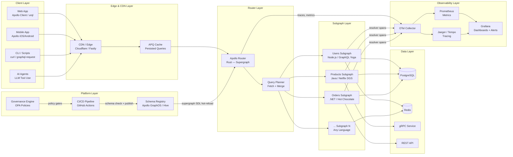
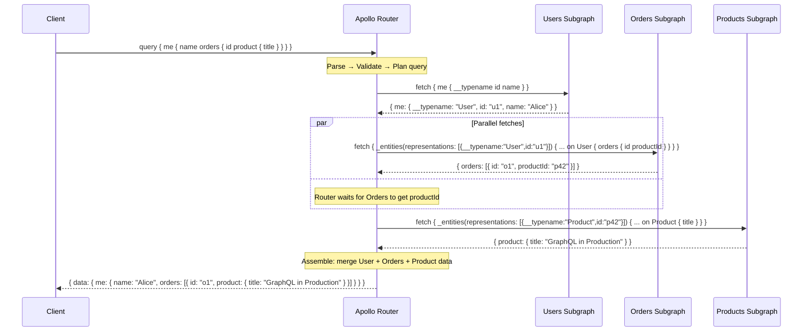
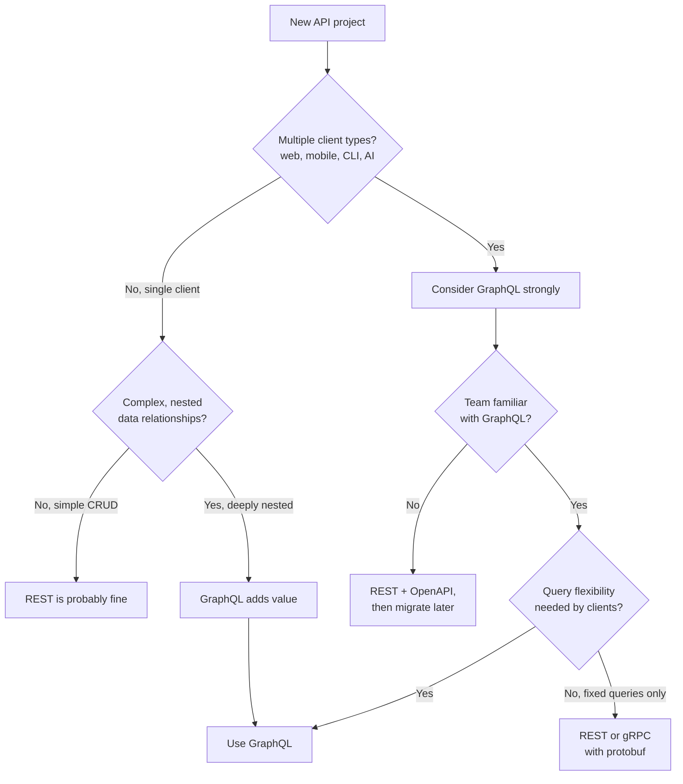
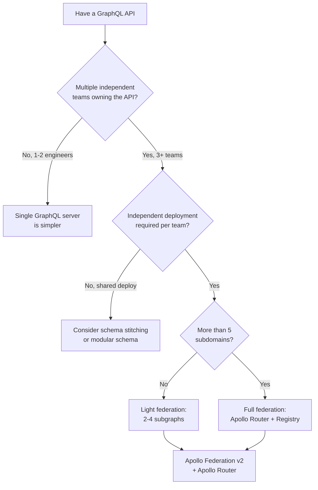

# Architecture Overview — Production GraphQL Platform

> This document maps the full landscape of a production GraphQL platform: from client queries to subgraph data sources, from schema registries to CI/CD pipelines, from Kubernetes deployments to observability stacks.

---

## The Production GraphQL Platform

---

## The Seven Layers of a Production GraphQL Platform

### Layer 1 — Client & Query Layer

The client layer is where GraphQL queries originate. Modern GraphQL clients do far more than serialize requests — they maintain a normalized in-memory cache, manage loading/error states, and co-locate query definitions alongside the components that consume them.

**Key technologies:** Apollo Client, urql, Relay, graphql-request
**Key patterns:** Fragment co-location (each component declares its own data requirements), normalized cache (entities cached by `__typename + id`), optimistic mutations (update the cache before the server confirms), query batching (send multiple operations in a single HTTP request).

The client layer is the first place where GraphQL's strong typing provides value: generated TypeScript types from the schema eliminate an entire class of runtime errors. Tools like `graphql-code-generator` turn your SDL into typed hooks automatically.

**What can go wrong here:** Overfetching (querying fields you don't render), cache normalization mismatches, query waterfalls (fetching parent, then child, then grandchild sequentially), and missing fragment spread — causing a component to request data it already has in the cache.

See: [GraphQL Fundamentals](docs/01-graphql-fundamentals/), [Schema Design](docs/03-schema-design/)

---

### Layer 2 — Edge & CDN

Standard GraphQL uses HTTP POST for all operations. POST requests are not cacheable by CDNs, which eliminates one of the most powerful web-scale performance techniques. This is one of the most underappreciated architectural challenges in GraphQL at scale.

**Automatic Persisted Queries (APQ)** solve this by replacing query bodies with a short SHA-256 hash. The client sends `GET /graphql?extensions={"persistedQuery":{"sha256Hash":"abc..."}}`. CDNs cache GET requests by URL — suddenly your most common read queries become cacheable at the edge.

**Key technologies:** Cloudflare Workers, Fastly Compute, AWS CloudFront, Akamai
**Key patterns:** APQ for CDN compatibility, `@cacheControl` directive for per-field TTLs, surrogate key headers for purging related resources, edge authentication with Workers/Compute.

The CDN layer also provides a natural place for DDoS protection, geographic routing, and SSL termination — all before a request reaches your router fleet.

See: [Performance & Scaling](docs/06-performance-and-scaling/), [Caching Strategies](docs/17-caching-strategies/)

---

### Layer 3 — Router / Gateway

The router is the single entry point for all GraphQL traffic. In a federated architecture it receives the client's query, computes a **query plan** (a tree of fetch operations across subgraphs), executes the plan (often with parallel subgraph fetches), and assembles the response.

**Apollo Router** (written in Rust) is the production-dominant choice. It is stateless and horizontally scalable. Its plugin system supports WASM modules and Rhai scripts for custom authentication, header manipulation, response transformation, and rate limiting — without forking the router.

**Alternatives:** WunderGraph Cosmo Router (also Rust), GraphQL Mesh (Node.js, for integration-heavy setups).

**What the router handles:** Query parsing and validation, query planning, authentication (JWT verification, header forwarding), rate limiting by complexity/client, persisted query enforcement, request deduplication, response caching (entity cache), telemetry (OTel spans), and WASM plugin execution.

**What the router does NOT handle:** Business logic, data fetching, authorization at the field level (belongs in subgraphs).

See: [Supergraph Architecture](docs/08-supergraph-architecture/), [Federation](docs/07-federation/)

---

### Layer 4 — Subgraph Services

Subgraphs are the individual GraphQL services that collectively compose the supergraph. Each subgraph owns a domain slice of the schema (Users, Products, Orders, Inventory, Payments, etc.) and implements its own resolvers backed by its own data stores.

**The critical concept: entities.** An entity is a type that can be referenced across subgraphs. The `Users` subgraph owns the `User` type. The `Orders` subgraph can reference a `User` by its `@key` (e.g., `id`) and add order-specific fields to it. The router stitches this together transparently for the client.

**Technology diversity is a feature, not a bug.** Subgraphs can be implemented in any language:
- Node.js: Apollo Server, GraphQL Yoga, Mercurius (Fastify)
- Java: Netflix DGS Framework, Spring for GraphQL
- .NET: Hot Chocolate (ChilliCream)
- Go: gqlgen
- Python: Strawberry, Ariadne
- Rust: async-graphql

Each team chooses the best tool for their domain. The federation protocol (implemented by the router) is language-agnostic.

See: [Federation](docs/07-federation/), [Resolvers & Execution](docs/04-resolvers-and-execution/)

---

### Layer 5 — Schema Registry & Governance

The schema registry is the source of truth for the entire supergraph SDL. It stores every subgraph schema, composes them into the supergraph, validates changes, and serves the composed SDL to the router fleet.

**What the registry provides:**
- Schema storage (per subgraph, per environment/variant)
- Composition validation (does this set of subgraph schemas compose without errors?)
- Breaking change detection (does this change break existing clients?)
- Schema history and changelog
- Contract graphs (filtered views of the supergraph for specific consumer types)
- Usage analytics (which fields are queried, by which clients)

**Tooling options:**
- **Apollo GraphOS** — hosted, commercial, deepest Apollo Router integration, usage analytics, contract graphs
- **GraphQL Hive** — open-source, self-hostable, schema registry + usage reporting + schema check CI
- **WunderGraph Cosmo** — open-source, self-hostable, full federated platform including registry and router

**Governance** sits alongside the registry: policy-as-code (OPA) enforces naming conventions, deprecation SLAs, and schema size limits before schemas reach the registry.

See: [Schema Governance](docs/09-schema-governance/), [Platform Engineering](docs/19-platform-engineering/)

---

### Layer 6 — CI/CD & Automation

GraphQL schema changes follow a lifecycle: authored in code → lint validated → composition checked against registry → breaking change analysis → policy gates → published to registry → router hot-reloads supergraph.

**GitHub Actions** is the dominant CI/CD platform for this workflow. The `rover subgraph check` command (Apollo) or `hive schema:check` command (Hive) integrates directly into PRs — commenting with breaking change reports before any human reviewer sees the PR.

**GitOps** treats the schema registry as a deployment target just like Kubernetes. Router configuration (`router.yaml`) is versioned in Git and applied via ArgoCD/Flux — the router hot-reloads its config without downtime.

**Preview environments** (ephemeral graphs) let teams spin up a temporary supergraph per pull request, query it in GraphOS Sandbox or Hive's explorer, and tear it down automatically on PR close.

See: [CI/CD Automation](docs/11-ci-cd-automation/), [GitHub Actions](docs/12-github-actions/), [Schema Validation](docs/10-schema-validation/)

---

### Layer 7 — Observability & Operations

GraphQL introduces unique observability challenges. A single client request may fan out into 5–10 subgraph fetches. A single HTTP response may contain both data and errors for different fields. Latency attribution requires resolver-level granularity, not just endpoint-level.

**OpenTelemetry (OTel)** is the standard instrumentation layer. Apollo Router emits OTel spans automatically: one root span per operation, child spans per subgraph fetch, and (with subgraph instrumentation) nested resolver spans. This produces a complete distributed trace across the entire federated execution.

**Key metrics to track:**
- Operation latency p50/p95/p99 (not just average)
- Error rate (total errors / total operations)
- Query complexity distribution (are clients sending expensive queries?)
- Resolver latency by field (which fields are your bottlenecks?)
- Cache hit rate (APQ cache, response cache, entity cache)
- Subgraph availability (are all subgraphs reachable from the router?)

**SLO example:** 99% of read operations complete in under 500ms; error rate below 0.1% over a 30-minute window.

See: [Observability](docs/14-observability/)

---

## Federated Query Execution — Sequence Diagram

---

## Technology Decision Trees

### Should I Use GraphQL?

### Should I Use Federation?

---

## Architecture Layers → Documentation Map

| Architecture Layer | Primary Doc Folders | Examples |
|---|---|---|
| Client & Query Layer | [01-fundamentals](docs/01-graphql-fundamentals/), [03-schema-design](docs/03-schema-design/) | — |
| Edge & CDN | [06-performance](docs/06-performance-and-scaling/), [17-caching](docs/17-caching-strategies/) | [persisted-queries](examples/persisted-queries/) |
| Router / Gateway | [08-supergraph](docs/08-supergraph-architecture/), [18-gateway-vs-federation](docs/18-api-gateway-vs-federation/) | [apollo-router](examples/apollo-router/) |
| Subgraph Services | [04-resolvers](docs/04-resolvers-and-execution/), [07-federation](docs/07-federation/) | [federation](examples/federation/) |
| Schema Registry & Governance | [09-governance](docs/09-schema-governance/), [10-validation](docs/10-schema-validation/), [19-platform](docs/19-platform-engineering/) | [hive](examples/hive/) |
| CI/CD & Automation | [11-ci-cd](docs/11-ci-cd-automation/), [12-github-actions](docs/12-github-actions/), [13-policy](docs/13-policy-as-code/) | [github-actions](examples/github-actions/), [opa-policies](examples/opa-policies/) |
| Observability & Operations | [14-observability](docs/14-observability/), [32-runbooks](docs/32-production-runbooks/), [33-incidents](docs/33-incident-management/) | [open-telemetry](examples/open-telemetry/) |
| Infrastructure | [15-kubernetes](docs/15-kubernetes-deployment/), [16-service-mesh](docs/16-service-mesh-integration/) | [kubernetes](examples/kubernetes/), [terraform](examples/terraform/) |

---

## Related Documents

- [Learning Roadmap](LEARNING_ROADMAP.md) — structured paths through this architecture by role
- [Federation Deep Dive](docs/07-federation/README.md) — subgraphs, entities, composition in detail
- [Supergraph Architecture](docs/08-supergraph-architecture/README.md) — Apollo Router configuration and deployment
- [Reference Architectures](docs/30-reference-architectures/README.md) — startup → enterprise architecture blueprints
- [Production Case Studies](docs/23-production-case-studies/README.md) — how Netflix, Shopify, and GitHub built theirs
