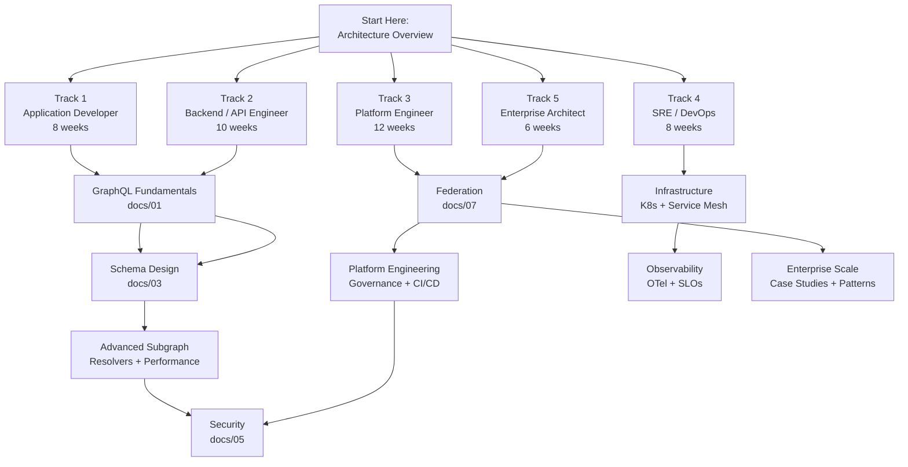

# Learning Roadmap — Enterprise GraphQL Engineering

> Five role-based learning tracks. Each track is self-contained with week-by-week reading assignments, skills milestones, and checkpoint questions.

---

## Track Overview

---

## Track 1 — Application Developer

**Goal:** Use GraphQL APIs effectively. Understand the query language, type system, fragment patterns, and client-side caching.
**Prerequisites:** Basic JavaScript/TypeScript, understanding of REST APIs
**Total estimated reading time:** ~18 hours

| Week | Topic | Doc Folder(s) | Key Skills | Notes |
|---|---|---|---|---|
| 1 | Why GraphQL, Ecosystem Overview | [00-introduction](docs/00-introduction/) | Understand REST limitations, GraphQL value proposition | Read all 3 files |
| 2 | Queries & Mutations | [01-fundamentals: queries](docs/01-graphql-fundamentals/01-queries-and-mutations.md) | Write queries, mutations, variables, aliases, operation names | Hands-on: write 10 queries against a public GraphQL API |
| 3 | Subscriptions & Real-time | [01-fundamentals: subscriptions](docs/01-graphql-fundamentals/02-subscriptions.md) | Implement WebSocket subscriptions, understand pubsub | Hands-on: subscribe to a live data feed |
| 4 | Type System & Fragments | [01-fundamentals: types](docs/01-graphql-fundamentals/03-types-fragments-directives.md) | Use fragments for code reuse, understand unions/interfaces | **Checkpoint A** (see below) |
| 5 | SDL & Introspection | [01-fundamentals: SDL](docs/01-graphql-fundamentals/04-schema-definition-language.md) | Read and reason about SDL, use introspection tools | Use GraphQL Sandbox to introspect a public API |
| 6 | Schema Evolution | [01-fundamentals: evolution](docs/01-graphql-fundamentals/05-schema-evolution.md) | Handle deprecated fields, adapt to breaking changes | |
| 7 | Security for Consumers | [05-security: auth](docs/05-security/02-authentication.md) | Understand JWT auth, token forwarding, client security | |
| 8 | AI-Native Patterns | [21-ai-native](docs/21-ai-native-graphql/01-ai-agent-integration.md) | GraphQL + AI agents, tool use patterns | |

**Checkpoint A (after week 4):**
- Can you explain the difference between a named fragment and an inline fragment?
- When would you use a Union vs an Interface?
- What does `__typename` mean and why is it important for caching?

---

## Track 2 — Backend / API Engineer

**Goal:** Build production-quality GraphQL servers. Master resolvers, DataLoader, schema design, performance, security, and federation basics.
**Prerequisites:** Server-side programming (Node.js, Java, Python, or Go), REST API development
**Total estimated reading time:** ~28 hours

| Week | Topic | Doc Folder(s) | Key Skills | Notes |
|---|---|---|---|---|
| 1 | GraphQL Internals | [02-internals: parsing + AST](docs/02-graphql-internals/01-parsing-and-ast.md) | Understand AST, parsing pipeline | Foundational — explains why things work |
| 2 | Validation & Execution Engine | [02-internals: validation](docs/02-graphql-internals/02-validation-pipeline.md), [execution](docs/02-graphql-internals/03-execution-engine.md) | Understand resolver invocation, parallel execution | |
| 3 | DataLoader & N+1 | [02-internals: DataLoader](docs/02-graphql-internals/04-dataloader-and-batching.md) | Eliminate N+1 queries, implement batch loaders | **Critical skill** — impacts production performance |
| 4 | Schema Design Principles | [03-schema-design: principles](docs/03-schema-design/01-design-principles.md), [patterns](docs/03-schema-design/02-schema-patterns.md) | Relay pagination, mutation patterns, nullability philosophy | **Checkpoint A** |
| 5 | Resolver Patterns | [04-resolvers: patterns](docs/04-resolvers-and-execution/01-resolver-patterns.md), [optimization](docs/04-resolvers-and-execution/02-resolver-optimization.md) | Resolver composition, look-ahead, context usage | |
| 6 | Error Handling | [04-resolvers: errors](docs/04-resolvers-and-execution/03-error-handling.md) | Error taxonomy, partial results, error masking in production | |
| 7 | Security | [05-security](docs/05-security/) | Auth patterns, complexity limits, authorization | **Checkpoint B** |
| 8 | Performance & Query Optimization | [06-performance](docs/06-performance-and-scaling/01-query-optimization.md) | Complexity analysis, depth limits, performance monitoring | |
| 9 | Schema Evolution & Domain Modeling | [03-schema-design: evolution](docs/03-schema-design/03-schema-evolution.md), [domain](docs/03-schema-design/04-domain-modeling.md) | Breaking vs safe changes, DDD with GraphQL | |
| 10 | Federation Introduction | [07-federation: concepts](docs/07-federation/01-federation-concepts.md), [directives](docs/07-federation/02-federation-directives.md) | Subgraph design, @key entities, federation directives | |

**Checkpoint A (after week 4):**
- Why is nullability important at the schema level? What is the "nullability cliff"?
- When does a field need cursor-based pagination vs offset pagination?
- What is the Relay Node interface and why do clients depend on it?

**Checkpoint B (after week 7):**
- How do you prevent a client from sending a recursive query that causes a stack overflow?
- What is the difference between authentication (who are you?) and authorization (what can you do?)?
- When should authorization happen in the router vs in the resolver?

---

## Track 3 — Platform Engineer

**Goal:** Build and operate the GraphQL platform. Own federation, schema governance, CI/CD automation, IDP integration, and developer experience.
**Prerequisites:** Track 2 completion or equivalent experience, familiarity with Kubernetes and GitHub Actions
**Total estimated reading time:** ~40 hours

| Week | Topic | Doc Folder(s) | Key Skills | Notes |
|---|---|---|---|---|
| 1 | Architecture Overview + Federation Concepts | [ARCHITECTURE_OVERVIEW.md](ARCHITECTURE_OVERVIEW.md), [07-federation: concepts](docs/07-federation/01-federation-concepts.md) | Full platform mental model, subgraph ownership | Read architecture overview first |
| 2 | Federation Directives + Composition | [07-federation: directives](docs/07-federation/02-federation-directives.md), [composition](docs/07-federation/03-composition.md) | @key, @external, @requires, @provides, compose subgraphs | |
| 3 | Query Planning + Federation Patterns | [07-federation: query planning](docs/07-federation/04-query-planning.md), [patterns](docs/07-federation/05-federation-patterns.md) | Understand fetch plans, optimize cross-subgraph queries | **Checkpoint A** |
| 4 | Supergraph Architecture + Router Config | [08-supergraph](docs/08-supergraph-architecture/) | Router configuration, graph variants, WASM plugins | |
| 5 | Schema Governance | [09-schema-governance](docs/09-schema-governance/) | Governance frameworks, schema lifecycle, breaking change policies | |
| 6 | Schema Validation + Linting | [10-schema-validation](docs/10-schema-validation/) | rover check, GraphQL Inspector, custom lint rules | **Checkpoint B** |
| 7 | CI/CD Automation | [11-ci-cd-automation](docs/11-ci-cd-automation/) | Schema promotion pipelines, preview environments, GitOps | |
| 8 | GitHub Actions Workflows | [12-github-actions](docs/12-github-actions/) | Reusable workflows, schema check/publish pipelines | Hands-on: implement a complete CI pipeline |
| 9 | Policy as Code | [13-policy-as-code](docs/13-policy-as-code/) | OPA policies for schema naming, runtime enforcement | |
| 10 | Platform Engineering | [19-platform-engineering](docs/19-platform-engineering/) | Schema registry, golden paths, developer experience | **Checkpoint C** |
| 11 | Internal Developer Platforms | [20-internal-developer-platforms](docs/20-internal-developer-platforms/) | Backstage integration, self-service schemas | |
| 12 | AI-Native GraphQL | [21-ai-native-graphql](docs/21-ai-native-graphql/) | AI agent integration, schema design for AI, MCP patterns | |

**Checkpoint A (after week 3):**
- Draw a query plan for: `{ user(id: "1") { name posts { title comments { author { name } } } } }` across Users, Posts, Comments subgraphs
- What happens to query execution when a subgraph is unavailable?
- What is the difference between @requires and @provides?

**Checkpoint B (after week 6):**
- What is a "breaking change" in GraphQL federation? Give 5 examples.
- How do you use `rover subgraph check` in a PR pipeline?
- What is a contract graph and when would you use one?

**Checkpoint C (after week 10):**
- Design a golden path for a new team to onboard a new subgraph in under 1 day
- What metrics would you track to measure platform adoption?
- How does a schema registry differ from a code repository?

---

## Track 4 — SRE / DevOps Engineer

**Goal:** Deploy, scale, and operate GraphQL infrastructure reliably. Own Kubernetes deployments, observability, caching, incident management, and cost.
**Prerequisites:** Kubernetes experience, familiarity with Prometheus/Grafana, Linux systems administration
**Total estimated reading time:** ~24 hours

| Week | Topic | Doc Folder(s) | Key Skills | Notes |
|---|---|---|---|---|
| 1 | Architecture Overview | [ARCHITECTURE_OVERVIEW.md](ARCHITECTURE_OVERVIEW.md) | Understand the system you operate | Focus on router + subgraph topology |
| 2 | Kubernetes Deployment | [15-kubernetes-deployment](docs/15-kubernetes-deployment/) | Router Deployment manifests, HPA, ingress, health probes | Hands-on: deploy Apollo Router to a local K8s cluster |
| 3 | Service Mesh Integration | [16-service-mesh-integration](docs/16-service-mesh-integration/) | Istio setup, mTLS between router and subgraphs | |
| 4 | Observability: OTel + Tracing | [14-observability: OTel](docs/14-observability/01-opentelemetry.md), [tracing](docs/14-observability/02-distributed-tracing.md) | OTel instrumentation, distributed traces in Jaeger/Tempo | **Checkpoint A** |
| 5 | Observability: Metrics + SLOs | [14-observability: metrics](docs/14-observability/03-metrics.md), [SLOs](docs/14-observability/05-slos-and-alerting.md) | Prometheus scrape config, Grafana dashboards, SLO definition | Hands-on: build a Grafana dashboard |
| 6 | Caching Strategies | [17-caching-strategies](docs/17-caching-strategies/) | Redis patterns, CDN integration, cache invalidation | |
| 7 | Production Runbooks | [32-production-runbooks](docs/32-production-runbooks/) | Deployment, scaling, incident, rollback runbooks | Read all 4 runbook files |
| 8 | Incident Management + Cost | [33-incident-management](docs/33-incident-management/), [34-cost-optimization](docs/34-cost-optimization/) | Incident playbooks, post-mortems, cost analysis | **Checkpoint B** |

**Checkpoint A (after week 4):**
- What OTel spans does Apollo Router emit by default?
- How do you correlate a client-reported latency issue to a specific subgraph resolver using Jaeger?
- What does a "trace context propagation" failure look like and how do you debug it?

**Checkpoint B (after week 8):**
- Walk through the production runbook for a router memory spike
- What is the procedure for rolling back a schema change in production?
- How would you calculate the error budget for a 99.9% SLO?

---

## Track 5 — Enterprise Architect

**Goal:** Design, govern, and evolve enterprise GraphQL platforms. Own reference architecture decisions, federation strategy, governance models, and organizational patterns.
**Prerequisites:** Architectural experience with distributed systems, familiarity with platform engineering concepts
**Total estimated reading time:** ~22 hours

| Week | Topic | Doc Folder(s) | Key Skills | Notes |
|---|---|---|---|---|
| 1 | Architecture Overview + Production Case Studies | [ARCHITECTURE_OVERVIEW.md](ARCHITECTURE_OVERVIEW.md), [23-case-studies](docs/23-production-case-studies/) | Full platform mental model, real-world precedents | Read Netflix and Shopify case studies |
| 2 | Federation + Supergraph Architecture | [07-federation](docs/07-federation/), [08-supergraph](docs/08-supergraph-architecture/) | Federation v2, router, graph variants, contracts | |
| 3 | Schema Governance + Governance Models | [09-schema-governance](docs/09-schema-governance/), [35-governance-models](docs/35-governance-models/) | Governance spectrum, breaking change policies, team models | **Checkpoint A** |
| 4 | Enterprise Patterns + System Design | [25-enterprise-patterns](docs/25-enterprise-patterns/), [24-system-design-scenarios](docs/24-system-design-scenarios/) | Ownership models, migration patterns, design exercises | |
| 5 | Reference Architectures + Real-World Designs | [30-reference-architectures](docs/30-reference-architectures/), [31-real-world-enterprise-designs](docs/31-real-world-enterprise-designs/) | 4-scale architecture blueprints, domain-specific designs | |
| 6 | Future Trends + AI-Native GraphQL | [36-future-trends](docs/36-future-trends/), [21-ai-native-graphql](docs/21-ai-native-graphql/) | GraphQL roadmap, AI-native architectures, MCP patterns | **Checkpoint B** |

**Checkpoint A (after week 3):**
- When would you choose centralized vs federated governance? What are the failure modes of each?
- How do you enforce schema naming conventions across 20 independent subgraph teams?
- What is a "contract graph" and how does it protect downstream consumers?

**Checkpoint B (after week 6):**
- Design a federated GraphQL platform for a company with 50 engineering teams and 5 distinct product domains
- What would you change about your design if this company operates in 3 geographic regions with data sovereignty requirements?
- How would you migrate an existing REST API platform to GraphQL over 18 months without disrupting clients?

---

## Study Tips

- **Read the production case studies early** (docs/23) — they give real-world context that makes every other topic click faster
- **Follow the examples** — every major topic in docs/ has a corresponding example in examples/ with working config
- **Use the glossary** (docs/38) when you encounter an unfamiliar term
- **Cross-reference with the architecture overview** — when reading any topic, ask "where does this fit in the full platform diagram?"
- **Interview prep** (docs/27) is useful for anyone, not just interviewers — the Q&A format surfaces gaps in understanding quickly

---

## Related

- [Full Table of Contents](README.md)
- [Architecture Overview](ARCHITECTURE_OVERVIEW.md)
- [Detailed Learning Tracks](docs/37-learning-roadmaps/)
- [Interview Preparation](docs/27-interview-preparation/)
