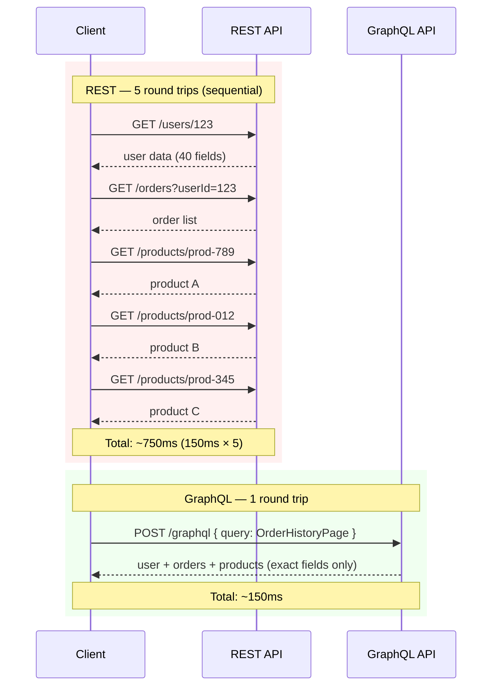

# 01 — Why GraphQL

> **Purpose:** Provide a rigorous technical argument for why GraphQL exists — grounded in real performance data, API lifecycle costs, and the historical context of its creation. This document is for engineers evaluating GraphQL adoption, migrating from REST, or being asked to justify the investment to leadership.

---

## Learning Objectives

- [ ] Explain the over-fetching and under-fetching problems with concrete latency and bandwidth numbers
- [ ] Describe why REST API versioning compounds indefinitely and how GraphQL's schema evolution model avoids it
- [ ] Articulate the original Facebook mobile performance problem that motivated GraphQL's design
- [ ] Produce a table-based comparison of GraphQL vs REST across 10 operational dimensions
- [ ] Identify scenarios where GraphQL is the right choice and where it is the wrong choice
- [ ] Recall the key milestones in GraphQL's adoption history and why each mattered

---

## Overview

GraphQL did not emerge from a desire to replace REST. It emerged from a specific engineering crisis: Facebook's iOS app in 2012 was nearly unusable on 2G networks because REST APIs designed for desktop were crushing mobile clients with enormous, fixed-shape JSON payloads. The engineers who built GraphQL were optimizing for a specific problem — **client-specified, minimal, strongly-typed data fetching** — and every design decision in the specification reflects that origin.

Understanding this origin story is prerequisite to understanding the trade-offs. GraphQL is not better than REST in absolute terms. It solves specific problems better than REST. Deploying it where those problems don't exist adds accidental complexity.

---

## The Problems GraphQL Was Designed to Solve

### Problem 1: REST Over-Fetching

**The scenario.** A mobile client renders a user profile card: name, profile photo URL, and last-login timestamp. Three fields.

The REST endpoint `GET /users/123` returns this response:

```json
{
  "id": "123",
  "firstName": "Alice",
  "lastName": "Nguyen",
  "email": "alice@example.com",
  "phoneNumber": "+1-415-555-0198",
  "dateOfBirth": "1990-03-15",
  "createdAt": "2019-07-01T10:00:00Z",
  "updatedAt": "2024-01-10T14:22:00Z",
  "lastLoginAt": "2024-11-20T09:15:00Z",
  "profilePhotoUrl": "https://cdn.example.com/photos/alice.jpg",
  "coverPhotoUrl": "https://cdn.example.com/covers/alice.jpg",
  "bio": "Software engineer at Example Corp...",
  "website": "https://alicenguyendev.com",
  "location": {
    "city": "San Francisco",
    "state": "CA",
    "country": "US",
    "timezone": "America/Los_Angeles"
  },
  "preferences": {
    "emailNotifications": true,
    "pushNotifications": false,
    "marketingEmails": false,
    "theme": "dark",
    "language": "en-US"
  },
  "subscription": {
    "plan": "pro",
    "renewalDate": "2025-02-01",
    "seats": 1
  },
  "paymentMethod": {
    "type": "card",
    "last4": "4242",
    "expiryMonth": 12,
    "expiryYear": 2026
  },
  "address": { ... },
  "accountFlags": { ... },
  "featureFlags": { ... }
}
```

The client uses 3 fields. It receives 40. The JSON serializer on the server computed all 40. The payload travels across the network fully. The mobile JSON parser processes all 40. The client discards 37.

**At scale, this compounds:**

| Metric | Impact |
|---|---|
| 10M daily active users | 10M unnecessary full-object deserializations per day |
| 40-field response vs 3-field response | ~13x payload size (rough estimate; depends on field sizes) |
| Mobile battery | JSON parsing is CPU-bound — unnecessary parsing drains battery |
| Cellular data | Users on metered plans pay for data they never see |
| Server serialization | CPU cycles wasted building JSON that will be discarded |
| CDN/proxy cache | Larger objects fill caches less efficiently |

The GraphQL equivalent fetches only what the client needs:

```graphql
query UserProfileCard($userId: ID!) {
  user(id: $userId) {
    firstName
    lastName
    profilePhotoUrl
    lastLoginAt
  }
}
```

Response: 4 fields. The server only resolves those 4 fields. The payload is a fraction of the size.

---

### Problem 2: REST Under-Fetching (Waterfall Requests)

**The scenario.** An order history page for an e-commerce app must display: user display name, list of orders with order date and total, and product names and thumbnail images for each product in each order.

With REST, this requires:

```
Step 1:  GET /users/123
         → { name: "Alice", ... }

Step 2:  GET /orders?userId=123
         → [{ id: "order-456", productIds: ["prod-789", "prod-012"], total: 94.98, ... },
            { id: "order-457", productIds: ["prod-345"], total: 29.99, ... }]

Step 3a: GET /products/prod-789     ← these 3 must wait for Step 2 to complete
Step 3b: GET /products/prod-012
Step 3c: GET /products/prod-345

Step 4 (optional): GET /images for each product thumbnail
```

**5+ sequential HTTP round trips.** Each adds 50–200ms of latency on a mobile network. On a 150ms average latency connection:

```
Total minimum latency = 150ms + 150ms + 150ms (parallel 3a/3b/3c) + ... ≈ 450ms
```

And that's in the optimistic case where Steps 3a/3b/3c are parallelized by the client. Many REST clients execute them sequentially, yielding:

```
Total minimum latency = 150ms × 5 = 750ms
```

Three-quarters of a second before the user sees any order data.

**GraphQL collapses this to a single request:**

```graphql
query OrderHistoryPage($userId: ID!) {
  user(id: $userId) {
    name
    orders {
      id
      createdAt
      total
      items {
        product {
          name
          thumbnailUrl
        }
        quantity
        unitPrice
      }
    }
  }
}
```

One HTTP round trip. The GraphQL server executes the resolver tree in parallel where possible (all product resolvers for an order execute concurrently). The client receives the complete page data in a single response.

**REST Waterfall vs GraphQL Single Fetch — Sequence Comparison:**



---

### Problem 3: API Versioning Accumulation

REST APIs grow through versioning. A breaking change to `/api/v1/users` requires `/api/v2/users`. Clients migrate on their own schedule — or never. The result:

- **v1** runs for users who haven't migrated (often 3–5+ years after release)
- **v2** runs for clients that completed migration
- **v3** is being designed because v2 missed requirements
- All three are maintained simultaneously: documentation, tests, security patches, on-call burden

**Real-world API versioning cost at a mid-size company:**

| Cost Item | Frequency | Impact |
|---|---|---|
| Maintaining 3 parallel version branches | Continuous | Every bug fix applied 3× |
| Client migration campaigns | Per major version | Months of engineering coordination |
| Deprecation notices + documentation | Per deprecated endpoint | Content maintenance burden |
| On-call alerts for v1 failures | Ongoing | Alerts for endpoints you wish didn't exist |
| New-hire onboarding: "which version should I use?" | Every hire | Cognitive overhead |

**GraphQL's approach: additive schema evolution.**

New fields are added to existing types without changing existing queries:

```graphql
type User {
  id: ID!
  name: String!
  email: String!
  # New field — existing queries that don't request this field are unaffected
  profilePhotoUrl: String
  # Deprecated field — still works, but signals intent to remove
  username: String @deprecated(reason: "Use name field instead. Removal after 2025-06-01.")
}
```

Old clients continue working because they never requested `profilePhotoUrl`. New clients request it. The deprecated `username` field remains functional through a defined SLA, with an automated lint rule flagging clients still using it.

**The rule:** In GraphQL, you can always add. You can never remove without going through a deprecation lifecycle. This is enforced by schema registry tools like Apollo GraphOS `rover subgraph check` and GraphQL Hive's schema diff.

---

### Problem 4: The Mobile Performance Crisis at Facebook (2012)

In 2012, Facebook was rebuilding its iOS app. The existing mobile app was an HTML5 wrapper — notoriously slow. The native app rebuild team faced a specific constraint: hundreds of millions of Facebook users were on 2G mobile networks in emerging markets. Devices were low-powered. Data was expensive. Battery life was short.

The REST API layer serving Facebook's web application was designed for desktop browsers on broadband connections. It returned large, fixed-shape JSON objects. Mobile teams requesting data for the News Feed — a complex nested graph of posts, users, comments, likes, linked articles, and ad objects — had to make dozens of API calls, each returning far more data than needed.

**Lee Byron, Nick Schrock, and Dan Schafer's insight** was to invert the data-fetching model: instead of the server defining what it returns, the client declares what it needs. The server executes only what was requested.

This design philosophy is visible in every aspect of the GraphQL specification:

- **Typed schema as contract** — because mobile apps can't tolerate undefined fields or unexpected type changes
- **Hierarchical queries** — because the News Feed is a graph, and flat REST resources don't represent it naturally
- **Strong typing at the protocol level** — because catching type mismatches at validation time, not at runtime on a user's phone, is critical
- **Introspection** — because mobile teams needed to explore the API without asking backend teams for documentation updates

The original GraphQL implementation was not open-sourced for 3 years (2012–2015) because Facebook used it as a competitive advantage in their mobile performance. When Lee Byron presented it at React Conf 2015, the community recognized immediately that the problems Facebook solved were universal.

---

## GraphQL's Core Value Proposition

### 1. Declarative Data Fetching

Clients describe the shape of data they need, not the endpoint they must call. The shape of the response matches the shape of the query — always. There are no surprises in the response structure.

```graphql
# Client declares exactly this shape
query {
  viewer {
    name
    avatar { url }
    recentOrders(limit: 3) {
      id
      total
      status
    }
  }
}

# Server returns exactly this shape
{
  "data": {
    "viewer": {
      "name": "Alice",
      "avatar": { "url": "https://cdn.example.com/alice.jpg" },
      "recentOrders": [
        { "id": "ord-1", "total": 94.98, "status": "DELIVERED" },
        { "id": "ord-2", "total": 29.99, "status": "SHIPPED" },
        { "id": "ord-3", "total": 12.50, "status": "PROCESSING" }
      ]
    }
  }
}
```

### 2. Single Endpoint

All operations go to one URL: `POST /graphql`. No route proliferation. No route versioning. No routing table to maintain. The schema is the routing table.

### 3. Strong Typing

Every field in a GraphQL schema has a declared type. Every query is validated against the schema before execution begins. A query requesting a non-existent field or passing the wrong type to an argument fails at validation — not at runtime when a user triggers the code path.

```graphql
# Schema definition
type Query {
  user(id: ID!): User
}

type User {
  id: ID!
  name: String!
  age: Int
}

# This query fails at validation, not runtime
query BadQuery {
  user(id: 123) {   # Error: Argument "id" has invalid value 123. Expected type "ID", found 123.
    name
    nonExistentField  # Error: Cannot query field "nonExistentField" on type "User".
  }
}
```

### 4. Self-Documenting via Introspection

The GraphQL introspection system allows any client to query the schema itself:

```graphql
{
  __schema {
    types {
      name
      description
      fields {
        name
        type { name kind }
        deprecationReason
      }
    }
  }
}
```

This powers tools like Apollo Sandbox, GraphiQL, and schema-aware IDE extensions. The documentation is always in sync with the API because it is generated from the same schema that executes queries.

### 5. Evolutionary API Design

The `@deprecated` directive enables a formal deprecation lifecycle:

```graphql
type Product {
  id: ID!
  name: String!
  # Original field — kept for backward compatibility
  price: Float @deprecated(reason: "Use priceInCents for precision. Removal after 2025-09-01.")
  # New field — integer to avoid floating-point rounding errors
  priceInCents: Int!
}
```

Schema registries like Apollo GraphOS and GraphQL Hive track deprecated field usage across all known clients, enabling data-driven decisions about when removal is safe.

---

## GraphQL vs REST: Comparison Table

| Dimension | REST | GraphQL |
|---|---|---|
| **Data fetching precision** | Fixed response shape defined by server | Client specifies exact fields; server returns only those |
| **Multiple resource requests** | N endpoints, potentially N sequential round trips | 1 endpoint, 1 round trip; nested resolution on server |
| **API versioning strategy** | URL versioning (`/v1`, `/v2`) — all run simultaneously | Additive evolution; `@deprecated` for removal lifecycle |
| **Schema and typing** | OpenAPI/Swagger spec (optional, often out of sync) | Built-in type system; mandatory; always in sync |
| **HTTP caching** | Native HTTP caching (GET requests cacheable by CDN) | APQ (Automatic Persisted Queries) required for CDN caching |
| **Tooling ecosystem** | Swagger UI, Postman, OpenAPI generators | Apollo Sandbox, GraphiQL, graphql-code-generator, Rover CLI |
| **Learning curve** | Familiar to all web developers | New query language, type system, resolver mental model |
| **Real-time operations** | WebSocket or SSE implemented separately | Subscriptions built into the protocol specification |
| **Error handling** | HTTP status codes (`200`, `404`, `500`) | `errors` array in response body; partial data + errors possible |
| **Introspection** | External documentation (Swagger) required | Built-in introspection queries; live, always-accurate |

---

## When GraphQL Is the Right Choice

**Strong fit:**

- **Complex, nested data relationships** — social graphs, e-commerce product catalogs with variants/options/inventory, content management with nested blocks/components
- **Multiple clients with different data needs** — web app, iOS, Android, and a partner API all consuming the same backend but needing different field subsets
- **Rapid frontend iteration without backend coordination** — front-end teams add fields to queries without backend releases when the fields already exist in the schema
- **API-first product companies** — when your GraphQL API is a public product (Shopify Storefront API, GitHub API v4)
- **Multi-domain data access via federation** — when data lives across 10+ microservices and clients shouldn't be responsible for orchestration
- **AI agent integration** — GraphQL's introspection system makes schemas machine-readable; LLM tool-use systems can discover and call operations programmatically

**Poor fit:**

- **Simple CRUD APIs with 1–2 clients** — REST is simpler, better understood, and HTTP caching works natively. GraphQL's overhead is not justified.
- **File upload/download-heavy APIs** — binary transfers belong at REST endpoints with S3 pre-signed URLs or direct multipart uploads. GraphQL is optimized for structured data.
- **Pure real-time streaming telemetry** — high-frequency time-series data (metrics, logs, sensor streams) should use SSE or WebSocket directly. GraphQL subscriptions add unnecessary overhead.
- **Teams with zero GraphQL expertise and hard deadlines** — the learning curve for resolvers, DataLoader, and federation is real. A team building their first GraphQL API under a hard deadline will produce a worse outcome than a REST API they know how to build.

---

## GraphQL Adoption Timeline

```mermaid
flowchart TD
    Y2012["2012\nFacebook builds GraphQL internally\nfor iOS app rebuild on 2G networks\n(Lee Byron, Nick Schrock, Dan Schafer)"]
    Y2015["2015\nOpen-sourced at React Conf\nLee Byron keynote — community adoption begins\nGraphQL.js reference implementation released"]
    Y2016["2016\nGitHub launches GraphQL API v4\nFirst major public GraphQL API\nShopify begins internal adoption"]
    Y2018["2018\nGraphQL Foundation formed\nunder the Linux Foundation\nLanguage-neutral governance established"]
    Y2019["2019\nApollo Federation v1 released\nEnables supergraph architecture\nacross multiple teams and services"]
    Y2020["2020\nApollo Router (Rust) announced\nOrder-of-magnitude performance improvement\nover Node.js Apollo Gateway"]
    Y2021["2021\nGraphQL Hive open-sourced\nFirst serious open-source alternative\nto Apollo GraphOS for schema registry"]
    Y2022["2022\nApollo Federation v2 released\nComposability overhaul —\nbreaking change resolution and @override"]
    Y2023["2023\nWunderGraph Cosmo open-sourced\nNetflix DGS reaches broad adoption\nFull Apache 2.0 stack for federation"]
    Y2024["2024+\nAI-native GraphQL patterns\nMCP (Model Context Protocol) integration\nGraphQL as structured tool interface for LLMs"]

    Y2012 --> Y2015 --> Y2016 --> Y2018 --> Y2019 --> Y2020 --> Y2021 --> Y2022 --> Y2023 --> Y2024
```



---

## Production Considerations

### Performance

GraphQL is not inherently slower than REST. The performance characteristics are different:

- **N+1 query problem** — Without DataLoader, fetching a list of 100 orders and then the user for each order fires 101 database queries. DataLoader batches and deduplicates these into 2 queries. This is the single most common performance issue in new GraphQL deployments. It is not a GraphQL limitation — it is a resolver implementation problem.
- **Query depth and complexity** — Deeply nested queries with unbounded lists can trigger exponential resolver execution. Complexity limits (implemented via `graphql-armor` or Apollo Router's demand control) must be configured from day one, not added later.
- **Parser overhead** — The GraphQL parser runs on every request for ad-hoc queries. Automatic Persisted Queries (APQ) cache the parsed document by hash, reducing parse overhead and enabling CDN caching for GET-based persisted queries.

### Security

REST's URL-based perimeter model doesn't apply to GraphQL. All requests go to one endpoint. Access control must be implemented at the field/resolver level.

- **Introspection in production** — Introspection is enabled by default in most frameworks. It exposes your full schema to anyone who can reach the endpoint. Disable it in production; provide access only through authenticated developer portals or Apollo Sandbox with API key authentication.
- **Query depth limits** — Without limits, a malicious query can nest `{ user { friends { friends { friends { ... } } } } }` 100 levels deep. This is a denial-of-service vector.
- **Field-level authorization** — REST authorization (does this user have access to this route?) maps poorly to GraphQL. Use a directive-based authorization pattern (e.g., `@auth(requires: ADMIN)`) with field-level enforcement.

### Scaling

The schema is a new scaling dimension that has no REST equivalent:

- **Schema composition latency** — In a federated supergraph, the router must compose subgraph schemas and build a query plan on startup (and on schema updates). This adds router startup latency and schema publication complexity.
- **Query planning cost** — Complex federated queries spanning many subgraphs require non-trivial query planning. Apollo Router caches query plans; cache hit rate is a key operational metric.
- **Subgraph proliferation** — Adding subgraphs increases schema composition complexity. Budget for this in platform capacity planning.

### Observability

GraphQL operations are not visible at the HTTP routing layer (all go to `POST /graphql`). Standard HTTP metrics (requests by route, error rate by endpoint) become meaningless.

- **Operation-level metrics** — Instrument by operation name (`query GetOrderHistory`, `mutation CreateOrder`). Apollo Router and GraphQL Yoga have built-in OpenTelemetry support.
- **Field-level tracing** — Track resolver execution time per field. Expensive resolvers are only visible with field-level tracing, not request-level metrics.
- **Error rate by operation** — GraphQL returns `200 OK` even when business errors occur (they appear in the `errors` array). Application-level error rate must be derived from response body inspection, not HTTP status codes.

---

## Best Practices

1. **Start GraphQL on new APIs; don't migrate stable REST APIs without a clear problem to solve.** The migration cost of wrapping REST with GraphQL is real. Quantify the over/under-fetching problem first — if it doesn't exist or is small, the migration is not worth it.

2. **Measure REST API call patterns before any migration.** Instrument your existing REST APIs for 30 days. Identify the top 10 most-called endpoints. Measure average payload size vs fields actually used. This data builds the business case and reveals the shape of the GraphQL schema.

3. **Design the schema for consumers, not for your database.** The greatest trap in early GraphQL adoption is generating a schema from an ORM or database schema. Your database schema is optimized for storage; your GraphQL schema should be optimized for your clients' use cases. These are different things.

4. **Plan for DataLoader from day one.** Retrofitting batch-aware resolvers into a production system that was built without DataLoader requires touching every resolver that loads related entities. Building DataLoader patterns into your resolver architecture from the beginning is an order of magnitude less costly.

5. **Treat the schema as a public API contract even for internal services.** The instinct to move fast and break things in internal services is understandable, but breaking schema changes in an internal GraphQL service can silently corrupt client queries in ways that are hard to detect without a schema registry and operation tracking.

---

## Anti-Patterns

### 1. GraphQL as a REST Proxy (The Thin Wrapper)

The failure mode: a team adds Apollo Server in front of 20 existing REST endpoints. Each GraphQL resolver makes an HTTP call to a REST endpoint. The GraphQL schema mirrors the REST response shapes exactly.

**Why this fails:** You've added two parsing steps (GraphQL parse → REST parse), two network hops (client→GraphQL, GraphQL→REST), and zero improvement in over/under-fetching (the resolvers still call REST endpoints that return 40 fields when 3 are needed). You've inherited all the REST problems and added GraphQL operational complexity on top.

The correct approach is to have GraphQL resolvers call data sources directly (database drivers, gRPC clients, or well-bounded internal service clients) and design the schema for the consumer's needs.

### 2. REST Versioning Anti-Pattern in GraphQL (`queryV2` fields)

The failure mode: instead of evolving the schema with `@deprecated` and backward-compatible changes, a team adds `userV2`, `createOrderV2`, `productDetailsV2` fields to avoid the discipline of proper schema evolution.

**Why this fails:** This recreates the REST versioning problem inside a single GraphQL schema. The schema becomes polluted with parallel versions of the same concepts. Clients can't tell which version to use. The `V2` fields accumulate without a removal plan. Ten months in, there are `V3` fields appearing.

The correct approach is additive evolution: add new fields to existing types, deprecate old fields with explicit removal dates, use schema registry usage analytics to confirm safe removal.

### 3. GraphQL for Everything

The failure mode: because GraphQL is working well for the product API, a team routes all operations through it — including bulk CSV exports (50MB data sets), binary file uploads, high-frequency metrics polling, and webhook event streams.

**Why this fails:** GraphQL is optimized for structured, hierarchical, request/response data access. It adds overhead (parsing, validation, execution planning) that is unjustifiable for operations where simpler protocols are better fits. Bulk data export should be an async job with a REST download endpoint. Binary uploads should use multipart REST with direct S3 integration. High-frequency metrics polling should use SSE or a time-series protocol.

---

## Operational Notes

- GraphQL schema changes require coordination with a schema registry in any multi-team environment. A schema change that looks safe in isolation can break a downstream consumer. Always run `rover subgraph check` or `hive schema:check` before merging schema changes.
- The `errors` array in a GraphQL response is not equivalent to an HTTP error status. A `200 OK` response with a non-empty `errors` array is an application error. Alert configurations must inspect response bodies, not only HTTP status codes.
- Do not rely on request-level HTTP logs to understand GraphQL usage. Operation names, field access patterns, and per-field timing require GraphQL-native instrumentation.

---

## References

- GraphQL Specification: https://spec.graphql.org/
- GraphQL Official Site: https://graphql.org/
- Facebook Engineering Blog — "GraphQL: A Data Query Language" (2015): https://engineering.fb.com/2015/09/14/core-infra/graphql-a-data-query-language/
- GraphQL Foundation: https://graphql.org/foundation/
- Lee Byron — "Exploring GraphQL" React Europe 2015: https://www.youtube.com/watch?v=WQLzZf34FJ8
- GitHub GraphQL API v4 announcement: https://github.blog/news-insights/product-news/the-github-graphql-api/
- Apollo "Principled GraphQL": https://principledgraphql.com/
- DataLoader GitHub repository: https://github.com/graphql/dataloader
- graphql-armor security middleware: https://github.com/Escape-Technologies/graphql-armor

---

## Related Topics

- [README — Introduction folder overview](./README.md)
- [02 — GraphQL Ecosystem](./02-graphql-ecosystem.md) — Tools that implement these concepts
- [03 — Enterprise GraphQL Journey](./03-enterprise-graphql-journey.md) — How these problems manifest at organizational scale
- [`../01-graphql-fundamentals/`](../01-graphql-fundamentals/) — Type system, SDL, and query language mechanics
- [`../04-resolvers-and-execution/`](../04-resolvers-and-execution/) — DataLoader, resolver patterns, execution model
- [`../05-security/`](../05-security/) — Depth limits, complexity limits, introspection control
- [`../06-performance-and-scaling/`](../06-performance-and-scaling/) — APQ, caching, query planning performance
