# 02 — The GraphQL Ecosystem

> **Purpose:** Map the full GraphQL tooling landscape — server frameworks, federation routers, schema registries, client libraries, and CI/CD tooling — with enough vendor-specific context to make informed adoption decisions. This is a reference, not a beginner survey.

---

## Learning Objectives

- [ ] Describe the GraphQL specification's role in enabling a multi-vendor ecosystem
- [ ] Compare server frameworks across languages and identify the right choice per deployment context
- [ ] Distinguish Apollo Router from Apollo Gateway and understand when to use each
- [ ] Evaluate Apollo GraphOS vs GraphQL Hive vs WunderGraph Cosmo for schema registry needs
- [ ] Select the appropriate client library for a given team and caching complexity
- [ ] Identify CI/CD tooling that belongs in every GraphQL pipeline
- [ ] Explain why graphql-code-generator is non-negotiable for TypeScript teams

---

## The GraphQL Specification

GraphQL is a **specification**, not a software package. The specification — maintained by the GraphQL Foundation under the Linux Foundation — defines:

- **The type system:** scalars (`Int`, `Float`, `String`, `Boolean`, `ID`), object types, interfaces, unions, enums, input types, and the built-in directive system (`@deprecated`, `@skip`, `@include`, `@specifiedBy`)
- **The query language:** query operations, mutation operations, subscription operations, fragments (named and inline), aliases, variables, and directives
- **The execution model:** how a server resolves a query document against a schema — the order of resolver execution, null propagation rules, and the behavior of lists
- **The response format:** the `data` and `errors` top-level keys, error object structure (`message`, `locations`, `path`, `extensions`)
- **The introspection system:** the `__schema`, `__type`, and `__typename` meta-fields that allow runtime schema discovery

Because the specification is language-neutral, any team can implement it in any language. This is why there are production-grade GraphQL servers in Rust, Go, Java, Python, Ruby, Elixir, PHP, and .NET — all interoperable at the protocol level. A Rust subgraph and a Java subgraph can be composed into the same Apollo Router federation graph because they both implement the same specification.

**The specification version** currently in active use is the `October 2021` edition. The Working Group is actively developing the next edition, with incremental delivery, `@defer`, `@stream`, and `@oneOf` among the proposed additions.

---

## Ecosystem Architecture: Layers

```mermaid
flowchart LR
    subgraph Clients["Client Layer"]
        AC["Apollo Client\nReact/Angular/Vue"]
        urql["urql\nReact/Svelte"]
        Relay["Relay\nReact (Meta)"]
        GQLReq["graphql-request\nNode / scripts"]
    end

    subgraph Router["Router / Gateway Layer"]
        ApolloRouter["Apollo Router\n(Rust, ELv2)"]
        Cosmo["Cosmo Router\n(Rust, Apache 2.0)"]
        Gateway["Apollo Gateway\n(Node.js, legacy)"]
        Mesh["GraphQL Mesh\n(Node.js, MIT)"]
    end

    subgraph Servers["Server / Subgraph Layer"]
        ApolloServer["Apollo Server\n(Node.js/TS)"]
        Yoga["GraphQL Yoga\n(Node.js/TS)"]
        DGS["Netflix DGS\n(Java/Spring)"]
        HotChoc["Hot Chocolate\n(.NET)"]
        gqlgen["gqlgen\n(Go)"]
        Strawberry["Strawberry\n(Python)"]
    end

    subgraph Registry["Schema Registry Layer"]
        GraphOS["Apollo GraphOS\n(hosted SaaS)"]
        Hive["GraphQL Hive\n(open-source / cloud)"]
        CosmoReg["Cosmo Schema Registry\n(open-source)"]
    end

    subgraph CICD["CI/CD Tooling Layer"]
        Rover["Rover CLI\n(Apollo)"]
        HiveCLI["Hive CLI"]
        Inspector["GraphQL Inspector"]
        ESLint["graphql-eslint"]
        CodeGen["graphql-code-generator"]
    end

    subgraph Observability["Observability Layer"]
        OTel["OpenTelemetry\nCollector"]
        Prometheus["Prometheus\n+ Grafana"]
        GraphOSMetrics["Apollo GraphOS\nMetrics (paid)"]
    end

    Clients --> Router
    Router --> Servers
    Servers --> Registry
    Registry --> CICD
    Router --> Observability
    Servers --> Observability
```



---

## The GraphQL Specification

### Spec Governance

The [GraphQL Working Group](https://github.com/graphql/graphql-wg) meets monthly. Proposals go through a staged RFC process (Proposal → Draft → Accepted). The `graphql-js` reference implementation (maintained by the GraphQL Foundation) is the canonical implementation of the spec. All production server frameworks validate against `graphql-js` behavior.

The spec's stability is a strategic asset: upgrading a server framework doesn't change the query language your clients use. The protocol is stable; the implementations compete on performance, developer experience, and features layered on top of the spec (federation, caching, plugin systems).

---

## Server Frameworks

### Node.js / TypeScript

**Apollo Server** — The reference implementation for Apollo Federation subgraphs. Supports both schema-first (SDL) and code-first (using libraries like `@graphql-tools/schema`). The plugin system is mature: Apollo Server plugins power cache control, response caching, usage reporting, and inline tracing. Most Apollo ecosystem documentation assumes Apollo Server.

```typescript
import { ApolloServer } from '@apollo/server';
import { startStandaloneServer } from '@apollo/server/standalone';
import { buildSubgraphSchema } from '@apollo/subgraph';

const server = new ApolloServer({
  schema: buildSubgraphSchema({ typeDefs, resolvers }),
  plugins: [
    ApolloServerPluginInlineTrace(),
    ApolloServerPluginUsageReporting({ sendVariableValues: { none: true } }),
  ],
});

const { url } = await startStandaloneServer(server, { listen: { port: 4001 } });
```

**GraphQL Yoga** — Built on the Fetch API; runs natively on Node.js, Bun, Deno, Cloudflare Workers, and AWS Lambda without adaptation. Maintained by The Guild. First-class support for `@defer` and `@stream` incremental delivery. Envelop plugin system for cross-cutting concerns.

```typescript
import { createYoga } from 'graphql-yoga';
import { createServer } from 'node:http';

const yoga = createYoga({
  schema,
  plugins: [useDepthLimit({ maxDepth: 10 }), useResponseCache({ session: () => null })],
});

createServer(yoga).listen(4001);
```

**Mercurius** — Fastify-native GraphQL server with JIT compilation of resolvers. The JIT compilation step converts GraphQL field resolution into optimized JavaScript functions, resulting in significantly higher throughput than interpretation-based execution. Best choice when the GraphQL layer itself is a throughput bottleneck and the team is already on Fastify.

### Java (JVM)

**Netflix DGS (Domain Graph Service) Framework** — Spring Boot native. Code-first using `@DgsComponent` and `@DgsQuery` / `@DgsMutation` annotations. Federation support is built in; DGS subgraphs compose cleanly with Apollo Router. DataLoader support via `DgsDataLoader` annotation. Netflix runs DGS in production across dozens of teams.

```java
@DgsComponent
public class OrdersDataFetcher {
    @DgsQuery
    public List<Order> orders(@InputArgument String userId) {
        return orderService.getOrdersByUser(userId);
    }

    @DgsEntityFetcher(name = "Order")
    public Order fetchOrderById(Map<String, Object> values) {
        return orderRepository.findById((String) values.get("id"));
    }
}
```

**Spring for GraphQL** — The official Spring team's GraphQL integration (since Spring Boot 2.7). Schema-first. Uses `@QueryMapping`, `@MutationMapping`, `@SchemaMapping`. Integrates with Spring Security for field-level authorization. Supports both servlet and reactive (WebFlux) stacks.

### Go

**gqlgen** — Code-first, type-safe, generated. The developer defines the schema in SDL; gqlgen generates Go interfaces that the developer implements. The generated code is strongly typed — there are no `interface{}` resolver return types. Resolver functions are plain Go — no reflection overhead at runtime.

```go
// Generated by gqlgen — implement this interface
func (r *queryResolver) User(ctx context.Context, id string) (*model.User, error) {
    return r.db.GetUser(ctx, id)
}
```

### Python

**Strawberry** — Code-first using Python type hints and decorators. Async-native (compatible with FastAPI, Starlette, Django async). The type annotation approach means schema types are Python dataclasses with full IDE support.

```python
import strawberry
from typing import Optional

@strawberry.type
class User:
    id: strawberry.ID
    name: str
    email: str

@strawberry.type
class Query:
    @strawberry.field
    async def user(self, id: strawberry.ID) -> Optional[User]:
        return await user_service.get(id)

schema = strawberry.Schema(query=Query)
```

### .NET (C#)

**Hot Chocolate** — Code-first with a fluent API or attribute-based approach. Built-in support for filtering, sorting, and pagination via `UseFiltering()`, `UseSorting()`, `UsePaging()` middleware. Deep Entity Framework Core integration for automatic data source optimization. Federation support included.

### Rust

**async-graphql** — Code-first using derive macros. Maximum performance — suitable for WASM compilation targets. Used when GraphQL performance is the primary constraint or when building GraphQL tooling itself.

---

### Server Framework Comparison Table

| Framework | Language | Paradigm | Federation Support | Key Differentiator |
|---|---|---|---|---|
| Apollo Server | Node.js/TypeScript | Schema-first + code-first | First-class | Largest ecosystem; Apollo plugin system |
| GraphQL Yoga | Node.js/TypeScript | Schema-first + code-first | Via `@graphql-tools/federation` | Edge-native; Fetch API; Envelop plugins |
| Mercurius | Node.js (Fastify) | Schema-first | Plugin available | JIT compilation; highest Node.js throughput |
| Netflix DGS | Java (Spring Boot) | Code-first (annotations) | Built-in | Production-battle-tested at Netflix scale |
| Spring for GraphQL | Java (Spring) | Schema-first + code-first | Community support | Official Spring team; Spring Security integration |
| gqlgen | Go | Code-first (generated) | Via plugin | Type-safe generated code; no runtime reflection |
| Strawberry | Python | Code-first (type hints) | Via `strawberry-graphql-django` | Modern Python async; FastAPI compatible |
| Hot Chocolate | .NET (C#) | Code-first | Built-in | EF Core integration; built-in filtering/pagination |
| async-graphql | Rust | Code-first (macros) | Built-in | Maximum throughput; WASM compatible |

---

## Federation and Router Tools

Federation is the architecture pattern where multiple GraphQL servers (subgraphs) are composed into a single unified graph (supergraph) by a router. Clients query only the router; the router fetches from the appropriate subgraphs and merges the results.

### Apollo Router (Rust)

The production router for Apollo Federation graphs. Rewritten from Node.js (Apollo Gateway) to Rust for a 3–5× throughput improvement and dramatically lower memory consumption. Key capabilities:

- **WASM plugin system** — Custom authorization, header manipulation, and traffic shaping via WASM modules (Rhai scripting also supported)
- **Demand control** — Built-in complexity budgets and query cost calculation without third-party middleware
- **Distributed caching** — Redis-backed persisted query cache and entity cache
- **APQ (Automatic Persisted Queries)** — Hash-based query registration for GET-based CDN caching
- **Native OpenTelemetry** — Traces, metrics, and logs to any OTLP-compatible collector

```yaml
# router.yaml — minimal production configuration
supergraph:
  listen: 0.0.0.0:4000

health_check:
  listen: 0.0.0.0:8088

sandbox:
  enabled: false  # Disable in production

introspection: false  # Disable introspection in production

limits:
  max_depth: 12
  max_height: 200
  max_aliases: 30
  max_root_fields: 20

telemetry:
  exporters:
    tracing:
      otlp:
        enabled: true
        endpoint: http://otel-collector:4317
```

License: Elastic License v2 (ELv2) — free for non-competing use; cannot offer it as a managed service.

### WunderGraph Cosmo Router (Rust)

Fully Apache 2.0 licensed; implements the Apollo Federation v2 specification, so subgraphs built for Apollo Router are compatible. Developed by WunderGraph as a fully open alternative. Combined with the Cosmo Schema Registry, provides a complete open-source federation stack.

The license distinction matters for companies that self-host their tooling and have policies against non-OSI-approved licenses: Cosmo Router is Apache 2.0; Apollo Router is ELv2.

### Apollo Gateway (Node.js) — Legacy

The original Node.js federation gateway. Apollo's documented migration path is to Apollo Router. Do not start new projects on Apollo Gateway. It remains in maintenance mode for existing deployments.

### GraphQL Mesh

A Node.js gateway that goes beyond pure GraphQL federation: it can compose GraphQL schemas with REST APIs (OpenAPI/Swagger), gRPC services, database schemas (Prisma, MySQL, PostgreSQL introspection), and other data sources into a single unified GraphQL API. Not a replacement for Apollo Router in pure GraphQL federation scenarios, but highly useful for:
- Wrapping legacy REST services in a unified GraphQL layer without rewriting them
- Composing polyglot data sources when GraphQL adoption is gradual

---

### Federation Tool Comparison

| Tool | Language | License | Apollo Fed v2 | Key Differentiator |
|---|---|---|---|---|
| Apollo Router | Rust | ELv2 | Native | Fastest router; WASM plugins; official Apollo toolchain |
| WunderGraph Cosmo Router | Rust | Apache 2.0 | Compatible | Fully open-source; combined registry + router offering |
| Apollo Gateway | Node.js | MIT | Yes (v2 via upgrade) | Legacy; maintenance mode — migrate to Apollo Router |
| GraphQL Mesh | Node.js | MIT | Yes | REST + gRPC + OpenAPI composition alongside GraphQL |

---

## Schema Registries

A schema registry is the source of truth for your GraphQL schema. It stores schema versions, performs composition validation (can these subgraph schemas compose successfully?), detects breaking changes, and tracks which clients use which fields.

### Apollo GraphOS

The hosted SaaS schema registry from Apollo. Deepest integration with Apollo Router (native telemetry and schema delivery). Key capabilities:

- **Schema checks** — `rover subgraph check` validates composition and detects breaking changes before merge
- **Field usage analytics** — tracks which clients request which fields, enabling data-driven deprecation decisions
- **Contract graphs** — filtered subsets of the supergraph for specific consumer audiences (e.g., public partner API vs internal teams)
- **Launches** — atomic schema deployments with rollback capability
- **Comet** — schema change notification system

Cost: Free tier for development; paid plans for production usage above limits. The managed cloud model means Apollo manages schema composition infrastructure.

### GraphQL Hive (The Guild)

Open-source schema registry; self-hostable or available as a cloud service at graphql-hive.com. Key capabilities:

- **Schema publish and check** — `hive schema:publish` and `hive schema:check` with breaking change detection
- **Usage reporting** — same field-level usage analytics as GraphOS, built from OpenTelemetry data
- **Self-hostable** — full Docker Compose and Helm chart deployment; useful for teams with data residency requirements or anti-SaaS policies
- **Multi-project** — manage multiple graphs across teams from one registry

License: MIT. The entire source is at https://github.com/graphql-hive/platform.

### WunderGraph Cosmo Registry

Combined with the Cosmo Router as a unified open-source stack. Schema storage, composition, and breaking change detection. Provides a dashboard for router metrics correlated with schema changes.

---

## Client Libraries

### Apollo Client

The most feature-complete GraphQL client. Core value: the normalized `InMemoryCache` — every queried entity is stored by its `id` and `__typename`, so if the same entity appears in 10 different queries, updating it in one query automatically updates all 10. Key features:

- Optimistic UI updates with cache write-through
- Reactive queries — components re-render when cached data changes
- Local state management via `makeVar` reactive variables
- `@client` directive for client-only fields
- Network layer (links): authentication, error handling, batching, APQ

Best for: large-scale React, Angular, or Vue applications where normalized cache consistency is important across many concurrent queries.

### urql

A smaller, more modular alternative. The exchange system (urql's equivalent of Apollo Links) is composable and well-documented. Simpler normalized cache via `@urql/exchange-graphcache`. First-class Svelte support. Smaller bundle size.

Best for: apps that don't need the full Apollo Client feature set, or teams that find Apollo Client's cache configuration complex.

### Relay

Meta's production client. Fragment-centric — data requirements are co-located with components using `useFragment`. The Relay compiler performs static analysis of all operations at build time, generating optimized code. Relay enforces strict naming conventions (`<TypeName>_<fieldName>` fragment naming) and Connections spec for pagination.

Best for: very large-scale React applications where maximum performance and strict data-fetching discipline are requirements. The learning curve and compiler setup overhead are significant — Relay is not the right choice for small teams or early-stage products.

### graphql-request

A minimal HTTP client for GraphQL. No cache. Sends a request, returns the response. Used in Node.js scripts, SSR data-fetching functions (where you don't want a full client bundle), CLI tools, and AI agent integrations.

```typescript
import { GraphQLClient, gql } from 'graphql-request';

const client = new GraphQLClient('https://api.example.com/graphql', {
  headers: { Authorization: `Bearer ${token}` },
});

const data = await client.request(gql`
  query GetUser($id: ID!) {
    user(id: $id) { name email }
  }
`, { id: '123' });
```

### TanStack Query + gql.tada

A pattern rather than a dedicated library. TanStack Query (React Query) manages server state caching and synchronization; `gql.tada` provides TypeScript type inference for GraphQL operations from SDL without a code generation step. Suitable for teams that already use TanStack Query and prefer its mental model over Apollo Client's cache.

---

### Client Library Comparison

| Library | Framework | Cache Strategy | Bundle Size | Best For |
|---|---|---|---|---|
| Apollo Client | React/Angular/Vue/Next | Normalized InMemoryCache | ~50KB (min+gz) | Complex apps with high cache consistency needs |
| urql | React/Svelte/Vue | Document or normalized (opt-in) | ~15KB (min+gz) | Lighter apps; simpler cache requirements |
| Relay | React | Fragment-based normalized | ~60KB (min+gz) | Large-scale React apps; strict perf discipline |
| graphql-request | Any (Node/browser) | None | ~4KB (min+gz) | Scripts, SSR, server-to-server, AI agents |
| TanStack Query + gql.tada | React | Server state (TanStack cache) | ~15KB combined | Teams preferring React Query patterns |

---

## Developer Tooling

### Rover CLI (Apollo)

The official CLI for schema management in the Apollo ecosystem. Essential commands:

```bash
# Validate a subgraph schema change against the registry
rover subgraph check my-graph@production \
  --schema ./schema.graphql \
  --name products

# Publish a subgraph schema
rover subgraph publish my-graph@production \
  --schema ./schema.graphql \
  --name products \
  --routing-url https://products-service.internal/graphql

# Introspect a running GraphQL server
rover graph introspect https://localhost:4001/graphql

# Compose a local supergraph for development
rover supergraph compose --config supergraph.yaml
```

### Hive CLI (The Guild)

Equivalent CLI for GraphQL Hive schema management:

```bash
# Check for breaking changes and composition issues
hive schema:check --service products ./schema.graphql

# Publish schema to registry
hive schema:publish --service products \
  --url https://products-service.internal/graphql \
  ./schema.graphql

# Report operation usage (run in your GraphQL server)
hive usage:report
```

### GraphQL Inspector

Static analysis tool for schema diffs, breaking change detection, and schema validation. Integrates directly with GitHub Actions and other CI systems.

```bash
# Detect breaking changes between two schema versions
graphql-inspector diff old-schema.graphql new-schema.graphql

# Validate all operation documents against a schema
graphql-inspector validate ./src/**/*.graphql ./schema.graphql

# Check for similar types (potential schema duplication)
graphql-inspector similar ./schema.graphql
```

Breaking change output:

```
✖ Field 'User.username' was removed.
  → Breaking change detected. Existing clients using this field will receive errors.

⚠ Field 'User.email' changed type from 'String' to 'String!'.
  → Dangerous change: clients that handle null 'email' will need to update.

✔ Field 'User.profilePhotoUrl' was added.
  → Non-breaking change.
```

### graphql-eslint

ESLint rules for GraphQL schemas and operation documents. Lints both `.graphql` files and inline `gql` template literals in JavaScript/TypeScript.

```json
// .eslintrc.json
{
  "overrides": [
    {
      "files": ["*.graphql"],
      "extends": "plugin:@graphql-eslint/schema-recommended",
      "rules": {
        "@graphql-eslint/require-description": ["error", { "types": true, "fields": true }],
        "@graphql-eslint/naming-convention": ["error", {
          "types": "PascalCase",
          "fieldDefinitions": "camelCase",
          "arguments": "camelCase",
          "EnumValueDefinition": "UPPER_CASE"
        }],
        "@graphql-eslint/no-deprecated": "warn",
        "@graphql-eslint/fields-on-correct-type": "error"
      }
    }
  ]
}
```

### graphql-code-generator

Generates TypeScript types (and React hooks, resolver types, SDK methods) from GraphQL schemas and operation documents. Eliminates the entire class of "type mismatch between what the server returns and what the client expects" bugs.

```yaml
# codegen.yml
schema: https://api.example.com/graphql
documents: ./src/**/*.graphql
generates:
  ./src/generated/graphql.ts:
    plugins:
      - typescript
      - typescript-operations
      - typescript-react-apollo
    config:
      withHooks: true
      withComponent: false
      reactApolloVersion: 3
  ./src/generated/resolvers.ts:
    plugins:
      - typescript
      - typescript-resolvers
    config:
      contextType: '../context#GraphQLContext'
```

Running `graphql-codegen` generates:
- TypeScript types for all schema types
- Typed interfaces for all query/mutation variables and response shapes
- React hooks (`useGetUserQuery`, `useCreateOrderMutation`) with full type inference
- Resolver type signatures (server-side) that match the schema definition

### graphql-armor

Security middleware for GraphQL servers. Provides configurable protection against common attack vectors:

```typescript
import { createYoga } from 'graphql-yoga';
import { EnvelopArmor } from '@escape.tech/graphql-armor';

const armor = new EnvelopArmor({
  costLimit: { maxCost: 5000, defaultCost: 1 },
  maxDepth: { n: 12 },
  maxTokens: { n: 1000 },
  maxAliases: { n: 15 },
  maxDirectives: { n: 50 },
});

const yoga = createYoga({ schema, plugins: [...armor.protect().plugins] });
```

### Apollo Sandbox

Browser-based interactive schema explorer. Available at https://sandbox.apollo.dev. Connects to any GraphQL endpoint (local or remote) for schema exploration, query building, and operation testing. Supports persisted query registration and authenticated endpoints via header configuration.

---

### Developer Tooling Summary

| Tool | Purpose | When to Use |
|---|---|---|
| Rover CLI | Apollo schema registry management | Apollo GraphOS users; CI/CD schema checks and publishes |
| Hive CLI | GraphQL Hive schema registry management | GraphQL Hive users; open-source registry workflows |
| GraphQL Inspector | Schema diff, breaking change detection, operation validation | Every project; CI pipeline gate before merge |
| graphql-eslint | Lint schemas and operations | Every TypeScript/JavaScript project with GraphQL |
| graphql-code-generator | TypeScript type generation from schema + operations | Every TypeScript project; non-negotiable |
| graphql-armor | Security middleware (depth, complexity, aliases) | Every production GraphQL server |
| Apollo Sandbox | Interactive schema explorer | Local development, debugging, partner onboarding |

---

## Production Considerations

### Performance

- **graphql-code-generator at build time, not runtime** — code generation should run as a CI step producing committed artifacts, not as a dev server that regenerates on every change. Generated types should be version-controlled.
- **Client library bundle sizes matter** — Apollo Client adds ~50KB (minified + gzipped) to a browser bundle. For applications where initial load time is critical, evaluate urql (~15KB) or graphql-request with TanStack Query.
- **Apollo Router vs Apollo Gateway throughput** — Apollo Router (Rust) handles ~5–10× more requests per second than Apollo Gateway (Node.js) at equivalent memory. At high traffic volumes (>1000 req/s per instance), this difference is significant in infrastructure cost.

### Security

- **Schema registry authentication** — Rover CLI and Hive CLI both support API key authentication. API keys for CI should be scoped to read (check) vs write (publish) separately; never use a write-capable key in a read-only check step.
- **graphql-eslint in pre-commit hooks** — catching schema violations at commit time is faster feedback than catching them in CI. Use `husky` + `lint-staged` to run `graphql-eslint` on changed `.graphql` files.
- **Dependency pinning** — GraphQL ecosystem packages (especially `graphql-js`) have had security-relevant releases. Pin exact versions in `package-lock.json` and run automated dependency update PRs (Dependabot or Renovate).

### Scaling

- **Code generation outputs should be cached in CI** — `graphql-codegen` runs can be slow on large schemas. Cache based on the hash of the schema file and operation documents.
- **Multiple registry environments** — maintain separate schema registry graphs for `development`, `staging`, and `production`. Schema changes should be promoted through environments, not published directly to production.

### Observability

- **Schema change audit trail** — every schema publish to a registry should record: who published, what changed, when, from which CI pipeline run. Both Apollo GraphOS and GraphQL Hive provide this audit log natively.
- **Instrument graphql-code-generator run time** — as schemas grow, code generation can exceed 30 seconds. Track this as a developer experience metric; slow code generation degrades the development loop.

---

## Best Practices

1. **Don't let framework choice drive architecture.** Any server framework that supports the Apollo Federation subgraph specification can compose with Apollo Router or Cosmo Router. A Java DGS subgraph, a Go gqlgen subgraph, and a Node.js GraphQL Yoga subgraph can all be composed in the same supergraph. Choose the framework based on your team's language expertise and the deployment target.

2. **Use graphql-code-generator regardless of client library.** Whether you use Apollo Client, urql, or graphql-request, type-safe generated hooks and response types eliminate a category of runtime bugs. The time investment in setting up codegen is recovered in the first week of development.

3. **Run GraphQL Inspector in every CI pipeline even before you have a formal schema registry.** A basic schema diff check that fails the build on breaking changes is free to configure and protects you from accidental breaking changes in the period between "team started using GraphQL" and "team set up a proper registry."

4. **Evaluate schema registries on governance features, not just storage.** Any registry can store a schema. The differentiating features are: breaking change detection accuracy, field-level usage analytics (which clients use which fields), schema composition validation, and the developer workflow for managing change SLAs. These features determine whether the registry actually improves your governance posture.

---

## Anti-Patterns

### 1. Deep Vendor Lock-in: Same Vendor for Router + Registry + Client

Apollo Router (ELv2) + Apollo GraphOS + Apollo Client creates a stack where every layer is tied to Apollo's pricing and roadmap. This is not inherently wrong — the Apollo stack is production-proven — but it should be a deliberate choice, not the result of default selection at each layer.

The Apollo Federation protocol is an open specification. You can use Apollo Router with GraphQL Hive as your registry. You can use Cosmo Router with Apollo Client as your client library. Evaluate each layer independently.

### 2. Skipping a Client Library for "Simplicity" in Large Applications

The reasoning: "We'll just use `fetch` directly and write our own cache." This works for the first 10 queries. As the application grows to 100+ query sites, the absence of a normalized cache means:
- The same entity displayed in 3 places on a page gets fetched 3 times
- Updating an entity in one mutation requires manually refreshing every query that might display that entity
- You build a cache anyway — but it's an underdocumented, edge-case-filled version of Apollo Client's InMemoryCache

Use Apollo Client, urql, or Relay. The cache implementation complexity has been solved.

### 3. Running Apollo Gateway in New Projects

Apollo Gateway (the original Node.js federation gateway) is in maintenance mode. Apollo's own documentation directs teams to Apollo Router. Starting a new federated architecture on Apollo Gateway means planning a migration to Apollo Router within 12–18 months. Invest that time in starting on Apollo Router directly.

---

## Operational Notes

- `graphql-js` is a transitive dependency of nearly every GraphQL tool. Mismatched `graphql-js` versions between packages cause cryptic "Cannot use GraphQLSchema from another module or realm" errors. Pin `graphql` to a single version using `npm overrides` or `yarn resolutions`.
- Apollo Router WASM plugin compilation requires `wasm-pack` and a Rust toolchain. Budget for build environment setup if you plan to write custom WASM plugins.
- GraphQL Hive's self-hosted deployment requires ClickHouse (for usage analytics), PostgreSQL (for schema storage), and Redis (for sessions). Review the resource requirements before committing to self-hosting.
- `graphql-code-generator` version 3.x (the `@graphql-codegen/*` scoped packages) is not backward compatible with version 2.x. Check migration guides before upgrading across major versions.

---

## References

- GraphQL Specification: https://spec.graphql.org/
- GraphQL Foundation GitHub (graphql-js, GraphQL Inspector): https://github.com/graphql
- Apollo Documentation: https://www.apollographql.com/docs/
- Apollo Router GitHub: https://github.com/apollographql/router
- GraphQL Yoga Documentation: https://the-guild.dev/graphql/yoga-server
- GraphQL Hive: https://graphql-hive.com/ and https://github.com/graphql-hive/platform
- WunderGraph Cosmo: https://wundergraph.com/cosmo and https://github.com/wundergraph/cosmo
- Netflix DGS Framework: https://netflix.github.io/dgs/
- gqlgen: https://gqlgen.com/
- Strawberry GraphQL: https://strawberry.rocks/
- Hot Chocolate Documentation: https://chillicream.com/docs/hotchocolate
- graphql-code-generator: https://the-guild.dev/graphql/codegen
- graphql-eslint: https://the-guild.dev/graphql/eslint
- GraphQL Inspector: https://graphql-inspector.com/
- graphql-armor: https://github.com/Escape-Technologies/graphql-armor
- DataLoader: https://github.com/graphql/dataloader

---

## Related Topics

- [README — Introduction folder overview](./README.md)
- [01 — Why GraphQL](./01-why-graphql.md) — The problems this ecosystem was built to solve
- [03 — Enterprise GraphQL Journey](./03-enterprise-graphql-journey.md) — How tool selection evolves across adoption stages
- [`../07-federation/`](../07-federation/) — Apollo Federation architecture and Apollo Router configuration in depth
- [`../09-schema-governance/`](../09-schema-governance/) — Schema registry workflows, breaking change management
- [`../10-schema-validation/`](../10-schema-validation/) — GraphQL Inspector, graphql-eslint, schema linting
- [`../12-github-actions/`](../12-github-actions/) — CI pipeline patterns with Rover CLI and GraphQL Inspector
- [`../05-security/`](../05-security/) — graphql-armor configuration, introspection control, query complexity
