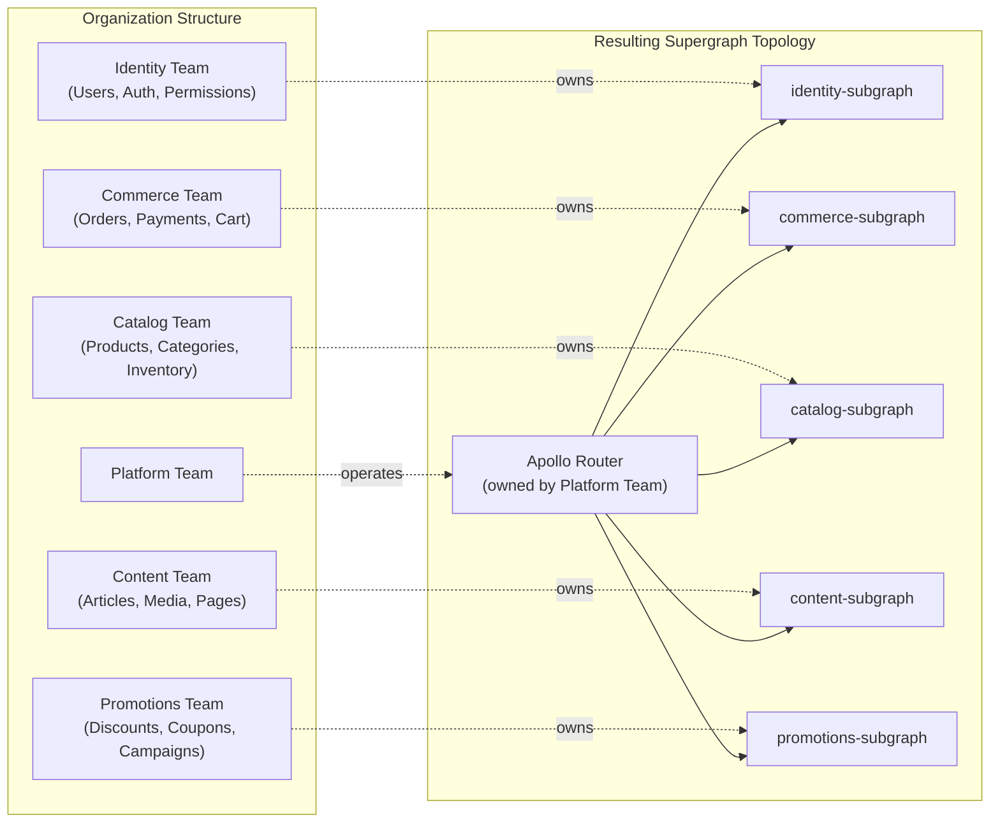

# 03 — The Enterprise GraphQL Adoption Journey

> **Purpose:** Document the real stages of enterprise GraphQL adoption — the technical decisions, organizational patterns, failure modes, and governance evolution that emerge as GraphQL scales from a single team experiment to a multi-region federated supergraph. This document synthesizes patterns observed across companies at various adoption stages. It is written for platform engineers, architects, and engineering leads making or reviewing GraphQL investment decisions.

---

## Learning Objectives

- [ ] Describe the five stages of enterprise GraphQL adoption and the characteristic problems of each
- [ ] Identify the organizational catalysts that drive companies from one stage to the next
- [ ] Explain Conway's Law in the context of federation subgraph topology design
- [ ] Recognize the governance anti-patterns that compound schema debt
- [ ] Apply the organizational lessons from mature GraphQL adopters to an active adoption program

---

## Overview

GraphQL adoption in enterprises almost never follows a clean, planned arc. It starts with one team solving a specific problem. Success creates pull from adjacent teams. The proliferation of independent GraphQL implementations creates the governance crisis that forces consolidation. Consolidation introduces the platform team. The platform team's quality and product mindset determines whether GraphQL becomes a competitive advantage or an expensive maintenance burden.

Understanding this arc — and the predictable failure modes at each stage — allows platform teams to make proactive investments rather than reactive fixes.

---

## The Five Stages of Enterprise GraphQL Adoption

### Stage 1 — Experiment

**Scale:** 1–5 engineers, 1–3 services.

**Characteristics:**
A single team, usually working on a new product feature or internal tool, adopts GraphQL because it solves a concrete problem they have today: too many REST round trips for a complex UI, a need to let a mobile team and a web team request different field shapes, or a technical lead who has seen GraphQL in a previous company.

The implementation is a single GraphQL server (Apollo Server or GraphQL Yoga). No federation. No schema registry. No CI validation. Success is measured entirely in developer productivity and the product outcome — does the feature ship faster? Does the mobile app actually load faster?

**Common tools:** Apollo Server or GraphQL Yoga, Apollo Client for the web frontend, simple JWT middleware for authentication.

**What works:**
- Developer experience is demonstrably better for the team that adopted it
- The team ships the feature and the GraphQL API is a success by their metrics
- A compelling demo draws interest from other teams

**What goes wrong:**
The team builds with no thought for governance because governance is overhead when you're 3 engineers proving a concept. The schema naming conventions are informal ("it's just one service"). There is no breaking change protection because there is only one consumer (the team's own frontend). The team's success demo creates a problem: 5 other teams now want their own GraphQL endpoint.

**The invisible risk:** The schema design decisions made at Stage 1 with no governance often become load-bearing walls at Stage 3. The `User` type defined during the experiment becomes the canonical `User` type other teams reference. Its design flaws are inherited by every subsequent consumer.

---

### Stage 2 — Fragmentation

**Scale:** 10–50 engineers, 5–20 services.

**Characteristics:**
Multiple teams independently adopt GraphQL. Each team builds their own GraphQL server. Each server has its own schema, its own conventions (or intentional lack thereof), and its own endpoint. A product that requires data from multiple domains now requires the frontend to query 3–5 different GraphQL endpoints — reproducing the multi-endpoint waterfall problem that GraphQL was supposed to solve.

**Observable symptoms:**

| Symptom | Example |
|---|---|
| Inconsistent field naming | Team A uses `userId`, Team B uses `user_id`, Team C uses `userID` |
| Duplicate type definitions | Each service has its own `User` type with different fields and semantics |
| Inconsistent pagination | Team A uses cursor-based, Team B uses offset, Team C returns raw arrays |
| No shared authentication pattern | Each endpoint has different token formats and error responses |
| No deprecation discipline | Fields are removed when developers think they're unused |

**The accumulation problem:**
```
Frontend page render requires:
  - Query 1: POST https://users-graphql.internal/graphql
  - Query 2: POST https://orders-graphql.internal/graphql
  - Query 3: POST https://catalog-graphql.internal/graphql
  - Query 4: POST https://promotions-graphql.internal/graphql
```

The waterfall problem is back. Except now it has GraphQL overhead on top of REST overhead, because each "GraphQL API" is itself a thin wrapper over internal REST services.

**The catalyst for change:** A platform team (or a senior engineer with platform responsibilities) forms after a bad incident — a schema change in the orders service removes a field that 3 frontends depend on. The schema change was not validated, not communicated, and discovered when users saw errors. This incident is the forcing function that drives Stage 3 investment.

**What the team learns at Stage 2:**
- GraphQL governance is a real cost, not a nice-to-have
- Schema changes across team boundaries need a protocol
- Developer productivity improvements in individual teams are offset by cross-team integration friction

---

### Stage 3 — Consolidation

**Scale:** 30–100 engineers, 10–30 services.

**Characteristics:**
Federation or a gateway is introduced. The platform team (often 2–4 engineers at this point) sets up Apollo Router or Cosmo Router and begins the work of converting existing GraphQL servers into federation-compatible subgraphs. The schema registry is configured. `rover subgraph check` (or the Hive equivalent) runs in CI pipelines.

Schema conventions are documented. A style guide exists. Breaking change detection runs in CI. But convention enforcement is still largely manual: code review comments, Slack messages to team channels, periodic schema audits.

**The federation migration pain:**

Federation migration is never "done." The largest service (often a Node.js backend that accumulated business logic over years) becomes the "monolith subgraph" — it composes correctly but is too large to operate efficiently, contains types that logically belong to other domains, and becomes a bottleneck when any schema change touches it.

Teams resist splitting the monolith subgraph because:
- It works today
- The split requires coordinating 3–5 teams to move type ownership
- The `@key` directive relationships are not obvious across the current codebase
- Federation v2's `@shareable` and `@override` directives weren't understood when the original schema was written

**Key milestones:**
- First `rover subgraph check` failure catches a breaking change before it reaches production — this is the moment the team believes in the registry
- First automated schema publication on merge to main — removes the "I forgot to publish the schema" failure mode
- First cross-team schema RFC — documents a process for proposing changes that affect multiple subgraph owners

**Common pain points at Stage 3:**
- Governance is still a human bottleneck (every breaking change needs platform team approval)
- Schema composition errors surface in CI but the error messages are not always actionable for the subgraph owner
- The routing URL configuration (where each subgraph lives) is maintained manually and drifts between environments
- Teams don't understand the performance implications of `@requires` directives across subgraphs

---

### Stage 4 — Platform

**Scale:** 50–200 engineers, 30–50 subgraphs.

**Characteristics:**
A formal GraphQL Platform team exists — not a collection of senior engineers with platform responsibilities, but a dedicated team with product-level accountability for the developer experience of building subgraphs.

**What the platform team owns:**

| Responsibility | Tooling / Artifact |
|---|---|
| Schema registry operations | Apollo GraphOS or GraphQL Hive; automated schema publication from CI |
| Router fleet | Apollo Router or Cosmo Router; multi-replica Kubernetes deployment; canary rollout |
| CI workflow templates | GitHub Actions reusable workflows for schema check, publish, lint |
| Governance policies | Policy-as-code (OPA) for schema rules; automated enforcement, not human gates |
| Documentation portal | Backstage or custom portal; schema docs, runbooks, onboarding guides |
| Subgraph onboarding | Golden path template repo; 2-hour setup to first schema publish |
| Breaking change SLAs | Automated tracking of deprecated field age; alerts when SLA expires |
| Performance observability | OpenTelemetry instrumentation guides; per-operation dashboards |

**What changes at Stage 4:**
- Governance gates are automated — a non-breaking schema change merges without human review; a breaking change triggers an automated RFC requirement
- Developer experience is measured — time to first schema publish, build time for CI schema check, onboarding time for new subgraph teams
- The router fleet is a managed service — subgraph teams don't think about router configuration; they publish schemas and the platform team ensures routing is updated

**The platform team as a product team:**
The GraphQL Platform team's customers are other engineering teams. The "product" is the developer experience of building and operating a GraphQL subgraph. This mental model change is critical: a platform team that measures success by "number of incidents prevented" will build defensive tooling. A platform team that measures success by "developer satisfaction score" and "time to first production deploy for a new subgraph" will build golden paths.

---

### Stage 5 — Enterprise Scale

**Scale:** 200+ engineers, 50+ subgraphs, multi-region.

**Characteristics:**
Multiple federated graphs for different products or business units. Contract graphs (filtered supergraph views) for external partners and public API consumers. Multi-region router topology with latency-aware routing. Cost attribution per team (each team's subgraph query load is measured and billed back).

**Key capabilities at Stage 5:**

- **Contract graphs** — The full internal supergraph contains fields and types that external partners should never see. Contract graphs are filtered projections of the supergraph published to partner-specific schema registries.
- **Multi-region schema consistency** — Schema publications must propagate to routers in US, EU, and APAC simultaneously. A schema promotion process that doesn't guarantee this creates split-brain scenarios where the EU router is serving a different schema version than the US router.
- **AI agent integration** — The GraphQL schema's introspection system is machine-readable. LLM-based agents can discover available operations and execute them without human-written client code. Schema design discipline (clear operation names, good descriptions, consistent argument patterns) becomes more important because the consumer is a language model, not a human developer.

**Key challenges at Stage 5:**

| Challenge | Root Cause | Mitigation |
|---|---|---|
| Schema ownership ambiguity at scale | Types referenced across 10+ subgraphs have no clear owner | Schema CODEOWNERS files; ownership registry in Backstage |
| Cross-team breaking change coordination | Teams on different release cycles | Automated deprecation tracking; `@deprecated` SLA enforcement tooling |
| Multi-region schema consistency | Schema publish without geographic promotion guarantee | GitOps schema promotion with region-specific deployment verification |
| AI compatibility of schema design | LLMs need clear, descriptive schema elements | Schema description requirements enforced by graphql-eslint |
| Cost attribution without chargeback tooling | Router metrics not mapped to team ownership | Team tagging via router operation routing; custom cost allocation dashboards |

---

## Common Enterprise Challenges

The following table documents challenges that appear predictably as organizations scale, the stage where they first become acute, and the patterns that address them.

| Challenge | Stage First Appears | Why It Happens | Solution Pattern |
|---|---|---|---|
| "Who owns this type?" | Stage 2 | No ownership model defined when schemas were created | Federation `@key` ownership tracking; CODEOWNERS on schema files |
| N+1 storm in production | Stage 1–2 | DataLoader not implemented; resolvers call database per entity | DataLoader-first resolver pattern; field-level tracing to detect N+1 |
| Breaking change deployed to production | Stage 2 | No CI schema validation; no registry | `rover subgraph check` in every PR; registry-enforced promotion |
| Schema drift (staging schema ≠ prod schema) | Stage 3 | Manual schema publishes from developer laptops | GitOps for schema: merge to main triggers automated publish |
| Governance bottleneck | Stage 3–4 | Human approval required for all schema changes | Policy-as-code: automated gates for non-breaking; async RFC for breaking |
| Undocumented deprecated fields accumulate | Stage 3 | No deprecation SLA or automated enforcement | `graphql-eslint` rule enforcing description on `@deprecated`; age tracking |
| Introspection enabled in production | Stage 1–3 | Default-enabled in most frameworks; never explicitly disabled | Router config: `introspection: false`; dev portal with auth for schema access |
| Performance invisible to subgraph teams | Stage 2–3 | No resolver-level observability; only HTTP-level metrics | OpenTelemetry with field-level tracing; per-operation dashboards per team |
| Federation `@requires` causing latency spikes | Stage 3–4 | Cross-subgraph field dependencies not modeled carefully | Query plan visualization in Apollo Sandbox; `@requires` cost review in schema RFC |
| Monolith subgraph growing without bounds | Stage 3–4 | Splitting requires organizational coordination that never happens | Formal subgraph boundary definitions; schema team code review for new types |

---

## Conway's Law and Schema Design

> "organizations which design systems (in the broad sense used here) are constrained to produce designs which are copies of the communication structures of these organizations."
>
> — Melvin Conway, 1967

Conway's Law is not an abstract software engineering principle in the GraphQL context — it is an operational reality. Every enterprise that adopts federation at scale discovers that their supergraph topology is a mirror of their org chart. Not because someone planned it that way, but because the path of least resistance for each team is to build a subgraph that matches the scope of their ownership.

**The mapping in practice:**



**The organizational trap:**
Conway's Law creates a federation topology that reflects team boundaries — but team boundaries are optimized for team autonomy, not for data access patterns. When an `Order` needs to include `Product` details and `User` details and `Promotion` details, the router must fan out to 4 subgraphs and merge the results. This is federation working correctly — but the query planning cost of this fan-out is proportional to the number of cross-subgraph joins.

Organizations that fight their org chart (creating "shared" subgraphs that span team boundaries) create ownership ambiguity and deployment coordination problems. The pragmatic approach is to embrace the org-chart topology and invest in query plan optimization and subgraph performance rather than fighting organizational structure.

**The shared type trap:**
Platform teams are tempted to create "shared" or "common" subgraphs containing types used by many teams: `User`, `Address`, `Money`, `Timestamp`. This centralizes a critical dependency. Changes to the shared subgraph require sign-off from every team that uses it. The shared subgraph becomes a deployment bottleneck and a political battleground.

The federation alternative: each team owns the fields of `User` that are relevant to their domain. The commerce team owns `User.orders`. The identity team owns `User.email` and `User.roles`. The catalog team owns `User.wishlists`. Federation `@key` directive stitches these together without requiring a shared owner.

---

## Organizational Lessons from Enterprise Adopters

### 1. The Platform Team Is a Product Team

The GraphQL Platform team's output is not a set of systems — it is a developer experience. The internal engineering teams are the customers. A platform team that doesn't talk to its customers, measure their satisfaction, or track the friction in their workflows will build infrastructure that works but isn't used.

Concretely: measure time to first schema publish for a new subgraph team. If it takes 2 weeks, that is a product defect. Fix the golden path until it takes 2 hours.

### 2. Automated Gates Scale; Human Gates Don't

At Stage 3, a human approving every schema change is manageable: there are 5 schema changes per week across 10 teams. At Stage 4, there are 50 schema changes per week across 40 teams. Human approval at that rate becomes a full-time job and a bottleneck that slows down every team.

The investment in policy-as-code (OPA policies, graphql-eslint rules, automated breaking change detection) pays compounding returns. Every rule that's automated is a governance decision that scales infinitely.

### 3. Schema RFC Processes Should Be Asynchronous

The instinct is to schedule a meeting when a breaking schema change needs cross-team approval. Meetings serialize decision-making. An async GitHub Issue-based RFC process — propose the change, 48-hour window for objections, auto-approve if no blockers — is 5× faster and creates an audit trail that meetings don't.

Example RFC template elements:
- What change is being made (SDL diff)
- Why this change is needed (link to product requirement)
- Which consumers are affected (from schema registry usage analytics)
- Migration path for affected consumers
- Proposed deprecation SLA before removal
- 48-hour response window

### 4. Invest in Golden Paths Early

A golden path is a template that provides everything a new team needs to build and operate a subgraph correctly: project template with correct dependency versions, CI workflow pre-configured for schema check and publish, Dockerfile, Kubernetes deployment manifests, OpenTelemetry instrumentation, `README` with onboarding steps.

The golden path costs 2–4 weeks to build at Stage 3. It pays back in every subsequent team onboarding. Without it, each team makes different choices in each of those dimensions, creating a supergraph that is operationally inconsistent.

### 5. Don't Let the Monolith Subgraph Grow

The monolith subgraph is the one that started before federation was adopted. It contains types from 10 different domains because it was built by one team before domain boundaries were formalized. It is the hardest subgraph to change (it touches everything), the hardest to deploy (everything has to deploy together), and the most common source of schema conflicts.

Enforcing federation boundaries from day one — even when a single team owns everything — is much less costly than extracting types from a monolith subgraph two years later. A simple rule: if a type's primary key belongs to a different domain, it should be in a different subgraph.

---

## Production Considerations

### The Schema as a Shared Contract

In a federated supergraph, the schema is not a single team's artifact — it is a shared contract among every team that publishes a subgraph and every client that queries the router. Treating it with less rigor than a public API contract — because it's "just internal" — leads to the breaking change incidents that drive Stage 3 formation.

A useful frame: if your schema change would require a migration campaign if your GraphQL API were public, it should require the same rigor internally. The SLAs may differ (internal consumers can move faster than external ones), but the process discipline should be the same.

### Schema Governance Debt

Schema governance debt compounds faster than technical code debt. A codebase with technical debt is still executable. A schema with governance debt — undocumented deprecated fields, types with ambiguous ownership, inconsistent naming conventions, missing descriptions — erodes every team's ability to move confidently.

Governance debt compounds because:
- Each new team that onboards to the supergraph inherits the existing schema as a template
- Inconsistent patterns in early types get replicated by teams that use them as examples
- Deprecated fields that aren't removed accumulate until the schema is so large that field discovery is impaired

Governance debt is cheaper to address incrementally (enforce graphql-eslint rules on new fields, run deprecation cleanup sprints quarterly) than to address in a single refactoring effort.

### Multi-Region Federation Consistency

Single-region federation is operationally tractable. Multi-region federation introduces a new class of consistency problem: when a schema is published to the registry, how quickly does each region's router fleet receive and apply it?

Naive approaches (each region polls the registry independently) result in temporary inconsistency where US routers serve schema version N+1 while EU routers serve version N. If a new operation added in N+1 is only valid against a subgraph that has also been updated, and EU clients send that operation to EU routers still on version N, they receive errors.

The solution pattern is atomic regional promotion: publish the schema to staging, verify all subgraphs in all regions have deployed their updated implementations, then promote the schema to the production registry. GitOps-based schema promotion with per-region health checks makes this reliable.

---

## Best Practices

1. **Appoint a schema owner for every subgraph before writing the first line of SDL.** The schema owner is accountable for schema review quality, deprecation SLA compliance, and cross-team communication when a schema change affects other teams. Without a named owner, schema quality degrades and breaking changes slip through.

2. **Instrument schema change metrics from day one.** Track deployment frequency (how often is the schema published), lead time (how long from schema RFC to production), and schema check failure rate (how often does CI catch a problem before merge). These metrics reveal governance health and identify process bottlenecks.

3. **Write schema RFCs for breaking changes.** The discipline of writing a one-page RFC — "what is changing, why, who is affected, what is the migration path" — prevents impulsive breaking changes and creates an institutional memory of why the schema looks the way it does. Schema RFCs stored in a GitHub repository alongside the schema SDL are a powerful onboarding artifact.

4. **Treat schema complexity as technical debt.** Too many subgraphs with too many `@requires` directives across subgraph boundaries creates query planning overhead that is invisible until it causes latency problems under load. Periodically review query plans for the most-used operations and refactor subgraph boundaries if the fan-out is excessive.

---

## Anti-Patterns

### 1. Teams Writing Their Own Governance Tooling

At Stage 2–3, teams with strong engineers sometimes build their own schema diff tools, their own deprecation trackers, their own breaking change detectors. This is well-intentioned but counterproductive.

Each home-built governance tool has different coverage, different false-positive rates, and different CI integration. When the platform team tries to establish consistent governance across all teams, they now have to harmonize 5 different implementations. Use GraphQL Inspector, Rover CLI, or Hive CLI uniformly — these tools are battle-tested, maintained by the community, and integrate with standard CI workflows.

### 2. The Platform Team as Schema Police

The failure mode: the platform team requires manual review and approval for every schema change. Teams submit schema changes as PRs to a platform team repository. The platform team reviews them for convention compliance. This becomes a queue that grows faster than the platform team can drain it.

Teams begin to experience the platform team as a blocker rather than an enabler. They find workarounds (making their schema changes non-breaking in form but breaking in semantics, adding new fields that silently replace old ones). The governance process loses legitimacy.

The fix: automate what can be automated (graphql-eslint enforces conventions, `rover subgraph check` enforces composition and breaking change rules). Reserve platform team review for architecturally significant changes (new subgraph onboarding, major type redesigns, cross-team `@key` relationships). Empower teams to merge non-breaking changes autonomously.

### 3. Big-Bang REST-to-GraphQL Migration

The scenario: leadership approves a 6-month initiative to migrate the entire REST API surface area to GraphQL. All 80 REST endpoints, all existing clients, all in one project.

This approach fails for several reasons:
- The GraphQL schema must be designed for consumers, but in a big-bang migration there is no time to interview consumers and understand their actual data needs. The schema ends up mirroring the REST response shapes.
- Client migration cannot be coordinated with backend migration on a 6-month timeline across 200 engineers. Either clients are forced onto an incomplete schema or the backend waits for clients to migrate, creating a coordination deadlock.
- The 6-month project reveals that some REST endpoints are doing things GraphQL isn't suited for (file uploads, streaming), requiring scope changes mid-project.

The working alternative: incremental adoption with clear value at each step. Identify the 3 REST API call patterns with the highest over-fetching or waterfall cost. Build the GraphQL schema to solve exactly those patterns. Migrate those clients. Measure the outcome. Use the evidence to justify the next increment.

---

## Operational Notes

- Every stage of the adoption journey has a different primary risk. Stage 1: no governance, schema debt accumulates. Stage 2: fragmentation, waterfall problem returns. Stage 3: federation migration is never done, governance is a bottleneck. Stage 4: platform team becomes a bureaucracy instead of an enabler. Stage 5: organizational complexity outpaces tooling.
- The transition between stages is always driven by an incident or a pain point, not a proactive architectural decision. Understanding the characteristic incident for each stage allows platform teams to invest proactively before the incident occurs.
- Schema design decisions made at Stage 1 are the hardest to change. If you are at Stage 1 today, the highest-leverage investment is a 2-page schema design guide that addresses naming conventions, pagination patterns, and error type design. It takes an afternoon and prevents months of cleanup later.

---

## References

- Apollo "Principled GraphQL": https://principledgraphql.com/
- Apollo "State of the Supergraph" survey and technotes: https://www.apollographql.com/docs/technotes/
- GraphQL Foundation membership and governance resources: https://graphql.org/foundation/
- Martin Fowler on Conway's Law: https://martinfowler.com/bliki/ConwaysLaw.html
- Melvin Conway's original paper (1968): https://www.melconway.com/Home/Committees_Paper.html
- Netflix Tech Blog — DGS Framework adoption: https://netflixtechblog.com/open-sourcing-the-netflix-domain-graph-service-framework-graphql-for-spring-boot-92b9dcecda18
- GitHub Engineering Blog — GraphQL API v4: https://github.blog/engineering/graphql-github-s-internal-superpower/
- WunderGraph Cosmo documentation: https://cosmo-docs.wundergraph.com/
- OpenTelemetry for GraphQL: https://opentelemetry.io/docs/

---

## Related Topics

- [README — Introduction folder overview](./README.md)
- [01 — Why GraphQL](./01-why-graphql.md) — Technical foundations that underpin adoption decisions
- [02 — GraphQL Ecosystem](./02-graphql-ecosystem.md) — The tools referenced throughout this adoption journey
- [`../07-federation/`](../07-federation/) — Apollo Federation architecture for Stage 3+ supergraph design
- [`../08-supergraph-architecture/`](../08-supergraph-architecture/) — Multi-subgraph topology patterns and query planning
- [`../09-schema-governance/`](../09-schema-governance/) — Schema registry workflows, RFC processes, breaking change SLAs
- [`../19-platform-engineering/`](../19-platform-engineering/) — Building the internal developer platform around GraphQL
- [`../20-internal-developer-platforms/`](../20-internal-developer-platforms/) — Backstage integration, golden paths, onboarding automation
- [`../35-governance-models/`](../35-governance-models/) — Policy-as-code, OPA, automated governance gate patterns
