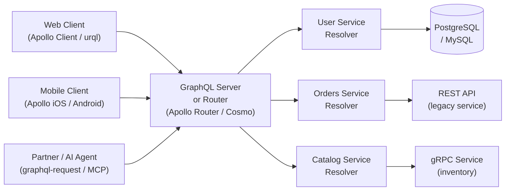

# 00 — Introduction to GraphQL

> **Purpose:** Orient engineers to GraphQL's motivation, ecosystem position, and enterprise relevance before diving into implementation, federation, or platform topics. This folder requires no prior GraphQL knowledge — it is the starting point for the entire reference.

---

## What This Folder Covers

This folder answers three questions every engineer joining a GraphQL-based platform asks:

1. **Why does this technology exist?** — The real-world problems at Facebook in 2012 that GraphQL was designed to solve, and how those problems manifest at scale in any company.
2. **What does the ecosystem look like?** — The full tooling landscape: server frameworks, federation routers, schema registries, client libraries, and CI/CD tooling — with vendor-specific context, not generic descriptions.
3. **How do enterprises actually adopt it?** — A stage-by-stage adoption arc from a single team experiment to a 200-engineer multi-region federated supergraph, including the organizational and governance lessons learned along the way.

---

## Prerequisites

None. This is the entry-level folder. Engineers with deep REST experience will benefit most from `01-why-graphql.md`. Engineers evaluating tooling should jump to `02-graphql-ecosystem.md`. Platform engineers and architects should read `03-enterprise-graphql-journey.md` closely.

---

## Reading Guide

| File | What You Will Learn | Estimated Time |
|---|---|---|
| `README.md` (this file) | Folder orientation, GraphQL in one page, reading guide | 5 min |
| `01-why-graphql.md` | Root problems GraphQL solves, REST comparison, when to use it | 20–25 min |
| `02-graphql-ecosystem.md` | Full tooling landscape: servers, routers, registries, clients, CI tooling | 20–25 min |
| `03-enterprise-graphql-journey.md` | 5-stage enterprise adoption model, organizational patterns, Conway's Law implications | 25–30 min |

---

## 5 Things to Know Before You Start

### 1. What IS GraphQL?

GraphQL is a **query language for APIs** and a **runtime for executing those queries** against a typed schema. Clients send a document describing exactly the fields they need; the server returns exactly that shape. The schema defines all available types and operations — it is both the contract and the source of truth.

GraphQL is a **specification** (maintained by the GraphQL Foundation under the Linux Foundation), not an implementation. There are dozens of production-grade server implementations across every major language.

### 2. Where It Came From

GraphQL was built at **Facebook in 2012** by Lee Byron, Nick Schrock, and Dan Schafer during a rebuild of the Facebook iOS app. The core problem: mobile clients on 2G networks were drowning in massive JSON payloads from REST APIs designed for desktop. GraphQL let mobile teams request exactly the 5 fields they needed from a 40-field REST response. Facebook open-sourced it in 2015 at React Conf. GitHub shipped their GraphQL API v4 in 2016. The GraphQL Foundation formed in 2018.

### 3. Who Uses It in Production?

Facebook/Meta (the original), GitHub (public API v4), Shopify (storefront and admin APIs), Twitter/X, Netflix, Airbnb, Atlassian, PayPal, The New York Times, Expedia, and hundreds of enterprises running internal supergraphs. Apollo's "State of the Supergraph" surveys consistently show federation adoption in organizations with 50+ engineers.

### 4. What Problem Does It Solve?

Three compounding problems that every REST API eventually develops at scale:

- **Over-fetching** — REST endpoints return fixed response shapes; clients receive fields they never use, wasting bandwidth and server serialization.
- **Under-fetching** — A single UI view requires data from 4–6 endpoints, forcing sequential HTTP round trips, each adding 50–200ms of latency on mobile.
- **API versioning accumulation** — `/v1`, `/v2`, `/v3` all run forever; breaking changes require version forks and years-long client migration campaigns.

GraphQL collapses the first two to a single typed request and solves the third through additive schema evolution with `@deprecated` lifecycle management.

### 5. What GraphQL Is NOT

| Misconception | Reality |
|---|---|
| "GraphQL is a database query language" | GraphQL is an API layer; it has no awareness of databases. Resolvers call any backend they choose. |
| "GraphQL is REST v2" | GraphQL is architecturally different — one endpoint, typed schema, client-driven queries. REST and GraphQL solve different problems and coexist. |
| "GraphQL is only for React / frontend" | GraphQL servers run independently of any frontend framework. Server-to-server calls, CLI tools, and AI agents all consume GraphQL APIs. |
| "GraphQL is slow" | GraphQL is a protocol, not a performance constraint. N+1 resolver problems and missing DataLoader implementations cause performance issues — not GraphQL itself. |
| "GraphQL replaces REST" | They complement each other. GraphQL excels at complex, multi-domain data access. REST remains appropriate for file operations, simple CRUD, and pure streaming. |

---

## GraphQL System Position

---

## GraphQL vs REST at a Glance

| Dimension | REST | GraphQL |
|---|---|---|
| Endpoint model | One URL per resource | One URL for all operations |
| Response shape | Fixed by server | Declared by client |
| Multiple resources | N requests, N round trips | 1 request with nested fields |
| Versioning | `/v1`, `/v2` URL paths | Additive evolution + `@deprecated` |
| Type system | Optional (OpenAPI) | Mandatory, built-in |
| Real-time | Separate WebSocket/SSE setup | Subscriptions in the spec |
| Error signals | HTTP status codes | `errors` array in response body |
| Caching | Native HTTP GET caching | Requires APQ for CDN caching |
| Schema discovery | External docs or Swagger | Built-in introspection queries |

---

## Key Terms

| Term | Definition |
|---|---|
| **Schema** | The typed definition of all operations and data types available in a GraphQL API |
| **SDL (Schema Definition Language)** | The text syntax used to write GraphQL schemas (`.graphql` files) |
| **Resolver** | A function that returns the value for a single field in the schema |
| **Query** | A read operation; analogous to HTTP GET |
| **Mutation** | A write operation; analogous to HTTP POST/PUT/DELETE |
| **Subscription** | A real-time operation; server pushes updates to the client |
| **Fragment** | A reusable selection set that can be included in multiple operations |
| **Directive** | A schema or operation annotation (e.g., `@deprecated`, `@skip`, `@include`) |
| **Federation** | The architecture pattern where multiple GraphQL servers compose into a single unified graph |
| **Subgraph** | An individual GraphQL service that is part of a federated supergraph |
| **Router** | The entry-point service in a federated graph that routes queries to subgraphs (e.g., Apollo Router) |
| **Supergraph** | The composed graph that clients query; the union of all subgraph schemas |
| **Schema Registry** | A service that stores schema versions, validates composition, and detects breaking changes |
| **DataLoader** | A utility for batching and deduplicating database/API calls within a single request cycle |
| **Introspection** | The built-in GraphQL capability for clients to query the schema structure at runtime |
| **APQ (Automatic Persisted Queries)** | A protocol for caching query documents by hash, enabling GET-based CDN caching |

---

## Related Topics

- [01 — Why GraphQL](./01-why-graphql.md) — Deep technical rationale, REST comparison, adoption history
- [02 — GraphQL Ecosystem](./02-graphql-ecosystem.md) — Tooling landscape, vendor comparison, CI/CD tooling
- [03 — Enterprise GraphQL Journey](./03-enterprise-graphql-journey.md) — Adoption stages, organizational patterns, governance

For next-level topics after this folder, proceed to:
- [`../01-graphql-fundamentals/`](../01-graphql-fundamentals/) — Type system, SDL, queries, mutations, subscriptions
- [`../07-federation/`](../07-federation/) — Apollo Federation architecture, subgraph design, router configuration
- [`../09-schema-governance/`](../09-schema-governance/) — Breaking change management, schema registries, governance models
