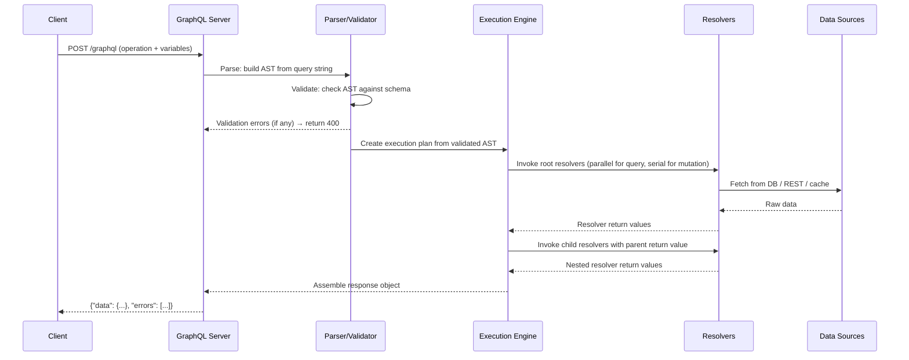

# GraphQL Queries and Mutations

> **Purpose:** Master the two most common GraphQL operation types — queries (reads) and mutations (writes). This document covers the full anatomy of each operation, the execution model that drives them, and the production patterns that separate working code from production-grade code. Engineers who complete this section will be able to write correct, debuggable, secure operations and recognize common failure patterns before they reach production.

---

## Learning Objectives

- [ ] Explain every syntactic component of a GraphQL query: operation type, operation name, field selection, arguments, variables, aliases, fragments, and directives
- [ ] Write a parameterized query using variables instead of string interpolation
- [ ] Explain why operation names are mandatory in production and what breaks without them
- [ ] Write a mutation using the entity + `userErrors` response pattern
- [ ] Explain why mutations execute serially while query fields execute in parallel
- [ ] Explain how idempotency keys prevent duplicate side effects on retried mutations
- [ ] Identify the four most dangerous anti-patterns in production queries and mutations

---

## Overview / Architecture

The execution model for queries and mutations follows the same pipeline from client to response, with one critical difference in resolver scheduling: query fields execute in parallel, mutation fields execute serially.



**Parse** — The server passes the query string through `graphql-js`'s parser, which builds an Abstract Syntax Tree (AST). This is pure string parsing with no schema knowledge.

**Validate** — The AST is checked against the schema. Field names are verified to exist on the declared type, argument types are checked, variable usage is validated. Validation errors are returned before any resolver runs.

**Execute** — The execution engine walks the AST. For each field, it calls the resolver function. The resolver for a nested field receives the return value of its parent resolver as the `parent` (also called `root` or `source`) argument.

---

## Core Concepts

### The Field Selection Model

GraphQL's central promise is that the client specifies exactly which fields it needs. This is not a convenience feature — it is the architectural decision that drives performance (no overfetching), schema design (fields must be independently resolvable), and caching behavior.

Every response mirrors the shape of the query. If you ask for `user { name email }`, you get back `{ "user": { "name": "...", "email": "..." } }`. There are no implicit fields, no surprise keys, no envelope — the response shape is deterministic from the query shape.

### Resolvers Receive Parent Data

Each field maps to a resolver function. The resolver for `user.profile.avatarUrl` receives the object returned by the `user.profile` resolver as its first argument. This parent-child chain is how deeply nested queries work without requiring the root resolver to pre-fetch everything.

Understanding this chain is critical for N+1 analysis and DataLoader optimization (covered in [04-resolvers-and-execution](../04-resolvers-and-execution/)).

### Queries vs Mutations: Side Effects and Ordering

The operation type keyword is not just documentation — it changes execution behavior:

- `query`: root fields resolve in parallel. The execution engine fans out immediately.
- `mutation`: root fields resolve serially, left to right. Each field's promise must resolve before the next begins.

This serial execution guarantee is why you can safely send multiple mutations in a single request and rely on ordering. It is also why `mutation` fields that look like reads but mutate state under the hood are dangerous — they exploit a guarantee designed for intentional writes.

---

## Core Concepts: Queries

### Full Query Anatomy

```graphql
query GetUserProfile($userId: ID!, $includeOrders: Boolean = false) {
  user(id: $userId) {
    id
    name
    email
    profile {
      bio
      avatarUrl
    }
    orders @include(if: $includeOrders) {
      id
      status
      total {
        amount
        currency
      }
    }
  }
}
```

Every part of this operation has a specific purpose:

| Component | Example | Purpose |
|-----------|---------|---------|
| `query` | `query` keyword | Declares this as a read-only operation; enables parallel execution |
| Operation name | `GetUserProfile` | Identifies the operation in logs, APM, and allowlists |
| Variable declaration | `$userId: ID!` | Declares typed variables; `!` means required |
| Variable default | `$includeOrders: Boolean = false` | Optional variable with a fallback |
| Field | `user` | Selects the `user` root field |
| Argument | `(id: $userId)` | Passes the variable as an argument to the field |
| Selection set | `{ id name email ... }` | Declares exactly which child fields to return |
| Nested selection | `profile { bio avatarUrl }` | Selects fields on the nested `Profile` type |
| Directive | `@include(if: $includeOrders)` | Conditionally includes the field based on the variable |

The corresponding variables document sent alongside the query:

```json
{
  "userId": "u-123",
  "includeOrders": true
}
```

### Why Operation Names Are Not Optional in Production

An anonymous query looks like this:

```graphql
{
  user(id: "u-123") {
    name
    email
  }
}
```

This works. It is also a production hazard. When you have 10,000 different anonymous operations in your logs, you cannot:

- Identify which operation is causing high latency
- Rate-limit a specific operation
- Enforce an allowlist of trusted operations
- Correlate an error trace to the feature that triggered it
- Alert on a specific operation exceeding its SLA

Every APM tool (Apollo Studio, Datadog, Honeycomb, New Relic) uses the operation name as the primary dimension for GraphQL metrics. Without names, your GraphQL monitoring is a single undifferentiated blob of traffic.

**Rule:** All operations sent to production must have names. Enforce this at the gateway level by rejecting anonymous operations.

### Variables: Mandatory for Security and Performance

Never construct queries by concatenating user input:

```javascript
// WRONG — injection risk, breaks APQ, breaks query plan caching
const query = `{ user(id: "${userId}") { name } }`;

// CORRECT — variables are typed, sanitized, and kept separate from the query string
const query = `query GetUser($id: ID!) { user(id: $id) { name } }`;
const variables = { id: userId };
```

Variables are mandatory in production because:

1. **Injection prevention** — variables are typed and never interpolated into the query string. The query string is a static document.
2. **APQ stability** — Automatic Persisted Queries hash the query string. String interpolation produces a different hash for every unique input, making APQ useless.
3. **Query plan caching** — The execution engine caches the query plan for a given query string. Variable queries always hit the cache; interpolated queries always miss.
4. **CDN cacheability** — Named operations with variables can be sent as GET requests and cached at CDN edge nodes.

### Aliases

Aliases allow requesting the same field multiple times with different arguments, or renaming a field in the response:

```graphql
query GetTwoUsers {
  alice: user(id: "u-1") {
    name
    email
  }
  bob: user(id: "u-2") {
    name
    email
  }
}
```

Response:

```json
{
  "data": {
    "alice": { "name": "Alice Chen", "email": "alice@example.com" },
    "bob": { "name": "Bob Kim", "email": "bob@example.com" }
  }
}
```

Without aliases, requesting `user` twice with different arguments would produce a validation error (duplicate field names). Aliases also allow renaming fields to match a client's local variable naming conventions without requiring schema changes.

### Inline Fragments for Union and Interface Types

When a field returns a Union or Interface type, you need inline fragments to select type-specific fields:

```graphql
query SearchContent($text: String!) {
  search(text: $text) {
    __typename
    ... on Book {
      title
      author
      isbn
    }
    ... on Article {
      headline
      publishedAt
      publication
    }
    ... on Video {
      title
      durationSeconds
      thumbnailUrl
    }
  }
}
```

`__typename` is a meta-field automatically available on every type. Including it tells clients which concrete type each result is, enabling type-safe rendering. In TypeScript clients using codegen, `__typename` drives discriminated union handling.

### @skip and @include Directives

Built-in directives allow conditional field inclusion based on variable values:

```graphql
query GetDashboard(
  $userId: ID!
  $isAdmin: Boolean!
  $showBilling: Boolean = false
) {
  user(id: $userId) {
    id
    name
    email
    adminPanel @include(if: $isAdmin) {
      pendingApprovals
      systemAlerts
    }
    billingInfo @include(if: $showBilling) {
      plan
      nextBillingDate
    }
    sensitiveData @skip(if: $isAdmin) {
      personalNotes
    }
  }
}
```

This pattern allows one query to conditionally fetch fields based on user role or feature flags, without requiring separate queries per role. The server still validates that the included fields exist; the condition only determines whether the resolver runs at response time.

---

## Core Concepts: Mutations

### Full Mutation Anatomy

```graphql
mutation CreateOrder($input: CreateOrderInput!) {
  createOrder(input: $input) {
    order {
      id
      status
      lineItems {
        productId
        quantity
        unitPrice {
          amount
          currency
        }
      }
      totalAmount {
        amount
        currency
      }
      estimatedDelivery
    }
    userErrors {
      field
      message
      code
    }
  }
}
```

Variables:

```json
{
  "input": {
    "customerId": "c-456",
    "lineItems": [
      { "productId": "p-789", "quantity": 2 }
    ],
    "shippingAddressId": "addr-101",
    "idempotencyKey": "550e8400-e29b-41d4-a716-446655440000"
  }
}
```

### The Mutation Response Pattern (Shopify Pattern)

A mutation that returns `Boolean` is nearly useless:

```graphql
# Bad — what failed? which field? can the user fix it?
mutation DeleteUser($id: ID!) {
  deleteUser(id: $id)  # Returns: true or false
}
```

The correct pattern, pioneered by Shopify's API and now standard in production GraphQL, returns two things:

1. The mutated entity (or `null` if creation failed)
2. A `userErrors` array with field-level error details

```graphql
type CreateOrderPayload {
  order: Order          # null if the mutation failed entirely
  userErrors: [UserError!]!  # empty if success, populated if partial or full failure
}

type UserError {
  field: [String!]      # path to the invalid field, e.g. ["lineItems", "0", "quantity"]
  message: String!      # human-readable description
  code: UserErrorCode!  # machine-readable error code for client logic
}
```

This pattern is superior to throwing GraphQL errors for user-facing validation failures because:

- **Partial success** — a mutation can succeed overall while reporting non-fatal warnings
- **Multiple errors** — a single mutation can return 5 different field validation errors simultaneously, enabling the client to highlight all invalid fields at once
- **Field-level targeting** — the `field` path tells the client exactly which input field caused the error
- **Type safety** — `userErrors` is part of the schema; clients can generate typed models for it
- **HTTP 200** — user errors are business logic failures, not protocol errors. They are part of the expected response, not exceptional conditions.

Reserve GraphQL top-level `errors` (which produce HTTP 200 with errors array) for unexpected server failures, authentication errors, and authorization failures — things the user cannot fix by changing their input.

### Input Types

Mutations should use Input types rather than scalar arguments:

```graphql
# Avoid — hard to extend, poor self-documentation
mutation UpdateProfile($userId: ID!, $name: String, $bio: String, $avatarUrl: String) {
  updateProfile(userId: $userId, name: $name, bio: $bio, avatarUrl: $avatarUrl) { ... }
}

# Correct — extensible, reusable, self-documenting
input UpdateProfileInput {
  userId: ID!
  name: String
  bio: String
  avatarUrl: String
}

mutation UpdateProfile($input: UpdateProfileInput!) {
  updateProfile(input: $input) { ... }
}
```

Input types enable:

- **Reuse** — the same `UpdateProfileInput` can be used across multiple mutations
- **Validation** — input type fields can carry directives for validation
- **Evolution** — adding fields to an input type is non-breaking; adding arguments to a mutation is breaking for some clients
- **Nested data** — input types can nest other input types for complex hierarchical data

### Idempotency Keys

Any mutation that creates a resource, charges money, or sends a notification must support idempotency keys:

```graphql
input CreatePaymentInput {
  orderId: ID!
  amount: Int!
  currency: String!
  paymentMethodId: ID!
  idempotencyKey: String!  # UUID generated by client before first attempt
}

mutation ProcessPayment($input: CreatePaymentInput!) {
  createPayment(input: $input) {
    payment {
      id
      status
      processedAt
    }
    userErrors {
      field
      message
    }
  }
}
```

The client generates a UUID before the first attempt. If the request fails due to network error, timeout, or server restart, the client retries with the same `idempotencyKey`. The server recognizes the key and returns the result of the original operation rather than executing it again.

Without idempotency keys, a payment mutation retried after a timeout can charge the customer twice.

### Serial Execution of Mutation Fields

When multiple mutations appear in a single request, they execute left to right, each waiting for the previous to complete:

```graphql
mutation ProcessOrderFulfillment {
  reserveInventory(orderId: "o-123") {
    success
  }
  createShipment(orderId: "o-123") {
    trackingNumber
  }
  chargeCustomer(orderId: "o-123") {
    transactionId
  }
  sendConfirmationEmail(orderId: "o-123") {
    sent
  }
}
```

`createShipment` will not run until `reserveInventory` has resolved. `chargeCustomer` waits for `createShipment`. This is not the default behavior for query fields, which fan out in parallel.

Practical implication: if your fulfillment logic requires ordered side effects, you can encode that in a single mutation request. However, the server-side resolver for each field must handle failures correctly — if `chargeCustomer` fails, you have already created a shipment. Compensating transactions (saga pattern) belong in the business logic layer, not the GraphQL layer.

---

## Real-World Implementation

### Apollo Server Resolver Setup

```javascript
// src/resolvers/query.ts
import { QueryResolvers } from '../generated/graphql';
import { UserService } from '../services/UserService';
import { OrderService } from '../services/OrderService';

export const queryResolvers: QueryResolvers = {
  user: async (_parent, { id }, context) => {
    // context.user is the authenticated principal — set in ApolloServer context fn
    if (!context.user) {
      throw new GraphQLError('Not authenticated', {
        extensions: { code: 'UNAUTHENTICATED' }
      });
    }
    return context.dataSources.userService.getById(id);
  },
};
```

```javascript
// src/resolvers/mutation.ts
import { MutationResolvers } from '../generated/graphql';
import { v4 as uuidv4 } from 'uuid';

export const mutationResolvers: MutationResolvers = {
  createOrder: async (_parent, { input }, context) => {
    if (!context.user) {
      throw new GraphQLError('Not authenticated', {
        extensions: { code: 'UNAUTHENTICATED' }
      });
    }

    // Validate input at business logic layer
    const validationErrors = await validateCreateOrderInput(input);
    if (validationErrors.length > 0) {
      return {
        order: null,
        userErrors: validationErrors
      };
    }

    // Check idempotency
    const existing = await context.dataSources.orderService
      .findByIdempotencyKey(input.idempotencyKey);
    if (existing) {
      return { order: existing, userErrors: [] };
    }

    try {
      const order = await context.dataSources.orderService.create({
        ...input,
        customerId: context.user.id
      });
      return { order, userErrors: [] };
    } catch (error) {
      // Unexpected errors bubble up as top-level GraphQL errors
      throw new GraphQLError('Order creation failed', {
        extensions: { code: 'INTERNAL_ERROR' }
      });
    }
  }
};
```

### Apollo Client — Sending Operations with Variables

```typescript
// src/hooks/useUserProfile.ts
import { useQuery } from '@apollo/client';
import { gql } from '../generated/gql';  // codegen-generated typed gql

const GET_USER_PROFILE = gql(`
  query GetUserProfile($userId: ID!, $includeOrders: Boolean = false) {
    user(id: $userId) {
      id
      name
      email
      profile {
        bio
        avatarUrl
      }
      orders @include(if: $includeOrders) {
        id
        status
        totalAmount { amount currency }
      }
    }
  }
`);

export function useUserProfile(userId: string, includeOrders = false) {
  return useQuery(GET_USER_PROFILE, {
    variables: { userId, includeOrders },
    // Apollo Client uses operation name for cache key tracking
  });
}
```

```typescript
// src/hooks/useCreateOrder.ts
import { useMutation } from '@apollo/client';
import { gql } from '../generated/gql';
import { v4 as uuidv4 } from 'uuid';

const CREATE_ORDER = gql(`
  mutation CreateOrder($input: CreateOrderInput!) {
    createOrder(input: $input) {
      order {
        id
        status
        totalAmount { amount currency }
      }
      userErrors {
        field
        message
        code
      }
    }
  }
`);

export function useCreateOrder() {
  const [createOrder, { loading, error }] = useMutation(CREATE_ORDER);

  const submit = async (lineItems: LineItem[]) => {
    const result = await createOrder({
      variables: {
        input: {
          lineItems,
          idempotencyKey: uuidv4()  // Generated once per submit attempt
        }
      }
    });

    const { order, userErrors } = result.data?.createOrder ?? {};
    if (userErrors?.length) {
      // Display field-level errors in the form
      return { success: false, errors: userErrors };
    }
    return { success: true, order };
  };

  return { submit, loading, error };
}
```

### Apollo Client Normalized Cache

After executing `GetUserProfile` with `userId: "u-123"`, Apollo Client's `InMemoryCache` stores:

```
ROOT_QUERY
  user({"id":"u-123"}) → User:u-123

User:u-123
  id: "u-123"
  name: "Alice Chen"
  email: "alice@example.com"
  profile → Profile:u-123

Profile:u-123
  bio: "Senior engineer at Acme"
  avatarUrl: "https://cdn.example.com/avatars/u-123.jpg"
```

Every entity is stored by `__typename + id`. If a mutation later returns `User:u-123` with an updated `name`, the cache automatically updates every component that reads from `User:u-123` — without any manual cache invalidation. This normalization is why every type in your schema should have a consistent `id` field.

### Batch HTTP Link (Apollo Client)

```typescript
import { ApolloClient, InMemoryCache } from '@apollo/client';
import { BatchHttpLink } from '@apollo/client/link/batch-http';

const client = new ApolloClient({
  link: new BatchHttpLink({
    uri: '/graphql',
    batchMax: 5,          // Max operations per batch request
    batchInterval: 20,    // Wait up to 20ms to collect operations
  }),
  cache: new InMemoryCache(),
});
```

When multiple components mount simultaneously (e.g., a page load that triggers 3 queries), `BatchHttpLink` collects them within the 20ms window and sends a single HTTP request containing all 3 operations as a JSON array. The server receives an array and must support batch processing (Apollo Server does by default).

Trade-off: the batch window adds 0–20ms of latency to every request. For latency-sensitive operations (e.g., autocomplete), use a separate `HttpLink` and route those operations around the batch link using `split`.

---

## Production Considerations

### Performance

**Name every operation.** The operation name is the primary cache key for query plan caching in Apollo Router and `graphql-js`. Named operations hit the plan cache; anonymous operations always re-plan.

**Measure p99, not p50.** GraphQL queries fan out to multiple resolvers. A single slow resolver poisons the entire request. Mean latency hides this. Track p95 and p99 per operation name.

**Request only rendered fields.** Avoid fragment patterns that select 30 fields when the component renders 5. Each unnecessary field is an unnecessary resolver call and bytes transferred.

**Use APQ for frequently executed operations.** Automatic Persisted Queries replace the full query string with a hash on repeated requests. For a query used by millions of clients, APQ reduces payload size by 95%+ and enables CDN caching for GET requests.

### Security

**Enforce named operations at the gateway.** Apollo Router, GraphQL Armor, and custom middleware can reject anonymous operations. Make this a hard requirement, not a recommendation.

**Use variables, never string interpolation.** Variables are typed by the schema, escaped before execution, and never part of the parsed query string. String interpolation is the GraphQL equivalent of SQL string concatenation — it is an injection vector.

**Implement trusted document allowlisting for production.** Register known query hashes at build time. Only execute operations whose hash matches the allowlist. This prevents arbitrary query execution from unauthorized clients.

**Validate input at the resolver layer, not just schema types.** Schema types enforce structural validity (this is a String, not an Int). Business validation (this string must be a valid email, this integer must be positive) belongs in resolver code or a dedicated validation layer.

### Scaling

**Named operations + APQ = CDN-cacheable GET requests.** Queries sent as GET requests with a `extensions.persistedQuery` hash can be cached at CDN edge nodes (Cloudflare, Fastly). This requires named operations, variables, and APQ working together. Anonymous queries are not CDN-cacheable.

**Query plan caching scales with operation name stability.** If clients change operation names between deploys, the plan cache is cold after every deploy. Use stable operation names tied to the feature, not the implementation.

**Mutation serial execution is a concurrency ceiling.** If a client sends 10 mutations in a single request, they execute one at a time. For high-throughput write operations, send mutations as separate requests to allow the server to handle them concurrently across connections.

### Observability

**Operation name is the primary trace dimension.** Every APM integration for GraphQL (Apollo Studio, Datadog APM, Honeycomb, Grafana with graphql-exporter) groups metrics by operation name. Without names, every request is `anonymous` and all metrics merge into a single unresolvable blob.

**Emit these metrics per operation:** request count, error rate, p50/p95/p99 latency, cache hit rate (for APQ).

**Trace resolver execution.** The execution engine calls resolvers in a tree. APM plugins for Apollo Server (e.g., `@apollo/server-plugin-inline-trace`) can emit resolver-level spans, making N+1 patterns visible in traces.

**Log variables selectively.** Variables contain user data. Log the operation name and variable keys, not variable values, by default. Implement a variable scrubber for sensitive fields (`password`, `creditCard`, `ssn`).

---

## Best Practices

1. **Always use named operations in production.** Name operations after the feature and the data shape, e.g., `GetUserProfileCard`, `CreateCheckoutSession`. Anonymous operations disable APM, allowlisting, and rate limiting by operation. Reject anonymous operations at the gateway.

2. **Always use variables — never interpolate user input into query strings.** Variables are typed by the schema, kept separate from the query document, and safe from injection. String interpolation breaks APQ, breaks query plan caching, and creates injection risk.

3. **Use the mutation response pattern for all mutations.** Return the mutated entity and a `userErrors` array from every mutation. Returning `Boolean` or just an ID makes it impossible for clients to display errors or update their local state correctly.

4. **Add idempotency keys to mutations that create resources or trigger payments.** The client generates a UUID per submit attempt and reuses it on retry. The server deduplicates by idempotency key, returning the result of the original operation instead of executing again.

5. **Request only the fields you render.** Use feature-specific fragments rather than a single large fragment that selects every field on a type. A `UserCard` component needs `name` and `avatarUrl`, not `billingAddress` and `orderHistory`.

6. **Use field aliases when querying the same field with different arguments.** Aliases prevent validation errors on duplicate field names and allow the client to receive both results under distinct keys in a single request.

---

## Anti-Patterns

### 1. Anonymous Operations in Production

```graphql
# This floods your logs with indistinguishable traffic
{
  user(id: "u-123") {
    name
    orders { id status }
  }
}
```

**Why it fails:** APM tools report operation name as `anonymous` or `-`. You cannot distinguish a user profile query from an order history query in your metrics. Rate limiting by operation is impossible. Allowlisting requires operation names. A single performance regression is invisible because all traffic is aggregated.

### 2. String Interpolation Instead of Variables

```javascript
// This is wrong on every dimension
const query = `
  query {
    user(id: "${userId}") {
      name
    }
  }
`;
```

**Why it fails:** If `userId` is `"u-123") { secret } user(id: "u-999"`, you have exfiltrated data through query injection. The query string is different for every unique `userId`, making APQ permanently useless and the query plan cache permanently cold. Linters and schema validators cannot check argument types against a dynamic string.

### 3. The God Query

```graphql
query GetEverythingForTheDashboard {
  user { ...AllUserFields }
  orders(last: 100) { ...AllOrderFields }
  notifications(unread: true) { ...AllNotificationFields }
  recommendations { ...AllProductFields }
  analytics { ...AllMetricsFields }
}
```

**Why it fails:** One slow resolver (say, `analytics`) blocks the entire page from rendering. Adding a new dashboard widget requires modifying this single query, creating merge conflicts. Partial loading (show the user profile while orders load) is impossible. The query becomes an invisible dependency between every team that contributes to the dashboard.

### 4. Mutations That Return Only Boolean

```graphql
mutation {
  deleteUser(id: "u-123")   # Returns: true
  updateInventory(sku: "X", delta: -5)  # Returns: true
}
```

**Why it fails:** `true` tells you the mutation ran. It does not tell you what the final state is, whether there were warnings, what the new inventory level is, or how to update the client's local cache. When the mutation returns `false` (or worse, throws an error), you have no idea what happened, what failed, or how to recover. Every mutation should return enough data to update the client's state and surface errors without a follow-up query.

---

## Operational Notes

**Apollo Server configuration for operation validation:**

```javascript
import { ApolloServer } from '@apollo/server';
import { ApolloServerPluginUsageReporting } from '@apollo/server/plugin/usageReporting';

const server = new ApolloServer({
  typeDefs,
  resolvers,
  plugins: [
    ApolloServerPluginUsageReporting({
      // Send operation metrics to Apollo Studio
      sendVariableValues: { none: true },  // Never send variable values
      sendHeaders: { onlyNames: ['x-client-name', 'x-client-version'] },
    }),
    // Reject anonymous operations
    {
      async requestDidStart() {
        return {
          async didResolveOperation({ request, document }) {
            if (!request.operationName) {
              throw new GraphQLError('Anonymous operations are not permitted', {
                extensions: { code: 'ANONYMOUS_OPERATION_REJECTED' }
              });
            }
          }
        };
      }
    }
  ],
});
```

**Allowlist enforcement with trusted documents (Apollo Router):**

```yaml
# router.yaml
preview_persisted_queries:
  enabled: true
  safelist:
    enabled: true
    require_id: true  # Reject any operation not in the registered manifest
```

**Query depth limiting (graphql-depth-limit):**

```javascript
import depthLimit from 'graphql-depth-limit';

const server = new ApolloServer({
  typeDefs,
  resolvers,
  validationRules: [depthLimit(10)],  // Reject queries deeper than 10 levels
});
```

---

## References

- [GraphQL Specification — Language](https://spec.graphql.org/October2021/#sec-Language)
- [Apollo Server Documentation](https://www.apollographql.com/docs/apollo-server/)
- [Apollo Client — Queries](https://www.apollographql.com/docs/react/data/queries/)
- [Apollo Client — Mutations](https://www.apollographql.com/docs/react/data/mutations/)
- [Shopify GraphQL Design Tutorial — Mutations](https://github.com/Shopify/graphql-design-tutorial/blob/master/TUTORIAL.md#mutations)
- [Apollo Client InMemoryCache](https://www.apollographql.com/docs/react/caching/overview/)
- [Automatic Persisted Queries](https://www.apollographql.com/docs/apollo-server/performance/apq/)
- [graphql-depth-limit](https://github.com/stems/graphql-depth-limit)

---

## Related Topics

- [02-subscriptions.md](./02-subscriptions.md) — Real-time operations over WebSocket/SSE
- [03-type-system.md](./03-type-system.md) — Types that back your field selections
- [../04-resolvers-and-execution/](../04-resolvers-and-execution/) — How resolvers execute and the N+1 problem
- [../05-security/](../05-security/) — Allowlisting, query complexity, and injection prevention
- [../06-performance-and-scaling/](../06-performance-and-scaling/) — APQ, DataLoader, and caching
- [../14-observability/](../14-observability/) — Operation-level metrics and tracing
