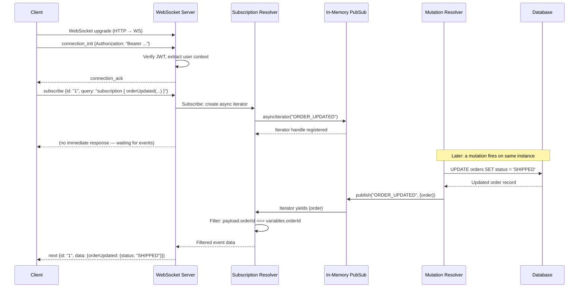
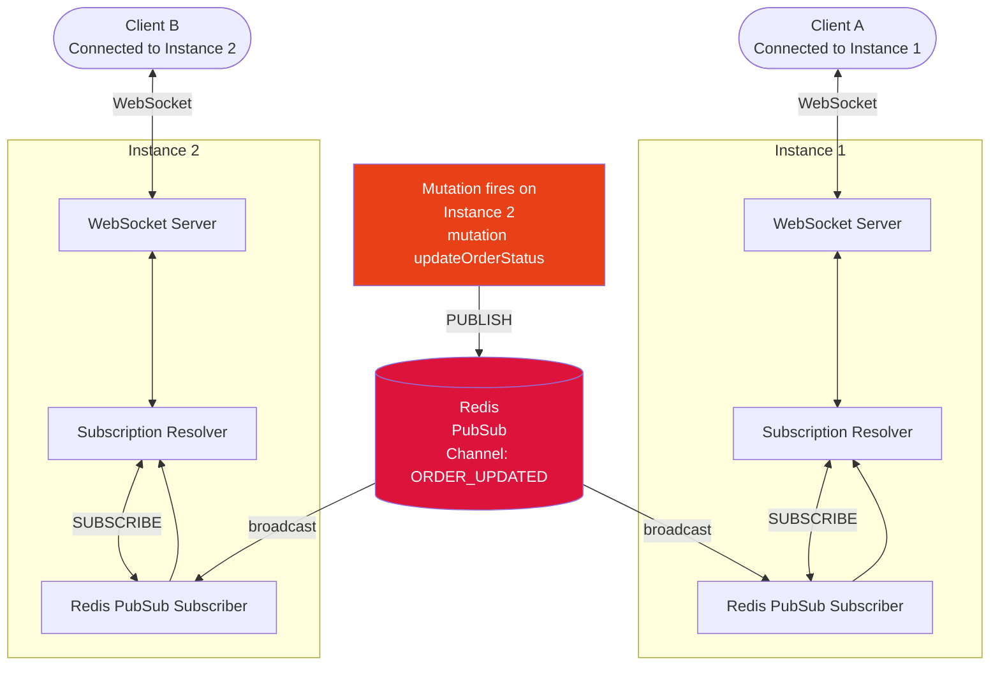

# GraphQL Subscriptions

> **Purpose:** Understand how GraphQL subscriptions establish persistent server-to-client connections for real-time data, how the `graphql-ws` protocol works at the message level, how PubSub architecture connects mutations to subscribers, and what it takes to scale subscriptions across multiple server instances. Engineers who complete this section will be able to implement, secure, and operate production subscription systems — and will understand why subscriptions are architecturally expensive before choosing them over simpler alternatives.

---

## Learning Objectives

- [ ] Explain what subscriptions are at the protocol level and how they differ from queries and mutations
- [ ] Describe the complete `graphql-ws` WebSocket handshake and message exchange lifecycle
- [ ] Implement server-side subscription filtering and explain why client-side filtering is catastrophic at scale
- [ ] Explain the multi-instance subscription problem and how Redis PubSub solves it
- [ ] Identify when subscriptions are the wrong tool and what to use instead
- [ ] List the four most dangerous subscription anti-patterns in production
- [ ] Explain how to authenticate WebSocket connections and handle JWT expiry on long-lived connections

---

## Overview / Architecture

### Single-Instance Subscription Flow



### Multi-Instance Subscription Flow (Production)



When a mutation executes on Instance 2, it publishes to Redis. Redis broadcasts to all instances. Both Instance 1 and Instance 2 check their active subscriptions and push filtered events to the appropriate WebSocket connections.

Without Redis (or a shared PubSub system), clients connected to Instance 1 would never receive events from mutations that fired on Instance 2.

---

## Core Concepts

### What Subscriptions Are — and Are Not

A GraphQL subscription is a long-lived operation that maintains a persistent connection between client and server. When an event matching the subscription occurs on the server, the server pushes data to the client over that connection. The client does not poll. The client does not ask. The server tells.

This is fundamentally different from queries and mutations:

| Dimension | Query / Mutation | Subscription |
|-----------|-----------------|--------------|
| Connection | HTTP request/response (stateless) | WebSocket or SSE (stateful, persistent) |
| Lifecycle | Request completes in milliseconds | Connection lives for minutes to hours |
| Trigger | Client initiates | Server pushes on event |
| Scaling unit | Request throughput (stateless) | Concurrent connections (stateful) |
| Cost | Per-request compute | Per-connection memory + per-event compute |
| CDN cacheable | Queries can be (with APQ) | No |

### When to Use Subscriptions

Subscriptions are appropriate when:

- **Real-time collaboration** — live cursors, co-editing documents, shared whiteboards. Multiple clients must see each other's actions within 100ms.
- **Live order / delivery tracking** — a customer watching their order status change from `CONFIRMED → PREPARING → SHIPPED → DELIVERED` in real time.
- **Chat and messaging** — messages must appear for all participants immediately without the sender having to refresh.
- **Financial tickers and live scores** — stock prices, sports scores, auction bids that update every few seconds and where every update matters.
- **Real-time notification feeds** — a feed of notifications that should appear without page refresh, where the user is actively watching.

### When NOT to Use Subscriptions

Subscriptions are the wrong tool when:

- **Periodic data refresh** — showing "last updated 5 minutes ago" data. Use `refetchInterval` in React Query or Apollo's `pollInterval`. Polling is simpler, stateless, and easier to debug.
- **Large data transfers** — downloading a report or exporting data. Use REST with streaming, or S3 pre-signed URLs.
- **One-time async operations** — "start a background job and notify me when done." Poll a status query every 2 seconds. Simpler, stateless, and the client handles reconnects automatically.
- **Infrequent updates** — a resource that changes once per hour. Opening a WebSocket to wait for one event per hour is wasteful. Use push notifications or email.

The rule: subscriptions are expensive per-connection. Before adding one, confirm that polling genuinely cannot meet your latency requirements.

---

## Subscription Protocol

### The `graphql-ws` Protocol

`graphql-ws` (the current standard, maintained by Denis Badurina) defines the message format for GraphQL over WebSocket. It replaces the deprecated `subscriptions-transport-ws` (Apollo's legacy library). Use `graphql-ws`. Do not use `subscriptions-transport-ws` in new projects.

The complete lifecycle of a subscription connection:

```
Phase 1: WebSocket Handshake
------
Client → Server:  HTTP GET /graphql
                  Upgrade: websocket
                  Connection: Upgrade
                  Sec-WebSocket-Protocol: graphql-transport-ws

Server → Client:  101 Switching Protocols
                  Sec-WebSocket-Protocol: graphql-transport-ws

Phase 2: GraphQL Connection Init
------
Client → Server:
{
  "type": "connection_init",
  "payload": {
    "Authorization": "Bearer eyJhbGciOi..."
  }
}

Server → Client:
{
  "type": "connection_ack",
  "payload": {}
}

Phase 3: Subscribe
------
Client → Server:
{
  "id": "sub-1",
  "type": "subscribe",
  "payload": {
    "operationName": "WatchOrderStatus",
    "query": "subscription WatchOrderStatus($orderId: ID!) { orderUpdated(orderId: $orderId) { id status estimatedDelivery } }",
    "variables": { "orderId": "o-456" }
  }
}

Phase 4: Server Pushes Events
------
Server → Client (when order status changes):
{
  "id": "sub-1",
  "type": "next",
  "payload": {
    "data": {
      "orderUpdated": {
        "id": "o-456",
        "status": "SHIPPED",
        "estimatedDelivery": "2026-05-17"
      }
    }
  }
}

Phase 5: Unsubscribe
------
Client → Server:
{
  "id": "sub-1",
  "type": "complete"
}

Phase 6: Connection Close (either side)
------
Server → Client (or Client → Server):
{
  "type": "connection_close"
}
```

The `id` field on subscribe/next/complete messages allows multiplexing — multiple subscriptions can run over a single WebSocket connection, distinguished by their `id`.

### Server-Sent Events (SSE) as an Alternative

SSE is a simpler HTTP-based protocol for one-directional server-to-client streaming. It does not require a WebSocket upgrade. The client opens a regular HTTP connection; the server keeps it open and sends `data:` lines as events occur.

```
GET /graphql/stream HTTP/1.1
Accept: text/event-stream

---

HTTP/1.1 200 OK
Content-Type: text/event-stream
Cache-Control: no-cache

data: {"data":{"orderUpdated":{"status":"SHIPPED"}}}

data: {"data":{"orderUpdated":{"status":"DELIVERED"}}}
```

**SSE advantages over WebSocket:**
- No protocol upgrade — works through standard HTTP/2 proxies and load balancers
- Better CDN compatibility — CDNs understand HTTP; most do not handle WebSocket well
- Automatic reconnect built into the browser `EventSource` API
- Works through some corporate firewalls that block WebSocket upgrades
- Apollo Router natively supports SSE for subscriptions

**SSE limitations:**
- One-directional — client cannot send messages after connection opens (no client-initiated unsubscribe over the same connection)
- No message multiplexing — one SSE stream per subscription (whereas one WebSocket can multiplex N subscriptions)

For most server-push use cases (notifications, status updates), SSE is simpler and sufficient. Use WebSocket when you need bidirectional communication or want to multiplex many subscriptions over a single connection.

---

## PubSub Architecture

### The Publish-Subscribe Pattern

The subscription resolver does not execute business logic. It creates an async iterator — an object that yields values over time. The server's PubSub system is what delivers those values.

```
Event source (mutation resolver)
    → calls pubsub.publish("CHANNEL_NAME", payload)
    → PubSub broadcasts to all subscribers of that channel
    → Active async iterators on that channel yield the payload
    → Subscription resolver runs the filter function
    → Matching subscribers receive the payload
    → WebSocket connection pushes the data to the client
```

### Implementing Subscriptions with graphql-ws and graphql-subscriptions

```javascript
// src/pubsub.ts
import { PubSub } from 'graphql-subscriptions';

// In-memory PubSub — only for single-instance or local development
export const pubsub = new PubSub();

export const EVENTS = {
  ORDER_UPDATED: 'ORDER_UPDATED',
  CHAT_MESSAGE_SENT: 'CHAT_MESSAGE_SENT',
  NOTIFICATION_CREATED: 'NOTIFICATION_CREATED',
} as const;
```

```javascript
// src/resolvers/subscription.ts
import { withFilter } from 'graphql-subscriptions';
import { pubsub, EVENTS } from '../pubsub';
import { SubscriptionResolvers } from '../generated/graphql';

export const subscriptionResolvers: SubscriptionResolvers = {
  orderUpdated: {
    // subscribe returns an async iterator
    subscribe: withFilter(
      // The async iterator source: every ORDER_UPDATED event
      (_parent, _args, context) => {
        // Authorization check before creating the iterator
        if (!context.user) {
          throw new GraphQLError('Not authenticated', {
            extensions: { code: 'UNAUTHENTICATED' }
          });
        }
        return pubsub.asyncIterator(EVENTS.ORDER_UPDATED);
      },
      // The filter function: only yield events matching this subscriber's orderId
      (payload, variables, context) => {
        // Also check that this user owns the order
        return (
          payload.orderId === variables.orderId &&
          payload.customerId === context.user.id
        );
      }
    ),
    // resolve transforms the raw pubsub payload into the subscription return type
    resolve: (payload) => payload.order,
  },
};
```

```javascript
// src/resolvers/mutation.ts — publishing from a mutation
export const mutationResolvers: MutationResolvers = {
  updateOrderStatus: async (_parent, { orderId, status }, context) => {
    const order = await context.dataSources.orderService.updateStatus(orderId, status);

    // Publish to PubSub after successful mutation
    await pubsub.publish(EVENTS.ORDER_UPDATED, {
      orderId: order.id,
      customerId: order.customerId,
      order,
    });

    return { order, userErrors: [] };
  },
};
```

### Redis PubSub for Multi-Instance Deployments

```javascript
// src/pubsub.ts — production version
import { RedisPubSub } from 'graphql-redis-subscriptions';
import Redis from 'ioredis';

const redisOptions = {
  host: process.env.REDIS_HOST,
  port: parseInt(process.env.REDIS_PORT ?? '6379'),
  password: process.env.REDIS_PASSWORD,
  retryStrategy: (times: number) => Math.min(times * 50, 2000),
};

export const pubsub = new RedisPubSub({
  publisher: new Redis(redisOptions),
  subscriber: new Redis(redisOptions),
  // Two separate Redis connections — one for publish, one for subscribe
  // This is required by Redis protocol: a connection in subscribe mode
  // cannot issue publish commands
});
```

`graphql-redis-subscriptions` replaces the in-memory `graphql-subscriptions` PubSub with Redis as the message broker. Every `pubsub.publish()` call sends to Redis; every `pubsub.asyncIterator()` creates a Redis subscriber. All instances share the same Redis channel, so events are broadcast to all instances regardless of which one received the mutation.

### Apollo Server WebSocket Setup

```javascript
// src/server.ts
import { createServer } from 'http';
import { expressMiddleware } from '@apollo/server/express4';
import { ApolloServer } from '@apollo/server';
import { WebSocketServer } from 'ws';
import { useServer } from 'graphql-ws/lib/use/ws';
import { makeExecutableSchema } from '@graphql-tools/schema';
import express from 'express';
import { typeDefs } from './schema';
import { resolvers } from './resolvers';
import { createContext } from './context';

const schema = makeExecutableSchema({ typeDefs, resolvers });
const app = express();
const httpServer = createServer(app);

// WebSocket server for subscriptions
const wsServer = new WebSocketServer({
  server: httpServer,
  path: '/graphql',
});

// graphql-ws server
const wsServerCleanup = useServer(
  {
    schema,
    // Context function runs on connection_init (once per connection)
    context: async (ctx) => {
      const token = ctx.connectionParams?.Authorization as string;
      if (!token) {
        throw new Error('Missing auth token');
      }
      const user = await verifyToken(token);
      return { user };
    },
    onConnect: async (ctx) => {
      // Called when connection_init is received
      // Return false to reject the connection
      const token = ctx.connectionParams?.Authorization;
      if (!token) return false;
      return true;
    },
    onDisconnect: (ctx, code, reason) => {
      console.log(`WebSocket disconnected: ${code} ${reason}`);
      // Clean up any per-connection resources
    },
  },
  wsServer
);

// HTTP server for queries and mutations
const apolloServer = new ApolloServer({
  schema,
  plugins: [
    {
      async serverWillStart() {
        return {
          async drainServer() {
            await wsServerCleanup.dispose();
          },
        };
      },
    },
  ],
});

await apolloServer.start();
app.use('/graphql', expressMiddleware(apolloServer, { context: createContext }));

httpServer.listen(4000);
```

---

## Subscription Filtering

### Why Server-Side Filtering Is Non-Negotiable

Consider 10,000 clients each subscribed to order updates. When any order anywhere in the system updates, that event fires. Without filtering:

```
Events: 1,000 order updates/second
Subscribers: 10,000 active subscriptions
Messages delivered: 10,000,000/second
```

10 million WebSocket messages per second — each requiring serialization, network I/O, and client processing. This is not a theoretical problem. It is what happens when you publish to a global channel and let clients filter locally.

With server-side filtering:

```
Events: 1,000 order updates/second
Subscribers per order: 1 (the customer who placed it)
Messages delivered: 1,000/second
```

The filter function runs on the server before any message is sent over the wire. Only the subscriber whose `orderId` matches the event's `orderId` receives anything.

### The Filter Function Contract

```javascript
// withFilter signature:
withFilter(
  subscribeFunction,  // Returns AsyncIterator — source of all events
  filterFunction      // (payload, variables, context) => boolean
)

// payload: the object passed to pubsub.publish()
// variables: the variables from the client's subscription operation
// context: the connection context (user, etc.)
// Return true to deliver the event to this subscriber; false to skip
```

```javascript
// Example: chat room subscription with auth and room filtering
subscribe: withFilter(
  (_parent, _args, context) => {
    if (!context.user) throw new GraphQLError('Not authenticated');
    return pubsub.asyncIterator(EVENTS.CHAT_MESSAGE_SENT);
  },
  (payload, variables, context) => {
    // Only deliver if message is in the subscribed room
    // AND the subscriber has access to that room
    return (
      payload.roomId === variables.roomId &&
      context.user.roomIds.includes(variables.roomId)
    );
  }
),
```

---

## Subscription Security

### Authentication Architecture for WebSocket Connections

HTTP-based middleware (Express middleware, NestJS guards, Apollo Server plugins) does not run for WebSocket connections. The WebSocket upgrade is a different protocol. Security middleware that assumes HTTP will silently pass all WebSocket connections.

Authentication must be explicit in the `onConnect` / context function:

```javascript
// WRONG: assuming HTTP auth middleware covers WebSockets
app.use(authMiddleware); // This does NOT protect WebSocket connections

// CORRECT: authenticate explicitly in graphql-ws onConnect
useServer({
  schema,
  onConnect: async (ctx) => {
    const authHeader = ctx.connectionParams?.Authorization as string;
    if (!authHeader?.startsWith('Bearer ')) {
      // Return false to reject the connection before connection_ack
      return false;
    }
    try {
      await verifyJWT(authHeader.replace('Bearer ', ''));
      return true;
    } catch {
      return false;  // Invalid token — reject connection
    }
  },
  context: async (ctx) => {
    const token = (ctx.connectionParams?.Authorization as string).replace('Bearer ', '');
    const user = await verifyJWT(token);
    return { user };
  }
}, wsServer);
```

### JWT Expiry on Long-Lived Connections

A WebSocket connection for order tracking might live for 30 minutes. A standard JWT expires in 15 minutes. After expiry, the connection is open but the user's token is invalid.

Strategies:

**1. Disconnect on expiry, require reconnect:**
```javascript
onConnect: async (ctx) => {
  const token = ctx.connectionParams?.Authorization;
  const decoded = verifyJWT(token);
  
  // Schedule connection termination at token expiry
  const msUntilExpiry = (decoded.exp * 1000) - Date.now();
  setTimeout(() => {
    // Close the WebSocket with a specific code
    ctx.extra.socket.close(4401, 'Token expired — reconnect with fresh token');
  }, msUntilExpiry);
  
  return true;
}
```

**2. Use long-lived refresh tokens for WebSocket authentication:**
Issue a separate long-lived token specifically for WebSocket connections, scoped to subscription operations only.

**3. Apollo Router / Supergraph approach:**
Delegate token validation to the router, which can handle token refresh transparently without changing the subscription resolver.

### Per-Subscription Authorization

Authentication (is the user who they say they are?) happens at `connection_init`. Authorization (can this specific user subscribe to this specific resource?) happens in the filter function or subscribe function:

```javascript
subscribe: withFilter(
  async (_parent, variables, context) => {
    // Per-subscription authorization check
    const hasAccess = await context.dataSources.permissionService
      .canViewOrder(context.user.id, variables.orderId);
    
    if (!hasAccess) {
      throw new GraphQLError('Not authorized to subscribe to this order', {
        extensions: { code: 'FORBIDDEN' }
      });
    }
    
    return pubsub.asyncIterator(EVENTS.ORDER_UPDATED);
  },
  (payload, variables) => payload.orderId === variables.orderId
)
```

### Rate Limiting Subscriptions

```javascript
// Track active subscriptions per user
const activeSubscriptionsByUser = new Map<string, number>();

onConnect: async (ctx) => {
  const user = await authenticate(ctx.connectionParams);
  const current = activeSubscriptionsByUser.get(user.id) ?? 0;
  
  // Limit: max 10 active subscriptions per user
  if (current >= 10) {
    return false;  // Reject connection
  }
  
  activeSubscriptionsByUser.set(user.id, current + 1);
  return true;
},

onDisconnect: (ctx) => {
  const userId = ctx.extra?.userId;
  if (userId) {
    const current = activeSubscriptionsByUser.get(userId) ?? 1;
    activeSubscriptionsByUser.set(userId, Math.max(0, current - 1));
  }
}
```

In multi-instance deployments, this per-instance counter is insufficient. Use Redis with atomic increment/decrement to maintain a global count.

---

## Scaling Subscriptions

### The Multi-Instance Problem

Every WebSocket connection is stateful — the server holds memory representing that connection. When you run 3 instances of your GraphQL server behind a load balancer:

- Client A connects to Instance 1
- Client B connects to Instance 2
- A mutation fires on Instance 3
- In-memory PubSub on Instance 3 has no subscribers (they are on 1 and 2)
- Neither Client A nor Client B receives the event

This is the fundamental challenge of stateful services behind stateless load balancers. Solutions:

**Sticky sessions (partial solution):**
Configure the load balancer to route WebSocket connections from the same client to the same instance. This solves client continuity but not the mutation routing problem — a mutation on Instance 3 still cannot reach clients on Instances 1 and 2.

**Redis PubSub (standard solution):**
All instances subscribe to shared Redis channels. Any instance's publish reaches all instances' subscribers. The `graphql-redis-subscriptions` library handles this transparently. Redis PubSub uses Redis's built-in pub/sub primitive, which is separate from Redis's key-value store.

**NATS (high-throughput alternative):**
NATS is a purpose-built messaging system with lower latency than Redis PubSub for high-throughput event streams. Suitable when subscription events exceed ~50,000/second per Redis node.

**Kafka (durable event streaming):**
Use Kafka when subscription events must be durable (survive broker restart), ordered within a partition, or consumed by multiple independent systems (not just subscriptions). Kafka adds operational complexity. Use it when you already have Kafka for your event sourcing layer.

### Connection Capacity by Runtime

| Runtime | Concurrent WebSocket connections | Notes |
|---------|----------------------------------|-------|
| Node.js (single thread) | ~50,000 | Memory-bound; each connection ~20-50KB heap |
| Node.js (cluster mode) | ~50,000 × CPU cores | Connections don't share memory across workers |
| Go (e.g., GraphQL Yoga on Go) | ~200,000–500,000 | Goroutines are cheap; efficient per-connection memory |
| Rust (async-graphql) | ~500,000–1,000,000 | Async tasks are extremely cheap; minimal per-connection overhead |
| Apollo Router (Rust) | ~200,000+ | Router-level subscription handling with Federation 2 |

Netflix operates at ~1M concurrent users. Their WebSocket infrastructure runs custom Rust services behind Apollo Router, not Node.js. For most production systems, Node.js with horizontal scaling (multiple instances + Redis PubSub) is sufficient at 100,000–500,000 concurrent subscriptions.

### Connection Limits and Back-Pressure

```javascript
// Apollo Router subscription configuration (router.yaml)
// subscriptions:
//   enabled: true
//   mode:
//     passthrough:
//       all:
//         path: /subscriptions

// Application-level connection limit
const MAX_CONCURRENT_CONNECTIONS = 50000;
let activeConnections = 0;

useServer({
  schema,
  onConnect: async (ctx) => {
    if (activeConnections >= MAX_CONCURRENT_CONNECTIONS) {
      // Return false to reject with 4429 Too Many Requests equivalent
      return false;
    }
    activeConnections++;
    return true;
  },
  onDisconnect: () => {
    activeConnections = Math.max(0, activeConnections - 1);
  }
}, wsServer);
```

---

## Real-World Implementation

### Complete Subscription Type Definition

```graphql
type Subscription {
  """
  Subscribe to status updates for a specific order.
  Requires authentication. Only the order owner receives updates.
  """
  orderUpdated(orderId: ID!): Order!

  """
  Subscribe to new messages in a chat room.
  Requires authentication and membership in the room.
  """
  messageSent(roomId: ID!): ChatMessage!

  """
  Subscribe to real-time notifications for the authenticated user.
  Returns notifications as they are created.
  """
  notificationReceived: Notification!
}
```

### Apollo Client Subscription Hook

```typescript
// src/hooks/useOrderTracking.ts
import { useSubscription, gql } from '@apollo/client';

const WATCH_ORDER_STATUS = gql`
  subscription WatchOrderStatus($orderId: ID!) {
    orderUpdated(orderId: $orderId) {
      id
      status
      estimatedDelivery
      trackingNumber
      lastUpdated
    }
  }
`;

export function useOrderTracking(orderId: string) {
  const { data, loading, error } = useSubscription(WATCH_ORDER_STATUS, {
    variables: { orderId },
    // onData runs every time a new event arrives
    onData: ({ client, data }) => {
      // Optionally update the cache for other queries that read this order
      client.cache.modify({
        id: client.cache.identify({ __typename: 'Order', id: orderId }),
        fields: {
          status: () => data.data?.orderUpdated.status,
          estimatedDelivery: () => data.data?.orderUpdated.estimatedDelivery,
        },
      });
    },
    onError: (error) => {
      console.error('Subscription error:', error);
    },
  });

  return {
    order: data?.orderUpdated,
    loading,
    error,
  };
}
```

```typescript
// src/ApolloProvider.tsx — configuring WebSocket link
import { ApolloClient, InMemoryCache, HttpLink, split } from '@apollo/client';
import { GraphQLWsLink } from '@apollo/client/link/subscriptions';
import { createClient } from 'graphql-ws';
import { getMainDefinition } from '@apollo/client/utilities';

const httpLink = new HttpLink({ uri: '/graphql' });

const wsLink = new GraphQLWsLink(
  createClient({
    url: 'wss://api.example.com/graphql',
    connectionParams: () => ({
      // Called every time a connection is established (including reconnects)
      // Using a function ensures fresh tokens on reconnect
      Authorization: `Bearer ${getAuthToken()}`,
    }),
    retryAttempts: 5,
    on: {
      error: (error) => {
        console.error('WebSocket error:', error);
      },
      closed: () => {
        console.log('WebSocket connection closed');
      },
    },
  })
);

// Route subscriptions to WebSocket, queries/mutations to HTTP
const splitLink = split(
  ({ query }) => {
    const definition = getMainDefinition(query);
    return (
      definition.kind === 'OperationDefinition' &&
      definition.operation === 'subscription'
    );
  },
  wsLink,
  httpLink
);

const client = new ApolloClient({
  link: splitLink,
  cache: new InMemoryCache(),
});
```

### Monitoring Active Subscriptions

```javascript
// src/metrics/subscriptions.ts
import { register, Gauge, Counter } from 'prom-client';

export const activeSubscriptionsGauge = new Gauge({
  name: 'graphql_active_subscriptions',
  help: 'Number of currently active GraphQL subscriptions',
  labelNames: ['operation_name'],
});

export const subscriptionEventsCounter = new Counter({
  name: 'graphql_subscription_events_total',
  help: 'Total number of subscription events delivered',
  labelNames: ['operation_name'],
});

export const subscriptionConnectionsGauge = new Gauge({
  name: 'graphql_websocket_connections',
  help: 'Number of active WebSocket connections',
});

// Instrument useServer
useServer({
  schema,
  onSubscribe: (_ctx, msg) => {
    const operationName = msg.payload.operationName ?? 'anonymous';
    activeSubscriptionsGauge.labels(operationName).inc();
    subscriptionConnectionsGauge.inc();
  },
  onComplete: (_ctx, msg) => {
    // We don't have operationName here without tracking it per-id
    subscriptionConnectionsGauge.dec();
  },
  onDisconnect: () => {
    subscriptionConnectionsGauge.dec();
  },
}, wsServer);
```

---

## Production Considerations

### Performance

**Subscriptions are stateful — each connection holds heap memory.** A Node.js process handling 10,000 concurrent WebSocket connections typically uses 500MB–1GB of heap. At 50,000 connections, you are at the Node.js limit. Plan horizontal scaling before you need it.

**Event fan-out cost scales with subscriber count.** If 5,000 clients subscribe to the same channel (e.g., a global news feed), publishing one event requires 5,000 filter function calls and up to 5,000 serialized WebSocket messages. Server-side filtering must be fast — avoid database calls in filter functions.

**Subscription resolvers should not do heavy computation.** The subscription resolver runs for every event that passes the filter. If your resolver fetches 5 related entities per event and you have 1,000 events/second with 100 subscribers each, that is 500,000 database queries per second from subscription resolution alone. Denormalize the pubsub payload to include all necessary data.

### Security

**WebSocket connections bypass HTTP security middleware.** Helmet.js, CORS middleware, rate-limiting middleware, and authentication middleware written for Express do not run on WebSocket connections. You must implement security explicitly in `onConnect` and the context function.

**Authenticate on `connection_init`, reject unauthenticated connections before `connection_ack`.** Do not authenticate per-message — it is expensive and the protocol does not require it. One auth check per connection is correct.

**Validate and sanitize subscription variables.** Variables are schema-validated for type, but not for business logic. An orderId variable should be verified to belong to the authenticated user before the async iterator is created. Otherwise, a user can subscribe to any order by guessing its ID.

**Be careful with subscription payloads containing sensitive data.** The pubsub payload often contains raw database records. Ensure your `resolve` function or filter strips any fields the subscriber should not see, especially in shared-channel patterns.

### Scaling

**Redis PubSub is the minimum for multi-instance deployments.** Any multi-instance deployment without shared pubsub silently delivers events to only the instance that received the mutation. This failure mode is intermittent and hard to reproduce locally.

**Monitor Redis PubSub throughput.** Redis PubSub is not durable — messages published when no subscriber is listening are lost. At high message volume, measure Redis PubSub latency (the time from `PUBLISH` to the subscriber receiving the message).

**Use connection draining for graceful deploys.** When a server instance shuts down, active WebSocket connections should be drained gracefully: stop accepting new connections, give existing connections time to migrate (client reconnects to another instance), then shut down. `graphql-ws` supports a `dispose()` call on the server.

**Consider Kubernetes HPA with custom metrics.** Scale horizontally based on `graphql_active_subscriptions` (active subscription count) rather than CPU, since WebSocket connections are memory-bound, not CPU-bound.

### Observability

Most APM tools auto-instrument HTTP traffic. WebSocket connections require explicit instrumentation.

**Metrics to track:**
- `graphql_websocket_connections` — current active connections (gauge)
- `graphql_active_subscriptions{operation_name}` — subscriptions by name (gauge)
- `graphql_subscription_events_delivered_total{operation_name}` — events delivered (counter)
- `graphql_subscription_events_filtered_total{operation_name}` — events filtered out (counter)
- `graphql_subscription_connection_duration_seconds` — connection lifetime histogram
- `redis_pubsub_latency_ms` — time from publish to subscriber receipt

**Subscription leak detection:** If `graphql_active_subscriptions` grows without bound over time (not proportional to active users), clients are not calling `unsubscribe` when components unmount. This is the most common subscription bug in React applications using Apollo Client.

**Alert on:** active subscriptions > 80% of instance capacity, Redis PubSub latency > 100ms, subscription error rate > 1%.

---

## Best Practices

1. **Always filter subscription events server-side using `withFilter`.** Never publish to a global channel and expect clients to filter client-side. The filter function runs on the server; unmatched events are never serialized or sent over the wire. At scale, the difference is O(1) vs O(n×m) message volume.

2. **Authenticate on `connection_init`, not per-message.** Verify the JWT or session token when the WebSocket connection is established and store the user context. Per-message authentication is expensive and unnecessary — the connection context is available throughout the connection lifetime.

3. **Use `graphql-ws`, not the deprecated `subscriptions-transport-ws`.** `subscriptions-transport-ws` is unmaintained, has known security issues, and is incompatible with modern Apollo Client. Migration guide: [https://www.apollographql.com/docs/react/data/subscriptions/#switching-from-subscriptions-transport-ws](https://www.apollographql.com/docs/react/data/subscriptions/#switching-from-subscriptions-transport-ws).

4. **Set a maximum subscription lifetime and reconnect clients periodically.** WebSocket connections that live for days accumulate problems: stale auth tokens, load balancer imbalances, memory fragmentation. Design clients to reconnect every 30–60 minutes. `graphql-ws` client handles reconnect automatically with exponential backoff.

5. **Monitor active subscription count per operation name.** A subscription count that grows without bound indicates a leak — clients subscribing but never unsubscribing. This is most common when React components with `useSubscription` unmount without proper cleanup, or when SPA navigation creates new subscriptions without destroying old ones.

---

## Anti-Patterns

### 1. In-Memory PubSub in Multi-Instance Production

```javascript
// This looks fine locally. Breaks silently in production with >1 instance.
import { PubSub } from 'graphql-subscriptions';
export const pubsub = new PubSub();  // In-memory only
```

**Why it fails:** The mutation fires on Instance A. `pubsub.publish()` writes to Instance A's in-memory PubSub. The subscriber is on Instance B. Instance B's PubSub never receives the message. The client waits for an event that will never arrive. No error is thrown. No log is written. The failure is invisible and intermittent — it happens 50% of the time (when mutation and subscriber land on different instances) and zero percent of the time locally (single instance).

**Fix:** Replace with `RedisPubSub` from `graphql-redis-subscriptions` for any multi-instance deployment.

### 2. No Subscription Filtering

```javascript
// Every subscriber receives every event
subscribe: () => pubsub.asyncIterator('ORDER_UPDATED'),
// Client receives 10,000 order updates/second and filters for the 1 it cares about
```

**Why it fails:** At 10,000 events per second and 10,000 active subscribers, you deliver 100 million messages per second. Each message requires serialization, a WebSocket frame, network I/O on the server, network I/O on the client, deserialization, and a React re-render (most of which the client discards). Memory on the server grows because the outbound WebSocket buffers fill faster than they drain. Nodes OOM-crash. Clients lag, buffer events, and eventually disconnect.

**Fix:** Always use `withFilter` with a function that returns `true` for at most a small fraction of events per subscriber.

### 3. Using Subscriptions for Polling Patterns

```graphql
# This is polling dressed up as a subscription
subscription {
  anyProductUpdated {  # Fires on every product update in the entire catalog
    id
    price
    inventory
  }
}
```

**Why it fails:** This subscription wants to know about any change to any product. The only subscriber who legitimately needs this is an admin dashboard showing a live feed of all product changes. For a product detail page, the client needs updates to one product. "Subscribe to everything, filter locally" is polling with WebSocket overhead. If 10,000 users are viewing product pages and each has this subscription, every price update triggers 10,000 event evaluations.

**Fix:** Scope subscriptions narrowly. `productUpdated(productId: ID!)` — each client subscribes to exactly one product. Or use polling (`refetchInterval: 30000`) if near-real-time updates are acceptable.

### 4. Ignoring WebSocket Authentication

```javascript
// This trusts all WebSocket connections unconditionally
useServer({
  schema,
  // No onConnect, no auth check in context
  context: (ctx) => {
    // No token verification
    return { userId: ctx.connectionParams?.userId };  // Trust the client's claim
  }
}, wsServer);
```

**Why it fails:** Any client can connect to the WebSocket endpoint and claim to be any user. There is no authentication middleware intercepting WebSocket connections. The `userId` sent in `connectionParams` is completely unverified — it is whatever the client claims it is. A malicious client sends `userId: "admin-user-id"` and subscribes to every admin-only subscription.

**Fix:** Always verify a signed JWT or session token in `onConnect`. Never trust unsigned claims from `connectionParams`.

---

## Operational Notes

**Graceful shutdown sequence for WebSocket servers:**

```javascript
process.on('SIGTERM', async () => {
  console.log('SIGTERM received — draining WebSocket connections');

  // 1. Stop accepting new HTTP connections
  httpServer.close();

  // 2. Send close frames to all active WebSocket connections
  // graphql-ws clients will reconnect to another instance
  await wsServerCleanup.dispose();

  // 3. Wait for in-flight resolvers to complete
  await new Promise(resolve => setTimeout(resolve, 5000));

  // 4. Disconnect from Redis PubSub
  await pubsub.close();

  process.exit(0);
});
```

**Load balancer configuration for WebSocket sticky sessions (AWS ALB):**
```
stickiness.enabled: true
stickiness.type: lb_cookie
stickiness.lb_cookie.duration_seconds: 86400
```

Enable sticky sessions so WebSocket reconnects from the same client return to the same instance. Without sticky sessions, reconnects distribute randomly and your in-memory connection state (non-Redis) is lost.

**Apollo Router subscription configuration:**

```yaml
# router.yaml
subscription:
  enabled: true
  mode:
    passthrough:
      all:
        path: /subscriptions
```

Apollo Router (v1.22+) supports subscription passthrough to subgraph WebSocket servers and native SSE subscription handling for clients. This allows the Router to act as the single entry point for all operation types.

---

## References

- [graphql-ws GitHub](https://github.com/enisdenjo/graphql-ws) — Protocol specification and server/client implementations
- [graphql-subscriptions](https://github.com/apollographql/graphql-subscriptions) — Apollo's PubSub abstraction
- [graphql-redis-subscriptions](https://github.com/davidyaha/graphql-redis-subscriptions) — Redis-backed PubSub
- [Apollo Client Subscriptions](https://www.apollographql.com/docs/react/data/subscriptions/) — Client-side subscription setup
- [Apollo Router Subscriptions](https://www.apollographql.com/docs/router/executing-operations/subscription-support/) — Federation-level subscription handling
- [Server-Sent Events — MDN](https://developer.mozilla.org/en-US/docs/Web/API/Server-sent_events/Using_server-sent_events)
- [WebSocket Protocol — RFC 6455](https://datatracker.ietf.org/doc/html/rfc6455)
- [Migrating from subscriptions-transport-ws](https://www.apollographql.com/docs/react/data/subscriptions/#switching-from-subscriptions-transport-ws)

---

## Related Topics

- [01-queries-and-mutations.md](./01-queries-and-mutations.md) — The other two operation types
- [03-type-system.md](./03-type-system.md) — Defining the Subscription type in your schema
- [../04-resolvers-and-execution/](../04-resolvers-and-execution/) — How subscription resolvers execute
- [../05-security/](../05-security/) — WebSocket authentication and authorization in depth
- [../06-performance-and-scaling/](../06-performance-and-scaling/) — Scaling WebSocket connections and PubSub throughput
- [../14-observability/](../14-observability/) — Instrumenting subscription metrics and traces
- [../17-caching-strategies/](../17-caching-strategies/) — Why subscriptions are not cacheable and how to design around it
