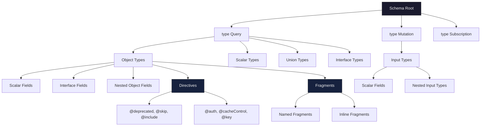

# Types, Fragments, and Directives

> **Purpose:** Master the GraphQL type system — scalars, objects, interfaces, unions, enums, and input types — along with fragments for reusable field selections and directives for schema-level behavior modification. These are the foundational building blocks of every production GraphQL API.

---

## Learning Objectives

- [ ] Explain every built-in scalar type and why `ID` is a string, not an integer
- [ ] Define custom scalars and articulate when they add value vs. when `JSON` scalar is an antipattern
- [ ] Apply nullability annotations correctly and understand the "nullability cliff"
- [ ] Distinguish when to use interfaces vs. union types
- [ ] Write and co-locate named fragments following the Relay-inspired colocation pattern
- [ ] Use inline fragments with `__typename` to handle polymorphic responses
- [ ] Implement custom schema directives and explain their execution order
- [ ] Audit a schema for missing `@auth` directives as a security control

---

## Overview / Architecture

The GraphQL type system is the contract between your API and its clients. Every field, argument, and return value has a declared type. This diagram shows how the type system constructs compose into a schema.



The type system enforces correctness at three stages: schema definition, query validation, and runtime. A query that requests a non-existent field fails at validation before any resolver executes. This is a fundamental advantage over REST — errors are detected before they reach production code.

---

## Core Concepts

### Scalar Types

Scalars are leaf values — they have no sub-fields. GraphQL ships five built-in scalars:

| Scalar | JSON Representation | Use For |
|--------|---------------------|---------|
| `String` | `"hello"` | Names, descriptions, slugs, free-form text |
| `Int` | `42` | 32-bit signed integer counts, quantities |
| `Float` | `3.14` | Decimal numbers — prices (avoid!), coordinates |
| `Boolean` | `true` / `false` | Flags, toggles |
| `ID` | `"abc-123"` | Opaque entity identifiers |

**Why `ID` is always serialized as a string, never a number:**

The `ID` scalar is defined as an opaque identifier. It must be serialized as a string in the response, but it can accept both strings and integers as input. This design exists because IDs are identity tokens, not quantities:

- UUIDs (`550e8400-e29b-41d4-a716-446655440000`) are strings by nature
- Numeric database IDs become strings to avoid JavaScript's 53-bit integer precision limit — a PostgreSQL `BIGINT` ID larger than `Number.MAX_SAFE_INTEGER` (9,007,199,254,740,991) loses precision when parsed as a JS number, causing silent data corruption
- Composite keys like `"order:tenant:123:456"` are common in distributed systems

Never use `Int!` for entity IDs. Use `ID!`.

### Custom Scalars

When the built-in scalars are too broad, define custom scalars to express semantic constraints and enable runtime validation:

```graphql
"""ISO 8601 timestamp: "2024-01-15T10:30:00Z". Serialized as a string."""
scalar DateTime

"""UUID v4: "550e8400-e29b-41d4-a716-446655440000". Validated format."""
scalar UUID

"""
Monetary value. Serialized as { amount: Int (cents), currency: String (ISO 4217) }.
Always work in the smallest currency unit to avoid floating-point rounding errors.
"""
scalar Money

"""Validated URL string. Rejects malformed URLs at the resolver boundary."""
scalar URL

"""
Arbitrary JSON blob. Use sparingly — this scalar escapes the type system entirely.
Acceptable only for truly dynamic data (configuration blobs, metadata maps).
Structured data should always be typed.
"""
scalar JSON
```

**Custom scalar implementation in Apollo Server:**

```typescript
import { GraphQLScalarType, Kind } from 'graphql';

const DateTimeScalar = new GraphQLScalarType({
  name: 'DateTime',
  description: 'ISO 8601 date-time string',
  serialize(value: unknown): string {
    if (value instanceof Date) {
      if (isNaN(value.getTime())) {
        throw new Error('DateTime cannot represent an invalid Date');
      }
      return value.toISOString();
    }
    if (typeof value === 'string') {
      const date = new Date(value);
      if (isNaN(date.getTime())) {
        throw new Error(`DateTime cannot represent non-ISO string: ${value}`);
      }
      return value;
    }
    throw new Error('DateTime cannot represent non-string, non-Date value');
  },
  parseValue(value: unknown): Date {
    if (typeof value !== 'string') {
      throw new Error('DateTime must be a string');
    }
    const date = new Date(value);
    if (isNaN(date.getTime())) {
      throw new Error(`DateTime cannot parse: ${value}`);
    }
    return date;
  },
  parseLiteral(ast) {
    if (ast.kind !== Kind.STRING) {
      throw new Error('DateTime must be a string literal');
    }
    return new Date(ast.value);
  },
});
```

**The `JSON` scalar tradeoff:**

The `JSON` scalar, available via the `graphql-scalars` package, accepts and returns any valid JSON value. This is a deliberate escape hatch from the type system. Every time you reach for `JSON`, ask: "Can I model this with a proper type?" The answer is almost always yes. The only legitimate uses are:

- Feature flag configurations that are truly schema-less and defined externally
- Metadata maps with arbitrary keys (e.g., audit log `before`/`after` payloads)
- Proxied third-party API responses that your service doesn't own

If a field typed as `JSON` becomes structured and predictable, refactor it to a proper type.

### Object Types

Object types are the primary building blocks. They define named entities with typed fields:

```graphql
type Product implements Node & Timestamped {
  id: ID!
  sku: String!
  title: String!
  description: String
  price: Money!
  compareAtPrice: Money
  tags: [String!]!
  category: Category!
  variants(first: Int = 10, after: String): ProductVariantConnection!
  inventory: InventoryStatus!
  isAvailable: Boolean!
  createdAt: DateTime!
  updatedAt: DateTime!
}
```

**Nullability: `!` and the nullability cliff:**

`!` means non-null. Without it, a field is nullable — the resolver may return `null` without error.

| Annotation | Meaning |
|------------|---------|
| `String` | Nullable string — may be `null` |
| `String!` | Non-null string — never `null`; resolver error propagates up |
| `[String]` | Nullable list of nullable strings |
| `[String!]` | Nullable list of non-null strings |
| `[String]!` | Non-null list of nullable strings |
| `[String!]!` | Non-null list of non-null strings (most strict) |

**The nullability cliff** is a critical concept for production reliability. In GraphQL, when a non-null field's resolver throws an error, that error cannot be represented as `null` in the response (because the field is declared non-null). GraphQL propagates the error up to the nearest nullable parent field — and nulls it out along with all its children.

Example: If `order.buyer.name` is `String!` (non-null) and its resolver throws, the entire `buyer` field is nulled. If `buyer` is also non-null (`buyer: User!`), the null propagates up to `order`. If `order` is non-null, it propagates to the root query — the entire query response data becomes `null`, even though only one field failed.

**Practical nullability strategy:**

- Use `!` for fields that are structurally guaranteed by your data model (e.g., `id`, `createdAt`, primary required fields)
- Use nullable for fields that may legitimately be absent (optional descriptions, computed fields that can fail gracefully)
- Never make the entire query result non-null — keep the top-level query fields nullable so partial responses can still be delivered
- Nullable field = "this might fail, and we'll return partial data" — this is often the right choice for resilience

### Interface Types

Interfaces define a contract: any type that implements an interface must include all of the interface's fields.

```graphql
"""Relay-spec Node interface: any entity that can be fetched by a global ID."""
interface Node {
  id: ID!
}

"""Any type that has lifecycle timestamps."""
interface Timestamped {
  createdAt: DateTime!
  updatedAt: DateTime!
}

"""Any entity that can be soft-deleted."""
interface SoftDeletable {
  deletedAt: DateTime
  isDeleted: Boolean!
}

type User implements Node & Timestamped {
  id: ID!
  name: String!
  email: String!
  createdAt: DateTime!
  updatedAt: DateTime!
}

type Product implements Node & Timestamped & SoftDeletable {
  id: ID!
  sku: String!
  title: String!
  createdAt: DateTime!
  updatedAt: DateTime!
  deletedAt: DateTime
  isDeleted: Boolean!
}
```

**When to use interfaces:**

Use an interface when multiple types share a meaningful set of fields that clients will query uniformly. The `Node` interface from the Relay specification is the canonical example — it lets a single `node(id: ID!)` query fetch any entity in the graph, and the client can use its generic `id` for caching.

The `__resolveType` function must be implemented server-side to tell GraphQL which concrete type an interface value is:

```typescript
const resolvers = {
  Node: {
    __resolveType(obj: { __typename?: string }) {
      // O(1) — read the __typename set by the database layer
      // Never query the database here
      return obj.__typename ?? null;
    },
  },
};
```

### Union Types

Unions group distinct types that share no fields. A union is returned as one of its member types.

```graphql
union SearchResult = Product | Article | User | Category

type Query {
  search(query: String!, limit: Int = 20): [SearchResult!]!
}
```

Querying a union requires inline fragments with `__typename`:

```graphql
query GlobalSearch($q: String!) {
  search(query: $q) {
    __typename
    ... on Product {
      id
      title
      price { amount currency }
      sku
    }
    ... on Article {
      id
      headline
      publishedAt
      author { name avatarUrl }
    }
    ... on User {
      id
      name
      email
    }
    ... on Category {
      id
      name
      slug
    }
  }
}
```

**Interface vs. Union decision guide:**

```
Types share fields and behavior?
  └── YES → Interface
Types are completely distinct with no overlapping fields?
  └── YES → Union
Types share some fields but also have unique fields?
  └── Consider Interface with common fields, then inline fragments for unique fields
```

**`__resolveType` for unions:**

```typescript
const resolvers = {
  SearchResult: {
    __resolveType(obj: { __typename?: string; sku?: string; headline?: string }) {
      // Strategy 1: tag from the data layer (preferred)
      if (obj.__typename) return obj.__typename;
      // Strategy 2: duck typing (fallback, fragile)
      if ('sku' in obj) return 'Product';
      if ('headline' in obj) return 'Article';
      return null;
    },
  },
};
```

Tag your database rows with `__typename` at the query level. Duck typing is fragile — field names collide.

### Input Types

Input types are the parameter objects for mutations and query arguments. They are pure data — no resolvers, no methods, no circular references.

```graphql
input CreateProductInput {
  sku: String!
  title: String!
  description: String
  price: MoneyInput!
  compareAtPrice: MoneyInput
  tags: [String!]
  categoryId: ID!
}

input MoneyInput {
  """Amount in the smallest currency unit (cents for USD, pence for GBP)."""
  amount: Int!
  """ISO 4217 currency code: USD, EUR, GBP, JPY."""
  currency: String!
}

input UpdateProductInput {
  title: String
  description: String
  price: MoneyInput
  tags: [String!]
  categoryId: ID
}

input ProductsFilterInput {
  categoryId: ID
  minPrice: MoneyInput
  maxPrice: MoneyInput
  tags: [String!]
  inStockOnly: Boolean
}
```

Key constraint: input types and output types cannot be mixed. A type defined as `type Product` cannot be used as a mutation argument — you need a separate `input CreateProductInput`. This is by design: output types have resolvers and computed fields; input types are validated data bags.

### Enum Types

Enums constrain a field to a fixed set of named values:

```graphql
enum OrderStatus {
  PENDING
  CONFIRMED
  PROCESSING
  SHIPPED
  DELIVERED
  CANCELLED
  REFUNDED
}

enum CacheControlScope {
  PUBLIC
  PRIVATE
}

enum SortDirection {
  ASC
  DESC
}
```

GraphQL transmits enums as strings in JSON. The GraphQL server validates that the value is a member of the declared enum. Clients receive strings; server-side code maps to internal representations.

**Enum evolution rules:**

- Adding a new enum value is a non-breaking change — existing clients don't know about it and won't send it
- Removing an enum value is always a breaking change — clients that send the removed value will fail validation; stored data containing the removed value becomes invalid
- Renaming an enum value is a breaking change — deprecate the old name, add the new one, remove old after migration

---

## Real-World Implementation

### Complete Product Schema with All Type Constructs

```graphql
scalar DateTime
scalar UUID
scalar Money
scalar URL

interface Node {
  id: ID!
}

interface Timestamped {
  createdAt: DateTime!
  updatedAt: DateTime!
}

enum ProductStatus {
  DRAFT
  ACTIVE
  ARCHIVED
  DISCONTINUED
}

enum InventoryPolicy {
  CONTINUE    # Allow purchase even when out of stock
  DENY        # Block purchase when out of stock
}

type MoneyValue {
  amount: Int!
  currency: String!
}

type ProductVariant implements Node & Timestamped {
  id: ID!
  sku: String!
  title: String!
  price: MoneyValue!
  compareAtPrice: MoneyValue
  inventoryQuantity: Int!
  inventoryPolicy: InventoryPolicy!
  createdAt: DateTime!
  updatedAt: DateTime!
}

type ProductVariantEdge {
  cursor: String!
  node: ProductVariant!
}

type ProductVariantConnection {
  edges: [ProductVariantEdge!]!
  nodes: [ProductVariant!]!
  pageInfo: PageInfo!
  totalCount: Int!
}

type PageInfo {
  hasNextPage: Boolean!
  hasPreviousPage: Boolean!
  startCursor: String
  endCursor: String
}

type Product implements Node & Timestamped {
  id: ID!
  sku: String!
  title: String!
  description: String
  status: ProductStatus!
  price: MoneyValue!
  compareAtPrice: MoneyValue
  tags: [String!]!
  imageUrl: URL
  variants(first: Int = 10, after: String): ProductVariantConnection!
  createdAt: DateTime!
  updatedAt: DateTime!
}

input MoneyInput {
  amount: Int!
  currency: String!
}

input CreateProductInput {
  sku: String!
  title: String!
  description: String
  price: MoneyInput!
  tags: [String!]
}

type CreateProductPayload {
  product: Product
  userErrors: [UserError!]!
}

type UserError {
  field: [String!]!
  message: String!
  code: String!
}

type Query {
  product(id: ID!): Product
  products(first: Int = 10, after: String): ProductVariantConnection!
  node(id: ID!): Node
}

type Mutation {
  createProduct(input: CreateProductInput!): CreateProductPayload!
}
```

### Fragment Colocation with Apollo Client and graphql-code-generator

Define fragments next to the React components that render them. This is the Relay-inspired colocation pattern:

```typescript
// components/ProductCard/ProductCard.fragment.ts
import { gql } from '@apollo/client';

export const PRODUCT_CARD_FRAGMENT = gql`
  fragment ProductCard on Product {
    id
    title
    status
    price {
      amount
      currency
    }
    imageUrl
    tags
  }
`;
```

```typescript
// components/ProductCard/ProductCard.tsx
import { ProductCardFragment } from '../../generated/graphql';

interface ProductCardProps {
  product: ProductCardFragment;
}

export function ProductCard({ product }: ProductCardProps) {
  return (
    <div>
      <h2>{product.title}</h2>
      <p>{product.price.amount / 100} {product.price.currency}</p>
    </div>
  );
}
```

```typescript
// pages/ProductList/ProductList.query.ts
import { gql } from '@apollo/client';
import { PRODUCT_CARD_FRAGMENT } from '../../components/ProductCard/ProductCard.fragment';

export const PRODUCT_LIST_QUERY = gql`
  query ProductList($first: Int, $after: String) {
    products(first: $first, after: $after) {
      edges {
        node {
          ...ProductCard
        }
      }
      pageInfo {
        hasNextPage
        endCursor
      }
    }
  }
  ${PRODUCT_CARD_FRAGMENT}
`;
```

The `codegen.yml` configuration that generates `ProductCardFragment` TypeScript type:

```yaml
schema: ./schema.graphql
documents:
  - ./src/**/*.fragment.ts
  - ./src/**/*.query.ts
  - ./src/**/*.mutation.ts
generates:
  ./src/generated/graphql.ts:
    plugins:
      - typescript
      - typescript-operations
      - typescript-react-apollo
    config:
      withHooks: true
      withComponent: false
      withHOC: false
      avoidOptionals: false
      nonOptionalTypename: true
```

### Custom `@auth` Directive — Apollo Server

```typescript
import {
  MapperKind,
  mapSchema,
  getDirective,
} from '@graphql-tools/utils';
import { defaultFieldResolver, GraphQLSchema } from 'graphql';
import { AuthenticationError, ForbiddenError } from 'apollo-server-errors';

export enum Role {
  ADMIN = 'ADMIN',
  STAFF = 'STAFF',
  CUSTOMER = 'CUSTOMER',
  PUBLIC = 'PUBLIC',
}

const AUTH_DIRECTIVE_SDL = `
  enum Role {
    ADMIN
    STAFF
    CUSTOMER
    PUBLIC
  }
  directive @auth(requires: Role! = PUBLIC) on FIELD_DEFINITION
`;

function authDirectiveTransformer(schema: GraphQLSchema): GraphQLSchema {
  return mapSchema(schema, {
    [MapperKind.OBJECT_FIELD](fieldConfig) {
      const authDirective = getDirective(schema, fieldConfig, 'auth')?.[0];
      if (!authDirective) return fieldConfig;

      const { requires } = authDirective as { requires: Role };
      const { resolve = defaultFieldResolver } = fieldConfig;

      return {
        ...fieldConfig,
        async resolve(source, args, context, info) {
          const user = context.user;

          if (requires !== Role.PUBLIC && !user) {
            throw new AuthenticationError('You must be logged in');
          }

          const roleHierarchy = [
            Role.PUBLIC,
            Role.CUSTOMER,
            Role.STAFF,
            Role.ADMIN,
          ];
          const requiredLevel = roleHierarchy.indexOf(requires);
          const userLevel = roleHierarchy.indexOf(user?.role ?? Role.PUBLIC);

          if (userLevel < requiredLevel) {
            throw new ForbiddenError(
              `Requires ${requires} role, you have ${user?.role ?? 'no role'}`
            );
          }

          return resolve(source, args, context, info);
        },
      };
    },
  });
}
```

Usage in the schema:

```graphql
type Query {
  publicProducts: [Product!]!
  adminDashboard: AdminStats! @auth(requires: ADMIN)
  myOrders: [Order!]! @auth(requires: CUSTOMER)
}

type Mutation {
  createProduct(input: CreateProductInput!): CreateProductPayload! @auth(requires: STAFF)
  deleteProduct(id: ID!): DeleteProductPayload! @auth(requires: ADMIN)
}
```

### `@cacheControl` Directive — Apollo Server

```graphql
enum CacheControlScope {
  PUBLIC
  PRIVATE
}

directive @cacheControl(
  maxAge: Int
  scope: CacheControlScope
  inheritMaxAge: Boolean
) on FIELD_DEFINITION | OBJECT | INTERFACE | UNION

type Product @cacheControl(maxAge: 300, scope: PUBLIC) {
  id: ID!
  title: String!
  price: MoneyValue! @cacheControl(maxAge: 60, scope: PUBLIC)
  # Inventory changes frequently — short TTL
  inventory: InventoryStatus! @cacheControl(maxAge: 10, scope: PUBLIC)
}

type User @cacheControl(maxAge: 0, scope: PRIVATE) {
  id: ID!
  email: String!
}
```

---

## Production Considerations

### Performance

- `@skip(if: Boolean!)` and `@include(if: Boolean!)` are evaluated after validation — the server still validates the entire operation including skipped fields. Heavy use of conditional includes increases validation cost.
- Union and interface types require `__resolveType`. This function must be O(1) — typically a lookup of a `__typename` property set by your data layer. Never perform a database query inside `__resolveType`. At scale, `__resolveType` is called once per returned entity; a query returning 1,000 items calls it 1,000 times.
- Custom scalar `serialize`/`parseValue` functions run on every field of that scalar type. Keep them fast — avoid regex with catastrophic backtracking.
- Named fragments are merged into the query document at parse time — they do not reduce network payload for HTTP requests (the full inline query is sent). Fragment benefits are code organization and type generation, not bandwidth reduction (persisted queries solve bandwidth).

### Security

- Custom `@auth` directives need to be applied to every sensitive field. A new field added without `@auth` is a silent authorization bypass. Prefer a secure-by-default pattern: apply `@auth(requires: CUSTOMER)` at the type level as a baseline, and explicitly mark public fields with `@auth(requires: PUBLIC)`.
- The `JSON` scalar bypasses schema validation — input values of type `JSON` are passed directly to resolvers without field-level validation. Validate `JSON` inputs in resolver code with explicit schema validation (zod, joi, ajv).
- Directive execution order matters when combining multiple directives on the same field. Define a documented order in your schema governance (typically: rate limit → auth → caching → resolver).

### Scaling

- In a federated graph with Apollo Router, `@cacheControl` hints are read by the router to set `Cache-Control` response headers. Ensure `@cacheControl` annotations are set on all frequently-queried types and fields.
- Union types with many members increase the number of possible `__resolveType` branches. If you have a union with 20+ members, consider whether it should be an interface or split into multiple more specific unions.
- Fragment spreading is resolved at query parse time. Parse-time cost scales with fragment depth and breadth. Keep fragment nesting depth under 5 levels.

### Observability

- Apollo GraphOS and GraphQL Hive both provide **field usage analytics** — which fields are queried, by which clients, at what frequency. This is essential for deprecation decisions.
- Track `@deprecated` field usage as a metric. Alert when deprecated fields are still receiving traffic close to the planned removal date.
- Monitor `__resolveType` resolver errors separately — they indicate type resolution failures that can produce incorrect polymorphic responses.
- Use operation names (required in production — see `docs/02-operations/`) combined with field-level tracing to attribute latency to specific types and fields.

---

## Best Practices

1. **Use `ID!` for all entity identifiers** — never `Int!` or `String!`. UUIDs are incompatible with integer types, and large numeric IDs exceed JavaScript's safe integer range (2^53 - 1 = 9,007,199,254,740,991). Postgres serial IDs over ~9 quadrillion will lose precision; `BIGSERIAL` can exceed this. Use `ID` and treat it as opaque.

2. **Apply `!` based on data model guarantees, not optimism** — mark a field non-null only if your data layer guarantees its presence. A non-null field whose resolver returns `null` triggers error propagation up the tree (the nullability cliff). When in doubt, nullable is the resilient choice for fields that could fail independently.

3. **Use named fragments for any field selection used in 2+ places** — if two queries select the same fields from a type, extract a fragment. When the type's display fields change, you update one fragment instead of hunting down every query that selects those fields. Co-locate the fragment with the component that renders it.

4. **Never use `JSON` scalar for structured data** — every field that can be typed should be typed. `JSON` scalars break code generation (TypeScript consumers get `any`), disable introspection-based documentation, and prevent field-level analytics. The only exception is genuinely schema-less data you don't own.

5. **Add `@deprecated(reason: "Use X instead. Removing YYYY-MM-DD.")` before removing any field** — the `reason` must name the replacement and include a planned removal date. A deprecation annotation without guidance is noise; a deprecation with a deadline and migration path is actionable.

6. **Co-locate fragments with the components that consume them** — follow the Relay-inspired pattern: every component declares exactly the data it needs. This makes data requirements self-documenting, enables accurate code generation, and eliminates over-fetching by making over-fetching visible at the component level.

---

## Anti-Patterns

### 1. The "God Fragment"

```graphql
# BAD: fetches everything from User regardless of what's needed
fragment FullUser on User {
  id
  name
  email
  phone
  address { street city state zip country }
  orders(first: 100) {
    edges {
      node {
        id
        status
        lineItems(first: 50) { ... }
      }
    }
  }
  paymentMethods { ... }
  reviews(first: 50) { ... }
  # ... 80 more fields
}
```

**Why it fails:** Defeats the core purpose of GraphQL — precise data fetching. A component rendering a user's name and avatar now triggers deep nested queries. Create purpose-specific fragments: `UserAvatarFragment`, `UserProfileFragment`, `UserOrderHistoryFragment`.

### 2. Using `Int!` for IDs

```graphql
# BAD: breaks with UUIDs, overflows with large numeric IDs
type Product {
  id: Int!
}
```

**Why it fails:** When you migrate from auto-increment integers to UUIDs (which all growth-stage systems do), you must make a breaking schema change. JavaScript clients silently corrupt large IDs due to number precision loss. Use `ID!` from day one — it's opaque, string-serialized, and forward-compatible.

### 3. Unions Without `__typename`

```graphql
# Query: no __typename requested
query {
  search(query: "shoes") {
    ... on Product { title }
    ... on Article { headline }
  }
}
```

**Why it fails:** Apollo Client's normalized cache uses `__typename` + `id` as the cache key. Without `__typename`, the cache cannot merge or evict entities correctly. TypeScript discriminated unions generated from the schema require `__typename` to narrow the type. Always request `__typename` on union and interface responses, or configure Apollo Client's `addTypename: true` (default).

### 4. Inconsistently Applied Custom Directives

```graphql
# BAD: some mutation fields have @auth, others were forgotten
type Mutation {
  createProduct(input: CreateProductInput!): CreateProductPayload! @auth(requires: STAFF)
  updateProduct(id: ID!, input: UpdateProductInput!): UpdateProductPayload! @auth(requires: STAFF)
  deleteProduct(id: ID!): DeleteProductPayload!  # ← MISSING @auth — silent security hole
  bulkImportProducts(input: BulkImportInput!): BulkImportPayload!  # ← MISSING @auth
}
```

**Why it fails:** A missing `@auth` directive is an authorization bypass vulnerability. As the schema grows, manually tracking which fields have directives applied becomes impossible. Implement a schema linting rule (eslint-plugin-graphql or custom) that enforces `@auth` on all Mutation fields. Better: make auth directive application part of the type definition (apply to the entire `Mutation` type as a baseline).

---

## Operational Notes

- **graphql-scalars** (npm: `graphql-scalars`) provides production-ready implementations of `DateTime`, `UUID`, `URL`, `EmailAddress`, `JSON`, and 50+ other custom scalars. Use these before writing your own.
- **Schema linting** with `graphql-eslint` can enforce rules like "all fields must have descriptions," "no `JSON` scalar," and "IDs must be of type `ID`." Add to CI.
- When using Apollo Sandbox or GraphQL Playground, `__typename` is automatically added to all selection sets. Be aware that queries constructed in the playground may not match what your application sends — always use `nonOptionalTypename: true` in codegen config.
- **graphql-code-generator** generates a discriminated union TypeScript type for GraphQL union types only when `__typename` is in the selection set. Without it, the generated type is a flat intersection, losing type narrowing.
- The `@specifiedBy(url: String!)` directive (GraphQL spec 2021) allows you to link custom scalar definitions to a published specification URL. Use it for scalars like `UUID` and `DateTime` to provide machine-readable documentation.

---

## References

- [GraphQL Specification — Type System](https://spec.graphql.org/October2021/#sec-Type-System)
- [GraphQL Specification — Directives](https://spec.graphql.org/October2021/#sec-Language.Directives)
- [graphql-scalars](https://the-guild.dev/graphql/scalars) — Production custom scalar implementations
- [graphql-code-generator](https://the-guild.dev/graphql/codegen) — Type generation from SDL
- [graphql-eslint](https://the-guild.dev/graphql/eslint) — Linting rules for schemas and operations
- [Apollo Server Custom Directives](https://www.apollographql.com/docs/apollo-server/schema/directives/)
- [Relay Specification — Node Interface](https://relay.dev/docs/guides/graphql-server-specification/)
- [graphql-tools mapSchema](https://the-guild.dev/graphql/tools/docs/schema-directives) — Directive transformers

---

## Related Topics

- [01 — Queries and Mutations](./01-queries-and-mutations.md)
- [02 — Subscriptions](./02-subscriptions.md)
- [04 — Schema Definition Language and Introspection](./04-schema-definition-language.md)
- [05 — Schema Evolution](./05-schema-evolution.md)
