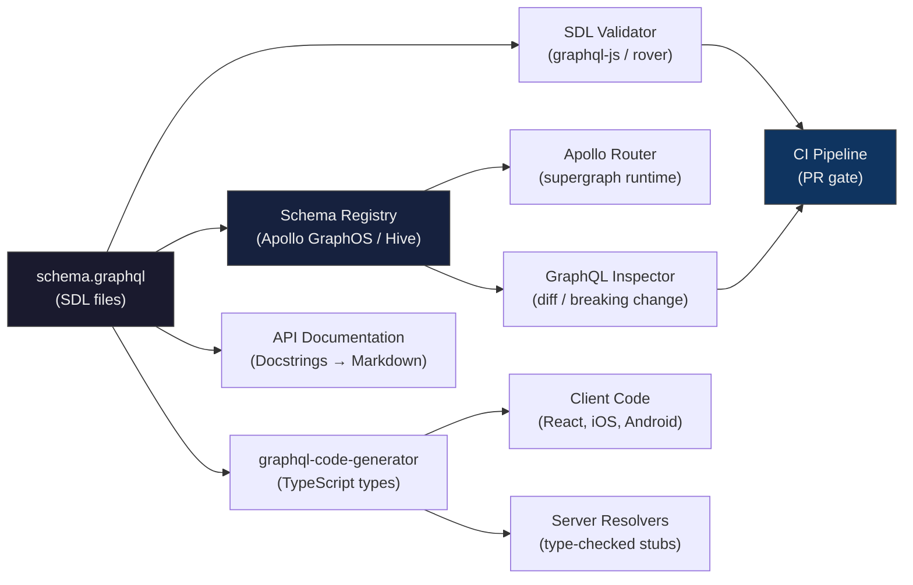
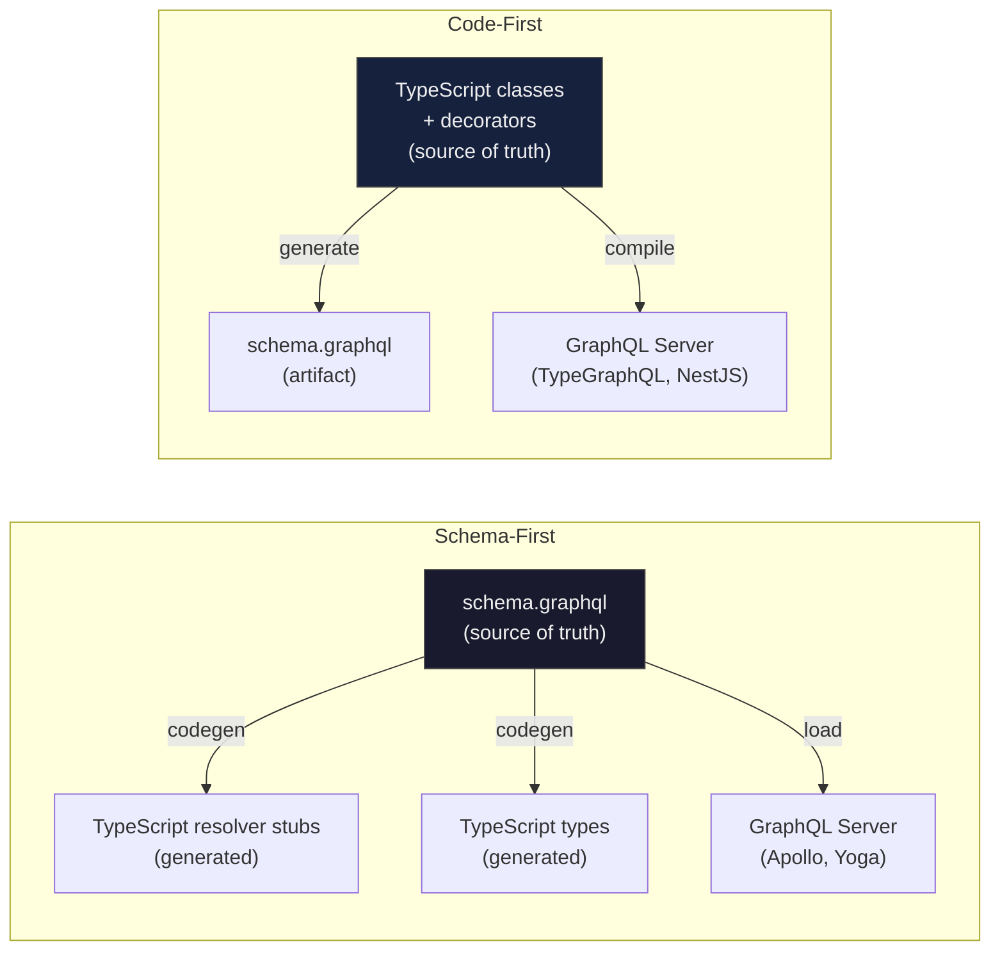

# Schema Definition Language and Introspection

> **Purpose:** Master SDL as the canonical API contract language — syntax, docstrings, schema-first vs. code-first tradeoffs, and introspection as a tooling foundation. Understand how to secure introspection in production and automate schema validation in CI pipelines.

---

## Learning Objectives

- [ ] Write complete, well-documented SDL for a realistic domain including all type constructs
- [ ] Explain every SDL keyword and annotation with its precise semantics
- [ ] Distinguish schema-first from code-first and apply the right approach for a given team structure
- [ ] Execute introspection queries manually to explore an unknown schema
- [ ] Disable introspection in production and explain the security rationale
- [ ] Configure graphql-code-generator to generate TypeScript types from SDL
- [ ] Run `rover subgraph check` in CI to catch breaking changes before merge

---

## Overview / Architecture

SDL is a human-readable language for defining GraphQL schemas. It is language-agnostic — a `.graphql` file is the same whether your server is Node.js, Go, Rust, or JVM. The SDL file is the source of truth; all tooling derives from it.



The SDL file is the API contract. Everything else — server implementations, client types, documentation, router configuration — is derived from it. When SDL is the single source of truth, all consumers stay synchronized automatically.

---

## Core Concepts

### SDL Syntax Reference

Every SDL keyword with its purpose:

| Keyword | Purpose |
|---------|---------|
| `type` | Define an object type (output type with resolvers) |
| `input` | Define an input type (arguments and mutation payloads) |
| `interface` | Define an interface contract |
| `union` | Define a union of distinct types |
| `enum` | Define a fixed set of string values |
| `scalar` | Declare a custom scalar type |
| `directive` | Declare a custom directive |
| `schema` | Override default root type names (rarely needed) |
| `extend type` | Add fields to an existing type (federation, modular schemas) |
| `implements` | Declare that a type fulfills an interface |
| `!` | Non-null annotation |
| `[Type]` | List of Type |
| `"""..."""` | Triple-quoted docstring (appears in introspection) |
| `#` | Single-line comment (does NOT appear in introspection) |
| `=` | Default value for arguments |
| `@` | Directive application |

**Critical distinction — docstrings vs. comments:**

```graphql
# This is a comment — visible only in the .graphql file, NOT in introspection.
# Use for developer notes, TODOs, rationale that clients don't need.

"""
This is a docstring — visible in introspection, IDEs, GraphQL Sandbox,
and any documentation tool that reads the schema. This IS your API documentation.
"""
type Product {
  """Globally unique product identifier. Stable across renames and moves."""
  id: ID!
}
```

Every production schema field should have a docstring. Undocumented fields force consumers to read source code or ask in Slack.

### The SDL Root Types

```graphql
"""Defines the entry points for the three root operation types."""
schema {
  query: Query
  mutation: Mutation
  subscription: Subscription
}
```

In practice, you almost never write the `schema` keyword explicitly — GraphQL uses `Query`, `Mutation`, `Subscription` as default root names. Only use the explicit `schema` block when you need to rename these (legacy migration, unusual conventions).

### Nullability and List Modifiers

SDL expresses type constraints through annotation suffixes and wrappers:

```graphql
type AnnotationExamples {
  nullable: String                # null | string
  nonNull: String!                # string (never null)
  nullableList: [String]          # null | Array<null | string>
  nonNullList: [String]!          # Array<null | string> (list never null)
  nonNullItems: [String!]         # null | Array<string> (items never null)
  strictList: [String!]!          # Array<string> (strictest)
  nestedList: [[Int!]!]!          # Array<Array<number>>
}
```

### Argument Defaults and Documentation

```graphql
type Query {
  """
  Returns a paginated list of products.

  Use `first` and `after` for forward pagination (recommended).
  Use `last` and `before` for backward pagination.
  Maximum page size is 250 items.
  """
  products(
    """Number of items to return. Maximum: 250."""
    first: Int = 10
    """Cursor for forward pagination. Omit to start from the beginning."""
    after: String
    """Number of items to return from the end."""
    last: Int
    """Cursor for backward pagination."""
    before: String
    """Full-text search query applied to title and description."""
    search: String
    """Filter by category ID."""
    categoryId: ID
    """Sort field and direction."""
    sortKey: ProductSortKey = TITLE
    """Reverse the sort order."""
    reverse: Boolean = false
  ): ProductConnection!
}
```

### Extend Type — Modular SDL

`extend type` lets you add fields to an existing type across multiple files. This is essential in federated subgraphs:

```graphql
# base.graphql — core product fields
type Product implements Node {
  id: ID!
  sku: String!
  title: String!
}

# reviews.graphql — reviews subgraph adds a field to Product
extend type Product {
  """Customer reviews for this product. Resolved by the reviews subgraph."""
  reviews(first: Int = 10): ReviewConnection!
  averageRating: Float
}
```

In non-federated schemas, `extend type` is used to split large schema files into domain modules without creating separate services.

---

## Real-World Implementation

### Complete E-Commerce Schema SDL

```graphql
"""
E-Commerce GraphQL API
Version: 2.0
Maintained by: Platform Engineering
Schema Registry: https://graphos.apollographql.com/graph/ecommerce-prod
"""

scalar DateTime
scalar UUID
scalar Money
scalar URL

"""Global Relay-style node interface. Any entity with a stable global ID."""
interface Node {
  """Globally unique identifier for this entity."""
  id: ID!
}

"""Any entity that tracks create/update timestamps."""
interface Timestamped {
  """When this record was created."""
  createdAt: DateTime!
  """When this record was last modified."""
  updatedAt: DateTime!
}

# ─── Enums ─────────────────────────────────────────────────────────────────────

enum ProductStatus {
  """Product is not yet visible to customers."""
  DRAFT
  """Product is live and purchasable."""
  ACTIVE
  """Product is hidden but data is retained."""
  ARCHIVED
  """Product is no longer sold and will be removed."""
  DISCONTINUED
}

enum OrderStatus {
  PENDING
  CONFIRMED
  PROCESSING
  SHIPPED
  DELIVERED
  CANCELLED
  REFUNDED
}

enum ProductSortKey {
  TITLE
  PRICE
  CREATED_AT
  UPDATED_AT
  BEST_SELLING
}

enum InventoryPolicy {
  """Allow purchase even when out of stock."""
  CONTINUE
  """Prevent purchase when out of stock."""
  DENY
}

# ─── Scalars and Value Objects ──────────────────────────────────────────────────

"""Represents a monetary value in the smallest denomination of the currency."""
type MoneyValue {
  """
  Amount in the smallest currency unit.
  For USD: cents (100 = $1.00). For JPY: yen (100 = ¥100, no subdivision).
  """
  amount: Int!
  """ISO 4217 three-letter currency code: USD, EUR, GBP, JPY."""
  currency: String!
}

# ─── Pagination ─────────────────────────────────────────────────────────────────

"""Relay-spec PageInfo returned with every Connection type."""
type PageInfo {
  """Whether there is a next page when paginating forward."""
  hasNextPage: Boolean!
  """Whether there is a previous page when paginating backward."""
  hasPreviousPage: Boolean!
  """Cursor of the first edge in this page. Null if the page is empty."""
  startCursor: String
  """Cursor of the last edge in this page. Null if the page is empty."""
  endCursor: String
}

"""A single edge in a paginated Product list."""
type ProductEdge {
  """Opaque cursor for this position in the list."""
  cursor: String!
  """The product at this position."""
  node: Product!
}

"""Paginated list of products following the Relay Connection spec."""
type ProductConnection {
  edges: [ProductEdge!]!
  """Convenience field: the nodes without cursor wrappers."""
  nodes: [Product!]!
  pageInfo: PageInfo!
  """Total number of products matching the current filter."""
  totalCount: Int!
}

# ─── Core Types ─────────────────────────────────────────────────────────────────

"""
A product variant represents a specific version of a product
(e.g., size Medium, color Blue).
"""
type ProductVariant implements Node & Timestamped {
  id: ID!
  """Stock-keeping unit. Must be globally unique within the catalog."""
  sku: String!
  """Display name for this variant combination: "Medium / Blue"."""
  title: String!
  price: MoneyValue!
  """Crossed-out original price for sale display. Null if not on sale."""
  compareAtPrice: MoneyValue
  """Current inventory count. May be negative if overselling is allowed."""
  inventoryQuantity: Int!
  inventoryPolicy: InventoryPolicy!
  createdAt: DateTime!
  updatedAt: DateTime!
}

type ProductVariantEdge {
  cursor: String!
  node: ProductVariant!
}

type ProductVariantConnection {
  edges: [ProductVariantEdge!]!
  nodes: [ProductVariant!]!
  pageInfo: PageInfo!
  totalCount: Int!
}

"""
A product in the catalog. Products have one or more variants.
Use variants for size/color/configuration options.
"""
type Product implements Node & Timestamped {
  id: ID!
  """
  Stock-keeping unit for the base product.
  Variant SKUs are on ProductVariant.sku.
  """
  sku: String!
  title: String!
  """
  Product description. Supports CommonMark markdown.
  Null means no description has been written yet.
  """
  description: String
  status: ProductStatus!
  """Base price. Individual variants may override this."""
  price: MoneyValue!
  """Original price before markdown. Null if not on sale."""
  compareAtPrice: MoneyValue
  """Searchable tags for filtering and merchandising."""
  tags: [String!]!
  """Primary product image URL."""
  imageUrl: URL
  """All variants of this product, paginated."""
  variants(
    first: Int = 10
    after: String
  ): ProductVariantConnection!
  createdAt: DateTime!
  updatedAt: DateTime!
}

"""
Represents a customer or staff account.
"""
type User implements Node & Timestamped {
  id: ID!
  """Display name."""
  name: String!
  """Unique email address. Used for authentication."""
  email: String!
  """URL to the user's profile avatar image."""
  avatarUrl: URL
  createdAt: DateTime!
  updatedAt: DateTime!
}

# ─── Errors ──────────────────────────────────────────────────────────────────────

"""
A user-facing validation or business logic error.
These are expected errors returned in the payload, not thrown exceptions.
See: https://www.apollographql.com/docs/react/data/error-handling/
"""
type UserError {
  """
  Path to the input field that caused the error, if applicable.
  Example: ["input", "price", "amount"] for a nested input field.
  """
  field: [String!]!
  """Human-readable error message suitable for display."""
  message: String!
  """Machine-readable error code for programmatic handling."""
  code: String!
}

# ─── Input Types ─────────────────────────────────────────────────────────────────

"""Input for monetary values. Always use cents (smallest denomination)."""
input MoneyInput {
  """Amount in the smallest currency unit (cents for USD)."""
  amount: Int!
  """ISO 4217 currency code."""
  currency: String!
}

input CreateProductInput {
  sku: String!
  title: String!
  description: String
  """
  Base price for the product. Variants can override this.
  Specify in the smallest currency unit (cents).
  """
  price: MoneyInput!
  compareAtPrice: MoneyInput
  tags: [String!]
  imageUrl: URL
}

"""All fields are optional — only provided fields are updated (partial update)."""
input UpdateProductInput {
  title: String
  description: String
  price: MoneyInput
  compareAtPrice: MoneyInput
  tags: [String!]
  imageUrl: URL
  status: ProductStatus
}

# ─── Mutation Payloads ───────────────────────────────────────────────────────────

type CreateProductPayload {
  """
  The created product. Null if the mutation failed.
  Check userErrors for validation failures.
  """
  product: Product
  userErrors: [UserError!]!
}

type UpdateProductPayload {
  """The updated product. Null if the mutation failed."""
  product: Product
  userErrors: [UserError!]!
}

type DeleteProductPayload {
  """The ID of the deleted product."""
  deletedProductId: ID
  userErrors: [UserError!]!
}

# ─── Root Types ──────────────────────────────────────────────────────────────────

"""All read operations. Start here for data fetching."""
type Query {
  """Fetch any entity by its global Node ID."""
  node(id: ID!): Node

  """Fetch a product by ID. Returns null if not found."""
  product(id: ID!): Product

  """
  Fetch a product by SKU. Returns null if not found.
  Use this for catalog lookups from external systems.
  """
  productBySku(sku: String!): Product

  """Paginated product catalog with filtering and sorting."""
  products(
    first: Int = 10
    after: String
    last: Int
    before: String
    search: String
    categoryId: ID
    status: ProductStatus
    tags: [String!]
    sortKey: ProductSortKey = TITLE
    reverse: Boolean = false
  ): ProductConnection!

  """The currently authenticated user. Null if not authenticated."""
  me: User
}

"""All write operations."""
type Mutation {
  """Create a new product in the catalog."""
  createProduct(input: CreateProductInput!): CreateProductPayload!

  """Update an existing product. Only provided fields are modified."""
  updateProduct(id: ID!, input: UpdateProductInput!): UpdateProductPayload!

  """
  Soft-delete a product. The product is archived, not permanently removed.
  Use status: DISCONTINUED for products that will never return.
  """
  deleteProduct(id: ID!): DeleteProductPayload!
}
```

### Schema-First vs. Code-First

Both approaches generate the same runtime GraphQL schema. The difference is where you start — SDL or code — and what the source of truth is.



| Dimension | Schema-First | Code-First |
|-----------|-------------|-----------|
| **Source of truth** | `.graphql` SDL files | Code decorators / builders |
| **Primary tools** | graphql-code-generator, rover | TypeGraphQL, NestJS GraphQL, Pothos |
| **Schema readability** | Excellent — SDL is human-readable | Requires running the generator to see SDL |
| **Type safety** | Types generated from SDL; can drift if generation skipped | Types and schema are always in sync |
| **Refactoring** | Rename in SDL + regenerate | Rename in code; schema updates automatically |
| **Multi-language support** | Schema is language-agnostic; same SDL used by Go, TS, iOS | Schema is generated from one language's codebase |
| **Team collaboration** | SDL as contract for API reviews | Code review may miss schema implications |
| **Recommended for** | APIs shared across teams or languages | Single-team, single-language internal services |

**Production recommendation:** Schema-first for any API that crosses a team boundary, is consumed by mobile clients, or has external consumers. The SDL file in source control IS the contract — version it, review it, lint it. Code-first is appropriate when a single backend team owns both the API and all consumers and values the tight IDE integration.

### Introspection Queries

Introspection is a built-in GraphQL feature allowing clients to query the schema itself. It uses the `__schema` and `__type` meta-fields.

**List all types in the schema:**

```graphql
query ListAllTypes {
  __schema {
    types {
      name
      kind
      description
    }
  }
}
```

**Inspect a specific type:**

```graphql
query InspectProductType {
  __type(name: "Product") {
    name
    kind
    description
    fields(includeDeprecated: true) {
      name
      description
      type {
        name
        kind
        # For NON_NULL and LIST wrappers, the actual type is in ofType
        ofType {
          name
          kind
          ofType {
            name
            kind
          }
        }
      }
      isDeprecated
      deprecationReason
      args {
        name
        type { name kind }
        defaultValue
      }
    }
  }
}
```

**List all mutations:**

```graphql
query ListMutations {
  __schema {
    mutationType {
      fields {
        name
        description
        args {
          name
          type { name kind ofType { name kind } }
        }
        type { name kind }
      }
    }
  }
}
```

**Get the full schema for tooling (introspection query used by codegen):**

```graphql
query IntrospectionQuery {
  __schema {
    queryType { name }
    mutationType { name }
    subscriptionType { name }
    types {
      ...FullType
    }
    directives {
      name
      description
      locations
      args { ...InputValue }
    }
  }
}

fragment FullType on __Type {
  kind name description
  fields(includeDeprecated: true) {
    name description
    args { ...InputValue }
    type { ...TypeRef }
    isDeprecated deprecationReason
  }
  inputFields { ...InputValue }
  interfaces { ...TypeRef }
  enumValues(includeDeprecated: true) {
    name description isDeprecated deprecationReason
  }
  possibleTypes { ...TypeRef }
}

fragment InputValue on __InputValue {
  name description
  type { ...TypeRef }
  defaultValue
}

fragment TypeRef on __Type {
  kind name
  ofType {
    kind name
    ofType {
      kind name
      ofType {
        kind name
        ofType {
          kind name
          ofType {
            kind name
            ofType { kind name }
          }
        }
      }
    }
  }
}
```

This is the standard introspection query used by graphql-code-generator, Apollo Studio, and most GraphQL tooling.

### Tools That Depend on Introspection

| Tool | How It Uses Introspection |
|------|--------------------------|
| Apollo Studio / Sandbox | Query autocomplete, schema explorer |
| GraphQL Playground / Altair | Schema tab, query autocompletion |
| graphql-code-generator | TypeScript type generation |
| GraphQL Inspector | Schema diffing and breaking change detection |
| Apollo Client DevTools | Browser extension schema browsing |
| Postman / Insomnia | GraphQL autocompletion |
| rover CLI | `rover graph introspect` to save schema snapshots |
| IDE plugins (VSCode, JetBrains) | Inline schema documentation, field validation |

### Introspection Security

Introspection is reconnaissance. It reveals your entire API surface, including deprecated fields, internal types, field names that hint at business logic, and implementation details. Disable it in production for unauthenticated clients.

**Disable introspection in Apollo Server:**

```typescript
import { ApolloServer } from '@apollo/server';

const server = new ApolloServer({
  schema,
  // Disable in production; enable in development and staging
  introspection: process.env.GRAPHQL_INTROSPECTION === 'true'
    || process.env.NODE_ENV === 'development',
});
```

**Disable in Apollo Router (router.yaml):**

```yaml
# router.yaml
supergraph:
  # Disable introspection for all clients by default
  introspection: false

# To allow introspection for trusted internal clients,
# use a header-based override via a custom plugin or Rhai script:
# (See docs/03-router/ for header-based conditional introspection)
```

**Allow introspection only with a trusted header (Apollo Router Rhai):**

```rhai
// introspection_guard.rhai
fn supergraph_service(service) {
  let request_callback = |request| {
    let introspection_header = request.headers["x-allow-introspection"];
    let introspection_key = env.get("INTROSPECTION_SECRET");

    if request.body.query.contains("__schema") || request.body.query.contains("__type") {
      if introspection_header != introspection_key {
        throw #{
          status: 403,
          message: "Introspection is disabled. Contact platform-eng for schema access."
        };
      }
    }
  };
  service.map_request(request_callback);
}
```

**Provide schema access through secure channels instead of live introspection:**

- Publish SDL files to a schema registry (Apollo GraphOS, GraphQL Hive)
- Share `schema.graphql` files through a private git repository or artifact store
- Generate and publish documentation from SDL (Docusaurus, Backstage)

### SDL Tooling Configuration

**graphql-code-generator — full configuration:**

```yaml
# codegen.yml
schema:
  - ./schema.graphql
  # For federation: merge subgraph schemas
  # - ./products/schema.graphql
  # - ./orders/schema.graphql

documents:
  - ./src/**/*.fragment.ts
  - ./src/**/*.query.ts
  - ./src/**/*.mutation.ts
  - ./src/**/*.graphql

generates:
  # Client-side TypeScript types
  ./src/generated/graphql.ts:
    plugins:
      - typescript
      - typescript-operations
      - typescript-react-apollo
    config:
      withHooks: true
      withComponent: false
      withHOC: false
      avoidOptionals: false
      # Always include __typename for Apollo cache correctness
      nonOptionalTypename: true
      # Generate strict enum types (not string literals)
      enumsAsTypes: false

  # Server-side resolver type stubs
  ./src/generated/resolvers.ts:
    plugins:
      - typescript
      - typescript-resolvers
    config:
      # Map SDL scalar names to TypeScript types
      scalarsModule: ./scalars
      scalars:
        DateTime: Date
        UUID: string
        Money: '{ amount: number; currency: string }'
        URL: string
        JSON: unknown
      # Emit resolver types as interfaces (easier to implement)
      contextType: ../context#GraphQLContext
```

**rover CLI — schema validation in CI:**

```bash
#!/bin/bash
# ci/check-schema.sh

set -e

# Check that SDL is valid (syntax + basic semantic checks)
rover graph introspect https://api-staging.example.com/graphql \
  --output ./schema-live.graphql

# Diff the proposed schema against what's deployed
# This catches breaking changes before they merge
rover graph check ecommerce-prod@staging \
  --schema ./schema.graphql \
  --query-count-threshold 1 \
  --query-count-threshold-percentage 5

echo "Schema check passed"
```

**graphql-inspector in CI — diff-based breaking change detection:**

```yaml
# .github/workflows/schema-check.yml
name: Schema Check
on:
  pull_request:
    paths:
      - '**/*.graphql'
      - 'schema.graphql'

jobs:
  schema-diff:
    runs-on: ubuntu-latest
    steps:
      - uses: actions/checkout@v3
        with:
          fetch-depth: 0

      - name: Install graphql-inspector
        run: npm install -g @graphql-inspector/cli

      - name: Diff schema against main
        run: |
          git show origin/main:schema.graphql > /tmp/schema-main.graphql
          graphql-inspector diff /tmp/schema-main.graphql schema.graphql \
            --rule suppressRemovalOfDeprecatedField

      - name: Validate SDL syntax
        run: graphql-inspector validate schema.graphql
```

**SDL linting with graphql-eslint:**

```json
// .eslintrc.json
{
  "overrides": [
    {
      "files": ["**/*.graphql"],
      "parser": "@graphql-eslint/eslint-plugin",
      "plugins": ["@graphql-eslint"],
      "rules": {
        "@graphql-eslint/description-style": ["error", { "style": "block" }],
        "@graphql-eslint/require-description": [
          "error",
          {
            "types": true,
            "FieldDefinition": true,
            "EnumTypeDefinition": true,
            "InputObjectTypeDefinition": true
          }
        ],
        "@graphql-eslint/no-deprecated": "warn",
        "@graphql-eslint/naming-convention": [
          "error",
          {
            "types": "PascalCase",
            "FieldDefinition": "camelCase",
            "EnumValueDefinition": "UPPER_CASE",
            "InputObjectTypeDefinition": { "suffix": "Input" }
          }
        ],
        "@graphql-eslint/fields-on-correct-type": "error",
        "@graphql-eslint/known-type-names": "error",
        "@graphql-eslint/no-unreachable-types": "error"
      }
    }
  ]
}
```

---

## Production Considerations

### Performance

- Introspection queries traverse the entire schema object in memory. A schema with 500 types and 2,000 fields generates a large introspection response (~1-3MB uncompressed). Rate-limit introspection endpoints separately from regular API endpoints.
- The `__schema` and `__type` meta-fields are resolved by the GraphQL runtime, not your resolvers — they bypass custom authentication middleware unless you explicitly guard them (see Rhai example above).
- graphql-code-generator runs against the SDL file, not a live server. In CI, use the committed SDL file rather than introspecting a live endpoint — this eliminates a network dependency and is deterministic.
- Schema parsing (loading the SDL and building the schema object) is expensive. Cache the parsed schema in memory — parse once at startup, not per request.

### Security

- **Disable introspection in production.** This is not optional for customer-facing APIs. Introspection exposes your full API surface including deprecated fields, internal types, and argument names that reveal business logic.
- When you must allow introspection for tooling (IDE plugins, monitoring), require an authentication header with a long-lived service account token, and log all introspection access.
- SDL files committed to git may contain sensitive field names or business logic in docstrings. Review SDL files in security-sensitive PRs the same way you review code changes.
- Input types do not validate values beyond type coercion — an `Int!` argument accepts any integer. Runtime validation of business constraints (positive amounts, valid enum values from external systems, string length limits) must happen in resolver code.

### Scaling

- In a federated graph with 50+ subgraphs, each subgraph's SDL is composed into a supergraph SDL by the schema registry. The composition step validates that all cross-service type references are valid. Run composition validation in CI — a composition failure means the entire supergraph breaks.
- Schema registry services (Apollo GraphOS, GraphQL Hive) version every schema publish. You can roll back to a previous schema version if a deployment introduces a regression. Enable this workflow: it's the schema equivalent of a git revert.
- GraphQL Hive's open-source schema registry is self-hostable for organizations that cannot use SaaS tools. It provides schema versioning, usage analytics, and breaking change detection without vendor lock-in.

### Observability

- Track **docstring coverage**: the percentage of types, fields, and arguments that have triple-quoted descriptions. Make this a CI metric. Target: 100% for public fields.
- Schema change events (publishes, check failures, composition errors) should emit to your observability platform (Datadog, Grafana). Apollo GraphOS provides webhook integrations for schema events.
- When graphql-code-generator runs in CI and produces a diff in `generated/graphql.ts`, surface that diff in the PR for review. Generated type changes are implicit API contract changes.

---

## Best Practices

1. **Document every field with triple-quoted docstrings** — `"""..."""` is API documentation, not developer commentary. Write docstrings as if explaining the field to a new team member who has never seen your codebase. Include units (cents, milliseconds), constraints (max 250 items), nullability semantics, and related fields.

2. **Use schema-first (SDL in `.graphql` files) for APIs shared across teams** — when multiple teams or clients consume your API, the SDL is the contract. Treat it as such: review SDL changes in PRs, version it in git, publish to a schema registry. Never let the schema be an emergent artifact of implementation.

3. **Disable introspection in production without exception** — provide schema files to consumers through the schema registry, a shared git repository, or generated documentation. Live introspection is a convenience for development, not a production API feature.

4. **Add SDL validation to every CI pipeline that touches `.graphql` files** — syntax errors in SDL should fail the PR before reaching code review. Use `rover graph check`, `graphql-inspector validate`, or `graphql-eslint` as a pre-merge gate. Breaking changes detected in CI are informational (the PR author can acknowledge them); breaking changes detected in production are incidents.

5. **Generate TypeScript types from SDL; never write them by hand** — hand-written GraphQL types drift from the schema, cause silent mismatches between client expectations and server responses, and are unmaintained in practice. The 30-second setup of graphql-code-generator eliminates an entire class of bugs.

---

## Anti-Patterns

### 1. Undocumented Fields

```graphql
# BAD: no docstrings on any fields
type Product {
  id: ID!
  sku: String!
  cmpAt: Money    # What is this? Compare-at price? Compressed at? Nobody knows.
  invPol: String  # Inventory policy? Invisible policy? Inscrutable.
}
```

**Why it fails:** The schema is the documentation. Undocumented fields force every consumer to read server source code, ask questions in Slack, or guess. IDEs and GraphQL Sandbox show docstrings inline while the developer is writing queries — this is the highest-value moment for documentation. Add graphql-eslint's `require-description` rule to enforce this.

### 2. Introspection Enabled in Production Without Auth

```typescript
// BAD: introspection always on
const server = new ApolloServer({
  schema,
  introspection: true,  // Never hardcode true in production config
});
```

**Why it fails:** An attacker who finds your GraphQL endpoint gets a complete map of your API: every type, every field, every argument, every deprecated field that might have weakened security controls. This is the GraphQL equivalent of leaving your OpenAPI spec publicly accessible with no auth — except the spec is live and always up to date. Use `process.env.NODE_ENV !== 'production'` at minimum, or an explicit environment variable gated by your secrets manager.

### 3. Editing Generated Files by Hand

```typescript
// src/generated/graphql.ts — BAD: developer has added manual changes
// This file is generated by graphql-code-generator. DO NOT EDIT.
// ... generated content ...

// MANUALLY ADDED — needed for some reason
export type ProductWithExtras = Product & {
  extras: string[];
};
```

**Why it fails:** The next time codegen runs (on every `npm run codegen` or in CI), the manually added changes are overwritten. This creates a flaky codebase where some environments have the manual changes and others don't. Add custom types in a separate `graphql-extensions.ts` file that imports from the generated file and augments it.

---

## Operational Notes

- `rover graph introspect <url> > schema.graphql` is the fastest way to save a schema snapshot from a live server. Check the saved file into git as a point-in-time reference.
- Apollo Sandbox (sandbox.apollo.dev) is a fully client-side GraphQL IDE that requires introspection from the server you point it at. Use it in development environments only.
- The `graphql-tag` (gql) template literal in JavaScript/TypeScript parses SDL/query strings at runtime. For production performance, use persisted queries (pre-registered operation IDs) instead of sending full query strings.
- SDL field ordering matters for human readability but not for schema semantics. Establish a convention: required fields first, optional fields second, computed/derived fields last, connection fields (relations) at the end.
- When a SDL schema file grows beyond ~500 lines, split it by domain into multiple `.graphql` files and merge them at build time with graphql-tools `mergeTypeDefs` or by specifying a glob in codegen.yml.

---

## References

- [GraphQL Specification — Type System](https://spec.graphql.org/October2021/#sec-Type-System)
- [Apollo Router — Introspection Configuration](https://www.apollographql.com/docs/router/configuration/overview/)
- [graphql-code-generator Documentation](https://the-guild.dev/graphql/codegen/docs/getting-started)
- [rover CLI Reference](https://www.apollographql.com/docs/rover/)
- [GraphQL Inspector](https://the-guild.dev/graphql/inspector)
- [graphql-eslint](https://the-guild.dev/graphql/eslint/docs)
- [GraphQL Hive — Schema Registry](https://the-guild.dev/graphql/hive)
- [Apollo GraphOS — Schema Registry](https://www.apollographql.com/docs/graphos/schema-management/)

---

## Related Topics

- [03 — Types, Fragments, and Directives](./03-types-fragments-directives.md)
- [05 — Schema Evolution](./05-schema-evolution.md)
