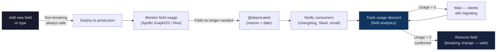

# Schema Evolution

> **Purpose:** Define and enforce a disciplined, zero-downtime process for evolving a production GraphQL schema — covering the breaking/non-breaking change taxonomy, the full deprecation lifecycle, federation-aware field migration patterns, and CI tooling that makes safe evolution automatic rather than manual.

---

## Learning Objectives

- [ ] Classify any proposed schema change as breaking or non-breaking with a rationale
- [ ] Execute the complete deprecation lifecycle: annotate, communicate, monitor, remove
- [ ] Use Apollo GraphOS and GraphQL Hive field usage analytics to gate field removal on confirmed zero usage
- [ ] Configure `rover subgraph check` and `graphql-inspector diff` as CI PR gates
- [ ] Apply the `@override` directive to migrate a field between federation subgraphs
- [ ] Author a schema evolution SLA document for governance
- [ ] Recognize the four anti-patterns that cause production breakage during schema evolution

---

## Overview / Architecture

GraphQL's design philosophy replaces REST versioning with continuous schema evolution. Rather than creating `/v1`, `/v2`, `/v3` endpoints that must all be maintained in parallel, a GraphQL schema grows additively. Old clients continue to work unchanged because they only request the fields they declared. New clients use new fields. When a field is no longer needed, it is deprecated, monitored, and eventually removed after a confirmed migration window.

This lifecycle is only possible because the type system provides complete visibility into which clients use which fields.



### Why This Differs From REST Versioning

| Dimension | REST Versioning | GraphQL Evolution |
|-----------|----------------|------------------|
| **Parallel surfaces** | v1, v2, v3 all live simultaneously | Single schema that grows over time |
| **Client coupling** | Clients pinned to a version | Clients request only what they declared |
| **Migration mechanism** | Forced cutover or indefinite parallel support | Deprecation window with usage analytics |
| **Breaking change detection** | Manual diff or OpenAPI linting | Schema registry, graphql-inspector |
| **Removal safety signal** | "Looks like nobody is using v1" | Confirmed 0% field usage in analytics |
| **Documentation** | Version-specific docs | Single schema with deprecation annotations |

The fundamental advantage: GraphQL's strong type system means the server knows exactly which operations each client sends. Usage analytics are not estimates — they are exact counts of which fields appeared in real operations.

---

## Core Concepts

### Breaking vs. Non-Breaking Changes

This taxonomy is the foundation of safe schema evolution. Every proposed schema change must be classified before merging.

#### Safe (Non-Breaking) Changes

| Change | Rationale |
|--------|-----------|
| Add a new field to an object type | Existing queries don't request it; they receive the same response as before |
| Add a new type (object, enum, interface, scalar) | Nothing queries or references it yet |
| Add a new optional argument (with a default value) | Existing callers don't pass it; the default preserves existing behavior |
| Add a new enum value | Existing code doesn't send the new value; existing queries that receive enum values may need a default case for future-proofing |
| Add a new subscription event | Nothing subscribes to it yet |
| Change a field's type from non-null to nullable | Existing code already handles non-null values; nullable is a superset (the field may now return null, but won't fail) |
| Apply `@deprecated` to a field | The field still functions; deprecation is informational only |
| Add a directive to a field | Directives with no side effects are non-breaking; directives with side effects (auth, rate limiting) require analysis |
| Add a new union member | Existing client inline fragments are unaffected; the new type simply won't match them |
| Add an optional field to an input type | Existing callers omit the field; the default (`null` or specified) is used |

#### Breaking Changes

| Change | Why It Breaks | Severity |
|--------|--------------|----------|
| Remove a field | Operations using that field fail validation | Critical |
| Rename a field | Equivalent to remove + add; existing operations fail | Critical |
| Change a field's output type | `String → Int`: existing clients receive wrong type, parse errors | Critical |
| Change nullable to non-null | Clients may pass `null`; now fails validation | High |
| Remove a type | Operations referencing the type fail validation | Critical |
| Remove an enum value | Operations sending the removed value fail validation; stored data is invalid | Critical |
| Rename an enum value | Equivalent to remove + add | Critical |
| Add a required (non-null) argument without a default | Existing operations that omit the argument fail validation | Critical |
| Remove an argument (required or optional) | Operations passing the argument fail validation | High |
| Remove a union member | Operations with inline fragments for that type fail | High |
| Remove an interface implementation | Operations querying via the interface may fail | High |
| Change an argument type | Existing operations pass the old type; validation fails | Critical |

#### The "Soft Breaking" Category

Some changes are technically non-breaking per the GraphQL spec but are breaking in practice for specific clients:

- **Adding a new enum value:** TypeScript clients with exhaustive switch statements (`switch (status) { case 'PENDING': ... case 'CONFIRMED': ... default: assertNever(status) }`) will throw at the `default` case when they receive the new value. This is a client bug (correct code should have a graceful default), but it causes real production errors.
- **Changing a nullable field to non-null:** Technically a widening change (non-null is a subtype of nullable), but code generators that previously emitted `string | null` types will now emit `string`, causing compile errors in clients if they have null guards.
- **Adding an `@auth` directive to a previously open field:** Technically an additive directive; in practice, existing clients that could access the field will now receive `FORBIDDEN` errors.

Always communicate soft breaking changes as if they were breaking changes. The consumers decide whether they're affected.

### GraphQL Spec Compatibility Matrix

```
                 Existing Client Behavior
Change           Queries Field  Doesn't Query  Sends as Input  Doesn't Send
────────────────────────────────────────────────────────────────────────────
Add field              ✓              ✓               n/a           n/a
Remove field           ✗              ✓               n/a           n/a
Add optional arg       ✓              ✓               ✓             ✓
Add required arg       n/a            n/a              ✓             ✗
Remove arg             ✓              ✓               ✗             ✓
Change type (out)      ✗              ✓               n/a           n/a
Change type (in)       n/a            n/a              ✗            ✓
null → non-null        ✓              ✓               ✗             ✓
non-null → null        ✓              ✓               ✓             ✓
Add enum value         ✓              ✓               ✓*            ✓
Remove enum value      ✓*             ✓               ✗             ✓

✓ = safe   ✗ = breaking   * = potentially breaking in practice
```

---

## Real-World Implementation

### The Complete Deprecation Lifecycle

#### Step 1 — Annotate the Field

```graphql
type User {
  """
  Full name of the user.
  @deprecated Use firstName + lastName for proper internationalization support.
  """
  name: String @deprecated(reason: "Use firstName and lastName. Removing 2025-06-01.")

  """User's given name."""
  firstName: String!

  """User's family name."""
  lastName: String!
}
```

Write the `reason` as a complete sentence that:
1. Names the replacement field(s)
2. Explains why the change was made (not just "use X instead")
3. Includes the planned removal date

#### Step 2 — Publish the Schema Change

```bash
# Publish the updated subgraph schema to the registry
rover subgraph publish ecommerce-prod@production \
  --name users \
  --schema ./users/schema.graphql \
  --routing-url https://users.internal.example.com/graphql
```

The schema registry records the deprecation. Apollo GraphOS field usage metrics will now tag all queries using `name` as "using a deprecated field."

#### Step 3 — Communicate to Consumers

Every deprecation needs a communication artifact:

```markdown
# Schema Changelog — 2025-03-01

## Deprecated: User.name

**Replacement:** `User.firstName` + `User.lastName`

**Reason:** `name` is a single concatenated string that cannot be correctly
internationalized for languages with different name ordering conventions.
The split fields allow clients to apply correct locale-aware display.

**Migration:**
```graphql
# Before
fragment UserDisplay on User {
  name
}

# After
fragment UserDisplay on User {
  firstName
  lastName
}
```

**Removal date:** 2025-06-01 (90-day window)

**Current usage:** 14 unique operations across 4 client applications.
Contact @platform-eng if you need an extension.
```

Post this changelog to:
- Your schema registry (GraphOS schema changelog)
- Internal engineering Slack channel (`#api-changes`)
- Any API consumer mailing lists
- The git commit message

#### Step 4 — Monitor Usage Descent

Apollo GraphOS field usage query (from the Insights tab):

```graphql
# Apollo GraphOS Operations Insights API
# https://studio.apollographql.com/org/<org>/graph/<graph>/insights

# Filter by: Field = "User.name"
# Group by: Client name, Operation name
# Date range: Last 30 days
# Export: CSV for tracking in your incident management system
```

GraphQL Hive usage report query (self-hosted or cloud):

```bash
# Hive CLI — check field usage
hive operations:check \
  --registry.accessToken $HIVE_TOKEN \
  --target ecommerce/production \
  --field "User.name"
```

Set up a weekly automated report:

```typescript
// scripts/check-deprecated-field-usage.ts
import { ApolloClient } from '@apollo/client';

async function checkDeprecatedFieldUsage() {
  const response = await fetch('https://api.apollographql.com/api/graphql', {
    method: 'POST',
    headers: {
      'Content-Type': 'application/json',
      'x-api-key': process.env.APOLLO_API_KEY!,
    },
    body: JSON.stringify({
      query: `
        query DeprecatedFieldUsage($graphId: ID!, $from: Timestamp!, $to: Timestamp!) {
          graph(id: $graphId) {
            variant(name: "production") {
              fieldInsights(
                fieldNames: ["User.name", "Product.price", "Order.total"]
                from: $from
                to: $to
              ) {
                fieldName
                totalRequests
                percentOfOperations
              }
            }
          }
        }
      `,
      variables: {
        graphId: 'ecommerce-prod',
        from: new Date(Date.now() - 7 * 24 * 60 * 60 * 1000).toISOString(),
        to: new Date().toISOString(),
      },
    }),
  });

  const data = await response.json();
  const fields = data.data.graph.variant.fieldInsights;

  for (const field of fields) {
    if (field.totalRequests > 0) {
      console.warn(
        `⚠ Deprecated field ${field.fieldName} still has ` +
        `${field.totalRequests} requests (${field.percentOfOperations}% of operations)`
      );
    } else {
      console.log(`✓ ${field.fieldName}: zero usage — safe to remove`);
    }
  }
}
```

#### Step 5 — Remove the Field (Gate: Confirmed Zero Usage)

Only remove when field usage is confirmed at zero for at least 2 consecutive weeks. One week of zero usage can be a monitoring gap; two weeks is a signal.

```graphql
# After confirmed zero usage:
type User {
  # name field removed — was deprecated 2025-03-01, removed 2025-06-15 (107 days)
  firstName: String!
  lastName: String!
}
```

Run the breaking change check as the final gate:

```bash
# CI: check that the removal is safe
rover graph check ecommerce-prod@production \
  --schema ./updated-schema.graphql \
  --validation-period P7D  # Check against 7 days of operation history
```

If any operation in the past 7 days used `User.name`, the check fails and removal is blocked.

### CI Breaking Change Detection

**GitHub Actions workflow:**

```yaml
# .github/workflows/schema-evolution.yml
name: Schema Evolution Check

on:
  pull_request:
    paths:
      - '**/*.graphql'

jobs:
  breaking-change-check:
    runs-on: ubuntu-latest
    steps:
      - uses: actions/checkout@v4
        with:
          fetch-depth: 0

      - name: Install rover
        run: |
          curl -sSL https://rover.apollo.dev/nix/latest | sh
          echo "$HOME/.rover/bin" >> $GITHUB_PATH

      - name: Check against schema registry
        env:
          APOLLO_KEY: ${{ secrets.APOLLO_STUDIO_KEY }}
        run: |
          rover subgraph check ecommerce-prod@staging \
            --name products \
            --schema ./products/schema.graphql \
            --background

      - name: Local diff (no registry dependency)
        run: |
          # Fetch base branch schema for comparison
          git show origin/${{ github.base_ref }}:products/schema.graphql \
            > /tmp/schema-base.graphql

          npx @graphql-inspector/cli diff \
            /tmp/schema-base.graphql \
            ./products/schema.graphql \
            --rule suppressRemovalOfDeprecatedField \
            --onBreaking "exit 1"

      - name: Comment breaking changes on PR
        if: failure()
        uses: actions/github-script@v6
        with:
          script: |
            github.rest.issues.createComment({
              issue_number: context.issue.number,
              owner: context.repo.owner,
              repo: context.repo.repo,
              body: '## Schema Breaking Change Detected\n\nThis PR contains breaking schema changes. Review the schema-evolution job output and follow the deprecation workflow in `docs/01-graphql-fundamentals/05-schema-evolution.md`.'
            });
```

**graphql-inspector diff output (annotated):**

```
$ graphql-inspector diff schema-base.graphql schema-proposed.graphql

Detected the following changes (1 breaking, 2 non-breaking):

✖ Field 'User.name' was removed (BREAKING)
  This field is referenced in 14 known operations.
  Apply @deprecated first, then remove after usage reaches zero.

✔ Field 'User.firstName' was added (NON_BREAKING)

✔ Field 'User.lastName' was added (NON_BREAKING)
```

### Federation Field Migration with `@override`

In a federated graph, fields occasionally need to move from one subgraph to another. The `@override` directive handles this migration without a coordination cutover.

**Scenario:** The `Product.inventory` field is being migrated from the `products` subgraph to a new `inventory` subgraph.

**Step 1 — Add the field to the new subgraph with `@override`:**

```graphql
# inventory/schema.graphql (new subgraph taking ownership)
extend schema
  @link(url: "https://specs.apollo.dev/federation/v2.3", import: ["@key", "@override"])

type Product @key(fields: "id") {
  id: ID!
  """
  Current inventory status for this product.
  Migrated from products subgraph — @override active during transition.
  """
  inventory: InventoryStatus! @override(from: "products")
  inventoryQuantity: Int! @override(from: "products")
}

enum InventoryStatus {
  IN_STOCK
  LOW_STOCK
  OUT_OF_STOCK
  BACKORDERED
  DISCONTINUED
}
```

**Step 2 — The `products` subgraph keeps the field during transition (no changes needed):**

Apollo Router will route `Product.inventory` queries to the `inventory` subgraph because of `@override`. The field in `products` is now unreachable from the router's perspective but still exists.

**Step 3 — After confirming the migration is stable, remove the field from `products`:**

```graphql
# products/schema.graphql (after migration is complete)
type Product @key(fields: "id") {
  id: ID!
  sku: String!
  title: String!
  # inventory and inventoryQuantity removed — now owned by inventory subgraph
}
```

**Step 4 — Remove `@override` from the inventory subgraph:**

```graphql
# inventory/schema.graphql (final state)
type Product @key(fields: "id") {
  id: ID!
  inventory: InventoryStatus!  # @override removed — full ownership
  inventoryQuantity: Int!
}
```

The `@override` directive enables a blue-green migration for field ownership. During Step 2, if the inventory subgraph has errors, traffic can be rolled back by removing the `@override` and the `products` subgraph field serves again.

### Parallel Fields Pattern

The safest field migration: run old and new simultaneously. Clients migrate at their own pace.

```graphql
type Product {
  """
  Product price as a Float (USD).
  @deprecated Use priceV2 which returns a structured Money type with currency support.
  Removing 2025-09-01.
  """
  price: Float @deprecated(reason: "Use priceV2. Removing 2025-09-01.")

  """
  Product price as a structured Money type.
  Supports multi-currency and returns the exact smallest-denomination amount.
  """
  priceV2: Money!
}
```

Resolver implementation during the transition:

```typescript
const resolvers = {
  Product: {
    // Old field: compute from new data model
    price: (product: ProductEntity) => {
      // Convert from Money to Float for backward compatibility
      if (product.price.currency === 'USD') {
        return product.price.amount / 100;
      }
      // Non-USD: best effort conversion, known to be imprecise
      return product.price.amount / 100;
    },

    // New field: return structured type
    priceV2: (product: ProductEntity) => ({
      amount: product.price.amount,
      currency: product.price.currency,
    }),
  },
};
```

### Input Type Evolution

Input types follow slightly different rules than output types:

```graphql
# Original input type
input CreateOrderInput {
  productId: ID!
  quantity: Int!
  shippingAddressId: ID!
}

# Evolution — adding optional field (NON-BREAKING)
input CreateOrderInput {
  productId: ID!
  quantity: Int!
  shippingAddressId: ID!
  """
  Optional coupon code to apply at order creation.
  If omitted, no discount is applied.
  """
  couponCode: String  # Optional (no !) — existing callers omit it safely
}

# Evolution — removing a required field (BREAKING for callers who pass it)
# Requires a two-step migration:
# Step 1: Make the field optional (non-breaking)
input CreateOrderInput {
  productId: ID!
  quantity: Int!
  shippingAddressId: ID!  # Still here but now optional
  giftMessage: String @deprecated(reason: "Use orderNotes instead")
  orderNotes: String
}
# Step 2: After confirmed zero usage of giftMessage, remove it
```

**Input type evolution rules:**

| Change | Safe? | Migration |
|--------|-------|-----------|
| Add optional field | Yes | Immediately |
| Add required field | No | Create a new input type or mutation; deprecate old |
| Remove optional field | No (callers may pass it) | Deprecate, monitor, remove |
| Remove required field | Yes (callers don't pass it) | Direct removal |
| Change field type | No | Add new field, deprecate old |

### Schema Evolution SLA Template

Document your SLA explicitly in your governance docs:

```markdown
# Schema Evolution SLA

## Deprecation Requirements

### Internal APIs (consumers are internal teams)
- Deprecation window: minimum 30 days
- Notification: #api-changes Slack channel + direct team DM
- Usage monitoring: weekly automated report
- Removal gate: zero usage for 14 consecutive days

### External APIs (consumers include partners or third parties)
- Deprecation window: minimum 6 months
- Notification: API changelog email + developer portal banner
- Usage monitoring: daily automated report with consumer attribution
- Removal gate: zero usage for 30 consecutive days + written acknowledgment from affected partners

### Emergency Removal (security vulnerability in a deprecated field)
- May be removed with 48-hour notice
- Requires: Security team sign-off, engineering VP approval, incident bridge notification
- Post-mortem required within 5 business days

## Breaking Change Policy

1. No breaking changes without a deprecation period (except emergency security removals)
2. Breaking changes in PRs must be acknowledged by the schema owner and affected consumer team leads
3. `rover subgraph check` failures block all merges — no exceptions
4. Schema evolution decisions are logged in the schema registry changelog

## Deprecation Annotation Standard

All @deprecated annotations must include:
- Replacement field or operation (required)
- Reason for the change (required)  
- Planned removal date in YYYY-MM-DD format (required)

Example:
  @deprecated(reason: "Use priceV2 for multi-currency support. Removing 2025-09-01.")
```

---

## Production Considerations

### Performance

- Field usage analytics (Apollo GraphOS, GraphQL Hive) query the analytics backend, not the GraphQL API itself. Run usage queries as a background job, not in the request path. Cache the results and refresh daily.
- The `rover subgraph check` command in CI contacts the schema registry and the analytics backend. Set a reasonable timeout (30 seconds) and handle failures gracefully — a registry outage should not block all PRs, but it should alert the platform team.
- Parallel fields (old + new simultaneously) double the resolver work for any client that requests both. This is rare in practice since clients migrate off the deprecated field. If parallel fields cause performance issues, add a deprecation-specific resolver trace metric to identify such clients.
- In a federated graph with 50+ subgraphs, schema composition is rerun on every subgraph publish. Composition time scales with schema size and cross-service type references. Keep subgraph schemas focused — a subgraph that does too much increases composition time for all other subgraphs.

### Security

- Deprecated fields can become security liabilities: a field deprecated because it exposed sensitive data that should now be access-controlled is still accessible during the deprecation window. Include a security review step for any deprecation that involves authorization changes.
- If a deprecated field is removed from the schema but the resolver still exists, the field is inaccessible from the API but the resolver logic remains. Audit resolvers when removing fields to avoid leaving dead code with security assumptions baked in.
- Schema evolution events (field added, field deprecated, field removed) should be audit-logged. A field removed from the schema without a corresponding deprecation event is a potential unauthorized change.
- `@override` during federation migration creates a period where two subgraphs define the same field. The router routes to the overriding subgraph, but ensure both subgraphs' authorization logic agrees during the transition. A field that requires ADMIN in the old subgraph must require ADMIN in the new subgraph.

### Scaling

- In a 50+ subgraph federated graph, manual tracking of breaking changes across subgraphs is impossible. Breaking change detection in CI is not optional — it is required infrastructure.
- Schema evolution tooling must be part of the platform team's service ownership. If `rover subgraph check` is broken in CI, teams will start bypassing the check. Treat schema validation tooling failures with the same urgency as production API failures.
- GraphQL Hive is fully open-source and self-hostable. For organizations with data residency requirements, run Hive on-premises rather than using SaaS analytics. The usage collection agent is a lightweight sidecar that can run alongside Apollo Router.
- When your schema has thousands of fields, field usage heatmaps become the only practical way to understand what's actually being used. Invest in analytics infrastructure early — retrofitting it later requires correlating historical logs.

### Observability

- **Deprecation usage heatmap:** Track deprecated field usage as a time-series metric. Alert when usage has not declined to zero within 2 weeks of the planned removal date.
- **Schema change events:** Emit a custom event to your observability platform on every schema publish (field added, deprecated, removed). Correlate schema changes with error rate changes to catch regressions.
- **Client attribution:** Apollo GraphOS field usage is attributed to named clients (sent via the `apollographql-client-name` header). Enforce client name headers in your router. Without client attribution, you cannot tell which team is still using a deprecated field.
- **Removal success metric:** After removing a field, confirm that no `FIELD_NOT_FOUND` validation errors appear in logs for the removed field name. If they do, a client was missed during the deprecation process.

---

## Best Practices

1. **Never remove a field without a deprecation period** — minimum 30 days for internal APIs, 6 months for external or partner-facing APIs. The deprecation period is a service contract, not a courtesy. Clients cannot always migrate on your schedule.

2. **Write complete deprecation reasons with replacement paths and removal dates** — `@deprecated(reason: "Deprecated")` is noise. `@deprecated(reason: "Use priceV2 for multi-currency support. Removing 2025-09-01.")` is actionable. The reason appears in IDE tooltips, schema explorers, and code generation warnings. Make every word count.

3. **Confirm zero field usage before removing** — "probably nobody is using this" is not a gate. Run the usage query against your analytics backend and confirm zero requests for at least 14 consecutive days. Document the confirmation in the PR description.

4. **Add `rover subgraph check` or `graphql-inspector diff` to every PR that touches `.graphql` files** — breaking changes detected in CI are a PR comment; breaking changes detected in production are an incident. The marginal cost of the CI check is seconds; the marginal cost of a production breaking change is hours of oncall time and client trust.

5. **Treat enum value additions as potentially breaking** — TypeScript clients with exhaustive switch statements will throw a runtime error when they receive an unknown enum value. Document in your schema evolution SLA that enum additions require consumer notification and that clients must implement graceful default handling (`default: return 'UNKNOWN'`). This is a client responsibility, but it is your responsibility to communicate.

6. **Publish your schema evolution SLA and enforce it uniformly** — governance without enforcement is a suggestion. The SLA must define: deprecation window lengths by API audience, the usage confirmation gate, the emergency removal process, and what happens when a team violates the policy. Review SLA adherence in quarterly platform retrospectives.

---

## Anti-Patterns

### 1. Removing Fields Immediately After Deprecating

```bash
# BAD: deprecate in Monday's PR, remove in Wednesday's PR
git log --oneline
abc1234 Add User.firstName and User.lastName, deprecate User.name
def5678 Remove User.name — it was deprecated   # 2 days later
```

**Why it fails:** Deprecation is a promise to consumers that they have time to migrate. Removing a deprecated field two days later — before any consumer has had a chance to react — is a breaking change disguised as a deprecation workflow. Clients with weekly deploy cycles haven't even seen the deprecation annotation yet. Enforce the deprecation window in CI: `rover subgraph check` should fail if a field that was deprecated less than N days ago is being removed.

### 2. `@deprecated` Without a Reason or Removal Date

```graphql
# BAD: no guidance whatsoever
type Product {
  price: Float @deprecated
  legacyId: String @deprecated(reason: "Use the new one")
  oldField: String @deprecated(reason: "Deprecated")
}
```

**Why it fails:** A bare `@deprecated` tells clients nothing. What should they use instead? When will this be removed? A reason like "Use the new one" without naming the new field is useless — the consumer must read source code to find the replacement. A reason like "Deprecated" is the same as no reason. The `reason` field in GraphQL's `@deprecated` directive exists specifically to provide migration guidance. Use it fully: replacement field name, reason for change, removal date.

### 3. Adding Required Arguments to Existing Fields

```graphql
# BAD: adding a required argument to an existing field
type Query {
  # Before:
  products: [Product!]!

  # After (BREAKING): existing callers don't pass `locale` — they fail validation
  products(locale: String!): [Product!]!
}
```

**Why it fails:** This is always a breaking change. Any existing operation that calls `products` without the `locale` argument will fail GraphQL validation. There is no deprecation period that makes this safe — the moment it deploys, all non-updated clients break. The correct approach: add a new field (`productsLocalized(locale: String!): [Product!]!`) and deprecate the old one. Or make the argument optional with a default (`locale: String = "en-US"`).

### 4. Evolving the Schema Without Tracking Field Usage

```typescript
// BAD: removing a field based on intuition
// "I don't think anyone uses this anymore"
const schema = buildSchema(`
  type User {
    # Removed 'phone' field — seemed unused
    id: ID!
    name: String!
    email: String!
  }
`);
```

**Why it fails:** "I don't think anyone uses this" has a 100% false positive rate at scale. The mobile app that your team doesn't manage may call `User.phone`. The analytics pipeline that runs monthly may query it. The partner integration that sends data every quarter may depend on it. Without field usage analytics, you cannot know. If you are operating a GraphQL API without field usage tracking, your top infrastructure priority is setting up Apollo GraphOS or GraphQL Hive before making any field removal decisions.

---

## Operational Notes

- **Schema changelog format:** Keep a `SCHEMA_CHANGELOG.md` in the repository root. Every PR that modifies SDL should include a changelog entry following the format shown in Step 2 of the deprecation lifecycle. This log is the human-readable audit trail; the schema registry is the machine-readable one.
- When a client team reports that a field they depend on is being deprecated, schedule a pairing session to help them migrate. The 30-minute investment in migration assistance prevents the 2-hour incident when the deadline is missed.
- Apollo GraphOS's schema checks integrate with GitHub, GitLab, and Bitbucket through first-class PR status checks. Set the check to "required" for the main branch — this means a `rover subgraph check` failure blocks the merge button, not just generates a warning.
- GraphQL Hive's usage reporting requires instrumenting the GraphQL server with the Hive client plugin. For Apollo Server, this is a one-line integration. For Apollo Router, configure the Hive plugin in `router.yaml`. Do this before you have breaking change decisions to make — retroactively adding analytics is harder.
- When removing a field, search your entire codebase (not just the GraphQL layer) for any string references to the field name. Some teams hardcode field names in analytics queries, dashboard configurations, or Kafka consumers that process GraphQL response payloads.

---

## References

- [GraphQL Specification — Schema Introspection](https://spec.graphql.org/October2021/#sec-Introspection)
- [Apollo GraphOS — Schema Checks](https://www.apollographql.com/docs/graphos/schema-checks/)
- [rover subgraph check CLI](https://www.apollographql.com/docs/rover/commands/subgraphs/#subgraph-check)
- [GraphQL Inspector — Diff](https://the-guild.dev/graphql/inspector/docs/essentials/diff)
- [GraphQL Hive — Usage Reporting](https://the-guild.dev/graphql/hive/docs/features/usage-reporting)
- [Apollo Federation @override Directive](https://www.apollographql.com/docs/federation/federated-types/federated-directives/#override)
- [Apollo GraphOS — Field Insights](https://www.apollographql.com/docs/graphos/metrics/field-usage/)
- [Breaking Changes Reference — graphql-inspector](https://the-guild.dev/graphql/inspector/docs/essentials/diff#rules)

---

## Related Topics

- [03 — Types, Fragments, and Directives](./03-types-fragments-directives.md)
- [04 — Schema Definition Language and Introspection](./04-schema-definition-language.md)
