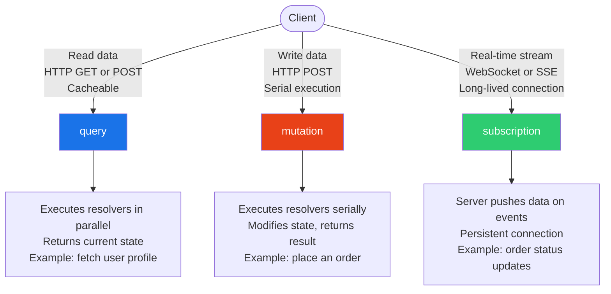

# GraphQL Fundamentals

> **Purpose:** This folder covers GraphQL's core language features — the operation types (queries, mutations, subscriptions), the type system, and how schemas evolve over time. Engineers who complete this section will have the conceptual foundation to read, write, and reason about any GraphQL API — and to understand why each language feature exists rather than memorizing syntax.

---

## Prerequisites

No prior GraphQL experience is required. You should be comfortable with:

- **HTTP basics** — request/response cycle, status codes, headers
- **JSON** — nested objects, arrays, key/value structure
- **REST API concepts** — what an endpoint is, what a resource is
- **Basic type concepts** — the idea that a field has a type (string, integer, boolean)

If you know how to call a REST API and read a JSON response, you have everything needed to start here.

---

## What This Folder Covers

GraphQL is a query language for APIs and a runtime for executing those queries. Unlike REST, where the server defines what data each endpoint returns, GraphQL lets the client specify exactly what data it needs. This single design decision — client-driven field selection — has cascading consequences for performance, security, schema design, and observability.

This folder covers the language primitives that make GraphQL work:

| File | What You'll Learn | Est. Time |
|------|-------------------|-----------|
| [01-queries-and-mutations.md](./01-queries-and-mutations.md) | How to read and write data; operation naming; variables; aliases; directives; the execution model; mutation response patterns; idempotency | 45 min |
| [02-subscriptions.md](./02-subscriptions.md) | Real-time data push over WebSockets; the `graphql-ws` protocol; PubSub architecture; subscription filtering; scaling to multiple server instances | 40 min |
| [03-type-system.md](./03-type-system.md) | Scalars, Objects, Interfaces, Unions, Enums, Input types; null semantics; type modifiers (`!` and `[]`); how the type system enforces contracts | 40 min |
| [04-schema-definition-language.md](./04-schema-definition-language.md) | SDL syntax; schema stitching vs federation; the `extend` keyword; directives in SDL; generating SDL from code vs writing SDL first | 35 min |
| [05-schema-evolution.md](./05-schema-evolution.md) | Additive vs breaking changes; deprecation workflow; `@deprecated` directive; versioning strategies; backwards compatibility guarantees | 35 min |

Total estimated reading time: **~3 hours** (including reading and working through examples)

---

## The Three Operation Types

GraphQL has exactly three operation types. Every interaction with a GraphQL API is one of these three things:

**Queries** are reads. They execute in parallel, can be cached, and should have no side effects. A `query` that modifies state is an anti-pattern.

**Mutations** are writes. They execute serially (fields left to right), must not be cached, and should return both the mutated data and any user-facing errors. Serial execution prevents race conditions when multiple mutations are sent in a single request.

**Subscriptions** are long-lived event listeners. The client opens a persistent connection (WebSocket or SSE), and the server pushes data whenever relevant events occur. Subscriptions are stateful and expensive — they are not a replacement for polling.

---

## How Fundamentals Connect to Production Concerns

Every fundamental concept in this folder has a direct production implication. This is not academic knowledge:

| Fundamental | Production Implication |
|-------------|----------------------|
| **Operation naming** | Anonymous operations make APM metrics useless. Operation names are the primary dimension for traces, logs, and rate limiting. |
| **Variables** | String interpolation in queries creates injection vulnerabilities and breaks Automatic Persisted Queries (APQ). Always use variables. |
| **Type system** | Nullable vs non-null semantics directly affect client error handling. A field typed `String` can return `null` unexpectedly; `String!` guarantees a value or the whole query fails. |
| **Schema evolution** | Removing or renaming a field without a deprecation period breaks clients silently. The schema is a public contract. |
| **Subscriptions** | WebSocket connections are stateful and consume memory. A subscription leak in a client can exhaust server resources. PubSub architecture determines whether events reach subscribers in multi-instance deployments. |
| **Mutation response patterns** | Mutations that return only `Boolean` make error handling impossible. The Shopify mutation response pattern (return entity + `userErrors`) enables field-level error display. |

---

## How to Use This Folder

Read the files in order if you are new to GraphQL. Each file builds on the previous:

1. Start with **queries and mutations** — they are the most common operations and cover the core execution model.
2. Read **subscriptions** — they share the operation model but introduce a fundamentally different transport and scaling challenge.
3. Read **type system** — understanding types makes schema design and error handling clear.
4. Read **SDL** — the syntax for defining schemas connects types to real API design.
5. Read **schema evolution** — the last topic, because evolving a schema you haven't designed yet is premature.

If you are an experienced GraphQL engineer reviewing production concerns, skip to the `## Production Considerations` section of each file.

---

## GraphQL vs REST: The Key Trade-Offs

Understanding why GraphQL exists clarifies what these fundamentals are solving:

| Concern | REST | GraphQL |
|---------|------|---------|
| **Data fetching** | Server defines the response shape; clients adapt | Client specifies exactly which fields to return |
| **Overfetching** | Common — endpoints return fixed shapes with unused fields | Eliminated by design — only requested fields are resolved |
| **Underfetching** | Common — multiple round-trips for related data | Eliminated — nested selections fetch related data in one request |
| **Type contract** | Typically informal (OpenAPI spec optional) | Formal — the schema is the contract, validated at parse time |
| **Versioning** | Explicit versions (`/v1`, `/v2`) or breaking changes | Additive evolution with `@deprecated` — no versioning needed |
| **Caching** | HTTP cache works natively (GET requests) | Requires APQ + named operations for GET-based caching |
| **Real-time** | Requires WebHooks, SSE, or WebSocket on top | Subscriptions are first-class operation type |
| **Schema introspection** | Not built in (OpenAPI separate) | Built in — `__schema`, `__type` queries always available |

GraphQL is not universally superior to REST. Choose REST when: your resources map cleanly to URLs, you need aggressive HTTP caching without APQ overhead, or your team has no prior GraphQL experience and velocity matters more than field-level precision. Choose GraphQL when: multiple clients (mobile, web, partner APIs) need different data shapes from the same backend, or you are building a platform API where clients are first-class consumers.

---

## Tooling Referenced in This Folder

The examples throughout this folder use production-grade tools. You do not need to install them to read the docs, but knowing what they are helps:

| Tool | Role | Where Referenced |
|------|------|-----------------|
| **Apollo Server** | GraphQL server runtime for Node.js; handles parse, validate, execute | Queries, Mutations, Subscriptions |
| **Apollo Client** | GraphQL client for React/JS; manages queries, mutations, subscriptions, cache | Queries, Mutations, Subscriptions |
| **graphql-js** | The reference implementation of the GraphQL spec; Apollo Server uses it under the hood | Throughout |
| **graphql-ws** | The current standard WebSocket protocol library for GraphQL subscriptions | Subscriptions |
| **graphql-subscriptions** | Apollo's PubSub abstraction; in-memory by default | Subscriptions |
| **graphql-redis-subscriptions** | Redis-backed PubSub; required for multi-instance subscription deployments | Subscriptions |
| **Apollo Studio** | Cloud APM for GraphQL; groups metrics by operation name | Queries, Mutations |
| **Apollo Router** | Rust-based GraphQL gateway; handles APQ, allowlisting, subscription SSE | Queries, Mutations |
| **graphql-depth-limit** | Validation rule that rejects overly-nested queries | Queries |

---

## What GraphQL Does Not Solve

Engineers new to GraphQL sometimes expect it to solve problems it was not designed for:

- **Authorization** — GraphQL has no built-in authorization model. Field-level access control must be implemented in resolvers or schema directives. See [05-security](../05-security/).
- **Rate limiting** — HTTP-level rate limiting by IP does not work well with a single `/graphql` endpoint. Operation-name-based rate limiting requires GraphQL-aware middleware.
- **Transport security** — GraphQL runs over HTTP (or WebSocket). TLS, CORS, and CSRF protection are your responsibility. GraphQL does not add security by itself.
- **N+1 query performance** — GraphQL's resolver model makes N+1 database queries the default failure mode. DataLoader is the solution. See [04-resolvers-and-execution](../04-resolvers-and-execution/).
- **Schema documentation** — the type system requires field descriptions to be added explicitly. An undocumented schema is still valid but useless for API consumers.

---

## Related Sections

Once you have completed this folder, the following sections build directly on these fundamentals:

- [02-graphql-internals](../02-graphql-internals/) — how `graphql-js` parses, validates, and executes operations
- [03-schema-design](../03-schema-design/) — applying the type system to real API design
- [05-security](../05-security/) — how operation names, variables, and query depth interact with security controls
- [06-performance-and-scaling](../06-performance-and-scaling/) — APQ, query complexity limits, and subscription scaling
- [14-observability](../14-observability/) — why operation names are the foundation of GraphQL observability
