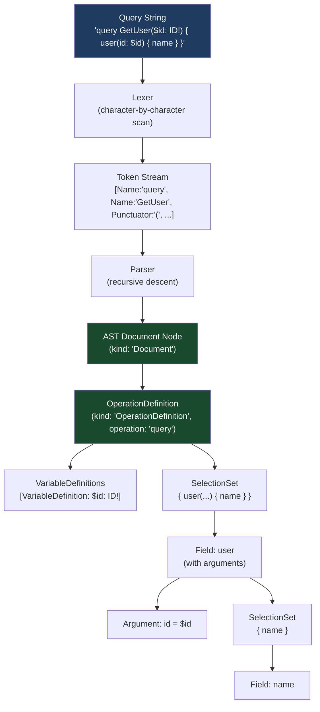
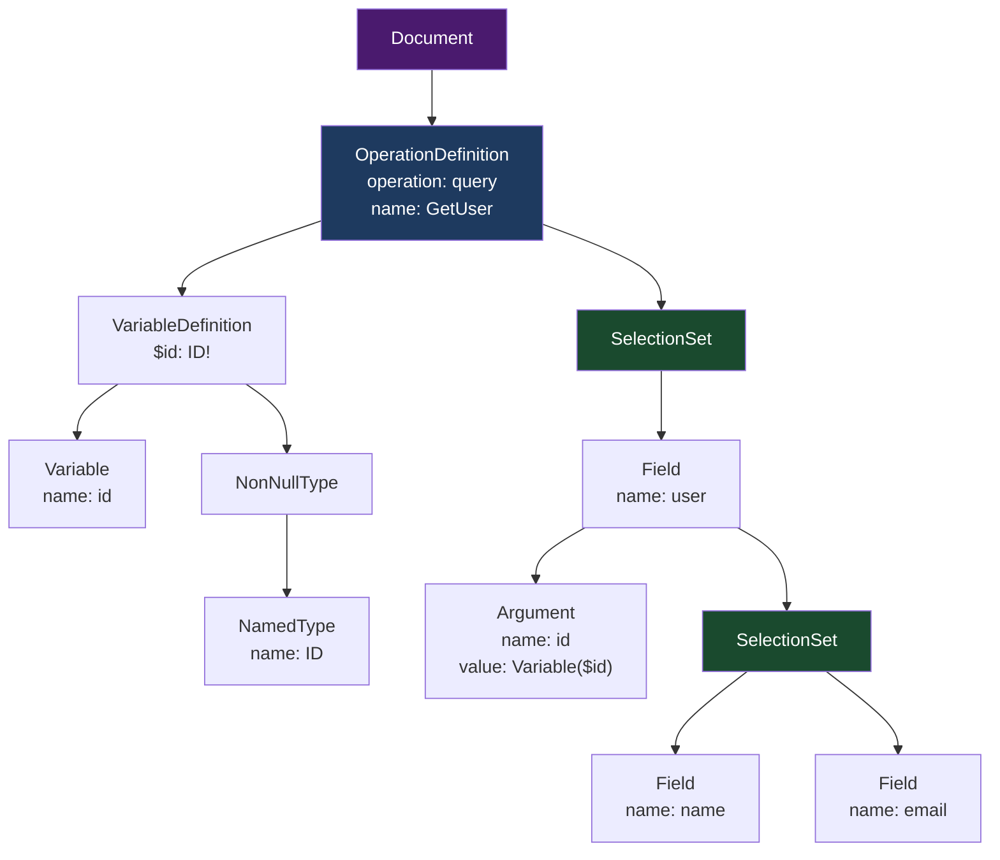

# 01 — Parsing and the Abstract Syntax Tree

> **Purpose:** Understand how a raw GraphQL query string is transformed into a structured Abstract Syntax Tree (AST), what node types the AST contains, and how to traverse and transform ASTs programmatically — the foundational skill for building query analysis tools, custom validation rules, and code generators.

---

## Learning Objectives

- [ ] Explain what the lexer produces and why tokenization is a separate phase from parsing
- [ ] Identify all major GraphQL token types and map them to their source characters
- [ ] Read and interpret a GraphQL AST JSON document
- [ ] Name all major AST node kinds and describe what each represents
- [ ] Use the `visit()` API from `graphql-js` to traverse an AST
- [ ] Implement a basic query complexity calculator using an AST visitor
- [ ] Explain why AST parsing and caching matters for production performance

---

## Overview / Architecture

The first two phases of GraphQL request processing are lexing and parsing. They are fast, pure CPU work — no I/O, no schema lookups — and completely stateless.



---

## Core Concepts

### Why Two Phases?

The lexer and parser are separate by design, following classical compiler theory:

- **Lexer (tokenizer):** Operates on individual characters. It has no awareness of grammar — it simply groups characters into meaningful tokens. This is fast and can reject obviously invalid input early (e.g., an unexpected `#` character that isn't a comment).
- **Parser:** Operates on the token stream. It understands grammar — it enforces that `query` is followed by an optional name, then optional variable definitions, then a selection set. If the grammar is violated, it emits a parse error with a precise location.

Separating these concerns keeps each phase simple. The parser never needs to think about whitespace, string escape sequences, or block string syntax — those are already handled by the lexer.

### The Lexer (Tokenizer)

The `graphql-js` lexer is a hand-written character scanner (`src/language/lexer.ts`). It reads the query string left-to-right and produces a flat sequence of tokens. Each token has:
- `kind` — the token type (see below)
- `start`, `end` — byte offsets in the source string
- `line`, `column` — for error reporting
- `value` — the actual string value (for Name, StringValue, etc.)

**Token kinds produced by the GraphQL lexer:**

| Token Kind | Examples | Notes |
|---|---|---|
| `Name` | `query`, `mutation`, `User`, `name`, `id` | Identifiers — no quotes |
| `IntValue` | `42`, `-7`, `0` | Integer literals |
| `FloatValue` | `3.14`, `1e10`, `-0.5` | Float literals |
| `StringValue` | `"hello"`, `"San Francisco"` | Quoted strings |
| `BlockStringValue` | `"""..."""` | Triple-quoted, preserves indentation |
| `Punctuator` | `{`, `}`, `(`, `)`, `[`, `]`, `:`, `!`, `=`, `@`, `$`, `...`, `\|`, `&` | All structural characters |
| `EOF` | (end of input) | Signals the parser to stop |

**Example — tokenizing `{ user(id: "123") { name } }`:**

```
{          → Punctuator
user       → Name
(          → Punctuator
id         → Name
:          → Punctuator
"123"      → StringValue
)          → Punctuator
{          → Punctuator
name       → Name
}          → Punctuator
}          → Punctuator
<EOF>      → EOF
```

Note: whitespace and commas are skipped by the lexer — they are not tokens. Comments (`# ...`) are also discarded. This is why `{ user(id: "123") { name } }` and `{user(id:"123"){name}}` produce identical token streams.

### The Parser and AST

The parser consumes the token stream using recursive descent — a pattern where each grammar rule is a function that can call other grammar rule functions. The parser for `OperationDefinition` calls the parser for `VariableDefinitions`, which calls the parser for `Type`, and so on.

The output is a tree of **AST nodes** — plain JavaScript objects with a `kind` field that identifies the node type, plus type-specific fields.

**Example query:**

```graphql
query GetUser($id: ID!) {
  user(id: $id) {
    name
    email
  }
}
```

**Resulting AST (full JSON, simplified for clarity):**

```json
{
  "kind": "Document",
  "definitions": [
    {
      "kind": "OperationDefinition",
      "operation": "query",
      "name": {
        "kind": "Name",
        "value": "GetUser"
      },
      "variableDefinitions": [
        {
          "kind": "VariableDefinition",
          "variable": {
            "kind": "Variable",
            "name": { "kind": "Name", "value": "id" }
          },
          "type": {
            "kind": "NonNullType",
            "type": {
              "kind": "NamedType",
              "name": { "kind": "Name", "value": "ID" }
            }
          },
          "defaultValue": null,
          "directives": []
        }
      ],
      "directives": [],
      "selectionSet": {
        "kind": "SelectionSet",
        "selections": [
          {
            "kind": "Field",
            "alias": null,
            "name": { "kind": "Name", "value": "user" },
            "arguments": [
              {
                "kind": "Argument",
                "name": { "kind": "Name", "value": "id" },
                "value": {
                  "kind": "Variable",
                  "name": { "kind": "Name", "value": "id" }
                }
              }
            ],
            "directives": [],
            "selectionSet": {
              "kind": "SelectionSet",
              "selections": [
                {
                  "kind": "Field",
                  "alias": null,
                  "name": { "kind": "Name", "value": "name" },
                  "arguments": [],
                  "directives": [],
                  "selectionSet": null
                },
                {
                  "kind": "Field",
                  "alias": null,
                  "name": { "kind": "Name", "value": "email" },
                  "arguments": [],
                  "directives": [],
                  "selectionSet": null
                }
              ]
            }
          }
        ]
      }
    }
  ]
}
```

**Visual AST structure:**



---

## Core Concepts

### AST Node Kinds — Complete Reference

Every AST node has a `kind` field. Here are all major kinds:

**Document-level nodes:**

| Kind | Description | Key Fields |
|---|---|---|
| `Document` | Root node wrapping all definitions | `definitions[]` |
| `OperationDefinition` | A `query`, `mutation`, or `subscription` | `operation`, `name`, `variableDefinitions[]`, `directives[]`, `selectionSet` |
| `FragmentDefinition` | A named fragment (`fragment Foo on Bar { ... }`) | `name`, `typeCondition`, `directives[]`, `selectionSet` |

**Selection nodes (appear inside `SelectionSet.selections`):**

| Kind | Description | Key Fields |
|---|---|---|
| `Field` | A field selection (e.g., `name`, `user(id: $id)`) | `alias`, `name`, `arguments[]`, `directives[]`, `selectionSet` |
| `FragmentSpread` | Spread of a named fragment (`...UserFields`) | `name`, `directives[]` |
| `InlineFragment` | Anonymous inline fragment (`... on User { name }`) | `typeCondition`, `directives[]`, `selectionSet` |

**Type reference nodes:**

| Kind | Description | Example |
|---|---|---|
| `NamedType` | A named type reference | `User`, `ID`, `String` |
| `ListType` | A list type (`[T]`) | `[User]` |
| `NonNullType` | A non-null type (`T!`) | `ID!`, `[User]!` |

**Value nodes (used in arguments and variable defaults):**

| Kind | Example |
|---|---|
| `Variable` | `$id` |
| `IntValue` | `42` |
| `FloatValue` | `3.14` |
| `StringValue` | `"hello"` |
| `BooleanValue` | `true`, `false` |
| `NullValue` | `null` |
| `EnumValue` | `ACTIVE`, `PUBLISHED` |
| `ListValue` | `[1, 2, 3]` |
| `ObjectValue` | `{ key: "value" }` |

**Directive and argument nodes:**

| Kind | Description | Key Fields |
|---|---|---|
| `Directive` | `@deprecated(reason: "Use newField")` | `name`, `arguments[]` |
| `Argument` | A key-value argument on a field or directive | `name`, `value` |
| `VariableDefinition` | A declared variable (`$id: ID!`) | `variable`, `type`, `defaultValue` |

---

## Real-World Implementation

### Parsing with `graphql-js`

```javascript
import { parse, parseType, parseValue } from 'graphql';

// Parse a full query document
const document = parse(`
  query GetUser($id: ID!) {
    user(id: $id) {
      name
      email
    }
  }
`);

// document.kind === 'Document'
// document.definitions[0].kind === 'OperationDefinition'

// Parse a type reference (useful in tooling)
const type = parseType('ID!');
// type.kind === 'NonNullType'
// type.type.kind === 'NamedType'
// type.type.name.value === 'ID'

// Parse a value (useful in tooling)
const value = parseValue('{ key: "value", count: 42 }');
// value.kind === 'ObjectValue'
```

### Working with the `visit()` API

The `visit()` function implements the Visitor pattern over an AST. You provide an object mapping node kinds to enter/leave callbacks. The visitor traverses depth-first, calling your callbacks as it enters and exits each node.

```javascript
import { parse, visit, BREAK } from 'graphql';

const document = parse(`
  query GetDashboard {
    orders { id status user { name email } }
    products { id title price }
  }
`);

// Example 1: Count total fields
let fieldCount = 0;
visit(document, {
  Field() {
    fieldCount++;
  }
});
console.log(`Total fields: ${fieldCount}`);
// Total fields: 8 (orders, id, status, user, name, email, products, id, title, price)

// Example 2: Collect all field names at depth 1 (root fields)
const rootFields = [];
let depth = 0;
visit(document, {
  SelectionSet: {
    enter() { depth++; },
    leave() { depth--; }
  },
  Field: {
    enter(node) {
      if (depth === 1) {
        rootFields.push(node.name.value);
      }
    }
  }
});
console.log('Root fields:', rootFields);
// Root fields: ['orders', 'products']

// Example 3: Early exit with BREAK
let hasDeprecatedField = false;
visit(document, {
  Directive(node) {
    if (node.name.value === 'deprecated') {
      hasDeprecatedField = true;
      return BREAK; // Stop traversal immediately
    }
  }
});
```

**Visitor callback forms:**

```javascript
visit(ast, {
  // Short form: called on enter
  Field(node) { /* ... */ },

  // Long form: separate enter and leave callbacks
  SelectionSet: {
    enter(node, key, parent, path, ancestors) {
      // entering a SelectionSet
    },
    leave(node, key, parent, path, ancestors) {
      // leaving a SelectionSet
    }
  }
});
```

Callback parameters:
- `node` — the current AST node
- `key` — the key of this node in its parent (e.g., `"selectionSet"`, `0`)
- `parent` — the parent node or array
- `path` — array of keys from root to this node
- `ancestors` — array of all ancestor nodes (root first)

### Production Use Case: Query Complexity Calculator

This is how real complexity-limiting libraries work (e.g., `graphql-query-complexity`):

```javascript
import { parse, visit } from 'graphql';

/**
 * Calculate a query's complexity score.
 * Each field adds 1. List fields multiply by an estimated list size.
 * Fields annotated with `complexity` extension add that cost instead.
 */
function calculateComplexity(document, schema, variables = {}) {
  let complexity = 0;
  const typeInfo = new TypeInfo(schema);

  visit(
    document,
    visitWithTypeInfo(typeInfo, {
      Field(node) {
        const parentType = typeInfo.getParentType();
        const fieldDef = typeInfo.getFieldDef();

        if (!fieldDef) return;

        // Custom cost annotation on field definition
        const customCost = fieldDef.extensions?.complexity;
        if (typeof customCost === 'number') {
          complexity += customCost;
          return;
        }

        // List types multiply cost
        const returnType = getNamedType(fieldDef.type);
        const isList = isListType(getNullableType(fieldDef.type));
        const listMultiplier = isList
          ? parseInt(variables?.first ?? variables?.limit ?? 10, 10)
          : 1;

        complexity += 1 * listMultiplier;
      }
    })
  );

  return complexity;
}

// Usage in Apollo Server middleware
const server = new ApolloServer({
  schema,
  plugins: [
    {
      requestDidStart() {
        return {
          didResolveOperation({ request, document }) {
            const cost = calculateComplexity(document, schema, request.variables);
            if (cost > 1000) {
              throw new GraphQLError(`Query complexity ${cost} exceeds limit of 1000`, {
                extensions: { code: 'QUERY_COMPLEXITY_EXCEEDED', complexity: cost }
              });
            }
          }
        };
      }
    }
  ]
});
```

### AST Transformation: Injecting Directives

The `visit()` function can also transform an AST by returning a new node from a callback:

```javascript
import { parse, visit, print } from 'graphql';

// Automatically inject @cacheControl on all list fields
function injectCacheControl(document, maxAge = 60) {
  return visit(document, {
    Field(node) {
      // Add @cacheControl(maxAge: 60) to every field named "products" or "orders"
      if (['products', 'orders', 'users'].includes(node.name.value)) {
        return {
          ...node,
          directives: [
            ...node.directives,
            {
              kind: 'Directive',
              name: { kind: 'Name', value: 'cacheControl' },
              arguments: [
                {
                  kind: 'Argument',
                  name: { kind: 'Name', value: 'maxAge' },
                  value: { kind: 'IntValue', value: String(maxAge) }
                }
              ]
            }
          ]
        };
      }
    }
  });
}

// Print the modified AST back to a string
const modified = injectCacheControl(document);
console.log(print(modified));
```

### Printing ASTs Back to Strings

`graphql-js` exports a `print()` function that serializes an AST back to a formatted GraphQL document string. This is useful for debugging, logging canonical query shapes, and query normalization.

```javascript
import { parse, print } from 'graphql';

const doc = parse('query{user(id:"1"){name   email}}');
console.log(print(doc));
// Outputs:
// {
//   user(id: "1") {
//     name
//     email
//   }
// }
```

---

## Production Considerations

### Performance

Parsing is fast — a typical query takes under 1ms on modern hardware. However, parsing and AST construction are CPU-bound work that happens on every request if you do not cache.

**Apollo Server document caching:** Apollo Server 4 uses a `DocumentStore` (LRU cache, default 30MB) keyed by the SHA-256 hash of the query string. On cache hit, the parse and validate phases are skipped entirely:

```
Request → SHA-256 hash query string
       → Cache hit: skip parse+validate → execute cached document
       → Cache miss: parse → validate → store in cache → execute
```

The default cache size holds roughly 30,000 average-length queries. For applications with highly diverse query sets, consider increasing the cache size or implementing APQ.

**Automatic Persisted Queries (APQ):** The client sends only the hash on the first request. The server responds with `PERSISTED_QUERY_NOT_FOUND`, the client retransmits the full query, and the server caches the document. Subsequent requests from any client send only the hash — parse and validate are permanently eliminated for that operation.

```javascript
// Apollo Client: enable APQ
const link = createPersistedQueryLink({ sha256 }).concat(httpLink);
```

### Security

**Parser bombs:** A deeply recursive query string can cause the parser to recurse until it stack-overflows. `graphql-js` has no built-in recursion limit, but production deployments should impose HTTP request body size limits (e.g., `express` body-parser `limit: '100kb'`) to prevent excessively large query strings from even reaching the parser.

**Algorithmic complexity attacks:** The parser itself runs in O(n) time relative to query string length. The real risk is in the executor (see `03-execution-engine.md`), not the parser.

### Scaling

AST parsing is stateless and produces no side effects. Parse horizontally — each server instance parses independently, no coordination needed. The per-instance document cache is sufficient; shared caching of parsed ASTs is an over-engineering.

### Observability

Parse errors surface in the `errors` array with precise source locations:

```json
{
  "errors": [
    {
      "message": "Syntax Error: Expected Name, found }.",
      "locations": [{ "line": 3, "column": 5 }],
      "extensions": { "code": "GRAPHQL_PARSE_FAILED" }
    }
  ]
}
```

Track parse error rates. A spike in parse errors often indicates:
- A client bug introduced in a deployment
- An attacker probing the endpoint with malformed queries

---

## Best Practices

1. **Cache parsed documents by query hash** — Parsing is fast but not free. Enable Apollo Server's built-in document cache and tune its size for your query cardinality. For high-volume APIs, APQ (Automatic Persisted Queries) eliminates parse and validate overhead entirely for known operations.

2. **Use `visit()` for all AST analysis, never manual recursion** — `visit()` handles all edge cases: fragment spreads, inline fragments, aliases, directives. Rolling your own recursion will miss cases and break under unusual queries.

3. **Normalize queries with `print(parse(query))`before caching** — `parse()` then `print()` produces a canonical formatting. Use this as the cache key if you want semantically equivalent queries (different whitespace, same fields) to share a cache entry.

4. **Annotate field costs on schema extensions, not in the resolver** — Keep complexity scoring data close to the schema definition. Use `fieldDef.extensions.complexity` to store per-field costs. This keeps complexity logic out of resolvers and allows it to be analyzed at validation time.

5. **Prefer `TypeInfo` + `visitWithTypeInfo` when you need type context** — Pure AST traversal with `visit()` has no type information. Use `TypeInfo` (from `graphql-js`) alongside `visitWithTypeInfo` when your visitor needs to know the type of the current field — this is essential for complexity calculators and authorization rules.

---

## Anti-Patterns

**Re-parsing on every request without caching.** If your server creates a new `parse()` call for every incoming request with no document cache, you waste CPU on identical queries. Fix: enable Apollo Server's `DocumentStore` or implement your own LRU cache keyed by SHA-256.

**Using the raw query string as a cache key.** Clients may send the same logical query with different whitespace or field ordering, producing cache misses. Fix: normalize with `print(parse(query))` and cache the normalized string.

**Walking the AST with a hand-written recursive function.** Custom traversal routinely misses `FragmentSpread` nodes (which contain a reference to a fragment defined elsewhere), `InlineFragment` nodes, or directive arguments. Fix: always use `visit()` which implements the full visitor pattern per the spec.

**Assuming `Field.name.value` is unique in a selection.** A client can alias a field: `userId: id`. The `alias` is `userId`, the `name` is `id`. Never use `field.name.value` as the response key — use `field.alias?.value ?? field.name.value` (or use `getFieldEntryKey()` from `graphql-js`).

**Mutating AST nodes in place.** AST nodes from `parse()` are frozen in newer versions of `graphql-js`. Even when not frozen, mutating a cached document corrupts subsequent requests. Fix: always produce new nodes in `visit()` callbacks by returning `{ ...node, ... }` with the modifications.

---

## Operational Notes

- `graphql-js` exports `parse`, `parseType`, `parseValue`, `visit`, `visitWithTypeInfo`, `TypeInfo`, `print`, `BREAK` from the `graphql` package.
- `graphql-core` (Python) and `graphql-java` expose equivalent APIs — the AST structure is spec-defined and nearly identical across implementations.
- `graphql-code-generator` operates entirely at the AST level: it parses operation documents and SDL files to AST, then walks the AST to generate TypeScript types.
- `graphql-inspector` diffs schema changes by parsing two SDL strings to AST and comparing node-by-node.
- Rover CLI (Apollo) uses AST parsing for schema composition and breaking change detection in `rover subgraph check`.

---

## References

- [GraphQL Specification — Language](https://spec.graphql.org/October2021/#sec-Language)
- [graphql-js source: Lexer](https://github.com/graphql/graphql-js/blob/main/src/language/lexer.ts)
- [graphql-js source: Parser](https://github.com/graphql/graphql-js/blob/main/src/language/parser.ts)
- [graphql-js source: Visitor](https://github.com/graphql/graphql-js/blob/main/src/language/visitor.ts)
- [graphql-query-complexity](https://github.com/slicknode/graphql-query-complexity)
- [graphql-depth-limit](https://github.com/stems/graphql-depth-limit)
- [Apollo Server Document Store](https://www.apollographql.com/docs/apollo-server/performance/cache-backends/)
- [Automatic Persisted Queries](https://www.apollographql.com/docs/apollo-server/performance/apq/)

---

## Related Topics

- [02 — Validation Pipeline](./02-validation-pipeline.md)
- [03 — Execution Engine](./03-execution-engine.md)
- [Security](../05-security/README.md)
- [Performance and Scaling](../06-performance-and-scaling/README.md)
