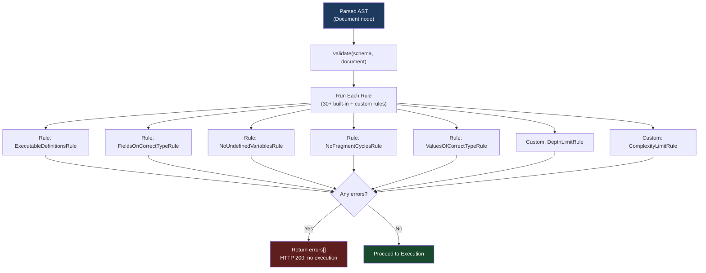
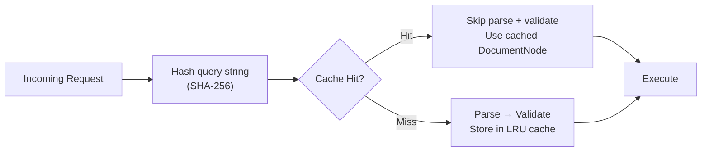

# 02 — Validation Pipeline

> **Purpose:** Understand how GraphQL validates queries against the schema before execution, the complete set of built-in validation rules, how to write custom rules for security and governance, and how validation caching eliminates overhead for known operations.

---

## Learning Objectives

- [ ] Explain the difference between parse errors (syntax) and validation errors (semantics)
- [ ] Name and categorize the 30+ built-in GraphQL validation rules
- [ ] Identify which validation errors protect against real attack vectors
- [ ] Implement a custom validation rule using the `ASTVisitor` pattern
- [ ] Explain how document caching and APQ eliminate validation overhead
- [ ] Design a validation strategy for a production GraphQL API

---

## Overview / Architecture

Validation is phase 2 of GraphQL request processing. It runs after parsing (which produced a syntactically valid AST) and before execution. Its job: verify the query is semantically valid against the schema.



**Key insight:** Validation errors return HTTP 200 with an `errors` array and `data: null`. They never return 4xx. This is the GraphQL convention — errors are in the response body regardless of their nature.

---

## Core Concepts

### Why Validation Exists as a Separate Phase

A query can be syntactically valid (parseable) but semantically invalid (meaningless against the schema). Validation enforces semantic correctness:

```graphql
# Syntactically valid — no parse errors
# Semantically invalid — 'nonExistentField' doesn't exist
query {
  user(id: "1") {
    nonExistentField
    name
  }
}
```

Validation catches this before any resolver is called. Without validation, the executor would either throw an obscure runtime error or silently return `null` for the unknown field — both unacceptable.

**The contract:** If validation passes, execution is guaranteed to produce a well-typed response (absent resolver errors). The execution engine can proceed without defensive type checking of every field.

### Rule Execution Model

Each validation rule is a function that receives a `ValidationContext` and returns an `ASTVisitor`. The visitor traverses the document AST; the context provides access to the schema and a `reportError()` method.

Rules run in a single combined AST traversal — all rules are composed into one visitor and the AST is walked once. This makes validation O(n) where n is the document size, regardless of the number of rules.

```javascript
// How validate() works internally (simplified)
import { validate, specifiedRules } from 'graphql';

const errors = validate(schema, document, [
  ...specifiedRules,      // 30+ built-in rules
  MyCustomDepthLimitRule, // your custom rule
]);

if (errors.length > 0) {
  return { errors }; // Never execute
}

execute({ schema, document, ... });
```

---

## Real-World Implementation

### Built-in Validation Rules — Complete Reference

All built-in rules live in `graphql-js` at `src/validation/rules/`. They are exported as `specifiedRules`.

#### Document Rules

**`ExecutableDefinitionsRule`**
Only `query`, `mutation`, `subscription`, and `fragment` definitions are allowed in executable documents. Type system definitions (SDL) cannot appear in queries.

```graphql
# INVALID — type definitions in an operation document
type User { name: String }  # ValidationError
query GetUser { user { name } }
```

**`UniqueOperationNamesRule`**
Two operations in the same document cannot share a name.

```graphql
# INVALID
query GetUser { user { name } }
query GetUser { user { email } }  # Duplicate name
```

**`LoneAnonymousOperationRule`**
If any operation in the document is anonymous (no name), it must be the only operation.

```graphql
# INVALID — anonymous operation with a named operation
{ user { name } }
query GetProducts { products { id } }
```

#### Field Selection Rules

**`KnownTypeNamesRule`**
All type names referenced in the query must exist in the schema.

```graphql
# INVALID — 'AdminUser' doesn't exist in schema
fragment AdminFields on AdminUser { permissions }
```

**`FieldsOnCorrectTypeRule`**
Selected fields must exist on the queried type. This is the most commonly triggered rule.

```graphql
# INVALID — 'nonExistent' doesn't exist on User type
query { user(id: "1") { nonExistent } }
```

**`ScalarLeafsRule`**
Scalar fields (String, Int, Boolean, ID, Float, and custom scalars) must be leaf selections — no sub-selection is allowed.

```graphql
# INVALID — 'name' is a String scalar, can't have sub-selection
query { user { name { first last } } }
```

**`NoSubselectionAllowedRule`**
The inverse: non-composite types (scalars, enums) must not have sub-selections.

**`RequiredSubselectionRule` (also called `SelectionsOnCompositeTypesRule`)**
Object, interface, and union types must have sub-selections. You cannot return a bare object without specifying which fields.

```graphql
# INVALID — user is an Object type, must specify fields
query { user }
```

**`UniqueFieldDefinitionNamesRule`**
No duplicate field aliases (response names) in a selection set. Two fields producing the same response key must be compatible (same field, same arguments, same type — the "field merging" rule).

```graphql
# INVALID — 'id' appears twice with conflicting argument types
query {
  user {
    id
    id(format: "uuid")  # Can't alias the same field with different args
  }
}
```

#### Argument Rules

**`KnownArgumentNamesRule`**
Every argument name must be declared on the field or directive definition.

```graphql
# INVALID — 'format' is not a declared argument on user(id: ID!)
query { user(id: "1", format: "short") { name } }
```

**`UniqueArgumentNamesRule`**
No duplicate argument names on a single field or directive.

```graphql
# INVALID
query { user(id: "1", id: "2") { name } }
```

**`ProvidedRequiredArgumentsRule`**
All required arguments (non-null, no default) must be provided.

```graphql
# INVALID — if user(id: ID!) is required
query { user { name } }  # Missing required 'id' argument
```

**`ValuesOfCorrectTypeRule`**
Argument values must match the declared type. An `Int` argument cannot receive a string.

```graphql
# INVALID — id is ID (string-like), not an integer
query { user(id: 123) { name } }
```

#### Variable Rules

**`UniqueVariableNamesRule`**
No duplicate variable names in an operation.

```graphql
# INVALID
query GetUser($id: ID!, $id: String) { ... }
```

**`NoUndefinedVariablesRule`**
All variables referenced in the operation must be declared in the variable definitions.

```graphql
# INVALID — $userId is not declared
query GetUser {
  user(id: $userId) { name }
}
```

**`NoUnusedVariablesRule`**
All declared variables must be used at least once.

```graphql
# INVALID — $filter is declared but never used
query GetUser($id: ID!, $filter: String) {
  user(id: $id) { name }
}
```

**`VariablesInAllowedPositionRule`**
A variable type must be compatible with the position it fills. A nullable variable (`$id: ID`) cannot be used where a non-null value (`id: ID!`) is required unless the variable has a default value.

```graphql
# INVALID — $id is nullable but the argument requires non-null
query GetUser($id: ID) {       # $id is nullable ID
  user(id: $id) { name }       # but user(id: ID!) requires non-null
}
```

#### Fragment Rules

**`KnownFragmentNamesRule`**
All fragment spreads must reference fragments defined in the document.

```graphql
# INVALID — UserFields fragment is not defined
query { user { ...UserFields } }
```

**`NoUnusedFragmentsRule`**
All defined fragments must be spread at least once. Unused fragments are often copy-paste bugs.

```graphql
# INVALID — ProductFields is defined but never used
fragment ProductFields on Product { id title }
query { user { name } }
```

**`PossibleFragmentSpreadsRule`**
A fragment can only be spread where its type condition could possibly appear. Fragment `on Cat` cannot be spread in a selection on `Dog` unless they share an interface.

```graphql
# INVALID — CatFields is on Cat, but 'pet' resolves to Dog
fragment CatFields on Cat { purrVolume }
query { pet { ...CatFields } }  # pet is of type Dog
```

**`NoFragmentCyclesRule`**
Fragment definitions cannot form cycles. Fragment A spreading B which spreads A would cause infinite traversal.

```graphql
# INVALID — A references B, B references A
fragment A on User { ...B name }
fragment B on User { ...A email }
```

**`UniqueFragmentNamesRule`**
No duplicate fragment names in the document.

#### Directive Rules

**`KnownDirectivesRule`**
All directives used in the query must be declared in the schema. Custom directives (`@cacheControl`, `@auth`) must be added to the schema definition.

**`UniqueDirectivesPerLocationRule`**
Some directives are non-repeatable (cannot appear more than once at a location). `@deprecated` cannot appear twice on the same field.

**`DirectivesInAllowedLocationsRule`**
Directives have declared locations (FIELD, ARGUMENT_DEFINITION, FRAGMENT_SPREAD, etc.). A directive declared for `FIELD_DEFINITION` cannot be used on an argument.

**`ProvidedRequiredArgumentsOnDirectivesRule`**
Required arguments on directives must be provided.

---

### Custom Validation Rules

Custom rules follow the exact same pattern as built-in rules. They receive a `ValidationContext` and return an `ASTVisitor`.

**Example 1: Depth Limit**

```javascript
import { GraphQLError } from 'graphql';

/**
 * Reject queries deeper than maxDepth levels.
 * This prevents "query depth bomb" attacks.
 *
 * Example attack: query { a { a { a { a { a { ... } } } } } }
 * With 10-deep nesting on a cyclic schema this creates exponential resolver calls.
 */
function createDepthLimitRule(maxDepth = 7) {
  return function DepthLimitRule(context) {
    let currentDepth = 0;

    function checkDepth(node) {
      currentDepth++;
      if (currentDepth > maxDepth) {
        context.reportError(
          new GraphQLError(
            `Query depth ${currentDepth} exceeds maximum allowed depth of ${maxDepth}.`,
            [node]
          )
        );
      }
    }

    return {
      Field: {
        enter: checkDepth,
        leave() { currentDepth--; }
      },
      InlineFragment: {
        enter: checkDepth,
        leave() { currentDepth--; }
      },
      FragmentDefinition: {
        enter: checkDepth,
        leave() { currentDepth--; }
      }
    };
  };
}

// Register with Apollo Server
const server = new ApolloServer({
  schema,
  validationRules: [...specifiedRules, createDepthLimitRule(7)],
});
```

**Example 2: Field Blocklist (for gradual deprecation enforcement)**

```javascript
import { GraphQLError } from 'graphql';

/**
 * Prevent access to fields that are blocked for the current client.
 * This enforces schema governance rules at the validation layer.
 */
function createFieldBlocklistRule(blockedFields) {
  // blockedFields: Map<typeName, Set<fieldName>>
  return function FieldBlocklistRule(context) {
    return {
      Field(node) {
        const parentType = context.getParentType();
        if (!parentType) return;

        const typeName = parentType.name;
        const fieldName = node.name.value;

        if (blockedFields.get(typeName)?.has(fieldName)) {
          context.reportError(
            new GraphQLError(
              `Field '${typeName}.${fieldName}' is not available in this API version. ` +
              `Use '${typeName}.${fieldName}V2' instead.`,
              [node]
            )
          );
        }
      }
    };
  };
}

const blockedFields = new Map([
  ['User', new Set(['legacyId', 'deprecatedEmail'])],
  ['Order', new Set(['oldStatusCode'])],
]);

const server = new ApolloServer({
  schema,
  validationRules: [
    ...specifiedRules,
    createDepthLimitRule(7),
    createFieldBlocklistRule(blockedFields),
  ],
});
```

**Example 3: Require Operation Names (for observability)**

```javascript
/**
 * Require all operations to be named.
 * Unnamed operations cannot be tracked in observability tooling (Apollo Studio, Datadog APM).
 * This is especially important for production APIs where operation names appear in traces.
 */
function RequireOperationNamesRule(context) {
  return {
    OperationDefinition(node) {
      if (!node.name) {
        context.reportError(
          new GraphQLError(
            'All operations must be named for observability tracking. ' +
            'Add a name: `query MyOperationName { ... }`',
            [node]
          )
        );
      }
    }
  };
}
```

**Example 4: Introspection Blocking (production security)**

```javascript
/**
 * Block introspection queries in production.
 * Introspection exposes your entire schema — a roadmap for attackers.
 * In production, disable introspection unless the client is authenticated.
 */
function NoIntrospectionRule(context) {
  return {
    Field(node) {
      if (
        node.name.value === '__schema' ||
        node.name.value === '__type'
      ) {
        context.reportError(
          new GraphQLError(
            'Introspection is disabled in production.',
            [node]
          )
        );
      }
    }
  };
}

// Conditionally apply based on environment
const productionRules = process.env.NODE_ENV === 'production'
  ? [...specifiedRules, NoIntrospectionRule]
  : specifiedRules;
```

---

### Validation Caching and APQ

Validation is more expensive than parsing (it requires schema lookups). For APIs with a fixed set of known operations, caching validated documents eliminates this cost entirely.

**Document cache (parse + validate once, execute many):**



Apollo Server 4 enables document caching by default with a 30MB LRU cache. Configure it:

```javascript
import { ApolloServer } from '@apollo/server';
import { InMemoryLRUCache } from '@apollo/utils.keyvaluecache';

const server = new ApolloServer({
  schema,
  cache: new InMemoryLRUCache({
    maxSize: Math.pow(2, 20) * 100, // 100MB
    ttl: 30 // seconds — optional TTL
  }),
});
```

**APQ (Automatic Persisted Queries):**

APQ eliminates parse and validate overhead at the network level. The first time a client sends a query, it also sends the hash. The server validates and caches. On subsequent requests, clients send only the hash:

```
First request:  { "extensions": { "persistedQuery": { "sha256Hash": "abc123", "version": 1 } }, "query": "query GetUser..." }
                → Server: cache miss → parse → validate → cache → execute
                → Response: { "data": { ... } }

Later requests: { "extensions": { "persistedQuery": { "sha256Hash": "abc123", "version": 1 } } }
                → Server: cache hit → execute immediately (no parse, no validate)
                → Response: { "data": { ... } }
```

Setup:

```javascript
// Apollo Server side — register the APQ plugin
import { ApolloServer } from '@apollo/server';
import { createPersistedQueryLink } from '@apollo/client/link/persisted-queries';
import { sha256 } from 'crypto-hash';

// Client side — send hashes with requests
const link = createPersistedQueryLink({ sha256 }).concat(httpLink);
```

**Persisted queries registry (Apollo Router):**

In Apollo Router deployments, you can pre-register operations at deploy time. Only registered operations are allowed — unknown queries are rejected at the gateway before they reach any subgraph. This combines security (allowlist enforcement) and performance (no parse/validate on the hot path).

```yaml
# router.yaml
persisted_queries:
  enabled: true
  safelist:
    enabled: true
    require_id: true  # Reject all non-persisted queries
```

---

## Production Considerations

### Performance

Validation is O(n) in document size but involves schema lookups (type resolution, field resolution) on every node. For complex schemas with thousands of types, validation of deeply nested queries can take 10–15ms.

Mitigation strategies (in order of impact):
1. **APQ** — eliminate parse+validate entirely for known operations (highest impact)
2. **Document cache** — validate once per unique query string
3. **Fail fast with custom rules** — put cheap rules (depth limit) before expensive ones (complexity)
4. **Limit document size** — reject requests with query strings over a maximum byte size before parsing

### Security

Custom validation rules are your primary defense layer:

| Attack | Rule to Implement |
|---|---|
| Depth bomb | `createDepthLimitRule(7)` |
| Complexity explosion | `ComplexityLimitRule` (graphql-query-complexity) |
| Introspection harvesting | `NoIntrospectionRule` (in production) |
| Field probing | `FieldBlocklistRule` |
| Batch operation abuse | `MaxOperationsPerDocumentRule` |
| Alias explosion | `UniqueAliasesRule` / limit alias count |

Run security rules before standard `specifiedRules` to fail fast:

```javascript
const validationRules = [
  createDepthLimitRule(7),         // Cheap — runs first
  createComplexityLimitRule(1000), // Moderate cost
  ...specifiedRules,               // Full validation last
];
```

### Scaling

Validation is completely stateless. Each server instance validates independently with no shared state. Scale horizontally without any coordination concerns.

The only shared state is the document cache, which is per-instance. For consistency, all instances should be running the same schema version — a schema update that changes what's valid should be coordinated with a rolling deployment.

### Observability

Separate validation errors from execution errors in your metrics. They have different root causes:

| Error Type | Meaning | Action |
|---|---|---|
| Parse error spike | Client bug in a new deployment | Alert — check recent deployments |
| Validation error spike | Client sending unknown fields, schema mismatch | Compare schema versions |
| Validation errors from one IP | Probing attack | Rate limit or block |
| Depth/complexity rule violations | Legitimate query design issue or attack | Investigate operation name and source |

```javascript
// Apollo Server plugin to track validation errors
const validationMetricsPlugin = {
  requestDidStart() {
    return {
      validationDidStart() {
        return (errors) => {
          if (errors && errors.length > 0) {
            errors.forEach(error => {
              metrics.increment('graphql.validation.error', {
                rule: error.extensions?.rule ?? 'unknown',
                operation: error.extensions?.operation ?? 'anonymous',
              });
            });
          }
        };
      }
    };
  }
};
```

---

## Best Practices

1. **Always add depth and complexity limits in production.** The GraphQL spec has no built-in limits. Without them, a single malicious query can exhaust CPU and memory. Install `graphql-depth-limit` and `graphql-query-complexity` and set conservative limits (depth: 7, complexity: 1000) — adjust based on your actual query patterns.

2. **Disable introspection in production (or gate it behind authentication).** Introspection exposes your entire schema — field names, argument types, relationships. This is a roadmap for attackers. In production, either disable it entirely or require an authenticated `Authorization` header.

3. **Require operation names.** Anonymous queries (`{ user { name } }`) are invisible in observability tooling. All production operations should be named. Enforce this with a `RequireOperationNamesRule`.

4. **Implement APQ for high-traffic APIs.** APQ eliminates parse and validation overhead for all known operations. Combined with a CDN that caches GET-based APQ requests, this reduces GraphQL server load by 40–60% for typical read-heavy APIs.

5. **Version your validation rule sets with your schema.** When you deploy a schema change that affects validation (new required field, removed field), ensure the new validation rules deploy simultaneously. A rolling deployment with mismatched schema versions causes spurious validation errors during the rollout window.

6. **Put custom security rules before `specifiedRules`** in the `validationRules` array. The executor applies rules in order and short-circuits on error. Cheap security rules that reject malicious queries early prevent the more expensive built-in rules from running on hostile input.

---

## Anti-Patterns

**Sharing one `ValidationContext` across requests.** `ValidationContext` is per-document and per-request — do not cache or reuse it. Create a fresh validation context for every `validate()` call.

**Writing custom rules that throw instead of `context.reportError()`.** Rules must call `context.reportError()` to register errors. Throwing an exception from a rule crashes the entire validation phase and returns an opaque server error instead of a structured validation error. Always call `context.reportError()`.

**Applying the same rule twice.** If `specifiedRules` and your `validationRules` array both include `FieldsOnCorrectTypeRule`, it runs twice — doubling validation cost. When extending `specifiedRules`, only add new rules; do not re-include built-ins.

**Returning HTTP 400 for validation errors.** GraphQL validation errors are returned as HTTP 200 with an `errors` array. Returning 4xx breaks the GraphQL protocol and will confuse clients that inspect the `errors` array. Only return non-200 status codes for transport-level errors (malformed JSON body, missing Content-Type header).

---

## Operational Notes

- `graphql-js` exports `validate`, `specifiedRules`, `ValidationContext`, `GraphQLError` from the `graphql` package.
- `graphql-depth-limit` (npm) provides `createDepthLimitRule()` — a production-ready depth limiting rule.
- `graphql-query-complexity` (npm) provides configurable complexity calculation with field-level cost annotation support.
- Apollo Router's `demand_control` plugin implements query complexity limiting natively in Rust — more efficient than Node.js-level validation for high-throughput deployments.
- Validation rules are applied identically to introspection queries — introspection queries pass through the full validation pipeline.
- In Apollo Studio, all operations visible in the Explorer have been validated by the Studio frontend before display.

---

## References

- [GraphQL Specification — Validation](https://spec.graphql.org/October2021/#sec-Validation)
- [graphql-js: specifiedRules](https://github.com/graphql/graphql-js/blob/main/src/validation/specifiedRules.ts)
- [graphql-js: ValidationContext](https://github.com/graphql/graphql-js/blob/main/src/validation/ValidationContext.ts)
- [graphql-depth-limit](https://github.com/stems/graphql-depth-limit)
- [graphql-query-complexity](https://github.com/slicknode/graphql-query-complexity)
- [Apollo Router: Demand Control](https://www.apollographql.com/docs/router/executing-operations/demand-control/)
- [Apollo Server: Persisted Queries](https://www.apollographql.com/docs/apollo-server/performance/apq/)
- [Disabling Introspection](https://www.apollographql.com/docs/apollo-server/schema/introspection/)

---

## Related Topics

- [01 — Parsing and AST](./01-parsing-and-ast.md)
- [03 — Execution Engine](./03-execution-engine.md)
- [Security](../05-security/README.md)
- [Performance and Scaling](../06-performance-and-scaling/README.md)
