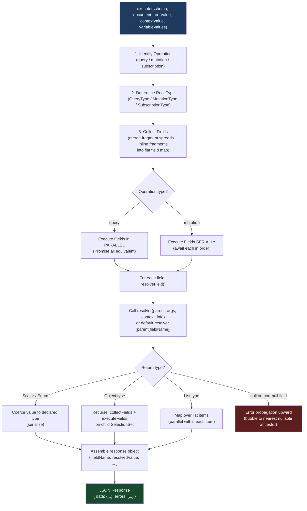

# 03 — Execution Engine

> **Purpose:** Understand the GraphQL execution algorithm from first principles — how the engine resolves fields, why queries execute in parallel but mutations execute serially, how null propagation works and why it matters for schema design, and how to instrument the resolver tree for production observability.

---

## Learning Objectives

- [ ] Describe each step of the GraphQL execution algorithm in the correct order
- [ ] Explain what each parameter of the resolver function (`parent`, `args`, `context`, `info`) provides and when to use each
- [ ] Distinguish between parallel query execution and serial mutation execution, and explain why the difference exists
- [ ] Trace a null propagation failure through a schema and predict the shape of the response
- [ ] Design schema nullability to contain errors at the right boundary
- [ ] Instrument resolvers with OpenTelemetry spans that mirror the resolver tree hierarchy
- [ ] Explain the `@defer` and `@stream` directives and when to use them

---

## Overview / Architecture

The execution engine is phase 3 of GraphQL request processing. It receives a validated document, a schema, and request context, then traverses the document's selection set, calling resolver functions and assembling the response.



---

## Core Concepts

### The Execution Algorithm — Step by Step

The GraphQL spec defines the execution algorithm precisely. Here is the full sequence with implementation context.

**Step 1: Identify the operation**

If `operationName` is provided in the request, find the matching `OperationDefinition` in the document. If not provided and there is only one operation, use it. If there are multiple operations and no `operationName`, return an error.

```javascript
// From graphql-js execute() — simplified
function getOperationDefinition(document, operationName) {
  const definitions = document.definitions.filter(
    d => d.kind === 'OperationDefinition'
  );
  if (operationName) {
    return definitions.find(d => d.name?.value === operationName);
  }
  if (definitions.length === 1) {
    return definitions[0];
  }
  throw new GraphQLError('Must provide operation name if query contains multiple operations.');
}
```

**Step 2: Determine the root type**

The operation type maps to a root type in the schema:
- `query` → `schema.getQueryType()` (typically `Query`)
- `mutation` → `schema.getMutationType()` (typically `Mutation`)
- `subscription` → `schema.getSubscriptionType()` (typically `Subscription`)

**Step 3: Collect fields**

The selection set is "flattened" into a response map. This merges:
- Direct field selections
- Fields from fragment spreads (`...FragmentName`)
- Fields from inline fragments (`... on Type { fields }`)
- Conditional fields behind `@skip` and `@include` directives (evaluated against variables)

The result is an ordered map: `responseKey → [Field nodes]`. Response key is the alias if present, otherwise the field name.

```graphql
query {
  u: user(id: "1") { name }
  ...UserEmailFragment
  ... on Query { user(id: "1") { email } }  # merged with 'u'
}

fragment UserEmailFragment on Query {
  products { title }
}
```

After field collection, the response map is:
```
u     → [Field(user, args={id:"1"}, selections=[name, email])]  # merged
products → [Field(products, selections=[title])]
```

**Step 4: Execute fields (parallel or serial)**

For queries: all root fields are executed in parallel (equivalent to `Promise.all`). Child fields within each root field's result are also executed in parallel.

For mutations: root fields are executed strictly in order — field N+1 does not start until field N has fully completed (including all nested resolvers).

**Step 5: Resolve each field**

The executor calls the resolver function for each field. If no resolver is defined on the type, the default resolver is used: `(parent) => parent[fieldName]`.

**Step 6: Coerce the result**

After the resolver returns, the value is coerced to the declared type:
- If the field is a scalar/enum: the scalar's `serialize()` method is called
- If the field is an object type: the returned value becomes the `parent` for the nested selection set
- If the field is a list: each item in the array is processed individually
- If the field is non-null and the value is null (or an error occurred): error propagation begins (see below)

**Step 7: Assemble the response**

All resolved, coerced field values are assembled into the JSON response shape, matching the structure of the query.

---

## Real-World Implementation

### The Resolver Function

Every field in a GraphQL schema can have a resolver function. The signature is always:

```typescript
type Resolver<TParent, TArgs, TContext, TReturn> = (
  parent: TParent,
  args: TArgs,
  context: TContext,
  info: GraphQLResolveInfo
) => TReturn | Promise<TReturn>;
```

**`parent` — the resolved value of the parent field**

For root Query/Mutation fields, `parent` is the `rootValue` passed to `execute()` — usually `{}` or `undefined`. For all other fields, `parent` is whatever the parent resolver returned.

```javascript
const resolvers = {
  Query: {
    // parent = rootValue ({})
    user: (parent, args, ctx) => ctx.db.findUser(args.id),
  },
  User: {
    // parent = the User object returned by Query.user
    orders: (user, args, ctx) => ctx.db.findOrdersByUser(user.id),
  },
  Order: {
    // parent = the Order object returned by User.orders[i]
    total: (order) => order.items.reduce((sum, item) => sum + item.price, 0),
  }
};
```

**`args` — arguments passed to this field by the client**

```javascript
Query: {
  products: (_, args, ctx) => {
    // args = { first: 10, after: "cursor123", filter: { status: "ACTIVE" } }
    return ctx.db.findProducts({
      limit: args.first,
      cursor: args.after,
      filter: args.filter,
    });
  }
}
```

**`context` — the request-scoped shared object**

Context is created once per request and passed to every resolver. Put here:
- The authenticated user (`req.user`)
- DataLoader instances (see `04-dataloader-and-batching.md`)
- Database connection or ORM instance
- Feature flags
- Request-scoped logging context

```javascript
// Context factory — runs once per request
async function createContext({ req }) {
  const user = await verifyToken(req.headers.authorization);
  return {
    user,
    db,
    loaders: {
      user: createUserLoader(),
      product: createProductLoader(),
      order: createOrderLoader(),
    },
    logger: req.log.child({ userId: user?.id }),
  };
}
```

**`info` — schema and query metadata**

`GraphQLResolveInfo` is the most complex parameter. Key fields:

```typescript
interface GraphQLResolveInfo {
  fieldName: string;          // The field name being resolved
  fieldNodes: FieldNode[];    // The AST node(s) for this field in the query
  returnType: GraphQLOutputType;  // The declared return type
  parentType: GraphQLObjectType;  // The type of the parent object
  schema: GraphQLSchema;      // The full schema
  fragments: { [key: string]: FragmentDefinitionNode }; // All fragments
  rootValue: unknown;         // The rootValue passed to execute()
  operation: OperationDefinitionNode; // The full operation AST
  variableValues: { [key: string]: unknown }; // All resolved variables
  path: ResponsePath;         // Path to this field: e.g., ['orders', 0, 'user']
}
```

`info` is used for:
- **Look-ahead** — inspect `info.fieldNodes` to see what child fields the client is requesting before the query executes (useful for JOIN optimization)
- **Field-level authorization** — check `info.parentType.name + '.' + info.fieldName` against a permission list
- **Resolver tracing** — read `info.path` for span names in distributed traces

```javascript
// Look-ahead: only JOIN user table if client requested user fields
Query: {
  orders: (_, args, ctx, info) => {
    // Check if the client selected the 'user' field on orders
    const requestedFields = info.fieldNodes[0].selectionSet.selections
      .map(s => s.name?.value)
      .filter(Boolean);

    const includeUser = requestedFields.includes('user');
    return ctx.db.findOrders({
      ...args,
      include: includeUser ? ['user'] : []
    });
  }
}
```

### Serial vs. Parallel Execution

**Queries — parallel:**

```graphql
query Dashboard {
  recentOrders(limit: 5) { id status }
  topProducts(limit: 3) { id title }
  currentUser { name avatar }
}
```

All three root fields resolve concurrently. The response is assembled after all three complete. If each takes 50ms, total latency is ~50ms, not 150ms.

```javascript
// Simplified internal implementation for query execution
async function executeFieldsInParallel(fields, rootValue, context, info) {
  const promises = fields.map(([responseName, fieldNodes]) =>
    resolveField(rootValue, fieldNodes, context, info)
      .then(value => [responseName, value])
  );
  const results = await Promise.all(promises);
  return Object.fromEntries(results);
}
```

**Mutations — serial:**

```graphql
mutation CheckoutSequence {
  reserveInventory(items: [...])   # Must complete before createOrder
  createOrder(items: [...])        # Must complete before chargePayment
  chargePayment(orderId: $orderId) # Must complete before sendConfirmation
  sendConfirmationEmail(orderId: $orderId)
}
```

Each mutation field waits for the previous one to fully complete — including all nested resolvers — before starting. This is a spec guarantee for the `mutation` operation type.

```javascript
// Simplified internal implementation for mutation execution
async function executeFieldsSerially(fields, rootValue, context, info) {
  const results = {};
  for (const [responseName, fieldNodes] of fields) {
    results[responseName] = await resolveField(rootValue, fieldNodes, context, info);
  }
  return results;
}
```

**Practical implication:** Never rely on field ordering for business logic in queries. In mutations, you can rely on it — but it's still better to express ordering through explicit dependencies (use the output of one mutation as input to the next).

### Null Propagation — The "Nullability Cliff"

This is one of the most consequential behaviors in GraphQL execution. Understanding it prevents production incidents.

**The rule:** If a non-null field (`field: Type!`) returns `null` or throws, the error propagates upward to the nearest nullable ancestor field and nulls it out.

**Example schema:**

```graphql
type Query {
  orders: [Order]     # Nullable list (can be null)
}

type Order {
  id: ID!
  user: User!         # Non-null — if this fails, Order becomes null
  items: [OrderItem!]! # Non-null list of non-null items
}

type User {
  id: ID!
  name: String!       # Non-null — if this fails, User becomes null
                      # User is non-null on Order, so Order becomes null
                      # Order is in a nullable list, so it becomes null in the array
}
```

**Failure cascade:**

```
User.name resolver throws
→ User.name is String! (non-null) → User becomes null
→ User is User! (non-null on Order) → Order becomes null  
→ Order is in [Order] (nullable list) → orders[i] = null
```

**Response:**

```json
{
  "data": {
    "orders": [
      null,
      { "id": "order-2", "user": { "id": "u-2", "name": "Alice" }, "items": [...] }
    ]
  },
  "errors": [
    {
      "message": "Cannot read properties of undefined (reading 'name')",
      "path": ["orders", 0, "user", "name"],
      "locations": [{ "line": 5, "column": 5 }]
    }
  ]
}
```

**Worst case — entire list nulled:**

```graphql
type Query {
  orders: [Order!]!  # Non-null list of non-null Orders
}
```

Now if any `Order.user` resolver throws:
```
User.name throws → User becomes null → Order.user is User! → Order becomes null
→ orders is [Order!]! (non-null list of non-null orders) → entire orders becomes null
→ orders is [Order!]! on Query which is non-null → propagation stops at data root
```

```json
{
  "data": {
    "orders": null  // ENTIRE list is null because ONE item had ONE error
  },
  "errors": [...]
}
```

**Nullability design principle:** Use non-null (`!`) only when you can guarantee the field never errors. For fields that do expensive I/O or depend on external services, consider making them nullable so a single failure doesn't cascade.

```graphql
# Safer design — allow partial data on failure
type Order {
  id: ID!
  user: User          # Nullable — a missing user won't null out the Order
  items: [OrderItem]  # Nullable items — one bad item won't null the list
  total: Float        # Nullable — a calculation error won't null the Order
}
```

```graphql
# Dangerous design — any field failure nulls the Order
type Order {
  id: ID!
  user: User!         # Any user resolution failure nulls the Order
  items: [OrderItem!]! # Any item failure nulls all items AND the Order
  total: Float!       # Any calculation error nulls the Order
}
```

### The Default Resolver

When no resolver is defined for a field, the executor uses the default resolver:

```javascript
// Default resolver from graphql-js
function defaultFieldResolver(source, args, context, info) {
  if (isObjectLike(source) || typeof source === 'function') {
    const property = source[info.fieldName];
    if (typeof property === 'function') {
      return source[info.fieldName](args, context, info);
    }
    return property;
  }
}
```

The default resolver returns `parent[fieldName]`. This means for fields where the property name matches the GraphQL field name, you don't need a resolver at all:

```javascript
// These two are equivalent if User objects have 'name' and 'email' properties:
const resolvers = {
  User: {
    name: (user) => user.name,   // Explicit — redundant
    email: (user) => user.email, // Explicit — redundant
    // If you don't define these, the default resolver handles them
  }
};
```

Write explicit resolvers only when:
- The property name differs from the field name (snake_case to camelCase, etc.)
- Computation or data fetching is required
- Authorization logic is needed

### Instrumentation — Tracing the Resolver Tree

The resolver call hierarchy mirrors the query shape. OpenTelemetry spans should reflect this:

```javascript
import { trace, SpanStatusCode } from '@opentelemetry/api';

const tracer = trace.getTracer('graphql-resolvers');

/**
 * Wrap a resolver with an OpenTelemetry span.
 * The span name uses the path (e.g., 'orders.0.user.name').
 */
function traceResolver(typeName, fieldName, resolver) {
  return async (parent, args, context, info) => {
    const spanName = `${typeName}.${fieldName}`;
    const pathStr = responsePathAsArray(info.path).join('.');

    return tracer.startActiveSpan(spanName, async (span) => {
      span.setAttributes({
        'graphql.field.name': fieldName,
        'graphql.field.path': pathStr,
        'graphql.parent.type': typeName,
        'graphql.return.type': String(info.returnType),
      });

      try {
        const result = await resolver(parent, args, context, info);
        span.setStatus({ code: SpanStatusCode.OK });
        return result;
      } catch (error) {
        span.recordException(error);
        span.setStatus({ code: SpanStatusCode.ERROR, message: error.message });
        throw error;
      } finally {
        span.end();
      }
    });
  };
}

// Apply to all resolvers at schema build time
function instrumentResolvers(resolvers) {
  const instrumented = {};
  for (const [typeName, fields] of Object.entries(resolvers)) {
    instrumented[typeName] = {};
    for (const [fieldName, resolver] of Object.entries(fields)) {
      if (typeof resolver === 'function') {
        instrumented[typeName][fieldName] = traceResolver(typeName, fieldName, resolver);
      }
    }
  }
  return instrumented;
}
```

Or use Apollo Server's built-in tracing plugin:

```javascript
import { ApolloServerPluginUsageReporting } from '@apollo/server/plugin/usageReporting';
import { ApolloServerPluginInlineTrace } from '@apollo/server/plugin/inlineTrace';

const server = new ApolloServer({
  schema,
  plugins: [
    ApolloServerPluginInlineTrace(), // Adds resolver traces to response extensions
    ApolloServerPluginUsageReporting({ /* ... */ }), // Reports to Apollo Studio
  ]
});
```

### Deferred Execution — `@defer` and `@stream`

The GraphQL spec is adding `@defer` (defer a fragment) and `@stream` (stream list items incrementally) to enable incremental delivery over a single connection.

**`@defer` — send the critical path first, then send expensive fragments:**

```graphql
query ProductPage($id: ID!) {
  product(id: $id) {
    id
    title
    price
    # Critical data sent immediately

    ... @defer(label: "reviews") {
      # Deferred — server sends this when reviews load (may be 200ms later)
      reviews(first: 10) {
        rating
        comment
        author { name }
      }
    }

    ... @defer(label: "recommendations") {
      # Also deferred
      recommendations {
        id title price
      }
    }
  }
}
```

The server sends a multipart HTTP response:

```
Content-Type: multipart/mixed; boundary="-"

---
{ "data": { "product": { "id": "p-1", "title": "Widget", "price": 29.99, "reviews": null, "recommendations": null } }, "hasNext": true }
---
{ "incremental": [{ "label": "reviews", "path": ["product"], "data": { "reviews": [...] } }], "hasNext": true }
---
{ "incremental": [{ "label": "recommendations", "path": ["product"], "data": { "recommendations": [...] } }], "hasNext": false }
-----
```

**`@stream` — stream list items as they resolve:**

```graphql
query AllProducts {
  products @stream(initialCount: 5) {
    # First 5 items sent immediately, rest streamed as they load
    id title price
  }
}
```

**Production availability (as of 2025):**
- Apollo Router: `@defer` supported since Router 1.x
- Apollo Server 4: `@defer` supported via the `@defer` plugin
- graphql-yoga: `@defer` and `@stream` supported natively
- graphql-js v17+: Incremental delivery APIs in the core library

---

## Production Considerations

### Performance

The execution engine itself is fast — the latency in GraphQL queries is almost entirely I/O latency in resolvers (database queries, service calls, cache lookups). Benchmarking the engine in isolation without I/O produces sub-millisecond results.

**Optimization priorities (in order of impact):**
1. DataLoader batching — eliminate N+1 queries (see `04-dataloader-and-batching.md`)
2. Look-ahead optimization — use `info.fieldNodes` to only JOIN/fetch what the client requested
3. Query result caching — cache entire query responses at the CDN or application layer
4. DataLoader cache priming — pre-load commonly requested entities at the start of the request
5. Execution engine optimization — rarely necessary; only optimize after the above are done

### Security

**Query depth and complexity limits** (see `02-validation-pipeline.md`) are essential. Without them, deeply nested recursive queries produce O(n^d) resolver calls:

```graphql
# If User.friends: [User!]!, this causes 10^4 = 10,000 resolver calls
query { user { friends { friends { friends { friends { name } } } } } }
```

**Resolver-level authorization:** Every resolver has access to `context.user`. Authorization checks at the resolver level prevent data leakage through the execution engine:

```javascript
Order: {
  paymentDetails: (order, _, context) => {
    if (context.user?.id !== order.userId && !context.user?.isAdmin) {
      throw new GraphQLError('Not authorized to view payment details', {
        extensions: { code: 'FORBIDDEN' }
      });
    }
    return order.paymentDetails;
  }
}
```

### Scaling

The execution engine is stateless — it holds no shared state between requests. The only shared objects are the compiled schema (immutable after startup) and any singleton services injected into context.

For subscription execution, state is maintained per-subscription (a pub/sub connection must persist). Subscriptions require stateful infrastructure (Redis pub/sub, Kafka, WebSocket load balancing with sticky sessions).

### Observability

Every resolver should emit a span. The span hierarchy in your trace should mirror the query tree:

```
graphql.execute (root span)
├── Query.orders (50ms)
│   ├── Order.user (30ms) × 10 — batched via DataLoader
│   └── Order.items (20ms) × 10 — batched via DataLoader
└── Query.currentUser (5ms)
```

Use `info.path` to generate span names. Use the operation name (`info.operation.name.value`) as a trace attribute for grouping in your APM tool.

---

## Best Practices

1. **Put authorization checks in resolvers, not in schema directives alone.** Schema-level `@auth` directives are convenient but fragile — they can be bypassed if the schema changes or if you use schema stitching. Authoritative authorization belongs in the resolver where the data is accessed.

2. **Use `context` for all request-scoped shared state.** Never use module-level globals for request state. Globals cause race conditions in concurrent requests. The `context` factory runs once per request and provides a clean scope.

3. **Keep resolvers thin — delegate to a service layer.** Resolvers should do three things: extract arguments, call a service function, and return the result. Business logic belongs in the service layer, not inline in resolvers. This makes resolvers testable and prevents business logic from leaking into the GraphQL layer.

4. **Type coercion errors are resolver bugs, not client errors.** If your resolver returns a value that doesn't match the declared field type (e.g., returning a string where an Int is declared), the serialization step throws. These errors appear in the `errors` array but are not caused by client queries — they are bugs. Track them separately.

5. **Design nullability conservatively.** Make fields non-null only when you can guarantee they will never fail. For fields backed by external services, network calls, or optional data, use nullable types. The "nullability cliff" is a real production failure mode — one error in a non-null chain can null out entire response subtrees.

---

## Anti-Patterns

**Synchronous blocking in resolvers.** GraphQL's parallel execution relies on non-blocking I/O. A synchronous filesystem read or a CPU-intensive computation in a resolver blocks the Node.js event loop, preventing other resolvers from proceeding concurrently. Use `async/await` and non-blocking APIs throughout.

**Fetching data in the parent resolver to avoid N+1 "manually".** Some engineers fetch child data in the parent resolver and attach it to the parent object to avoid N+1:

```javascript
// Anti-pattern: pre-fetching in parent resolver
Query: {
  orders: async (_, args, ctx) => {
    const orders = await ctx.db.findOrders(args);
    // "Solving" N+1 manually by embedding user data
    const userIds = orders.map(o => o.userId);
    const users = await ctx.db.findUsers(userIds);
    const userMap = new Map(users.map(u => [u.id, u]));
    return orders.map(o => ({ ...o, user: userMap.get(o.userId) }));
  }
}
```

This works for this exact query but breaks when the client doesn't request `user` fields — you fetched users unnecessarily. Use DataLoader instead (see `04-dataloader-and-batching.md`), which fetches only what's needed, only when requested.

**Putting long-running work in mutations without timeouts.** Mutations execute serially. A mutation that takes 30 seconds blocks all subsequent mutations in the same document. Use async job patterns for long-running work — start the job in the mutation and return a job ID; poll or subscribe for completion.

**Throwing raw `Error` objects from resolvers.** Throwing a plain `Error` exposes the error message (potentially including stack traces or internal details) to the client. Use `GraphQLError` with controlled messages and `extensions.code` for client-facing errors. Catch internal errors and rethrow as GraphQL errors with safe messages.

```javascript
// Wrong
Order: {
  payment: (order, _, ctx) => {
    throw new Error(`Database connection failed: ${ctx.db.connectionString}`);  // Leaks internals!
  }
}

// Correct
Order: {
  payment: async (order, _, ctx) => {
    try {
      return await ctx.paymentService.getPayment(order.paymentId);
    } catch (err) {
      ctx.logger.error('Payment fetch failed', { orderId: order.id, err });
      throw new GraphQLError('Failed to retrieve payment information', {
        extensions: { code: 'PAYMENT_SERVICE_ERROR' }
      });
    }
  }
}
```

---

## Operational Notes

- `graphql-js` exports `execute`, `executeSync`, `defaultFieldResolver`, `getDirectiveValues`, `responsePathAsArray` from `graphql/execution`.
- Apollo Server 4 wraps `graphql-js` execute with plugin lifecycle hooks: `executionDidStart`, `willResolveField`, `executionDidEnd`.
- Yoga (`graphql-yoga`) uses `graphql-js` execute directly with additional support for `@defer` and `@stream` via the `@graphql-yoga/plugin-defer-stream` package.
- Apollo Router (Rust) implements its own execution engine for query planning and federation execution, then delegates to subgraph `graphql-js` servers for individual field resolution.
- `graphql-executor` (community package) is an alternative JavaScript executor with additional configuration options.

---

## References

- [GraphQL Specification — Execution](https://spec.graphql.org/October2021/#sec-Execution)
- [GraphQL Specification — Field Collection](https://spec.graphql.org/October2021/#sec-Field-Collection)
- [GraphQL Specification — Null Propagation](https://spec.graphql.org/October2021/#sec-Handling-Field-Errors)
- [graphql-js: execute.ts](https://github.com/graphql/graphql-js/blob/main/src/execution/execute.ts)
- [GraphQL @defer and @stream RFC](https://github.com/graphql/graphql-spec/blob/main/rfcs/DeferStream.md)
- [Apollo Server Request Lifecycle](https://www.apollographql.com/docs/apollo-server/integrations/plugins/)
- [OpenTelemetry GraphQL Plugin](https://github.com/open-telemetry/opentelemetry-js-contrib/tree/main/plugins/node/opentelemetry-instrumentation-graphql)

---

## Related Topics

- [01 — Parsing and AST](./01-parsing-and-ast.md)
- [02 — Validation Pipeline](./02-validation-pipeline.md)
- [04 — DataLoader and Batching](./04-dataloader-and-batching.md)
- [Resolvers and Execution](../04-resolvers-and-execution/README.md)
- [Observability](../14-observability/README.md)
- [Security](../05-security/README.md)
