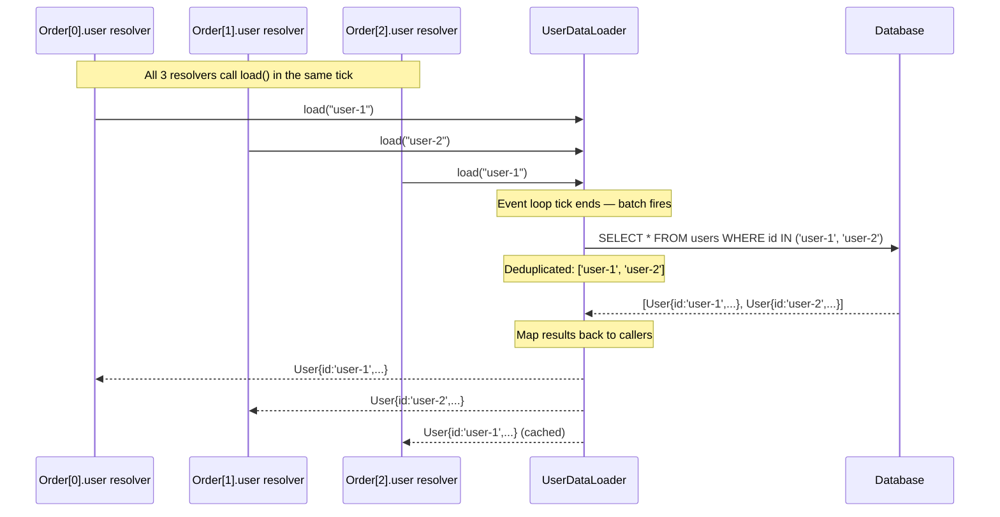

# 04 — DataLoader and Batching

> **Purpose:** Understand the N+1 problem — the single most common production performance catastrophe in GraphQL — and master DataLoader as the canonical solution. This guide covers how tick-based batching works, per-request lifecycle, advanced patterns, and how to verify that batching is actually working in production.

---

## Learning Objectives

- [ ] Explain the N+1 problem and calculate its real cost at scale (database query count, latency)
- [ ] Describe the JavaScript event loop mechanism that enables DataLoader's tick-based batching
- [ ] Implement a production-ready DataLoader with correct key ordering
- [ ] Set up per-request DataLoader instances in a request context factory
- [ ] Use `loader.clear()` and `loader.prime()` correctly after mutations
- [ ] Instrument DataLoader batch sizes in production metrics
- [ ] Apply DataLoader to non-database backends (gRPC, REST)

---

## Overview / Architecture

DataLoader sits between the GraphQL resolver tree and the I/O layer. Its job is to coalesce multiple individual loads (one per resolver call) into a single batch request.



---

## Core Concepts

### The N+1 Problem — Impact at Production Scale

The N+1 problem occurs when fetching a list of N objects requires N+1 total queries — one to fetch the list and one for each item in it.

**The canonical example:**

```graphql
query GetOrdersWithUsers {
  orders(limit: 100) {         # 1 query: SELECT * FROM orders LIMIT 100
    id
    status
    user {                     # 100 queries: SELECT * FROM users WHERE id = $1
      name
      email
    }
  }
}
```

**Counting the damage:**

| List Size | Database Queries | At 5ms/query | At 1000 concurrent clients |
|---|---|---|---|
| 10 orders | 11 queries | 55ms | 11,000 queries/request burst |
| 100 orders | 101 queries | 505ms | 101,000 queries/request burst |
| 500 orders | 501 queries | 2,505ms | 501,000 queries/request burst |

PostgreSQL with a 50-connection pool handling 101,000 queries from 1,000 concurrent clients: 2,020 queries queued per connection. The connection pool saturates, queries queue, latency spikes, timeouts cascade. This is how a single unoptimized GraphQL query kills a production database under load.

**The root cause:** GraphQL's parallel execution model calls each child resolver independently. The `Order.user` resolver is called once per order, with no mechanism to know about the other calls happening concurrently. Each call naively issues its own database query.

**Why REST doesn't have this problem (usually):** REST endpoints are designed as resource-specific handlers that know in advance what data they need. A `GET /orders?include=user` endpoint explicitly JOINs the user table once. GraphQL's composability is what introduces this challenge — the resolver for `user` is decoupled from the resolver for `orders` by design.

### How DataLoader Works — Tick-Based Batching

DataLoader was created at Facebook to solve exactly this problem. It exploits JavaScript's event loop to collect multiple `load()` calls that happen synchronously (within the same event loop tick) and execute them as a single batch.

**The mechanism:**

```
Event Loop Tick 1:
  - GraphQL executor starts resolving Order[0].user → calls userLoader.load("user-1")
  - DataLoader: queue ["user-1"], schedule batch dispatch (via process.nextTick or setTimeout)
  - GraphQL executor starts resolving Order[1].user → calls userLoader.load("user-2")
  - DataLoader: queue ["user-2"]
  - GraphQL executor starts resolving Order[2].user → calls userLoader.load("user-1")
  - DataLoader: "user-1" already queued — return the same pending Promise (deduplication)
  - ... (100 resolvers all call load() — all queued in this tick)

Event Loop Tick 2 (microtask / next tick):
  - DataLoader fires the batch: batchFn(["user-1", "user-2", ..., "user-42"])
  - ONE database query: SELECT * FROM users WHERE id IN (...)
  - Results arrive
  - DataLoader maps result[i] → key[i] and resolves all 100 pending Promises

Back to Event Loop Tick 1 continuations:
  - All 100 resolver Promises resolve with their individual user objects
  - GraphQL executor proceeds to resolve nested User fields
```

**Key insight:** `load()` returns a Promise that does not resolve until the batch fires. The batch fires on the next event loop tick (after all synchronous work in the current tick completes). Since GraphQL's parallel resolver invocations all happen synchronously within one tick, all loads are collected before the batch executes.

---

## Real-World Implementation

### Basic DataLoader Setup

```javascript
import DataLoader from 'dataloader';
import { db } from './database';

/**
 * Create a DataLoader for batching user lookups by ID.
 *
 * CRITICAL CONTRACT: The batch function must return an array of the same
 * length as the input keys array, in the same order. DataLoader pairs
 * results[i] with keys[i]. Violating this causes silent data corruption
 * (user A gets user B's data).
 */
function createUserLoader() {
  return new DataLoader(async (userIds) => {
    // userIds: readonly string[] — all IDs requested in this batch tick

    const users = await db.query(
      'SELECT id, name, email, avatar_url, created_at FROM users WHERE id = ANY($1::uuid[])',
      [userIds]
    );

    // Build a map for O(1) lookup
    const userMap = new Map(users.rows.map(u => [u.id, u]));

    // Return results in the SAME ORDER as input keys
    // Return Error objects for missing keys (triggers GraphQL field error)
    return userIds.map(id =>
      userMap.get(id) ?? new Error(`User not found: ${id}`)
    );
  });
}
```

**Why the ordering requirement exists:**

```javascript
// DataLoader internally does this after your batchFn resolves:
keys.forEach((key, index) => {
  const value = values[index]; // Paired by index, NOT by key
  if (value instanceof Error) {
    batch.keys[index].reject(value);
  } else {
    batch.keys[index].resolve(value);
  }
});
```

If your database returns users in a different order than the input IDs (which it will — SQL has no guaranteed row ordering), you must sort the results back to input order. The `userMap.get(id)` pattern does this.

### Request Context Factory

DataLoaders must be created fresh for each request. Never share DataLoader instances across requests.

```javascript
/**
 * Context factory — called once per GraphQL request.
 * All DataLoader instances are scoped to this request.
 */
async function createContext({ req }) {
  const user = await authenticateRequest(req);

  return {
    // Auth
    user,
    isAdmin: user?.roles?.includes('admin') ?? false,

    // Database
    db,

    // DataLoaders — fresh instances per request
    loaders: {
      user: createUserLoader(),
      product: createProductLoader(),
      order: createOrderLoader(),
      ordersByUser: createOrdersByUserLoader(),
      productsByCategory: createProductsByCategoryLoader(),
    },

    // Request-scoped logging
    logger: req.log.child({ userId: user?.id, requestId: req.id }),
  };
}

// Apollo Server 4
const server = new ApolloServer({ schema });
const handler = expressMiddleware(server, {
  context: createContext,
});
```

### Using DataLoaders in Resolvers

```javascript
const resolvers = {
  Query: {
    orders: (_, args, ctx) => ctx.db.findOrders(args),
  },

  Order: {
    // Each of these calls runs for every Order in the list
    user: (order, _, ctx) => {
      return ctx.loaders.user.load(order.userId);
    },

    // Batch loading by a non-PK foreign key
    items: (order, _, ctx) => {
      return ctx.loaders.orderItems.load(order.id);
    },
  },

  User: {
    // Nested N+1 — also solved by DataLoader
    recentOrders: (user, args, ctx) => {
      return ctx.loaders.ordersByUser.load(user.id);
    },
  },
};
```

### DataLoader for One-to-Many Relationships

Loading multiple items per key (orders by user ID) requires grouping the results:

```javascript
function createOrdersByUserLoader() {
  return new DataLoader(async (userIds) => {
    const orders = await db.query(
      'SELECT * FROM orders WHERE user_id = ANY($1::uuid[]) ORDER BY created_at DESC',
      [userIds]
    );

    // Group orders by user_id
    const ordersByUser = new Map(userIds.map(id => [id, []]));
    for (const order of orders.rows) {
      ordersByUser.get(order.user_id)?.push(order);
    }

    // Return arrays in input key order
    return userIds.map(id => ordersByUser.get(id) ?? []);
  });
}
```

### Cache Management After Mutations

DataLoader maintains an in-request cache. After a mutation modifies data, the cache may contain stale values:

```javascript
const resolvers = {
  Mutation: {
    updateUser: async (_, args, ctx) => {
      const updatedUser = await ctx.db.updateUser(args.id, args.input);

      // Option 1: Clear the cache — next load will re-fetch from DB
      ctx.loaders.user.clear(args.id);

      // Option 2: Prime the cache with the known fresh value
      // (avoids a second DB query if this user is accessed later in the response)
      ctx.loaders.user.prime(args.id, updatedUser);

      return updatedUser;
    },

    deleteUser: async (_, args, ctx) => {
      await ctx.db.deleteUser(args.id);

      // Clear to prevent returning deleted data in the same response
      ctx.loaders.user.clear(args.id);

      return { success: true };
    }
  }
};
```

### Advanced DataLoader Configuration

```javascript
const productLoader = new DataLoader(
  async (ids) => {
    const products = await db.query(
      'SELECT * FROM products WHERE id = ANY($1::uuid[])',
      [ids]
    );
    const map = new Map(products.rows.map(p => [p.id, p]));
    return ids.map(id => map.get(id) ?? new Error(`Product not found: ${id}`));
  },
  {
    // Normalize key types — prevents cache misses from int vs. string keys
    cacheKeyFn: (key) => String(key),

    // Split batches larger than 100 keys into multiple DB queries
    // Useful when DB has parameter limits (Postgres has $1...$65535)
    maxBatchSize: 100,

    // Custom batch scheduling — wait 5ms for more loads (higher latency, larger batches)
    // Default: process.nextTick (essentially immediate)
    batchScheduleFn: (callback) => setTimeout(callback, 5),

    // Disable per-request caching (rarely needed — disabling cache can increase query count)
    cache: false,
  }
);
```

### DataLoader for Non-Database Backends

DataLoader works for any service that supports batch requests. The pattern is identical — implement a batch function that accepts multiple keys and returns results in order.

**gRPC batch call:**

```javascript
function createUserServiceLoader(userServiceClient) {
  return new DataLoader(async (userIds) => {
    // Assumes the gRPC service has a BatchGetUsers RPC
    const response = await userServiceClient.batchGetUsers({
      ids: userIds,
    });

    const userMap = new Map(response.users.map(u => [u.id, u]));
    return userIds.map(id =>
      userMap.get(id) ?? new Error(`User service returned no data for id: ${id}`)
    );
  });
}
```

**REST API batch call:**

```javascript
function createGitHubUserLoader(githubToken) {
  return new DataLoader(async (usernames) => {
    // GitHub GraphQL API supports multi-user queries
    const query = usernames.map((username, i) => `
      user${i}: user(login: "${username}") {
        login avatarUrl bio followers { totalCount }
      }
    `).join('\n');

    const response = await fetch('https://api.github.com/graphql', {
      method: 'POST',
      headers: {
        'Authorization': `Bearer ${githubToken}`,
        'Content-Type': 'application/json',
      },
      body: JSON.stringify({ query: `{ ${query} }` }),
    }).then(r => r.json());

    return usernames.map((username, i) =>
      response.data[`user${i}`] ?? new Error(`GitHub user not found: ${username}`)
    );
  });
}
```

**Redis cache batch loader:**

```javascript
function createCacheLoader(redis) {
  return new DataLoader(async (keys) => {
    // Redis MGET retrieves multiple keys atomically
    const values = await redis.mget(...keys);
    return values.map((v, i) =>
      v !== null ? JSON.parse(v) : new Error(`Cache miss: ${keys[i]}`)
    );
  }, {
    // Cache misses should not be cached by DataLoader
    // (we want to re-try the cache on next load)
    cache: false,
  });
}
```

### Monitoring DataLoader Efficiency

DataLoader batching is only effective if the same loader instance receives multiple loads before the batch fires. The key metric is **batch size distribution**:

- Average batch size = 1: DataLoader is not batching — investigate why (different loader instances per resolver? resolver calling load inside a `.then()`?)
- Average batch size = N (matching list size): DataLoader is working correctly

```javascript
/**
 * Wrap a DataLoader to emit batch statistics to your metrics system.
 * Passes through to the original batch function — zero business logic here.
 */
function instrumentedLoader(name, batchFn, options = {}) {
  return new DataLoader(async (keys) => {
    const start = performance.now();
    let results;
    let errorCount = 0;

    try {
      results = await batchFn(keys);

      // Count error results (DataLoader errors are values, not thrown errors)
      errorCount = results.filter(r => r instanceof Error).length;

      return results;
    } catch (err) {
      // Batch function itself threw — all keys fail
      metrics.increment('dataloader.batch.fatal_error', { loader: name });
      throw err;
    } finally {
      const duration = performance.now() - start;

      metrics.histogram('dataloader.batch.size', keys.length, { loader: name });
      metrics.histogram('dataloader.batch.duration_ms', duration, { loader: name });
      metrics.histogram('dataloader.batch.error_count', errorCount, { loader: name });

      // Log batches that are suspiciously small (possible batching failure)
      if (keys.length === 1) {
        metrics.increment('dataloader.batch.single_key', { loader: name });
      }
    }
  }, options);
}

// Use it everywhere:
function createUserLoader() {
  return instrumentedLoader(
    'user',
    async (userIds) => {
      const users = await db.query('SELECT * FROM users WHERE id = ANY($1)', [userIds]);
      const map = new Map(users.rows.map(u => [u.id, u]));
      return userIds.map(id => map.get(id) ?? new Error(`Not found: ${id}`));
    }
  );
}
```

**Datadog / Grafana dashboard for DataLoader:**

```
# Key metrics to track:
dataloader.batch.size (p50, p95, p99) — Is batching working?
dataloader.batch.duration_ms (p50, p95, p99) — How long do batch queries take?
dataloader.batch.single_key.count — How many batches are size=1? (Indicates a batching bug)
dataloader.batch.fatal_error.count — Batch function failures
dataloader.batch.error_count.avg — Percentage of key misses per batch
```

---

## Production Considerations

### Performance

**Verify your database indexes support batch queries.** A DataLoader that does `WHERE id = ANY($1)` needs an index on `id`. Without it, the batch query does a full table scan. This is usually fine (primary keys are indexed by default), but for custom loaders using non-PK columns, check your indexes.

```sql
-- Verify index usage on batch query
EXPLAIN SELECT * FROM users WHERE id = ANY(ARRAY['id1','id2','id3']);
-- Should show: Index Scan using users_pkey on users
-- NOT: Seq Scan on users
```

**Maximum batch size limits.** PostgreSQL supports up to 65,535 parameters (`$1` through `$65535`). For a batch query with one parameter per key, this is a hard limit. If batches can grow larger, use `maxBatchSize: 1000` (or lower) in DataLoader options. The loader will automatically split large batches into multiple queries.

**DataLoader cache in long-running operations.** The per-request cache prevents redundant loads within a single request. If a request is extremely long-lived (e.g., a complex mutation sequence), the cache could grow large. This is rarely a problem — in practice, per-request DataLoader instances live for milliseconds.

### Security

**Authorization and the DataLoader cache.** DataLoader's cache is unscoped — if user A's data is loaded, it's cached for the entire request. In most cases this is correct. But if a single request resolves data for multiple users (e.g., an admin panel query), ensure the batch function is authorized to fetch all requested keys:

```javascript
// If the batch function needs to check authorization per key,
// do it in the batch function, not in the resolver:
function createUserLoader(requestingUser) {
  return new DataLoader(async (userIds) => {
    const users = await db.query(
      // Only return users the requester is authorized to see
      `SELECT * FROM users WHERE id = ANY($1)
       AND (is_public = true OR id = $2 OR $3 = true)`,
      [userIds, requestingUser.id, requestingUser.isAdmin]
    );
    const map = new Map(users.rows.map(u => [u.id, u]));
    return userIds.map(id =>
      map.get(id) ?? new Error(`User not found or access denied: ${id}`)
    );
  });
}
```

### Scaling

DataLoader batches are per-server-instance. In a horizontally scaled deployment with 10 server instances, 100 concurrent requests are split across instances. Each instance handles ~10 requests and batches independently — this is correct behavior. You do not want a global batch coordinator; the local batching within each instance is sufficient and eliminates cross-instance coordination overhead.

The batching benefit scales with concurrency per instance, not total system throughput. Run load tests at realistic per-instance concurrency (e.g., 20–50 concurrent requests per Node.js instance) to verify batch sizes.

### Observability

The most important production signal: **DataLoader batch size distribution**. If you see `dataloader.batch.size` consistently at 1 for a loader that should be batching, investigate immediately.

Common root causes of batch size = 1 (batching not working):

| Root Cause | Symptom | Fix |
|---|---|---|
| Creating loader inside resolver | New loader per call — no other calls share the instance | Move loader creation to context factory |
| Calling `load()` inside `.then()` callback | Load fires in a new tick after the batch has already executed | Call `load()` synchronously in the resolver, not inside a callback |
| `await` before `load()` call | Awaiting anything before `load()` moves execution to a new tick | Call all `load()` at the same level without intermediate `await` |
| Different loader instances per request | Batch never accumulates — each request is isolated (correct, but small batches) | Expected if concurrency per instance is low; verify with load test |

**Diagnosing batching failure:**

```javascript
// WRONG — load() called after an await, in a new tick
Order: {
  user: async (order, _, ctx) => {
    await someOtherOperation(); // This yields the event loop!
    return ctx.loaders.user.load(order.userId); // Fires in a new tick — no batching
  }
}

// CORRECT — load() called synchronously
Order: {
  user: (order, _, ctx) => {
    // No await before the load() — this fires in the current tick
    return ctx.loaders.user.load(order.userId);
  }
}
```

---

## Best Practices

1. **Create DataLoader instances in the request context factory — never inside resolvers.** The entire batch coalescing mechanism depends on multiple resolvers calling `load()` on the same DataLoader instance. If you create a new DataLoader instance inside each resolver call, each instance receives exactly one key and batching never happens. Context factory → one DataLoader instance → all resolvers in that request share it → batching works.

2. **Always return results in the same order as input keys.** DataLoader maps `results[i]` to `keys[i]`. If your database returns rows in a different order (and it will — SQL has no guaranteed row ordering), sort results back to input order using a Map lookup: `keys.map(id => resultMap.get(id))`. Failure to do this causes silent data corruption — users receive other users' data.

3. **Return `Error` objects for missing keys, do not return `null` when the field is non-null.** DataLoader treats `Error` instances in the results array as rejections for that key's Promise. This triggers proper GraphQL null propagation and error reporting. If you return `null` for a missing key and the field is declared `User!` (non-null), the executor silently returns null and the client may not realize the data is missing.

4. **Use `loader.prime(key, value)` after mutations to avoid stale reads in the same request.** When a mutation modifies an entity, clear or reprime the loader cache for that entity. This ensures that if the same entity is requested later in the same response (e.g., in the mutation's return value or in subsequent fields), the fresh value is returned without an additional database query.

5. **Monitor batch size distributions in production.** Set up a histogram for `dataloader.batch.size` per loader. A p50 batch size of 1 for a loader that should be batching is a production bug — it means you're back to N+1. Alert on this metric.

---

## Anti-Patterns

**Global (singleton) DataLoader instances.** This is the most dangerous anti-pattern. A DataLoader created once at module load time persists its in-request cache indefinitely. Request A loads user "u-1" with value V1; the cache stores it. Request B triggers an update — user "u-1" is now V2. Request C calls `load("u-1")` — the global DataLoader returns cached V1 (stale data). Worse, the cache grows indefinitely until the process runs out of memory. Always create fresh DataLoader instances per request.

**Creating new DataLoader instances inside individual resolvers.** Even when not using global singletons, creating a DataLoader inside a resolver defeats its purpose:

```javascript
// ANTI-PATTERN — new DataLoader per resolver call
Order: {
  user: (order, _, ctx) => {
    // This creates a brand new DataLoader for EVERY order
    // Each DataLoader receives exactly one key — zero batching
    const loader = new DataLoader(batchFn);
    return loader.load(order.userId);
  }
}
```

**Not ordering batch results to match input keys.** This causes silent, hard-to-diagnose data corruption. User A sees User B's email. Orders are attributed to the wrong users. In production, this manifests as intermittent data inconsistencies that are extremely difficult to trace without understanding DataLoader internals. Always use `keys.map(k => resultMap.get(k))`.

**Skipping DataLoader for "small" queries.** "We only fetch 10 orders at most — DataLoader is overkill." At 100 concurrent clients each fetching 10 orders, that's 1,100 database queries per second (100 × 11). With DataLoader, it's 200 queries per second (100 × 2). DataLoader's value scales with concurrency, not just list size.

---

## Operational Notes

- DataLoader is published as the `dataloader` npm package by the GraphQL Foundation. Current stable: 2.x.
- `@graphql-tools/batch-execute` provides similar batching for schema stitching scenarios.
- Pothos (schema builder) has a built-in DataLoader plugin (`@pothos/plugin-dataloader`) that auto-creates loaders from type definitions.
- Prisma's `findMany` can replace DataLoader for simple cases when using the Prisma ORM — Prisma batches queries automatically in some scenarios.
- Apollo Server's `@apollo/datasource-rest` provides HTTP request batching and caching patterns for REST backends, similar to DataLoader.
- In Python (`graphql-core`, Strawberry, Ariadne), the equivalent library is `strawberry-django`'s built-in DataLoader support or the `promise` library's `DataLoader` port.

---

## References

- [DataLoader: GitHub Repository](https://github.com/graphql/dataloader)
- [DataLoader: Original Facebook Engineering Post](https://engineering.fb.com/2015/02/13/core-data/dataloader-server-side-batching-and-caching/)
- [GraphQL N+1 Problem (Apollo Blog)](https://www.apollographql.com/blog/optimizing-your-graphql-request-waterfalls)
- [graphql-js: Default Resolver](https://github.com/graphql/graphql-js/blob/main/src/execution/execute.ts)
- [Pothos DataLoader Plugin](https://pothos-graphql.dev/docs/plugins/dataloader)
- [OpenTelemetry: Measuring DataLoader Performance](https://opentelemetry.io/docs/instrumentation/js/)

---

## Related Topics

- [03 — Execution Engine](./03-execution-engine.md)
- [Resolvers and Execution](../04-resolvers-and-execution/README.md)
- [Performance and Scaling](../06-performance-and-scaling/README.md)
- [Caching Strategies](../17-caching-strategies/README.md)
- [Observability](../14-observability/README.md)
