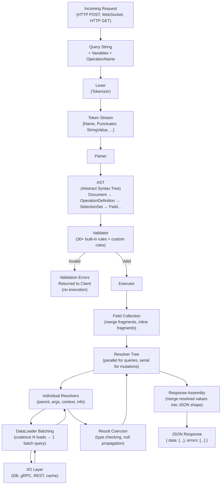

# 02 — GraphQL Internals

> **Purpose:** Understand how GraphQL works from first principles — from the moment a query string arrives at the server until a JSON response is returned. This knowledge separates engineers who can write GraphQL from engineers who can debug it, extend it, and build reliable systems with it.

---

## Why Platform Engineers Must Understand GraphQL Internals

Knowing how to write queries is table stakes. Understanding the internals is what allows you to:

- **Debug performance issues at the engine level** — Is the bottleneck in parsing? Validation? Resolver I/O? You cannot answer that without understanding the pipeline.
- **Write custom validation rules** — Every production GraphQL deployment needs custom rules: depth limits, complexity limits, field allowlists. These are built by traversing the AST.
- **Instrument resolvers correctly** — OpenTelemetry spans should mirror the resolver tree. To instrument that tree, you need to understand how the execution engine walks it.
- **Build internal tooling** — Schema linters, query cost analyzers, operation registry pipelines, code generators — all of these operate directly on ASTs and schema objects.
- **Design for safety** — Null propagation, serial vs. parallel execution, error boundaries — these are spec behaviors. Getting them wrong causes silent data corruption or cascading failures in production.
- **Optimize the DataLoader layer** — N+1 queries are the #1 GraphQL performance failure mode. Fixing them requires understanding how the resolver tree executes and where DataLoader batching fits.

---

## What This Folder Covers

This folder traces the complete lifecycle of a GraphQL request — every transformation the engine performs on a query string before and after execution:

---

## Files in This Folder

| File | What You'll Learn | Est. Time |
|------|-------------------|-----------|
| `01-parsing-and-ast.md` | How the lexer tokenizes a query string, how the parser builds an AST, all AST node types, and how to traverse and transform ASTs using the `visit()` API | 30–45 min |
| `02-validation-pipeline.md` | The 30+ built-in validation rules (grouped by category), how to write custom validation rules, validation caching, APQ, and how validation errors surface | 30–40 min |
| `03-execution-engine.md` | The execution algorithm step-by-step, the resolver function signature, parallel vs. serial execution, null propagation rules, and incremental delivery (`@defer`/`@stream`) | 45–60 min |
| `04-dataloader-and-batching.md` | The N+1 problem with real production impact numbers, how DataLoader's tick-based batching works, per-request DataLoader lifecycle, advanced patterns, and observability | 30–40 min |

---

## Prerequisites

Before reading this folder, you should be familiar with:

- GraphQL fundamentals: [`docs/01-graphql-fundamentals/`](../01-graphql-fundamentals/README.md)
  - Schema Definition Language (SDL)
  - Queries, mutations, subscriptions
  - Types, interfaces, unions, scalars
  - Fragments and variables
  - Directives (`@skip`, `@include`, `@deprecated`)

You do not need to know the internals of any specific GraphQL server (Apollo, Yoga, Mercurius) to read this folder. The concepts apply to any spec-compliant implementation.

---

## Reading Guide

**If you are debugging a performance issue:** Start with `03-execution-engine.md`, then `04-dataloader-and-batching.md`.

**If you are building a query cost analysis or rate limiting system:** Start with `01-parsing-and-ast.md` (AST visitors), then `02-validation-pipeline.md` (custom validation rules).

**If you are writing tooling (code generators, schema linters, query analyzers):** `01-parsing-and-ast.md` is your primary reference.

**If you are onboarding to this codebase for the first time:** Read the files in order — 01 through 04.

---

## Key Mental Model

Every GraphQL request passes through exactly four phases:

1. **Parse** — Syntax check. Produces an AST or a syntax error.
2. **Validate** — Semantic check against the schema. Produces validation errors or a validated document.
3. **Execute** — Resolver tree traversal. Produces resolved values or execution errors.
4. **Coerce + Assemble** — Type-check resolved values, apply null propagation, merge into final JSON.

Phases 1 and 2 are pure CPU work — stateless, fast, and cacheable. Phase 3 is where I/O happens. Phase 4 is pure CPU again.

This separation is why APQ (Automatic Persisted Queries) and document caching are high-leverage optimizations: they eliminate phases 1–2 for repeated operations.

---

## Related Topics

- [Resolvers and Execution](../04-resolvers-and-execution/README.md)
- [Performance and Scaling](../06-performance-and-scaling/README.md)
- [Security](../05-security/README.md)
- [Observability](../14-observability/README.md)
- [Caching Strategies](../17-caching-strategies/README.md)
