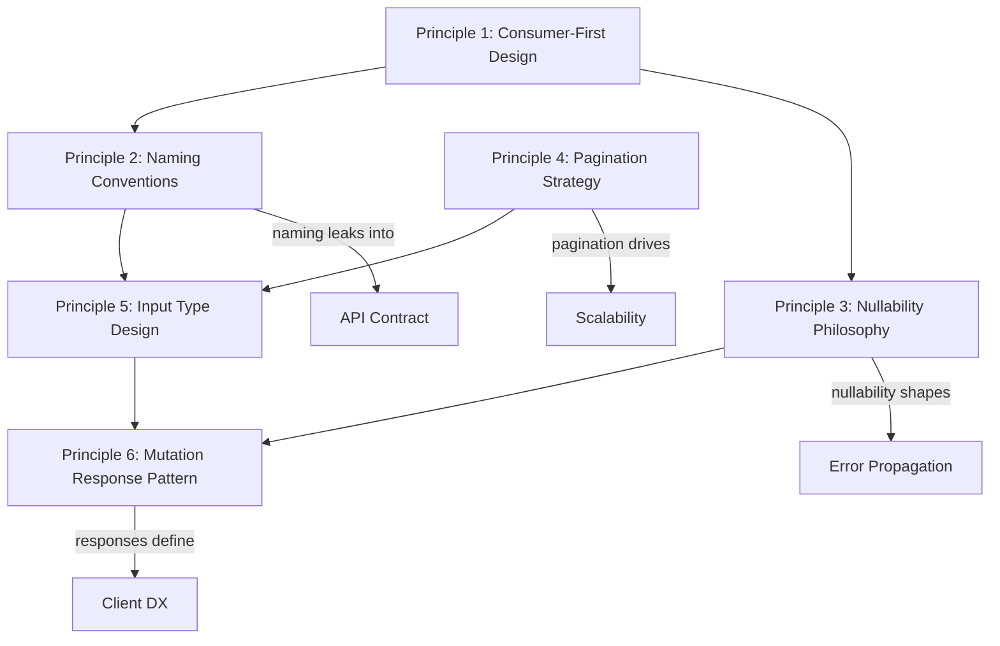
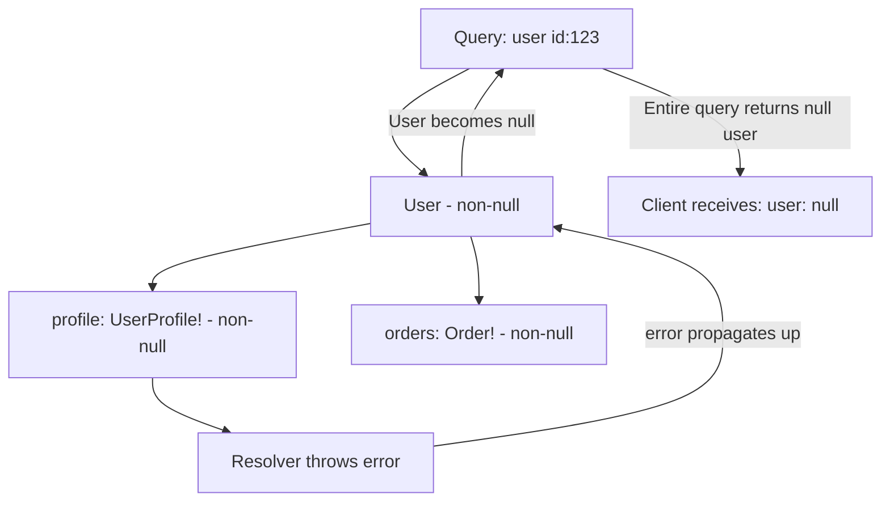

# GraphQL Schema Design Principles

> **Purpose:** Establish the foundational principles that govern every schema decision — from individual field naming through pagination strategy and mutation payload design. These principles are not conventions for their own sake; each one has a concrete, production-observable rationale. Engineers who internalize these principles produce schemas that age well.

---

## Learning Objectives

- [ ] Explain why a GraphQL schema should reflect consumer intent rather than database structure
- [ ] Apply consistent naming conventions for fields, types, enums, queries, and mutations
- [ ] Make principled nullability decisions using the "nullability cliff" model
- [ ] Choose cursor-based pagination over offset pagination for production datasets
- [ ] Design input types that support additive evolution without breaking mutation signatures
- [ ] Implement the mutation payload pattern for structured error handling
- [ ] Identify schema anti-patterns by their production failure modes

---

## Overview / Architecture

Schema design decisions form a hierarchy. Each layer constrains the layers below it.



Consumer-first design is the meta-principle from which all others derive. Naming, nullability, pagination, and payload design are all applications of "what does the consumer need?" to specific schema elements.

---

## Core Concepts

### What Makes a Schema "Consumer-Facing"?

A consumer-facing schema presents the world as the consumer understands their business domain, not as the engineering team implemented storage. The consumer thinks about customers, orders, and products — not about `users_v2` tables, foreign key integers, and Unix epoch timestamps.

When a database column leaks into a GraphQL field, the consumer is forced to:
1. Learn your internal data model to use your API
2. Handle implementation-specific types (Unix timestamps instead of ISO 8601 strings)
3. Call separate queries to resolve relationships that should be inline (fetching `user_fk` then separately fetching the user)
4. Cope with breaking changes whenever you refactor your storage layer

A consumer-facing schema abstracts all of this. The consumer sees domain objects with resolved relationships, typed values, and stable field names. The underlying storage can change completely without affecting the schema.

---

## Real-World Implementation

### Principle 1: Design for Consumers, Not Data Storage

The most important principle. This is not a stylistic preference — it is the architectural difference between a schema that clients can use productively and one that clients must work around.

**Counter-example: database schema leaked into GraphQL**

```graphql
# BAD: Database schema leaked into GraphQL
type orders_table {
  order_id: Int!          # snake_case (SQL naming style)
  user_fk: Int!           # foreign key exposed as raw integer
  created_ts: Int!        # Unix timestamp instead of ISO DateTime
  status_enum: String!    # Raw storage value "1", "2", "3"
  subtotal_cents: Int!    # Implementation detail: currency in cents
  discount_amt: Int       # Abbreviation, ambiguous type
  addr_id: Int            # Another foreign key — client must fetch separately
}
```

Problems with this schema:
- `user_fk: Int!` forces clients to make a second query: fetch the order, extract `user_fk`, then fetch `user(id: $user_fk)`. This is REST-style N+1 baked into the schema.
- `status_enum: String!` returning `"1"` means clients must implement their own status mapping table. Changes to your status codes silently break all clients.
- `subtotal_cents: Int!` is a storage implementation detail. When you move to decimal storage or multi-currency, every client breaks.
- `created_ts: Int!` forces every client to handle Unix timestamp conversion. Time zones, daylight saving, and locale formatting become each client's problem.
- snake_case everywhere violates JavaScript/TypeScript conventions universally used in web clients.

**Good: consumer-facing API design**

```graphql
# GOOD: Consumer-facing API design
type Order {
  id: ID!
  customer: User!                      # Resolved relationship, not a foreign key integer
  status: OrderStatus!                 # Meaningful enum, not a raw storage value
  total: Money!                        # Domain type hiding currency implementation
  subtotal: Money!
  discount: Money                      # Nullable — orders may have no discount
  lineItems: [LineItem!]!              # Inline collection, not a foreign key
  shippingAddress: Address!            # Resolved value object
  billingAddress: Address
  placedAt: DateTime!                  # ISO 8601 string, timezone-aware
  updatedAt: DateTime!
  estimatedDelivery: DateTime          # Nullable — may not be calculated yet
  trackingUrl: String                  # Nullable — not available until shipped
}

enum OrderStatus {
  PENDING
  CONFIRMED
  PROCESSING
  SHIPPED
  DELIVERED
  CANCELLED
  REFUNDED
}

type Money {
  amount: Float!
  currency: String!   # ISO 4217: "USD", "EUR", "GBP"
  formatted: String!  # Pre-formatted: "$42.00", "€38.50"
}
```

The `Money` type is a value object. It hides whether your database stores cents or decimal values. It provides `formatted` as a convenience field that resolves locale-appropriate display strings. When you change your storage representation, only the resolver changes — the schema contract is stable.

---

### Principle 2: Naming Conventions

Naming consistency is invisible when correct and painful when broken. In a supergraph with 30+ subgraph teams, if 10% of teams use `user_id` and 90% use `userId`, every client component must handle both patterns. Inconsistency at the schema level becomes noise throughout the entire client codebase.

**Field names: camelCase**

```graphql
type User {
  id: ID!
  firstName: String!      # NOT: first_name, FirstName, firstname
  lastName: String!
  emailAddress: String!   # NOT: email_address, EmailAddress
  createdAt: DateTime!
  lastLoginAt: DateTime
  isEmailVerified: Boolean!
}
```

**Type names: PascalCase**

```graphql
# Types
type ProductVariant { ... }
type OrderConnection { ... }
type UserProfile { ... }

# Interfaces
interface Node { ... }
interface Auditable { ... }

# Unions
union SearchResult = Product | User | Article

# Enums
enum OrderStatus { ... }
enum PaymentMethod { ... }
```

**Enum values: SCREAMING_SNAKE_CASE**

```graphql
enum OrderStatus {
  PENDING
  IN_REVIEW          # NOT: InReview, in_review, inReview
  CONFIRMED
  PROCESSING
  SHIPPED
  DELIVERED
  CANCELLED
  REFUNDED
}

enum PaymentMethod {
  CREDIT_CARD
  DEBIT_CARD
  PAYPAL
  APPLE_PAY
  GOOGLE_PAY
  BANK_TRANSFER
  CRYPTO
}
```

**Mutations: verb-noun pattern**

```graphql
type Mutation {
  # Create operations
  createOrder(input: CreateOrderInput!): CreateOrderPayload!
  createUser(input: CreateUserInput!): CreateUserPayload!
  createProduct(input: CreateProductInput!): CreateProductPayload!

  # Update operations
  updateUser(id: ID!, input: UpdateUserInput!): UpdateUserPayload!
  updateProduct(id: ID!, input: UpdateProductInput!): UpdateProductPayload!

  # Delete operations
  deleteUser(id: ID!): DeleteUserPayload!
  deleteProduct(id: ID!): DeleteProductPayload!

  # Domain-specific operations (verb must describe the action clearly)
  cancelOrder(id: ID!, reason: String): CancelOrderPayload!
  fulfillOrder(id: ID!, input: FulfillOrderInput!): FulfillOrderPayload!
  applyPromoCode(orderId: ID!, code: String!): ApplyPromoCodePayload!
  resendVerificationEmail(userId: ID!): ResendVerificationEmailPayload!
}
```

**Queries: noun or noun-phrase**

```graphql
type Query {
  # Single entity by ID
  user(id: ID!): User
  product(id: ID!): Product
  order(id: ID!): Order

  # Collections
  users(filter: UserFilter, first: Int, after: String): UserConnection!
  products(filter: ProductFilter, first: Int, after: String): ProductConnection!

  # Personalized (Viewer pattern)
  viewer: Viewer

  # Search
  search(query: String!, types: [SearchType!]): SearchResultConnection!
}
```

**Enforce with tooling.** Manual naming consistency does not scale. Use `graphql-eslint` with rules:
- `@graphql-eslint/naming-convention` — enforces camelCase fields, PascalCase types, SCREAMING_SNAKE_CASE enum values
- `@graphql-eslint/require-description` — requires descriptions on all types and fields
- Configure in `.graphqlrc.yml` and run in CI via `graphql-eslint` as part of `rover subgraph check`

---

### Principle 3: Nullability Philosophy

Nullability is one of the most consequential and least-discussed schema decisions. GraphQL's non-null modifier (`!`) is not just a type annotation — it changes how the execution engine propagates errors.

**The nullability cliff: how non-null propagates errors upward**



When a field is non-null (`!`) and its resolver throws an error, GraphQL cannot return a partial value for that field. It must null the field out. But if the field is non-null, the parent field must also be nulled. If the parent is also non-null, the grandparent is nulled. This cascade continues until it reaches a nullable ancestor or the root.

**Poorly designed schema — aggressive non-null causes error cascade:**

```graphql
type User {
  id: ID!
  profile: UserProfile!   # Non-null — if profile resolver throws, User becomes null
  orders: [Order!]!        # Non-null — if orders resolver throws, User becomes null
  recommendations: [Product!]!  # Non-null — if recommendations throws, User becomes null
}
```

If `recommendations` calls an ML service that times out, the entire `User` object is nulled in the response. The client was asking for `user { id name email }` — but it gets `null` because a distant non-essential resolver failed.

**Principled nullability design:**

```graphql
type User {
  id: ID!                          # Non-null: ID always exists if the User exists
  email: String!                   # Non-null: email is required for account creation
  name: String!                    # Non-null: required field
  profile: UserProfile             # Nullable: profile may not have been created yet
  orders(first: Int, after: String): OrderConnection  # Nullable: orders may fail independently
  recommendations: [Product!]      # Nullable: ML service may be unavailable
  phoneNumber: String              # Nullable: users may not have provided this
  avatarUrl: String                # Nullable: not all users have avatars
}
```

**The nullability decision rule:**

| Scenario | Nullability | Reasoning |
|---|---|---|
| Primary key, required system fields | Non-null (`!`) | Absence is a programming error |
| Required user-provided fields | Non-null (`!`) | Cannot create the entity without this field |
| Optional user-provided fields | Nullable | User may not have provided this |
| Relationships to other entities | Nullable | The related entity may not exist or its resolver may fail |
| Collections | Nullable list with non-null items: `[Item!]` | List itself may fail; items in the list are complete |
| Derived/computed fields from external services | Nullable | External service may be unavailable |

**List nullability semantics:**

```graphql
# [Item]   — nullable list of nullable items: null or [null, item, null]
# [Item!]  — nullable list of non-null items: null or [item, item]
# [Item]!  — non-null list of nullable items: [] or [null, item]
# [Item!]! — non-null list of non-null items: [] or [item, item]
```

In practice: use `[Item!]` (nullable list, non-null items) for relationships that may fail. The collection can be null if the resolver fails, but individual items are always complete. Use `[Item!]!` only when an empty list is always a valid response (never null) — such as a `lineItems` field on an `Order` that always has items.

---

### Principle 4: Pagination — Cursor-Based vs. Offset

Choosing a pagination strategy at schema design time locks you in. Migrating pagination patterns after clients have shipped is a multi-month breaking change.

**Offset pagination — simple but fundamentally flawed at scale:**

```graphql
type Query {
  users(page: Int!, limit: Int!): [User!]!
}
```

Problems at scale:
1. **Page drift**: if a user is inserted on page 1 while you are reading page 2, every subsequent page shifts by one item. You miss one item and duplicate another.
2. **Database performance**: `OFFSET 10000 LIMIT 20` forces the database to scan and discard 10,000 rows before returning results. At page 500 with 20 items per page, the query scans 10,000 rows every time.
3. **No stable position**: you cannot bookmark a position in the dataset and resume from it — the position changes as data changes.
4. **Total count coupling**: `page` requires knowing or computing `totalCount` to show page numbers, which is an expensive `COUNT(*)` query on large tables.

**Cursor-based pagination (Relay Connection spec) — production standard:**

```graphql
type Query {
  users(
    first: Int          # Forward pagination: take N items
    after: String       # Forward pagination: start after this cursor
    last: Int           # Backward pagination: take N items from end
    before: String      # Backward pagination: start before this cursor
    filter: UserFilter
    orderBy: UserOrderBy
  ): UserConnection!
}

type UserConnection {
  edges: [UserEdge!]!
  pageInfo: PageInfo!
  totalCount: Int       # Nullable: expensive to compute; only fetch when needed
}

type UserEdge {
  node: User!
  cursor: String!       # Opaque base64 string — clients must not parse this
}

type PageInfo {
  hasNextPage: Boolean!
  hasPreviousPage: Boolean!
  startCursor: String   # Nullable: null if connection is empty
  endCursor: String     # Nullable: null if connection is empty
}
```

Why cursor pagination is superior:

- **Cursor = opaque pointer** to a stable position in the dataset (e.g., the database primary key at that position). Position does not shift when items are inserted before or after it.
- **Efficient database queries**: `WHERE id > $cursor LIMIT 20` uses the index on `id` — O(log n) regardless of page depth.
- **Resumable**: store the `endCursor` in a job or UI component and resume exactly where you left off, even days later.
- **Edge properties**: the `UserEdge` type can carry metadata about the relationship (relevance score in search, position in a manually ordered list, etc.) that belongs to the relationship, not the node.

**Adding filters and ordering:**

```graphql
input UserFilter {
  status: UserStatus
  createdAfter: DateTime
  createdBefore: DateTime
  searchQuery: String
}

enum UserOrderBy {
  CREATED_AT_ASC
  CREATED_AT_DESC
  NAME_ASC
  NAME_DESC
  LAST_LOGIN_DESC
}
```

Make filters and ordering optional with sensible defaults. Never make `first` required — default to a reasonable page size (`first: Int = 20`).

---

### Principle 5: Input Type Design

Mutation arguments should almost always be wrapped in input types rather than listed as individual arguments. This is not purely stylistic — it has direct implications for schema evolution and client ergonomics.

**Avoid: individual scalar arguments**

```graphql
# BAD: scalar arguments directly on mutation
mutation UpdateUser(
  $id: ID!
  $name: String
  $email: String
  $bio: String
  $phoneNumber: String
  $avatarUrl: String
  $timezone: String
) {
  updateUser(
    id: $id
    name: $name
    email: $email
    bio: $bio
    phoneNumber: $phoneNumber
    avatarUrl: $avatarUrl
    timezone: $timezone
  ) {
    user { id }
  }
}
```

Problems:
1. **Fragile evolution**: adding a new field to this mutation changes its argument signature. Any code generator that produces typed mutation variables must be regenerated.
2. **Not reusable**: you cannot share this argument shape across mutations (`createUser` and `updateUser` have similar but not identical fields; input types can share validation logic).
3. **Variable namespace pollution**: all these variables clutter the operation's variable scope when the mutation is embedded in a larger document.

**Good: input type wrapping**

```graphql
# GOOD: input type wraps all mutation arguments
mutation UpdateUser($id: ID!, $input: UpdateUserInput!) {
  updateUser(id: $id, input: $input) {
    user { id name email }
    userErrors { field message code }
  }
}

input UpdateUserInput {
  name: String
  email: String
  bio: String
  phoneNumber: String
  avatarUrl: String
  timezone: String
}
```

Adding a `preferredLanguage: String` field to `UpdateUserInput` is a non-breaking change. The mutation signature does not change.

**PATCH semantics — distinguishing absent from null:**

For update mutations, all fields should be optional. But there is a semantic distinction between:
- Field **absent** from the input: don't update this field
- Field **explicitly null**: set this field to null (clear the value)

Standard GraphQL input types cannot distinguish these. The common pattern is to make optional update fields nullable and document that `null` means "clear this value":

```graphql
input UpdateUserInput {
  name: String         # If absent, don't update. If "John", set to "John".
  bio: String          # If absent, don't update. If null, clear the bio.
  phoneNumber: String  # If absent, don't update. If null, remove phone number.
}
```

For schemas where distinguishing absent-from-null is critical (e.g., partial patch APIs), use the wrapper pattern:

```graphql
# Advanced: explicit "clear" semantics
input UpdateUserInput {
  name: OptionalString
  bio: OptionalString
}

input OptionalString {
  value: String   # null here = clear the value; field absent = don't update
}
```

This adds complexity — use only when semantic precision outweighs verbosity.

**Input type naming:**

```graphql
# Always prefix with the mutation verb + entity name + "Input"
input CreateOrderInput { ... }
input UpdateOrderInput { ... }
input CreateProductVariantInput { ... }
input BulkUpdateInventoryInput { ... }
```

---

### Principle 6: Mutation Response Pattern

Every mutation should return a structured payload type rather than the naked entity. This pattern enables partial success reporting, field-level error attribution, and consistent client error handling across all mutations.

**Minimal mutation payload:**

```graphql
type CreateOrderPayload {
  order: Order               # Nullable: null if the operation failed
  userErrors: [UserError!]!  # Empty array on success; populated on validation failure
}

type UserError {
  field: [String!]           # Path to the invalid field, e.g. ["lineItems", "0", "quantity"]
  message: String!           # Human-readable error message
  code: UserErrorCode!       # Machine-readable error code for client logic
}

enum UserErrorCode {
  INVALID_INPUT
  NOT_FOUND
  UNAUTHORIZED
  CONFLICT
  OUT_OF_STOCK
  PAYMENT_DECLINED
  RATE_LIMITED
}

type Mutation {
  createOrder(input: CreateOrderInput!): CreateOrderPayload!
  updateOrder(id: ID!, input: UpdateOrderInput!): UpdateOrderPayload!
  cancelOrder(id: ID!, reason: String): CancelOrderPayload!
}
```

**Why `userErrors` instead of throwing GraphQL errors:**

GraphQL errors (the `errors` array in the response) are for *unexpected system errors* — resolver exceptions, network failures, authentication middleware errors. `userErrors` is for *expected business logic failures* — validation errors, business rule violations, resource conflicts.

The distinction matters because:
- GraphQL errors lose partial response data: when a field throws, its data is null and an error is appended
- `userErrors` allows the mutation to return both partial data AND structured error information
- Clients can handle `userErrors` with type-safe generated code; `errors` requires generic error handling

**Field path in `UserError`:**

The `field: [String!]` path array provides field-level error attribution:

```javascript
// Client receives this payload
{
  createOrder: {
    order: null,
    userErrors: [
      {
        field: ["lineItems", "0", "quantity"],
        message: "Quantity must be at least 1",
        code: "INVALID_INPUT"
      },
      {
        field: ["shippingAddress", "zipCode"],
        message: "ZIP code is invalid for the selected country",
        code: "INVALID_INPUT"
      }
    ]
  }
}

// Client maps errors to form fields using the path
const fieldErrors = {};
payload.userErrors.forEach(err => {
  const key = err.field.join('.');
  fieldErrors[key] = err.message;
});
// fieldErrors["lineItems.0.quantity"] = "Quantity must be at least 1"
// fieldErrors["shippingAddress.zipCode"] = "ZIP code is invalid for the selected country"
```

**Bulk mutation payload:**

For mutations that operate on multiple items, track success/failure per item:

```graphql
type BulkUpdateInventoryPayload {
  updatedProducts: [Product!]!
  failedUpdates: [BulkUpdateFailure!]!
  successCount: Int!
  failureCount: Int!
}

type BulkUpdateFailure {
  productId: ID!
  userErrors: [UserError!]!
}
```

---

## Production Considerations

### Performance

- **Non-null lists force eager loading**: `[Item!]!` (non-null list of non-null items) pressures resolver implementations to ensure they always have data. This can lead to eager database loads where lazy loading would suffice. Use `[Item!]` (nullable list) to allow the resolver to return null on error rather than throwing.
- **`totalCount` on connections is expensive**: `COUNT(*)` queries on large tables are slow. Make `totalCount` nullable and use `@defer` or separate queries to load it lazily.
- **Input type complexity**: deeply nested input types can be expensive to validate. Use middleware-level validation (e.g., `graphql-shield` or custom directives) rather than resolver-level validation for shared rules.

### Security

- **Input type depth limits**: deeply nested input types (e.g., recursive tree inputs) can be exploited for DoS attacks. Set `maxDepth` on input type validation. In Apollo Server, configure `depthLimit` middleware.
- **Field-level authorization**: input type fields that bypass access control (e.g., setting `role: ADMIN` via an input field) should be validated in resolver middleware, not schema-level.
- **Mutation idempotency**: document idempotency expectations on mutations. Use `clientMutationId` or idempotency key inputs for critical mutations like payment processing.

### Scaling

- **Cursor encoding stability**: base64-encoded cursors must be stable across schema deployments. If you change cursor encoding (e.g., from `id` to `createdAt + id`), existing cursors from clients break. Version cursor encoding or provide a cursor migration path.
- **Connection `totalCount` in federation**: each subgraph computes `totalCount` independently. If multiple subgraphs contribute to a connection, `totalCount` may be inaccurate or unavailable without cross-subgraph aggregation.

### Observability

- **Track field usage via Apollo Studio**: before removing any field, verify zero usage in Apollo Studio's field usage analytics. Field removal without usage verification is the primary source of production breaking changes.
- **Monitor `userErrors` rate per mutation**: high `userErrors` rates indicate either a client bug, a schema change that clients haven't adapted to, or a backend validation regression. Alert on abnormal `userErrors` rates.
- **Log input type validation failures**: validation errors on input types should be logged with the operation name and client identifier to distinguish client bugs from schema issues.

---

## Best Practices

1. **Start with a domain model whiteboard session before writing SDL.** Identify the core entities (nouns), relationships, and operations (verbs). Write your schema in terms of these, not in terms of your database tables. Treat the first version as a draft to be reviewed by client teams.

2. **Default to nullable for all relationships.** When in doubt, make a relationship nullable. It is a non-breaking change to add `!` to a nullable field (wait — actually it IS breaking). Make fields non-null only when you are certain the field will always be present and its resolver will never fail.

3. **Use `graphql-eslint` in every schema repository.** Configure naming convention rules on day one. Retrofitting naming conventions after a schema has 200+ types is a multi-team migration project. Enforce conventions automatically from the beginning.

4. **Adopt the Connection pattern universally.** Even for small collections, use `Connection` if the collection could grow. Migrating from `[Item!]!` to a `Connection` type is a breaking change. Starting with `Connection` is not.

5. **Write schema descriptions as documentation, not comments.** Use SDL descriptions (triple-quoted strings) on every type and field. These appear in Apollo Studio, GraphQL Playground, and generated client documentation. A field without a description is an undocumented API.

6. **Review your schema with client engineers before shipping.** The consumer-facing schema should be reviewed by at least one engineer from each major client team before it is published. Schema design is a cross-functional activity, not a backend-only concern.

---

## Anti-Patterns

### Anti-Pattern 1: The Database Mirror

**Symptom:** Types named after database tables (`users_table`, `order_items`), fields with `_fk` suffix, status fields returning raw integers.

**Failure mode:** Every database refactor (new column, table rename, denormalization) becomes a breaking schema change. Clients must understand your storage model to use your API.

**Fix:** Model domain objects, not tables. Resolve relationships in resolvers, not in the schema structure.

---

### Anti-Pattern 2: Non-Null Overuse

**Symptom:** Every field marked `!` "to be safe." Schema authors assume more reliability than resolvers can provide.

**Failure mode:** Any resolver exception anywhere in a query nulls out non-null parents recursively. A single `recommendations` resolver timeout nulls the entire `User` object in every query that requests any user field.

**Fix:** Apply the nullability decision rule: non-null only when absence is a programming error. Mark relationships and computed fields nullable.

---

### Anti-Pattern 3: Generic Input Types

**Symptom:** `input UserInput { ... }` used for both `createUser` and `updateUser`, with some fields required for create but optional for update.

**Failure mode:** The `create` mutation silently accepts null values for required fields when clients pass the shared input type. The `update` mutation requires fields that it should not need to change.

**Fix:** Use separate input types per mutation: `CreateUserInput` (required fields required), `UpdateUserInput` (all fields optional). They may share a fragment interface in TypeScript codegen but remain separate SDL types.

---

### Anti-Pattern 4: Opaque Error Responses

**Symptom:** Mutations return `Boolean` or `String` as success indicators. Errors are communicated through the GraphQL `errors` array with generic messages.

**Failure mode:** Clients cannot distinguish validation errors from system errors. Field-level error attribution is impossible. Generated TypeScript types do not model error states.

**Fix:** Use the mutation payload pattern with `userErrors: [UserError!]!` for all mutations. Reserve the GraphQL `errors` array for unexpected system errors only.

---

## Operational Notes

- **Schema review checklist:** before publishing a new schema, verify: (1) all types have descriptions, (2) naming conventions pass `graphql-eslint`, (3) all collections use Connection pattern, (4) all mutations return payload types with `userErrors`, (5) `rover subgraph check` passes with zero warnings.
- **Nullability audits:** quarterly audits using Apollo Studio field analytics identify fields marked non-null that return null in production (indicating resolver failures that the null-propagation is masking).
- **Input type versioning:** if you need to change an input type in a breaking way (e.g., making an optional field required), create a new mutation with a versioned name (`createOrderV2`) rather than changing the input type in place.
- **Cursor token TTL:** document whether cursors expire. For long-running batch jobs that paginate over large datasets, cursor TTL can cause mid-job failures. Stable cursors (based on database primary keys) do not expire; timestamp-based cursors may.

---

## References

- [GraphQL Specification — Types](https://spec.graphql.org/October2021/#sec-Types)
- [Relay Connection Specification](https://relay.dev/graphql/connections.htm)
- [Apollo GraphQL Schema Design Best Practices](https://www.apollographql.com/docs/apollo-server/schema/schema/)
- [Shopify GraphQL Design Tutorial](https://github.com/Shopify/graphql-design-tutorial)
- [GitHub GraphQL API Schema](https://docs.github.com/en/graphql/reference) — reference for real-world consumer-first schema design
- [graphql-eslint Naming Convention Rules](https://the-guild.dev/graphql/eslint/rules/naming-convention)
- [Production Ready GraphQL — Marc-Andre Giroux](https://book.productionreadygraphql.com/)

---

## Related Topics

- [`02-schema-patterns.md`](./02-schema-patterns.md) — Established schema patterns built on these principles
- [`03-schema-evolution.md`](./03-schema-evolution.md) — Evolving schemas while preserving the contract
- [`04-domain-modeling.md`](./04-domain-modeling.md) — Applying DDD to federation schema design
- [`../09-schema-governance/`](../09-schema-governance/) — Governance processes enforcing these principles at scale
- [`../07-federation/`](../07-federation/) — How these principles apply in federated supergraphs
