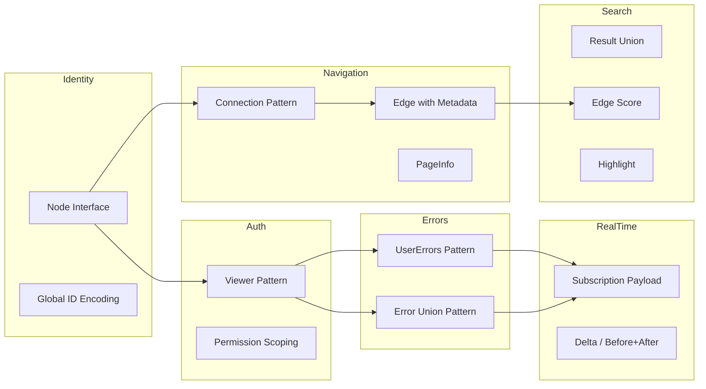

# GraphQL Schema Patterns

> **Purpose:** Document established, production-proven GraphQL schema patterns with full SDL examples and resolver implementations. These patterns solve recurring design problems — entity identity, pagination, search, authentication boundaries, error modeling, and real-time subscriptions — consistently across a codebase. Use these as building blocks rather than inventing ad-hoc solutions.

---

## Learning Objectives

- [ ] Implement the Relay Node interface for globally unique entity identity and cache normalization
- [ ] Build full Connection/Edge/PageInfo pagination with a resolver implementation
- [ ] Model heterogeneous search results using union types with edge-level metadata
- [ ] Apply the Viewer pattern to scope authenticated queries without polluting root types
- [ ] Choose between the userErrors pattern and Error Union pattern based on error semantics
- [ ] Design subscription payloads that are self-contained and include before/after state

---

## Overview / Architecture

These patterns compose. A production schema uses all of them simultaneously:



---

## Core Concepts

### Why Patterns and Not Just Conventions?

Patterns in GraphQL schema design solve problems that have known failure modes when solved ad-hoc:

- **Entity identity without a standard**: clients normalize caches using `__typename + id`. Without the Node interface, every client must implement custom cache key logic per type.
- **Pagination without a standard**: offset pagination drifts on inserts; connection-less pagination cannot carry edge metadata.
- **Search result modeling without unions**: returning `[Product!]!` for a search API that should also return `User` and `Article` results forces multiple separate queries or a mixed-type object hack.
- **Error modeling without a pattern**: inconsistent error shapes per mutation mean client error handling is repeated, mutation-specific code rather than shared infrastructure.

Each pattern below is a solved problem. Adopt the pattern; skip the discovery.

---

## Real-World Implementation

### Pattern 1: The Relay Node Interface

Every entity in your graph should implement `Node`. This is the most foundational pattern in GraphQL schema design because it enables client-side cache normalization.

```graphql
# Interface definition
interface Node {
  id: ID!
}

# Every entity type implements Node
type User implements Node {
  id: ID!
  name: String!
  email: String!
  profile: UserProfile
}

type Product implements Node {
  id: ID!
  title: String!
  price: Money!
  variants: [ProductVariant!]!
}

type Order implements Node {
  id: ID!
  customer: User!
  status: OrderStatus!
  total: Money!
}

# Universal entity lookup on the root query
type Query {
  node(id: ID!): Node
  nodes(ids: [ID!]!): [Node]!
}
```

**Why `node(id: ID!)` on the root Query:**

Apollo Client, Relay, and urql all normalize their caches using `__typename + id` as the cache key. When a client receives a `User` with `id: "VXNlcjoxMjM="`, it stores it as `User:VXNlcjoxMjM=` in the normalized cache. Later, any query that returns the same user — regardless of which field path it came through — updates the same cached object. Without the Node interface, this normalization does not work consistently.

The `node(id: ID!)` root query lets clients refetch any entity by its global ID without knowing which root query field to use. This is particularly valuable for cache refresh operations after mutations.

**Global ID encoding:**

The `id` field on Node must be globally unique across ALL types. A `User` with database ID `123` and a `Product` with database ID `123` must have different global IDs. The standard encoding is: `base64(TypeName:databaseId)`.

```javascript
// Encoding
function toGlobalId(typeName, databaseId) {
  return Buffer.from(`${typeName}:${databaseId}`).toString('base64');
}

// Decoding
function fromGlobalId(globalId) {
  const decoded = Buffer.from(globalId, 'base64').toString('utf-8');
  const colonIndex = decoded.indexOf(':');
  return {
    type: decoded.substring(0, colonIndex),
    id: decoded.substring(colonIndex + 1)
  };
}

// Usage
toGlobalId('User', '123')     // => "VXNlcjoxMjM="
toGlobalId('Product', '123') // => "UHJvZHVjdDoxMjM="  (different from User!)

fromGlobalId('VXNlcjoxMjM=') // => { type: 'User', id: '123' }
```

**Node resolver implementation:**

```javascript
// Apollo Server resolver
const resolvers = {
  Query: {
    node: async (_, { id }, context) => {
      const { type, id: dbId } = fromGlobalId(id);

      switch (type) {
        case 'User':
          return context.loaders.user.load(dbId);
        case 'Product':
          return context.loaders.product.load(dbId);
        case 'Order':
          return context.loaders.order.load(dbId);
        default:
          return null;
      }
    },
    nodes: async (_, { ids }, context) => {
      return Promise.all(ids.map(id => resolvers.Query.node(_, { id }, context)));
    }
  },
  Node: {
    __resolveType: (obj) => obj.__typename || obj.constructor.name
  }
};
```

---

### Pattern 2: Connection / Edge / PageInfo

The complete Connection pattern, with a production resolver implementation. This pattern is referenced in `01-design-principles.md` for its pagination advantages; here we show the full implementation.

**Schema definition:**

```graphql
type Query {
  users(
    first: Int
    after: String
    last: Int
    before: String
    filter: UserFilter
    orderBy: UserOrderByInput
  ): UserConnection!
}

type UserConnection {
  edges: [UserEdge!]!
  pageInfo: PageInfo!
  totalCount: Int       # Nullable — expensive COUNT query, fetch only when needed
}

type UserEdge {
  node: User!
  cursor: String!
}

type PageInfo {
  hasNextPage: Boolean!
  hasPreviousPage: Boolean!
  startCursor: String   # Null when connection is empty
  endCursor: String     # Null when connection is empty
}

input UserFilter {
  status: UserStatus
  createdAfter: DateTime
  createdBefore: DateTime
  searchQuery: String
}

input UserOrderByInput {
  field: UserOrderByField!
  direction: SortDirection!
}

enum UserOrderByField {
  CREATED_AT
  NAME
  LAST_LOGIN_AT
}

enum SortDirection {
  ASC
  DESC
}
```

**Resolver implementation (Node.js, Prisma):**

```javascript
const resolvers = {
  Query: {
    users: async (_, args, context) => {
      const { first = 20, after, filter, orderBy } = args;

      // Decode cursor to get the last-seen ID
      let cursorCondition = {};
      if (after) {
        const { id: lastSeenId } = fromGlobalId(after);
        cursorCondition = { id: { gt: lastSeenId } };
      }

      // Build filter conditions
      const where = {
        ...cursorCondition,
        ...(filter?.status && { status: filter.status }),
        ...(filter?.createdAfter && { createdAt: { gte: filter.createdAfter } }),
        ...(filter?.createdBefore && { createdAt: { lte: filter.createdBefore } }),
        ...(filter?.searchQuery && {
          OR: [
            { name: { contains: filter.searchQuery, mode: 'insensitive' } },
            { email: { contains: filter.searchQuery, mode: 'insensitive' } }
          ]
        })
      };

      // Fetch limit + 1 to determine hasNextPage
      const limit = first + 1;
      const users = await context.db.user.findMany({
        where,
        take: limit,
        orderBy: orderBy
          ? { [orderBy.field.toLowerCase()]: orderBy.direction.toLowerCase() }
          : { createdAt: 'asc' }
      });

      const hasNextPage = users.length > first;
      const nodes = hasNextPage ? users.slice(0, -1) : users;

      const edges = nodes.map(user => ({
        node: user,
        cursor: toGlobalId('User', user.id)
      }));

      return {
        edges,
        pageInfo: {
          hasNextPage,
          hasPreviousPage: !!after,
          startCursor: edges[0]?.cursor ?? null,
          endCursor: edges[edges.length - 1]?.cursor ?? null
        },
        // totalCount is a separate resolver field — computed lazily
        _filter: where  // Pass filter context for totalCount resolver
      };
    }
  },

  UserConnection: {
    // Separate resolver — only executed when client requests totalCount
    totalCount: async (parent, _, context) => {
      return context.db.user.count({ where: parent._filter });
    }
  }
};
```

Key implementation notes:
- Fetching `limit + 1` (one extra item) is the standard technique to determine `hasNextPage` without a separate `COUNT` query.
- The `_filter` field on the connection object passes query context to the `totalCount` resolver without re-running the full query.
- The cursor encodes the entity's global ID, not its numeric position. This makes the cursor stable even when items are inserted before or after the current page.
- `hasPreviousPage` is `true` whenever `after` is provided — the client is not on the first page.

---

### Pattern 3: Search Result Unions

Search APIs return heterogeneous results. Model this with a union type that allows full type safety on each result variant.

```graphql
union SearchResult = Product | User | Article | Category | Brand

type Query {
  search(
    query: String!
    types: [SearchResultType!]   # Optional filter by result type
    first: Int = 10
    after: String
    index: SearchIndex           # Optional: specify which search index
  ): SearchResultConnection!
}

enum SearchResultType {
  PRODUCT
  USER
  ARTICLE
  CATEGORY
  BRAND
}

enum SearchIndex {
  ALL
  CATALOG
  CONTENT
  USERS
}

type SearchResultConnection {
  edges: [SearchResultEdge!]!
  pageInfo: PageInfo!
  totalCount: Int
  # Facets for building filter UI
  facets: [SearchFacet!]!
}

type SearchResultEdge {
  node: SearchResult!
  cursor: String!
  score: Float!                    # Relevance score (0.0–1.0)
  highlight: SearchHighlight       # Matched text fragments
  explanation: String              # Debug: why this result ranked here
}

type SearchHighlight {
  title: [String!]!               # Snippets from title field with <em> tags
  description: [String!]!         # Snippets from description field
  content: [String!]!             # Snippets from body content
}

type SearchFacet {
  field: String!
  displayName: String!
  values: [SearchFacetValue!]!
}

type SearchFacetValue {
  value: String!
  count: Int!
  selected: Boolean!
}
```

**The key advantage of edge-level metadata:**

The `SearchResultEdge` carries `score` and `highlight` as properties of the relationship between the search query and the result node, not as properties of the `Product` or `Article` itself. A `Product` does not have a relevance score — that score is specific to this search query context. Edge properties are the only correct place for this data.

**Client query using inline fragments:**

```graphql
query Search($query: String!, $first: Int) {
  search(query: $query, first: $first) {
    edges {
      score
      highlight {
        title
        description
      }
      node {
        ... on Product {
          id
          title
          price { amount currency formatted }
          thumbnailUrl
        }
        ... on Article {
          id
          title
          summary
          publishedAt
          author { name }
        }
        ... on User {
          id
          name
          avatarUrl
          role
        }
        ... on Category {
          id
          name
          productCount
        }
      }
    }
    pageInfo { hasNextPage endCursor }
    totalCount
    facets {
      field
      displayName
      values { value count selected }
    }
  }
}
```

**Resolver — Elasticsearch integration:**

```javascript
const resolvers = {
  Query: {
    search: async (_, { query, types, first = 10, after, index = 'ALL' }, context) => {
      const cursor = after ? parseInt(fromGlobalId(after).id) : 0;

      const esResponse = await context.elasticsearch.search({
        index: index === 'ALL' ? '_all' : index.toLowerCase(),
        body: {
          query: {
            multi_match: {
              query,
              fields: ['title^3', 'description', 'content', 'name^2'],
              type: 'best_fields'
            }
          },
          highlight: {
            fields: { title: {}, description: {}, content: {} },
            pre_tags: ['<em>'],
            post_tags: ['</em>']
          },
          ...(types && {
            post_filter: {
              terms: { _index: types.map(t => t.toLowerCase()) }
            }
          }),
          from: cursor,
          size: first + 1,
          aggs: {
            by_type: { terms: { field: '_index' } }
          }
        }
      });

      const hits = esResponse.hits.hits;
      const hasNextPage = hits.length > first;
      const nodes = hasNextPage ? hits.slice(0, -1) : hits;

      return {
        edges: nodes.map((hit, i) => ({
          node: mapHitToNode(hit),
          cursor: toGlobalId('SearchCursor', cursor + i),
          score: hit._score,
          highlight: {
            title: hit.highlight?.title ?? [],
            description: hit.highlight?.description ?? [],
            content: hit.highlight?.content ?? []
          }
        })),
        pageInfo: {
          hasNextPage,
          hasPreviousPage: cursor > 0,
          startCursor: nodes[0] ? toGlobalId('SearchCursor', cursor) : null,
          endCursor: nodes.length > 0
            ? toGlobalId('SearchCursor', cursor + nodes.length - 1)
            : null
        },
        totalCount: esResponse.hits.total.value,
        facets: mapAggregationsToFacets(esResponse.aggregations)
      };
    }
  },

  SearchResult: {
    __resolveType: (obj) => obj.__typename
  }
};

function mapHitToNode(hit) {
  const indexToType = {
    'products': 'Product',
    'users': 'User',
    'articles': 'Article',
    'categories': 'Category',
    'brands': 'Brand'
  };
  return {
    __typename: indexToType[hit._index] || 'Product',
    ...hit._source,
    id: toGlobalId(indexToType[hit._index] || 'Product', hit._id)
  };
}
```

---

### Pattern 4: The Viewer Pattern

The Viewer pattern scopes all personalized, authenticated queries under a single root field. It makes authentication boundaries explicit in the schema and prevents the root `Query` type from becoming cluttered with user-specific fields.

```graphql
type Query {
  # Public queries — no authentication required
  product(id: ID!): Product
  products(filter: ProductFilter, first: Int, after: String): ProductConnection!
  search(query: String!): SearchResultConnection!

  # Authenticated viewer — returns null if not authenticated
  viewer: Viewer

  # Admin queries — require explicit role check
  adminPanel: AdminPanel
}

type Viewer {
  user: User!
  permissions: [Permission!]!
  notifications(
    first: Int
    after: String
    filter: NotificationFilter
  ): NotificationConnection!
  cart: Cart
  wishlist: Wishlist
  dashboard: UserDashboard!
  recentOrders(first: Int): OrderConnection!
  savedAddresses: [Address!]!
  paymentMethods: [PaymentMethod!]!
  preferences: UserPreferences!
}

enum Permission {
  READ_ORDERS
  WRITE_ORDERS
  READ_USERS
  WRITE_USERS
  ADMIN
  SELLER
  BUYER
}
```

**Why not just put everything on `User`?**

The distinction between `viewer` and `user(id: ID!)` is important:

- `viewer` is the authenticated user's personalized view. It includes their private data (notifications, cart, payment methods) that must not be accessible by other users.
- `user(id: ID!)` is a public-facing profile. It includes name, avatar, and public activity — data visible to other users.

Conflating them either exposes private data on the public `User` type, or requires complex field-level authorization that is error-prone to maintain.

**Viewer resolver — authentication integration:**

```javascript
const resolvers = {
  Query: {
    viewer: (_, __, context) => {
      // Return null for unauthenticated requests — client checks viewer: null
      if (!context.currentUser) return null;
      return { userId: context.currentUser.id };
    }
  },

  Viewer: {
    user: async (parent, _, context) => {
      return context.loaders.user.load(parent.userId);
    },
    permissions: async (parent, _, context) => {
      return context.loaders.userPermissions.load(parent.userId);
    },
    notifications: async (parent, { first = 10, after, filter }, context) => {
      return buildNotificationConnection(parent.userId, { first, after, filter }, context);
    },
    cart: async (parent, _, context) => {
      return context.loaders.cart.load(parent.userId);
    },
    recentOrders: async (parent, { first = 5 }, context) => {
      return buildOrderConnection(parent.userId, { first }, context);
    }
  }
};
```

---

### Pattern 5: Error Union Pattern

An alternative to the `userErrors` pattern (covered in `01-design-principles.md`) for mutations where different error types require different fields and type-safe client handling.

**When to prefer Error Union over userErrors:**
- Different errors need different fields (an `OutOfStockError` needs the product and available quantity; a `PaymentDeclinedError` needs a retry-after time and decline code)
- Errors are expected business outcomes, not just validation failures
- Client teams use TypeScript with generated types and need type-safe error handling per error variant
- The error itself contains actionable information the client needs to render a specific UI state

```graphql
# Error types — each models a specific failure mode
type OutOfStockError {
  message: String!
  product: Product!
  availableQuantity: Int!
  expectedRestockDate: DateTime
}

type PaymentDeclinedError {
  message: String!
  code: PaymentDeclineCode!
  retryable: Boolean!
  retryAfter: DateTime    # For rate-limited declines
  supportUrl: String
}

type AddressValidationError {
  message: String!
  field: String!
  suggestedAddress: Address  # Address verification service suggestion
}

type InsufficientInventoryError {
  message: String!
  requestedQuantity: Int!
  availableQuantity: Int!
  product: Product!
}

enum PaymentDeclineCode {
  INSUFFICIENT_FUNDS
  CARD_EXPIRED
  FRAUD_SUSPECTED
  DO_NOT_HONOR
  PROCESSING_ERROR
}

# The result union includes both success type and all error types
union CreateOrderResult =
  | Order
  | OutOfStockError
  | PaymentDeclinedError
  | AddressValidationError
  | InsufficientInventoryError

type Mutation {
  createOrder(input: CreateOrderInput!): CreateOrderResult!
}
```

**Client query using inline fragments for type-safe error handling:**

```graphql
mutation CreateOrder($input: CreateOrderInput!) {
  createOrder(input: $input) {
    ... on Order {
      id
      status
      total { amount currency formatted }
      estimatedDelivery
    }
    ... on OutOfStockError {
      message
      product { id title }
      availableQuantity
      expectedRestockDate
    }
    ... on PaymentDeclinedError {
      message
      code
      retryable
      retryAfter
      supportUrl
    }
    ... on AddressValidationError {
      message
      field
      suggestedAddress {
        street1 street2 city state zipCode country
      }
    }
    ... on InsufficientInventoryError {
      message
      requestedQuantity
      availableQuantity
      product { id title }
    }
  }
}
```

**TypeScript codegen (graphql-codegen):**

With `graphql-codegen`, the union type generates a discriminated union in TypeScript:

```typescript
type CreateOrderResult =
  | CreateOrderMutation_createOrder_Order
  | CreateOrderMutation_createOrder_OutOfStockError
  | CreateOrderMutation_createOrder_PaymentDeclinedError
  | CreateOrderMutation_createOrder_AddressValidationError
  | CreateOrderMutation_createOrder_InsufficientInventoryError;

// Type-safe switch in client code
switch (result.createOrder.__typename) {
  case 'Order':
    router.push(`/orders/${result.createOrder.id}`);
    break;
  case 'OutOfStockError':
    showOutOfStockModal(result.createOrder);
    break;
  case 'PaymentDeclinedError':
    if (result.createOrder.retryable) {
      scheduleRetry(result.createOrder.retryAfter);
    } else {
      showPaymentFailureUI(result.createOrder);
    }
    break;
  // TypeScript compile error if any case is unhandled
}
```

---

### Pattern 6: Subscription Payload Design

Subscription payloads should be self-contained events that include all context the client needs to update its state — including both the previous and new values for changed fields.

**Minimal (bad) subscription payload:**

```graphql
# BAD: Client receives only the new status — no context
type Subscription {
  orderStatusChanged(orderId: ID!): OrderStatus!
}
```

The client receives `"SHIPPED"`. It has no idea what the previous status was, when it changed, or who changed it. It must query for the full order to update its UI — defeating the purpose of subscriptions.

**Good: complete payload with before/after state:**

```graphql
type OrderStatusChangedPayload {
  order: Order!                    # Full order object — client can update its cache
  previousStatus: OrderStatus!     # Before state
  newStatus: OrderStatus!          # After state
  changedAt: DateTime!
  changedBy: User                  # Null for system-driven changes (automatic fulfillment)
  changeReason: String             # Human-readable explanation
  metadata: JSON                   # Carrier tracking event, payment processor webhook, etc.
}

type Subscription {
  # Subscribe to a specific order's status changes
  orderStatusChanged(orderId: ID!): OrderStatusChangedPayload!

  # Subscribe to all orders matching a filter (admin/seller view)
  ordersUpdated(filter: OrderSubscriptionFilter): OrderUpdatedPayload!
}

input OrderSubscriptionFilter {
  statuses: [OrderStatus!]
  customerId: ID
  sellerId: ID
}

type OrderUpdatedPayload {
  order: Order!
  changeType: OrderChangeType!
  changedFields: [String!]!   # List of field names that changed
  changedAt: DateTime!
}

enum OrderChangeType {
  STATUS_CHANGED
  PAYMENT_RECEIVED
  ITEMS_UPDATED
  SHIPPING_UPDATED
  CANCELLED
}
```

**Subscription resolver (Apollo Server, Redis pub/sub):**

```javascript
import { RedisPubSub } from 'graphql-redis-subscriptions';

const pubsub = new RedisPubSub({
  publisher: new Redis(process.env.REDIS_URL),
  subscriber: new Redis(process.env.REDIS_URL)
});

const ORDER_STATUS_CHANGED = 'ORDER_STATUS_CHANGED';

const resolvers = {
  Subscription: {
    orderStatusChanged: {
      subscribe: async (_, { orderId }, context) => {
        // Verify the client has permission to watch this order
        await context.auth.assertCanViewOrder(orderId, context.currentUser);

        // Filter pub/sub events to only those matching the requested orderId
        return pubsub.asyncIterator([ORDER_STATUS_CHANGED]);
      },
      resolve: (payload) => payload.orderStatusChanged
    }
  }
};

// In your order service, publish when status changes:
async function updateOrderStatus(orderId, newStatus, changedBy, context) {
  const order = await context.db.order.findUnique({ where: { id: orderId } });
  const previousStatus = order.status;

  const updated = await context.db.order.update({
    where: { id: orderId },
    data: { status: newStatus, updatedAt: new Date() }
  });

  // Publish the event with full before/after context
  await pubsub.publish(ORDER_STATUS_CHANGED, {
    orderStatusChanged: {
      order: updated,
      previousStatus,
      newStatus,
      changedAt: updated.updatedAt,
      changedBy: changedBy ? await context.db.user.findUnique({ where: { id: changedBy } }) : null,
      changeReason: `Status updated to ${newStatus}`
    }
  });

  return updated;
}
```

---

## Production Considerations

### Performance

- **Node interface + DataLoader**: the `node(id: ID!)` query and `nodes(ids: [ID!]!)` batch query are the primary targets for DataLoader optimization. Always resolve node lookups through DataLoaders that batch by type.
- **Connection `totalCount` is a separate resolver**: never compute `totalCount` eagerly. Implement it as a separate field resolver that issues a `COUNT` query only when the client requests the field. On large tables, `COUNT(*)` can take 100ms–10s.
- **Search connections with facets**: Elasticsearch facet aggregations are computed per-query. Cache facet results aggressively (Redis, 30–60 second TTL) since facets change slowly relative to search invocation rate.
- **Subscription fan-out**: each active subscription holds a Redis subscription connection. At 10,000 concurrent users subscribing to order updates, you need 10,000+ Redis pub/sub channels. Use a subscription manager (Apollo Server's built-in `PubSub` does not scale — use `graphql-redis-subscriptions` or `graphql-ws` with a custom pub/sub).

### Security

- **Viewer pattern enforces auth at the schema boundary**: `viewer` returning null for unauthenticated requests is simpler and more correct than field-level auth on every user-specific field. The schema itself communicates the authentication requirement.
- **Global IDs hide internal IDs**: base64 global IDs are not security through obscurity (they are trivially decoded), but they prevent clients from directly guessing integer database IDs. Always authorize access in the resolver, not by relying on ID obscurity.
- **Subscription authorization is checked at subscribe time, not resolution time**: if a user's permissions change after they subscribe, they continue receiving events unless you explicitly unsubscribe them. Implement re-authorization on subscription events for sensitive data.
- **Union type resolvers must authorize each variant independently**: `__resolveType` must not reveal type information to unauthorized users. Return `null` or throw `ForbiddenError` rather than resolving to a type the user cannot access.

### Scaling

- **Connection pattern scales to any dataset size**: cursor-based pagination using indexed columns (`WHERE id > $cursor ORDER BY id LIMIT $n`) is O(log n) regardless of dataset size. Offset pagination is O(n) in database I/O.
- **Viewer pattern enables personalized caching**: personalized responses cannot be CDN-cached globally, but they can be cached per-user in a distributed cache (Redis) keyed on `userId + operationHash`. The Viewer pattern makes per-user cache invalidation explicit.
- **Search connections with Elasticsearch**: Elasticsearch deep pagination (`from: 10000+`) is expensive. Use `search_after` (cursor-based) instead of `from` for production search APIs. The cursor encodes the sort values of the last result, not a numeric offset.

### Observability

- **Trace subscription connection lifetime**: monitor the number of active subscriptions per operation name. Subscriptions that are never closed (client bugs, mobile app backgrounding) exhaust server resources.
- **Log Node type resolution distribution**: log which types are most frequently resolved via `node(id: ID!)` to identify DataLoader cache miss patterns.
- **Error union metrics**: track how often each error union variant is returned per mutation in metrics. A spike in `OutOfStockError` rates may indicate an inventory system issue.

---

## Best Practices

1. **Implement Node on every entity type from day one.** Retrofitting the Node interface on an existing schema means adding `id: ID!` to types that previously used `id: Int!` or other identifiers — a breaking change. Start with `Node` and global IDs.

2. **Never expose cursor internals.** Cursors are opaque strings. Document them as `@deprecated(reason: "cursor format is internal and will change")` if you ever need to change encoding. Clients that parse cursor strings will break silently when the format changes.

3. **Model error types as first-class schema types.** Don't return error information in a `message: String!` field on the success type — this conflates success and failure in a single type. Use either `userErrors` on the payload or the Error Union pattern, depending on error complexity.

4. **Put metadata on the edge, not the node.** Relevance scores, sort positions, relationship metadata, and context-specific attributes belong on the `Edge` type. Adding them to the entity type (`Product.score`) pollutes the entity with query-specific context that does not belong in its definition.

5. **Design subscription payloads for offline clients.** Assume a client may reconnect after missing 10 events. The payload should contain enough information to fully reconcile its local state — including previous state — without re-querying.

---

## Anti-Patterns

### Anti-Pattern 1: Integer IDs on Node-Implementing Types

**Symptom:** `type User implements Node { id: Int! ... }`. The Node interface spec requires `id: ID!`. Using `Int!` breaks client cache normalization.

**Failure mode:** Apollo Client uses `String(id)` to create cache keys. `Int` IDs from two different types (User `123` and Product `123`) collide in the cache. One silently overwrites the other.

**Fix:** Use `id: ID!` with global ID encoding on all Node-implementing types.

---

### Anti-Pattern 2: Search Results as Specific Types

**Symptom:** `search(query: String!): [Product!]!` — search returns only one type.

**Failure mode:** When the product team adds article search, they must either create a new `articleSearch` query (schema proliferation) or change the return type of `search` (breaking change).

**Fix:** Model search results as a union type from the start: `union SearchResult = Product | Article | User`. Adding new variants to a union is additive and non-breaking.

---

### Anti-Pattern 3: Global Queries on the Viewer's Data

**Symptom:** `type Query { myOrders: [Order!]!, myCart: Cart!, myNotifications: [Notification!]! }` — personalized fields added directly to root Query.

**Failure mode:** Root Query becomes a mix of public API fields and authenticated-user-specific fields. Clients cannot distinguish which queries require authentication at a glance. Adding more personalized fields continues to pollute the public API surface.

**Fix:** Put all personalized fields under `viewer`. The Viewer type is the authenticated user's API surface; root Query is the public API surface.

---

### Anti-Pattern 4: Subscription Payloads Without Before State

**Symptom:** `orderStatusChanged: OrderStatus!` — subscription returns only the new value.

**Failure mode:** Client receives `SHIPPED`. It does not know if this is a transition from `PROCESSING` (normal) or from `PENDING` (anomaly — order was never confirmed). It cannot animate a status transition UI. It cannot detect skipped statuses.

**Fix:** Always include `previousStatus` and `newStatus` (or equivalent `from`/`to` fields) in subscription payloads. Include the `changedAt` timestamp for ordering events when the client reconnects after a gap.

---

## Operational Notes

- **Node resolver maintenance:** as new entity types are added to the schema, the `node()` resolver must be updated to handle the new type names. Create a registry pattern (mapping type names to DataLoaders) rather than a `switch` statement to reduce maintenance overhead.
- **Connection pattern code generation:** use a code generator (e.g., a custom Handlebars template) to generate Connection, Edge, and PageInfo types for every new entity rather than writing them by hand. Consistency across 50+ connection types is only achievable with automation.
- **Search cursor stability:** Elasticsearch document IDs are stable, but sort orders can shift with index reindexing or settings changes. Document the cursor stability guarantees for your search connection (or explicitly document that search cursors are short-lived).
- **Subscription scaling checklist:** before enabling subscriptions in production, verify: (1) Redis pub/sub is used (not in-memory), (2) subscription connection limits are set per-user, (3) authorization is checked at subscribe time, (4) graceful reconnection is handled in the client with `last-event-id` tracking.

---

## References

- [Relay Connection Specification](https://relay.dev/graphql/connections.htm) — canonical Connection/Edge/PageInfo spec
- [Global Object Identification](https://graphql.org/learn/global-object-identification/) — Node interface and global ID standard
- [Apollo Server Subscriptions Guide](https://www.apollographql.com/docs/apollo-server/data/subscriptions/)
- [graphql-redis-subscriptions](https://github.com/davidyaha/graphql-redis-subscriptions) — Redis-backed pub/sub for production subscriptions
- [graphql-ws Protocol](https://github.com/enisdenjo/graphql-ws) — WebSocket subscription protocol
- [Shopify GraphQL Design Tutorial — Errors](https://github.com/Shopify/graphql-design-tutorial/blob/master/TUTORIAL.md#errors-as-data)
- [Production Ready GraphQL — Error Handling](https://book.productionreadygraphql.com/)

---

## Related Topics

- [`01-design-principles.md`](./01-design-principles.md) — Foundation principles these patterns build upon
- [`03-schema-evolution.md`](./03-schema-evolution.md) — Evolving patterns over time
- [`04-domain-modeling.md`](./04-domain-modeling.md) — Entity ownership and domain boundaries
- [`../07-federation/`](../07-federation/) — How Node and Connection patterns work across subgraph boundaries
- [`../17-caching-strategies/`](../17-caching-strategies/) — Caching Connection and Viewer pattern responses
