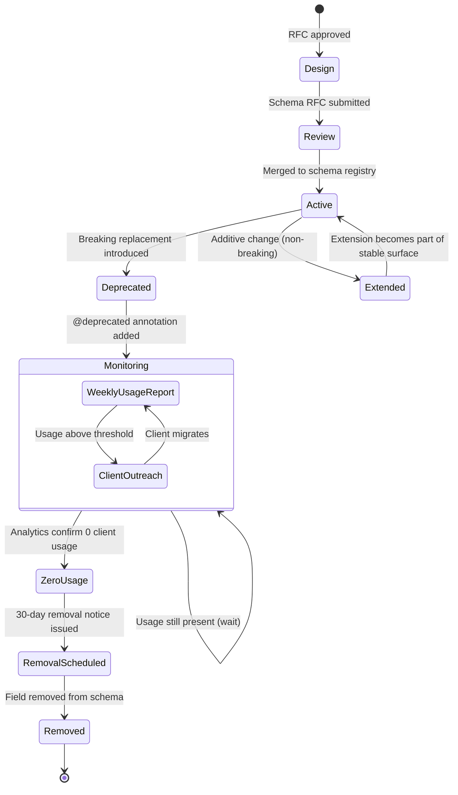
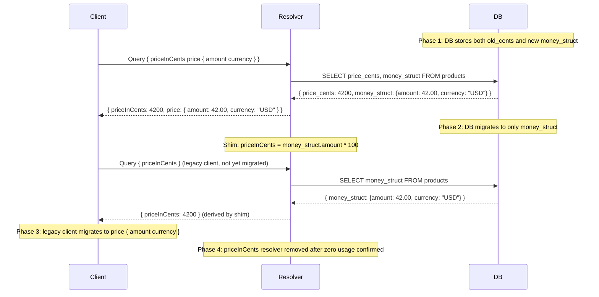

# Schema Evolution at Production Scale

> **Purpose:** Cover production-grade schema evolution strategies — how to change a live GraphQL schema without breaking the clients that depend on it. The basics of deprecation are covered in `docs/01-graphql-fundamentals/05-schema-evolution.md`. This file goes deeper: breaking change classification, multi-team coordination at scale, migration patterns, federation-specific evolution, and the governance processes that make long-lived schemas maintainable.

---

## Learning Objectives

- [ ] Classify schema changes by their backward compatibility impact
- [ ] Apply the additive evolution strategy as the primary change mechanism
- [ ] Implement field substitution, argument addition, and compatibility shims
- [ ] Manage breaking changes through a formal RFC and deprecation process
- [ ] Use `rover subgraph check` to catch breaking changes before they reach production
- [ ] Coordinate federation schema evolution across subgraph teams
- [ ] Track the full field lifecycle from introduction through removal

---

## Overview / Architecture

### Schema Field Lifecycle



The path from `Active` to `Removed` is measured in months, not days. The monitoring phase is where most evolution work happens: identifying which clients are still using deprecated fields and working with those teams to migrate.

---

## Core Concepts

### The Schema as a Long-Lived Contract

A schema in production is fundamentally different from a codebase in development. Code can be refactored at will; the schema cannot. The moment a field is used by a shipped mobile app, that field must remain functional until that version of the app is deprecated — potentially 18–24 months after the schema change.

This is not unique to GraphQL. REST APIs, database schemas, and event contracts share the same constraint. What makes GraphQL distinctive is that the schema is:

1. **Introspectable**: clients can discover the schema programmatically. Generated TypeScript types, SDK clients, and documentation are all derived from it. Schema changes propagate automatically to clients through code generation pipelines.
2. **Singular**: there is typically one schema version in production (versus REST's `/v1/` and `/v2/` URLs). All clients share the same schema.
3. **Granular**: changes are at the field level, not the endpoint level. This makes fine-grained deprecation and usage tracking possible — and necessary.

**The evolution budget:** Every schema has a limited "trust budget" — the tolerance client teams have for schema changes. Each unexpected breaking change, each `null` where the schema promised a value, each deprecation without migration guidance burns that trust. Teams that burn their evolution budget face resistance to schema updates, cross-team friction, and eventually pressure to add REST endpoints as a workaround. Predictability and communication are what preserve the budget.

### Breaking vs. Non-Breaking Changes

Understanding this classification is foundational. A breaking change is one that causes any existing client query, mutation, or subscription to return a different result (including an error where it previously succeeded).

**Non-breaking (additive):**

| Change | Why Safe |
|---|---|
| Add a new field to a type | Clients that don't request it are unaffected |
| Add a new type | Existing queries don't reference it |
| Add a new optional argument | Callers without the argument use the default behavior |
| Add a new enum value | Clients using exhaustive switches may fail — see below |
| Add a new mutation | Clients don't call it until they opt in |
| Add `@deprecated` annotation | Has no effect on query execution |
| Add an `implements` to a type | Adds interface conformance, does not remove fields |

**Breaking changes:**

| Change | Why Dangerous |
|---|---|
| Remove a field | Clients requesting that field get a validation error |
| Rename a field | Same effect as removing the old name |
| Change a field's type | Clients expect the old type — type coercion may fail or produce wrong values |
| Make a nullable field non-null | Clients that use null-checks break; existing data may have nulls |
| Make a non-null field nullable | Generated TypeScript non-null assertions fail |
| Remove an enum value | Clients storing that value or switching on it break |
| Add a required argument | All existing calls without that argument fail validation |
| Change an argument's type | Clients passing the old type get a validation error |
| Remove a type | Clients using that type get a validation error |

**Edge case: adding enum values**

Adding a new enum value to an existing enum is technically non-breaking at the GraphQL execution level — queries that don't reference the new value are unaffected. However, clients using TypeScript `switch` statements that are exhaustive over enum values (via discriminated union exhaustiveness checking) will fail to compile after adding a new value. Document this as a "soft breaking change" and communicate it to client teams.

---

## Real-World Implementation

### Strategy 1: Additive Evolution (Primary Strategy)

The default approach to almost every schema change. Add new fields alongside old ones. Never remove a field until you have confirmed zero usage.

```graphql
type User {
  id: ID!
  # Original fields — stable, in production
  name: String!                          # Original field
  email: String!                         # Original field

  # Evolution: name was too simple; add richer alternatives
  firstName: String                      # New — added in v1.2
  lastName: String                       # New — added in v1.2
  displayName: String!                   # New canonical full-name field

  # Original field deprecated after displayName shipped
  name: String @deprecated(reason: "Use displayName for full name, or firstName/lastName for components. Removing 2026-09-01.")

  # Original single address replaced with multiple addresses
  address: Address @deprecated(reason: "Use addresses(type: PRIMARY). Removing 2026-09-01.")
  addresses(type: AddressType): [Address!]!  # New — supports multiple address types
}
```

### Strategy 2: Field Substitution with Compatibility Shim

When a field's semantics change (not just its name), introduce the new field, mark the old one deprecated, and implement a compatibility shim in the resolver so the old field continues to return correct data from the new backing data.

```graphql
type Product {
  # Old field: flat price as integer cents
  priceInCents: Int @deprecated(reason: "Use price for multi-currency support. Removing 2026-12-01.")

  # New field: rich Money type with currency support
  price: Money!

  # Old field: single category
  category: String @deprecated(reason: "Use categories for multi-category support. Removing 2026-12-01.")

  # New field: multiple categories
  categories: [Category!]!

  # Old field: simple boolean published state
  published: Boolean @deprecated(reason: "Use status for richer publication state. Removing 2026-12-01.")

  # New field: full publication status
  status: ProductStatus!
}
```

**Compatibility shim in resolvers:**

```javascript
const resolvers = {
  Product: {
    // Shim: derive old field from new data
    priceInCents: (product) => {
      // New products store Money object; shim derives cents for old clients
      if (product.price) {
        return Math.round(product.price.amount * 100);
      }
      return product.priceInCents; // Legacy field still in DB during migration
    },

    // Shim: first category for old clients
    category: (product) => {
      if (product.categories && product.categories.length > 0) {
        return product.categories[0].name;
      }
      return product.category; // Legacy field
    },

    // Shim: derive boolean from status for old clients
    published: (product) => {
      if (product.status) {
        return product.status === 'PUBLISHED' || product.status === 'FEATURED';
      }
      return product.published;
    },

    // Canonical new fields
    price: (product) => product.price,
    categories: (product) => product.categories ?? [],
    status: (product) => product.status
  }
};
```

The shim allows old clients to continue working without changes while new clients use the superior field. The database migration (removing the old column) can happen independently of the schema migration.

### Strategy 3: Argument Addition (Backward-Compatible)

Adding optional arguments to an existing field is non-breaking as long as the new argument has a default value that preserves the original behavior.

```graphql
# Original: products returns all products, sorted by createdAt DESC
type Query {
  products: [Product!]!
}

# Evolved: products now supports filtering, pagination, and custom sorting
# The original call `{ products { title } }` still works identically
type Query {
  products(
    filter: ProductFilter         # Optional — default: no filter (all products)
    first: Int = 20               # Optional — default: 20 (reasonable page size)
    after: String                 # Optional — default: start from beginning
    orderBy: ProductOrderByInput  # Optional — default: { field: CREATED_AT, direction: DESC }
  ): ProductConnection!
}
```

**Important:** if you also change the return type from `[Product!]!` to `ProductConnection!`, that IS a breaking change even though the arguments are additive. You must use a new field name in that case:

```graphql
type Query {
  # Original field preserved for backward compatibility
  products: [Product!]! @deprecated(reason: "Use productsConnection for pagination support.")

  # New field with Connection return type
  productsConnection(
    filter: ProductFilter
    first: Int = 20
    after: String
    orderBy: ProductOrderByInput
  ): ProductConnection!
}
```

### Strategy 4: Type Widening via New Field

When you need to change a mutation's return type to a union (e.g., to add error types), create a new mutation field rather than changing the existing one's return type.

```graphql
type Mutation {
  # Original: returns Payment directly (throws on error)
  createPayment(input: CreatePaymentInput!): Payment!
    @deprecated(reason: "Use createPaymentV2 for structured error handling. Removing 2027-01-01.")

  # New: returns result union with explicit error types
  createPaymentV2(input: CreatePaymentInput!): CreatePaymentResult!
}

union CreatePaymentResult =
  | Payment
  | PaymentDeclinedError
  | InsufficientFundsError
  | FraudPreventionError
```

Using a `V2` suffix signals a coordinated migration. Document the expected removal timeline for `V1` in the deprecation reason.

---

### Breaking Change Management at Scale

For a supergraph with 50+ subgraph teams and dozens of client applications, breaking change management requires process, not just tooling.

**Tooling layer: Rover CLI**

```bash
# In every subgraph PR — catches breaking changes before merge
rover subgraph check my-supergraph@production \
  --name products-subgraph \
  --schema ./schema.graphql

# Sample output when a breaking change is detected:
# FAIL  Field `Product.priceInCents` was removed.
#       Clients using this field: web-app (1,240 uses/day), ios-app (320 uses/day)
# WARN  Field `Product.category` has been deprecated.
#       Clients still using this field: android-app (85 uses/day)
```

`rover subgraph check` integrates with Apollo Studio's usage analytics to show not just that a field is being removed, but *which clients are using it and how frequently*. This transforms breaking change detection from a compile-time check into a production-aware gate.

**Process layer: Schema RFC**

1. **RFC Issue**: engineer opens a GitHub issue with the `schema-rfc` label, proposing the schema change and its migration plan
2. **Review period**: 2-week comment period for client teams to signal usage and migration timelines
3. **Deprecation merge**: RFC is approved; `@deprecated` annotation added to old field with removal date
4. **Usage monitoring**: weekly automated report of deprecated field usage per client (generated from Apollo Studio metrics API)
5. **Client migration**: affected clients migrate to the new field during the monitoring period
6. **Removal**: once usage is zero, field is removed in a PR that references the closed RFC issue

**Emergency break protocol:**

For security vulnerabilities or critical bugs requiring an immediate breaking change:
1. Post in `#schema-breaking-changes` Slack channel with `[URGENT]` tag
2. Notify affected client team leads directly
3. Provide a hotfix migration guide with code examples
4. Schedule a 48-hour migration window with engineering support available
5. Coordinate deployment timing to minimize production impact

---

### Deprecated Field Usage Monitoring

Apollo Studio's field-usage metrics drive the deprecation process.

```bash
# Fetch field usage metrics via Apollo Studio API
curl -X POST https://graphql.api.apollographql.com/api/graphql \
  -H "x-api-key: $APOLLO_KEY" \
  -H "Content-Type: application/json" \
  -d '{
    "query": "query FieldUsage($graphId: ID!, $from: Timestamp!, $to: Timestamp!) {
      service(id: $graphId) {
        stats(from: $from, to: $to) {
          fieldUsage {
            field { name parentType { name } }
            metrics { requestsWithErrorsCount requestsWithoutErrorsCount }
          }
        }
      }
    }",
    "variables": {
      "graphId": "my-supergraph",
      "from": "-604800",
      "to": "-0"
    }
  }'
```

Automate a weekly report:

```javascript
// Weekly deprecated field report (runs as a cron job)
async function generateDeprecationReport(graphId, apolloKey) {
  const deprecatedFields = await fetchDeprecatedFields(graphId);
  const usageMetrics = await fetchFieldUsage(graphId, apolloKey, { days: 7 });

  const report = deprecatedFields.map(field => {
    const usage = usageMetrics.find(m =>
      m.field.name === field.name &&
      m.field.parentType.name === field.parentType
    );

    return {
      field: `${field.parentType}.${field.name}`,
      deprecatedAt: field.deprecatedAt,
      removalDate: field.removalDate,
      weeklyRequests: usage?.metrics.requestsWithoutErrorsCount ?? 0,
      clientsUsing: usage?.clients ?? [],
      status: (usage?.metrics.requestsWithoutErrorsCount ?? 0) === 0 ? 'READY_TO_REMOVE' : 'IN_USE'
    };
  });

  // Post to Slack, email to team leads, etc.
  await postDeprecationReport(report);
}
```

---

### Schema Migration Patterns

**Dual-write pattern:**

During a migration from `priceInCents` to `price: Money!`, both fields are populated by resolvers. The database is migrated to store the new `Money` struct. The old field's resolver reads from the new struct. The new field's resolver reads from the new struct directly.



**Compatibility shim timeline:**

```
Week 0:   New field `price: Money!` added. Old `priceInCents` marked @deprecated.
Week 1–4: Client teams notified. Migration guide published.
Week 5–8: Client teams migrate to `price`. Usage of `priceInCents` monitored weekly.
Week 9:   Usage of `priceInCents` reaches zero across all clients.
Week 10:  30-day removal notice posted in #schema-breaking-changes.
Week 14:  `priceInCents` field and shim resolver removed from schema.
Week 14:  `priceInCents` column removed from database (separate PR).
```

---

### Federation Schema Evolution

Federation introduces additional complexity: multiple subgraph teams must coordinate when a shared entity changes.

**Moving a field between subgraphs — the `@override` directive:**

If the `User.loyaltyPoints` field is being moved from the `users-subgraph` to the `loyalty-subgraph`:

```graphql
# Step 1: In loyalty-subgraph, add the field with @override
extend type User @key(fields: "id") {
  id: ID! @external
  loyaltyPoints: Int! @override(from: "users-subgraph")
}

# Step 2: Deploy loyalty-subgraph. Router now uses loyalty-subgraph for this field.
# Step 3: Remove loyaltyPoints from users-subgraph schema.
# Step 4: Remove @override from loyalty-subgraph (now it owns the field without override).
```

The `@override` directive allows a zero-downtime migration where ownership of a field transfers between subgraphs. During the transition window, both subgraphs respond to the router's field resolution, with the `@override` declaring which takes precedence.

**Changing a shared entity key:**

Entity keys (`@key` fields) are the most dangerous to change because they affect all subgraphs that reference the entity. A `User` keyed on `id` is referenced by every subgraph that returns `User` data.

If you must change a `@key` field (e.g., from `id: Int!` to `id: ID!`):

```graphql
# Phase 1: Support both key types simultaneously
# In users-subgraph
type User @key(fields: "id") @key(fields: "legacyId") {
  id: ID!
  legacyId: Int  # Backward-compatible bridge field
  name: String!
}

# Phase 2: All referencing subgraphs migrate to new key type
# Phase 3: Remove legacyId key and field after all subgraphs have migrated
```

Coordinate with all subgraph teams before initiating this migration. It is the highest-risk schema change in federation.

---

## Production Considerations

### Performance

- **Shim resolvers add computation cost**: compatibility shims in resolvers perform type conversions on every request. If a deprecated field still receives millions of daily requests, the shim's computational overhead is real. Monitor resolver execution time for deprecated fields via tracing.
- **Schema registry build time with deprecated fields**: Apollo Studio schema checks include analysis of deprecated field usage, which queries usage analytics. Large schemas with hundreds of deprecated fields slow down `rover subgraph check`. Clean up zero-usage deprecated fields promptly.
- **DataLoader invalidation on type changes**: if an entity's type changes (e.g., `id` changing from `Int` to `ID`), DataLoader cache keys must be updated. Mismatched cache keys cause cache misses until the deployment stabilizes.

### Security

- **Deprecated fields remain attack surface**: a field marked `@deprecated` is still executable. Do not deprecate a field because it has security issues — remove it (with proper notice). Deprecated fields continue to accept and process all inputs.
- **Schema RFC process prevents surprise breaking changes**: unauthorized breaking changes (removed fields, changed types) that slip through CI checks are the primary source of production security and reliability incidents. The RFC process creates an audit trail and review gate.
- **Shim resolvers may bypass new authorization logic**: when the new field has stricter authorization than the deprecated field, the shim must apply the same authorization. A deprecated field that routes to a new resolver without applying the new field's auth rules creates an authorization bypass.

### Scaling

- **Usage reporting infrastructure must scale with schema size**: the weekly deprecated field usage report queries Apollo Studio's metrics API. With 500+ deprecated fields in a large schema, this becomes a significant API call volume. Batch and cache usage metrics.
- **`@override` during migration doubles subgraph traffic**: while `@override` is active, both the source and destination subgraphs may receive traffic for the overridden field. Capacity plan both subgraphs for increased load during migration windows.

### Observability

- **Rover check as the breaking change canary**: configure `rover subgraph check` to fail CI on any breaking change, warning on deprecation violations. The CI gate is the first line of defense.
- **Apollo Studio deprecated field dashboard**: create a custom Apollo Studio graph variant that filters metrics to deprecated fields only. Share this dashboard in weekly engineering stand-ups to keep migration momentum visible.
- **Removal PR checklist**: before the field removal PR is merged, verify via Apollo Studio that the field has had zero executions for at least 7 consecutive days. Screenshot the usage graph and include it in the PR description as evidence.

---

## Best Practices

1. **Treat schema changes like database migrations.** Both are long-lived contracts with data that outlasts any individual engineer's tenure. Use the same care and process for both: an RFC for breaking changes, a review period, staged rollout, and a verified rollback plan.

2. **Set concrete removal dates in `@deprecated` reasons.** A deprecation without a removal date is not a deprecation — it is an eternal legacy field. The reason string `"Use displayName. Removing 2026-09-01."` creates accountability and gives client teams a deadline to plan against.

3. **Never remove a field without zero-usage confirmation from analytics.** Apollo Studio usage analytics are the authoritative source. If the analytics show any usage — even one request per day — delay removal until usage is zero. A low-traffic client (a batch job, an analytics pipeline, a rarely-opened admin tool) is just as broken as a high-traffic one.

4. **Version mutation fields, not mutation inputs.** If a mutation's semantics change fundamentally, create `createOrderV2` rather than changing `createOrder`. Input types can evolve additively; the mutation field name provides the versioned entry point that old clients continue to use.

5. **Run `rover subgraph check` in PR CI, not just in deploy pipelines.** Catching a breaking change in a PR takes minutes to fix. Catching it after a deploy to production takes hours of coordination, a revert, and incident postmortems.

---

## Anti-Patterns

### Anti-Pattern 1: Silent Field Removal

**Symptom:** A field is removed from the schema without a deprecation period, with the justification "nobody is using it."

**Failure mode:** The engineer checked web app usage but not mobile app, not the batch analytics pipeline, not the third-party integration. One of those clients breaks in production. Trust in the schema contract is damaged.

**Fix:** Always mark deprecated before removing. Always confirm zero usage via Apollo Studio analytics. The `rover subgraph check` breaking change gate in CI should block any removal that has non-zero usage.

---

### Anti-Pattern 2: Changing Nullability Without a Migration

**Symptom:** A field changes from `User.profile: UserProfile` (nullable) to `User.profile: UserProfile!` (non-null). This appears safe — the field now "always exists."

**Failure mode:** Making a nullable field non-null IS a breaking change. Existing clients with TypeScript generated types have `profile?: UserProfile` (optional). Generated code that calls `user.profile?.name` is now technically wrong (the `?.` is unnecessary) but won't break. More critically: if any historical data has `profile: null`, those queries will start failing with null-propagation errors.

**Fix:** Nullability changes require a full migration with analytics verification. Make non-null → nullable freely (safe). Make nullable → non-null only after verifying all data and resolvers guarantee non-null.

---

### Anti-Pattern 3: Using `@deprecated` as a Security Fix

**Symptom:** A field has a security vulnerability (e.g., it returns data that should be private). The team adds `@deprecated(reason: "Security: use secureName instead")` and considers it fixed.

**Failure mode:** `@deprecated` is cosmetic. The field continues to execute and return data. Attackers and automated tools do not respect `@deprecated`.

**Fix:** Security-motivated field removals must be treated as emergency breaking changes with an accelerated (48-hour) migration window. The field must be removed, not deprecated.

---

### Anti-Pattern 4: RFC-Free Schema Evolution

**Symptom:** Engineers add, change, and deprecate fields without any review process. Schema changes are treated as implementation details rather than API contract changes.

**Failure mode:** Breaking changes reach production because no one reviewed them from the client perspective. Client teams are surprised by deprecations they discover from generated type errors, not from planned communication. Distrust in the schema compounds across quarters.

**Fix:** Require an RFC issue for any non-additive change. Additive changes (new fields, new types) can skip the RFC but should be communicated in a schema changelog. Breaking changes always require RFC approval.

---

## Operational Notes

- **Schema changelog**: maintain a `CHANGELOG.md` in your schema repository documenting every deprecation, removal, and breaking change with dates and migration guides. This is the primary reference for client engineers investigating why a field is no longer available.
- **Deprecation report automation**: automate weekly Slack posts to `#schema-changes` showing: (1) fields deprecated this week, (2) deprecated fields by usage volume descending, (3) fields at zero usage ready for removal.
- **Rover in CI template**: provide a reusable GitHub Actions workflow template that all subgraph repositories inherit. Centralizing the `rover subgraph check` configuration ensures all teams use the same breaking change gate without maintaining it independently.
- **Subgraph check across environments**: run `rover subgraph check` against both `staging` and `production` graph variants. A change that passes staging checks may still break production if the schemas diverged (e.g., a subgraph was already updated in production but the staging schema lags).

---

## References

- [Apollo Schema Evolution Guide](https://www.apollographql.com/docs/federation/schema-design/schema-evolution/)
- [Rover Subgraph Check Documentation](https://www.apollographql.com/docs/rover/commands/subgraphs/#subgraph-check)
- [Apollo Studio Field Usage Analytics](https://www.apollographql.com/docs/studio/metrics/field-usage/)
- [GraphQL @deprecated Directive](https://spec.graphql.org/October2021/#sec--deprecated)
- [Apollo @override Directive](https://www.apollographql.com/docs/federation/federated-types/federated-directives/#override)
- [Principled GraphQL — Agile Principles](https://principledgraphql.com/agility)
- [Production Ready GraphQL — Versioning](https://book.productionreadygraphql.com/)

---

## Related Topics

- [`01-design-principles.md`](./01-design-principles.md) — The design decisions that create evolution burden (or reduce it)
- [`../09-schema-governance/`](../09-schema-governance/) — RFC processes, approval workflows, schema change governance
- [`../10-schema-validation/`](../10-schema-validation/) — Automated validation: Rover, graphql-eslint, CI integration
- [`../07-federation/`](../07-federation/) — Subgraph evolution and @override mechanics
- [`../11-ci-cd-automation/`](../11-ci-cd-automation/) — CI/CD pipelines that enforce breaking change gates
