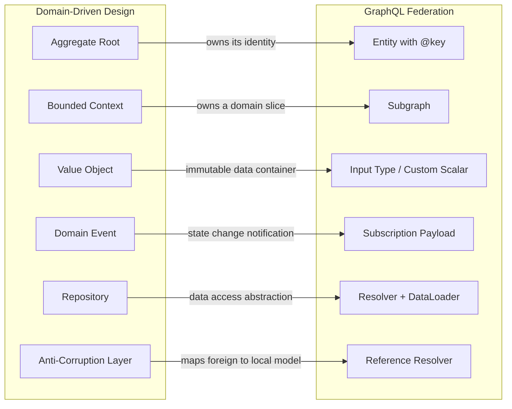
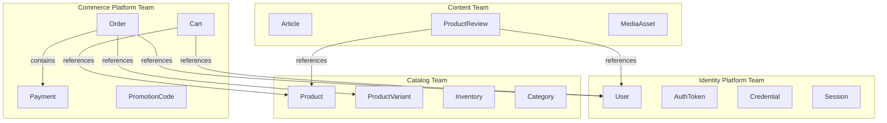
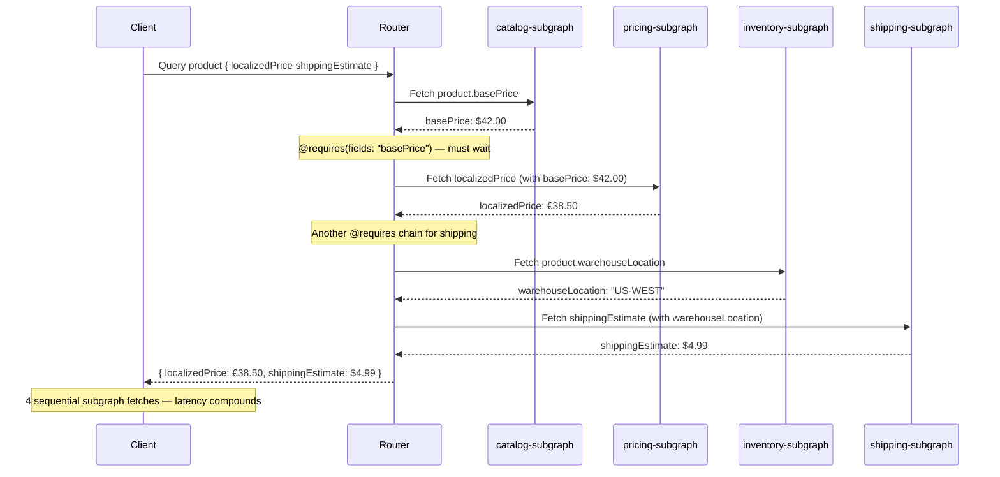

# Domain-Driven Schema Design and Federation

> **Purpose:** Apply Domain-Driven Design (DDD) concepts to GraphQL federation — mapping bounded contexts to subgraphs, aggregates to entities, and value objects to scalar and input types. This file provides the architectural framework for deciding which types live in which subgraphs, how entities cross domain boundaries, and how to avoid the distributed monolith failure mode where federation creates coupling rather than independence.

---

## Learning Objectives

- [ ] Map DDD concepts (aggregate root, bounded context, value object) to their GraphQL/federation equivalents
- [ ] Identify correct domain boundaries using ownership, change frequency, and data locality criteria
- [ ] Implement the entity cross-reference pattern for types shared across subgraph boundaries
- [ ] Distinguish owned types, value types, and shareable types in federation schema design
- [ ] Detect and mitigate the distributed monolith anti-pattern using query plan analysis
- [ ] Apply federation-specific production considerations: @requires chains, subgraph authorization, and trace analysis

---

## Overview / Architecture

### DDD Concepts Mapped to GraphQL Federation



The alignment is not perfect — GraphQL schema design does not require a strict DDD methodology — but the conceptual mapping provides a principled framework for the hardest question in federation: where does each type belong?

---

## Core Concepts

### Why Domain Modeling Matters in Federation

In a monolithic GraphQL server, all types live in one schema. There is no question of "which subgraph owns this type." In federation, ownership is explicit and consequential: the subgraph that owns a type is responsible for:

- **Resolving** the type's fields when queried
- **Maintaining** the type's stability over time (backward compatibility)
- **Authorizing** access to the type's data
- **Scaling** the subgraph to handle the type's query load
- **Deprecating** fields following the evolution process

Poor domain modeling creates subgraphs that own the wrong types, leading to:
- A single change requiring updates to 4 subgraphs simultaneously
- Query plans with 8+ sequential subgraph fetches for a single client query
- Subgraph teams needing "permission" from other teams to add a field to their own type
- One subgraph becoming a bottleneck because it owns too many unrelated types

Good domain modeling creates subgraphs where each team owns exactly the types they are responsible for, can change those types without coordinating with others (for additive changes), and can scale independently.

---

## Real-World Implementation

### Aggregates in GraphQL Federation

An aggregate root in DDD owns a cluster of related objects. In federation, the aggregate root is the entity with `@key`. Entities that belong inside the aggregate are part of the owning subgraph; entities that are separate aggregates are in separate subgraphs.

**Order aggregate — owned entirely by the Orders subgraph:**

```graphql
# In orders-subgraph

# Order is the aggregate root — it owns its identity
type Order @key(fields: "id") {
  id: ID!
  status: OrderStatus!
  total: Money!
  subtotal: Money!
  taxAmount: Money!
  shippingCost: Money!
  discount: Money

  # LineItems are part of the Order aggregate — they live in this subgraph
  lineItems: [LineItem!]!

  # These are references to other aggregates (separate subgraphs)
  customer: User!         # Owned by users-subgraph
  shippingAddress: Address!  # Value type, shareable
  billingAddress: Address!

  placedAt: DateTime!
  updatedAt: DateTime!
  estimatedDelivery: DateTime
  trackingInfo: TrackingInfo   # Could be owned here or in a shipping subgraph

  # Payment is a separate aggregate (distinct lifecycle, separate team ownership)
  payment: Payment         # Owned by payments-subgraph
}

# LineItem is ONLY accessible through Order — never standalone
# It does NOT have @key because it is not an aggregate root
type LineItem {
  id: ID!
  product: Product!       # Reference to products-subgraph aggregate
  quantity: Int!
  unitPrice: Money!
  totalPrice: Money!
  discount: Money
  # No @key — LineItem cannot be fetched independently
}

enum OrderStatus {
  PENDING
  CONFIRMED
  PROCESSING
  READY_FOR_PICKUP
  SHIPPED
  DELIVERED
  RETURN_REQUESTED
  RETURNED
  CANCELLED
  REFUNDED
}
```

`LineItem` has no `@key` because it is not an aggregate root. You cannot fetch a LineItem independently — you always go through its parent Order. This is intentional: it enforces the aggregate boundary.

**Payment as a separate aggregate:**

```graphql
# In payments-subgraph

type Payment @key(fields: "id") {
  id: ID!
  amount: Money!
  currency: String!
  status: PaymentStatus!
  method: PaymentMethod!
  processedAt: DateTime
  failureReason: String

  # Minimal reference back to Order — payments-subgraph does not own Order
  orderId: ID!   # FK only — we don't @extend Order here
}

enum PaymentStatus {
  PENDING
  PROCESSING
  COMPLETED
  FAILED
  REFUNDED
  PARTIALLY_REFUNDED
}
```

The `payments-subgraph` stores `orderId` as a plain ID field rather than resolving the full `Order` type. This is appropriate: payment processing does not need to know the full order structure. Resolving `Order` from within the payments subgraph would create a dependency in the opposite direction.

---

### Identifying Domain Boundaries

The hardest decision in federation schema design is not how to model individual types — it is how to group types into subgraphs. Four criteria drive this decision:

**Criterion 1: Team ownership**

The most reliable predictor of a correct domain boundary is the team that maintains the underlying data. If the "Identity Platform team" owns user accounts, credentials, and authentication — those types belong in the identity subgraph, regardless of what other teams need from them.

Conway's Law observes that systems naturally mirror the communication structure of the organizations that produce them. In federation, embrace this: the org chart is the domain map.



Each box represents one subgraph. The arrows represent entity cross-references — references that cross subgraph boundaries.

**Criterion 2: Change frequency**

Types that change together should live in the same subgraph. If `Product` and `Inventory` always change together — the catalog team adds a field to `Product` and simultaneously needs a corresponding change in `Inventory` — they belong in the same subgraph. Frequent cross-subgraph coordination signals a misdrawn boundary.

**Criterion 3: Data locality**

Types served by the same underlying database or service should generally be in the same subgraph. A subgraph that must call Service A for some fields and Service B for others is introducing network hops in its own resolver layer. Co-locate types with their data sources.

**Criterion 4: SLA independence**

If `Product` has a 99.99% SLA requirement but `ProductReview` only requires 99.9%, they should be in separate subgraphs. The higher-SLA service can be deployed, scaled, and operated independently. Co-locating them forces the higher-SLA service to inherit the operational overhead of the lower-SLA service.

---

### Entity Cross-References in Federation

Entities cross subgraph boundaries through two mechanisms: **entity references** (for aggregate roots with `@key`) and **field extensions** (for adding fields to another subgraph's entity).

**Entity reference — Orders subgraph references Users subgraph's User:**

```graphql
# In users-subgraph — defines the User entity
type User @key(fields: "id") {
  id: ID!
  name: String!
  email: String!
  createdAt: DateTime!
  profile: UserProfile
}

# In orders-subgraph — references User without owning it
type Order @key(fields: "id") {
  id: ID!
  # This field resolves via the federation reference resolver
  # The orders-subgraph stores customer_id; the router fetches User from users-subgraph
  customer: User!
  lineItems: [LineItem!]!
  total: Money!
}

# The orders-subgraph's reference resolver for User:
# This is how the router knows how to "fill in" User data for Orders
# In the schema, this is expressed as a stub:
extend type User @key(fields: "id") {
  id: ID! @external
  # No additional fields — orders-subgraph just needs to reference User
}
```

In the resolver:

```javascript
// orders-subgraph resolvers
const resolvers = {
  Order: {
    customer: async (order, _, context) => {
      // Return a stub object with the key — the router fetches full User from users-subgraph
      return { __typename: 'User', id: order.customerId };
    }
  },

  // Reference resolver — allows the router to resolve User stubs
  User: {
    __resolveReference: async ({ id }, context) => {
      // For the orders-subgraph, we don't need to fetch User data
      // The router handles this by calling users-subgraph directly
      return { id };
    }
  }
};
```

**Field extension — Orders subgraph extends User with order history:**

The extension pattern allows a subgraph to add domain-specific fields to another subgraph's entity without the owning subgraph knowing about it. This is the federation equivalent of an "open" bounded context.

```graphql
# In users-subgraph — the canonical User definition
type User @key(fields: "id") {
  id: ID!
  name: String!
  email: String!
  # No mention of orders here — users-subgraph does not know about orders
}

# In orders-subgraph — adds order-related fields to User
extend type User @key(fields: "id") {
  id: ID! @external   # This field comes from users-subgraph, not orders-subgraph

  # These fields are owned and resolved by orders-subgraph
  orders(
    first: Int
    after: String
    filter: OrderFilter
  ): OrderConnection!

  orderHistory: [Order!]!
  totalOrderCount: Int!
  totalSpent: Money!
  averageOrderValue: Money
  lastOrderAt: DateTime
}
```

When a client queries:

```graphql
query {
  user(id: "VXNlcjoxMjM=") {
    name                    # Resolved by users-subgraph
    email                   # Resolved by users-subgraph
    orders(first: 5) {      # Resolved by orders-subgraph (extension)
      edges {
        node { id status total { formatted } }
      }
    }
  }
}
```

The router's query plan:
1. Fetch `name` and `email` from users-subgraph
2. Fetch `orders` from orders-subgraph using the `User.id` as the key

This requires two subgraph fetches, but they can run in sequence (orders requires the user ID) or partially in parallel depending on what other fields are requested.

---

### Shared vs. Owned vs. Shareable Types

**Owned types:** The subgraph that defines the `@key` owns the type. No other subgraph can define fields on this type without using `extend type`. Ownership is exclusive.

```graphql
# users-subgraph owns User — other subgraphs extend it, they don't redefine it
type User @key(fields: "id") {
  id: ID!
  name: String!
}
```

**Value types:** Pure data containers with no `@key`. The same type definition can appear identically in multiple subgraphs without federation coordination. The router requires that all subgraph definitions of a value type be identical (same fields, same types).

```graphql
# This exact definition should appear in every subgraph that needs it
type Address {
  street1: String!
  street2: String
  city: String!
  state: String!
  zipCode: String!
  country: String!
}
```

Value types are appropriate for small, stable data structures that are used across many domains: `Money`, `Address`, `GeoCoordinates`, `DateRange`, `PageInfo`.

**Shareable types:** The `@shareable` directive marks a type (or specific field) as deliberately owned by multiple subgraphs. Both subgraphs resolve the same fields, and the router may call either.

```graphql
# Multiple subgraphs can own and resolve Money fields
type Money @shareable {
  amount: Float!
  currency: String!    # ISO 4217
  formatted: String!   # Locale-formatted string
}
```

Use `@shareable` sparingly. It is appropriate for utility types like `Money` and `PageInfo` that have stable, simple implementations. Avoid it for complex business types — the owning team is responsible for consistency and you want a single source of truth.

---

### The @requires Directive and Data Dependency Chains

The `@requires` directive marks fields in a subgraph that depend on fields from another subgraph being resolved first. It creates sequential fetch chains in the query plan.

```graphql
# In pricing-subgraph
extend type Product @key(fields: "id") {
  id: ID! @external
  basePrice: Money! @external   # Comes from catalog-subgraph

  # @requires tells the router: fetch basePrice from catalog-subgraph first,
  # then call pricing-subgraph with it to compute localizedPrice
  localizedPrice(currency: String!): Money! @requires(fields: "basePrice")
  discountedPrice: Money! @requires(fields: "basePrice")
}
```

**The `@requires` chain problem:**



Each `@requires` chain adds a sequential fetch. Four fetches with 20ms each = 80ms just in subgraph round-trips. With database queries inside each fetch, this balloons quickly.

**Mitigation strategies:**

1. **Collapse tightly coupled subgraphs**: if `pricing-subgraph` always requires fields from `catalog-subgraph`, consider whether they belong in the same subgraph.
2. **Compute derived fields in the owning subgraph**: instead of `@requires(fields: "basePrice")` in pricing-subgraph, have catalog-subgraph compute `localizedPrice` directly by calling the pricing service internally.
3. **Use `@provides` to cache required fields**: `@provides` tells the router that a subgraph can supply a field's value so the router doesn't need another fetch.

```graphql
# catalog-subgraph can provide pricingData for products it returns
type Query {
  products: [Product!]! @provides(fields: "pricingData { amount currency }")
}
```

---

### Avoiding the Distributed Monolith

The distributed monolith is the failure mode where federation creates tight coupling across subgraphs, eliminating the independence advantage of federation.

**Warning signs:**

| Symptom | Root Cause |
|---|---|
| Every subgraph change requires coordination with 3+ other teams | Types are spread across wrong subgraphs; ownership is unclear |
| Query plans consistently have 8+ fetch steps for simple queries | Excessive `@requires` chains; domain boundaries drawn too fine |
| A change in `product-subgraph` breaks `orders-subgraph` | Shared types are not properly encapsulated; `@external` fields changed |
| Teams complain they need "permission" to add fields to their own data | Fields were placed in the wrong subgraph at design time |
| All subgraphs depend on a single "common" or "shared" subgraph | A catch-all subgraph was created instead of proper domain modeling |

**Diagnosing with query plan analysis:**

Apollo Studio's operation trace view shows the actual query plan execution tree. For each high-traffic operation, review:
- Number of subgraph fetches (alert if > 5 for a common query)
- Sequential vs. parallel fetch steps (sequential steps = latency compounders)
- Which subgraph is the most common dependency (potential bottleneck)

```bash
# Use Rover to analyze a query plan locally
rover graph fetch my-supergraph@production > supergraph-schema.graphql

# Then use Apollo's @apollo/rover or apollo-studio-explorer to examine query plans
# In Apollo Studio: Operations > select operation > Trace tab > expand subgraph plan
```

**The "fat subgraph" vs. "many micro-subgraphs" tradeoff:**

There is no perfect granularity for subgraphs. The correct boundary is the one that minimizes cross-subgraph coordination for the most common schema changes. As a rule of thumb:

- A subgraph should be independently deployable without coordination with other subgraphs for > 80% of its changes
- A subgraph should serve fewer than ~50 types (beyond this, a team's cognitive load for that subgraph becomes too high)
- A subgraph should correspond to a single team or a clearly delineated ownership group

---

## Production Considerations

### Performance

- **Deep `@requires` chains create sequential latency**: each `@requires` link adds one round-trip to the query plan. Profile your most common operations in Apollo Studio. Any operation with 5+ sequential fetch steps needs domain boundary review.
- **Reference resolver performance is critical**: the `__resolveReference` resolver is called by the router for every entity that crosses a subgraph boundary. These must use DataLoader batching. A `__resolveReference` that issues individual database queries per entity is an N+1 problem at the federation layer.

```javascript
// MUST use DataLoader for __resolveReference
const resolvers = {
  User: {
    __resolveReference: async ({ id }, { loaders }) => {
      return loaders.user.load(id);  // Batched — never db.user.findUnique per call
    }
  }
};
```

- **Value type validation at composition time**: Apollo's composition step validates that value types are identical across all subgraphs. If a `Money` type has slightly different fields in two subgraphs, composition fails. Maintain value types in a shared SDL file (via `@graphql-tools/merge`) imported by all subgraphs.

### Security

- **Reference resolvers must independently authorize access**: when the router calls a subgraph's `__resolveReference` to resolve a `User` entity for an orders query, that subgraph must validate that the requesting user has permission to access that entity. The authorization that happened in the users-subgraph does not carry over automatically.

```javascript
const resolvers = {
  User: {
    __resolveReference: async ({ id }, context) => {
      // Authorize: can the current user access this User entity?
      if (context.currentUser.id !== id && !context.currentUser.hasRole('ADMIN')) {
        throw new ForbiddenError('Cannot access another user\'s data');
      }
      return context.loaders.user.load(id);
    }
  }
};
```

- **Entity extension fields inherit the owning subgraph's security model**: when `orders-subgraph` adds `User.orders` via extension, the `orders` field resolver must enforce that only the user themselves (or an admin) can access their order history. The `users-subgraph` does not know about or authorize this field.

### Scaling

- **Subgraphs with different traffic patterns scale independently**: the catalog subgraph (read-heavy, cacheable, high-traffic) and the orders subgraph (write-heavy, personalized, moderate traffic) can scale to different instance counts with different infrastructure. This is the primary operational advantage of federation.
- **Entity cache in the router**: Apollo Router supports entity caching (`@cacheControl` directive) at the subgraph level. Frequently-referenced entities like `Product` or `Category` can be cached in the router layer, reducing subgraph fetch frequency.
- **Subgraph health isolation**: in a federated query plan, one subgraph timing out or returning errors affects only the fields it owns. Other subgraphs' fields are unaffected. Design subgraph availability budgets to reflect which subgraphs serve critical path vs. enrichment fields.

### Observability

- **Trace spans per subgraph** are the primary diagnostic tool for cross-subgraph latency. Apollo Studio's operation traces show each subgraph fetch as a distinct span. High latency in one subgraph's span immediately identifies the bottleneck.
- **Subgraph error rate per entity type**: alert when `__resolveReference` error rate exceeds 0.1% for a given entity type. These errors indicate either a subgraph availability issue or a domain boundary mismatch (the router is requesting references that the subgraph cannot resolve).
- **Query plan complexity metric**: log the number of fetch steps in each query plan execution. Trend increases indicate schema drift (new `@requires` chains added) without performance review.

---

## Best Practices

1. **Draw domain boundaries before writing SDL.** Spend 1–2 hours with a whiteboard and representatives from each team before any schema is written. Map teams to entities. If a team is responsible for a piece of data, they own its subgraph type. Retrospectively re-homing types across subgraphs is a complex, coordinated migration.

2. **Keep `@requires` chains to a maximum of one hop.** A `@requires` chain with two or more hops (A requires B, B requires C) creates fragility and latency that is hard to diagnose. If you need data from two different subgraphs to compute a field, co-locate either the computation or the data.

3. **Implement `__resolveReference` with DataLoader on day one.** The reference resolver is called by the router for every cross-subgraph entity reference. Without DataLoader batching, it is an N+1 query source that only manifests under realistic query patterns. Write it correctly from the start.

4. **Treat value types as shared infrastructure, not per-team customization.** `Money`, `Address`, `PageInfo`, and similar value types are used across all subgraphs. Maintain canonical versions in a shared schema library. When a team modifies a value type locally, composition breaks for everyone — the shared library prevents this.

5. **Review query plans for high-traffic operations quarterly.** As schemas evolve, `@requires` chains accumulate and domain boundaries drift. Quarterly query plan reviews using Apollo Studio trace analysis identify performance degradation before clients notice it.

---

## Anti-Patterns

### Anti-Pattern 1: The "Common" or "Shared" Subgraph

**Symptom:** A subgraph named `common-subgraph`, `shared-subgraph`, or `platform-subgraph` that owns types used by many other subgraphs — `User`, `Product`, `Address`, and more, all in one place.

**Failure mode:** Every subgraph team depends on the common subgraph. Its deployment window affects all other subgraphs. Its team becomes a bottleneck for any cross-cutting schema change. Its availability SLA becomes the floor for the entire supergraph.

**Fix:** Each domain type is owned by the team responsible for it. `User` belongs in identity-subgraph, `Product` in catalog-subgraph. Use federation's entity reference mechanism for cross-domain access.

---

### Anti-Pattern 2: Over-Granular Micro-Subgraphs

**Symptom:** A `user-name-subgraph`, a `user-email-subgraph`, and a `user-phone-subgraph`, each owning a different slice of the same entity's fields.

**Failure mode:** Every `User` query requires multiple subgraph fetches to assemble the full entity. Query plan complexity is maximal. Each team's schema surface is tiny, creating extreme overhead per schema change. The operational complexity (three deployments to change a user's display logic) outweighs any independence benefit.

**Fix:** Co-locate all fields of a single entity in one subgraph unless there is a specific, measurable reason for separation (dramatically different SLA requirements, different teams with clear ownership, different data sources with no possibility of co-location).

---

### Anti-Pattern 3: Circular @requires Dependencies

**Symptom:** `orders-subgraph` has `@requires(fields: "...")` on a field from `products-subgraph`, and `products-subgraph` has `@requires(fields: "...")` on a field from `orders-subgraph`.

**Failure mode:** Circular `@requires` is not valid in federation — Apollo composition will reject it. Attempting it indicates a fundamental domain modeling error: neither subgraph should require data from the other to fulfill its own fields.

**Fix:** The data dependency chain must be acyclic. Identify which computation actually belongs in which domain, or move the computation to a dedicated aggregation subgraph that depends on both (unidirectionally).

---

### Anti-Pattern 4: Placing Authorization in Entity Keys

**Symptom:** `@key(fields: "id userId")` — including a `userId` in the entity key to enforce that entity access is scoped to a user.

**Failure mode:** The `@key` is a technical identity mechanism, not an authorization mechanism. Including authorization context in the key causes key comparison failures when the same entity is accessed from different user contexts, breaks cache normalization, and creates unexpected behavior in the router's entity resolution.

**Fix:** Authorization belongs in `__resolveReference` and field resolvers, not in entity keys. Keep keys minimal: the smallest set of fields that uniquely identifies the entity (usually just `id: ID!`).

---

## Operational Notes

- **Subgraph ownership registry**: maintain a `SUBGRAPH_OWNERS.md` at the supergraph root that maps each subgraph to its owning team, Slack channel, and on-call rotation. When a subgraph has an incident, this registry is the first place responders look.
- **Domain boundary reviews at team scaling events**: when a team splits, a new team is formed, or a team absorbs another team's responsibilities, schedule a domain boundary review. Team structure changes are the primary driver of subgraph refactoring.
- **Apollo composition CI**: run `rover supergraph compose` in CI on every subgraph PR to verify composition succeeds. A subgraph change that breaks composition is effectively a breaking change for the entire supergraph.
- **Subgraph schema RFC for entity key changes**: any change to an entity's `@key` fields requires a supergraph-level RFC (not just a subgraph-level RFC) because it affects every subgraph that references the entity. These are the highest-coordination schema changes in federation.

---

## References

- [Apollo Federation Documentation](https://www.apollographql.com/docs/federation/)
- [Federation Entity Reference Resolvers](https://www.apollographql.com/docs/federation/entities/)
- [Apollo @requires Directive](https://www.apollographql.com/docs/federation/federated-types/federated-directives/#requires)
- [Apollo @override Directive](https://www.apollographql.com/docs/federation/federated-types/federated-directives/#override)
- [Domain-Driven Design Reference — Eric Evans](https://www.domainlanguage.com/ddd/reference/)
- [Building Microservices — Sam Newman](https://samnewman.io/books/building_microservices_2nd_edition/) — Chapter 4: Modeling Services
- [Conway's Law and Architecture](https://martinfowler.com/bliki/ConwaysLaw.html) — Martin Fowler
- [Principled GraphQL — Integrity Principles](https://principledgraphql.com/integrity)
- [GraphQL Federation Design Patterns](https://www.apollographql.com/docs/federation/schema-design/)

---

## Related Topics

- [`01-design-principles.md`](./01-design-principles.md) — Consumer-first design applied to individual types
- [`02-schema-patterns.md`](./02-schema-patterns.md) — Node, Connection, and Viewer patterns across subgraph boundaries
- [`03-schema-evolution.md`](./03-schema-evolution.md) — Evolving federated schemas with `@override`
- [`../07-federation/`](../07-federation/) — Deep dive into federation mechanics: composition, query planning, entity resolution
- [`../08-supergraph-architecture/`](../08-supergraph-architecture/) — Router configuration and supergraph operational patterns
- [`../09-schema-governance/`](../09-schema-governance/) — Governance for multi-team schema ownership
