# Schema Design

> **Purpose:** This folder establishes principled GraphQL schema design from first principles through domain modeling. Schema design is the most consequential architectural decision in any GraphQL deployment — poor choices made at schema inception compound for years across every client team, subgraph team, and API consumer. This folder equips engineers to make those decisions deliberately.

---

## Why Schema Design Is Architecture

The GraphQL schema is not a technical detail. It is a **public API contract** published to every client — web, mobile, backend-for-frontend, third-party integrator, and internal service alike. Once clients depend on your schema, every field becomes load-bearing infrastructure.

This stands in stark contrast to REST APIs or internal service interfaces, where you can version and deprecate endpoints relatively cheaply. In GraphQL, the schema is singular. It owns the shape of every query, mutation, and subscription. And because clients write code against it — hardcoding field names, assuming nullability, building pagination loops — a schema decision made on day one persists far longer than the engineer who made it.

**Consequences of poor schema design:**
- Clients must work around inconsistent naming conventions (`userId` vs. `user_id` vs. `userID`) in every component
- Non-null fields that should be nullable propagate resolver errors up through entire response trees
- Offset pagination breaks silently when items are inserted between pages, causing missed or duplicated records in production
- Database implementation details leak through the API, locking you into a storage layer you may eventually want to replace
- Schema rewrites ("we need to fix the schema") become multi-team migration projects spanning 6–18 months

**Consequences of good schema design:**
- Clients write clean, predictable query code because naming and nullability are consistent
- Errors are localized — a broken resolver affects one nullable field, not an entire query
- New storage backends are hidden behind stable domain types; clients are unaffected
- Deprecation and evolution happen smoothly because the schema was designed for change

---

## Design Philosophies

### Design for Consumers, Not Data Storage

Your GraphQL schema is not a reflection of your database schema. It is a curated, consumer-facing API that abstracts over your internal implementation. A field named `user_fk` exposes a relational database artifact. A field named `customer` returning a `User` type expresses business intent.

### Additive Evolution

Schema changes should almost always be additive. Add fields, types, and arguments. Deprecate old ones. Monitor usage. Remove only when usage reaches zero. Non-additive changes — removing a field, changing a type, making a nullable field non-null — are breaking changes that require formal deprecation processes.

### Explicitness Over Inference

Make your schema self-documenting. Every type, field, and argument should communicate its purpose through its name and description. Avoid abbreviations (`ord` instead of `order`), avoid exposing raw status codes (`"1"`, `"2"`, `"3"` instead of `PENDING`, `PROCESSING`, `SHIPPED`), and avoid relying on field name conventions that differ across teams.

### Consistency at Scale

In a federated supergraph with 30+ subgraph teams, inconsistency in naming or nullability conventions is invisible at the individual-schema level but visible as noise to every client. A unified style guide enforced through schema linting (`graphql-eslint`) is not optional in enterprise deployments — it is a prerequisite for a coherent consumer experience.

---

## Prerequisites

Before reading this folder, ensure you have covered:

- **`docs/01-graphql-fundamentals/`** — Types, fields, resolvers, SDL syntax, queries, mutations, subscriptions
- **`docs/02-graphql-internals/`** — Execution engine, query planning, DataLoader, request lifecycle

Understanding *how* GraphQL executes helps you understand *why* certain schema decisions affect performance, error propagation, and caching behavior.

---

## Reading Guide

| File | Topic | Audience | Estimated Read Time |
|---|---|---|---|
| `01-design-principles.md` | Core design principles: consumer-first, naming, nullability, pagination, input types, mutation payloads | All engineers writing or reviewing schemas | 25 min |
| `02-schema-patterns.md` | Established patterns: Relay Node, Connection, Viewer, Error Union, Subscription payloads | Engineers building schemas, platform engineers | 20 min |
| `03-schema-evolution.md` | Production evolution: deprecation, breaking change management, federation evolution, migration patterns | Senior engineers, platform engineers, architects | 20 min |
| `04-domain-modeling.md` | DDD applied to federation: bounded contexts, aggregates, entity cross-references, avoiding distributed monoliths | Architects, platform engineers, subgraph owners | 20 min |

Read in order on first pass. Return to individual files as reference when designing or reviewing specific schema sections.

---

## Architecture Overview: Schema Decision Impact Map

The following diagram shows how schema design decisions propagate downstream to client experience, system behavior, and operational complexity.

```mermaid
flowchart TD
    SD[Schema Design Decision] --> N[Naming Convention]
    SD --> NULL[Nullability]
    SD --> PAG[Pagination Strategy]
    SD --> EVO[Evolution Strategy]
    SD --> DOM[Domain Boundary]

    N --> DX1[Client Developer Experience]
    N --> LINT[Linting / Schema Governance]
    N --> CONS[Cross-Team Consistency]

    NULL --> ERR[Error Propagation Behavior]
    NULL --> CACHE[Client Cache Invalidation]
    NULL --> PART[Partial Response Handling]

    PAG --> SCALE[Dataset Scalability]
    PAG --> DBPERF[Database Query Performance]
    PAG --> CURSPLIT[Cursor Stability Under Inserts/Deletes]

    EVO --> COMPAT[Backward Compatibility]
    EVO --> DEPRC[Deprecation Lifecycle]
    EVO --> TRUST[Client Trust Budget]

    DOM --> FEDPERF[Federation Query Plan Complexity]
    DOM --> TEAMOWN[Team Ownership Clarity]
    DOM --> COUPLING[Subgraph Coupling Risk]

    DX1 --> OUTCOME[Consumer API Quality]
    LINT --> OUTCOME
    CONS --> OUTCOME
    ERR --> OUTCOME
    CACHE --> OUTCOME
    PART --> OUTCOME
    SCALE --> OUTCOME
    DBPERF --> OUTCOME
    CURSPLIT --> OUTCOME
    COMPAT --> OUTCOME
    DEPRC --> OUTCOME
    TRUST --> OUTCOME
    FEDPERF --> OUTCOME
    TEAMOWN --> OUTCOME
    COUPLING --> OUTCOME
```

Every decision in the top row has measurable, long-lived consequences at the bottom. The files in this folder help you make each decision with full awareness of its downstream effects.

---

## Key Tools Referenced in This Folder

| Tool | Purpose |
|---|---|
| Apollo Studio | Schema registry, usage analytics, deprecation tracking |
| Rover CLI | Schema push, subgraph check, breaking change detection |
| `graphql-eslint` | Schema linting: naming conventions, required descriptions, nullability rules |
| Apollo Sandbox | Interactive schema exploration and query testing |
| Relay | Client library with built-in Node/Connection spec support |
| Apollo Client | Client library with `__typename + id` cache normalization |
| Prisma | ORM that maps well to Connection pagination patterns |

---

## Related Topics

- [`../01-graphql-fundamentals/`](../01-graphql-fundamentals/) — Core language concepts
- [`../02-graphql-internals/`](../02-graphql-internals/) — Execution engine internals
- [`../07-federation/`](../07-federation/) — Subgraph architecture and entity composition
- [`../09-schema-governance/`](../09-schema-governance/) — Governance, linting, RFC processes
- [`../10-schema-validation/`](../10-schema-validation/) — Automated validation in CI/CD
