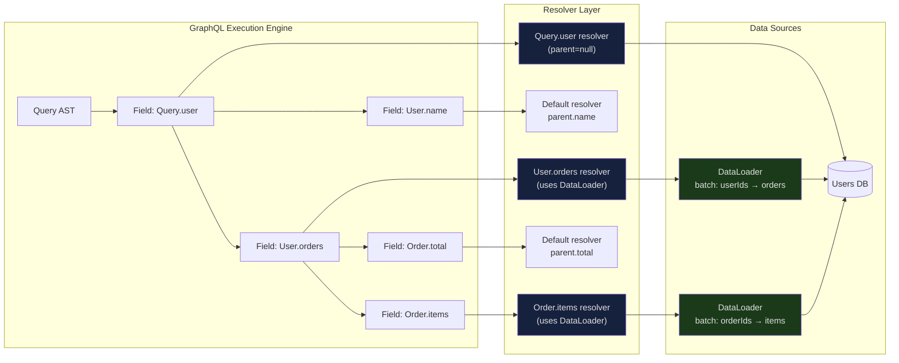

# Resolver Patterns

> **Purpose:** Establish the complete resolver programming model for production GraphQL servers. This file covers the resolver function contract from first principles, the default resolver behavior that eliminates unnecessary boilerplate, root vs. type resolver organization, context object design, abstract type resolution, look-ahead optimization using the `info` parameter, and resolver middleware for cross-cutting concerns. These patterns are the foundation on which every other optimization and security technique in this folder builds.

---

## Learning Objectives

- [ ] Explain the four resolver parameters (`parent`, `args`, `context`, `info`) and the role each plays
- [ ] Describe when the default resolver fires and when to write a custom resolver
- [ ] Design a production context factory that provides DataLoaders, auth, logging, and database access
- [ ] Implement `__resolveType` for union and interface types
- [ ] Use the `info` parameter for look-ahead optimization to avoid unnecessary joins
- [ ] Apply resolver middleware for logging, tracing, and authorization as cross-cutting concerns
- [ ] Identify authorization anti-patterns that create security vulnerabilities at the resolver layer
- [ ] Structure resolver maps that separate root resolvers from nested type resolvers cleanly

---

## Overview / Architecture

Resolvers sit between the GraphQL execution engine and your data sources. The execution engine calls each resolver in the query tree in dependency order — root resolvers first, then child resolvers as parent values become available. Sibling resolvers at the same tree depth execute concurrently.



The key architectural insight: resolvers are pure functions with no shared mutable state. All request-scoped state lives in the context object. This makes individual resolvers trivially testable and the server horizontally scalable.

---

## Core Concepts

### The Resolver Function Contract

Every resolver in a GraphQL schema conforms to a single function signature:

```javascript
/**
 * @param {Object} parent
 *   The value returned by the parent resolver in the execution tree.
 *
 *   For root fields (Query.user, Mutation.createOrder):
 *     This is the "rootValue" — typically null or an empty object {}.
 *     You cannot rely on it carrying any useful data.
 *
 *   For nested fields (User.orders, Order.lineItems):
 *     This is the resolved value from the parent resolver. If Query.user
 *     returned { id: "u1", email: "alice@example.com" }, then User.orders
 *     receives { id: "u1", email: "alice@example.com" } as its parent.
 *
 *   SECURITY NOTE: parent values originate from other resolver return values,
 *   not directly from the client. However, in schema stitching or federation
 *   contexts, parent values can cross trust boundaries. Never make auth
 *   decisions solely based on parent values; always verify from context.user.
 *
 * @param {Object} args
 *   The field arguments provided by the client in the query.
 *   Example: for `user(id: "u1")`, args = { id: "u1" }.
 *   Always validate and sanitize args — they are client-controlled.
 *
 * @param {Object} context
 *   The request-scoped shared object, created once per request and injected
 *   into every resolver. The canonical place for: authenticated user, database
 *   connections, DataLoader instances, structured logger, feature flags,
 *   request ID, and any other per-request shared resources.
 *   Never mutate context inside resolvers — treat it as read-only.
 *
 * @param {GraphQLResolveInfo} info
 *   Schema and query metadata at the current resolver's position.
 *   Key properties:
 *     info.fieldName        — the field name being resolved ("user")
 *     info.returnType       — the GraphQL return type (GraphQLObjectType, etc.)
 *     info.parentType       — the type containing this field (QueryType, UserType)
 *     info.path             — the path from root to this field ["user", "orders", 0]
 *     info.operation        — the full OperationDefinitionNode (query/mutation/subscription)
 *     info.fragments        — fragment definitions in this operation
 *     info.schema           — the full GraphQL schema object
 *     info.fieldNodes       — the FieldNode AST nodes for this field (may be multiple if aliased)
 *   Use info for look-ahead optimization, field aliasing detection, and custom directives.
 *
 * @returns {*} result
 *   Must match the field's declared return type. Can be:
 *   - A primitive (string, number, boolean, null) for scalar fields
 *   - An object (plain JS object) for object type fields
 *   - An array for list fields
 *   - A Promise resolving to any of the above
 *   Returning undefined is treated as null; returning a rejected Promise is
 *   treated as a resolver error (partial result or full null, depending on nullability).
 */
async function resolver(parent, args, context, info) {
  return result;
}
```

### The Default Resolver

GraphQL does not require you to write a resolver for every field. For fields on object types where the field name matches a property on the resolved parent object, the execution engine uses a built-in default resolver:

```javascript
// This is GraphQL's built-in default resolver — the equivalent JavaScript:
function defaultFieldResolver(parent, args, context, info) {
  // If parent is null/undefined, return undefined (becomes null in the response)
  if (parent == null) return undefined;

  // Look up the field by name on the parent object
  const value = parent[info.fieldName];

  // Support method-style resolvers: if the value is a function, call it
  if (typeof value === 'function') {
    return value.call(parent, args, context, info);
  }

  return value;
}
```

**What this means in practice:**

If your `Query.user` resolver returns `{ id: "u1", name: "Alice", email: "alice@example.com" }`, you do not need to write resolvers for `User.id`, `User.name`, or `User.email`. The default resolver handles all three.

**Write a custom resolver only when:**

1. The GraphQL field name differs from the database/object property name (`displayName` vs. `display_name`)
2. The data requires transformation before being returned (concatenating `firstName` + `lastName` into `fullName`)
3. The field requires data from a different source than the parent (fetching orders from a separate service)
4. You need to apply authorization checks specific to this field
5. The field is a computed value (calculating `totalPrice` from `unitPrice` × `quantity`)

---

## Real-World Implementation

### Root Resolver Pattern

Root resolvers sit on `Query`, `Mutation`, and `Subscription` types. Their `parent` parameter is always the root value (null by default). All data fetching starts here.

```javascript
// resolvers/query.js
import { decodeCursor, buildWhereClause } from '../utils/pagination';
import { NotFoundError } from '../errors';

export const Query = {
  // Simple root resolver: fetch by ID
  user: async (_, { id }, context) => {
    // Use DataLoader — this batches with other user lookups in the same request
    const user = await context.loaders.user.load(id);

    if (!user) {
      throw new NotFoundError('User', id);
    }

    return user;
  },

  // Cursor-based pagination root resolver
  products: async (_, { filter, first = 10, after }, context) => {
    // Fetch one extra record to determine if there's a next page
    const items = await context.db.products.findMany({
      where: buildWhereClause(filter),
      take: first + 1,
      cursor: after ? { id: decodeCursor(after) } : undefined,
      orderBy: { createdAt: 'desc' },
    });

    const hasNextPage = items.length > first;
    const edges = items.slice(0, first).map(item => ({
      node: item,
      cursor: encodeCursor(item.id),
    }));

    return {
      edges,
      pageInfo: {
        hasNextPage,
        hasPreviousPage: after != null,
        startCursor: edges[0]?.cursor ?? null,
        endCursor: edges[edges.length - 1]?.cursor ?? null,
      },
    };
  },

  // Parallel data fetching with Promise.all
  dashboard: async (_, args, context) => {
    const [user, recentOrders, notifications] = await Promise.all([
      context.loaders.user.load(context.user.id),
      context.loaders.recentOrdersByUserId.load(context.user.id),
      context.notificationService.getUnread(context.user.id),
    ]);

    return { user, recentOrders, notifications };
  },
};
```

### Type Resolver Pattern

Type resolvers handle nested fields on object types. They receive the parent object from the root resolver (or another type resolver) as their first argument.

```javascript
// resolvers/user.js
export const User = {
  // Nested resolver using DataLoader for batching
  orders: async (user, { first = 10, after, status }, context) => {
    // context.loaders.ordersByUserId batches all user.id values
    // in the current request into a single DB query
    return context.loaders.ordersByUserId.load(user.id);
  },

  // Computed field: transform parent data, no additional fetch needed
  displayName: (user) => {
    if (user.preferredName) return user.preferredName;
    return [user.firstName, user.lastName].filter(Boolean).join(' ');
  },

  // Field requiring additional service call
  recommendations: async (user, { first = 5 }, context) => {
    return context.recommendationService.getForUser(user.id, { first });
  },

  // Field requiring authorization check
  email: (user, _, context) => {
    // Only the user themselves (or admins) can see email addresses
    if (context.user?.id !== user.id && !context.user?.isAdmin) {
      return null; // Return null rather than throw for nullable fields
    }
    return user.email;
  },

  // Field that renames a property (DB has snake_case, schema has camelCase)
  createdAt: (user) => user.created_at,

  // Conditional field: not all users have this
  billingAddress: async (user, _, context) => {
    if (!user.hasBillingAddress) return null;
    return context.loaders.addressByUserId.load(user.id);
  },
};
```

### Context Object Design

The context factory is one of the most consequential architectural decisions in a GraphQL server. It is called once per request. Everything placed in the context is available in every resolver in that request.

```javascript
// src/context.js
import crypto from 'crypto';
import {
  createUserLoader,
  createProductLoader,
  createOrderLoader,
  createOrdersByUserIdLoader,
  createAddressByUserIdLoader,
  createOrderItemsByOrderIdLoader,
} from './loaders';
import { db } from './database';
import { logger } from './logger';
import { recommendationService } from './services/recommendations';
import { notificationService } from './services/notifications';
import { getFeatureFlags } from './features';

/**
 * Creates the GraphQL context for a single request.
 * Called by Apollo Server's `context` option on every incoming request.
 *
 * IMPORTANT: DataLoaders MUST be created inside this function, not at module
 * level. A DataLoader instance maintains a per-request cache and batch buffer.
 * A module-level DataLoader would share its cache across all requests, causing
 * stale data reads and cross-tenant data leaks.
 */
export async function createContext({ req }) {
  // Extract or generate a request ID for distributed tracing correlation
  const requestId = req.headers['x-request-id'] ?? crypto.randomUUID();

  // The authenticated user is set by auth middleware before this function runs.
  // If no user is present, context.user is null — resolvers must handle this.
  const user = req.user ?? null;

  return {
    // --- Authentication ---
    user,           // { id, email, roles, organizationId } or null
    requestId,

    // --- Database ---
    // Pass the db client through context so resolvers are testable:
    // in tests, swap context.db for a mock/in-memory database
    db,

    // --- DataLoaders (created fresh per request) ---
    // Each loader batches all .load() calls made within a single event loop tick
    loaders: {
      user: createUserLoader(db),
      product: createProductLoader(db),
      order: createOrderLoader(db),
      ordersByUserId: createOrdersByUserIdLoader(db),
      addressByUserId: createAddressByUserIdLoader(db),
      orderItemsByOrderId: createOrderItemsByOrderIdLoader(db),
    },

    // --- Services ---
    // Wrapped service clients that carry the requestId for tracing propagation
    recommendationService: recommendationService.withContext({ requestId, userId: user?.id }),
    notificationService: notificationService.withContext({ requestId }),

    // --- Observability ---
    // Child logger with request-scoped fields — all resolver logs include these
    logger: logger.child({
      requestId,
      userId: user?.id ?? 'anonymous',
      organizationId: user?.organizationId ?? null,
    }),

    // --- Feature Flags ---
    // Evaluated once at request start; do not call the flag service inside resolvers
    features: await getFeatureFlags(user),
  };
}
```

### Abstract Type Resolvers (`__resolveType`)

When a field's return type is a union or interface, the execution engine needs to know the concrete type of each resolved object so it can select the right field resolvers. You provide this via `__resolveType`.

```javascript
// Schema:
// union SearchResult = Product | User | Article
// interface Node { id: ID! }
// interface Timestamped { createdAt: DateTime!, updatedAt: DateTime! }

const resolvers = {
  // Union type resolver
  // Must return a type name string, not a type object
  SearchResult: {
    __resolveType(obj) {
      // CRITICAL: This function must be O(1) — no database queries.
      // It is called once for every item in a search results list.
      // A DB query here would be a catastrophic N+1 on every search.

      // Strategy 1: Discriminant field (most reliable)
      if ('sku' in obj) return 'Product';
      if ('email' in obj) return 'User';
      if ('headline' in obj) return 'Article';

      // Strategy 2: Explicit __typename (set by the root resolver)
      if (obj.__typename) return obj.__typename;

      // Unrecognized type — return null to trigger an execution error
      // rather than silently returning wrong data
      return null;
    }
  },

  // Interface type resolver
  Node: {
    __resolveType(obj) {
      // Strategy 3: Constructor name (works if you return class instances)
      return obj.constructor.name;
    }
  },

  Timestamped: {
    __resolveType(obj) {
      // Strategy 4: __typename set by database layer (e.g., Prisma model name)
      return obj.__typename ?? null;
    }
  },
};
```

**Preferred strategy:** Have root resolvers set `__typename` on every returned object. This makes `__resolveType` a trivial single-field lookup and eliminates ambiguity:

```javascript
Query: {
  search: async (_, { query }, context) => {
    const results = await context.searchService.search(query);
    // Set __typename at the source so __resolveType is always reliable
    return results.map(result => ({ ...result, __typename: result.type }));
  }
}
```

### Look-Ahead Optimization

The `info` parameter exposes the full query AST at the current resolver's position. You can inspect which child fields the client actually requested and avoid fetching data that will not be used.

```javascript
import { parseResolveInfo } from 'graphql-parse-resolve-info';
// npm: graphql-parse-resolve-info — parses the info object into a plain field map

const resolvers = {
  Query: {
    user: async (_, { id }, context, info) => {
      // Parse the current selection set into a structured field map
      const resolveInfo = parseResolveInfo(info);
      const requestedFields = Object.keys(
        resolveInfo?.fieldsByTypeName?.User ?? {}
      );

      // Conditional JOIN: only fetch orders if the client requested them
      // Without this, every user query would join the orders table
      const includeOrders = requestedFields.includes('orders');
      const includeAddresses = requestedFields.includes('addresses');
      const includePaymentMethods = requestedFields.includes('paymentMethods');

      return context.db.users.findUnique({
        where: { id },
        include: {
          orders: includeOrders,
          addresses: includeAddresses,
          paymentMethods: includePaymentMethods,
        },
      });
    },

    // More granular: column projection
    products: async (_, { filter }, context, info) => {
      const resolveInfo = parseResolveInfo(info);
      const requestedFields = Object.keys(
        resolveInfo?.fieldsByTypeName?.Product ?? {}
      );

      // Only SELECT the columns the client needs
      // Avoids transferring large blobs (images, descriptions) unnecessarily
      const columnMap = {
        id: true,
        name: true,
        price: true,
        description: requestedFields.includes('description'),
        imageUrl: requestedFields.includes('imageUrl'),
        inventory: requestedFields.includes('inventory'),
      };

      return context.db.products.findMany({
        where: buildWhereClause(filter),
        select: columnMap,
      });
    },
  },
};
```

### Resolver Middleware

For cross-cutting concerns (logging, tracing, authorization, rate limiting), wrap resolvers rather than duplicating logic inside each one. The `graphql-middleware` package provides a clean composition model.

```javascript
import { applyMiddleware } from 'graphql-middleware';
import { makeExecutableSchema } from '@graphql-tools/schema';
import { trace } from '@opentelemetry/api';

const tracer = trace.getTracer('graphql');

// --- Resolver-level OpenTelemetry tracing ---
const tracingMiddleware = {
  async Query(resolve, parent, args, context, info) {
    const span = tracer.startSpan(`Query.${info.fieldName}`);
    try {
      const result = await resolve(parent, args, context, info);
      span.setStatus({ code: 1 }); // SpanStatusCode.OK
      return result;
    } catch (error) {
      span.recordException(error);
      span.setStatus({ code: 2, message: error.message }); // SpanStatusCode.ERROR
      throw error;
    } finally {
      span.end();
    }
  },

  // Apply tracing to Mutation fields as well
  async Mutation(resolve, parent, args, context, info) {
    const span = tracer.startSpan(`Mutation.${info.fieldName}`, {
      attributes: { 'graphql.operation.type': 'mutation' },
    });
    try {
      const result = await resolve(parent, args, context, info);
      span.setStatus({ code: 1 });
      return result;
    } catch (error) {
      span.recordException(error);
      span.setStatus({ code: 2, message: error.message });
      throw error;
    } finally {
      span.end();
    }
  },
};

// --- Resolver-level structured logging ---
const loggingMiddleware = async (resolve, parent, args, context, info) => {
  const start = Date.now();
  const field = `${info.parentType.name}.${info.fieldName}`;

  try {
    const result = await resolve(parent, args, context, info);
    context.logger.debug({
      msg: 'resolver.success',
      field,
      durationMs: Date.now() - start,
    });
    return result;
  } catch (error) {
    context.logger.warn({
      msg: 'resolver.error',
      field,
      durationMs: Date.now() - start,
      error: error.message,
    });
    throw error;
  }
};

// --- Global authorization guard ---
// Ensures all mutations require an authenticated user
const authGuardMiddleware = {
  Mutation: async (resolve, parent, args, context, info) => {
    if (!context.user) {
      throw new GraphQLError('Authentication required', {
        extensions: { code: 'UNAUTHENTICATED' },
      });
    }
    return resolve(parent, args, context, info);
  },
};

// Compose the schema with middleware
const schema = applyMiddleware(
  makeExecutableSchema({ typeDefs, resolvers }),
  tracingMiddleware,
  loggingMiddleware,
  authGuardMiddleware,
);
```

---

## Production Considerations

### Performance

Resolver execution is inherently asynchronous. The single most impactful performance rule is: **never await sequentially what can be awaited concurrently.**

```javascript
// BAD: Sequential awaits — 3 network round trips in series
const user = await context.loaders.user.load(id);
const org = await context.loaders.org.load(user.orgId);
const perms = await context.permissionService.get(user.id);

// GOOD: Parallel — all 3 initiate simultaneously, total latency = max(3)
const [user, org, perms] = await Promise.all([
  context.loaders.user.load(id),
  context.loaders.org.load(orgId),      // If orgId is already known from args
  context.permissionService.get(userId),
]);
```

Also: DataLoader automatically batches `.load()` calls made within a single event loop tick. This works because all sibling resolvers in a GraphQL execution level run synchronously before any of their returned Promises are awaited. The tick boundary is where batching happens.

### Security

**Never use `parent` values as the sole basis for authorization decisions.** The `parent` value is a return value from another resolver — not directly from the client, but it can be influenced by what was fetched. Always verify permissions against `context.user`:

```javascript
// DANGEROUS: Assumes parent.userId is the authenticated user
User: {
  sensitiveData: (user, _, context) => {
    if (user.id === context.user.id) { // This is safe — comparing fetched object ID to auth'd user
      return user.sensitiveData;
    }
    return null;
  }
}

// DANGEROUS in federated context: parent could come from an untrusted subgraph
// SAFE: Re-verify ownership from context
User: {
  paymentMethods: async (user, _, context) => {
    // Don't just trust that user.id is the authenticated user
    // Re-verify: only return payment methods for the authenticated user
    if (user.id !== context.user?.id && !context.user?.isAdmin) {
      throw new GraphQLError('Forbidden', {
        extensions: { code: 'FORBIDDEN' },
      });
    }
    return context.loaders.paymentMethodsByUserId.load(user.id);
  }
}
```

### Scaling

Resolvers are pure functions with no shared mutable state — state lives in the context object (per-request) or in the DataLoader batch buffer (per-request). This means resolver code itself is trivially horizontally scalable. A resolver function running on 100 pod replicas behaves identically to one running on a single pod.

The scaling constraint is at the data layer: database connections (manage via connection pooling with PgBouncer or Prisma's pool configuration), downstream service call concurrency (use circuit breakers via `cockatiel` or `opossum`), and DataLoader cache size (cap with `DataLoader.maxBatchSize` and `DataLoader.cacheKeyFn`).

### Observability

Each resolver should emit an OpenTelemetry span. The parent-child span hierarchy naturally mirrors the query tree — a `Query.user` span containing `User.orders` spans containing `Order.items` spans gives you a complete picture of query execution cost. Use the resolver middleware pattern above to add tracing without modifying individual resolver functions.

Key metrics to emit per resolver field:
- `graphql.resolver.duration` (histogram) — p50/p95/p99 latency by field
- `graphql.resolver.errors_total` (counter) — error count by field and error code
- `graphql.dataloader.batch_size` (histogram) — DataLoader batch sizes (small batches indicate missed batching)

---

## Best Practices

1. **Put DataLoaders in context, never in resolver bodies.** A DataLoader created inside a resolver function creates a new instance with an empty cache and batch buffer every time that resolver is called. DataLoaders only batch if they are shared across all resolvers in the same request — which requires the context pattern. Resolvers that create their own DataLoaders defeat N+1 prevention entirely.

2. **Keep resolver functions thin.** A resolver's job is to retrieve or mutate data and return the result. Business logic belongs in service classes or domain models, not in resolvers. A resolver calling a service method is correct; a resolver that contains multi-step business workflows, conditional retry logic, and complex transformations is a maintenance liability and untestable without running a full GraphQL server.

3. **Validate and sanitize `args` at the resolver boundary.** Args are client-controlled. Apply input validation (field length limits, enum membership, numeric range checks) at the start of every resolver that accepts args. Use a validation library like `zod` or `joi` rather than ad-hoc checks. Throw `UserInputError` immediately on validation failure — do not pass invalid data into service or database calls.

4. **Use `__typename` as the discriminant for union and interface resolution.** Set `__typename` on every object returned from a root resolver that participates in a union or interface. This makes `__resolveType` a single field lookup (O(1), no database required) and eliminates ambiguity when objects from different sources have overlapping field names.

5. **Design context to be testable.** Context is the dependency injection mechanism for resolvers. Any dependency that a resolver needs should come from context — not from module-level imports. This allows resolver unit tests to pass a mock context (mock DB, mock loaders, mock user) and verify resolver behavior in isolation without any real infrastructure.

6. **Apply look-ahead for expensive joins and nested fetches.** Use `graphql-parse-resolve-info` to inspect which child fields are actually requested before deciding whether to perform expensive joins or additional fetches. A `Query.user` that never looks ahead will always join the orders, addresses, and paymentMethods tables, even when the client only requested `{ name }`. For high-traffic APIs with many optional associations, this optimization can reduce query cost by 50–80%.

---

## Anti-Patterns

### 1. N+1 Queries from Missing DataLoader

**Failure:** Writing a nested resolver that queries the database directly per parent item, without DataLoader batching.

```javascript
// BROKEN: 1 query per user — 100 users = 100 DB queries for orders alone
User: {
  orders: async (user, _, context) => {
    return context.db.orders.findMany({ where: { userId: user.id } });
  }
}
```

**Fix:** Use a DataLoader in context. The DataLoader batches all `user.id` values collected from all concurrent `User.orders` resolver invocations and executes a single `WHERE userId IN (...)` query.

```javascript
// CORRECT: All user.id values batch into a single DB query
User: {
  orders: (user, _, context) => context.loaders.ordersByUserId.load(user.id)
}
```

### 2. Business Logic in Resolvers

**Failure:** Embedding multi-step workflows, complex conditional logic, and transformation pipelines directly in resolver functions.

```javascript
// BROKEN: Resolver does order creation, inventory check, payment charge,
// notification dispatch, and audit logging — all in one function
Mutation: {
  createOrder: async (_, { input }, context) => {
    const inventory = await checkInventory(input.items);
    if (!inventory.available) { ... }
    const order = await context.db.orders.create(...);
    const charge = await stripeClient.charges.create(...);
    await context.db.orders.update({ where: { id: order.id }, data: { chargeId: charge.id } });
    await sendOrderConfirmationEmail(order, context.user);
    await auditLog('order.created', { orderId: order.id });
    return order;
  }
}
```

**Fix:** Delegate to a service layer. The resolver becomes thin: validate args, call service, return result. All business logic lives in `OrderService.createOrder()`, which is independently testable.

### 3. Shared Mutable State in Resolver Scope

**Failure:** Caching or accumulating state in module-level variables inside resolver files. Because Node.js modules are singletons, this state persists across all requests and all users.

```javascript
// BROKEN: Module-level cache is shared across all requests
const userCache = {};

User: {
  permissions: async (user) => {
    if (userCache[user.id]) return userCache[user.id]; // Cross-request data leak
    const perms = await fetchPermissions(user.id);
    userCache[user.id] = perms;
    return perms;
  }
}
```

**Fix:** Use DataLoader (which has per-request scope) or Redis (external, explicit TTL) for caching. Never use in-process module-level state as a cache in a multi-request server.

### 4. Trusting `parent` for Authorization

**Failure:** Using `parent` values as the authorization source of truth in sensitive fields.

```javascript
// BROKEN: parent.role is a field on the fetched User object.
// In a federated schema, this value could come from a different subgraph
// with different trust assumptions. Worse, an attacker who can influence
// which user object is fetched can potentially control parent.role.
User: {
  adminActions: (user, _, context) => {
    if (user.role === 'ADMIN') return getAdminActions(); // DO NOT do this
  }
}
```

**Fix:** Always derive authorization from `context.user`, which is set by trusted auth middleware from a verified JWT or session token — not from any resolved data.

```javascript
// CORRECT: Authorization from trusted context, not from resolved object
User: {
  adminActions: (user, _, context) => {
    if (!context.user?.roles.includes('ADMIN')) {
      throw new GraphQLError('Forbidden', { extensions: { code: 'FORBIDDEN' } });
    }
    return getAdminActions();
  }
}
```

---

## Operational Notes

**Resolver timeout enforcement:** GraphQL does not enforce resolver timeouts by default. A resolver that hangs on a slow database query or a downstream service will hold the request open indefinitely. Implement resolver-level timeouts using `Promise.race` with a timeout promise, or at the HTTP server layer with `server.keepAliveTimeout`. For production, 30 seconds is a reasonable maximum for any single resolver; most should complete in under 100ms.

**Schema coordinate logging:** When logging resolver errors, always include the schema coordinate (`parentType.fieldName`). This is the single most useful field for identifying which resolver is causing problems in production — `User.orders` tells you exactly where to look.

**Context creation failures:** If your context factory throws (e.g., auth middleware fails, feature flag service is unreachable), the entire request fails before any resolver runs. Make context creation resilient: catch non-critical errors (feature flags), use defaults, and only propagate fatal errors (invalid auth token).

**Resolver depth limits:** Without a query depth limit, a client can construct deeply nested queries (`user { orders { user { orders { ... } } } }`) that cause the execution engine to run resolver chains of arbitrary depth. Use `graphql-depth-limit` to enforce a maximum query depth (typically 7–10 levels for most APIs).

---

## References

- [GraphQL Specification — Execution](https://spec.graphql.org/October2021/#sec-Execution)
- [graphql-js: defaultFieldResolver source](https://github.com/graphql/graphql-js/blob/main/src/execution/execute.ts)
- [graphql-middleware (Prisma Labs)](https://github.com/nicholasgasior/graphql-middleware)
- [graphql-parse-resolve-info](https://github.com/graphile/graphile-engine/tree/master/packages/graphql-parse-resolve-info)
- [Apollo Server: Context and authentication](https://www.apollographql.com/docs/apollo-server/security/authentication/)
- [OpenTelemetry JavaScript SDK](https://opentelemetry.io/docs/languages/js/)
- [DataLoader (Facebook)](https://github.com/graphql/dataloader)

---

## Related Topics

- [README.md](./README.md) — Folder overview and reading guide
- [02-resolver-optimization.md](./02-resolver-optimization.md) — Performance: DataLoader patterns, projection, caching
- [03-error-handling.md](./03-error-handling.md) — Error classification, masking, userErrors pattern
- [../02-graphql-internals/README.md](../02-graphql-internals/README.md) — Execution pipeline internals, DataLoader deep dive
- [../05-security/README.md](../05-security/README.md) — Authorization patterns, field-level security directives
