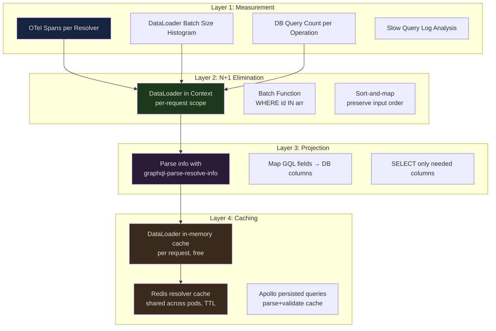

# Resolver Optimization

> **Purpose:** Equip engineers to systematically measure and eliminate resolver performance bottlenecks in production GraphQL APIs. This file covers the full optimization stack: instrumenting resolver latency with OpenTelemetry before touching any code, eliminating N+1 queries with correctly-placed DataLoader instances, reducing database I/O with field projection, adding resolver-level caching with Redis, and structuring deferred resolution for expensive fields. Every technique is grounded in measurable outcomes — do not optimize what you have not measured.

---

## Learning Objectives

- [ ] Instrument all resolvers with OpenTelemetry spans to get p50/p95/p99 latency by field
- [ ] Identify N+1 query patterns using DataLoader batch-size metrics and database query logs
- [ ] Correctly place DataLoader instances in the context factory (per-request scope)
- [ ] Implement a production DataLoader with correct ordering guarantees and error propagation
- [ ] Apply field projection using `graphql-parse-resolve-info` or `graphql-fields-list` to reduce DB column transfer
- [ ] Build a resolver-level Redis cache with per-field TTL configuration
- [ ] Understand the interaction between Apollo Server's response cache, DataLoader cache, and Redis resolver cache
- [ ] Profile a real query using `explain analyze` output alongside resolver span data

---

## Overview / Architecture

Resolver optimization has a layered structure. Each layer targets a different cost center:



The correct sequence is always: **measure first, then eliminate N+1, then project, then cache.** Caching an N+1 query is not optimization — it is concealment. The cache will fail under any cache-miss scenario and your database will be slammed during cache warmup or after a deployment.

---

## Core Concepts

### Resolver Latency Budget

A well-designed GraphQL API has an end-to-end latency budget. For a typical API:

| Tier | p50 latency target | p99 latency target |
|---|---|---|
| Root resolvers (Query/Mutation) | < 20ms | < 100ms |
| Type resolvers (DataLoader-backed) | < 5ms | < 30ms |
| Computed/default resolvers | < 1ms | < 5ms |
| Full query end-to-end | < 50ms | < 200ms |

These are starting points, not universal rules. Establish your own baselines by measuring before any optimization work.

### The DataLoader Batching Window

DataLoader's batching mechanism relies on the JavaScript event loop. When a resolver calls `loader.load(key)`, DataLoader does not execute immediately. It schedules execution for the next event loop tick using `process.nextTick`. All `.load()` calls made synchronously (within the same tick) are collected into a single batch.

This works in GraphQL because:
1. The execution engine calls all sibling resolvers synchronously before awaiting any of their Promises
2. All `loader.load()` calls from sibling resolvers in the same execution level happen in the same tick
3. DataLoader fires the batch function once with all collected keys

If you accidentally `await` inside a resolver before calling `loader.load()`, the load call happens in a new tick and cannot batch with sibling loads from the same execution level.

---

## Real-World Implementation

### Measuring Resolver Performance with OpenTelemetry

Before optimizing any resolver, establish a measurement baseline. Guessing which resolvers are slow is consistently wrong.

```javascript
// src/instrumentation/resolver-tracing.js
import { trace, SpanStatusCode, context as otelContext } from '@opentelemetry/api';

const tracer = trace.getTracer('graphql-resolvers', '1.0.0');

/**
 * Wraps a resolver function with an OpenTelemetry span.
 * Use this in the resolver middleware layer rather than modifying individual resolvers.
 *
 * @param {string} typeName - The GraphQL type name (e.g., "Query", "User")
 * @param {string} fieldName - The field name (e.g., "user", "orders")
 * @param {Function} resolver - The original resolver function
 */
export function tracedResolver(typeName, fieldName, resolver) {
  return async (parent, args, context, info) => {
    const span = tracer.startSpan(`${typeName}.${fieldName}`, {
      attributes: {
        'graphql.field.name': fieldName,
        'graphql.type.name': typeName,
        'graphql.operation.name': info.operation.name?.value ?? 'anonymous',
        'graphql.operation.type': info.operation.operation, // query | mutation | subscription
        // Include the request ID for trace-to-log correlation
        'request.id': context.requestId ?? 'unknown',
      },
    });

    // Propagate the span context so child spans (e.g., DB queries) are nested correctly
    return otelContext.with(trace.setSpan(otelContext.active(), span), async () => {
      try {
        const result = await resolver(parent, args, context, info);

        // Record list result sizes — useful for spotting unexpectedly large payloads
        if (Array.isArray(result)) {
          span.setAttribute('graphql.result.count', result.length);
        }

        span.setStatus({ code: SpanStatusCode.OK });
        return result;
      } catch (error) {
        span.recordException(error);
        span.setStatus({ code: SpanStatusCode.ERROR, message: error.message });
        throw error;
      } finally {
        span.end();
      }
    });
  };
}

/**
 * Apply tracing to all resolvers in a resolver map automatically.
 * Call this once during server initialization.
 */
export function traceAllResolvers(resolvers) {
  const traced = {};
  for (const [typeName, typeResolvers] of Object.entries(resolvers)) {
    traced[typeName] = {};
    for (const [fieldName, resolver] of Object.entries(typeResolvers)) {
      if (typeof resolver === 'function') {
        traced[typeName][fieldName] = tracedResolver(typeName, fieldName, resolver);
      } else {
        // Non-function values (e.g., __resolveType) — pass through unchanged
        traced[typeName][fieldName] = resolver;
      }
    }
  }
  return traced;
}
```

```javascript
// Usage in server setup:
import { traceAllResolvers } from './instrumentation/resolver-tracing';

const server = new ApolloServer({
  schema: makeExecutableSchema({
    typeDefs,
    resolvers: traceAllResolvers(resolvers), // All resolvers now emit spans
  }),
  context: createContext,
});
```

**What to look for in Jaeger/Honeycomb/Tempo:**
- Spans with high p99 latency — these are your optimization targets
- Spans that have many short-duration child spans of the same type — this is N+1 signature
- Root resolver spans that contain hundreds of DataLoader batch spans — batch sizes are too small

### DataLoader Integration (Production Patterns)

The most common DataLoader mistake: creating loader instances inside resolver functions instead of in the context factory.

```javascript
// BROKEN: New DataLoader instance on every resolver invocation
// This defeats batching entirely — each resolver gets its own loader
// with its own empty batch buffer. No batching occurs across resolvers.
const User = {
  orders: async (user, _, context) => {
    const loader = new DataLoader(async (userIds) => {         // New instance!
      const orders = await context.db.orders.findMany({
        where: { userId: { in: userIds } },
      });
      return userIds.map(id => orders.filter(o => o.userId === id));
    });
    return loader.load(user.id); // Only this user.id is ever in this batch
  },
};
```

```javascript
// CORRECT: DataLoader in context factory — one instance per request, shared
// by all resolver invocations in that request. Batching works.

// src/loaders/orders.js
import DataLoader from 'dataloader';

/**
 * Creates a DataLoader that batches order fetches by userId.
 *
 * Correctness requirements for the batch function:
 * 1. Return an array with the SAME LENGTH as the input keys array
 * 2. Return values in the SAME ORDER as the input keys
 * 3. For missing keys, return null (or an Error if you want .load() to reject)
 *
 * Violation of rules 1 or 2 causes DataLoader to map results to wrong keys,
 * which is a silent data corruption bug.
 */
export function createOrdersByUserIdLoader(db) {
  return new DataLoader(
    async (userIds) => {
      // Fetch all orders for all batched user IDs in one query
      const orders = await db.orders.findMany({
        where: { userId: { in: [...userIds] } },
        orderBy: { createdAt: 'desc' },
      });

      // Group orders by userId — O(n) pass
      const ordersByUserId = orders.reduce((map, order) => {
        if (!map.has(order.userId)) map.set(order.userId, []);
        map.get(order.userId).push(order);
        return map;
      }, new Map());

      // Return in the same order as input userIds
      // If no orders exist for a userId, return empty array (not null/undefined)
      return userIds.map(userId => ordersByUserId.get(userId) ?? []);
    },
    {
      // Cap batch size to avoid excessively large IN clauses
      // Databases typically perform best with IN clauses under 1000 items
      maxBatchSize: 500,

      // Cache key function — use string representation for object keys
      // Default is identity, which works for string/number IDs
      cacheKeyFn: (key) => String(key),
    }
  );
}

// src/context.js — DataLoader is created in the context factory
export function createContext({ req }) {
  return {
    user: req.user,
    db,
    loaders: {
      ordersByUserId: createOrdersByUserIdLoader(db),
      // ... other loaders
    },
  };
}

// Resolver — now trivially thin
const User = {
  orders: (user, _, context) => context.loaders.ordersByUserId.load(user.id),
};
```

**DataLoader error propagation:** If the batch function throws, the error propagates to every `.load()` call in that batch. If only some keys should fail, return `new Error(...)` in the result array at the corresponding positions — DataLoader will reject the individual `.load()` promises for those keys while resolving others.

```javascript
export function createUserLoader(db) {
  return new DataLoader(async (ids) => {
    const users = await db.users.findMany({ where: { id: { in: [...ids] } } });
    const userMap = new Map(users.map(u => [u.id, u]));

    return ids.map(id => {
      const user = userMap.get(id);
      // Return Error for missing IDs — .load() rejects for just these IDs
      return user ?? new Error(`User ${id} not found`);
    });
  });
}
```

### Field Projection: Requesting Only Needed Columns

Fetching 20 database columns when the client requested 2 fields wastes network bandwidth, database buffer pool, and serialization cost. Field projection uses the query's selection set to determine the minimal column set.

```javascript
// src/utils/projection.js
import { parseResolveInfo } from 'graphql-parse-resolve-info';

/**
 * Extracts the list of requested field names from the current resolver's
 * selection set. Use this to build a minimal SELECT clause.
 *
 * @param {GraphQLResolveInfo} info
 * @param {string} typeName - The concrete type to extract fields for
 * @returns {string[]} Array of requested field names
 */
export function getRequestedFields(info, typeName) {
  const resolveInfo = parseResolveInfo(info);
  return Object.keys(resolveInfo?.fieldsByTypeName?.[typeName] ?? {});
}

/**
 * Builds a Prisma `select` object from a list of requested GraphQL fields.
 * Always includes `id` so DataLoader can use it for ordering.
 *
 * @param {string[]} requestedFields
 * @param {Object} fieldColumnMap - Maps GraphQL field names to DB column names
 * @returns {Object} Prisma select object
 */
export function buildPrismaSelect(requestedFields, fieldColumnMap) {
  const select = { id: true }; // Always include ID
  for (const field of requestedFields) {
    const column = fieldColumnMap[field];
    if (column) {
      select[column] = true;
    }
  }
  return select;
}
```

```javascript
// Resolver using field projection
import { getRequestedFields, buildPrismaSelect } from '../utils/projection';

// Maps GraphQL field names → Prisma/DB column names
const PRODUCT_FIELD_MAP = {
  id: 'id',
  name: 'name',
  price: 'price',
  description: 'description',   // Large text field — expensive to fetch unnecessarily
  imageUrl: 'image_url',
  sku: 'sku',
  weight: 'weight',
  inventoryCount: 'inventory_count',
  createdAt: 'created_at',
};

const Query = {
  products: async (_, { filter, first = 20, after }, context, info) => {
    const requestedFields = getRequestedFields(info, 'Product');
    const select = buildPrismaSelect(requestedFields, PRODUCT_FIELD_MAP);

    // If client requested `category`, include the relation
    const includeCategory = requestedFields.includes('category');

    return context.db.products.findMany({
      select,
      include: { category: includeCategory },
      where: buildWhereClause(filter),
      take: first + 1,
      cursor: after ? { id: decodeCursor(after) } : undefined,
    });
  },
};
```

**When projection pays off:**
- Tables with large text columns (`description`, `body`, `htmlContent`) that are rarely needed
- Tables with JSONB columns that are expensive to deserialize
- Queries that join to large related tables when those relations are rarely requested
- High-throughput list endpoints where avoiding 10 unnecessary columns multiplies across thousands of rows

**When projection adds more overhead than it saves:**
- Tables with only 3–5 small scalar columns — a `SELECT *` is essentially free
- Queries where almost all fields are always requested — projection overhead exceeds savings
- Single-row lookups (fetching one user by ID) — column fetch cost is negligible

### Resolver-Level Caching with Redis

DataLoader provides per-request in-memory caching automatically (the same key fetched twice in one request returns the cached value). For cross-request, cross-pod caching, use Redis.

```javascript
// src/cache/resolver-cache.js
import { createClient } from 'redis';

const redis = createClient({
  url: process.env.REDIS_URL,
  socket: {
    connectTimeout: 5000,
    commandTimeout: 1000, // Do not let cache checks add >1s to resolver latency
  },
});

redis.connect().catch(err => {
  // Log but do not crash — redis cache is a performance enhancement, not a correctness dependency
  logger.error({ msg: 'redis.connect.failed', error: err.message });
});

/**
 * Wraps a resolver with a Redis-backed cache.
 * Cache key is derived from the parent type, field name, and args.
 *
 * IMPORTANT: Only use on resolvers that return data safe to share across users.
 * Do NOT cache per-user data (orders, profile, payment methods) — different
 * users will receive each other's data.
 *
 * @param {number} ttlSeconds - How long to cache results
 * @param {Function} resolver - The original resolver function
 * @returns {Function} The wrapped resolver
 */
export function cachedResolver(ttlSeconds, resolver) {
  return async (parent, args, context, info) => {
    // Skip cache for authenticated, user-specific data
    // The field must be explicitly designated as cacheable (public/shared data)
    const cacheKey = buildCacheKey(info.parentType.name, info.fieldName, args);

    try {
      const cached = await redis.get(cacheKey);
      if (cached !== null) {
        context.logger.debug({ msg: 'resolver.cache.hit', field: cacheKey });
        return JSON.parse(cached);
      }
    } catch (err) {
      // Cache read failure — proceed without cache
      context.logger.warn({ msg: 'resolver.cache.read.failed', error: err.message });
    }

    const result = await resolver(parent, args, context, info);

    try {
      await redis.setEx(cacheKey, ttlSeconds, JSON.stringify(result));
    } catch (err) {
      // Cache write failure — return result anyway, do not fail the request
      context.logger.warn({ msg: 'resolver.cache.write.failed', error: err.message });
    }

    return result;
  };
}

function buildCacheKey(typeName, fieldName, args) {
  // Sort args keys for stable key generation regardless of object property order
  const sortedArgs = JSON.stringify(args, Object.keys(args ?? {}).sort());
  return `gql:${typeName}:${fieldName}:${sortedArgs}`;
}
```

```javascript
// Usage: only cache public, shared data
const Query = {
  // Featured products are the same for all users — safe to cache
  featuredProducts: cachedResolver(300, async (_, { category }, context) => {
    return context.db.products.findMany({
      where: { featured: true, categorySlug: category },
      orderBy: { featuredRank: 'asc' },
    });
  }),

  // Product detail — public data, cache for 60 seconds
  product: cachedResolver(60, async (_, { id }, context) => {
    return context.db.products.findUnique({ where: { id } });
  }),

  // DO NOT cache: user-specific, session-specific, or permission-sensitive data
  // currentUser: (_, __, context) => context.loaders.user.load(context.user.id),
  // myOrders: ...
  // myDashboard: ...
};
```

**Cache invalidation strategy:** Use cache tags or key namespacing to invalidate related cache entries when data changes. A product update should invalidate `gql:Query:product:{"id":"p1"}` and `gql:Query:featuredProducts:*`. Implement this with Redis SCAN + DEL, or use a cache tagging library.

### Parallel Resolver Execution with `Promise.all`

Inside a single resolver, sequential `await` calls add latency. Use `Promise.all` for independent operations:

```javascript
const Query = {
  // Efficiently fetches multiple independent resources
  searchPage: async (_, { query }, context) => {
    // All three fetches start simultaneously
    const [products, users, articles] = await Promise.all([
      context.db.products.findMany({
        where: { name: { contains: query } },
        take: 5,
      }),
      context.db.users.findMany({
        where: { displayName: { contains: query } },
        take: 3,
      }),
      context.articleService.search(query, { limit: 5 }),
    ]);

    return {
      products: products.map(p => ({ ...p, __typename: 'Product' })),
      users: users.map(u => ({ ...u, __typename: 'User' })),
      articles: articles.map(a => ({ ...a, __typename: 'Article' })),
    };
  },

  // Parallelize independent data fetches within a resolver
  userDashboard: async (_, args, context) => {
    const userId = context.user.id;

    const [profile, recentOrders, notifications, recommendations] = await Promise.all([
      context.loaders.user.load(userId),
      context.db.orders.findMany({
        where: { userId },
        orderBy: { createdAt: 'desc' },
        take: 5,
      }),
      context.notificationService.getUnread(userId),
      context.recommendationService.getForUser(userId, { limit: 10 }),
    ]);

    return { profile, recentOrders, notifications, recommendations };
  },
};
```

### Deferred Resolution with `@defer`

For expensive fields that most clients don't always need, the GraphQL `@defer` directive (supported in Apollo Server 4.x and graphql-js 16.x+) allows the server to send the primary response immediately and stream expensive fields as they complete:

```javascript
// Schema declaration — the @defer directive is spec-standard
type User {
  id: ID!
  name: String!
  email: String!
  # These fields are expensive and should use @defer when possible
  activityFeed: [ActivityItem!]!
  recommendations: [Product!]!
  analyticsInsights: AnalyticsInsights
}

// Client query using @defer
query UserProfile($id: ID!) {
  user(id: $id) {
    id
    name
    email
    # These fragments will be sent as incremental responses
    ... on User @defer(label: "activity") {
      activityFeed(first: 10) { ... ActivityItemFields }
    }
    ... on User @defer(label: "recommendations") {
      recommendations(first: 5) { ... ProductFields }
    }
  }
}
```

```javascript
// Server resolver — no changes needed. The execution engine handles deferral.
// But you should design these resolvers to be independently executable:
const User = {
  // Fast: returns immediately from DataLoader
  name: (user) => user.name,

  // Slow: activity requires aggregation across multiple services
  // With @defer, this runs after the primary response is sent
  activityFeed: async (user, { first }, context) => {
    return context.activityService.getFeedForUser(user.id, { first });
  },

  // Slow: ML recommendation inference
  recommendations: async (user, { first }, context) => {
    return context.recommendationService.getForUser(user.id, { first });
  },
};
```

---

## Production Considerations

### Performance

**Measure before optimizing.** The most common mistake in GraphQL performance work is optimizing resolvers that are not the bottleneck. Deploy the OpenTelemetry span instrumentation, run production load for 24–48 hours, then sort resolver spans by p95 latency. Optimize the top 3 — they will account for the majority of end-to-end latency.

**DataLoader batch size is a health signal.** Monitor the `graphql.dataloader.batch_size` histogram for each loader. A loader that consistently shows batch sizes of 1 is not batching — the DataLoader is being instantiated per-resolver or `await` calls are breaking the event loop tick boundary. Batch sizes of 1 are N+1 queries with extra steps.

**Connection pool exhaustion.** Each database query consumes a connection from the pool. Under high concurrency with many `Promise.all` calls per resolver, it is easy to exhaust the connection pool (typically 10–20 connections in Prisma, configurable via `connection_limit`). Monitor `db_pool_wait_time` — values above 10ms indicate pool pressure.

### Security

**Never cache user-specific data at the resolver level.** A Redis cache keyed only on `typeName:fieldName:args` will return the same result to all users. If `args` does not include a user ID (because it comes from `context.user`), the first user's data will be served to all subsequent users until TTL expires. Always include `context.user.id` in cache keys for user-specific data — or better, do not cache user-specific data at the resolver level at all.

**DataLoader cache is per-request, not per-user.** This is safe by design: the context (including its DataLoaders) is created fresh per request. However, if you share context objects across requests (a threading or object pooling mistake), DataLoader caches will leak across users. Always verify that `createContext` creates a new object on every invocation.

### Scaling

**Connection pooling.** At scale, each GraphQL server pod opens connections to the database. Without a connection pooler (PgBouncer for PostgreSQL, ProxySQL for MySQL), 50 pods × 20 connections each = 1000 database connections, which exhausts most managed database limits. Place a connection pooler in front of your database and configure Prisma/pg to use a low `connection_limit` (5–10 per pod).

**Redis cluster for resolver cache.** A single Redis node becomes a bottleneck when resolver cache hit rates are high and traffic is large. Use Redis Cluster or a managed service (Elasticache Cluster Mode, Upstash) for production. Design cache keys with consistent hashing to distribute load across shards.

**Horizontal scaling of the DataLoader layer.** DataLoaders batch within a single request — there is no cross-pod batching. This is fine for most cases. However, if a single resolver makes many independent DataLoader calls (not from sibling resolvers), consider aggregating them manually before passing to the loader:

```javascript
// Instead of N separate .load() calls:
const orders = await Promise.all(userIds.map(id => context.loaders.ordersByUserId.load(id)));

// Use .loadMany() — equivalent but cleaner:
const orders = await context.loaders.ordersByUserId.loadMany(userIds);
```

### Observability

Track these metrics in your GraphQL performance dashboard:

| Metric | Type | Alert Threshold |
|---|---|---|
| `graphql.resolver.duration_p99` by field | Gauge | > 500ms for root resolvers |
| `graphql.dataloader.batch_size` by loader | Histogram | p10 < 2 (indicates N+1) |
| `graphql.resolver.error_rate` by field | Rate | > 1% sustained |
| `db.query.duration_p95` | Gauge | > 100ms for any indexed query |
| `db.pool.wait_time_p95` | Gauge | > 10ms |
| `redis.cache.hit_rate` by key prefix | Gauge | < 60% (cache warming issue) |

---

## Best Practices

1. **Measure resolver latency before writing optimization code.** Deploy OTel instrumentation and establish a p50/p95/p99 baseline for every resolver. Optimization without measurement produces fast code in the wrong place. The resolver you think is slow is rarely the one the profiler finds.

2. **Place DataLoaders in the context factory, not in resolver functions.** This is the single most impactful correctness rule for resolver optimization. A DataLoader in a resolver function is functionally equivalent to a direct database call with extra overhead. Move it to the context factory, and N+1 elimination becomes automatic for all callers of that loader.

3. **Apply projection only to resolvers with large optional data.** Field projection with `graphql-parse-resolve-info` adds ~0.1ms of overhead per resolver call. For resolvers that always return the same 3–5 small scalar columns, this overhead exceeds any savings. Apply projection selectively: list endpoints, endpoints with large text/JSON columns, and endpoints that join large related tables.

4. **Keep Redis cache TTLs short for mutable data.** A 5-minute TTL on product data means clients may see stale prices or inventory counts for up to 5 minutes after a change. For data that changes frequently (inventory, prices, availability), prefer very short TTLs (10–30 seconds) or event-driven invalidation using Redis pub/sub. For data that rarely changes (category names, site configuration), use longer TTLs (1–24 hours).

5. **Use `Promise.all` for every set of independent async operations within a resolver.** Sequential `await` calls add latency equal to the sum of all call durations. `Promise.all` adds latency equal to the maximum. For three independent 20ms service calls: sequential = 60ms, parallel = 20ms. This is the cheapest, most reliable performance improvement available at the resolver layer.

---

## Anti-Patterns

### 1. DataLoader in Resolver Function

**Failure:** Creating a DataLoader instance inside the resolver function. Each resolver call creates a new DataLoader with an empty batch buffer. With 100 users, `User.orders` is called 100 times, each with a fresh DataLoader. 100 database queries are issued — identical behavior to not using DataLoader at all.

```javascript
// BROKEN: 100 DataLoader instances, 100 DB queries for 100 users
User: {
  orders: (user, _, context) => {
    const loader = new DataLoader(batchFn); // New instance every time!
    return loader.load(user.id);
  }
}
```

**Fix:** Create the DataLoader in the context factory. The context is created once per request and shared across all resolver invocations, so the single DataLoader instance receives all 100 `user.id` values as a batch.

### 2. Caching User-Specific Data Without a User ID in the Cache Key

**Failure:** Caching resolver results keyed only on the field name and client-provided args, when the actual data varies by authenticated user. Users receive each other's data.

```javascript
// BROKEN: Cache key doesn't include user ID
// User A fetches their orders → cached as "gql:Query:myOrders:{}"
// User B fetches their orders → gets User A's orders from cache
const Query = {
  myOrders: cachedResolver(300, async (_, args, context) => {
    return context.db.orders.findMany({ where: { userId: context.user.id } });
  }),
};
```

**Fix:** Do not cache user-specific data at the resolver level. Use DataLoader (per-request scope, no cross-user risk) for per-user data. If you must cache, include `context.user.id` in the cache key — but this provides little benefit since each user has a unique key.

### 3. Awaiting Before DataLoader Loads

**Failure:** Placing an `await` before a `loader.load()` call inside a resolver, which breaks the event loop tick boundary and prevents batching with sibling resolvers.

```javascript
// BROKEN: The await before loader.load() means the load happens in a new tick,
// after all sibling resolver load() calls have already been batched and dispatched.
// This user's ID is in a batch of 1, alone.
User: {
  orders: async (user, _, context) => {
    await someOtherAsyncOperation(); // This advances the event loop tick
    return context.loaders.ordersByUserId.load(user.id); // Misses the batch window
  }
}
```

**Fix:** Call `loader.load()` before any awaits, or restructure the resolver to eliminate the leading await. DataLoader batching requires that all `.load()` calls in a sibling set happen in the same event loop tick.

```javascript
// CORRECT: Both operations are initiated simultaneously; load() fires in the batch window
User: {
  orders: async (user, _, context) => {
    const [ordersPromise, otherData] = await Promise.all([
      context.loaders.ordersByUserId.load(user.id), // Called in current tick
      someOtherAsyncOperation(),
    ]);
    return ordersPromise;
  }
}
```

### 4. Over-Caching: Applying Redis to Every Resolver

**Failure:** Treating Redis caching as a default setting and applying it to every resolver, including fast in-memory computations and per-user data.

**Symptoms:**
- Redis becomes a bottleneck (all resolver calls now incur a Redis round-trip, typically 1–5ms)
- Cache hit rates are low (unique per-user cache keys that rarely repeat)
- Data freshness bugs (users see stale data unexpectedly)
- Increased infrastructure cost (Redis memory usage grows with unique cache keys)

**Fix:** Apply Redis caching only to:
- Public, shared data that is the same for all users (featured products, site configuration, category lists)
- Expensive computations (ML inference results, aggregation queries) with acceptable staleness
- Data that changes infrequently and has a clear invalidation strategy

Do not apply Redis caching to: per-user data, real-time data, data that changes frequently, or data that is fast enough to not need caching (< 5ms from DataLoader).

---

## Operational Notes

**Diagnosing N+1 in production:** Enable query logging in your database (PostgreSQL: `log_min_duration_statement = 50` to log queries over 50ms). During a load test or production traffic replay, look for patterns of identical queries issued in rapid succession with different parameter values — this is N+1. Match the query pattern to its DataLoader using the query structure and parameters.

**DataLoader batch size tuning:** Start with `maxBatchSize: 500` for most loaders. If you see query timeouts on the batch function, reduce it. If you see high numbers of small batches in metrics, increase it. For loaders that fetch from external services (HTTP APIs), use a lower `maxBatchSize` (50–100) to avoid overwhelming the downstream service.

**Redis connection pooling:** The `redis` npm client (`@redis/client`) does not pool connections by default — each `createClient()` call opens one connection. For production, use a connection pool (`createCluster`) or configure the client for reconnection handling. Monitor Redis connection count as a capacity indicator.

**Profiling with `EXPLAIN ANALYZE`:** When DataLoader batch queries are slow, use `EXPLAIN ANALYZE` on the batch query directly. A batch query of the form `WHERE id IN (1,2,...,500)` that is performing a sequential scan indicates a missing index. Add an index on the foreign key column used in the `WHERE` clause.

---

## References

- [DataLoader README (graphql/dataloader)](https://github.com/graphql/dataloader)
- [graphql-parse-resolve-info](https://github.com/graphile/graphile-engine/tree/master/packages/graphql-parse-resolve-info)
- [graphql-fields-list](https://github.com/Mikhus/graphql-fields-list)
- [OpenTelemetry JavaScript API](https://opentelemetry.io/docs/languages/js/api/)
- [Redis Node.js client (@redis/client)](https://github.com/redis/node-redis)
- [Apollo Server: Performance Best Practices](https://www.apollographql.com/docs/apollo-server/performance/cache-backends/)
- [PostgreSQL: EXPLAIN ANALYZE](https://www.postgresql.org/docs/current/using-explain.html)
- [graphql-js: Incremental Delivery (@defer)](https://github.com/graphql/graphql-spec/blob/main/rfcs/DeferStream.md)

---

## Related Topics

- [README.md](./README.md) — Folder overview and reading guide
- [01-resolver-patterns.md](./01-resolver-patterns.md) — Resolver architecture, context factory, middleware
- [03-error-handling.md](./03-error-handling.md) — Error handling in resolver optimization context
- [../02-graphql-internals/README.md](../02-graphql-internals/README.md) — DataLoader batching internals
- [../06-performance-and-scaling/README.md](../06-performance-and-scaling/README.md) — Query complexity limits, rate limiting, CDN caching
- [../17-caching-strategies/README.md](../17-caching-strategies/README.md) — Full caching architecture: CDN, APQ, response cache, Redis
