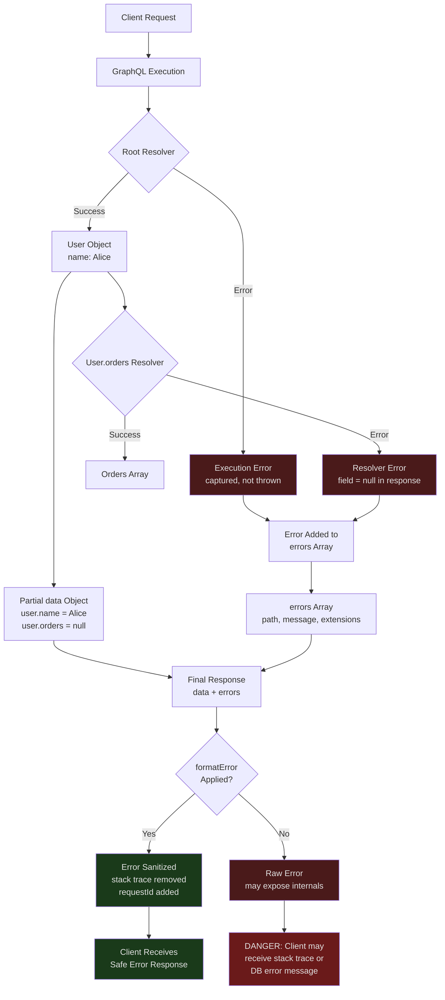

# Error Handling

> **Purpose:** Establish a complete, production-safe error handling strategy for GraphQL servers. This file covers the GraphQL error model (partial results, the `errors` array, error shape), error classification (who caused it, what to expose, what to mask), custom error classes, production-safe `formatError` configuration, the `userErrors` mutation pattern for expected business failures, error extensions for machine-readable error metadata, and the operational requirements for error logging, sampling, and alerting. GraphQL error handling has non-obvious failure modes — a misconfigured server can expose stack traces and database errors to clients, or silently swallow all errors into an unhelpful generic message.

---

## Learning Objectives

- [ ] Explain GraphQL's partial result model: how `data` and `errors` coexist in a single response
- [ ] Classify errors by cause (client vs. server), sensitivity, and appropriate HTTP status behavior
- [ ] Implement custom error classes that carry structured, safe metadata in `extensions`
- [ ] Configure Apollo Server's `formatError` to mask internal errors and log them server-side
- [ ] Apply the `userErrors` pattern to mutation responses for expected business failures
- [ ] Use `extensions.code` for client-side programmatic error handling
- [ ] Design an error logging strategy that captures full error context without leaking to clients
- [ ] Identify and prevent information disclosure vulnerabilities in GraphQL error responses

---

## Overview / Architecture

GraphQL error handling is architecturally different from REST error handling. In REST, a 500 response body is typically discarded by clients — the status code conveys the error. In GraphQL, the HTTP status is almost always 200, and errors are conveyed in the response body alongside (partial) data. This creates both a superpower (partial results) and a responsibility (errors must be safe to include in the response body).



---

## Core Concepts

### The GraphQL Error Model

A GraphQL response always has the shape:

```json
{
  "data": { ... },
  "errors": [ ... ]
}
```

Both fields are optional but at least one is always present. The `data` field contains the partial or complete result. The `errors` field contains an array of error objects, one per resolver that failed.

**Key insight:** `data` and `errors` coexist. A query that partially succeeds returns both:

```json
{
  "data": {
    "user": {
      "name": "Alice",
      "email": "alice@example.com",
      "orders": null
    }
  },
  "errors": [
    {
      "message": "Failed to fetch orders for user u-1",
      "locations": [{ "line": 5, "column": 5 }],
      "path": ["user", "orders"],
      "extensions": {
        "code": "ORDERS_SERVICE_UNAVAILABLE",
        "timestamp": "2024-01-15T10:30:00Z",
        "requestId": "req-abc-123"
      }
    }
  ]
}
```

The client received the user's name and email. The orders field failed and returned null (it is declared nullable in the schema). The client can display the user's profile while showing a "orders unavailable" message — this is fundamentally better than a REST 500 that returns nothing.

**The `path` field** identifies exactly which field in the query tree failed. Clients can use `path` to determine how to degrade gracefully — a failure at `["user", "orders"]` affects only the orders display; `["user"]` affects the entire user profile.

**Non-null fields and error propagation:** If a failing field is declared non-null (`orders: [Order!]!`), null cannot be substituted. The error propagates upward to the nearest nullable ancestor. If `user` is nullable, `user` becomes null and the error is recorded. If `user` is also non-null, the error propagates to the root and `data` becomes null. This is why non-null should be used conservatively — a single resolver failure can null out entire query subtrees.

### Error Classification

| Error Type | Cause | HTTP Status | Expose to Client? | Log Severity |
|---|---|---|---|---|
| Input validation error | Client sent invalid args | 200 | Yes (full message, field path) | No (expected) |
| Not-found error | Requested entity doesn't exist | 200 | Yes (type + ID safe to share) | No (expected) |
| Authentication error | No valid credential | 200 (or 401 via extension) | Code only | Maybe |
| Authorization error | Authenticated but lacks permission | 200 | Code only, no reason | Yes (warn) |
| Business rule violation | Valid input, but violates domain rule | 200 | Yes (via userErrors pattern) | No |
| Application bug | Unhandled exception in resolver | 200 | Generic message only | ALWAYS (error) |
| Infrastructure failure | DB down, timeout, OOM | 200 | Generic message + requestId | ALWAYS (error) |

---

## Real-World Implementation

### Custom Error Classes

Define a hierarchy of error classes that carry structured metadata and signal whether the error details are safe to expose to clients.

```javascript
// src/errors/index.js
import { GraphQLError } from 'graphql';

/**
 * Base class for all application-level GraphQL errors.
 * Errors that extend this class are considered "safe" — their messages
 * and extensions are appropriate to send to clients.
 *
 * Errors that do NOT extend this class (unexpected exceptions, DB errors, etc.)
 * are considered "unsafe" and must be masked by formatError before sending.
 */
export class AppError extends GraphQLError {
  constructor(message, extensions) {
    super(message, { extensions });
    this.isAppError = true;
  }
}

/**
 * Client sent invalid or malformed input.
 * Include the field path so the client can highlight the problematic form field.
 *
 * @example
 * throw new UserInputError('Email is not a valid email address', 'email');
 */
export class UserInputError extends AppError {
  constructor(message, field = null) {
    super(message, {
      code: 'USER_INPUT_ERROR',
      field,
    });
  }
}

/**
 * A requested resource does not exist.
 * Safe to include the type name and ID — the client requested these.
 *
 * @example
 * throw new NotFoundError('Product', id);
 */
export class NotFoundError extends AppError {
  constructor(type, id) {
    super(`${type} with ID '${id}' not found`, {
      code: 'NOT_FOUND',
      type,
      id,
    });
  }
}

/**
 * Request is not authenticated.
 * Do not include the reason for authentication failure
 * (do not distinguish between "no token", "expired token", "invalid signature").
 */
export class AuthenticationError extends AppError {
  constructor() {
    super('Authentication required', {
      code: 'UNAUTHENTICATED',
    });
  }
}

/**
 * Authenticated user lacks permission for this operation.
 * Do NOT include the reason for the authorization denial — explaining why
 * a client was denied permission is itself an information disclosure.
 */
export class ForbiddenError extends AppError {
  constructor() {
    super('You do not have permission to perform this action', {
      code: 'FORBIDDEN',
    });
  }
}

/**
 * Expected business rule violation — the request was valid, but the operation
 * cannot proceed due to a domain constraint.
 *
 * @example
 * throw new BusinessRuleError(
 *   'Cannot cancel an order that has already shipped',
 *   'ORDER_ALREADY_SHIPPED',
 *   { orderId: order.id }
 * );
 */
export class BusinessRuleError extends AppError {
  constructor(message, code, metadata = {}) {
    super(message, {
      code,
      ...metadata,
    });
  }
}

/**
 * A downstream service or infrastructure component is unavailable.
 * Safe to return to clients (generic message, requestId for correlation).
 * The originalError contains full details — logged server-side only.
 */
export class ServiceUnavailableError extends AppError {
  constructor(serviceName, originalError) {
    super(`${serviceName} is temporarily unavailable. Please try again.`, {
      code: 'SERVICE_UNAVAILABLE',
      service: serviceName,
    });
    // originalError is an Apollo Server/graphql-js field
    // It is NOT sent to the client — it's used internally for logging
    this.originalError = originalError;
  }
}

/**
 * Unexpected internal error. The originalError carries full details.
 * formatError will replace the message with a generic string before sending.
 *
 * Throw this when you catch an unexpected exception that should be
 * logged but not exposed.
 */
export class InternalServerError extends GraphQLError {
  constructor(originalError) {
    super('An internal server error occurred.', {
      extensions: { code: 'INTERNAL_SERVER_ERROR' },
      originalError,
    });
  }
}
```

### Error Masking with `formatError`

Apollo Server's `formatError` function is the last line of defense before an error is serialized into the response. It must:
1. Log the full error (with stack trace) to your logging infrastructure
2. Remove unsafe information from the error sent to the client
3. Add correlation metadata (requestId) to every error for client-side debugging

```javascript
// src/server.js
import { ApolloServer } from '@apollo/server';
import { AppError } from './errors';
import { logger } from './logger';

const server = new ApolloServer({
  schema,
  context: createContext,

  /**
   * formatError is called once for each error before it is serialized into
   * the HTTP response. It receives:
   *   - formattedError: the already-formatted GraphQLFormattedError object
   *   - error: the original error (may be a GraphQLError or a wrapped Error)
   *
   * IMPORTANT: formattedError.extensions may already contain some fields.
   * Always return a new object — do not mutate formattedError.
   */
  formatError: (formattedError, error) => {
    // Unwrap to get the original error
    const originalError = error.originalError ?? error;

    // Always log the full error server-side, regardless of what we return to the client
    logger.error({
      msg: 'graphql.resolver.error',
      errorCode: formattedError.extensions?.code,
      path: formattedError.path,
      message: originalError.message,
      stack: originalError.stack,
      // requestId comes from the extensions if set by the resolver middleware
      requestId: formattedError.extensions?.requestId,
    });

    // AppErrors are safe — their message and extensions were authored by us
    if (originalError instanceof AppError || originalError?.isAppError) {
      return {
        ...formattedError,
        // Ensure requestId is always included for client-side support queries
        extensions: {
          ...formattedError.extensions,
          requestId: formattedError.extensions?.requestId ?? 'unknown',
        },
      };
    }

    // GraphQL validation errors (wrong type, missing required field) — safe to return
    if (formattedError.extensions?.code === 'GRAPHQL_VALIDATION_FAILED') {
      return formattedError;
    }

    // Parse errors (malformed query document) — safe to return
    if (formattedError.extensions?.code === 'GRAPHQL_PARSE_FAILED') {
      return formattedError;
    }

    // Everything else: unexpected error, database error, network error, etc.
    // Strip all details and return a generic message with just the requestId
    return {
      message: 'An unexpected error occurred.',
      locations: formattedError.locations,
      path: formattedError.path,
      extensions: {
        code: 'INTERNAL_SERVER_ERROR',
        requestId: formattedError.extensions?.requestId ?? 'unknown',
      },
    };
  },
});
```

### Adding `requestId` to Error Extensions via Middleware

To include `requestId` in error extensions automatically (without setting it in every throw), use resolver middleware:

```javascript
// src/middleware/request-id-middleware.js
export const requestIdMiddleware = async (resolve, parent, args, context, info) => {
  try {
    return await resolve(parent, args, context, info);
  } catch (error) {
    // Attach requestId to error extensions before formatError sees it
    if (error instanceof GraphQLError) {
      error.extensions = {
        ...error.extensions,
        requestId: context.requestId,
      };
    }
    throw error;
  }
};
```

### The `userErrors` Pattern for Mutations

For expected business failures in mutations — validation errors, inventory issues, permission denials that vary by business state — throw is the wrong tool. Throwing creates an entry in the `errors` array, which signals a server problem to client tooling. Expected failures belong in the mutation response type.

**Schema definition:**

```graphql
type UserError {
  # The field path that caused the error, e.g., ["input", "email"]
  field: [String!]
  message: String!
  code: String!
}

type CreateOrderPayload {
  order: Order
  userErrors: [UserError!]!
}

type Mutation {
  createOrder(input: CreateOrderInput!): CreateOrderPayload!
}
```

**Resolver implementation:**

```javascript
// resolvers/mutations/createOrder.js
import { validateOrderInput } from '../../validation/order';
import { InternalServerError } from '../../errors';

export async function createOrder(_, { input }, context) {
  // Step 1: Validate input fields
  const validationErrors = validateOrderInput(input);
  if (validationErrors.length > 0) {
    // Return validation errors as userErrors — not as thrown errors
    return {
      order: null,
      userErrors: validationErrors.map(err => ({
        field: err.path,          // ['input', 'email'] or ['input', 'items', '0', 'quantity']
        message: err.message,
        code: 'VALIDATION_ERROR',
      })),
    };
  }

  // Step 2: Check business rules (inventory, order limits, etc.)
  const [inventoryResults, orderLimitOk] = await Promise.all([
    context.inventoryService.checkAvailability(input.lineItems),
    context.orderService.checkDailyLimit(context.user.id),
  ]);

  const inventoryErrors = inventoryResults
    .filter(r => !r.available)
    .map((r, i) => ({
      field: ['input', 'lineItems', String(i), 'quantity'],
      message: `Only ${r.availableCount} units of "${r.productTitle}" are available`,
      code: 'INSUFFICIENT_INVENTORY',
    }));

  if (!orderLimitOk) {
    inventoryErrors.push({
      field: null,
      message: 'Daily order limit reached. Try again tomorrow.',
      code: 'ORDER_LIMIT_EXCEEDED',
    });
  }

  if (inventoryErrors.length > 0) {
    return { order: null, userErrors: inventoryErrors };
  }

  // Step 3: Execute the mutation
  try {
    const order = await context.orderService.create({
      userId: context.user.id,
      lineItems: input.lineItems,
      shippingAddressId: input.shippingAddressId,
    });

    return { order, userErrors: [] };
  } catch (error) {
    // Unexpected error — log internally, return safe message as userError
    context.logger.error({
      msg: 'order.creation.failed',
      error: error.message,
      stack: error.stack,
      userId: context.user.id,
    });

    return {
      order: null,
      userErrors: [{
        field: null,
        message: 'Order creation failed due to a server error. Please try again.',
        code: 'ORDER_CREATION_FAILED',
      }],
    };
  }
}
```

**Client usage:**

```javascript
// Client-side error handling with userErrors pattern
const { data } = await client.mutate({ mutation: CREATE_ORDER, variables: { input } });

if (data.createOrder.userErrors.length > 0) {
  for (const err of data.createOrder.userErrors) {
    if (err.field) {
      // Show field-specific error in the form
      setFieldError(err.field.join('.'), err.message);
    } else {
      // Show a toast/banner for non-field errors
      showErrorBanner(err.message);
    }
  }
  return; // Do not proceed with success flow
}

// Success path
handleOrderSuccess(data.createOrder.order);
```

### Error Extensions

Extensions carry machine-readable metadata that clients can use for programmatic error handling — switching on `extensions.code` rather than pattern-matching error message strings.

```javascript
// Retryable error with retry guidance
throw new GraphQLError('Rate limit exceeded', {
  extensions: {
    code: 'RATE_LIMITED',
    retryAfterMs: 5000,
    retryAfterTimestamp: new Date(Date.now() + 5000).toISOString(),
    limit: 100,
    remaining: 0,
    resetAt: new Date(Date.now() + 60000).toISOString(),
  },
});

// Payment error with actionable context
throw new GraphQLError('Payment method declined', {
  extensions: {
    code: 'PAYMENT_DECLINED',
    declineReason: 'insufficient_funds',     // Safe: standard Stripe decline code
    retryable: false,
    actionRequired: 'UPDATE_PAYMENT_METHOD',
    transactionId: txn.id,                  // For receipt/support correlation
  },
});

// Multi-field validation with per-field errors in a single GraphQLError
throw new GraphQLError('Input validation failed', {
  extensions: {
    code: 'VALIDATION_FAILED',
    validationErrors: [
      { field: ['email'], message: 'Invalid email format', code: 'INVALID_FORMAT' },
      { field: ['password'], message: 'Password must be at least 12 characters', code: 'TOO_SHORT' },
    ],
  },
});
```

**Standard error codes to implement across your API:**

| Code | Meaning | Client Action |
|---|---|---|
| `UNAUTHENTICATED` | No valid auth credential | Redirect to login |
| `FORBIDDEN` | Authenticated but lacks permission | Show permission error |
| `NOT_FOUND` | Requested entity does not exist | Show 404 state |
| `USER_INPUT_ERROR` | Input failed validation | Highlight form field |
| `RATE_LIMITED` | Too many requests | Wait and retry |
| `SERVICE_UNAVAILABLE` | Downstream service down | Show maintenance message |
| `INTERNAL_SERVER_ERROR` | Unexpected server error | Show generic error + requestId |
| `CONFLICT` | Operation conflicts with current state | Refresh and retry |

### Handling Errors in Subscriptions

Subscription resolvers have a different error model. An unhandled error in a subscription resolver terminates the subscription stream. Use try/catch within the subscription's async generator to emit errors gracefully:

```javascript
const Subscription = {
  orderStatusUpdated: {
    subscribe: async function* (_, { orderId }, context) {
      if (!context.user) {
        throw new AuthenticationError(); // Terminates the subscription
      }

      const order = await context.db.orders.findUnique({ where: { id: orderId } });
      if (!order || order.userId !== context.user.id) {
        throw new ForbiddenError();
      }

      // Yield events as they arrive
      for await (const event of context.pubsub.subscribe(`order.${orderId}`)) {
        try {
          yield { orderStatusUpdated: event };
        } catch (error) {
          // Log but continue — don't terminate the stream for a single event failure
          context.logger.error({
            msg: 'subscription.event.error',
            orderId,
            error: error.message,
          });
        }
      }
    },
  },
};
```

---

## Production Considerations

### Performance

`formatError` runs synchronously on every error in every response. Keep it fast: no database queries, no HTTP calls, no synchronous `JSON.stringify` of large objects. If you need to do asynchronous work on errors (e.g., writing to a separate error tracking service like Sentry), do it fire-and-forget from within `formatError` — do not await it.

```javascript
formatError: (formattedError, error) => {
  // Async fire-and-forget to Sentry — do not await
  if (shouldReportToSentry(error)) {
    Sentry.captureException(error.originalError ?? error, {
      extra: { path: formattedError.path, requestId: formattedError.extensions?.requestId },
    }).catch(() => {}); // Ignore Sentry failures — don't fail the request
  }

  // Synchronous return — formatError must complete synchronously
  return sanitizeError(formattedError, error);
}
```

### Security

**Never expose these in production error responses:**
- Stack traces (`error.stack`) — reveal file system paths, library versions, internal function names
- Database error messages (`PrismaClientKnownRequestError`, `SQLITE_CONSTRAINT`) — reveal schema and query structure
- SQL queries — reveal table names, column names, query patterns; potential SQL injection assistance
- Internal IDs for resources the user should not know exist (reveals object existence via error messages)
- File system paths (from import errors, `require` failures)
- Environment variable values (from misconfigured checks like `if (!process.env.API_KEY)`)

**Check your error response in production:**

```bash
# Query a resolver that will throw an unexpected error
# Examine the response carefully for any of the above fields
curl -X POST https://api.yourdomain.com/graphql \
  -H "Content-Type: application/json" \
  -d '{"query": "{ __typename }"}'

# A safe response looks like:
# {
#   "errors": [{
#     "message": "An unexpected error occurred.",
#     "extensions": { "code": "INTERNAL_SERVER_ERROR", "requestId": "req-abc" }
#   }]
# }
```

**Authorization error messages:** Do not explain why authorization failed. `"You cannot view payment methods for other users"` tells an attacker which field to target and confirms that payment methods exist on the type. `"You do not have permission to perform this action"` is sufficient.

### Scaling

**Error log volume during incidents.** When a database goes down, every resolver that queries it throws. A high-traffic API can produce millions of error log entries per minute during an incident, overwhelming your log aggregation system (Loki, Cloudwatch Logs, Datadog). Implement log sampling for high-frequency errors:

```javascript
// Track recent error codes to implement sampling
const errorRateLimiter = new Map(); // code -> { count, windowStart }

function shouldLogError(code) {
  const now = Date.now();
  const window = 10_000; // 10 second window
  const maxPerWindow = 100; // Log at most 100 errors per code per 10 seconds

  const entry = errorRateLimiter.get(code) ?? { count: 0, windowStart: now };

  if (now - entry.windowStart > window) {
    // New window — reset counter
    errorRateLimiter.set(code, { count: 1, windowStart: now });
    return true;
  }

  entry.count++;
  errorRateLimiter.set(code, entry);

  if (entry.count <= maxPerWindow) return true;

  // Sampled out — log a summary every 1000 errors
  if (entry.count % 1000 === 0) {
    logger.warn({
      msg: 'error.sampling.active',
      code,
      droppedCount: entry.count - maxPerWindow,
    });
  }

  return false;
}
```

### Observability

Error rates by `extensions.code` are the primary health signal for a GraphQL API. Track these in your metrics system:

```javascript
// Prometheus/StatsD counter per error code
formatError: (formattedError, error) => {
  const code = formattedError.extensions?.code ?? 'UNKNOWN';
  const field = formattedError.path?.join('.') ?? 'unknown';

  // Increment counter with code and field labels
  metrics.increment('graphql.errors.total', {
    code,
    field,
    operation: formattedError.extensions?.operationName ?? 'unknown',
  });

  // ... sanitization and return
}
```

**Alert thresholds:**

| Metric | Alert Condition |
|---|---|
| `graphql.errors.total{code="INTERNAL_SERVER_ERROR"}` | > 1% of requests |
| `graphql.errors.total{code="SERVICE_UNAVAILABLE"}` | > 0.5% of requests |
| `graphql.errors.total{code="UNAUTHENTICATED"}` | Sudden spike (may indicate token expiry bug) |
| `graphql.errors.total{code="FORBIDDEN"}` | Sustained high rate (may indicate authorization regression) |

---

## Best Practices

1. **Separate the error taxonomy into safe (AppError subclasses) and unsafe (everything else).** This binary classification drives the `formatError` decision tree. Safe errors are surfaced with their full message and extensions. Unsafe errors are masked. Adding a new error type requires explicitly deciding which category it belongs to — preventing accidental exposure of internal errors.

2. **Use `userErrors` for all expected business failures in mutations.** Thrown errors in the `errors` array signal server problems to GraphQL client tooling, CI/CD health checks, and monitoring dashboards. A user entering an invalid email is not a server problem — it is expected business logic. Return it in the payload type so it is handled as data, not as an error.

3. **Include `requestId` in every error extension.** When a user encounters an error, they should be able to provide a `requestId` to your support team, who can use it to find the corresponding log entry with the full error details. Without this correlation mechanism, debugging customer-reported errors requires reconstructing the request from external signals (timestamp, user ID, endpoint) which is slow and unreliable.

4. **Never distinguish between "entity not found" and "entity exists but you cannot see it" in error messages.** If a user requests `user(id: "u-1")` and that user exists but the requester cannot see it, return `NotFoundError('User', 'u-1')` — the same response as if the user did not exist. Returning `ForbiddenError` for an existing entity and `NotFoundError` for a non-existing entity leaks entity existence information, which can be a significant information disclosure in some domains (e.g., private user profiles).

5. **Test error masking explicitly.** Write integration tests that trigger each error class and verify that the response body does not contain stack traces, database messages, or internal identifiers. `formatError` misconfiguration is easy and silently catastrophic — an `if/else` branch in the wrong order can expose internals for a category of errors you thought was masked.

---

## Anti-Patterns

### 1. Returning `null` Silently on Error

**Failure:** Catching an error inside a resolver and returning `null` without recording the error anywhere. The client receives `null` for the field with no indication that a failure occurred. The failure is invisible in logs, metrics, and the response.

```javascript
// BROKEN: Silent null on error — client and operators have no visibility
User: {
  orders: async (user, _, context) => {
    try {
      return await context.loaders.ordersByUserId.load(user.id);
    } catch (error) {
      return null; // ← ERROR SWALLOWED
    }
  }
}
```

**Fix:** Re-throw the error (let it propagate into the `errors` array) or throw a classified error that logs properly. If `null` is the correct fallback for non-critical data, log the error before returning null:

```javascript
User: {
  orders: async (user, _, context) => {
    try {
      return await context.loaders.ordersByUserId.load(user.id);
    } catch (error) {
      context.logger.error({ msg: 'user.orders.fetch.failed', userId: user.id, error: error.message });
      throw new ServiceUnavailableError('OrdersService', error);
    }
  }
}
```

### 2. Exposing Raw Database Errors to Clients

**Failure:** Not configuring `formatError`, or configuring it incorrectly so that Prisma/PostgreSQL error messages reach the client response. These messages contain table names, column names, constraint names, and query fragments.

**What the client sees without `formatError`:**

```json
{
  "errors": [{
    "message": "Invalid `prisma.orders.findMany()` invocation:\nUnique constraint failed on the fields: (`userId`,`productId`)",
    "extensions": {
      "code": "INTERNAL_SERVER_ERROR",
      "exception": {
        "clientVersion": "5.7.1",
        "meta": { "target": ["userId", "productId"] }
      }
    }
  }]
}
```

**Fix:** Implement `formatError` that catches all non-AppError instances and replaces their message with a generic string. Test this in a staging environment with every known error code from your ORM.

### 3. Leaking Entity Existence via Error Type

**Failure:** Returning a `ForbiddenError` for resources the user is not allowed to see, and `NotFoundError` for resources that genuinely don't exist. This allows clients to enumerate objects by ID and distinguish "exists but I can't see it" from "doesn't exist" — an object enumeration vulnerability.

```javascript
// BROKEN: Tells attacker whether the user exists
async function user(_, { id }, context) {
  const user = await context.db.users.findUnique({ where: { id } });
  if (!user) throw new NotFoundError('User', id);
  if (!canViewUser(context.user, user)) throw new ForbiddenError(); // Attacker: "it exists!"
  return user;
}
```

**Fix:** Combine the existence and permission check into a single response. Treat "forbidden" as "not found" for non-admin callers.

```javascript
// CORRECT: Same response whether the user doesn't exist or isn't visible
async function user(_, { id }, context) {
  const user = await context.db.users.findUnique({ where: { id } });
  if (!user || !canViewUser(context.user, user)) {
    throw new NotFoundError('User', id); // Same error either way
  }
  return user;
}
```

### 4. Using HTTP Status Codes to Signal GraphQL Errors

**Failure:** Configuring the HTTP layer to return non-200 status codes for resolver errors (returning 500 for internal errors, 401 for auth errors, etc.). While this feels "correct" from a REST perspective, it breaks GraphQL clients that always expect 200 and read errors from the response body.

GraphQL responses should use HTTP 200 for all resolver-level errors. HTTP non-200 is appropriate only for:
- `400 Bad Request` — malformed JSON in the request body (not a valid GraphQL request)
- `405 Method Not Allowed` — non-POST/GET method to the GraphQL endpoint
- `401 Unauthorized` — missing or invalid HTTP-level authentication before the request reaches GraphQL (network gateway, JWT validation middleware)

Any error that makes it into resolver execution should be returned as HTTP 200 with an `errors` array. This is the GraphQL specification's intended behavior and is what GraphQL client libraries expect.

---

## Operational Notes

**Error budget tracking.** Establish an SLO on `INTERNAL_SERVER_ERROR` rate (e.g., < 0.1% of all resolver executions). Track this as an error budget. When the budget is burning, stop feature work and focus on reliability. Use the `extensions.code` metric (see Production Considerations > Observability) as the SLO indicator.

**Sentry / error tracking integration.** Connect your `formatError` to Sentry or Honeybadger for automatic error grouping and alerting. Group by `extensions.code` + `path` combination — this surfaces which specific resolver fields are failing at what rate. Without `path`, all GraphQL errors appear as a single noisy group in Sentry.

**User-facing error message quality.** Review all `userErrors` messages and `AppError` messages with your product team. Error messages are user experience. `"INVALID_INPUT"` as an error message (code as message) is a developer error. `"Email must be a valid email address."` is a user-facing message. Every error message that reaches a user interface should be reviewed by UX/copy.

**Schema introspection and error messages.** Disable introspection in production for unauthenticated requests. A client that can introspect your schema and then probe for errors that reveal field names and type names has a much easier path to information disclosure. Set `introspection: process.env.NODE_ENV !== 'production'` in Apollo Server, or use an allowlist-based introspection permission check.

---

## References

- [GraphQL Specification — Errors](https://spec.graphql.org/October2021/#sec-Errors)
- [Apollo Server: Error handling](https://www.apollographql.com/docs/apollo-server/data/errors/)
- [graphql-js: GraphQLError](https://github.com/graphql/graphql-js/blob/main/src/error/GraphQLError.ts)
- [Shopify GraphQL Design Tutorial: userErrors pattern](https://shopify.engineering/graphql-pagination-with-relative-cursors)
- [OWASP: Error Handling Cheat Sheet](https://cheatsheetseries.owasp.org/cheatsheets/Error_Handling_Cheat_Sheet.html)
- [Sentry: Apollo Server Integration](https://docs.sentry.io/platforms/javascript/guides/apollo/)
- [OpenTelemetry: Span Status codes](https://opentelemetry.io/docs/specs/otel/trace/api/#set-status)

---

## Related Topics

- [README.md](./README.md) — Folder overview and reading guide
- [01-resolver-patterns.md](./01-resolver-patterns.md) — Resolver architecture, context design
- [02-resolver-optimization.md](./02-resolver-optimization.md) — Performance; errors that occur during optimization
- [../05-security/README.md](../05-security/README.md) — Authorization patterns, field-level security
- [../14-observability/README.md](../14-observability/README.md) — Error metrics, alerting, distributed tracing
- [../26-production-failure-scenarios/README.md](../26-production-failure-scenarios/README.md) — Real production incidents involving error handling gaps
