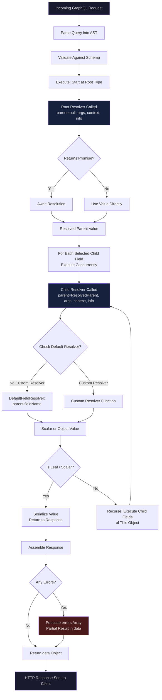

# Resolvers and Execution

> **Purpose:** This folder covers the resolver layer — the operational core of every GraphQL server. Resolvers are the functions that translate a parsed, validated query into actual data. They are also where 90% of GraphQL performance problems, N+1 query bugs, authorization gaps, and error-handling failures originate. Understanding resolvers at the implementation, optimization, and operational level is non-negotiable for any engineer shipping GraphQL to production.

---

## Why Resolvers Are the Critical Path

The GraphQL execution engine is elegant in design: given a query, it walks the selection set tree and calls the corresponding resolver function for each field. Each resolver can return a scalar, an object, or a promise. The engine waits for all promises at each tree level before proceeding to child fields. This model is simple and powerful.

It is also a trap for the unprepared.

Because the execution engine calls one resolver per field, and fields often require database lookups, a query that fetches a list of 100 users and then accesses the `orders` field for each user will by default trigger 101 database queries: one to fetch the users, and one per user to fetch their orders. This is the N+1 problem. It does not announce itself in development (where datasets are small) and it can bring a production database to its knees overnight.

Beyond performance, the resolver is also where access control decisions are made (or silently skipped), where internal error messages are either safely masked or leaked to clients, and where context values like the authenticated user are either used correctly or ignored. Every security review of a GraphQL API focuses primarily on resolvers.

**What goes wrong at the resolver layer:**

- N+1 database queries from missing or misconfigured DataLoader integration
- Context object not populated with necessary DataLoaders, causing synchronous database calls inside resolver loops
- Authorization checks that depend on `parent` values (which can be client-influenced) rather than verified context
- Unhandled promise rejections causing entire query subtrees to return null silently
- Stack traces and database error messages surfaced to clients in production
- DataLoader instances created inside resolvers (not in context) defeating batching entirely
- Resolver functions that acquire database connections directly instead of pooling through context

---

## Folder Contents

This folder covers three layered topics, intended to be read in order.

| File | Topic | Description |
|---|---|---|
| `01-resolver-patterns.md` | Resolver Architecture | Resolver function contract, default resolvers, root vs. type resolvers, context design, abstract type resolution, look-ahead optimization, resolver middleware |
| `02-resolver-optimization.md` | Performance Optimization | Measuring resolver latency, DataLoader production patterns, field projection, resolver-level caching with Redis, deferred resolution |
| `03-error-handling.md` | Error Handling | GraphQL error model, error classification, error masking, userErrors mutation pattern, error extensions, production safety |

---

## Prerequisites

This folder assumes familiarity with:

- **docs/01-graphql-fundamentals** — schema definition, type system, query execution model, selection sets
- **docs/02-graphql-internals** — particularly the DataLoader deep dive (batching, caching, per-request instantiation) and the execution pipeline (parse → validate → execute)

If you have not read the DataLoader documentation in docs/02, read it before `02-resolver-optimization.md`. DataLoader's batching model is the foundational technique for eliminating N+1 problems, and the optimization guide assumes you understand how it works.

---

## Key Concepts at a Glance

**Resolver Function Signature**

Every resolver receives four arguments:

```
(parent, args, context, info) => result | Promise<result>
```

- `parent` — the value returned by the parent resolver (null for root fields)
- `args` — client-provided field arguments
- `context` — request-scoped shared object (auth, DataLoaders, DB, logger)
- `info` — schema and query metadata (field name, return type, selection set)

**Resolver Lifecycle**

Each field in a query has its own resolver. The execution engine walks the query tree depth-first, calling each resolver and collecting results. Sibling resolvers at the same level execute concurrently. Child resolvers begin only after their parent resolves.

**Context Object**

The context is created once per request and injected into every resolver. It is the correct place for request-scoped state: the authenticated user, DataLoader instances, database connections, structured loggers with request IDs, and feature flags. It must never carry state that persists across requests.

**DataLoader Integration**

DataLoaders must be instantiated in the context factory (once per request), not inside resolver functions. A DataLoader created inside a resolver function creates a new cache and batch buffer per resolver invocation, defeating the entire batching mechanism.

---

## Resolver Execution Lifecycle



---

## Reading Guide

**New to GraphQL server implementation?**
Read `01-resolver-patterns.md` start to finish, paying special attention to the context factory pattern and abstract type resolution. Then read `03-error-handling.md` before touching production code.

**Diagnosing N+1 or slow query problems?**
Go directly to `02-resolver-optimization.md`. The DataLoader placement section and the measuring resolver performance section address the most common causes.

**Conducting a security review?**
Read `01-resolver-patterns.md` (authorization anti-patterns) and `03-error-handling.md` (error masking) in combination. These two files cover the attack surface at the resolver layer.

**Platform engineers designing a GraphQL platform?**
Read all three files. The context factory design in `01-resolver-patterns.md`, the observability instrumentation in `02-resolver-optimization.md`, and the `formatError` configuration in `03-error-handling.md` are the three mandatory platform-level concerns.

---

## Related Topics

- [docs/02-graphql-internals](../02-graphql-internals/README.md) — DataLoader internals, execution pipeline
- [docs/03-schema-design](../03-schema-design/README.md) — Schema design, nullability, type design
- [docs/05-security](../05-security/README.md) — Authorization patterns, field-level security
- [docs/06-performance-and-scaling](../06-performance-and-scaling/README.md) — Caching, rate limiting, query complexity
- [docs/14-observability](../14-observability/README.md) — OpenTelemetry, distributed tracing for resolvers
