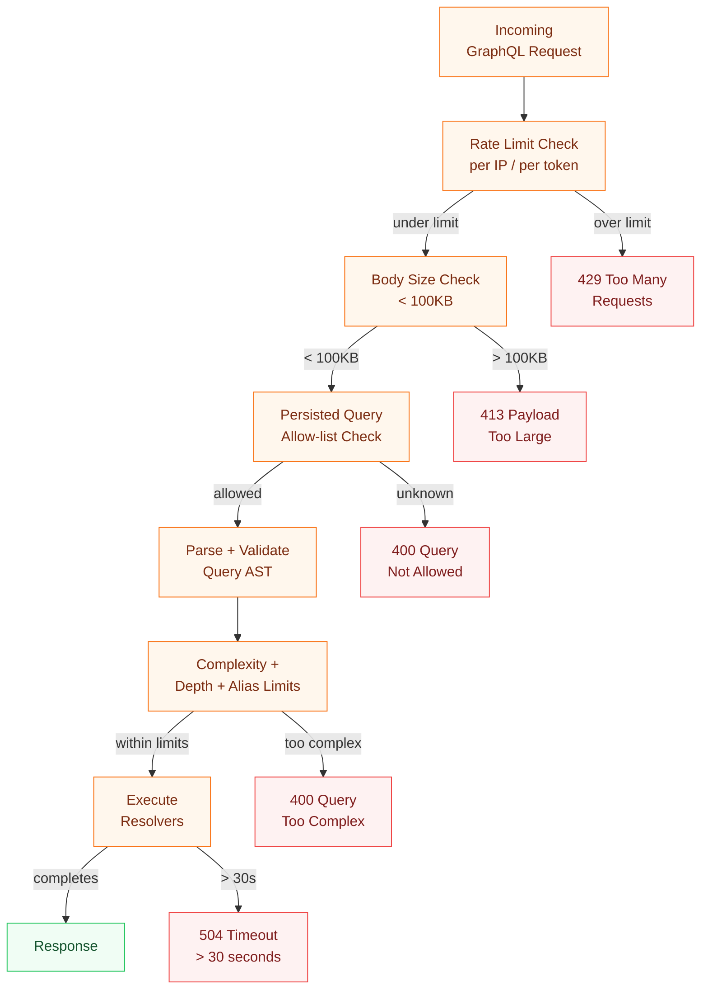

# GraphQL Attack Vectors and Defense

> **Purpose:** GraphQL's expressive query language is both its power and its attack surface. Understanding how attackers abuse query complexity, introspection, batching, and subscriptions — and how to defend each vector — is non-negotiable for production systems.

## Learning Objectives

- [ ] Explain how complexity bombs differ from simple query depth attacks and why depth limits alone are insufficient
- [ ] Configure `graphql-armor` and Apollo Router to enforce multi-dimensional rate limits
- [ ] Disable introspection in production without breaking schema-aware tooling
- [ ] Identify batching abuse patterns and implement per-query and per-IP limits
- [ ] Describe the circular fragment DoS and how fragment depth limits prevent it
- [ ] Implement subscription flood protection with connection-level rate limiting

---

## Overview / Architecture

GraphQL's contract with clients is generous: a single endpoint accepts arbitrarily nested queries, supports introspection of the full type system, allows batched requests, and (for subscriptions) maintains persistent connections. Each of these features maps directly to an attack surface.

The canonical incident: in 2021, a major social platform's GraphQL API accepted queries with 10,000 nested fields. A single request triggered 47,000 database round-trips, saturating the connection pool for 18 minutes. Depth limits were in place (they blocked queries deeper than 12 levels) but the attack used width — 100 fields at each level — which bypassed depth checking entirely. Complexity-based limits would have blocked it in under 1ms.

The defense model has three layers:

1. **Pre-parsing gate** — reject requests before they reach the parser (rate limiting, persisted query allow-list, body size limits)
2. **Post-parsing, pre-execution gate** — validate the query AST (complexity, depth, alias count, directive count)
3. **Execution-time gate** — enforce authorization, timeout, and field-level access control as resolvers run

All three layers are necessary. Skipping any one means attackers can pivot to the undefended layer.



---

## Core Concepts

### Complexity Bombs

A complexity bomb is a query crafted to maximize server-side work per byte of request. The simplest form abuses connection fields:

```graphql
# This query generates O(depth^width) database lookups
{
  users(first: 100) {
    friends(first: 100) {
      orders(first: 100) {
        lineItems(first: 100) {
          product {
            reviews(first: 100) {
              author {
                name
              }
            }
          }
        }
      }
    }
  }
}
```

100 users × 100 friends × 100 orders × 100 lineItems × 100 reviews = 10 billion potential resolver calls. Even with DataLoader, the query plan is catastrophic.

**Complexity scoring** assigns a cost to each field. Connection fields get `first` × child_cost. A `users(first: 100)` field with child cost 5 scores 500. The router rejects queries exceeding a total threshold.

### Depth Limits

Depth limits cap how deeply nested a query can be. A depth of 8 means at most 8 levels of field selection. This blocks naive recursive queries but not width attacks (the above example could be rewritten to stay within depth 5 while still generating millions of lookups).

**Use depth limits AND complexity limits together.** Neither alone is sufficient.

### Alias Amplification

GraphQL allows clients to alias the same field multiple times in a single query:

```graphql
{
  a1: user(id: "1") { name }
  a2: user(id: "1") { name }
  a3: user(id: "1") { name }
  # ... repeat 1000 times
}
```

Each alias executes the resolver separately. Alias count limits (default 15–30 in most implementations) prevent this.

### Introspection as Reconnaissance

The GraphQL introspection system (`__schema`, `__type`, `__typename`) is a complete API inventory. In development it enables powerful tooling. In production it tells attackers:

- Every type, field, argument, and input type
- Deprecated fields (often contain security-relevant implementation hints)
- Which mutations exist and their exact input shapes

The canonical attack is schema-guided IDOR: introspect to find all ID-typed arguments, then probe them with sequential integers to discover accessible objects.

### Batching Abuse

The GraphQL spec allows sending an array of operations in a single HTTP request:

```json
[
  { "query": "mutation { login(email: \"a@b.com\", password: \"pass1\") { token } }" },
  { "query": "mutation { login(email: \"a@b.com\", password: \"pass2\") { token } }" },
  { "query": "mutation { login(email: \"a@b.com\", password: \"pass3\") { token } }" }
]
```

1000 mutations in a single HTTP request bypasses per-request rate limiting. The server sees one request; the application sees 1000 login attempts.

### Circular Fragment DoS

Circular fragments are a spec violation, but parsers that don't check for them before following references can stack overflow:

```graphql
fragment A on User {
  friends {
    ...B
  }
}

fragment B on User {
  friends {
    ...A
  }
}

query {
  me {
    ...A
  }
}
```

Well-implemented parsers detect circular references in O(n) time. The defense is in the validator, not the executor.

---

## Real-World Implementation

### graphql-armor Configuration (Node.js)

```typescript
import { ApolloServer } from '@apollo/server';
import { GraphQLArmorPlugin } from '@escape.tech/graphql-armor';

const armor = new GraphQLArmorPlugin({
  costLimit: {
    enabled: true,
    maxCost: 5000,           // reject queries scoring above 5000
    objectCost: 1,           // base cost per object field
    scalarCost: 0,           // scalars are free
    depthCostFactor: 1.5,   // each nesting level multiplies cost
    ignoreIntrospection: true,
  },
  maxDepth: {
    enabled: true,
    n: 8,                   // reject queries deeper than 8 levels
    ignoreIntrospection: true,
  },
  maxAliases: {
    enabled: true,
    n: 15,                  // reject queries with > 15 aliases
    allowList: [],
  },
  maxDirectives: {
    enabled: true,
    n: 50,
  },
  maxTokens: {
    enabled: true,
    n: 1000,                // lexer token count limit
  },
  blockFieldSuggestions: {
    enabled: true,          // disable "Did you mean X?" in errors (prevents enumeration)
    mask: '[REDACTED]',
  },
});

const server = new ApolloServer({
  typeDefs,
  resolvers,
  plugins: [armor],
});
```

### Apollo Router: Complexity + Introspection Config

```yaml
# router.yaml
limits:
  max_depth: 8
  max_height: 200          # total field count across all levels
  max_root_fields: 20      # top-level fields in a single query
  max_aliases: 15

# Disable introspection in production
supergraph:
  introspection: false

# Per-operation rate limiting
traffic_shaping:
  router:
    global_rate_limit:
      capacity: 1000        # max concurrent requests
      interval: 1s
  all:
    global_rate_limit:
      capacity: 500
      interval: 1s
```

### Disabling Introspection Selectively

Disable introspection for unauthenticated requests while keeping it for internal tools:

```typescript
import { NoSchemaIntrospectionCustomRule } from 'graphql';

const server = new ApolloServer({
  typeDefs,
  resolvers,
  validationRules: (requestContext) => {
    // Allow introspection for internal network requests only
    const isInternal = requestContext.request.http?.headers
      .get('x-internal-token') === process.env.INTERNAL_TOKEN;
    
    if (!isInternal && process.env.NODE_ENV === 'production') {
      return [NoSchemaIntrospectionCustomRule];
    }
    return [];
  },
});
```

### Batching Limits

```typescript
import { ApolloServer } from '@apollo/server';
import { ApolloServerPluginLandingPageDisabled } from '@apollo/server/plugin/disabled';

const server = new ApolloServer({
  typeDefs,
  resolvers,
  allowBatchedHttpRequests: false, // disable entirely, OR:
});

// If batching is required for legitimate use:
// Use apollo-server-express with express-rate-limit:
import rateLimit from 'express-rate-limit';

const limiter = rateLimit({
  windowMs: 60 * 1000,         // 1 minute
  max: 100,                    // 100 requests per IP per minute
  keyGenerator: (req) => {
    // Rate limit per authenticated user, not just IP
    return req.headers['x-user-id'] || req.ip;
  },
  handler: (req, res) => {
    res.status(429).json({
      errors: [{ message: 'Rate limit exceeded. Retry after 60 seconds.' }],
    });
  },
});

app.use('/graphql', limiter);
```

### Subscription Flood Protection

```yaml
# router.yaml
subscriptions:
  enabled: true
  max_opened_subscriptions: 100   # per connection
  deduplication_enabled: true    # deduplicate identical subscription queries

# Apollo Router websocket limits (via plugin):
websocket:
  max_connections: 10000
  ping_interval: 30s
  ping_timeout: 5s
```

```typescript
// Custom subscription server with per-user connection tracking:
import { useServer } from 'graphql-ws/lib/use/ws';
import { WebSocketServer } from 'ws';

const connectionCounts = new Map<string, number>();
const MAX_CONNECTIONS_PER_USER = 5;

const wss = new WebSocketServer({ port: 4001 });

useServer(
  {
    schema,
    onConnect: async (ctx) => {
      const userId = await validateToken(ctx.connectionParams?.authorization);
      const count = connectionCounts.get(userId) ?? 0;
      
      if (count >= MAX_CONNECTIONS_PER_USER) {
        throw new Error('Too many subscription connections. Disconnect other clients first.');
      }
      
      connectionCounts.set(userId, count + 1);
      return { userId };
    },
    onDisconnect: (ctx) => {
      const userId = ctx.extra?.userId;
      if (userId) {
        const count = connectionCounts.get(userId) ?? 1;
        connectionCounts.set(userId, Math.max(0, count - 1));
      }
    },
  },
  wss
);
```

---

## Production Considerations

### Performance

Complexity analysis runs on every request after parsing. In practice this adds < 0.5ms on even large queries — well within acceptable overhead. The complexity scorer traverses the query AST once in O(n) where n is the number of fields.

Set thresholds based on real production query analysis:

```bash
# Use Apollo Studio or graphql-inspector to analyze your top 1000 queries:
rover graph introspect http://localhost:4000 | \
  graphql-inspector analyze --operations ./operations/ --complexity
```

### Security

**Never return schema suggestions in production.** The "Did you mean X?" error message in field-not-found errors reveals type information. Disable with `blockFieldSuggestions` in graphql-armor or custom error formatting:

```typescript
const server = new ApolloServer({
  formatError: (error) => {
    // Strip schema suggestions from error messages
    const message = error.message.replace(/Did you mean ".+"\?/g, '');
    return { ...error, message };
  },
});
```

**Log all rejected queries.** Complexity rejections and introspection attempts are security events. Route them to your SIEM.

### Scaling

Complexity limits should be configured identically across all router instances. Use environment variables or a configuration management system — do not hardcode thresholds in code.

### Observability

Instrument every security gate:

```typescript
// Emit metrics for each rejection type:
meter.createCounter('graphql.security.rejected', {
  description: 'GraphQL requests rejected by security rules',
}).add(1, { reason: 'complexity_limit' | 'depth_limit' | 'rate_limit' | 'introspection' });
```

---

## Best Practices

1. **Enable complexity + depth + alias limits together.** Each targets a different attack surface; none alone is sufficient.
2. **Disable introspection in production.** Build a separate internal endpoint behind VPN or IP allowlist for schema tooling.
3. **Rate limit per authenticated user, not just per IP.** IP-based limits are trivially bypassed with residential proxies.
4. **Set a hard 30-second execution timeout.** Complexity analysis can miss long-running single-field queries (e.g., full-table scans).
5. **Use persisted queries** to lock down accepted query surface. See [05-persisted-queries.md](05-persisted-queries.md).
6. **Block field suggestions in production error messages.** These leak schema information.
7. **Treat security limit violations as security events**, not user errors — log them, alert on spikes.

---

## Anti-Patterns

**Depth-limit-only defense:** A depth limit of 8 with no complexity limit allows 100^8 field combinations at depth 1. Depth limits stop naive recursive attacks but not width attacks.

**Anonymous introspection in production:** "We'll add auth later" becomes "this runs forever." Every production GraphQL endpoint should disable or gate introspection before launch.

**Single body-size limit without query analysis:** A 100KB query with 50KB of field aliases is not obviously dangerous by size, but can generate millions of resolver invocations.

**Rate limiting the HTTP handler but not the WebSocket handler:** Subscription connections bypass HTTP rate limits. They need their own connection and message rate limits.

---

## Operational Notes

**Diagnosing false positives on complexity limits:** Set your threshold aggressively low during initial rollout. You will get false positives. When a legitimate query is blocked, log the full query and calculate its score:

```typescript
import { getComplexity, simpleEstimator } from 'graphql-query-complexity';
import { parse } from 'graphql';

const complexity = getComplexity({
  schema,
  query: parse(queryString),
  variables,
  estimators: [simpleEstimator({ defaultComplexity: 1 })],
});
console.log(`Query complexity: ${complexity}`);
```

Raise the threshold to accommodate legitimate queries, not to silence alerts.

**Debugging introspection blocks:** If Apollo Sandbox or GraphQL Playground stops working after disabling introspection, confirm the dev environment check is correct. `process.env.NODE_ENV` must be `'production'` in production deployments.

---

## References

- [OWASP GraphQL Cheat Sheet](https://cheatsheetseries.owasp.org/cheatsheets/GraphQL_Cheat_Sheet.html)
- [graphql-armor GitHub](https://github.com/Escape-Technologies/graphql-armor)
- [Apollo Router Security Configuration](https://www.apollographql.com/docs/router/configuration/overview)
- [HackerOne GraphQL Security Tips](https://www.hackerone.com/knowledge-center/graphql-security-overview-and-best-practices)

## Related Topics

- [02-authentication.md](02-authentication.md) — JWT validation and token management
- [03-authorization.md](03-authorization.md) — RBAC/ABAC and field-level auth
- [05-persisted-queries.md](05-persisted-queries.md) — trusted documents and APQ
- [../13-policy-as-code/](../13-policy-as-code/) — OPA for schema-level policy enforcement
