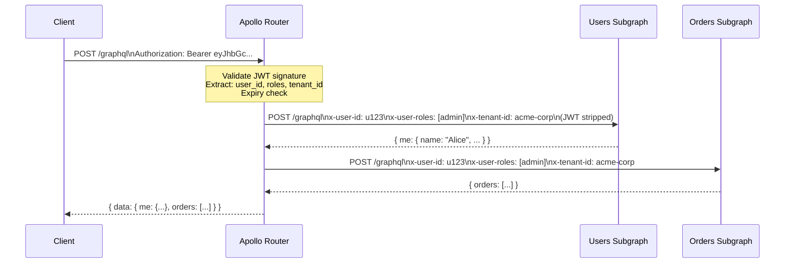

# GraphQL Authentication

> **Purpose:** Authentication in GraphQL differs from REST because a single endpoint serves all operations. JWT validation, API key handling, context propagation, and multi-tenant patterns must all be addressed at the router layer before queries reach subgraphs.

## Learning Objectives

- [ ] Implement JWT validation in Apollo Router using the built-in JWT plugin
- [ ] Forward authentication context from router to subgraphs via headers
- [ ] Hash and validate API keys without storing plaintext secrets
- [ ] Handle token refresh for long-lived WebSocket subscription connections
- [ ] Design multi-tenant authentication where tenant ID shapes data access

---

## Overview / Architecture

GraphQL's single-endpoint model forces a question that REST never raised: where exactly should authentication happen? In REST, each resource endpoint can independently validate tokens. In GraphQL, all operations arrive at `/graphql` regardless of what they do.

The correct answer for federated GraphQL: **authenticate at the router, propagate context to subgraphs.** Never re-validate JWTs in every subgraph. This would require every subgraph to hold JWT signing keys, creating key management surface area across dozens of services. Instead, the router validates the token once, extracts the user identity, and forwards a trusted internal header to subgraphs.



The JWT is stripped before forwarding. Subgraphs receive only the extracted identity claims as trusted internal headers — they never see the raw token.

---

## Core Concepts

### JWT Anatomy and Validation

A JWT has three base64url-encoded parts: header, payload, signature.

```
eyJhbGciOiJSUzI1NiIsInR5cCI6IkpXVCJ9  ← header: alg + type
.eyJzdWIiOiJ1MTIzIiwicm9sZXMiOlsiYWRtaW4iXSwiZXhwIjoxNjk5OTk5OTk5fQ  ← payload
.SIGNATURE  ← RSA or HMAC signature over header.payload
```

Validation requires:
1. **Signature verification** — confirm the token was signed by a trusted key
2. **Expiry check** — `exp` claim must be in the future
3. **Audience check** — `aud` claim must match this service
4. **Issuer check** — `iss` claim must match the auth server

Never skip any of these. A valid signature on an expired token is still an invalid token.

### RS256 vs HS256

- **HS256** (HMAC-SHA256): symmetric key — same secret signs and verifies. Requires all verifiers to hold the secret.
- **RS256** (RSA-SHA256): asymmetric — private key signs, public key verifies. Subgraphs only need the public key. Preferred for multi-service architectures.

Use RS256 or ES256 in federated systems. Never use HS256 when multiple services need to verify tokens.

### API Key Authentication

API keys are long-lived credentials used by server-to-server clients and CI/CD pipelines. They must never be stored in plaintext.

Secure storage pattern:
1. Generate a cryptographically random key: `sk_live_<64 random bytes base64>`
2. Hash it with bcrypt or SHA-256 + salt for storage
3. The client presents the full key; the server hashes it and compares

### Context Propagation

In Apollo Federation, the router's validated identity must reach subgraph resolvers. The standard pattern:

1. Router validates token, extracts claims
2. Router sets `x-user-id`, `x-user-roles`, `x-tenant-id` headers on subgraph requests
3. Subgraph reads these headers in its context function
4. Resolvers receive context and use it for authorization decisions

These internal headers must never be accepted from external clients. The router must strip inbound versions of these headers:

```yaml
# router.yaml — strip internal headers from client requests
headers:
  all:
    request:
      - remove:
          named: x-user-id
      - remove:
          named: x-user-roles
      - remove:
          named: x-tenant-id
```

---

## Real-World Implementation

### Apollo Router JWT Plugin

```yaml
# router.yaml
authentication:
  router:
    jwt:
      jwks:
        - url: "https://auth.example.com/.well-known/jwks.json"
          issuer: "https://auth.example.com"
          audience: "graphql-api"
      header_name: Authorization
      header_value_prefix: Bearer

# Forward validated claims to subgraphs:
headers:
  all:
    request:
      - insert:
          name: x-user-id
          value: "{jwt.claims.sub}"
      - insert:
          name: x-user-roles
          value: "{jwt.claims.roles}"
      - insert:
          name: x-tenant-id
          value: "{jwt.claims.tenant_id}"
      - remove:
          named: Authorization  # strip raw JWT from subgraph requests
```

### Node.js Subgraph Context Function

```typescript
import { ApolloServer } from '@apollo/server';
import { expressMiddleware } from '@apollo/server/express4';
import type { Request } from 'express';

interface UserContext {
  userId: string | null;
  roles: string[];
  tenantId: string | null;
}

async function buildContext({ req }: { req: Request }): Promise<UserContext> {
  // These headers are set by Apollo Router after JWT validation
  // They are stripped from client requests — only the router can set them
  return {
    userId: req.headers['x-user-id'] as string | null ?? null,
    roles: JSON.parse(req.headers['x-user-roles'] as string || '[]'),
    tenantId: req.headers['x-tenant-id'] as string | null ?? null,
  };
}

const server = new ApolloServer<UserContext>({
  typeDefs,
  resolvers,
});

app.use(
  '/graphql',
  expressMiddleware(server, {
    context: buildContext,
  })
);
```

### JWT Validation with jose (Standalone, Without Router)

For non-federated setups or local development servers:

```typescript
import { jwtVerify, createRemoteJWKSet } from 'jose';

const JWKS = createRemoteJWKSet(
  new URL('https://auth.example.com/.well-known/jwks.json')
);

async function validateJWT(token: string): Promise<{
  userId: string;
  roles: string[];
  tenantId: string;
}> {
  const { payload } = await jwtVerify(token, JWKS, {
    issuer: 'https://auth.example.com',
    audience: 'graphql-api',
  });

  if (!payload.sub) throw new Error('Missing sub claim');

  return {
    userId: payload.sub,
    roles: (payload['roles'] as string[]) ?? [],
    tenantId: (payload['tenant_id'] as string) ?? '',
  };
}

// In Apollo Server context:
async function buildContext({ req }: { req: Request }) {
  const authHeader = req.headers.authorization;
  if (!authHeader?.startsWith('Bearer ')) {
    return { userId: null, roles: [], tenantId: null };
  }

  try {
    return await validateJWT(authHeader.slice(7));
  } catch {
    throw new GraphQLError('Invalid or expired token', {
      extensions: { code: 'UNAUTHENTICATED' },
    });
  }
}
```

### API Key Authentication

```typescript
import { createHash } from 'crypto';
import { db } from './database';

async function validateApiKey(rawKey: string): Promise<{
  userId: string;
  clientId: string;
  scopes: string[];
} | null> {
  // Keys follow format: sk_live_<payload>
  if (!rawKey.startsWith('sk_live_') && !rawKey.startsWith('sk_test_')) {
    return null;
  }

  // Hash the key for database lookup (never store plaintext)
  const hashedKey = createHash('sha256')
    .update(rawKey + process.env.API_KEY_SALT)
    .digest('hex');

  const apiKey = await db.query(
    `SELECT user_id, client_id, scopes, revoked_at, expires_at
     FROM api_keys WHERE key_hash = $1`,
    [hashedKey]
  );

  if (!apiKey || apiKey.revoked_at || (apiKey.expires_at && apiKey.expires_at < new Date())) {
    return null;
  }

  // Update last_used_at asynchronously — don't block the request
  db.query(
    'UPDATE api_keys SET last_used_at = NOW() WHERE key_hash = $1',
    [hashedKey]
  ).catch(console.error);

  return {
    userId: apiKey.user_id,
    clientId: apiKey.client_id,
    scopes: apiKey.scopes,
  };
}
```

### Multi-Tenant Authentication

In multi-tenant SaaS, the tenant determines which data partition the user belongs to:

```typescript
interface TenantContext {
  userId: string;
  tenantId: string;
  tenantPlan: 'starter' | 'professional' | 'enterprise';
  schemaVersion: string;
}

async function buildMultiTenantContext({ req }: { req: Request }): Promise<TenantContext> {
  // Extract from validated JWT (set by router) or validate directly
  const userId = req.headers['x-user-id'] as string;
  const tenantId = req.headers['x-tenant-id'] as string;

  if (!userId || !tenantId) {
    throw new GraphQLError('Authentication required', {
      extensions: { code: 'UNAUTHENTICATED' },
    });
  }

  // Fetch tenant metadata from cache (critical path — must be fast)
  const tenant = await tenantCache.get(tenantId) ?? await db.query(
    'SELECT plan, schema_version FROM tenants WHERE id = $1',
    [tenantId]
  );

  if (!tenant) {
    throw new GraphQLError('Unknown tenant', {
      extensions: { code: 'FORBIDDEN' },
    });
  }

  await tenantCache.set(tenantId, tenant, 300); // 5-minute cache

  return {
    userId,
    tenantId,
    tenantPlan: tenant.plan,
    schemaVersion: tenant.schema_version,
  };
}
```

### Subscription Token Refresh

WebSocket connections for subscriptions can outlive JWT expiry. Handle token refresh mid-connection:

```typescript
import { useServer } from 'graphql-ws/lib/use/ws';

useServer(
  {
    schema,
    onConnect: async (ctx) => {
      const token = ctx.connectionParams?.authorization as string;
      if (!token) throw new Error('No authorization token provided');
      
      const identity = await validateJWT(token.replace('Bearer ', ''));
      return { identity, tokenExpiry: identity.exp };
    },
    
    // Called before each subscription event is sent
    onSubscribe: async (ctx, msg) => {
      const now = Math.floor(Date.now() / 1000);
      const tokenExpiry = ctx.extra?.tokenExpiry as number;
      
      if (now > tokenExpiry) {
        // Token expired — close connection with meaningful error
        // Client should reconnect with a fresh token
        throw new Error('Token expired. Reconnect with a fresh token.');
      }
    },
    
    // Allow token update without disconnecting (graphql-ws protocol extension)
    execute: (args) => execute(args),
    subscribe: (args) => subscribe(args),
  },
  wss
);
```

---

## Production Considerations

### Performance

JWT validation with remote JWKS has latency from the public key fetch. Cache the JWKS aggressively:

- Remote JWKS should be cached for the duration of the `Cache-Control` header (typically 1–24 hours)
- The `jose` library caches JWKS automatically
- Apollo Router's JWT plugin caches JWKS in memory

API key validation hits the database on every request. Use Redis to cache valid keys for 60 seconds:

```typescript
const CACHE_TTL = 60; // seconds

async function validateApiKeyCached(rawKey: string) {
  const cacheKey = `apikey:${createHash('sha256').update(rawKey).digest('hex').slice(0, 16)}`;
  const cached = await redis.get(cacheKey);
  if (cached) return JSON.parse(cached);
  
  const result = await validateApiKey(rawKey);
  if (result) await redis.setex(cacheKey, CACHE_TTL, JSON.stringify(result));
  return result;
}
```

### Security

- **Never log tokens, even partially.** The first 10 characters of a JWT are always the same (`eyJhbGc`). Logging them wastes space and creates false confidence. Log the subject claim (`sub`) instead.
- **Rotate JWT signing keys regularly** (every 90 days). JWKS allows multiple public keys — add the new key, wait for caches to expire, then retire the old key.
- **Set short JWT expiry** (15 minutes for access tokens, 7 days for refresh tokens). Long-lived JWTs are effectively API keys without revocation.

### Scaling

Apollo Router handles JWT validation at the router layer, which is the single point of trust. All subgraphs trust the router's internal headers without additional validation. This scales linearly — adding subgraphs does not add authentication overhead per subgraph.

### Observability

```typescript
// Emit authentication results as metrics:
meter.createCounter('graphql.auth.result').add(1, {
  result: 'success' | 'expired' | 'invalid' | 'missing',
  method: 'jwt' | 'api_key',
});
```

---

## Best Practices

1. **Validate tokens at the router, not in each subgraph.** One validation point means one key rotation, one failure mode, one audit log.
2. **Use RS256 or ES256 for JWT signing.** Subgraphs only need the public key — they cannot forge tokens even if compromised.
3. **Strip the raw JWT before forwarding to subgraphs.** They receive extracted claims, never the token.
4. **Cache JWKS aggressively** — remote JWKS fetch latency is a common production performance issue.
5. **Set explicit `audience` and `issuer` on every JWT validation call.** Skipping these enables token confusion attacks.
6. **Implement short JWT expiry with refresh tokens.** 15-minute access tokens limit the blast radius of token theft.

---

## Anti-Patterns

**Validating JWTs in every subgraph:** Creates 10+ copies of JWT validation logic, 10+ places to rotate keys, and 10+ potential vulnerabilities.

**Accepting internal headers from clients:** If clients can set `x-user-id: admin`, the authorization model collapses. Strip these headers at the router before they reach your code.

**Trusting the HTTP Referer for auth:** The `Referer` header is trivially forgeable. Use tokens.

**Long-lived JWTs (30+ day expiry):** An intercepted JWT is valid for the entire duration. Short expiry limits damage.

---

## Operational Notes

**Debugging `401 Unauthenticated` errors:** Check in order: (1) Is the `Authorization` header present? (2) Does it start with `Bearer `? (3) Is the JWKS endpoint reachable? (4) Is the key ID (`kid` in the JWT header) in the JWKS? (5) Is the expiry in the future in UTC?

**Rotating signing keys:** Add the new public key to JWKS first (both old and new are trusted). Issue new tokens with the new key. Wait for old tokens to expire (at most 15 minutes if access token expiry is 15 minutes). Remove the old key from JWKS.

---

## References

- [JWKS RFC 7517](https://datatracker.ietf.org/doc/html/rfc7517)
- [jose Library (JavaScript JWT)](https://github.com/panva/jose)
- [Apollo Router Authentication Plugin](https://www.apollographql.com/docs/router/configuration/authn-jwt)
- [Auth0 JWT Best Practices](https://auth0.com/blog/jwt-security-best-practices/)

## Related Topics

- [03-authorization.md](03-authorization.md) — RBAC/ABAC and field-level authorization
- [01-attack-vectors.md](01-attack-vectors.md) — token-related attack patterns
- [05-persisted-queries.md](05-persisted-queries.md) — client authentication via trusted documents
