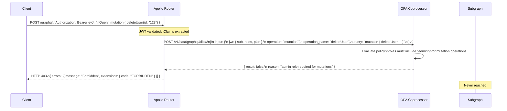

# OPA and Policy-as-Code for GraphQL

> **Purpose:** Open Policy Agent (OPA) externalizes authorization decisions from application code into declarative Rego policies. In GraphQL, OPA enables centralized policy enforcement, schema-naming governance, and runtime query authorization without embedding policy logic in every subgraph resolver.

## Learning Objectives

- [ ] Explain OPA's architecture: policy engine, data documents, and decision queries
- [ ] Write Rego policies that authorize GraphQL operations based on JWT claims and operation metadata
- [ ] Integrate OPA with Apollo Router using the coprocessor plugin
- [ ] Test OPA policies with `opa test` before deploying
- [ ] Describe how OPA differs from in-resolver authorization and when to use each

---

## Overview / Architecture

Authorization code in resolvers has a fundamental scaling problem: as the number of subgraphs grows, each team independently implements authorization rules, creating drift, bugs, and inconsistent enforcement. A policy that should apply across all subgraphs (e.g., "users with plan=free cannot access AI features") must be copied and maintained in every subgraph.

OPA solves this by separating policy from code. Policies are written in Rego, a purpose-built declarative policy language. OPA evaluates policies against input data and returns structured authorization decisions. Your application asks OPA "is this request allowed?" and enforces the answer — without embedding the policy logic itself.

In GraphQL federation, OPA runs as an Apollo Router coprocessor: the router calls OPA for every request before forwarding to subgraphs. OPA has access to the full request context — JWT claims, operation name, query, variables — and can make complex decisions in under 5ms.



---

## Core Concepts

### Rego Language Basics

Rego is a query language for policy. It evaluates to either true (allow) or false (deny), or to structured data.

```rego
# Package declaration — namespaces the policy
package graphql.authz

# Import future keywords for modern syntax
import future.keywords.if
import future.keywords.in

# Default deny
default allow := false

# Allow if all conditions are met
allow if {
    # User is authenticated
    input.jwt.sub != ""
    
    # Operation is allowed for this role
    allowed_operations[input.operation][_] == input.jwt.roles[_]
}

# Define which roles can perform which operations
allowed_operations := {
    "query": ["viewer", "editor", "admin"],
    "mutation": ["editor", "admin"],
    "subscription": ["admin"],
}
```

Key Rego concepts:
- **Rules** produce values; `allow` produces `true` or `false`
- **Default values** handle the deny-by-default case
- **Iteration** is implicit: `input.jwt.roles[_]` iterates all roles
- **Unification** with `==` or `:=` binds variables

### OPA Input Document

OPA evaluates policies against an `input` document. For GraphQL, structure this document with the information needed for authorization decisions:

```json
{
  "input": {
    "jwt": {
      "sub": "u123",
      "roles": ["editor"],
      "plan": "professional",
      "tenant_id": "acme-corp"
    },
    "operation": "mutation",
    "operation_name": "CreateOrder",
    "query": "mutation CreateOrder($input: CreateOrderInput!) { createOrder(input: $input) { id status } }",
    "variables": {
      "input": {
        "customerId": "c456",
        "items": [{ "productId": "p789", "quantity": 2 }]
      }
    },
    "http": {
      "method": "POST",
      "path": "/graphql",
      "headers": {
        "x-tenant-id": "acme-corp"
      }
    }
  }
}
```

### OPA Data Documents

OPA can consult external data documents stored in its bundle:

```json
// data.json — loaded into OPA as static data
{
  "plan_permissions": {
    "starter": ["query"],
    "professional": ["query", "mutation"],
    "enterprise": ["query", "mutation", "subscription"]
  },
  "protected_mutations": [
    "deleteUser",
    "transferOwnership",
    "resetTenantData"
  ],
  "admin_only_fields": [
    "User.internalNotes",
    "Order.fraudScore"
  ]
}
```

---

## Real-World Implementation

### Complete GraphQL Authorization Policy

```rego
package graphql.authz

import future.keywords.if
import future.keywords.in

# Default deny — every operation is forbidden unless explicitly allowed
default allow := false
default reason := "Access denied"

# Allow the request
allow if {
    authenticated
    operation_allowed
    not protected_mutation_requires_admin
    plan_allows_operation
}

# Authentication check
authenticated if {
    input.jwt.sub != ""
    not token_expired
}

token_expired if {
    input.jwt.exp < time.now_ns() / 1000000000
}

# Operation type authorization
operation_allowed if {
    input.operation in data.plan_permissions[input.jwt.plan]
}

# Protected mutations require admin role
protected_mutation_requires_admin if {
    input.operation == "mutation"
    input.operation_name in data.protected_mutations
    not "admin" in input.jwt.roles
}

# Subscription requires premium plan
plan_allows_operation if {
    input.operation == "subscription"
    input.jwt.plan in {"professional", "enterprise"}
}

plan_allows_operation if {
    input.operation != "subscription"
}

# Denial reasons (for structured error responses)
reason := "Authentication required" if {
    not authenticated
}

reason := "Your plan does not include this operation type" if {
    authenticated
    not operation_allowed
}

reason := "Admin role required for this mutation" if {
    authenticated
    operation_allowed
    protected_mutation_requires_admin
}

# Response object for the coprocessor
response := {
    "allow": allow,
    "reason": reason,
    "user_id": input.jwt.sub,
    "tenant_id": input.jwt.tenant_id,
}
```

### OPA Test Suite

```rego
package graphql.authz_test

import future.keywords.if

# Test: regular query allowed for viewer role
test_query_allowed_for_viewer if {
    allow with input as {
        "jwt": {
            "sub": "u123",
            "roles": ["viewer"],
            "plan": "starter",
            "exp": 9999999999,
            "tenant_id": "acme"
        },
        "operation": "query",
        "operation_name": "GetUser",
    }
}

# Test: mutation denied for starter plan
test_mutation_denied_for_starter_plan if {
    not allow with input as {
        "jwt": {
            "sub": "u123",
            "roles": ["editor"],
            "plan": "starter",
            "exp": 9999999999,
            "tenant_id": "acme"
        },
        "operation": "mutation",
        "operation_name": "CreateOrder",
    }
}

# Test: protected mutation requires admin
test_delete_user_requires_admin if {
    not allow with input as {
        "jwt": {
            "sub": "u123",
            "roles": ["editor"],
            "plan": "enterprise",
            "exp": 9999999999,
            "tenant_id": "acme"
        },
        "operation": "mutation",
        "operation_name": "deleteUser",
    }
}

# Test: admin can delete user
test_admin_can_delete_user if {
    allow with input as {
        "jwt": {
            "sub": "u999",
            "roles": ["admin"],
            "plan": "enterprise",
            "exp": 9999999999,
            "tenant_id": "acme"
        },
        "operation": "mutation",
        "operation_name": "deleteUser",
    }
}

# Test: expired token denied
test_expired_token_denied if {
    not allow with input as {
        "jwt": {
            "sub": "u123",
            "roles": ["admin"],
            "plan": "enterprise",
            "exp": 1000000000,  # year 2001 — definitely expired
            "tenant_id": "acme"
        },
        "operation": "query",
        "operation_name": "GetUser",
    }
}
```

Run tests:
```bash
opa test policies/ -v
# PASS: 5/5 tests passed
```

### Apollo Router Coprocessor Plugin

OPA runs as a separate service. Apollo Router calls it via the coprocessor hook:

```yaml
# router.yaml
coprocessor:
  url: "http://opa-sidecar:8181"
  router:
    request:
      headers: true
      body: true        # needed to read query + variables
      context: true
      sdl: false

# Coprocessor receives RouterRequest, evaluates OPA, returns modified or rejected request
```

Apollo Router coprocessor service (Node.js):

```typescript
import express from 'express';
import { parse } from 'graphql';

const app = express();
app.use(express.json({ limit: '1mb' }));

app.post('/', async (req, res) => {
  const { version, stage, headers, body, context } = req.body;

  // Only process RouterRequest stage
  if (stage !== 'RouterRequest') {
    return res.json(req.body); // pass-through for other stages
  }

  // Extract JWT claims (already validated by Apollo Router JWT plugin)
  const userId = headers['x-user-id'];
  const roles = JSON.parse(headers['x-user-roles'] || '[]');
  const plan = headers['x-user-plan'] || 'starter';
  const tenantId = headers['x-tenant-id'];

  // Parse operation details
  let operationType = 'query';
  let operationName = null;
  
  try {
    const parsedQuery = parse(body?.query || '');
    const firstDef = parsedQuery.definitions[0];
    if (firstDef.kind === 'OperationDefinition') {
      operationType = firstDef.operation;
      operationName = firstDef.name?.value;
    }
  } catch {
    // Malformed query — let router handle
    return res.json(req.body);
  }

  // Call OPA
  const opaInput = {
    jwt: { sub: userId, roles, plan, tenant_id: tenantId, exp: 9999999999 },
    operation: operationType,
    operation_name: operationName,
    query: body?.query,
    variables: body?.variables,
  };

  const opaResponse = await fetch('http://localhost:8181/v1/data/graphql/authz/response', {
    method: 'POST',
    headers: { 'Content-Type': 'application/json' },
    body: JSON.stringify({ input: opaInput }),
  });

  const { result } = await opaResponse.json();

  if (!result.allow) {
    // Return 403 — Apollo Router translates this to a GraphQL error
    return res.status(200).json({
      ...req.body,
      status: 403,
      body: JSON.stringify({
        errors: [{
          message: result.reason || 'Forbidden',
          extensions: { code: 'FORBIDDEN' },
        }],
      }),
    });
  }

  // Allowed — pass through with no changes
  res.json(req.body);
});

app.listen(3000, () => console.log('OPA coprocessor listening on :3000'));
```

### OPA Deployment as Kubernetes Sidecar

```yaml
# apollo-router deployment with OPA sidecar
apiVersion: apps/v1
kind: Deployment
metadata:
  name: apollo-router
spec:
  template:
    spec:
      containers:
        - name: apollo-router
          image: ghcr.io/apollographql/router:latest
          volumeMounts:
            - name: router-config
              mountPath: /dist/config

        - name: opa
          image: openpolicyagent/opa:0.61.0
          args:
            - run
            - --server
            - --addr=0.0.0.0:8181
            - --bundle=/policies
            - --log-format=json
          ports:
            - containerPort: 8181
          volumeMounts:
            - name: opa-policies
              mountPath: /policies
          readinessProbe:
            httpGet:
              path: /health?bundle=true
              port: 8181

        - name: opa-coprocessor
          image: your-registry/opa-coprocessor:latest
          ports:
            - containerPort: 3000

      volumes:
        - name: opa-policies
          configMap:
            name: opa-policies
```

---

## Production Considerations

### Performance

OPA policy evaluation is fast — median latency is 1–3ms for policies of typical complexity. At 99th percentile, complex policies with large data documents can reach 10–15ms. Profile before setting SLOs.

Reduce OPA latency:
- **Pre-compile policies to WASM:** OPA supports WASM compilation for sub-millisecond evaluation in the critical path
- **Bundle data documents:** Don't fetch external data on every evaluation — bundle static data (plan permissions, protected field lists) into the OPA bundle
- **Sidecar deployment:** Co-locate OPA with the router in the same pod to use localhost networking (microseconds vs milliseconds)

### Security

OPA is a trust boundary. Its `/v1/data` endpoint exposes all loaded policies and data. In production:
- Network-isolate OPA to the router pod only
- Do not expose OPA's HTTP API outside the cluster
- Use TLS for OPA communication in multi-tenant environments

### Scaling

OPA is stateless — each evaluation is independent. Scale OPA sidecars by scaling the router deployment. Bundle updates use a pull-based model (OPA fetches updated bundles from a bundle server) — no rolling restart required for policy updates.

### Observability

```rego
# Add decision log in policy
decision_log := {
    "timestamp": time.now_ns(),
    "user_id": input.jwt.sub,
    "tenant_id": input.jwt.tenant_id,
    "operation": input.operation,
    "operation_name": input.operation_name,
    "decision": allow,
    "reason": reason,
}
```

Enable OPA decision logging to Elasticsearch or Kafka for audit trail.

---

## Best Practices

1. **Default deny in every OPA policy.** `default allow := false` prevents accidents where a policy evaluates to undefined.
2. **Test every policy rule.** OPA's test framework is fast and expressive — write a test for every allow condition and every deny condition.
3. **Bundle static data with policies.** Avoid data fetches in the evaluation path; pre-load plan permissions, feature flags, and protected resource lists into the bundle.
4. **Version your OPA bundle.** Treat policies like code — review, version, deploy via CI/CD.
5. **Log every DENY decision** with full context (user, tenant, operation, reason) for security auditing.
6. **Keep OPA policy scope focused.** OPA is excellent for coarse-grained, operation-type, and feature-flag authorization. Fine-grained ABAC ("can user X access record Y?") is better in resolvers with database-level RLS.

---

## Anti-Patterns

**OPA for record-level ABAC at scale:** Asking OPA "can user 123 access order 456?" for every field requires OPA to have access to order ownership data, which means syncing your database to OPA. This is expensive and creates a second copy of your data model.

**Inline policy in coprocessor code:** `if (roles.includes('admin'))` in the coprocessor defeats the purpose of OPA. Policy belongs in `.rego` files, not in application code.

**Skipping OPA tests:** Untested policy is dangerous — a misplaced `not` can flip a deny to an allow.

---

## Operational Notes

**Debugging OPA decisions:** Use `opa eval` to test a policy against input:

```bash
echo '{"input": {"jwt": {"sub": "u1", "roles": ["viewer"], "plan": "starter", "exp": 9999999999}}, "operation": "mutation", "operation_name": "CreateOrder"}' | \
  opa eval -d policies/ -I 'data.graphql.authz.allow'
```

**Updating policies without downtime:** OPA's bundle API pulls updated bundles from a bundle server. Deploy new policies to the bundle server — OPA instances pick up changes within the configured polling interval (default 60s). No restarts required.

---

## References

- [Open Policy Agent Documentation](https://www.openpolicyagent.org/docs/latest/)
- [Rego Language Reference](https://www.openpolicyagent.org/docs/latest/policy-language/)
- [Apollo Router Coprocessor](https://www.apollographql.com/docs/router/customizations/coprocessor)
- [OPA GraphQL Integration Patterns](https://www.openpolicyagent.org/docs/latest/graphql/)

## Related Topics

- [03-authorization.md](03-authorization.md) — resolver-level RBAC/ABAC
- [../13-policy-as-code/](../13-policy-as-code/) — OPA for CI/CD schema governance
- [../05-security/01-attack-vectors.md](01-attack-vectors.md) — broader security attack surface
