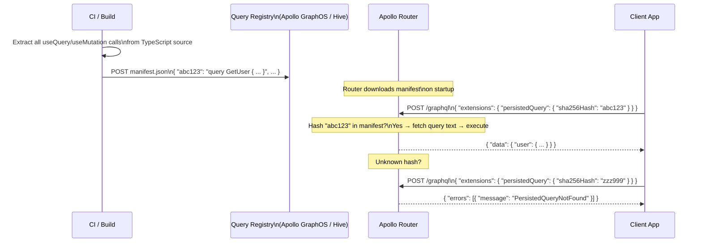

# Persisted Queries and Trusted Documents

> **Purpose:** Persisted queries lock a GraphQL API to a known set of operations, eliminating arbitrary query execution in production. This dramatically reduces attack surface (no complexity bombs, no introspection), improves caching via GET requests, and reduces request payload sizes by 70–90%.

## Learning Objectives

- [ ] Explain the difference between Automatic Persisted Queries (APQ) and trusted document manifests
- [ ] Configure Apollo Router to enforce trusted documents and reject unknown queries
- [ ] Generate a query manifest from a TypeScript/JavaScript codebase using `@apollo/generate-persisted-query-manifest`
- [ ] Integrate persisted queries with CDN caching for GET-based queries
- [ ] Describe the deployment workflow: build → register manifest → deploy router

---

## Overview / Architecture

In unrestricted GraphQL, any client can send any query. This is powerful during development and completely appropriate for internal developer tools. In production, it is a liability: attackers can craft complexity bombs, enumerate the schema via introspection, and probe mutations with invalid inputs.

Persisted queries flip the model: instead of accepting arbitrary queries, the server maintains an allow-list of known operations. Each operation is stored by hash. The client sends only the hash; the server looks up the full query. Unknown hashes are rejected.

Two variants exist:

**Automatic Persisted Queries (APQ):** The first time a client sends a new query, it also sends the full query text so the server can cache it. Subsequent requests send only the hash. This is opt-in per client — clients can still send unknown queries on first encounter.

**Trusted Documents (static manifests):** The full set of allowed queries is known at build time, registered before deployment, and locked. The server rejects any hash not in the manifest. No "first encounter" exceptions. This is the production security model.



---

## Core Concepts

### Hash Generation

The hash is SHA-256 of the query's normalized text (whitespace-normalized, sorted argument order). Normalization ensures the same logical query always produces the same hash regardless of formatting.

```typescript
import { createHash } from 'crypto';
import { print, parse } from 'graphql';

function generateQueryHash(query: string): string {
  // Normalize: parse + re-print for consistent formatting
  const normalized = print(parse(query));
  return createHash('sha256').update(normalized).digest('hex');
}
```

### APQ Protocol

APQ uses the `extensions.persistedQuery` field in the request body:

```json
// First request (hash-only):
{
  "query": null,
  "extensions": {
    "persistedQuery": {
      "version": 1,
      "sha256Hash": "abc123..."
    }
  }
}

// Response if hash unknown (APQ fallback):
{
  "errors": [{ "message": "PersistedQueryNotFound" }]
}

// Second request (hash + full query):
{
  "query": "query GetUser($id: ID!) { user(id: $id) { name email } }",
  "extensions": {
    "persistedQuery": {
      "version": 1,
      "sha256Hash": "abc123..."
    }
  }
}
```

### Trusted Documents vs APQ

| Feature | APQ | Trusted Documents |
|---|---|---|
| Unknown queries accepted | Yes (first request) | No — always rejected |
| Client code changes needed | No (transparent) | Yes (hash extraction at build time) |
| Attack surface reduction | Partial | Full |
| CDN caching compatible | Yes (GET for known) | Yes (GET for known) |
| Registration step | Runtime (automatic) | Build time (CI pipeline) |
| Best for | Internal APIs, developer portals | Public/partner APIs, mobile apps |

---

## Real-World Implementation

### Generating a Manifest (Apollo Client)

```bash
npm install --save-dev @apollo/generate-persisted-query-manifest @apollo/client
```

```json
// persisted-query-manifest.config.json
{
  "documents": ["src/**/*.{ts,tsx,graphql}"],
  "output": "persisted-query-manifest.json"
}
```

```bash
npx generate-persisted-query-manifest
```

Output:
```json
{
  "format": "apollo-persisted-query-manifest",
  "version": 1,
  "operations": [
    {
      "id": "a6c0063ef2ca3e46978f02bc2bff7b7e6b6def7a...",
      "name": "GetUser",
      "type": "query",
      "body": "query GetUser($id: ID!) { user(id: $id) { id name email } }"
    },
    {
      "id": "b7d1174f03db4f57989g03cd3cgg8c8f7c7egf8b...",
      "name": "CreateOrder",
      "type": "mutation",
      "body": "mutation CreateOrder($input: CreateOrderInput!) { createOrder(input: $input) { id status } }"
    }
  ]
}
```

### Registering the Manifest with Apollo GraphOS

```bash
# In CI pipeline after build:
rover persisted-queries publish my-graph-id@production \
  --manifest persisted-query-manifest.json

# Verify registration:
rover persisted-queries list my-graph-id@production
```

### Apollo Router: Trusted Documents Configuration

```yaml
# router.yaml
persisted_queries:
  enabled: true
  safelist:
    enabled: true
    require_id: true   # reject requests without a known query ID
  
  # Log unknown query attempts as security events:
  log_unknown: true
```

With `require_id: true`, the router rejects any request that:
- Has no `extensions.persistedQuery.sha256Hash`
- Has a hash not in the manifest
- Has both a hash and a query body (prevents hash+query smuggling attacks)

### Apollo Router: APQ with Redis Cache

For APQ (allowing clients to register new queries at runtime — lower security, higher flexibility):

```yaml
# router.yaml
apq:
  router:
    cache:
      in_memory:
        limit: 512
      redis:
        urls:
          - "redis://redis-cache:6379"
        ttl: 24h
```

### Client Configuration (Apollo Client)

```typescript
import { ApolloClient, InMemoryCache, createHttpLink } from '@apollo/client';
import { createPersistedQueryLink } from '@apollo/client/link/persisted-queries';
import { sha256 } from 'crypto-hash';

// Trusted documents: use manifest IDs instead of computed hashes
import manifest from './persisted-query-manifest.json';

const persistedQueriesMap = Object.fromEntries(
  manifest.operations.map((op) => [op.body, op.id])
);

const persistedQueryLink = createPersistedQueryLink({
  // Use pre-computed IDs from manifest instead of runtime hashing
  generateHash: (document) => {
    const body = print(document);
    const id = persistedQueriesMap[body];
    if (!id) throw new Error(`Operation not in trusted manifest: ${body.slice(0, 50)}`);
    return id;
  },
  useGETForHashedQueries: true, // Enable CDN caching for GET requests
  disable: () => false,          // Never fall back to full query
});

const client = new ApolloClient({
  link: persistedQueryLink.concat(
    createHttpLink({ uri: 'https://api.example.com/graphql' })
  ),
  cache: new InMemoryCache(),
});
```

### CDN Integration for GET-Based Persisted Queries

Trusted document GETs are cacheable. The cache key is the query hash + variables:

```
GET /graphql?extensions={"persistedQuery":{"version":1,"sha256Hash":"abc123"}}&variables={"id":"u123"}
```

Cloudflare Worker cache rule:
```javascript
// Cloudflare Worker for GraphQL caching
addEventListener('fetch', event => {
  event.respondWith(handleRequest(event.request));
});

async function handleRequest(request) {
  if (request.method === 'GET') {
    const url = new URL(request.url);
    const hash = extractQueryHash(url);
    
    if (hash) {
      // Cache GET persisted queries with 60-second TTL
      const cache = caches.default;
      const cacheKey = new Request(request.url, { method: 'GET' });
      
      const cached = await cache.match(cacheKey);
      if (cached) return cached;
      
      const response = await fetch(request);
      const cloned = response.clone();
      
      // Only cache 200 responses without errors
      if (response.ok) {
        const body = await cloned.json();
        if (!body.errors?.length) {
          const cacheHeaders = new Headers(response.headers);
          cacheHeaders.set('Cache-Control', 'public, max-age=60');
          
          event.waitUntil(
            cache.put(cacheKey, new Response(JSON.stringify(body), {
              headers: cacheHeaders,
            }))
          );
        }
      }
      
      return response;
    }
  }
  
  return fetch(request);
}
```

### CI/CD Pipeline Integration

```yaml
# .github/workflows/graphql-deploy.yml
name: GraphQL Deploy

on:
  push:
    branches: [main]

jobs:
  deploy:
    runs-on: ubuntu-latest
    steps:
      - uses: actions/checkout@v4
      
      - name: Install dependencies
        run: npm ci
      
      - name: Build application
        run: npm run build
      
      - name: Generate persisted query manifest
        run: npx generate-persisted-query-manifest
      
      - name: Validate manifest against schema
        run: |
          rover subgraph check ${{ env.APOLLO_GRAPH_ID }}@production \
            --schema schema.graphql \
            --name web-client
      
      - name: Publish persisted queries to GraphOS
        run: |
          rover persisted-queries publish ${{ env.APOLLO_GRAPH_ID }}@production \
            --manifest persisted-query-manifest.json
        env:
          APOLLO_KEY: ${{ secrets.APOLLO_KEY }}
      
      - name: Deploy application
        run: npm run deploy
        # Note: manifest is published BEFORE app deploy
        # Router already knows the new hashes when clients start sending them
```

---

## Production Considerations

### Performance

Persisted queries reduce request payload by 70–90% (sending a 64-char hash vs a 500+ char query). This matters most for mobile clients on constrained connections.

GET-based persisted queries enable CDN caching, which can eliminate database reads for common queries entirely. A `getProductListing` query with stable results can be served from CDN for 60 seconds, cutting backend load for product pages dramatically.

### Security

Trusted documents eliminate:
- Complexity bomb attacks (unknown queries are rejected before parsing)
- Introspection (no way to send `__schema` query if it's not in the manifest)
- Schema enumeration via field suggestions

What they don't eliminate:
- Authorization failures (trusted queries can still request unauthorized data)
- IDOR in trusted queries (a trusted `getOrder(id:)` still needs authorization checks)

Combine trusted documents with complexity limits for defense in depth during the manifest registration window.

### Scaling

The manifest is loaded by the router at startup and refreshed via polling (configurable interval, typically 60 seconds). No distributed state is required — the manifest is a static document fetched from Apollo GraphOS or a file server.

### Observability

```yaml
# router.yaml — log unknown query attempts
persisted_queries:
  log_unknown: true
  # Logs include: hash, client IP, user agent — route to SIEM
```

---

## Best Practices

1. **Use trusted documents (not just APQ) for public-facing APIs.** APQ allows new queries to be registered at runtime; trusted documents do not.
2. **Register the manifest BEFORE deploying the new client version.** Clients send new hashes immediately on deploy; the router must know them first.
3. **Enable `useGETForHashedQueries`** in Apollo Client to unlock CDN caching for read queries.
4. **Enforce `require_id: true`** in the router for maximum security. This rejects requests with no hash.
5. **Include manifest generation in CI**, not as a manual step. Developers should not manually maintain manifest files.
6. **Combine with query complexity limits** as a belt-and-suspenders approach during the window between manifest publish and router refresh.

---

## Anti-Patterns

**APQ in public APIs:** APQ allows clients to register new queries on first send. An attacker is a client. They can register their complexity bomb on first request, then execute it freely on subsequent requests.

**Manual manifest maintenance:** Developers forget to update the manifest when they add new queries. The CI pipeline catches this; manual processes don't.

**Same manifest for all environments:** Development builds often include query variants not used in production. Generate environment-specific manifests.

---

## Operational Notes

**Client gets "PersistedQueryNotFound" in production:** Either (1) the manifest was not published before the client was deployed, or (2) the query body changed after the hash was computed (whitespace, argument order). Regenerate the manifest from the current build and republish.

**Router is rejecting queries that were working yesterday:** Check if the manifest was accidentally cleared or rolled back in the registry. `rover persisted-queries list` shows what's registered.

---

## References

- [Apollo Persisted Queries Documentation](https://www.apollographql.com/docs/kotlin/advanced/persisted-queries/)
- [Apollo Router Persisted Queries](https://www.apollographql.com/docs/router/configuration/persisted-queries)
- [Rover CLI persisted-queries](https://www.apollographql.com/docs/rover/commands/persisted-queries)
- [CDN Caching with GraphQL — Apollo Blog](https://www.apollographql.com/blog/persisted-graphql-queries-with-apollo-client)

## Related Topics

- [01-attack-vectors.md](01-attack-vectors.md) — complexity and introspection attacks that trusted docs prevent
- [../11-ci-cd-automation/](../11-ci-cd-automation/) — CI/CD pipeline for schema + manifest publishing
- [../17-caching-strategies/](../17-caching-strategies/) — CDN and Redis caching for GraphQL responses
