# Security — README

> GraphQL security spans multiple layers from transport to resolver. This section covers the OWASP GraphQL Top 10 attack classes, authentication patterns, authorization models, policy enforcement with OPA, and persisted queries for production hardening.

---

## What's in This Section

| File | Topic | Reading Time |
|---|---|---|
| [01-attack-vectors.md](01-attack-vectors.md) | Complexity bombs, introspection recon, batching abuse, IDOR, circular fragments | 45 min |
| [02-authentication.md](02-authentication.md) | JWT validation, API keys, multi-tenant auth, subscription token refresh | 40 min |
| [03-authorization.md](03-authorization.md) | RBAC/ABAC, field-level auth, @auth directive, PostgreSQL RLS | 45 min |
| [04-opa-and-policy.md](04-opa-and-policy.md) | OPA architecture, Rego policies, Apollo Router coprocessor integration | 50 min |
| [05-persisted-queries.md](05-persisted-queries.md) | APQ flow, trusted documents, CDN integration, manifest-based locking | 35 min |

---

## GraphQL Security Layer Model

```mermaid
flowchart LR
    classDef clientNode fill:#dbeafe,stroke:#3B82F6,color:#1e3a8a
    classDef routerNode fill:#e8f4f8,stroke:#0ea5e9,color:#0c4a6e
    classDef subgraphNode fill:#f0fdf4,stroke:#22c55e,color:#14532d
    classDef dbNode fill:#fef9c3,stroke:#eab308,color:#713f12
    classDef secNode fill:#fdf4ff,stroke:#a855f7,color:#581c87
    classDef obsNode fill:#fdf2f8,stroke:#ec4899,color:#831843

    CLIENT[Client\nApp/Browser]:::clientNode
    TLS[TLS 1.3\nTransport Layer]:::secNode
    CDN[CDN / WAF\nCloudflare / Fastly]:::secNode
    ROUTER[Apollo Router\nSupergraph]:::routerNode
    AUTH[Auth Middleware\nJWT Validation]:::secNode
    COMPLEX[Complexity\nLimits + Depth]:::secNode
    APQ[Persisted\nQuery Check]:::secNode
    OPA[OPA Coprocessor\nPolicy Engine]:::secNode
    SGA[Users\nSubgraph]:::subgraphNode
    SGB[Orders\nSubgraph]:::subgraphNode
    AUTHZ[Field-Level\nAuthorization]:::secNode
    DB[(PostgreSQL\nRLS Policies)]:::dbNode

    CLIENT --> TLS
    TLS --> CDN
    CDN --> ROUTER
    ROUTER --> AUTH
    AUTH --> COMPLEX
    COMPLEX --> APQ
    APQ --> OPA
    OPA --> SGA & SGB
    SGA & SGB --> AUTHZ
    AUTHZ --> DB
```

---

## OWASP GraphQL Top 10

| # | Attack Class | Mitigation | Covered In |
|---|---|---|---|
| 1 | **Excessive Information Exposure** | Disable introspection in production, field-level auth | [01](01-attack-vectors.md), [03](03-authorization.md) |
| 2 | **Batch Query Abuse** | Per-IP rate limiting, query batching limits | [01](01-attack-vectors.md) |
| 3 | **Injection** | Input sanitization, parameterized queries | [03](03-authorization.md) |
| 4 | **Improper Auth** | JWT validation at router, context propagation | [02](02-authentication.md) |
| 5 | **Broken Access Control** | RBAC/ABAC in resolvers, PostgreSQL RLS | [03](03-authorization.md) |
| 6 | **Security Misconfiguration** | Production hardening checklist, disable introspection | [01](01-attack-vectors.md) |
| 7 | **Insufficient Logging** | OTel spans per resolver, audit logging | [04](04-opa-and-policy.md) |
| 8 | **DoS via Complexity** | Complexity limits, depth limits, timeout | [01](01-attack-vectors.md) |
| 9 | **Circular Fragment DoS** | Fragment depth limits, query normalization | [01](01-attack-vectors.md) |
| 10 | **Subscription Flooding** | Connection limits, subscription auth, rate limiting | [01](01-attack-vectors.md) |

---

## Prerequisites

- [GraphQL Fundamentals](../01-graphql-fundamentals/README.md) — understand the query language
- [Resolvers & Execution](../04-resolvers-and-execution/README.md) — understand context propagation

## Related Topics

- [Policy as Code](../13-policy-as-code/README.md) — OPA/Rego at CI/CD level
- [Observability](../14-observability/README.md) — security audit logging
- [Schema Governance](../09-schema-governance/README.md) — governance as security
