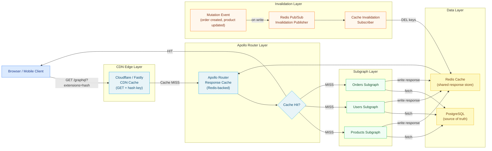

# 02 — Caching Strategies

> GraphQL's flexible query model presents unique caching challenges that do not exist in REST APIs. This chapter covers every caching layer available to a production GraphQL system — from field-level `@cacheControl` directives through Apollo Server's response cache plugin, to CDN edge caching with persisted queries, Redis-backed shared caches, and event-driven cache invalidation strategies for data that changes unpredictably.

---

## Learning Objectives

- [ ] Understand why GraphQL POST requests are not cached by default and how to work around this limitation
- [ ] Annotate schema fields with `@cacheControl(maxAge, scope)` to drive server-side cache policy
- [ ] Configure Apollo Server's response cache plugin with a Redis backend
- [ ] Set up Apollo Router's built-in response cache with per-user private cache separation
- [ ] Enable CDN caching for GraphQL requests using persisted query GET semantics
- [ ] Implement event-driven cache invalidation using Redis pub/sub to purge stale entries on data mutations
- [ ] Apply partial caching strategies to handle queries where some fields are cacheable and others are not

---

## Overview

REST APIs benefit from a decades-old HTTP caching infrastructure: GET requests are cacheable by default, cache keys are derived from the URL and headers, and CDNs like Cloudflare and Fastly cache responses transparently. GraphQL disrupts this model in two fundamental ways. First, almost all GraphQL requests use POST, which HTTP caches treat as non-cacheable by definition. Second, two requests with identical URLs may carry entirely different query documents and expect different responses — the URL alone is insufficient as a cache key.

These challenges are solvable, but require deliberate engineering. The most effective caching stack for a production GraphQL system operates at three distinct layers simultaneously. The field layer (schema directives) annotates individual fields with their cache lifetime and privacy scope, giving the server enough information to compute a cache TTL for any given response. The application layer (Apollo Server plugin + Redis) stores computed responses keyed by operation hash and variable fingerprint, serving repeat requests without re-executing resolvers or hitting the database. The CDN layer (persisted queries + GET requests) pushes public, cacheable responses to the edge, achieving sub-millisecond latency and reducing origin traffic by up to 95% for read-heavy workloads.

Cache invalidation is always the hardest part. Time-based TTL (set maxAge and let entries expire naturally) is the simplest approach and sufficient for data that changes infrequently. Event-driven invalidation (purge cache entries when a mutation changes the underlying data) is more complex but provides correctness guarantees. Tag-based invalidation (associate cache entries with entity tags, purge by tag when an entity changes) provides the best balance of precision and simplicity for entity-oriented APIs.



---

## Core Concepts

### 1. Why POST Breaks HTTP Caching

By default, Apollo Client and most GraphQL clients send operations as HTTP POST requests with the query document in the request body. The HTTP specification defines POST as non-cacheable: the semantics of a POST request are considered non-idempotent, so caches at every layer (browser, CDN, proxy) do not cache POST responses.

This means that even if two clients send identical GraphQL queries, every request reaches the origin server. For read-heavy workloads — product catalog pages, public feeds, navigation queries — this is a significant waste of compute resources.

The fix requires two changes: switch to GET requests for query operations, and ensure the full query document is never in the URL (URLs have a practical ~2KB limit). Persisted queries solve the URL size problem: the client registers the query document once and then sends only its SHA-256 hash in subsequent requests. The server looks up the document by hash, executes it, and returns the response. CDNs and browser caches can now cache the response keyed on the URL hash.

### 2. `@cacheControl` Directive

The `@cacheControl` directive is applied in GraphQL SDL to annotate individual fields with caching metadata. Apollo Server uses these annotations to compute an overall `maxAge` for the entire response (taking the minimum across all resolved fields) and the appropriate `scope` (PUBLIC if all fields are public, PRIVATE if any field is user-specific).

```graphql
# Products subgraph schema
type Query {
  # Public, cacheable for 5 minutes — safe to store at CDN
  product(id: ID!): Product @cacheControl(maxAge: 300, scope: PUBLIC)

  # Public, highly cacheable — changes rarely
  categories: [Category!]! @cacheControl(maxAge: 3600, scope: PUBLIC)

  # Private — user-specific, must not be stored in shared cache
  currentUser: User @cacheControl(maxAge: 60, scope: PRIVATE)

  # Not cacheable — always fresh (stock level)
  stockLevel(productId: ID!): Int! @cacheControl(maxAge: 0)
}

type Product {
  id: ID!
  name: String! @cacheControl(maxAge: 3600)        # Changes rarely
  description: String @cacheControl(maxAge: 3600)   # Changes rarely
  price: Money! @cacheControl(maxAge: 300)           # Changes moderately
  stockCount: Int! @cacheControl(maxAge: 0)          # Always fresh
  images: [ProductImage!]! @cacheControl(maxAge: 86400, scope: PUBLIC)
}

type User {
  id: ID!
  name: String! @cacheControl(maxAge: 300, scope: PRIVATE)
  email: String! @cacheControl(maxAge: 60, scope: PRIVATE)
  # Balance is extremely sensitive — never cache
  accountBalance: Money! @cacheControl(maxAge: 0, scope: PRIVATE)
  orders(first: Int): OrderConnection @cacheControl(maxAge: 30, scope: PRIVATE)
}
```

Apollo Server collects all `@cacheControl` hints from every resolved field and computes:
- **Effective maxAge**: minimum of all resolved field maxAges (one uncacheable field makes the whole response uncacheable)
- **Effective scope**: if any field is PRIVATE, the whole response is PRIVATE

### 3. Partial Caching Challenge

A critical limitation of response-level caching is that it caches the entire operation response as a unit. If a query mixes cacheable and uncacheable fields, the entire response becomes uncacheable.

```graphql
# This query is NOT cacheable because currentUser has maxAge: 0
query ProductPageWithUser {
  product(id: "prod-123") {   # maxAge: 300, PUBLIC
    id
    name
    price
  }
  currentUser {                # maxAge: 60, PRIVATE  
    id
    name
    accountBalance             # maxAge: 0, PRIVATE — this poisons the entire response
  }
}
```

The solution is client-side query splitting: separate the cacheable product query from the user-specific query. Send them as two separate operations. The product response can be cached at the CDN for 5 minutes; the user response bypasses the cache entirely.

```graphql
# Operation 1: cacheable (can be a GET, CDN-cacheable)
query ProductDetail($id: ID!) {
  product(id: $id) {
    id
    name
    description
    price
    images { url alt }
  }
}

# Operation 2: not cacheable (always fresh, always POST)
query CurrentUserBalance {
  currentUser {
    id
    name
    accountBalance
    orders(first: 5) { id total status }
  }
}
```

---

## Real-World Implementation

### Apollo Server Response Cache Plugin with Redis

```typescript
// src/server.ts
import { ApolloServer } from '@apollo/server';
import { ApolloServerPluginCacheControl } from '@apollo/server/plugin/cacheControl';
import responseCachePlugin from '@apollo/server-plugin-response-cache';
import { KeyvAdapter } from '@apollo/utils.keyvadapter';
import Keyv from 'keyv';
import KeyvRedis from '@keyv/redis';
import Redis from 'ioredis';
import { schema } from './schema';

// Create a Redis client with connection pooling
const redis = new Redis({
  host: process.env.REDIS_HOST ?? 'redis-cache',
  port: parseInt(process.env.REDIS_PORT ?? '6379', 10),
  password: process.env.REDIS_PASSWORD,
  db: 0,
  maxRetriesPerRequest: 3,
  lazyConnect: false,
  enableReadyCheck: true,
});

// Wrap Redis in Keyv for the Apollo cache adapter
const cache = new KeyvAdapter(
  new Keyv({
    store: new KeyvRedis(redis),
    namespace: 'graphql-cache',
  })
);

export const server = new ApolloServer({
  schema,
  cache,
  plugins: [
    // Plugin 1: Collect @cacheControl hints during execution
    ApolloServerPluginCacheControl({
      // Default maxAge for fields without explicit @cacheControl annotation
      defaultMaxAge: 0,
      // Set Cache-Control response header for CDN consumption
      calculateHttpHeaders: true,
    }),

    // Plugin 2: Cache full operation responses in Redis
    responseCachePlugin({
      // Derive a session/user identifier for PRIVATE cache separation.
      // Return null for unauthenticated requests (shared PUBLIC cache).
      // Return a stable user ID for authenticated requests (per-user private cache).
      sessionId: async (requestContext) => {
        const userId = requestContext.request.http?.headers.get('x-user-id');
        return userId ?? null;
      },

      // Optionally skip caching for specific operations
      shouldReadFromCache: async (requestContext) => {
        // Never serve mutations from cache
        return requestContext.request.http?.method !== 'POST' ||
          requestContext.operation?.operation !== 'mutation';
      },

      shouldWriteToCache: async (requestContext) => {
        // Don't cache responses with errors
        if (requestContext.response.body.kind === 'single') {
          const errors = requestContext.response.body.singleResult.errors;
          if (errors && errors.length > 0) return false;
        }
        return true;
      },

      // Optionally generate a custom cache key (e.g., include API version)
      generateCacheKey: async (requestContext, keyData) => {
        const apiVersion = requestContext.request.http?.headers.get('x-api-version') ?? 'v1';
        return `${apiVersion}:${keyData}`;
      },
    }),
  ],
});
```

### Apollo Router Response Cache Configuration

```yaml
# router.yaml
supergraph:
  listen: 0.0.0.0:4000

# Response cache configuration
response_cache:
  enabled: true
  
  # Redis backend for shared cache across router instances
  redis:
    url: "${REDIS_URL}"
    # Connection timeout
    connect_timeout: 5s
    # Operation timeout
    timeout: 2s
    # TLS for Redis in production
    tls:
      enabled: true
  
  # Default TTL when no @cacheControl directive is present
  ttl: null
  
  # Separate cache entries by authenticated user
  # This uses the JWT sub claim as the private cache key
  private_id: "${.claims.sub}"
  
  # Entity cache: cache individual entity resolutions
  # so partial entity changes don't invalidate the entire response
  subgraph:
    all:
      ttl: 60s

# Cache control directives processing
headers:
  all:
    request:
      - propagate:
          named: "cache-control"
      - propagate:
          named: "surrogate-control"
```

### CDN Integration with Persisted Queries

```typescript
// Client configuration for CDN-cacheable GET requests
import { ApolloClient, InMemoryCache, HttpLink } from '@apollo/client';
import { createPersistedQueryLink } from '@apollo/client/link/persisted-queries';
import { sha256 } from 'crypto-hash';

// This link automatically:
// 1. On first request: sends full query body (POST) to register the persisted query
// 2. On subsequent requests: sends only the hash (GET) — CDN-cacheable
const persistedQueryLink = createPersistedQueryLink({
  sha256,
  useGETForHashedQueries: true, // Critical: use GET so CDN can cache
});

const httpLink = new HttpLink({
  uri: 'https://api.myapp.com/graphql',
});

export const apolloClient = new ApolloClient({
  link: persistedQueryLink.concat(httpLink),
  cache: new InMemoryCache(),
});
```

```nginx
# Nginx configuration for CDN / reverse proxy caching
# Configure to cache GET requests with the extensions query parameter

location /graphql {
  # Only cache GET requests (persisted queries)
  if ($request_method = POST) {
    proxy_pass http://apollo-router;
    break;
  }

  # Cache GET requests in Nginx proxy cache
  proxy_cache graphql_cache;
  proxy_cache_key "$scheme$request_method$host$request_uri$http_authorization";
  proxy_cache_valid 200 5m;
  proxy_cache_use_stale error timeout updating;
  proxy_cache_background_update on;
  proxy_cache_lock on;

  # Respect Cache-Control headers from the upstream
  proxy_cache_bypass $http_pragma $http_authorization;
  proxy_ignore_headers Set-Cookie;

  # Add cache status to response for debugging
  add_header X-Cache-Status $upstream_cache_status;

  proxy_pass http://apollo-router;
}
```

### Event-Driven Cache Invalidation with Redis Pub/Sub

```typescript
// src/cache/invalidation.ts
import Redis from 'ioredis';
import type { ApolloServerPlugin, BaseContext } from '@apollo/server';

const INVALIDATION_CHANNEL = 'graphql:cache:invalidate';

// Publisher: called from mutation resolvers when data changes
export class CacheInvalidationPublisher {
  constructor(private readonly redis: Redis) {}

  async invalidateByTag(tags: string[]): Promise<void> {
    const message = JSON.stringify({ type: 'TAG_INVALIDATION', tags, timestamp: Date.now() });
    await this.redis.publish(INVALIDATION_CHANNEL, message);
  }

  async invalidateByPattern(pattern: string): Promise<void> {
    const message = JSON.stringify({ type: 'PATTERN_INVALIDATION', pattern, timestamp: Date.now() });
    await this.redis.publish(INVALIDATION_CHANNEL, message);
  }

  async invalidateOperation(operationName: string): Promise<void> {
    const message = JSON.stringify({ type: 'OPERATION_INVALIDATION', operationName, timestamp: Date.now() });
    await this.redis.publish(INVALIDATION_CHANNEL, message);
  }
}

// Subscriber: runs in each router/server process, listens for invalidation events
export class CacheInvalidationSubscriber {
  private readonly subscriber: Redis;

  constructor(
    private readonly cacheRedis: Redis,
    subscriberRedis: Redis
  ) {
    this.subscriber = subscriberRedis;
  }

  async start(): Promise<void> {
    await this.subscriber.subscribe(INVALIDATION_CHANNEL);

    this.subscriber.on('message', async (_channel: string, message: string) => {
      try {
        const event = JSON.parse(message) as InvalidationEvent;
        await this.handleInvalidationEvent(event);
      } catch (err) {
        console.error('Cache invalidation error:', err);
      }
    });

    console.log('Cache invalidation subscriber started');
  }

  private async handleInvalidationEvent(event: InvalidationEvent): Promise<void> {
    switch (event.type) {
      case 'TAG_INVALIDATION': {
        // Delete all cache keys that include any of the specified tags
        for (const tag of event.tags) {
          const keys = await this.cacheRedis.keys(`graphql-cache:*${tag}*`);
          if (keys.length > 0) {
            await this.cacheRedis.del(...keys);
            console.info(`Invalidated ${keys.length} cache entries for tag: ${tag}`);
          }
        }
        break;
      }

      case 'PATTERN_INVALIDATION': {
        const keys = await this.cacheRedis.keys(`graphql-cache:${event.pattern}`);
        if (keys.length > 0) {
          await this.cacheRedis.del(...keys);
          console.info(`Invalidated ${keys.length} cache entries for pattern: ${event.pattern}`);
        }
        break;
      }

      case 'OPERATION_INVALIDATION': {
        // Delete cache entries for a specific operation name
        const keys = await this.cacheRedis.keys(`graphql-cache:*${event.operationName}*`);
        if (keys.length > 0) {
          await this.cacheRedis.del(...keys);
          console.info(`Invalidated ${keys.length} cache entries for operation: ${event.operationName}`);
        }
        break;
      }
    }
  }
}

interface InvalidationEvent {
  type: 'TAG_INVALIDATION' | 'PATTERN_INVALIDATION' | 'OPERATION_INVALIDATION';
  tags?: string[];
  pattern?: string;
  operationName?: string;
  timestamp: number;
}
```

### Using Cache Invalidation in Mutation Resolvers

```typescript
// src/resolvers/mutation/product.ts
import type { GraphQLContext } from '../../context';

interface UpdateProductArgs {
  id: string;
  input: {
    name?: string;
    description?: string;
    price?: number;
  };
}

export async function updateProductResolver(
  _parent: unknown,
  args: UpdateProductArgs,
  context: GraphQLContext
): Promise<Product> {
  // 1. Update the product in the database
  const { rows } = await context.db.query<Product>(
    `UPDATE products
     SET
       name = COALESCE($2, name),
       description = COALESCE($3, description),
       price = COALESCE($4, price),
       updated_at = NOW()
     WHERE id = $1
     RETURNING *`,
    [args.id, args.input.name, args.input.description, args.input.price]
  );

  const updatedProduct = rows[0];
  if (!updatedProduct) {
    throw new Error(`Product ${args.id} not found`);
  }

  // 2. Invalidate cache entries that reference this product
  // Tag-based: any cached response that includes this product's data
  await context.cachePublisher.invalidateByTag([
    `product:${args.id}`,
    `category:${updatedProduct.categoryId}`, // Also invalidate category listings
  ]);

  // 3. Also invalidate the specific operation caches
  await context.cachePublisher.invalidateOperation('ProductDetail');
  await context.cachePublisher.invalidateOperation('ProductList');

  return updatedProduct;
}
```

### Tag-Based Cache Keys

For tag-based invalidation to work, cache entries must be keyed in a way that includes entity identifiers. This requires a custom cache key generator:

```typescript
// Custom cache key that embeds entity tags for later invalidation
const responseCachePlugin = responseCachePlugin({
  sessionId: (ctx) => ctx.request.http?.headers.get('x-user-id') ?? null,

  // Embed entity references in the cache key structure
  // Tags are stored as separate Redis SET members pointing to cache keys
  extraCacheKeyData: async (requestContext) => {
    // Include the operation name and variables fingerprint
    const operationName = requestContext.request.operationName ?? 'Anonymous';
    const variables = JSON.stringify(requestContext.request.variables ?? {});
    return `${operationName}:${variables}`;
  },
});
```

---

## Production Considerations

### Performance

- **Redis connection pooling.** The cache adapter should use a connection pool, not a single Redis connection. Under high concurrency, a single connection becomes a bottleneck. Configure `ioredis` with a cluster or use a pooling library.
- **Cache stampede prevention.** When a heavily-cached entry expires, multiple concurrent requests can simultaneously reach the database (the "thundering herd" problem). Apollo Router's `proxy_cache_lock` (in Nginx) and `stale-while-revalidate` semantics prevent this. In the response cache plugin, use mutex locking on cache misses for high-traffic operations.
- **Cache serialization overhead.** JSON serialization/deserialization of large response bodies adds latency. Benchmark whether the serialization cost is lower than the resolver execution cost. For small, fast responses, caching may add more latency than it saves.

```typescript
// Measure cache overhead
const cacheStart = performance.now();
const cached = await cache.get(key);
const cacheMs = performance.now() - cacheStart;

if (cacheMs > 10) {
  logger.warn({ key, cacheMs }, 'Cache lookup is slow — check Redis connectivity');
}
```

### Security

- **Never cache responses with authentication errors.** If a request returns `UNAUTHENTICATED` or `FORBIDDEN`, ensure the cache plugin's `shouldWriteToCache` hook returns `false`. Caching an error response and serving it to a later, legitimate user is a security vulnerability.
- **Scope separation for PRIVATE responses.** PRIVATE cache entries must be keyed by user ID. Ensure the `sessionId` function returns a stable, opaque user identifier (not the JWT itself, which could rotate). If `sessionId` returns `null` unexpectedly for an authenticated user, their private data may be served from the PUBLIC cache to other users.
- **Avoid caching mutations.** Never cache mutation operations, even if the client sends them as GET requests. The response cache plugin and router configuration both exclude mutations by default, but verify this in integration tests.

### Scaling

- **Redis Cluster for large caches.** A single Redis node has practical limits around 100GB of RAM. Use Redis Cluster with hash slot sharding when the cache footprint exceeds a single node's capacity. The `ioredis` Cluster client handles hash slot routing transparently.
- **TTL tuning by entity type.** A single global TTL is too coarse. Reference data (categories, tags, product types) can have multi-hour TTLs. Transactional data (order status, inventory) needs sub-minute TTLs or event-driven invalidation.
- **Cache warming.** After a Redis flush or failover, the cache starts cold. A cache warming process can pre-populate high-traffic operations by replaying the top-N operations from production traffic logs.

### Observability

```typescript
// Cache hit rate tracking
const cachePlugin: ApolloServerPlugin = {
  async requestDidStart() {
    let cacheHit = false;
    return {
      async responseForOperation(requestContext) {
        // This hook fires only on a cache hit (response returned from cache)
        cacheHit = true;
        requestContext.metrics.responseCacheHit = true;
        cacheHitCounter.inc({ operation: requestContext.request.operationName ?? 'anonymous' });
        return null; // Allow the cached response to proceed
      },
      async willSendResponse(requestContext) {
        if (!cacheHit) {
          cacheMissCounter.inc({ operation: requestContext.request.operationName ?? 'anonymous' });
        }
      },
    };
  },
};
```

Key metrics to track:

| Metric | Type | Alert Threshold |
|--------|------|-----------------|
| `graphql_cache_hit_ratio` | Gauge | Alert if drops below 0.5 for 5 minutes |
| `graphql_cache_invalidations_total` | Counter | Alert if spike > 10x normal rate |
| `graphql_cache_redis_latency_ms` | Histogram | Alert if P99 > 20ms |
| `graphql_cache_size_bytes` | Gauge | Alert if Redis memory > 80% |

---

## Best Practices

1. **Default maxAge to 0.** Apollo Server's `defaultMaxAge` should be 0 (no caching) unless explicitly overridden by `@cacheControl`. This forces engineers to make an explicit, intentional decision to cache each field. Silent over-caching of sensitive data is more dangerous than under-caching.

2. **Use PRIVATE scope for any field derived from authentication context.** If a field's value depends on who is asking (not just what they asked for), annotate it as `scope: PRIVATE`. This includes user-specific prices, personalized recommendations, and account information.

3. **Separate cacheable and non-cacheable queries at the client.** Split dashboard pages into multiple queries: one cacheable query for public/shared data (product info, navigation), one non-cached query for personalized data (cart, user status). This maximizes CDN hit rates.

4. **Set Surrogate-Control (not Cache-Control) for CDN cache duration.** The browser should use a shorter cache duration than the CDN. Send `Surrogate-Control: max-age=300` for CDN TTL and `Cache-Control: max-age=0, must-revalidate` to prevent browser caching of sensitive responses.

5. **Test cache invalidation in integration tests.** Cache invalidation bugs are silent and extremely hard to debug in production. Write integration tests that: (a) populate the cache with a response, (b) fire a mutation that should invalidate it, (c) verify the next request returns fresh data.

6. **Use a dedicated Redis database (db index) for the GraphQL cache.** Using `SELECT 1` (or a separate Redis instance) for the GraphQL cache prevents cache entries from being accidentally flushed when clearing application caches (session data, rate limit counters).

7. **Implement cache stampede protection for high-traffic operations.** For operations that receive >100 requests/second, use a distributed lock (Redis `SET NX PX`) to ensure only one request populates the cache after a miss. Other requests wait and receive the populated cache entry.

---

## Anti-Patterns

### Anti-Pattern 1: Caching PRIVATE Data in the PUBLIC Cache

```typescript
// WRONG: sessionId always returns null — every user shares the same cache
responseCachePlugin({
  sessionId: () => null, // Forces all responses into public cache
});

// If currentUser query is cached here, User A's account balance
// can be served to User B on cache hit
```

**Failure scenario:** A team sets `sessionId` to always return `null` to simplify the cache key. All responses go into the shared public cache. A logged-in user's personal data (name, email, order history) is served from cache to the next user who runs the same query — a GDPR violation and security incident.

**Fix:** Always return the authenticated user's stable identifier from `sessionId`. Test with two different user accounts that the cached response from user A is never served to user B.

### Anti-Pattern 2: Using maxAge Without scope on User-Facing Fields

```graphql
# WRONG: maxAge without explicit scope defaults to PUBLIC in some configurations
type User {
  id: ID!
  email: String! @cacheControl(maxAge: 300)  # Missing: scope: PRIVATE
}
```

**Failure scenario:** `email` is cached with PUBLIC scope and served at CDN edge. Any user who requests another user's profile (if the schema allows it) gets the cached email address at sub-millisecond latency. The absence of `scope: PRIVATE` is the bug.

### Anti-Pattern 3: Invalidating by KEYS Pattern in Production Redis

```typescript
// WRONG: KEYS command is O(N) and blocks the Redis event loop
const keys = await redis.keys('graphql-cache:product:*');
await redis.del(...keys);

// In a production Redis with 1M keys, this blocks all other operations
// for potentially hundreds of milliseconds
```

**Failure scenario:** A product update fires cache invalidation. The Redis instance has 500,000 cache keys. The `KEYS` command takes 800ms and blocks all other Redis clients (including the application) for that duration. The system appears down during the invalidation sweep.

**Fix:** Use `SCAN` with cursor iteration, which is non-blocking:

```typescript
// CORRECT: SCAN iterates incrementally without blocking
async function deleteByPattern(redis: Redis, pattern: string): Promise<number> {
  let cursor = '0';
  let deleted = 0;
  do {
    const [nextCursor, keys] = await redis.scan(cursor, 'MATCH', pattern, 'COUNT', 100);
    cursor = nextCursor;
    if (keys.length > 0) {
      await redis.del(...keys);
      deleted += keys.length;
    }
  } while (cursor !== '0');
  return deleted;
}
```

### Anti-Pattern 4: Long TTLs on Mutation-Adjacent Data

```graphql
# WRONG: price changes frequently but is cached for an hour
type Product {
  price: Money! @cacheControl(maxAge: 3600)
}
```

**Failure scenario:** A pricing team runs a flash sale and updates 500 product prices in the database. Customers continue to see old prices from the cache for up to 60 minutes. Revenue is lost and customer support is flooded with complaints.

**Fix:** Either set `maxAge: 60` for price fields and accept the shorter TTL, or implement event-driven invalidation that publishes a `product:${id}` tag invalidation event whenever a price changes.

---

## Operational Notes

- **Monitor Redis eviction.** If Redis is configured with `maxmemory` and `allkeys-lru` eviction policy, it will evict cache entries under memory pressure. This is silent and does not produce errors — it just increases cache miss rates. Monitor the `evicted_keys` Redis metric.
- **Cache warming after deployment.** A new deployment that flushes the cache cold can cause a spike in database load as the cache warms. Implement a canary deployment strategy that gradually shifts traffic to new pods, allowing the cache to warm incrementally.
- **Apollo Router response cache vs. Apollo Server response cache.** Do not run both simultaneously — they will compete and the Router cache will always win, making the Server cache layer invisible. Choose one location: router (preferred for federation) or server (for standalone Apollo Server without router).
- **Persisted query registration.** In strict persisted query mode, the server rejects queries that are not pre-registered. Ensure your CI/CD pipeline extracts all client query documents and registers them with the server before deploying new client versions.

```yaml
# router.yaml — persisted queries (APQ) with strict mode
persisted_queries:
  enabled: true
  safelist:
    enabled: true
    require_id: true  # Reject documents not in the safelist
```

---

## References

- [Apollo Response Cache Plugin Documentation](https://www.apollographql.com/docs/apollo-server/performance/caching/) — Official Apollo Server response caching guide including `@cacheControl`, the plugin API, and CDN integration patterns
- [Apollo Router Response Cache](https://www.apollographql.com/docs/router/configuration/cache/) — Apollo Router built-in response cache configuration reference including Redis setup and private cache separation
- [HTTP Caching (RFC 7234)](https://datatracker.ietf.org/doc/html/rfc7234) — The HTTP specification defining cache semantics, Cache-Control directives, and the formal definition of cacheable vs. non-cacheable methods

---

## Related Topics

- [01-query-optimization.md](./01-query-optimization.md) — Persisted queries for performance and CDN-compatibility
- [03-horizontal-scaling.md](./03-horizontal-scaling.md) — Redis cluster configuration for scaled cache infrastructure
- [04-performance-monitoring.md](./04-performance-monitoring.md) — Cache hit rate dashboards and Redis latency alerts
- [../17-caching-strategies/](../17-caching-strategies/) — Advanced caching patterns including entity cache and subgraph-level caching
- [../05-security/](../05-security/) — Preventing cache poisoning and scope misconfiguration security vulnerabilities
