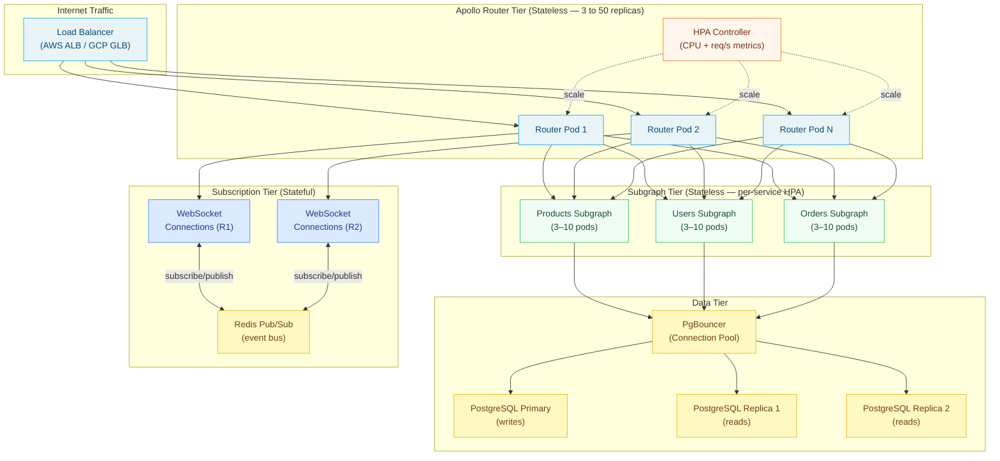

# 03 — Horizontal Scaling

> Horizontal scaling in a GraphQL federation requires understanding which components are stateless (and scale trivially) and which components carry state (and require explicit coordination strategies). This chapter covers Apollo Router scaling with Kubernetes HPA, subgraph pod scaling, the fundamental challenge of stateful WebSocket subscriptions, database read replica patterns, and zero-downtime blue-green schema deployments.

---

## Learning Objectives

- [ ] Explain why Apollo Router is stateless and how that enables transparent horizontal scaling
- [ ] Configure a Kubernetes HPA for Apollo Router based on both CPU utilization and custom request-rate metrics
- [ ] Apply connection pool and keep-alive settings in Apollo Router to prevent subgraph connection exhaustion under load
- [ ] Design a Redis pub/sub subscription fan-out architecture that allows multiple router instances to serve WebSocket clients
- [ ] Configure PostgreSQL read replicas in subgraphs to distribute read-heavy workloads
- [ ] Implement a blue-green deployment strategy for zero-downtime schema updates

---

## Overview

A production GraphQL federation consists of two categories of components: stateless and stateful. Stateless components have no memory of previous requests and can be replaced or multiplied without coordination. Stateful components must agree on shared state — either through a shared backend store or through sticky routing. Understanding this distinction is the foundation of all scaling decisions.

Apollo Router is fully stateless. It holds the compiled supergraph schema in memory, but this is a read-only artifact loaded at startup. Every request is processed independently: the router parses the incoming query, builds a query plan, executes subgraph fetches, and assembles the response — all without consulting any shared state. This means a Kubernetes HPA can scale the router deployment from 3 to 50 replicas transparently, with no session affinity required.

Subgraphs are also typically stateless when written correctly. A subgraph resolves entities by querying its database and returning JSON. As long as the subgraph does not hold in-process session state, it too scales horizontally. The complication is the database: adding more subgraph pods increases the number of concurrent database connections. Connection pooling (PgBouncer, RDS Proxy) prevents connection exhaustion as subgraph pod counts grow.

GraphQL subscriptions are the exception. WebSocket connections are long-lived and stateful: a client connects to a specific router instance and expects to receive all events for the lifetime of that connection. When subscriptions are naively implemented with a single in-process pub/sub mechanism, scaling the router breaks subscription delivery — a mutation processed by Router Instance A cannot notify a subscriber connected to Router Instance B. The standard solution is Redis pub/sub as an external message bus: mutations publish events to Redis, and all router instances subscribe and deliver matching events to their connected WebSocket clients.



---

## Core Concepts

### 1. Stateless Router Architecture

Apollo Router's stateless design stems from how it handles the supergraph schema. The compiled supergraph schema binary (`supergraph.graphql`) is fetched at startup from Apollo Uplink (the managed schema registry) and stored in memory as an immutable struct. When Apollo Studio publishes a new schema composition, the router polls Uplink and hot-reloads the schema in-place — no restart, no shared state migration.

Because each router pod independently polls Uplink, new schema versions propagate to all pods within the polling interval (default: 10 seconds). During the propagation window, different router pods may be serving different schema versions simultaneously. This is safe because Federation uses additive schema evolution: a query valid against the old schema remains valid against the new schema.

Query plans are computed from the schema and the incoming query document. They are deterministic given the same schema and query, making them safe to cache. Apollo Router maintains a per-instance in-memory query plan cache (LRU, configurable capacity). This cache does not need to be shared across instances — each pod builds its own cache from actual traffic.

### 2. Kubernetes HPA Configuration

The Kubernetes HorizontalPodAutoscaler (HPA) adjusts the replica count of a Deployment based on observed metrics. Apollo Router exposes metrics on a Prometheus endpoint, enabling custom-metric-based autoscaling via the Prometheus Adapter.

**CPU-based scaling** is the baseline. The Apollo Router binary is CPU-bound during query parsing and query plan construction. CPU utilization correlates predictably with request rate for a given schema complexity distribution.

**Request-rate-based scaling** is more precise. CPU has a response lag — it takes time for CPU utilization to rise after a traffic spike. Scaling on `graphql_requests_per_second` (a Prometheus custom metric) reacts immediately to traffic increases.

### 3. Subgraph Connection Management

Each Apollo Router pod maintains a pool of HTTP keep-alive connections to each subgraph. When the router scales from 3 to 30 pods, the subgraph sees its connection count multiply by 10. If the subgraph or its upstream database cannot handle this connection surge, it will become the bottleneck.

Configure connection limits in `router.yaml` to prevent connection exhaustion:

```yaml
# router.yaml — subgraph connection pool settings
traffic_shaping:
  all:
    # Maximum concurrent requests across all subgraphs per router pod
    global_rate_limit:
      capacity: 1000
      interval: 1s

  router:
    # Keep connections alive (avoid TCP handshake overhead on every request)
    http2:
      enabled: true

subgraph:
  all:
    # Per-subgraph settings applied to every subgraph
    connect_timeout: 3s
    request_timeout: 30s

    http2:
      enabled: false  # Disable HTTP/2 for subgraphs that don't support it

    # Connection pool: max idle connections per router pod per subgraph
    # Default is unlimited — set explicitly to prevent exhaustion
    pool_idle_timeout: 30s
```

### 4. Subscription Scaling with Redis Pub/Sub

The fundamental problem with horizontal subscription scaling is event routing. When a subscription is created, the client establishes a WebSocket connection to a specific router pod. When a mutation occurs, any router pod (or subgraph pod) may process it. For the subscriber to receive the event, the event must be delivered to the specific router pod holding the subscriber's WebSocket connection.

Redis pub/sub solves this with a broadcast pattern: every router instance subscribes to the relevant Redis channel. When a mutation publishes an event, all router instances receive it. Each instance filters events against its locally-connected subscribers and delivers only matching events to the appropriate WebSocket connections.

```typescript
// src/subscriptions/pubsub.ts
import { RedisPubSub } from 'graphql-redis-subscriptions';
import Redis from 'ioredis';

const redisOptions = {
  host: process.env.REDIS_HOST ?? 'redis-subscriptions',
  port: parseInt(process.env.REDIS_PORT ?? '6379', 10),
  password: process.env.REDIS_PASSWORD,
  retryStrategy: (times: number) => Math.min(times * 100, 3000),
};

// Two separate Redis connections: one for publishing, one for subscribing
// ioredis requires separate connections because SUBSCRIBE blocks the connection
export const pubsub = new RedisPubSub({
  publisher: new Redis(redisOptions),
  subscriber: new Redis(redisOptions),
  // Optional: namespace channels to avoid collisions with other Redis usage
  reviver: null,
});
```

---

## Real-World Implementation

### Kubernetes HPA for Apollo Router

```yaml
# k8s/router-deployment.yaml
apiVersion: apps/v1
kind: Deployment
metadata:
  name: apollo-router
  namespace: graphql
  labels:
    app: apollo-router
    tier: gateway
spec:
  replicas: 3  # Minimum replicas (HPA will manage beyond this)
  selector:
    matchLabels:
      app: apollo-router
  strategy:
    type: RollingUpdate
    rollingUpdate:
      maxSurge: 2          # Allow 2 extra pods during update
      maxUnavailable: 0    # Zero-downtime rolling update
  template:
    metadata:
      labels:
        app: apollo-router
      annotations:
        prometheus.io/scrape: "true"
        prometheus.io/port: "9090"
        prometheus.io/path: "/metrics"
    spec:
      terminationGracePeriodSeconds: 60  # Allow in-flight requests to complete
      containers:
        - name: router
          image: ghcr.io/apollographql/router:v1.40.0
          ports:
            - name: http
              containerPort: 4000
            - name: metrics
              containerPort: 9090
          env:
            - name: APOLLO_KEY
              valueFrom:
                secretKeyRef:
                  name: apollo-credentials
                  key: apollo-key
            - name: APOLLO_GRAPH_REF
              value: "my-graph@production"
            - name: REDIS_URL
              valueFrom:
                secretKeyRef:
                  name: redis-credentials
                  key: url
          args:
            - "--config"
            - "/etc/router/router.yaml"
          volumeMounts:
            - name: router-config
              mountPath: /etc/router
          resources:
            requests:
              cpu: "500m"
              memory: "512Mi"
            limits:
              cpu: "2000m"
              memory: "2Gi"
          readinessProbe:
            httpGet:
              path: /health?ready
              port: 8088
            initialDelaySeconds: 5
            periodSeconds: 5
            failureThreshold: 3
          livenessProbe:
            httpGet:
              path: /health
              port: 8088
            initialDelaySeconds: 10
            periodSeconds: 10
            failureThreshold: 3
      volumes:
        - name: router-config
          configMap:
            name: apollo-router-config
---
# k8s/router-hpa.yaml
apiVersion: autoscaling/v2
kind: HorizontalPodAutoscaler
metadata:
  name: apollo-router-hpa
  namespace: graphql
spec:
  scaleTargetRef:
    apiVersion: apps/v1
    kind: Deployment
    name: apollo-router
  minReplicas: 3
  maxReplicas: 50
  metrics:
    # Scale on CPU utilization (built-in metric, no adapter needed)
    - type: Resource
      resource:
        name: cpu
        target:
          type: Utilization
          averageUtilization: 60  # Scale up when CPU > 60% across all pods

    # Scale on request rate (custom metric via Prometheus Adapter)
    - type: Pods
      pods:
        metric:
          name: graphql_requests_per_second
        target:
          type: AverageValue
          averageValue: "500"  # Target 500 req/s per pod

    # Scale on memory utilization to catch memory leaks early
    - type: Resource
      resource:
        name: memory
        target:
          type: Utilization
          averageUtilization: 80

  behavior:
    scaleUp:
      stabilizationWindowSeconds: 30   # React to traffic spikes quickly
      policies:
        - type: Pods
          value: 5                     # Add up to 5 pods per scaling event
          periodSeconds: 60
        - type: Percent
          value: 100                   # Or double the current count, whichever is larger
          periodSeconds: 60
      selectPolicy: Max
    scaleDown:
      stabilizationWindowSeconds: 300  # Wait 5 minutes before scaling down
      policies:
        - type: Pods
          value: 2                     # Remove at most 2 pods per scaling event
          periodSeconds: 120
```

### Subgraph HPA with Per-Service Tuning

```yaml
# k8s/products-subgraph-hpa.yaml
# Products is a read-heavy subgraph — scales aggressively
apiVersion: autoscaling/v2
kind: HorizontalPodAutoscaler
metadata:
  name: products-subgraph-hpa
  namespace: graphql
spec:
  scaleTargetRef:
    apiVersion: apps/v1
    kind: Deployment
    name: products-subgraph
  minReplicas: 3
  maxReplicas: 20
  metrics:
    - type: Resource
      resource:
        name: cpu
        target:
          type: Utilization
          averageUtilization: 50   # Lower threshold for read-heavy service
    - type: Pods
      pods:
        metric:
          name: subgraph_requests_per_second
        target:
          type: AverageValue
          averageValue: "200"
---
# k8s/orders-subgraph-hpa.yaml
# Orders is a write-heavy subgraph — scales conservatively
apiVersion: autoscaling/v2
kind: HorizontalPodAutoscaler
metadata:
  name: orders-subgraph-hpa
  namespace: graphql
spec:
  scaleTargetRef:
    apiVersion: apps/v1
    kind: Deployment
    name: orders-subgraph
  minReplicas: 2
  maxReplicas: 10
  metrics:
    - type: Resource
      resource:
        name: cpu
        target:
          type: Utilization
          averageUtilization: 70
```

### Prometheus Adapter for Custom HPA Metrics

```yaml
# k8s/prometheus-adapter-config.yaml
apiVersion: v1
kind: ConfigMap
metadata:
  name: prometheus-adapter-config
  namespace: monitoring
data:
  config.yaml: |
    rules:
      # Expose graphql_requests_per_second as a custom metric for HPA
      - seriesQuery: 'apollo_router_http_requests_total{namespace!="",pod!=""}'
        resources:
          overrides:
            namespace: {resource: "namespace"}
            pod: {resource: "pod"}
        name:
          matches: "^apollo_router_http_requests_total"
          as: "graphql_requests_per_second"
        metricsQuery: |
          rate(apollo_router_http_requests_total{<<.LabelMatchers>>}[2m])

      # Expose subgraph-level request rate
      - seriesQuery: 'apollo_router_http_requests_total{subgraph!="",namespace!="",pod!=""}'
        resources:
          overrides:
            namespace: {resource: "namespace"}
            pod: {resource: "pod"}
        name:
          matches: "^apollo_router_http_requests_total"
          as: "subgraph_requests_per_second"
        metricsQuery: |
          rate(apollo_router_http_requests_total{<<.LabelMatchers>>}[2m])
```

### PgBouncer for Database Connection Pooling

```ini
# pgbouncer.ini — connection pool configuration
[databases]
; Route reads to replicas, writes to primary
products_read = host=products-pg-replica-1 dbname=products
products = host=products-pg-primary dbname=products

[pgbouncer]
listen_addr = *
listen_port = 5432
auth_type = scram-sha-256
auth_file = /etc/pgbouncer/userlist.txt

; Transaction pooling: most efficient for stateless services
; Connection is released back to pool at the end of each transaction
pool_mode = transaction

; Maximum connections to each PostgreSQL server
server_pool_size = 25

; Maximum client connections this PgBouncer will accept
max_client_conn = 500

; Minimum number of idle server connections to maintain per pool
min_pool_size = 5

; Maximum time to wait for a connection from the pool (ms)
server_connect_timeout = 15

; Log slow server connections
log_connections = 1
log_disconnections = 1
log_pooler_errors = 1
```

```typescript
// Subgraph: routing reads to replica, writes to primary
import { Pool } from 'pg';

const primaryPool = new Pool({
  connectionString: process.env.DATABASE_PRIMARY_URL,
  max: 10,  // Max connections per subgraph pod — PgBouncer handles the rest
  idleTimeoutMillis: 30000,
  connectionTimeoutMillis: 5000,
});

const replicaPool = new Pool({
  connectionString: process.env.DATABASE_REPLICA_URL,
  max: 20,  // Replicas can handle more connections (read-only workload)
  idleTimeoutMillis: 30000,
  connectionTimeoutMillis: 5000,
});

export class ProductRepository {
  // Route reads to replica
  async findById(id: string): Promise<Product | null> {
    const { rows } = await replicaPool.query<Product>(
      'SELECT * FROM products WHERE id = $1 AND deleted_at IS NULL',
      [id]
    );
    return rows[0] ?? null;
  }

  async search(query: string, limit: number): Promise<Product[]> {
    const { rows } = await replicaPool.query<Product>(
      `SELECT * FROM products
       WHERE search_vector @@ plainto_tsquery('english', $1)
       AND deleted_at IS NULL
       ORDER BY ts_rank(search_vector, plainto_tsquery('english', $1)) DESC
       LIMIT $2`,
      [query, limit]
    );
    return rows;
  }

  // Route writes to primary
  async updatePrice(id: string, price: number): Promise<Product> {
    const { rows } = await primaryPool.query<Product>(
      `UPDATE products
       SET price = $2, updated_at = NOW()
       WHERE id = $1
       RETURNING *`,
      [id, price]
    );
    if (!rows[0]) throw new Error(`Product ${id} not found`);
    return rows[0];
  }
}
```

### Full Subscription Scaling Implementation

```typescript
// src/resolvers/subscription/orderStatus.ts
import { pubsub } from '../subscriptions/pubsub';
import type { GraphQLContext } from '../context';

const ORDER_STATUS_UPDATED = 'ORDER_STATUS_UPDATED';

interface OrderStatusUpdatedPayload {
  orderId: string;
  newStatus: string;
  updatedAt: string;
  customerId: string;
}

export const orderStatusSubscriptionResolvers = {
  Subscription: {
    orderStatusUpdated: {
      // subscribe: returns an AsyncIterator that yields events from Redis pub/sub
      subscribe: async (
        _parent: unknown,
        args: { orderId: string },
        context: GraphQLContext
      ) => {
        // Authorization: only allow the order owner to subscribe
        const order = await context.loaders.order.load(args.orderId);
        if (!order) throw new Error('Order not found');
        if (order.customerId !== context.currentUser?.id) {
          throw new Error('Not authorized to subscribe to this order');
        }

        // Subscribe to the specific order's channel
        const channel = `${ORDER_STATUS_UPDATED}:${args.orderId}`;
        return pubsub.asyncIterator([channel]);
      },

      // resolve: transform the raw Redis event into the GraphQL response shape
      resolve: (payload: OrderStatusUpdatedPayload) => ({
        orderId: payload.orderId,
        status: payload.newStatus,
        updatedAt: payload.updatedAt,
      }),
    },
  },

  Mutation: {
    updateOrderStatus: async (
      _parent: unknown,
      args: { orderId: string; status: string },
      context: GraphQLContext
    ) => {
      // 1. Update in database (via primary)
      const updatedOrder = await context.orderRepository.updateStatus(args.orderId, args.status);

      // 2. Publish to Redis — all router instances subscribed to this channel receive the event
      const channel = `${ORDER_STATUS_UPDATED}:${args.orderId}`;
      await pubsub.publish(channel, {
        orderId: updatedOrder.id,
        newStatus: updatedOrder.status,
        updatedAt: updatedOrder.updatedAt.toISOString(),
        customerId: updatedOrder.customerId,
      });

      return updatedOrder;
    },
  },
};
```

### WebSocket Sticky Sessions with ALB

WebSocket connections require sticky sessions to ensure a client's long-lived connection stays on the same pod. AWS ALB supports sticky sessions via a cookie:

```yaml
# k8s/router-service.yaml
apiVersion: v1
kind: Service
metadata:
  name: apollo-router
  namespace: graphql
  annotations:
    # AWS ALB: enable sticky sessions for WebSocket subscription connections
    service.beta.kubernetes.io/aws-load-balancer-type: "alb"
    service.beta.kubernetes.io/aws-load-balancer-stickiness-enabled: "true"
    service.beta.kubernetes.io/aws-load-balancer-stickiness-lb-cookie-duration-seconds: "86400"
spec:
  selector:
    app: apollo-router
  ports:
    - name: http
      port: 80
      targetPort: 4000
    - name: ws
      port: 443
      targetPort: 4000
  type: LoadBalancer
```

### Blue-Green Deployment for Schema Updates

```yaml
# k8s/blue-green-router.yaml
# Blue deployment: current production
apiVersion: apps/v1
kind: Deployment
metadata:
  name: apollo-router-blue
  namespace: graphql
  labels:
    app: apollo-router
    slot: blue
spec:
  replicas: 5
  selector:
    matchLabels:
      app: apollo-router
      slot: blue
  template:
    metadata:
      labels:
        app: apollo-router
        slot: blue
    spec:
      containers:
        - name: router
          image: ghcr.io/apollographql/router:v1.40.0
          env:
            - name: APOLLO_GRAPH_REF
              value: "my-graph@production"
---
# Green deployment: new version (receives 0% traffic initially)
apiVersion: apps/v1
kind: Deployment
metadata:
  name: apollo-router-green
  namespace: graphql
  labels:
    app: apollo-router
    slot: green
spec:
  replicas: 5
  selector:
    matchLabels:
      app: apollo-router
      slot: green
  template:
    metadata:
      labels:
        app: apollo-router
        slot: green
    spec:
      containers:
        - name: router
          image: ghcr.io/apollographql/router:v1.41.0  # New version
          env:
            - name: APOLLO_GRAPH_REF
              value: "my-graph@production"
---
# Service selector: switch between blue and green by changing this label
apiVersion: v1
kind: Service
metadata:
  name: apollo-router
  namespace: graphql
spec:
  selector:
    app: apollo-router
    slot: blue    # Change to "green" to cut over traffic
  ports:
    - port: 80
      targetPort: 4000
```

Switch-over script:

```bash
#!/bin/bash
# scripts/cutover-to-green.sh

set -euo pipefail

NAMESPACE="graphql"
SERVICE="apollo-router"
NEW_SLOT="${1:-green}"  # Pass "blue" or "green"

echo "Switching ${SERVICE} to slot: ${NEW_SLOT}"

# Verify the green deployment is healthy before cutting over
READY_PODS=$(kubectl get deployment apollo-router-${NEW_SLOT} \
  -n ${NAMESPACE} \
  -o jsonpath='{.status.readyReplicas}')

DESIRED_PODS=$(kubectl get deployment apollo-router-${NEW_SLOT} \
  -n ${NAMESPACE} \
  -o jsonpath='{.spec.replicas}')

if [ "${READY_PODS}" != "${DESIRED_PODS}" ]; then
  echo "ERROR: ${NEW_SLOT} deployment not fully ready (${READY_PODS}/${DESIRED_PODS} pods)"
  exit 1
fi

# Patch the service selector to point to the new slot
kubectl patch service ${SERVICE} \
  -n ${NAMESPACE} \
  --type='json' \
  -p="[{\"op\": \"replace\", \"path\": \"/spec/selector/slot\", \"value\": \"${NEW_SLOT}\"}]"

echo "Traffic switched to ${NEW_SLOT}. Monitor error rates before scaling down ${OLD_SLOT}."
```

---

## Production Considerations

### Performance

- **Query plan cache sizing.** Apollo Router maintains an in-memory query plan cache. The default capacity is 512 plans. For large APIs with high operation diversity, increase this to avoid cache evictions and repeated plan compilation CPU cost.

```yaml
# router.yaml
supergraph:
  query_planning:
    cache:
      in_memory:
        limit: 2000
```

- **HTTP/2 between router and subgraphs.** HTTP/2 multiplexes multiple requests over a single TCP connection. For high-throughput subgraph calls, enabling HTTP/2 reduces connection overhead significantly. Configure subgraphs to expose gRPC or HTTP/2 endpoints and set `http2: { enabled: true }` in router.yaml.

- **Subgraph response size.** Large subgraph responses (>1MB) strain the router's memory and serialization pipeline. Enforce field-level pagination limits and warn when subgraph responses exceed a threshold.

### Security

- **mTLS between router and subgraphs.** In a Kubernetes cluster, pod-to-pod communication is unencrypted by default. Use Istio or Linkerd service mesh to enforce mTLS on all router-to-subgraph connections. Alternatively, configure Apollo Router's `tls` subgraph settings with client certificates.
- **Resource limits prevent noisy neighbor problems.** Always set `resources.limits` on all pods. An unconstrained pod on the same node can monopolize CPU or memory and starve neighboring pods. Set limits at approximately 2× the `resources.requests` value.

### Scaling

- **Subscription connection limits.** Each WebSocket connection holds memory (connection state, subscription filter, channel subscription). A single router pod can handle approximately 10,000 concurrent WebSocket connections before memory pressure becomes a concern. Set a hard limit via load balancer connection limits and monitor `graphql_active_subscriptions`.
- **Scale-down grace period.** The HPA `scaleDown.stabilizationWindowSeconds` (300 seconds in the example config) prevents flapping during oscillating traffic. Do not set it below 60 seconds for production workloads.
- **Drain in-flight requests before pod termination.** Set `terminationGracePeriodSeconds: 60` and configure the router's `--hot-reload` flag. The router will stop accepting new connections when it receives SIGTERM but will complete all in-flight requests before exiting.

### Observability

- Monitor `apollo_router_http_requests_in_flight` to understand request concurrency per pod. Consistently high in-flight counts (>200 per pod) indicate the pod is undersized or slow subgraph responses are queuing up.
- Track `apollo_router_cache_hit_count` and `apollo_router_cache_miss_count` to measure query plan cache effectiveness. A hit ratio below 80% suggests high operation diversity or the cache capacity is too small.
- Alert on pod restart rate (`kube_pod_container_status_restarts_total`). Frequent router restarts indicate memory limit breaches, OOMKilled events, or liveness probe failures.

---

## Best Practices

1. **Never use sticky sessions for non-WebSocket traffic.** Sticky sessions prevent HPA from distributing load evenly. Only enable session affinity for WebSocket subscription connections. Standard query and mutation traffic must be routed round-robin.

2. **Test failover by killing pods deliberately.** In a non-production environment, use `kubectl delete pod <router-pod> --grace-period=0` to simulate abrupt pod termination. Verify that the load balancer routes traffic to surviving pods within the readiness probe interval and that no requests are dropped.

3. **Size connection pools conservatively before scaling.** Calculate the maximum database connections: `(max_subgraph_pods) × (db_connections_per_pod)`. Ensure this does not exceed the database's `max_connections` setting. PgBouncer's `server_pool_size × number_of_databases` is the effective multiplier.

4. **Use PodDisruptionBudgets to prevent mass eviction.** A node maintenance event can evict all pods on the node simultaneously. A PodDisruptionBudget ensures at least N pods remain available during voluntary disruptions.

```yaml
apiVersion: policy/v1
kind: PodDisruptionBudget
metadata:
  name: apollo-router-pdb
  namespace: graphql
spec:
  minAvailable: 2   # Always keep at least 2 router pods running
  selector:
    matchLabels:
      app: apollo-router
```

5. **Separate Redis instances for caching and pub/sub.** Response cache Redis and subscription pub/sub Redis have very different access patterns and eviction behaviors. Run them as separate Redis instances or at minimum separate databases (`SELECT 1` vs `SELECT 2`). A cache flush must never affect subscription delivery.

6. **Use resource requests based on measured baseline.** Set `resources.requests.cpu` to the P95 CPU usage measured under normal traffic (not peak). HPA uses resource requests as the denominator for utilization calculations. Under-specified requests cause HPA to scale up too aggressively; over-specified requests waste cluster capacity.

7. **Implement circuit breakers for subgraph communication.** If a subgraph is unhealthy, the router should fail fast rather than accumulating slow requests. Configure Apollo Router's timeout and retry settings to return partial responses (with errors) rather than hanging until the global request timeout.

```yaml
# router.yaml — subgraph circuit breaker settings
traffic_shaping:
  subgraph:
    all:
      # Retry once on transient errors (connection reset, 503)
      retry:
        enabled: true
        min_per_sec: 10
        ttl: 10s
        retry_on_http_statuses: [500, 502, 503, 504]
```

---

## Anti-Patterns

### Anti-Pattern 1: In-Process Pub/Sub for Subscriptions

```typescript
// WRONG: EventEmitter is in-process — only works with a single router pod
import { EventEmitter } from 'events';
const emitter = new EventEmitter();

const resolvers = {
  Subscription: {
    orderUpdated: {
      subscribe: (_parent, args) => {
        // This only works if the mutation and the subscriber hit the same pod
        return asyncIteratorFromEmitter(emitter, `order:${args.orderId}`);
      },
    },
  },
  Mutation: {
    updateOrder: async (_parent, args) => {
      const updated = await db.updateOrder(args);
      emitter.emit(`order:${args.orderId}`, updated); // Only fires on this pod
      return updated;
    },
  },
};
```

**Failure scenario:** With 5 router pods, a mutation processed by Pod 3 emits the event locally. The subscriber connected to Pod 1 never receives the event. The subscription appears to silently drop events at random — actually every event from a different pod is dropped.

### Anti-Pattern 2: Scaling Subgraphs Without Scaling the Database

```yaml
# WRONG: subgraph autoscales to 20 pods, but database has max_connections = 100
apiVersion: autoscaling/v2
kind: HorizontalPodAutoscaler
spec:
  maxReplicas: 20  # 20 pods × 10 connections each = 200 connections
  # Database max_connections is 100 — this will cause "too many clients" errors
```

**Failure scenario:** A traffic spike triggers the HPA to scale the products subgraph from 5 to 20 pods. Each pod opens 10 database connections. PostgreSQL hits its `max_connections = 100` limit and starts rejecting new connections with `FATAL: sorry, too many clients already`. All 20 pods begin failing health checks and are killed by Kubernetes, causing a complete outage.

**Fix:** Install PgBouncer as a connection multiplexer in front of PostgreSQL. PgBouncer maintains a small pool of PostgreSQL connections and serves up to 500 client connections through them.

### Anti-Pattern 3: No PodDisruptionBudget

```bash
# Without a PDB, a node drain during maintenance evicts all pods simultaneously
kubectl drain node-3 --ignore-daemonsets --delete-emptydir-data

# If all router pods happen to be on node-3, this causes a full outage
# The HPA creates new pods, but there is a startup delay during which
# the service is completely unavailable
```

**Failure scenario:** An engineer drains a Kubernetes node for maintenance at 2 PM. By coincidence (and poor scheduling), all 3 router pods are on that node. The router service goes down for 45 seconds while new pods start. All in-flight requests fail, and users receive 502 errors. A PDB would have caused the drain to block until pods were rescheduled.

---

## Operational Notes

- **Monitor pod startup time.** Apollo Router startup time includes schema fetch from Uplink (network call) and schema compilation (CPU-bound). Measure P95 startup time and ensure it is well below the HPA's cooldown period. If startup takes >30 seconds, the HPA may scale down new pods before they become ready.
- **Test schema hot-reload.** With `APOLLO_GRAPH_REF` set and schema polling active, deploy a non-breaking schema change and verify that all router pods pick up the new schema within the polling interval (default 10 seconds) without restarting.
- **WebSocket connection draining.** When a router pod receives SIGTERM, it should gracefully close all WebSocket connections with a `4001` close code, prompting clients to reconnect to a different pod. Verify this behavior with load tests using tools like `k6` with WebSocket support.
- **Replica lag monitoring.** For read replica routing, monitor replication lag between primary and replica using `SELECT EXTRACT(EPOCH FROM (now() - pg_last_xact_replay_timestamp()))::int AS lag_seconds`. If lag exceeds a threshold (e.g., 5 seconds), route reads back to the primary to prevent serving stale data.

---

## References

- [Kubernetes Horizontal Pod Autoscaler Documentation](https://kubernetes.io/docs/tasks/run-application/horizontal-pod-autoscale/) — Official Kubernetes HPA reference including v2 metrics API, behavior policies, and custom metric configuration
- [Apollo Router Traffic Shaping](https://www.apollographql.com/docs/router/configuration/traffic-shaping/) — Apollo Router documentation for timeout, retry, rate limiting, and connection pool configuration
- [graphql-redis-subscriptions](https://github.com/davidyaha/graphql-redis-subscriptions) — Redis pub/sub backend for GraphQL subscriptions, enabling stateless horizontal scaling of subscription-capable GraphQL servers

---

## Related Topics

- [02-caching-strategies.md](./02-caching-strategies.md) — Redis cluster setup that complements the pub/sub patterns described here
- [04-performance-monitoring.md](./04-performance-monitoring.md) — HPA-relevant metrics (request rate, pod count, latency) and Grafana dashboards
- [../15-kubernetes-deployment/](../15-kubernetes-deployment/) — Full Kubernetes deployment manifests including Ingress, TLS, and NetworkPolicy configuration
- [../16-service-mesh-integration/](../16-service-mesh-integration/) — mTLS and traffic management between router and subgraphs using Istio or Linkerd
- [../07-federation/](../07-federation/) — Subgraph entity resolution patterns that affect horizontal scaling characteristics
