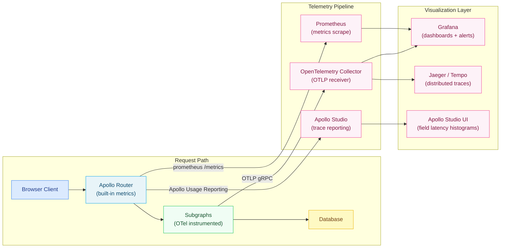

# 04 — Performance Monitoring

> REST API monitoring works at the endpoint level: which URL is slow, how many requests per second, what is the error rate. GraphQL performance monitoring must go deeper — to the field level. A single slow resolver buried inside a complex query can dominate the total response time invisibly. This chapter covers the full observability stack for production GraphQL: OpenTelemetry resolver instrumentation, Prometheus metrics, Apollo Studio traces, slow query detection, and Grafana dashboards with GraphQL-specific panels.

---

## Learning Objectives

- [ ] Explain why field-level granularity is essential for meaningful GraphQL performance monitoring
- [ ] Instrument Apollo Server resolvers with OpenTelemetry spans to produce distributed traces
- [ ] Configure Apollo Router's built-in Prometheus metrics endpoint and interpret key metrics
- [ ] Write PromQL queries for operation latency percentiles, error rates, and top slow fields
- [ ] Build a Grafana dashboard with GraphQL-specific SLO panels
- [ ] Implement slow query detection with structured logging and operation signature normalization
- [ ] Integrate Apollo Studio trace reporting with field-level latency histograms

---

## Overview

A GraphQL API exposes a single HTTP endpoint — typically `POST /graphql` — for all operations. Traditional API monitoring tools that track latency by URL path see one endpoint and produce a single aggregate latency metric that masks all performance variation. A query for a user's profile (fast, single DB call) and a query for an admin dashboard (slow, dozens of resolver invocations) are both `POST /graphql` from the perspective of an HTTP load balancer.

Meaningful GraphQL monitoring requires three levels of granularity. At the operation level, metrics are grouped by operation name (the named query or mutation, e.g., `ProductDetailPage`). This allows teams to identify which specific operations are slow, erroring, or increasing in volume. At the field level, latency is tracked per resolver (`Query.product`, `Product.reviews`, `User.orderHistory`). This pinpoints which specific resolver is the bottleneck within a slow operation. At the subgraph level in a federation, which subgraph fetch contributes the most latency to the overall query plan execution.

Apollo Router exposes Prometheus metrics for operation and subgraph latency. Apollo Studio provides a hosted trace aggregation service with field-level latency histograms across the full operation history. OpenTelemetry bridges these two: resolver spans are created with the OpenTelemetry SDK, exported to a collector (Jaeger, Zipkin, or an OTLP-compatible backend), and surfaced in distributed trace views that show the full call tree from client request to database query.



---

## Core Concepts

### 1. What Makes GraphQL Monitoring Different

In a REST API, the URL path (`/api/products/123`) determines which code path executes. Performance problems are localized to specific endpoints. In GraphQL, the query document determines which resolvers execute. The same endpoint can invoke a trivially fast resolver (return a cached scalar) or an expensive resolver chain (join across multiple databases).

The critical insight is that **operation names** are the GraphQL equivalent of URL paths. A well-instrumented GraphQL server groups all metrics by the operation name declared in the query document:

```graphql
# These two queries hit the same HTTP endpoint but have very different performance profiles
query ProductDetailPage { ... }      # → fast (product detail, usually cached)
query AdminInventoryDashboard { ... } # → slow (aggregates across all warehouses)
```

Without operation names, every query is anonymous and impossible to distinguish in metrics. Enforce operation naming in your GraphQL linting rules and reject anonymous operations in production.

### 2. Apollo Router Built-In Prometheus Metrics

Apollo Router exports Prometheus metrics at `http://router-pod:9090/metrics` when configured. These are the primary source of infrastructure-level performance data.

Key metrics exposed by Apollo Router:

| Metric | Type | Description |
|--------|------|-------------|
| `apollo_router_http_requests_total` | Counter | Total HTTP requests by status, method, path |
| `apollo_router_http_request_duration_seconds` | Histogram | Full request latency including planning and execution |
| `apollo_router_graphql_requests_total` | Counter | GraphQL requests by operation type and name |
| `apollo_router_subgraph_requests_total` | Counter | Requests to each subgraph by service name and status |
| `apollo_router_subgraph_request_duration_seconds` | Histogram | Latency for each subgraph fetch |
| `apollo_router_cache_hit_count` | Counter | Query plan cache hits by operation |
| `apollo_router_cache_miss_count` | Counter | Query plan cache misses by operation |
| `apollo_router_http_requests_in_flight` | Gauge | Current number of in-flight requests |
| `apollo_router_query_planning_time_seconds` | Histogram | Time spent computing query plans |

### 3. OpenTelemetry Spans for Resolver Timing

OpenTelemetry distributed tracing creates a tree of spans representing the call hierarchy. For GraphQL, the ideal span structure is:

```
[HTTP Request — 120ms]
  └─ [GraphQL Execute — 115ms]
       ├─ [Resolver: Query.posts — 3ms]
       │    └─ [DB: SELECT * FROM posts — 2ms]
       ├─ [Resolver: Post.author — batch]
       │    └─ [DataLoader batch — 8ms]
       │         └─ [DB: SELECT * FROM users WHERE id = ANY — 7ms]
       └─ [Resolver: Post.comments — batch]
            └─ [DataLoader batch — 12ms]
                 └─ [DB: SELECT * FROM comments WHERE post_id = ANY — 11ms]
```

Each resolver span includes attributes:
- `graphql.field.name` — e.g., `author`
- `graphql.field.path` — e.g., `posts.0.author`
- `graphql.field.type` — e.g., `User`
- `graphql.operation.name` — e.g., `RecentPostsPage`
- `graphql.operation.type` — `query`, `mutation`, or `subscription`

### 4. Apollo Studio Trace Reporting

Apollo Studio's trace format captures the complete execution tree of a GraphQL operation, including resolver start/end times with microsecond precision. The Apollo usage reporting plugin collects these traces and sends them to the Studio API. Studio aggregates traces and builds field-level latency histograms — showing the P50, P90, P99, and MAX latency for every field, across all operations that include that field.

This is particularly valuable for identifying fields that are slow in one operation context but fast in another — a pattern that suggests the resolver's performance depends on the parent object (e.g., loading reviews is fast for a product with 3 reviews but slow for a product with 10,000 reviews).

---

## Real-World Implementation

### Apollo Server: OpenTelemetry Plugin

```typescript
// src/telemetry/opentelemetry.ts
import { NodeSDK } from '@opentelemetry/sdk-node';
import { Resource } from '@opentelemetry/resources';
import { SemanticResourceAttributes } from '@opentelemetry/semantic-conventions';
import { OTLPTraceExporter } from '@opentelemetry/exporter-trace-otlp-grpc';
import { OTLPMetricExporter } from '@opentelemetry/exporter-metrics-otlp-grpc';
import { PeriodicExportingMetricReader } from '@opentelemetry/sdk-metrics';
import { BatchSpanProcessor } from '@opentelemetry/sdk-trace-base';

const traceExporter = new OTLPTraceExporter({
  url: process.env.OTEL_EXPORTER_OTLP_ENDPOINT ?? 'http://otel-collector:4317',
});

const metricExporter = new OTLPMetricExporter({
  url: process.env.OTEL_EXPORTER_OTLP_ENDPOINT ?? 'http://otel-collector:4317',
});

export const sdk = new NodeSDK({
  resource: new Resource({
    [SemanticResourceAttributes.SERVICE_NAME]: 'graphql-users-subgraph',
    [SemanticResourceAttributes.SERVICE_VERSION]: process.env.APP_VERSION ?? '0.0.0',
    [SemanticResourceAttributes.DEPLOYMENT_ENVIRONMENT]: process.env.NODE_ENV ?? 'development',
    'team.name': 'platform',
    'graphql.subgraph.name': 'users',
  }),
  traceExporter,
  spanProcessors: [new BatchSpanProcessor(traceExporter)],
  metricReader: new PeriodicExportingMetricReader({
    exporter: metricExporter,
    exportIntervalMillis: 15000,  // Export metrics every 15 seconds
  }),
});

// Must be initialized before any other module is imported
sdk.start();

process.on('SIGTERM', () => sdk.shutdown());
```

```typescript
// src/telemetry/graphql-plugin.ts — Apollo Server plugin for resolver tracing
import { trace, SpanStatusCode, SpanKind, context } from '@opentelemetry/api';
import type { ApolloServerPlugin, BaseContext } from '@apollo/server';
import type { GraphQLRequestContext } from '@apollo/server';

const tracer = trace.getTracer('graphql-resolvers', '1.0.0');

// Prometheus counters and histograms (using prom-client)
import { Counter, Histogram, register } from 'prom-client';

const operationDurationHistogram = new Histogram({
  name: 'graphql_operation_duration_seconds',
  help: 'Duration of GraphQL operations in seconds',
  labelNames: ['operation_name', 'operation_type', 'status'] as const,
  buckets: [0.005, 0.01, 0.025, 0.05, 0.1, 0.25, 0.5, 1, 2.5, 5, 10],
});

const fieldDurationHistogram = new Histogram({
  name: 'graphql_field_duration_seconds',
  help: 'Duration of individual GraphQL field resolver calls',
  labelNames: ['field_name', 'parent_type', 'operation_name'] as const,
  buckets: [0.001, 0.005, 0.01, 0.025, 0.05, 0.1, 0.25, 0.5, 1],
});

const errorsCounter = new Counter({
  name: 'graphql_errors_total',
  help: 'Total number of GraphQL errors',
  labelNames: ['operation_name', 'error_code', 'path'] as const,
});

const operationsCounter = new Counter({
  name: 'graphql_operations_total',
  help: 'Total number of GraphQL operations',
  labelNames: ['operation_name', 'operation_type'] as const,
});

const SLOW_QUERY_THRESHOLD_MS = 500;

export const observabilityPlugin: ApolloServerPlugin = {
  async requestDidStart(requestContext: GraphQLRequestContext<BaseContext>) {
    const operationStartTime = performance.now();
    const operationName = requestContext.request.operationName ?? 'anonymous';
    const operationType = requestContext.operation?.operation ?? 'unknown';

    // Create a root span for the entire GraphQL operation
    const operationSpan = tracer.startSpan(`graphql.operation`, {
      kind: SpanKind.SERVER,
      attributes: {
        'graphql.operation.name': operationName,
        'graphql.operation.type': operationType,
        'graphql.document': requestContext.request.query?.slice(0, 1000), // Truncate for safety
      },
    });

    return {
      async didResolveOperation({ operation }) {
        operationSpan.setAttribute('graphql.operation.type', operation.operation);
        operationsCounter.inc({ operation_name: operationName, operation_type: operation.operation });
      },

      async executionDidStart() {
        return {
          // Called for each resolver invocation
          async willResolveField({ info }) {
            const fieldPath = `${info.parentType.name}.${info.fieldName}`;
            const fieldStartTime = performance.now();

            const fieldSpan = tracer.startSpan(`graphql.resolve ${fieldPath}`, {
              kind: SpanKind.INTERNAL,
              attributes: {
                'graphql.field.name': info.fieldName,
                'graphql.field.path': info.path.join('.'),
                'graphql.field.parent_type': info.parentType.name,
                'graphql.operation.name': operationName,
              },
            });

            // Return a callback invoked when the field finishes resolving
            return (error?: Error | null) => {
              const fieldDurationMs = performance.now() - fieldStartTime;
              const fieldDurationSec = fieldDurationMs / 1000;

              fieldDurationHistogram.observe(
                {
                  field_name: info.fieldName,
                  parent_type: info.parentType.name,
                  operation_name: operationName,
                },
                fieldDurationSec
              );

              if (error) {
                fieldSpan.setStatus({ code: SpanStatusCode.ERROR, message: error.message });
                fieldSpan.recordException(error);
              } else {
                fieldSpan.setStatus({ code: SpanStatusCode.OK });
              }

              fieldSpan.end();
            };
          },
        };
      },

      async didEncounterErrors({ errors }) {
        for (const error of errors) {
          errorsCounter.inc({
            operation_name: operationName,
            error_code: error.extensions?.code as string ?? 'INTERNAL_SERVER_ERROR',
            path: error.path?.join('.') ?? 'root',
          });
          operationSpan.recordException(error.originalError ?? error);
        }
      },

      async willSendResponse({ response }) {
        const operationDurationMs = performance.now() - operationStartTime;
        const operationDurationSec = operationDurationMs / 1000;

        const hasErrors = response.body.kind === 'single' && 
          (response.body.singleResult.errors?.length ?? 0) > 0;
        const status = hasErrors ? 'error' : 'success';

        operationDurationHistogram.observe(
          { operation_name: operationName, operation_type: operationType, status },
          operationDurationSec
        );

        // Slow query logging
        if (operationDurationMs > SLOW_QUERY_THRESHOLD_MS) {
          console.warn({
            level: 'warn',
            event: 'slow_graphql_operation',
            operationName,
            operationType,
            durationMs: Math.round(operationDurationMs),
            threshold: SLOW_QUERY_THRESHOLD_MS,
            query: requestContext.request.query?.slice(0, 2000),
            variables: JSON.stringify(requestContext.request.variables ?? {}).slice(0, 500),
          });
        }

        operationSpan.setAttribute('graphql.response.status', status);
        operationSpan.setAttribute('graphql.response.duration_ms', operationDurationMs);
        operationSpan.setStatus({ code: hasErrors ? SpanStatusCode.ERROR : SpanStatusCode.OK });
        operationSpan.end();
      },
    };
  },
};
```

### Apollo Router Telemetry Configuration

```yaml
# router.yaml — telemetry configuration
telemetry:
  apollo:
    # Send traces to Apollo Studio
    client_name_header: "apollographql-client-name"
    client_version_header: "apollographql-client-version"
    
    # Field-level usage statistics for Apollo Studio
    field_level_instrumentation_sampler:
      # Sample 1% of requests for field-level tracing
      # (100% would be too expensive at scale)
      fraction: 0.01

  # Prometheus metrics endpoint
  metrics:
    prometheus:
      enabled: true
      listen: 0.0.0.0:9090
      path: /metrics

  # OpenTelemetry trace export
  tracing:
    propagation:
      # Accept trace context from upstream (browser, mobile app)
      request:
        header_name: "traceparent"
      
    otlp:
      enabled: true
      endpoint: "http://otel-collector:4317"
      protocol: grpc
      grpc:
        metadata:
          authorization: "${OTEL_AUTH_HEADER}"
      
      batch_processor:
        scheduled_delay: 5s
        max_export_batch_size: 512
        max_queue_size: 2048

  # Custom metrics: add operation name label to all request metrics
  instruments:
    router:
      http.server.request.duration:
        attributes:
          graphql.operation.name:
            request_header: "x-graphql-operation-name"
          graphql.operation.type: true

    supergraph:
      graphql.server.request.duration:
        value: duration
        type: histogram
        unit: s
        description: "GraphQL supergraph request duration"
        attributes:
          graphql.operation.name: true
          graphql.operation.type: true

    subgraph:
      graphql.client.request.duration:
        value: duration
        type: histogram
        unit: s
        description: "Duration of GraphQL subgraph requests"
        attributes:
          subgraph.name: true
          graphql.operation.name: true
```

### Prometheus Scrape Configuration

```yaml
# prometheus.yml — scrape configuration for GraphQL infrastructure
global:
  scrape_interval: 15s
  evaluation_interval: 15s

scrape_configs:
  # Apollo Router metrics
  - job_name: 'apollo-router'
    kubernetes_sd_configs:
      - role: pod
        namespaces:
          names: ['graphql']
    relabel_configs:
      - source_labels: [__meta_kubernetes_pod_label_app]
        action: keep
        regex: apollo-router
      - source_labels: [__meta_kubernetes_pod_annotation_prometheus_io_port]
        action: replace
        target_label: __address__
        regex: (.+)
        replacement: ${1}:9090

  # Subgraph metrics (via OpenTelemetry Collector Prometheus exporter)
  - job_name: 'graphql-subgraphs'
    static_configs:
      - targets:
          - 'otel-collector:8889'  # Prometheus exporter port on the OTel collector

  # PostgreSQL metrics (via postgres_exporter)
  - job_name: 'postgresql'
    static_configs:
      - targets:
          - 'products-pg-exporter:9187'
          - 'users-pg-exporter:9187'
          - 'orders-pg-exporter:9187'

  # Redis metrics (via redis_exporter)
  - job_name: 'redis'
    static_configs:
      - targets:
          - 'redis-cache-exporter:9121'
          - 'redis-subscriptions-exporter:9121'

rule_files:
  - '/etc/prometheus/alerts/*.yaml'
```

### PromQL Queries for GraphQL Observability

```promql
# ============================================================
# OPERATION-LEVEL METRICS
# ============================================================

# P99 request latency per operation (last 5 minutes)
histogram_quantile(0.99,
  sum by (operation_name, le) (
    rate(graphql_operation_duration_seconds_bucket[5m])
  )
)

# P95 request latency per operation
histogram_quantile(0.95,
  sum by (operation_name, le) (
    rate(graphql_operation_duration_seconds_bucket[5m])
  )
)

# P50 (median) request latency per operation
histogram_quantile(0.50,
  sum by (operation_name, le) (
    rate(graphql_operation_duration_seconds_bucket[5m])
  )
)

# Operations per second by operation name
sum by (operation_name, operation_type) (
  rate(graphql_operations_total[5m])
)

# Overall GraphQL error rate (errors / total operations)
sum(rate(graphql_errors_total[5m]))
/
sum(rate(graphql_operations_total[5m]))

# Error rate by operation name
sum by (operation_name) (rate(graphql_errors_total[5m]))
/
sum by (operation_name) (rate(graphql_operations_total[5m]))

# Error rate by error code (UNAUTHENTICATED, FORBIDDEN, BAD_USER_INPUT, etc.)
sum by (error_code) (
  rate(graphql_errors_total[5m])
)

# ============================================================
# FIELD-LEVEL METRICS
# ============================================================

# Average field latency per field (sorted by slowest)
sort_desc(
  sum by (field_name, parent_type) (
    rate(graphql_field_duration_seconds_sum[5m])
  )
  /
  sum by (field_name, parent_type) (
    rate(graphql_field_duration_seconds_count[5m])
  )
)

# Top 10 slowest fields by average latency
topk(10,
  sum by (field_name, parent_type) (
    rate(graphql_field_duration_seconds_sum[5m])
  )
  /
  sum by (field_name, parent_type) (
    rate(graphql_field_duration_seconds_count[5m])
  )
)

# Fields with P99 > 100ms (candidates for optimization)
histogram_quantile(0.99,
  sum by (field_name, parent_type, le) (
    rate(graphql_field_duration_seconds_bucket[5m])
  )
) > 0.1

# ============================================================
# SUBGRAPH METRICS (Apollo Router)
# ============================================================

# Subgraph request rate by service name
sum by (subgraph_name) (
  rate(apollo_router_subgraph_requests_total[5m])
)

# Subgraph P99 latency
histogram_quantile(0.99,
  sum by (subgraph_name, le) (
    rate(apollo_router_subgraph_request_duration_seconds_bucket[5m])
  )
)

# Subgraph error rate
sum by (subgraph_name) (
  rate(apollo_router_subgraph_requests_total{status=~"5.."}[5m])
)
/
sum by (subgraph_name) (
  rate(apollo_router_subgraph_requests_total[5m])
)

# ============================================================
# ROUTER-LEVEL METRICS
# ============================================================

# Router request throughput
sum(rate(apollo_router_http_requests_total[5m]))

# Router P99 latency (total request including planning and execution)
histogram_quantile(0.99,
  sum by (le) (
    rate(apollo_router_http_request_duration_seconds_bucket[5m])
  )
)

# Query plan cache hit ratio
sum(rate(apollo_router_cache_hit_count[5m]))
/
(
  sum(rate(apollo_router_cache_hit_count[5m]))
  +
  sum(rate(apollo_router_cache_miss_count[5m]))
)

# In-flight requests (should stay below pod connection limits)
avg(apollo_router_http_requests_in_flight)

# Query planning time P99 (high planning time indicates complex queries)
histogram_quantile(0.99,
  sum by (le) (
    rate(apollo_router_query_planning_time_seconds_bucket[5m])
  )
)
```

### Prometheus Alert Rules

```yaml
# /etc/prometheus/alerts/graphql.yaml
groups:
  - name: graphql.operations
    rules:
      # Alert when overall error rate exceeds 1%
      - alert: GraphQLHighErrorRate
        expr: |
          sum(rate(graphql_errors_total[5m]))
          /
          sum(rate(graphql_operations_total[5m]))
          > 0.01
        for: 5m
        labels:
          severity: warning
          team: platform
        annotations:
          summary: "GraphQL error rate is {{ $value | humanizePercentage }}"
          description: >
            The overall GraphQL error rate has exceeded 1% for 5 minutes.
            Check Apollo Studio for the specific operations generating errors.
          runbook: "https://wiki.internal/runbooks/graphql-high-error-rate"

      # Alert when error rate exceeds 5% (critical)
      - alert: GraphQLCriticalErrorRate
        expr: |
          sum(rate(graphql_errors_total[5m]))
          /
          sum(rate(graphql_operations_total[5m]))
          > 0.05
        for: 2m
        labels:
          severity: critical
          team: platform
        annotations:
          summary: "CRITICAL: GraphQL error rate is {{ $value | humanizePercentage }}"
          runbook: "https://wiki.internal/runbooks/graphql-high-error-rate"

      # Alert when P99 latency exceeds 2 seconds
      - alert: GraphQLHighLatencyP99
        expr: |
          histogram_quantile(0.99,
            sum by (le) (
              rate(apollo_router_http_request_duration_seconds_bucket[5m])
            )
          ) > 2.0
        for: 5m
        labels:
          severity: warning
          team: platform
        annotations:
          summary: "GraphQL P99 latency is {{ $value | humanizeDuration }}"
          description: >
            The GraphQL router P99 request latency has exceeded 2 seconds.
            This may indicate a slow subgraph, database contention, or an
            expensive query that bypassed complexity limits.

      # Alert when a specific subgraph's error rate spikes
      - alert: SubgraphHighErrorRate
        expr: |
          sum by (subgraph_name) (
            rate(apollo_router_subgraph_requests_total{status=~"5.."}[5m])
          )
          /
          sum by (subgraph_name) (
            rate(apollo_router_subgraph_requests_total[5m])
          )
          > 0.02
        for: 3m
        labels:
          severity: warning
          team: platform
        annotations:
          summary: "Subgraph {{ $labels.subgraph_name }} error rate is {{ $value | humanizePercentage }}"

      # Alert when query plan cache hit ratio drops
      - alert: GraphQLLowCacheHitRatio
        expr: |
          sum(rate(apollo_router_cache_hit_count[10m]))
          /
          (
            sum(rate(apollo_router_cache_hit_count[10m]))
            +
            sum(rate(apollo_router_cache_miss_count[10m]))
          )
          < 0.5
        for: 15m
        labels:
          severity: info
          team: platform
        annotations:
          summary: "Query plan cache hit ratio is {{ $value | humanizePercentage }}"
          description: >
            The query plan cache hit ratio has dropped below 50%. This may indicate
            that clients are sending highly variable queries without operation names,
            or the cache capacity needs to be increased.
```

### Grafana Dashboard Configuration

```json
{
  "title": "GraphQL Performance Overview",
  "uid": "graphql-perf",
  "tags": ["graphql", "performance", "slo"],
  "time": { "from": "now-1h", "to": "now" },
  "refresh": "30s",
  "panels": [
    {
      "title": "Request Rate (ops/sec)",
      "type": "stat",
      "gridPos": { "x": 0, "y": 0, "w": 6, "h": 4 },
      "targets": [
        {
          "expr": "sum(rate(graphql_operations_total[5m]))",
          "legendFormat": "ops/sec"
        }
      ],
      "fieldConfig": {
        "defaults": {
          "unit": "reqps",
          "thresholds": {
            "steps": [
              { "color": "green", "value": null },
              { "color": "yellow", "value": 1000 },
              { "color": "red", "value": 5000 }
            ]
          }
        }
      }
    },
    {
      "title": "Error Rate",
      "type": "stat",
      "gridPos": { "x": 6, "y": 0, "w": 6, "h": 4 },
      "targets": [
        {
          "expr": "sum(rate(graphql_errors_total[5m])) / sum(rate(graphql_operations_total[5m]))",
          "legendFormat": "error rate"
        }
      ],
      "fieldConfig": {
        "defaults": {
          "unit": "percentunit",
          "thresholds": {
            "steps": [
              { "color": "green", "value": null },
              { "color": "yellow", "value": 0.01 },
              { "color": "red", "value": 0.05 }
            ]
          }
        }
      }
    },
    {
      "title": "P99 Latency",
      "type": "stat",
      "gridPos": { "x": 12, "y": 0, "w": 6, "h": 4 },
      "targets": [
        {
          "expr": "histogram_quantile(0.99, sum by (le) (rate(apollo_router_http_request_duration_seconds_bucket[5m])))",
          "legendFormat": "P99"
        }
      ],
      "fieldConfig": {
        "defaults": {
          "unit": "s",
          "thresholds": {
            "steps": [
              { "color": "green", "value": null },
              { "color": "yellow", "value": 1 },
              { "color": "red", "value": 2 }
            ]
          }
        }
      }
    },
    {
      "title": "Active Router Pods",
      "type": "stat",
      "gridPos": { "x": 18, "y": 0, "w": 6, "h": 4 },
      "targets": [
        {
          "expr": "count(up{job='apollo-router'})",
          "legendFormat": "pods"
        }
      ]
    },
    {
      "title": "Operation Latency Percentiles",
      "type": "timeseries",
      "gridPos": { "x": 0, "y": 4, "w": 24, "h": 8 },
      "targets": [
        {
          "expr": "histogram_quantile(0.99, sum by (le) (rate(apollo_router_http_request_duration_seconds_bucket[5m])))",
          "legendFormat": "P99"
        },
        {
          "expr": "histogram_quantile(0.95, sum by (le) (rate(apollo_router_http_request_duration_seconds_bucket[5m])))",
          "legendFormat": "P95"
        },
        {
          "expr": "histogram_quantile(0.50, sum by (le) (rate(apollo_router_http_request_duration_seconds_bucket[5m])))",
          "legendFormat": "P50"
        }
      ]
    },
    {
      "title": "Top 10 Slowest Fields (Average Latency)",
      "type": "table",
      "gridPos": { "x": 0, "y": 12, "w": 12, "h": 8 },
      "targets": [
        {
          "expr": "topk(10, sum by (field_name, parent_type) (rate(graphql_field_duration_seconds_sum[5m])) / sum by (field_name, parent_type) (rate(graphql_field_duration_seconds_count[5m])))",
          "legendFormat": "{{parent_type}}.{{field_name}}",
          "instant": true
        }
      ],
      "transformations": [
        { "id": "sortBy", "options": { "fields": [{ "displayName": "Value", "desc": true }] } }
      ]
    },
    {
      "title": "Error Rate by Operation",
      "type": "table",
      "gridPos": { "x": 12, "y": 12, "w": 12, "h": 8 },
      "targets": [
        {
          "expr": "topk(10, sum by (operation_name) (rate(graphql_errors_total[5m])) / sum by (operation_name) (rate(graphql_operations_total[5m])))",
          "legendFormat": "{{operation_name}}",
          "instant": true
        }
      ]
    },
    {
      "title": "Subgraph Latency P95",
      "type": "timeseries",
      "gridPos": { "x": 0, "y": 20, "w": 24, "h": 8 },
      "targets": [
        {
          "expr": "histogram_quantile(0.95, sum by (subgraph_name, le) (rate(apollo_router_subgraph_request_duration_seconds_bucket[5m])))",
          "legendFormat": "{{subgraph_name}} P95"
        }
      ]
    }
  ]
}
```

### Slow Query Detection with Structured Logging

```typescript
// src/telemetry/slow-query-detector.ts
import type { ApolloServerPlugin } from '@apollo/server';
import { print } from 'graphql';

interface SlowQueryConfig {
  thresholdMs: number;
  logFullDocument: boolean;
  sampleRate: number;  // 0.0 to 1.0 — log 100% of slow queries or a sample
}

export function createSlowQueryPlugin(config: SlowQueryConfig): ApolloServerPlugin {
  return {
    async requestDidStart(requestContext) {
      const startTime = performance.now();

      return {
        async willSendResponse(ctx) {
          const durationMs = performance.now() - startTime;

          if (durationMs < config.thresholdMs) return;
          if (Math.random() > config.sampleRate) return;

          const operationName = ctx.request.operationName ?? 'anonymous';
          const operationType = ctx.operation?.operation ?? 'unknown';

          // Normalize the query: remove variable values, standardize formatting
          // This creates a stable "operation signature" for grouping in logs
          const normalizedDocument = ctx.document
            ? print(ctx.document).replace(/\s+/g, ' ').trim()
            : ctx.request.query?.slice(0, 500) ?? 'unknown';

          const logEntry = {
            event: 'slow_graphql_query',
            timestamp: new Date().toISOString(),
            durationMs: Math.round(durationMs),
            thresholdMs: config.thresholdMs,
            operationName,
            operationType,
            variables: config.logFullDocument
              ? ctx.request.variables
              : Object.keys(ctx.request.variables ?? {}),  // Log keys only, not values
            document: config.logFullDocument ? normalizedDocument : undefined,
            errors: ctx.response.body.kind === 'single'
              ? ctx.response.body.singleResult.errors?.map((e) => ({
                  message: e.message,
                  path: e.path,
                  code: e.extensions?.code,
                }))
              : undefined,
          };

          // Use structured logging (JSON to stdout for log aggregation)
          process.stdout.write(JSON.stringify(logEntry) + '\n');
        },
      };
    },
  };
}

// Usage in server initialization
const server = new ApolloServer({
  schema,
  plugins: [
    createSlowQueryPlugin({
      thresholdMs: 500,
      logFullDocument: process.env.NODE_ENV !== 'production',  // Full doc in dev only
      sampleRate: 1.0,  // Log 100% of slow queries
    }),
    observabilityPlugin,
  ],
});
```

---

## Production Considerations

### Performance

- **Sampling for field-level tracing.** Recording a span for every resolver invocation in every request adds significant CPU overhead. In Apollo Studio, use a sampling rate of 1%–5% for field-level traces. For Prometheus metrics, sampling is not necessary — counters and histograms aggregate efficiently without sampling.
- **Operation name normalization.** Anonymous queries (`operationName: null`) create unbounded cardinality in Prometheus label sets — every unique query document becomes a separate time series. Enforce operation naming and normalize anonymous operations to `anonymous` to prevent label cardinality explosion.
- **Histogram bucket tuning.** Prometheus histogram buckets must be chosen to match your actual latency distribution. Default buckets (0.005, 0.01, 0.025...) work for most APIs. If your P99 is typically 200ms, add a bucket at 0.2 so P99 calculations are precise.

### Security

- **Never log full variable values in production.** Query variables may contain sensitive data (passwords, PII, payment information). Log variable keys only, or use a sanitizer that redacts known sensitive field names (`password`, `ssn`, `creditCard`).
- **Protect the Prometheus metrics endpoint.** The `/metrics` endpoint should not be publicly accessible. Use Kubernetes NetworkPolicy to restrict access to the Prometheus scraper pod only.

```yaml
# k8s/network-policy-metrics.yaml
apiVersion: networking.k8s.io/v1
kind: NetworkPolicy
metadata:
  name: allow-prometheus-scrape
  namespace: graphql
spec:
  podSelector:
    matchLabels:
      app: apollo-router
  ingress:
    - from:
        - namespaceSelector:
            matchLabels:
              name: monitoring
          podSelector:
            matchLabels:
              app: prometheus
      ports:
        - port: 9090
          protocol: TCP
```

### Scaling

- **Remote write for high-volume metrics.** At high request rates, the local Prometheus instance may struggle to store all time series. Configure remote write to a long-term storage backend (Thanos, Cortex, VictoriaMetrics) for retention beyond 15 days.
- **Separate Grafana from Prometheus.** Run Grafana as a separate deployment that queries Prometheus via the data source API. Do not co-locate them on the same pod.

### Observability

- **Define SLOs before building dashboards.** A dashboard without SLOs is just charts. Define SLOs first: e.g., "99.9% of authenticated requests succeed in under 500ms." Then build dashboards and alerts that directly express compliance with those SLOs.
- **Link traces to logs.** Inject the OpenTelemetry trace ID into every structured log entry (`trace_id: span.spanContext().traceId`). This allows jumping from a Grafana alert to the specific Jaeger trace that caused the alert.

---

## Best Practices

1. **Always name GraphQL operations.** Anonymous operations (`query { ... }`) cannot be grouped by operation name in metrics or Studio. Enforce naming via ESLint GraphQL rules (`@graphql-eslint/naming-convention`) and reject anonymous operations at the router level with a custom plugin.

2. **Use two separate latency histograms: operation-level and field-level.** Operation latency (how long the full request takes) and field latency (how long each resolver takes) answer different questions. Field latency helps identify which resolver to optimize; operation latency measures the user-visible impact.

3. **Set a meaningful slow query threshold per operation type.** Not all operations have the same latency expectations. A background sync operation can take 5 seconds; a navigation query must complete in 50ms. Set per-operation-type thresholds (`queries: 200ms, mutations: 1000ms, subscriptions: initial event < 100ms`).

4. **Alert on the rate of change, not just the absolute value.** A sudden 10x increase in error rate at 3 AM (from 0.01% to 0.1%) is more alarming than a sustained 0.5% error rate at peak load. Use `rate()` with a short window and compare to a longer baseline window.

5. **Review top slow fields weekly.** The `topk(10, ...)` field latency query should be reviewed weekly in team engineering reviews. Slow fields that have been slow for months represent accumulated technical debt. Treat P99 field latency as a hygiene metric.

6. **Use trace sampling proportional to traffic.** At 1,000 req/s, sampling 1% of traces produces 10 traces per second — more than enough for debugging. At 10 req/s, sample 100% of traces. Dynamically adjust sampling rate based on request volume.

7. **Store slow query logs in a searchable store.** Structured slow query logs written to stdout are collected by Kubernetes and forwarded to Elasticsearch or Loki. This enables ad-hoc queries: "show me all slow queries by operation 'ProductDetailPage' that also had a `posts` variable containing more than 20 IDs."

---

## Anti-Patterns

### Anti-Pattern 1: Tracking Latency by HTTP Status Code Only

```yaml
# WRONG: HTTP status code tells you almost nothing about GraphQL errors
# GraphQL almost always returns HTTP 200, even for errors
- alert: HighErrorRate
  expr: rate(http_requests_total{status="500"}[5m]) > 0.01
  # GraphQL UNAUTHENTICATED, BAD_USER_INPUT, and INTERNAL_SERVER_ERROR all return HTTP 200
  # This alert fires for server crashes but not for the 99% of GraphQL errors that return 200
```

**Failure scenario:** A mutation resolver throws an `INTERNAL_SERVER_ERROR` for 10% of users due to a database schema mismatch. All responses are HTTP 200. The HTTP-status alert never fires. Users experience errors for hours before someone reports it in a Slack channel. The fix is to instrument `graphql_errors_total` and alert on the GraphQL error rate directly.

### Anti-Pattern 2: Unbounded Label Cardinality

```typescript
// WRONG: using full query document as a label — creates millions of unique time series
operationDurationHistogram.observe(
  {
    // Each unique query document is a separate label value
    // 1000 unique queries = 1000 time series = Prometheus OOM
    query_document: info.operation?.loc?.source.body ?? 'unknown',
  },
  durationSec
);

// CORRECT: use stable operation names (enum-like, bounded set)
operationDurationHistogram.observe(
  { operation_name: requestContext.request.operationName ?? 'anonymous' },
  durationSec
);
```

**Failure scenario:** An engineering team instruments a histogram with the full query document as a label. Over one week, 50,000 unique query documents accumulate in Prometheus. Prometheus memory usage climbs from 2GB to 40GB. The Prometheus pod is OOMKilled and all metrics are lost. The fix requires restarting Prometheus with a clean data directory and re-instrumenting with bounded labels.

### Anti-Pattern 3: Sampling 100% of Traces at High Volume

```typescript
// WRONG: 100% sampling at 5000 req/s
const sdk = new NodeSDK({
  traceExporter: new OTLPTraceExporter(),
  sampler: new AlwaysOnSampler(),  // 5000 traces/sec → OTel Collector overwhelmed
});
```

**Failure scenario:** A launch event drives 5,000 requests per second. The OpenTelemetry Collector receives 5,000 traces per second × average 15 spans per trace = 75,000 spans per second. The collector runs out of memory and crashes. The crash stops trace ingestion, starving the Jaeger backend. Engineers have no trace data during the exact period when they need it most.

**Fix:** Use a `TraceIdRatioBased` sampler at 0.01 (1%) and enable tail-based sampling in the collector to ensure all error traces are always sampled regardless of rate.

### Anti-Pattern 4: Monitoring Only the Router, Not Subgraphs

```yaml
# WRONG: Only scraping Apollo Router metrics
scrape_configs:
  - job_name: 'apollo-router'
    # Missing: subgraph metrics, database metrics, Redis metrics
```

**Failure scenario:** The router's P99 latency is 1.8 seconds. Teams investigate router CPU and memory — both look fine. The actual problem is the users subgraph taking 1.5 seconds on a slow database query. Without subgraph-level metrics (`apollo_router_subgraph_request_duration_seconds`), the team cannot locate the subgraph that is slow. They spend 3 hours debugging the wrong component.

---

## Operational Notes

- **Apollo Studio field-level usage data.** Apollo Studio's "Fields" view shows which fields are used in which operations, how often, and with what latency distribution. This data drives schema deprecation decisions: fields with zero usage in the past 30 days can be safely deprecated.
- **Operation signatures.** Apollo Studio normalizes query documents into "operation signatures" by removing literal values and standardizing whitespace. This ensures that `query { product(id: "abc") }` and `query { product(id: "xyz") }` are grouped as the same operation in Studio analytics.
- **Client segmentation.** Add `apollographql-client-name` and `apollographql-client-version` HTTP headers in all clients. Apollo Studio and the Router metrics can then segment performance data by client application, making it possible to identify which client version introduced a performance regression.
- **Schema change impact tracking.** After deploying a schema change, compare the field latency histogram for modified fields before and after the deployment. Apollo Studio's "Changelog" view shows which operations were affected by schema changes.

---

## References

- [Apollo Router Telemetry Documentation](https://www.apollographql.com/docs/router/configuration/telemetry/overview/) — Complete reference for Apollo Router's OpenTelemetry, Prometheus, and Apollo Studio trace integration, including the `instruments` configuration for custom metrics
- [OpenTelemetry JavaScript SDK](https://opentelemetry.io/docs/languages/js/getting-started/nodejs/) — Official OpenTelemetry Node.js SDK documentation for setting up traces, metrics, and the OTLP exporter
- [Prometheus Histogram Best Practices](https://prometheus.io/docs/practices/histograms/) — Official Prometheus guidance on histogram bucket selection, quantile accuracy, aggregation across instances, and avoiding common pitfalls with high-cardinality labels

---

## Related Topics

- [01-query-optimization.md](./01-query-optimization.md) — DataLoader batch sizes and query complexity scores to feed into monitoring
- [02-caching-strategies.md](./02-caching-strategies.md) — Cache hit rate metrics that appear in the Grafana dashboard panels
- [03-horizontal-scaling.md](./03-horizontal-scaling.md) — HPA metrics (request rate, in-flight count) sourced from Prometheus
- [../14-observability/](../14-observability/) — Full observability stack including log aggregation, distributed tracing backends, and SLO management
- [../32-production-runbooks/](../32-production-runbooks/) — Step-by-step runbooks for responding to the alerts defined in this chapter
- [../26-production-failure-scenarios/](../26-production-failure-scenarios/) — Real-world failure scenarios where performance monitoring would have detected the problem earlier
