# 06 — Performance and Scaling

> This section covers the full performance engineering lifecycle for production GraphQL systems: from query-level analysis and N+1 prevention, through multi-layer caching, to infrastructure-level horizontal scaling and real-time observability. Each chapter addresses a distinct layer of the performance stack, with working code examples and production-realistic configurations.

---

## Contents

| # | File | Topic |
|---|------|-------|
| 01 | [01-query-optimization.md](./01-query-optimization.md) | Query complexity analysis, DataLoader batching, look-ahead optimization |
| 02 | [02-caching-strategies.md](./02-caching-strategies.md) | Response caching, `@cacheControl`, CDN integration, Redis, invalidation |
| 03 | [03-horizontal-scaling.md](./03-horizontal-scaling.md) | Stateless router scaling, Kubernetes HPA, subscription scaling, connection pooling |
| 04 | [04-performance-monitoring.md](./04-performance-monitoring.md) | Field-level latency, OpenTelemetry, Prometheus metrics, Grafana dashboards |

---

## Performance Optimization Layers

The following diagram shows the four layers of GraphQL performance engineering and the order in which they are typically addressed. Start at query level — bad queries cannot be cached or scaled away. Move up through caching, infrastructure, and observability.

```mermaid
flowchart TD
    subgraph L1["Layer 1 — Query Optimization"]
        direction TB
        QC["Query Complexity Analysis\n(cost limits, depth limits)"]
        DL["DataLoader Batching\n(N+1 prevention)"]
        LA["Look-ahead Optimization\n(JOIN vs separate queries)"]
        PQ["Persisted Queries\n(hash-based, CDN-friendly)"]
        QC --> DL --> LA --> PQ
    end

    subgraph L2["Layer 2 — Caching"]
        direction TB
        CC["@cacheControl Directives\n(field-level maxAge, scope)"]
        RC["Response Cache Plugin\n(Apollo Server + Redis)"]
        CDN["CDN Edge Caching\n(GET-based persisted queries)"]
        INV["Cache Invalidation\n(TTL, event-driven, tag-based)"]
        CC --> RC --> CDN --> INV
    end

    subgraph L3["Layer 3 — Horizontal Scaling"]
        direction TB
        SR["Stateless Router Replicas\n(Apollo Router HPA)"]
        SP["Subgraph Pod Scaling\n(per-service HPA)"]
        SUB["Subscription Scaling\n(Redis pub/sub message bus)"]
        DB["Database Scaling\n(read replicas, connection pooling)"]
        SR --> SP --> SUB --> DB
    end

    subgraph L4["Layer 4 — Observability"]
        direction TB
        OT["OpenTelemetry Traces\n(resolver-level spans)"]
        PM["Prometheus Metrics\n(operation + field latency)"]
        GF["Grafana Dashboards\n(SLO panels, slow field top-K)"]
        AL["Alerting\n(P99 threshold, error rate)"]
        OT --> PM --> GF --> AL
    end

    L1 --> L2 --> L3 --> L4

    classDef clientNode fill:#dbeafe,stroke:#3B82F6,color:#1e3a8a
    classDef routerNode fill:#e8f4f8,stroke:#0ea5e9,color:#0c4a6e
    classDef subgraphNode fill:#f0fdf4,stroke:#22c55e,color:#14532d
    classDef dbNode fill:#fef9c3,stroke:#eab308,color:#713f12
    classDef obsNode fill:#fdf2f8,stroke:#ec4899,color:#831843
    classDef ciNode fill:#fff7ed,stroke:#f97316,color:#7c2d12

    class L1 clientNode
    class L2 routerNode
    class L3 subgraphNode
    class L4 obsNode
```

---

## Why This Order Matters

Performance issues in GraphQL systems almost always originate at the query execution level before they manifest as infrastructure problems. Attempting to solve a poorly structured query by adding more pods or more cache layers is an antipattern — it increases cost and hides the underlying problem without fixing it.

The recommended approach:

1. **Query Optimization first.** Instrument resolvers, identify N+1 patterns, add DataLoader, apply complexity limits. A single DataLoader fix can reduce database round-trips from 100 to 1 on a list query.
2. **Caching second.** Once queries are well-structured, apply `@cacheControl` and a response cache plugin. Public, deterministic data (product catalog, content) can be served at CDN edge with zero subgraph traffic.
3. **Horizontal Scaling third.** Stateless components (Apollo Router) scale easily with Kubernetes HPA. Stateful components (WebSocket subscriptions, databases) require explicit coordination strategies (Redis pub/sub, read replicas).
4. **Observability continuously.** Instrumentation should be deployed from day one in production, but full dashboard buildout often lags until the team has working alerts and knows which metrics matter.

---

## Prerequisites

Before working through this section, ensure you are familiar with:

- GraphQL execution model (resolvers, field resolution order) — see [04-resolvers-and-execution](../04-resolvers-and-execution/)
- Apollo Federation architecture (router, subgraphs, supergraph schema) — see [07-federation](../07-federation/)
- Kubernetes fundamentals (Deployments, Services, HPA) — see [15-kubernetes-deployment](../15-kubernetes-deployment/)
- Redis fundamentals (key-value storage, pub/sub, Keyv adapter pattern)
- OpenTelemetry basics (spans, traces, exporters)

---

## Related Topics

- [05-security](../05-security/) — Rate limiting and query depth limits overlap with complexity analysis
- [07-federation](../07-federation/) — Subgraph fetch planning directly impacts query latency
- [14-observability](../14-observability/) — Full observability stack including traces, logs, and metrics
- [17-caching-strategies](../17-caching-strategies/) — Advanced caching patterns beyond the basics covered here
- [15-kubernetes-deployment](../15-kubernetes-deployment/) — Full Kubernetes deployment manifests for the router and subgraphs
- [32-production-runbooks](../32-production-runbooks/) — Runbooks for diagnosing performance degradation in production
