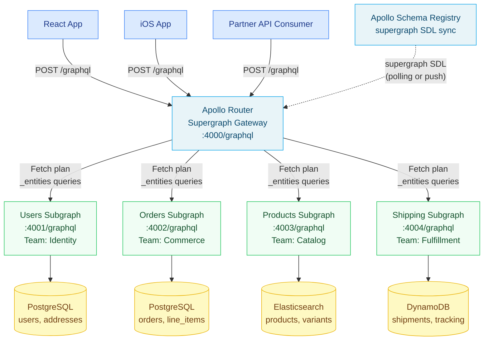

# 01 — Apollo Federation v2 Core Concepts

> **Purpose:** Establish the conceptual foundation for Apollo Federation v2. This document explains why federation exists, defines the vocabulary (subgraph, supergraph, entity, composition), and traces the exact data flow from client query to federated response. Every engineer working on any subgraph must understand these concepts before writing schema or resolver code.

---

## Learning Objectives

- [ ] Explain why a monolith GraphQL schema fails at enterprise scale and how federation addresses each failure mode
- [ ] Define subgraph, supergraph, entity, composition, and query plan with precision
- [ ] Read a federated SDL and identify which type is the entity owner vs. entity reference
- [ ] Explain the `_entities` query and how the router uses it to resolve cross-subgraph references
- [ ] Describe the full request lifecycle from client query to merged response

---

## Overview: Why Federation Exists

### The Monolith Problem

At a startup with three engineers, one shared GraphQL schema is fine. By the time an organization has 30 product teams — each owning a domain like Users, Orders, Products, Recommendations, Shipping, Payments, Reviews, Loyalty, Notifications, and so on — a monolith schema collapses under its own coordination cost.

Consider the failure modes:

**Ownership ambiguity.** Who approves a change to `type User`? The users team? The orders team that added `orders` to User? The loyalty team that added `loyaltyPoints`? With no clear owner, changes either require a committee or get blocked indefinitely.

**Deployment coupling.** Every schema change requires deploying the same monolith server. A breaking change in the Shipping domain that requires a resolver rewrite blocks the Orders team's unrelated field addition from shipping. Releases become coordination nightmares.

**Technology lock-in.** All resolvers must run in the same process. The Products team cannot adopt Rust for its hot-path resolvers while the Users team stays on Node.js. The single server must accommodate every team's runtime requirements.

**Schema sprawl.** After three years, `type User` has 200 fields contributed by 14 teams, with no clear type boundary. Deprecating a field requires tracking down every team's client usage. The schema becomes archaeology.

### The Federation Solution

Apollo Federation v2 decomposes the monolith into independent **subgraphs** — each a standalone GraphQL server owned by one team. Each subgraph exposes only its domain's types and fields. Teams deploy, scale, and evolve their subgraph independently, using whatever technology they choose.

The **Apollo Router** composes all subgraph schemas into a single **supergraph** at startup time. Clients see one GraphQL API. The router's **query planner** handles the complexity of routing each field in a query to the correct subgraph, fetching entities across subgraph boundaries, and merging results into a unified response.

The key insight: **federation moves the complexity from human coordination to automated composition**. Instead of engineers negotiating who owns which field, the composition algorithm enforces consistency rules mechanically. Schema conflicts become build failures, not production bugs.

---

## Architecture



---

## Core Concepts

### 1. Subgraph

A **subgraph** is a standard GraphQL server with two additional characteristics:

1. It uses the Apollo Federation SDL extensions (`@key`, `@external`, `@requires`, etc.)
2. It exposes a `_service` query that returns its SDL, and an `_entities` query for entity resolution

A subgraph is built with a federation-aware server library. In the Node.js ecosystem, `@apollo/subgraph` wraps your schema with the federation additions:

```typescript
import { ApolloServer } from "@apollo/server";
import { buildSubgraphSchema } from "@apollo/subgraph";
import { gql } from "graphql-tag";
import { resolvers } from "./resolvers";

const typeDefs = gql`
  extend schema
    @link(url: "https://specs.apollo.dev/federation/v2.6", import: ["@key", "@shareable"])

  type Query {
    user(id: ID!): User
    me: User
  }

  type User @key(fields: "id") {
    id: ID!
    name: String!
    email: String!
    createdAt: DateTime!
    updatedAt: DateTime!
  }

  scalar DateTime
`;

const server = new ApolloServer({
  schema: buildSubgraphSchema({ typeDefs, resolvers }),
});
```

`buildSubgraphSchema` adds the `_service` and `_entities` queries automatically. You never write resolvers for those — the federation library handles them.

Subgraphs in other languages use equivalent libraries:
- **Java/Kotlin:** `com.apollographql.federation:federation-graphql-java-support`
- **Go:** `github.com/99designs/gqlgen` with the federation plugin
- **Python:** `strawberry-graphql[federation]` or `ariadne` with federation support
- **Rust:** `async-graphql` with federation feature flag
- **Ruby:** `graphql-ruby` with `Apollo::Federation` gem

### 2. Supergraph

The **supergraph** is the composed, unified GraphQL schema that the Apollo Router exposes to clients. It is produced by the composition process from all subgraph SDLs. Clients query the supergraph — they do not interact with individual subgraphs directly.

The supergraph SDL includes:

```graphql
# Excerpt from a composed supergraph SDL
# (This is the router's internal representation — not exposed to clients verbatim)

schema
  @core(feature: "https://specs.apollo.dev/core/v0.2")
  @core(feature: "https://specs.apollo.dev/join/v0.3", for: EXECUTION) {
  query: Query
  mutation: Mutation
}

type User
  @join__type(graph: USERS, key: "id")
  @join__type(graph: ORDERS, key: "id", extension: true)
  @join__type(graph: SHIPPING, key: "id", extension: true) {
  id: ID!
  name: String!                          @join__field(graph: USERS)
  email: String!                         @join__field(graph: USERS)
  createdAt: DateTime!                   @join__field(graph: USERS)
  orders(first: Int, after: String): OrderConnection!  @join__field(graph: ORDERS)
  shippingOptions: [ShippingOption!]!    @join__field(graph: SHIPPING)
}
```

The `@join__` directives are the router's internal annotations. They tell the query planner which subgraph owns each field and how to fetch entities. Engineers never write these directly — they are generated by composition.

### 3. Entities

An **entity** is any type decorated with the `@key` directive. The `@key` directive specifies which field (or combination of fields) uniquely identifies an instance of that type across the entire supergraph.

Entities are the mechanism for cross-subgraph references. If the Orders subgraph wants to include a `User` object on an `Order` type, it does not import or duplicate the User type — it declares a **stub** of the User entity using `@key`, and the router fetches the full User data from the Users subgraph when a client requests User fields.

```graphql
# ── Users Subgraph ──────────────────────────────────────────────
# This subgraph DEFINES the User entity.
# It owns: id, name, email, createdAt, updatedAt, address

type User @key(fields: "id") {
  id: ID!
  name: String!
  email: String!
  createdAt: DateTime!
  updatedAt: DateTime!
  address: Address
}

type Address @shareable {
  street: String!
  city: String!
  state: String!
  country: String!
  postalCode: String!
}

# ── Orders Subgraph ─────────────────────────────────────────────
# This subgraph REFERENCES the User entity.
# It adds domain-specific fields: orders

type User @key(fields: "id") {
  id: ID! @external
  orders(first: Int = 10, after: String): OrderConnection!
}

type Order @key(fields: "id") {
  id: ID!
  status: OrderStatus!
  total: Money!
  placedAt: DateTime!
  customer: User!
  lineItems: [LineItem!]!
}

type OrderConnection {
  edges: [OrderEdge!]!
  pageInfo: PageInfo!
  totalCount: Int!
}

type OrderEdge {
  cursor: String!
  node: Order!
}

enum OrderStatus {
  PENDING
  CONFIRMED
  PROCESSING
  SHIPPED
  DELIVERED
  CANCELLED
  REFUNDED
}
```

The entity stub in Orders (`type User @key(fields: "id") { id: ID! @external ... }`) tells the composition engine: "This subgraph can receive a User entity reference (just the `id` field) and resolve additional fields on it." The `@external` directive on `id` means: "I don't own this field — I'm just declaring it exists so I can reference it."

### 4. Entity Reference Resolvers

In the Orders subgraph, the User type needs a **reference resolver** — a function that, given a partial User object (just the `id`), returns the full User stub needed to attach the `orders` field:

```typescript
// orders-subgraph/src/resolvers/User.ts
export const User = {
  // __resolveReference is called by the federation runtime when the
  // router sends an _entities query with User representations.
  __resolveReference(
    reference: { __typename: "User"; id: string },
    context: Context,
    info: GraphQLResolveInfo
  ) {
    // We just return the reference — the Orders subgraph only
    // needs the id to resolve User.orders.
    // The Users subgraph handles name, email, etc.
    return { id: reference.id };
  },

  async orders(
    parent: { id: string },
    args: { first: number; after?: string },
    context: Context
  ) {
    return context.dataSources.ordersDB.getOrdersByUserId({
      userId: parent.id,
      first: args.first,
      after: args.after,
    });
  },
};
```

### 5. Composition

**Composition** is the process of merging all subgraph SDLs into a single supergraph SDL. The composition algorithm:

1. Collects the SDL from every subgraph (via `_service { sdl }` introspection or a file)
2. Validates that all shared types are consistent (value types must be identical; `@key` fields must be non-nullable; `@external` field types must match their definition)
3. Merges entity types by combining fields from all subgraphs that define that entity
4. Produces a supergraph SDL with `@join__` annotations encoding the routing metadata
5. Fails with descriptive errors if any conflict is detected

Composition happens:
- **Locally** via `rover supergraph compose --config supergraph.yaml`
- **In CI** via `rover subgraph check` against the Apollo Schema Registry
- **On startup** when the router fetches a new supergraph SDL from the registry

Composition errors surface schema conflicts as build errors — before any code is deployed. This is one of federation's most important safety properties.

### 6. The `_entities` Query

The `_entities` query is the internal protocol the router uses to fetch entity data from subgraphs. It is not exposed to clients — the router generates these calls as part of query plan execution.

```graphql
# This query is sent by the router to the Orders subgraph
# during entity resolution. Clients never send this directly.
query FetchEntities($representations: [_Any!]!) {
  _entities(representations: $representations) {
    ... on User {
      orders(first: 10) {
        edges {
          node {
            id
            status
            total {
              amount
              currency
            }
          }
        }
      }
    }
  }
}

# Variables sent with the above query:
{
  "representations": [
    { "__typename": "User", "id": "user-abc-123" },
    { "__typename": "User", "id": "user-def-456" }
  ]
}
```

The `representations` array contains one entry per entity instance the router needs to resolve. Importantly, the router **batches** all User entities from a single query into one `_entities` call — it does not make one call per user. This is the automatic N+1 mitigation that federation provides at the gateway level.

The subgraph's `__resolveReference` resolver is called once per representation. The federation server library handles the batching and dispatching.

---

## Complete Working Example: Users + Orders Subgraphs

### Users Subgraph Schema

```graphql
# users-subgraph/schema.graphql

extend schema
  @link(
    url: "https://specs.apollo.dev/federation/v2.6"
    import: ["@key", "@shareable", "@inaccessible"]
  )

type Query {
  user(id: ID!): User
  me: User
  users(
    first: Int = 20
    after: String
    filter: UserFilterInput
  ): UserConnection!
}

type User @key(fields: "id") {
  id: ID!
  name: String!
  email: String!
  phone: String
  status: UserStatus!
  tier: CustomerTier!
  createdAt: DateTime!
  updatedAt: DateTime!
  address: Address
  # This field is hidden from the public supergraph
  internalFlags: [String!]! @inaccessible
}

type Address @shareable {
  street: String!
  city: String!
  state: String!
  country: String!
  postalCode: String!
}

type UserConnection {
  edges: [UserEdge!]!
  pageInfo: PageInfo!
  totalCount: Int!
}

type UserEdge {
  cursor: String!
  node: User!
}

type PageInfo @shareable {
  hasNextPage: Boolean!
  hasPreviousPage: Boolean!
  startCursor: String
  endCursor: String
}

input UserFilterInput {
  status: UserStatus
  tier: CustomerTier
  createdAfter: DateTime
  createdBefore: DateTime
  searchQuery: String
}

enum UserStatus {
  ACTIVE
  SUSPENDED
  DEACTIVATED
}

enum CustomerTier {
  STANDARD
  SILVER
  GOLD
  PLATINUM
}

scalar DateTime
```

### Users Subgraph Resolvers

```typescript
// users-subgraph/src/resolvers/index.ts
import { Resolvers } from "./__generated__/resolvers";
import { Context } from "./context";

export const resolvers: Resolvers<Context> = {
  Query: {
    user: async (_parent, { id }, { dataSources }) => {
      return dataSources.usersDB.getUserById(id);
    },

    me: async (_parent, _args, { currentUser, dataSources }) => {
      if (!currentUser) return null;
      return dataSources.usersDB.getUserById(currentUser.id);
    },

    users: async (_parent, { first, after, filter }, { dataSources }) => {
      return dataSources.usersDB.listUsers({ first, after, filter });
    },
  },

  User: {
    // __resolveReference is called when another subgraph references
    // a User entity by its @key field(s).
    __resolveReference: async (reference, { dataSources }) => {
      // reference = { __typename: "User", id: "..." }
      return dataSources.usersDB.getUserById(reference.id);
    },

    address: async (user, _args, { dataSources }) => {
      return dataSources.usersDB.getAddressByUserId(user.id);
    },
  },
};
```

### Orders Subgraph Schema

```graphql
# orders-subgraph/schema.graphql

extend schema
  @link(
    url: "https://specs.apollo.dev/federation/v2.6"
    import: ["@key", "@external", "@requires", "@provides"]
  )

type Query {
  order(id: ID!): Order
  orders(
    first: Int = 20
    after: String
    filter: OrderFilterInput
  ): OrderConnection!
}

# Entity reference — Orders subgraph extends User with orders field
type User @key(fields: "id") {
  id: ID! @external
  orders(
    first: Int = 10
    after: String
    status: [OrderStatus!]
  ): OrderConnection!
  orderCount: Int!
  totalSpent: Money!
}

type Order @key(fields: "id") {
  id: ID!
  status: OrderStatus!
  total: Money!
  subtotal: Money!
  taxAmount: Money!
  shippingAmount: Money!
  placedAt: DateTime!
  updatedAt: DateTime!
  customer: User!
  lineItems: [LineItem!]!
  couponCode: String
  notes: String
}

type LineItem {
  id: ID!
  quantity: Int!
  unitPrice: Money!
  subtotal: Money!
  # Product is an entity owned by the Products subgraph
  product: Product!
}

# Entity stub for Product (owned by Products subgraph)
type Product @key(fields: "id") {
  id: ID! @external
}

type Money @shareable {
  amount: Float!
  currency: String!
}

type OrderConnection {
  edges: [OrderEdge!]!
  pageInfo: PageInfo!
  totalCount: Int!
}

type OrderEdge {
  cursor: String!
  node: Order!
}

type PageInfo @shareable {
  hasNextPage: Boolean!
  hasPreviousPage: Boolean!
  startCursor: String
  endCursor: String
}

input OrderFilterInput {
  status: [OrderStatus!]
  placedAfter: DateTime
  placedBefore: DateTime
  minimumTotal: Float
}

enum OrderStatus {
  PENDING
  CONFIRMED
  PROCESSING
  SHIPPED
  DELIVERED
  CANCELLED
  REFUNDED
}

scalar DateTime
```

---

## The Full Request Lifecycle

Here is the complete path of a client query through the federated system:

```
Client Query:
{
  me {
    name
    email
    orders(first: 5) {
      edges {
        node {
          id
          status
          total { amount currency }
        }
      }
    }
  }
}
```

**Step 1 — Router receives the query.**
The Apollo Router parses the query and validates it against the supergraph schema (not individual subgraph schemas).

**Step 2 — Query planning.**
The query planner analyzes the supergraph SDL's `@join__` annotations to determine:
- `me { name email }` → fetch from Users subgraph
- `me.orders(first: 5)` → fetch from Orders subgraph using the User `id` from step 1

The plan is a Sequence node (must fetch User first to get id, then fetch orders).

**Step 3 — First subgraph fetch.**
Router sends to Users subgraph:
```graphql
{ me { __typename id name email } }
```
Response: `{ "me": { "__typename": "User", "id": "user-abc", "name": "Alice", "email": "alice@example.com" } }`

**Step 4 — Entity fetch.**
Router sends to Orders subgraph using the `_entities` protocol:
```graphql
query($representations: [_Any!]!) {
  _entities(representations: $representations) {
    ... on User {
      orders(first: 5) {
        edges { node { id status total { amount currency } } }
      }
    }
  }
}
```
Variables: `{ "representations": [{ "__typename": "User", "id": "user-abc" }] }`

**Step 5 — Merge and respond.**
The router merges both responses into the unified structure the client expects:
```json
{
  "data": {
    "me": {
      "name": "Alice",
      "email": "alice@example.com",
      "orders": {
        "edges": [
          { "node": { "id": "order-1", "status": "DELIVERED", "total": { "amount": 49.99, "currency": "USD" } } }
        ]
      }
    }
  }
}
```

---

## Production Considerations

### Performance

**Entity batching.** The router automatically batches all entity references of the same type from a single query into one `_entities` call. A query that returns 20 orders, each with a `customer: User` field, generates one `_entities` call with 20 User representations — not 20 separate calls. Ensure your `__resolveReference` implementation uses DataLoader-style batching internally for the database queries.

**Query plan caching.** The router caches query plans by operation (query AST + variables shape). Recurring queries like `me { name orders { ... } }` only incur planning cost once. Use persistent query IDs in production to guarantee cache hits and reduce parsing overhead.

**Subgraph connection pooling.** The router maintains HTTP connection pools to each subgraph. Configure `keep-alive` on subgraph HTTP servers and tune the router's pool settings in `router.yaml`:

```yaml
traffic_shaping:
  router:
    timeout: 30s
  all:
    deduplicate_variables: true
    timeout: 10s
```

### Security

**Subgraph network isolation.** Subgraphs should not be publicly accessible — only the router should be able to reach them. Deploy subgraphs in a private subnet or service mesh with mTLS. The router authenticates to subgraphs using subgraph authentication headers:

```yaml
# router.yaml
authentication:
  subgraph:
    all:
      request:
        header_name: "X-Subgraph-Auth"
        header_value_prefix: "Bearer "
```

**Disable subgraph introspection in production.** Subgraph schemas are internal implementation details. Disable GraphQL introspection on subgraph servers in production environments to avoid leaking schema information to unauthorized clients.

### Observability

Tag all subgraph spans with `subgraph.name` and `subgraph.operation.type` to enable per-subgraph latency breakdowns. The Apollo Router emits OpenTelemetry traces by default when configured:

```yaml
# router.yaml
telemetry:
  exporters:
    tracing:
      otlp:
        enabled: true
        endpoint: "http://otel-collector:4317"
  instrumentation:
    spans:
      router:
        attributes:
          subgraph.name: true
          graphql.operation.name: true
```

---

## Best Practices

1. **One team, one subgraph.** Assign clear ownership. The team that owns the domain owns the subgraph. Cross-subgraph field additions require negotiation with the owning team, surfacing coordination costs explicitly.

2. **Keep entities narrow.** An entity's `@key` type should contain only the fields that uniquely identify it. Business data lives in the owning subgraph. Other subgraphs reference the entity by key and extend with their own domain fields.

3. **Design `@key` fields carefully.** Once a `@key` field is established, other subgraphs depend on it. Changing a `@key` field (e.g., from `id: ID!` to `id: UUID!`) is a breaking change that affects every subgraph referencing the entity.

4. **Use stable, collision-resistant entity IDs.** UUIDs or globally scoped IDs (e.g., `gid://shopify/Order/12345`) are preferable to auto-increment integers, which may collide across database shards.

5. **Implement DataLoader in every `__resolveReference`.** Even though the router batches `_entities` calls by type, the subgraph resolver still receives an array of representations. Use DataLoader to batch the underlying database queries and avoid N+1 inside the subgraph.

6. **Validate federation spec version pinning.** Pin the federation spec version in your `@link` directive (`@link(url: "https://specs.apollo.dev/federation/v2.6", ...)`). Unpinned specs may pull in breaking directive behavior changes during composition.

7. **Write composition tests in CI.** Run `rover supergraph compose` on every subgraph pull request. A subgraph change that breaks composition should fail the PR check before any code is reviewed.

---

## Anti-Patterns

**Circular entity dependencies.** If Subgraph A requires a field from an entity in Subgraph B, and Subgraph B requires a field from an entity in Subgraph A, the query planner creates a deadlock. Design entity references to flow in one direction.

**Fat entity stubs.** Declaring a large number of `@external` fields on an entity stub is a sign that the subgraph boundary is wrong. A subgraph should reference only the `@key` field(s) it needs, plus any fields explicitly required via `@requires`.

**Duplicating resolver logic across subgraphs.** If two subgraphs both implement the same business logic to resolve a field, they will diverge over time. Extract shared logic into a service library or move the field to the authoritative subgraph.

**Returning `null` from `__resolveReference` silently.** If `__resolveReference` returns `null`, all fields of that entity instance in the response will be null. This is a silent failure that is difficult to debug. Log warnings and return descriptive errors when entity resolution fails.

---

## Operational Notes

- The `_service { sdl }` endpoint on each subgraph is the source of truth for composition. If a subgraph deployment changes its schema without a corresponding composition run, the router's query plan may become stale.
- In managed federation mode (Apollo Studio), the router polls the registry for supergraph SDL updates. The polling interval is configurable (`uplink.poll_interval_s` in `router.yaml`, default 10 seconds).
- For blue/green subgraph deployments, the new subgraph version should be backward-compatible with the current supergraph SDL. Composition validates the schema, but the router cannot dynamically re-plan mid-request.
- Monitor `apollo_router_graphql_error_total` (labeled by `subgraph`) to detect per-subgraph error spikes without waiting for end-to-end latency alerts.

---

## References

- [Apollo Federation v2 Introduction](https://www.apollographql.com/docs/federation/) — official Apollo documentation
- [Federation Specification (GitHub)](https://github.com/apollographql/federation/tree/main/specs) — the normative Federation 2.x SDL specification
- [Principled GraphQL — Federation Principles](https://principledgraphql.com/integrity#1-one-graph) — the design principles underlying federation

---

## Related Topics

- [02 — Federation Directives](./02-federation-directives.md) — deep-dive on every federation SDL directive
- [03 — Composition](./03-composition.md) — how subgraph SDLs are merged and validated
- [04 — Query Planning](./04-query-planning.md) — how the router builds and executes query plans
- [Chapter 09: Schema Governance](../09-schema-governance/README.md) — cross-team schema change coordination
