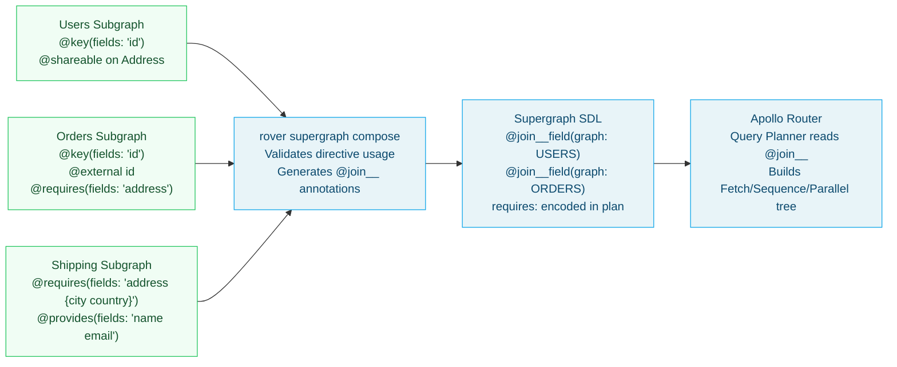

# 02 — Apollo Federation v2 Directives

> **Purpose:** Provide a complete reference for every Apollo Federation v2 SDL directive. Each directive entry explains the problem it solves, when to use it, a production-realistic SDL example, the TypeScript resolver implications, and the most common mistakes engineers make with it. This document is the go-to reference when writing subgraph schemas.

---

## Learning Objectives

- [ ] Correctly apply `@key` for single-field, multi-field, and composite entity keys
- [ ] Use `@external` and `@requires` together to declare cross-subgraph field dependencies
- [ ] Apply `@provides` to hint the query planner and eliminate unnecessary subgraph fetches
- [ ] Use `@override` with `label` for progressive field migration between subgraphs
- [ ] Distinguish between `@shareable`, `@inaccessible`, and `@tag` and know when each is appropriate
- [ ] Apply `@composeDirective` to propagate custom directives through composition into the supergraph

---

## Overview

Apollo Federation v2 introduces a set of schema directives that encode the rules of federated schema composition and query planning. These directives live in your subgraph SDL and control:

- **Entity identity** — which fields uniquely identify a type across subgraphs (`@key`)
- **Cross-subgraph field dependencies** — when a resolver needs data from another subgraph's entity (`@external`, `@requires`, `@provides`)
- **Field migration** — safely moving field ownership from one subgraph to another (`@override`)
- **Type sharing** — allowing multiple subgraphs to resolve the same non-entity type or field (`@shareable`)
- **Schema filtering** — hiding fields from the supergraph or tagging fields for contract graphs (`@inaccessible`, `@tag`)
- **Custom directives** — propagating application-layer directives through composition (`@composeDirective`)

All federation directives must be imported via the `@link` directive at the top of your subgraph schema. Omitting the import causes a composition error.

```graphql
extend schema
  @link(
    url: "https://specs.apollo.dev/federation/v2.6"
    import: [
      "@key"
      "@external"
      "@requires"
      "@provides"
      "@override"
      "@shareable"
      "@inaccessible"
      "@tag"
      "@composeDirective"
    ]
  )
```

---

## Architecture: Directive Flow Through Composition



---

## Directive Reference

### `@key`

**Problem it solves:** Declares that a type is an entity — a type that can be uniquely identified by a specific field or set of fields, enabling cross-subgraph references.

**When to use it:** On any type that needs to be referenced by more than one subgraph. If the Products subgraph defines `Product`, and the Orders subgraph needs to reference a product on each line item, `Product` needs `@key`.

**Signature:**
```graphql
directive @key(fields: FieldSet!, resolvable: Boolean = true) repeatable on OBJECT | INTERFACE
```

#### Single-field key (most common)

```graphql
# products-subgraph/schema.graphql
type Product @key(fields: "id") {
  id: ID!
  title: String!
  description: String
  price: Money!
  sku: String!
  status: ProductStatus!
  category: Category!
  images: [ProductImage!]!
  inventory: InventoryStatus!
}
```

#### Multi-field key (composite)

Use when no single field uniquely identifies an entity — the combination of fields does.

```graphql
# pricing-subgraph/schema.graphql
# A price rule is unique per product + customer tier combination
type PriceRule @key(fields: "productId customerTier") {
  productId: ID!
  customerTier: CustomerTier!
  discountPercent: Float!
  validFrom: DateTime!
  validUntil: DateTime!
}
```

The reference resolver receives both fields in the representation:
```typescript
PriceRule: {
  __resolveReference: async (ref: { productId: string; customerTier: string }, { dataSources }) => {
    return dataSources.pricingDB.getPriceRule(ref.productId, ref.customerTier);
  },
}
```

#### Multiple `@key` declarations (alternate keys)

A type can have multiple `@key` directives — each defines an alternate way to look up the entity. This is useful when different subgraphs hold different identifiers for the same entity.

```graphql
# orders-subgraph/schema.graphql
# An order can be looked up by its internal ID or by external reference number
type Order @key(fields: "id") @key(fields: "externalRef vendor") {
  id: ID!
  externalRef: String!
  vendor: String!
  status: OrderStatus!
  total: Money!
}
```

The reference resolver must handle both key shapes:
```typescript
Order: {
  __resolveReference: async (ref, { dataSources }) => {
    if ("id" in ref) {
      return dataSources.ordersDB.getOrderById(ref.id);
    }
    // externalRef + vendor key
    return dataSources.ordersDB.getOrderByExternalRef(ref.externalRef, ref.vendor);
  },
}
```

#### Non-resolvable key

Use `resolvable: false` when a subgraph defines an entity that it does not resolve directly — it just uses the type to provide fields on it.

```graphql
# analytics-subgraph/schema.graphql
# Analytics subgraph references Product but does not resolve it
type Product @key(fields: "id", resolvable: false) {
  id: ID! @external
  viewCount: Int!
  conversionRate: Float!
}
```

**Common mistakes:**
- Using a nullable field as a `@key` field. Composition fails: key fields must be non-nullable.
- Using a field with arguments as a `@key` field. Key fields must be argument-free.
- Changing a `@key` field type (e.g., from `ID!` to `String!`) without coordinating with every subgraph that references the entity. This is a breaking composition change.
- Forgetting the reference resolver in the subgraph that defines the entity. Without `__resolveReference`, entity fetch calls will return null for all fields.

---

### `@external`

**Problem it solves:** Marks a field as defined in another subgraph. Used in entity stubs to declare that the subgraph knows a field exists (because it came from the owning subgraph) but does not own or resolve it.

**When to use it:** On fields declared in an entity stub that are owned by another subgraph. Most commonly on `@key` fields in a referencing subgraph, and on any fields used in `@requires`.

**Signature:**
```graphql
directive @external on OBJECT | FIELD_DEFINITION
```

```graphql
# shipping-subgraph/schema.graphql
type User @key(fields: "id") {
  id: ID! @external          # owned by Users subgraph
  address: Address @external # owned by Users subgraph — needed for @requires below
  shippingOptions: [ShippingOption!]! @requires(fields: "address { city country postalCode }")
}
```

**Resolver implications:** You do not write a resolver for `@external` fields. The federation runtime provides their values from the owning subgraph's fetch result before calling your `@requires`-decorated resolver.

**Common mistakes:**
- Adding `@external` to a field and then writing a resolver for it. The resolver will never be called — the federation runtime ignores resolvers on `@external` fields.
- Mismatching the type of an `@external` field with its definition in the owning subgraph. If Users subgraph defines `address: Address` and Shipping subgraph declares `address: ShippingAddress @external`, composition fails.
- Using `@external` on a field that is not used by any `@requires` or `@provides`. This is harmless but is dead code that clutters the schema.

---

### `@requires`

**Problem it solves:** Declares that a resolver needs fields from another subgraph's entity before it can execute. The query planner inserts a sequential fetch to retrieve those fields before calling the resolver.

**When to use it:** When your resolver's logic depends on data that lives in another subgraph. Classic example: the Shipping subgraph needs the User's address (owned by Users subgraph) to compute available shipping options.

**Signature:**
```graphql
directive @requires(fields: FieldSet!) on FIELD_DEFINITION
```

```graphql
# shipping-subgraph/schema.graphql
extend schema
  @link(
    url: "https://specs.apollo.dev/federation/v2.6"
    import: ["@key", "@external", "@requires"]
  )

type User @key(fields: "id") {
  id: ID! @external
  address: Address @external
  shippingOptions: [ShippingOption!]!
    @requires(fields: "address { street city state country postalCode }")
}

type Address @shareable {
  street: String!
  city: String!
  state: String!
  country: String!
  postalCode: String!
}

type ShippingOption {
  carrier: String!
  service: String!
  estimatedDays: Int!
  price: Money!
  trackingAvailable: Boolean!
}
```

The resolver for `shippingOptions` receives the parent User object with the `address` field already populated:

```typescript
// shipping-subgraph/src/resolvers/User.ts
export const User = {
  __resolveReference: async (ref: { id: string }) => {
    // Return minimal object — shippingOptions resolver will be called
    // after the router fetches address from Users subgraph
    return { id: ref.id };
  },

  shippingOptions: async (
    parent: { id: string; address: { city: string; country: string; postalCode: string } },
    _args: unknown,
    { dataSources }: Context
  ) => {
    // parent.address is already populated by @requires fetch
    return dataSources.shippingAPI.getOptions({
      city: parent.address.city,
      country: parent.address.country,
      postalCode: parent.address.postalCode,
    });
  },
};
```

#### Nested `@requires` fields

You can require nested fields using selection set syntax:

```graphql
type User @key(fields: "id") {
  id: ID! @external
  address: Address @external
  loyaltyTier: CustomerTier @external
  # Needs both address and loyaltyTier to compute personalized options
  personalizedShipping: [ShippingOption!]!
    @requires(fields: "address { country } loyaltyTier")
}
```

**Performance implication:** `@requires` creates a Sequence node in the query plan — the router must first fetch the required fields from the owning subgraph, then call the resolver. This adds one round-trip latency per `@requires`. See [04 — Query Planning](./04-query-planning.md) for optimization strategies.

**Common mistakes:**
- Using `@requires` without declaring the required fields as `@external`. Composition fails if you require a field you haven't declared as external.
- Creating `@requires` chains: A requires B from Subgraph 2, B requires C from Subgraph 3. Each hop adds a sequential round-trip. Redesign the schema to minimize `@requires` chains — two hops is a warning sign, three hops should trigger a schema review.
- Using `@requires` when `@provides` would eliminate the need. If the subgraph that owns the data can provide it alongside related data, `@provides` avoids the extra fetch. See the `@provides` section below.

---

### `@provides`

**Problem it solves:** Hints to the query planner that a subgraph can return fields from another entity inline, without requiring a separate `_entities` fetch to the owning subgraph.

**When to use it:** When you know a resolver will return related entity data as part of the same database query. For example, if the Orders subgraph fetches `Order` rows with a JOIN to the `users` table and gets `user.name` and `user.email` in the same query, declare this with `@provides`.

**Signature:**
```graphql
directive @provides(fields: FieldSet!) on FIELD_DEFINITION
```

```graphql
# orders-subgraph/schema.graphql
type Order @key(fields: "id") {
  id: ID!
  status: OrderStatus!
  total: Money!
  # The orders resolver JOINs users table — name and email come for free
  customer: User! @provides(fields: "name email")
}

type User @key(fields: "id") {
  id: ID! @external
  name: String! @external   # declared external so @provides can reference it
  email: String! @external  # declared external so @provides can reference it
  # No @requires here — orders subgraph can provide name/email directly
}
```

The `Order` resolver must actually return the `name` and `email` fields for the `@provides` hint to be effective:

```typescript
// orders-subgraph/src/resolvers/Query.ts
export const Query = {
  order: async (_parent: unknown, { id }: { id: string }, { db }: Context) => {
    // JOIN with users table to fetch name and email in one query
    const row = await db.query(`
      SELECT
        o.id, o.status, o.total_amount, o.currency,
        u.id as customer_id, u.name as customer_name, u.email as customer_email
      FROM orders o
      JOIN users u ON u.id = o.customer_id
      WHERE o.id = $1
    `, [id]);

    return {
      id: row.id,
      status: row.status,
      total: { amount: row.total_amount, currency: row.currency },
      // customer object includes the @provides fields
      customer: {
        __typename: "User",
        id: row.customer_id,
        name: row.customer_name,   // @provides hint is honoured
        email: row.customer_email,  // @provides hint is honoured
      },
    };
  },
};
```

**Effect on query planning:** Without `@provides`, a query for `order { customer { name email } }` requires two subgraph fetches:
1. Fetch `Order` from Orders subgraph (returns `customer { __typename id }`)
2. Fetch `User` entity from Users subgraph (returns `name email`)

With `@provides(fields: "name email")`, the query planner knows Orders subgraph can return `name` and `email` with the Order. The Users subgraph fetch is eliminated. Total latency: one subgraph round-trip instead of two.

**Common mistakes:**
- Declaring `@provides` but not actually returning the provided fields from the resolver. The query planner assumes the fields are present — if they're null, the client gets null without an error.
- Using `@provides` for large, expensive-to-compute fields that aren't needed in every query. `@provides` is always fetched when the parent type is fetched, even if the client doesn't request those fields.
- Forgetting to declare provided fields as `@external` on the entity stub in the providing subgraph. Composition will fail if the referenced fields aren't declared.

---

### `@override`

**Problem it solves:** Enables safe, progressive migration of a field's ownership from one subgraph to another without a big-bang cutover. During migration, both subgraphs can serve the field — the router uses a percentage-based rollout to gradually shift traffic.

**When to use it:** When migrating a field from Subgraph A to Subgraph B. Add `@override(from: "SubgraphA")` in Subgraph B, deploy, validate, then remove the field from Subgraph A.

**Signature:**
```graphql
directive @override(from: String!, label: String) on FIELD_DEFINITION
```

#### Basic override (immediate cutover)

```graphql
# products-subgraph/schema.graphql
# The 'inventory' field is being migrated FROM InventorySubgraph TO ProductSubgraph
type Product @key(fields: "id") {
  id: ID!
  title: String!
  price: Money!
  # After adding this, InventorySubgraph's inventory field is ignored
  inventory: InventoryStatus! @override(from: "InventorySubgraph")
}
```

#### Progressive override with percentage rollout

The `label` parameter (federation v2.7+) enables percentage-based traffic splitting:

```graphql
# products-subgraph/schema.graphql
type Product @key(fields: "id") {
  id: ID!
  title: String!
  # 10% of requests use ProductSubgraph's resolver; 90% still use InventorySubgraph
  inventory: InventoryStatus! @override(from: "InventorySubgraph", label: "percent(10)")
}
```

Increment the percentage over multiple deployments (10% → 25% → 50% → 100%) while monitoring error rates and latency differences between the two resolvers.

#### Migration checklist

```
1. Add @override(from: "OldSubgraph", label: "percent(10)") in new subgraph
2. Deploy new subgraph + trigger composition
3. Monitor: error rates, P95 latency, data consistency
4. Increment to percent(25), percent(50), percent(75)
5. Remove label → @override(from: "OldSubgraph") → full cutover
6. Remove the field from OldSubgraph's schema
7. Remove @override from new subgraph (now it's just a regular field)
8. Trigger final composition
```

**Common mistakes:**
- Removing the field from the old subgraph before fully removing `@override` from the new one. Composition fails if `@override(from: "X")` references a subgraph that no longer has the field.
- Using `@override` without testing the new resolver produces identical results to the old one. A progressive rollout only helps if you're monitoring data consistency between the two resolvers.
- Forgetting to coordinate the `@override` deployment with the old subgraph team. The old subgraph's field is silently bypassed once `@override` is active — if the new resolver has a bug, clients get bad data.

---

### `@shareable`

**Problem it solves:** By default, non-entity types and their fields can only be defined in one subgraph. `@shareable` relaxes this constraint, allowing multiple subgraphs to define and resolve the same type or field.

**When to use it:** On value types like `Money`, `PageInfo`, `Address`, `Coordinates` that legitimately appear in multiple subgraphs and should be resolved independently by each. Also used when splitting a type across subgraphs as part of a migration.

**Signature:**
```graphql
directive @shareable repeatable on OBJECT | FIELD_DEFINITION
```

```graphql
# shared value types — must be declared identical across all subgraphs that use them

# users-subgraph/schema.graphql
type Money @shareable {
  amount: Float!
  currency: String!
}

type PageInfo @shareable {
  hasNextPage: Boolean!
  hasPreviousPage: Boolean!
  startCursor: String
  endCursor: String
}

# orders-subgraph/schema.graphql
# Same types, marked @shareable — composition accepts both definitions
type Money @shareable {
  amount: Float!
  currency: String!
}

type PageInfo @shareable {
  hasNextPage: Boolean!
  hasPreviousPage: Boolean!
  startCursor: String
  endCursor: String
}
```

You can also apply `@shareable` to individual fields on an object type:

```graphql
# users-subgraph/schema.graphql
type Product @key(fields: "id") {
  id: ID!
  # Both Users and Products subgraphs can resolve this field
  displayName: String! @shareable
}
```

**Important:** `@shareable` types must be structurally identical across all subgraphs. If Users subgraph defines `Money { amount: Float! currency: String! }` and Orders subgraph defines `Money { amount: Decimal! currency: String! }`, composition fails with a type conflict.

**Common mistakes:**
- Using `@shareable` to avoid proper entity design. If multiple subgraphs need to add fields to the same type, that type should probably be an entity with `@key`, not a `@shareable` type.
- Forgetting `@shareable` on one subgraph's copy of a shared value type. Composition fails with "type is defined in multiple subgraphs and must be marked @shareable."
- Assuming `@shareable` means "any subgraph can add fields to this type." It means "any subgraph that declares this type can resolve it" — all declarations must be structurally identical.

---

### `@inaccessible`

**Problem it solves:** Hides a field (or type) from the public supergraph schema while still allowing it to be used internally for query planning. Used during migrations to temporarily hide fields and to permanently hide internal implementation details.

**When to use it:**
- During migration: hide a field that's being replaced before removing it
- For internal fields: database IDs, internal flags, or fields used only by `@requires` and `@provides`
- During phased rollouts: add a field as `@inaccessible` until it's ready for clients

**Signature:**
```graphql
directive @inaccessible on FIELD_DEFINITION | OBJECT | INTERFACE | UNION | ARGUMENT_DEFINITION | SCALAR | ENUM | ENUM_VALUE | INPUT_OBJECT | INPUT_FIELD_DEFINITION
```

```graphql
# users-subgraph/schema.graphql
type User @key(fields: "id") {
  id: ID!
  name: String!
  email: String!
  # Internal field — not visible in the supergraph schema
  # but can be used in @requires by other subgraphs
  internalAccountId: String! @inaccessible
  # Feature-flagged field hidden from clients until launch
  betaFeatureFlags: [String!]! @inaccessible
}
```

**Common mistakes:**
- Confusing `@inaccessible` with `@deprecated`. `@inaccessible` hides the field from the supergraph schema entirely — clients cannot query it. `@deprecated` keeps the field visible but signals it should not be used.
- Marking a `@key` field as `@inaccessible`. This creates a composition error — `@key` fields must be accessible so the router can fetch entity representations.
- Forgetting that `@inaccessible` fields are still validated during composition. Type mismatches on inaccessible fields still fail composition.

---

### `@tag`

**Problem it solves:** Attaches metadata strings to schema elements (types, fields, arguments). Tags are used by Apollo Studio to create **contract graphs** — filtered views of the supergraph that expose only tagged elements to specific consumers (e.g., a partner API that only sees `@tag(name: "public")` fields).

**When to use it:** When building contract graphs for different consumer audiences (internal, external, partner-specific). Also useful for schema documentation and governance tooling.

**Signature:**
```graphql
directive @tag(name: String!) repeatable on FIELD_DEFINITION | OBJECT | INTERFACE | UNION | ARGUMENT_DEFINITION | SCALAR | ENUM | ENUM_VALUE | INPUT_OBJECT | INPUT_FIELD_DEFINITION
```

```graphql
# users-subgraph/schema.graphql
type User @key(fields: "id") @tag(name: "public") {
  id: ID! @tag(name: "public")
  name: String! @tag(name: "public")
  email: String! @tag(name: "public") @tag(name: "pii")
  phone: String @tag(name: "internal") @tag(name: "pii")
  internalAccountId: String! @tag(name: "internal") @inaccessible
  loyaltyPoints: Int! @tag(name: "public") @tag(name: "loyalty-contract")
  adminNotes: String @tag(name: "internal")
}
```

In Apollo Studio, create a contract with `@tag(name: "public")` to expose a public API that includes only `id`, `name`, `email`, and `loyaltyPoints` — hiding `phone`, `internalAccountId`, and `adminNotes`.

**Common mistakes:**
- Tagging a type but not its fields. Contract graph filtering is field-level — tagging only `type User` doesn't automatically include User's fields.
- Using tags without creating corresponding contracts in Apollo Studio. Tags in the SDL alone have no effect — they are metadata annotations that require Studio contract configuration to take effect.
- Assuming tags are enforced at runtime. Tags control schema composition and contract generation, not request authorization. Use authorization middleware to enforce field-level access control at runtime.

---

### `@composeDirective`

**Problem it solves:** Allows a subgraph to propagate custom directives through composition so they appear on fields in the supergraph SDL. Without this, custom directives defined in a subgraph are stripped during composition and are invisible to the router.

**When to use it:** When you have custom directives that the router needs to see — for example, `@rateLimit`, `@deprecated` with custom args, `@auth`, or `@cacheControl` directives that you want the router to act on.

**Signature:**
```graphql
directive @composeDirective(name: String!) repeatable on SCHEMA
```

```graphql
# users-subgraph/schema.graphql
extend schema
  @link(url: "https://specs.apollo.dev/federation/v2.6", import: ["@key", "@composeDirective"])
  @link(url: "https://myorg.com/specs/cache/v1.0", import: ["@cacheControl"])
  @composeDirective(name: "@cacheControl")

directive @cacheControl(maxAge: Int, scope: CacheControlScope) on FIELD_DEFINITION | OBJECT

enum CacheControlScope {
  PUBLIC
  PRIVATE
}

type User @key(fields: "id") {
  id: ID!
  name: String! @cacheControl(maxAge: 300, scope: PUBLIC)
  email: String! @cacheControl(maxAge: 0, scope: PRIVATE)
  loyaltyPoints: Int! @cacheControl(maxAge: 60, scope: PRIVATE)
}
```

**Common mistakes:**
- Using `@composeDirective` without a corresponding `@link` for the directive's spec URL. Composition validates that all composed directives have a proper spec URL.
- Expecting `@composeDirective` to make the router enforce the directive automatically. The router must have a plugin or native handler for the directive. Composition just ensures the directive is visible in the supergraph SDL.

---

## Complete SDL Example: E-Commerce Supergraph

The following shows all federation directives working together across four subgraphs in a realistic e-commerce domain.

### Users Subgraph

```graphql
extend schema
  @link(
    url: "https://specs.apollo.dev/federation/v2.6"
    import: ["@key", "@shareable", "@inaccessible", "@tag"]
  )

type Query {
  user(id: ID!): User @tag(name: "internal")
  me: User @tag(name: "public")
}

type User @key(fields: "id") @tag(name: "public") {
  id: ID! @tag(name: "public")
  name: String! @tag(name: "public")
  email: String! @tag(name: "public") @tag(name: "pii")
  phone: String @tag(name: "internal") @tag(name: "pii")
  status: UserStatus! @tag(name: "internal")
  tier: CustomerTier! @tag(name: "public")
  createdAt: DateTime! @tag(name: "internal")
  address: Address @tag(name: "public")
  internalFlags: [String!]! @inaccessible
}

type Address @shareable @tag(name: "public") {
  street: String!
  city: String!
  state: String!
  country: String!
  postalCode: String!
}

enum UserStatus { ACTIVE SUSPENDED DEACTIVATED }
enum CustomerTier { STANDARD SILVER GOLD PLATINUM }
scalar DateTime
```

### Orders Subgraph

```graphql
extend schema
  @link(
    url: "https://specs.apollo.dev/federation/v2.6"
    import: ["@key", "@external", "@provides", "@shareable", "@tag"]
  )

type Query {
  order(id: ID!): Order @tag(name: "public")
}

type User @key(fields: "id") {
  id: ID! @external
  orders(first: Int = 10, after: String, status: [OrderStatus!]): OrderConnection! @tag(name: "public")
  orderCount: Int! @tag(name: "public")
  totalSpent: Money! @tag(name: "public")
}

type Order @key(fields: "id") @tag(name: "public") {
  id: ID!
  status: OrderStatus!
  total: Money!
  placedAt: DateTime!
  customer: User! @provides(fields: "name email")
  lineItems: [LineItem!]!
}

type LineItem {
  id: ID!
  quantity: Int!
  unitPrice: Money!
  product: Product!
}

type Product @key(fields: "id") {
  id: ID! @external
}

type Money @shareable {
  amount: Float!
  currency: String!
}

type OrderConnection {
  edges: [OrderEdge!]!
  pageInfo: PageInfo!
  totalCount: Int!
}

type OrderEdge { cursor: String! node: Order! }

type PageInfo @shareable {
  hasNextPage: Boolean!
  hasPreviousPage: Boolean!
  startCursor: String
  endCursor: String
}

enum OrderStatus { PENDING CONFIRMED PROCESSING SHIPPED DELIVERED CANCELLED REFUNDED }
scalar DateTime
```

### Shipping Subgraph (demonstrates @requires)

```graphql
extend schema
  @link(
    url: "https://specs.apollo.dev/federation/v2.6"
    import: ["@key", "@external", "@requires", "@shareable"]
  )

type User @key(fields: "id") {
  id: ID! @external
  address: Address @external
  shippingOptions: [ShippingOption!]!
    @requires(fields: "address { city state country postalCode }")
  estimatedDelivery(
    shippingOptionId: ID!
    targetDate: DateTime
  ): DeliveryEstimate
    @requires(fields: "address { city state country postalCode }")
}

type Address @shareable {
  street: String!
  city: String!
  state: String!
  country: String!
  postalCode: String!
}

type ShippingOption {
  id: ID!
  carrier: String!
  service: String!
  estimatedDays: Int!
  price: Money!
  trackingAvailable: Boolean!
}

type DeliveryEstimate {
  earliestDate: DateTime!
  latestDate: DateTime!
  confidence: Float!
}

type Money @shareable {
  amount: Float!
  currency: String!
}

scalar DateTime
```

### Products Subgraph (demonstrates @override)

```graphql
extend schema
  @link(
    url: "https://specs.apollo.dev/federation/v2.6"
    import: ["@key", "@override", "@shareable", "@tag"]
  )

type Query {
  product(id: ID!): Product @tag(name: "public")
  products(
    first: Int = 20
    after: String
    category: String
    searchQuery: String
  ): ProductConnection! @tag(name: "public")
}

type Product @key(fields: "id") @tag(name: "public") {
  id: ID!
  title: String!
  description: String
  price: Money!
  sku: String!
  status: ProductStatus!
  category: Category!
  images: [ProductImage!]!
  # Migrating 'inventoryCount' from InventorySubgraph with 25% progressive rollout
  inventoryCount: Int! @override(from: "InventorySubgraph", label: "percent(25)")
}

type Category @key(fields: "id") {
  id: ID!
  name: String!
  slug: String!
}

type ProductImage {
  url: String!
  altText: String
  width: Int!
  height: Int!
}

type Money @shareable {
  amount: Float!
  currency: String!
}

type ProductConnection {
  edges: [ProductEdge!]!
  pageInfo: PageInfo!
  totalCount: Int!
}

type ProductEdge { cursor: String! node: Product! }

type PageInfo @shareable {
  hasNextPage: Boolean!
  hasPreviousPage: Boolean!
  startCursor: String
  endCursor: String
}

enum ProductStatus { ACTIVE DRAFT ARCHIVED OUT_OF_STOCK }
```

---

## Best Practices

1. **Import only the directives you use.** The `@link` import list is explicit documentation of which federation features your subgraph uses. Importing everything creates noise and may cause confusion during code review.

2. **Keep `@key` fields stable and non-nullable.** `@key` fields are the contract between subgraphs. Changing their type or adding nullability is a breaking change that requires coordinating updates across every subgraph that references the entity.

3. **Minimize `@requires` usage.** Every `@requires` adds a round-trip to the query plan. Before adding `@requires`, ask: can the data be passed as a query argument instead? Can `@provides` in the owning subgraph eliminate the need?

4. **Pair `@external` declarations with exact type matching.** If the owning subgraph defines `address: Address`, the referencing subgraph must declare `address: Address @external` — not `address: ShippingAddress @external`. Type names must match exactly.

5. **Use `@override` with progressive rollout for all field migrations.** Never do a big-bang field migration. Use `percent(10)` → `percent(25)` → `percent(50)` → `percent(100)` with monitoring between each increment.

6. **Apply `@tag` consistently across a type and its fields.** If a type is tagged `@tag(name: "public")`, ensure every field intended for public access is also tagged. Contract graphs filter at the field level.

7. **Document `@inaccessible` fields with comments.** Hidden fields are easy to forget. Add a comment explaining why the field is inaccessible and what the plan is for it (remove after migration, permanent internal detail, etc.).

---

## Anti-Patterns

**`@requires` chains.** Subgraph A requires a field from Subgraph B, which requires a field from Subgraph C. Each hop is a sequential round-trip. Redesign the data model to break the chain.

**Overusing `@shareable` as a shortcut.** If a type grows and different subgraphs need to add different fields, it's not a value type — it's an entity. Refactor to use `@key` and entity extension instead.

**`@tag` without contracts.** Tagging fields creates metadata that's useless without corresponding Apollo Studio contract definitions. Either create the contracts or remove the tags to avoid misleading schema annotations.

**`@provides` lies.** Declaring `@provides(fields: "name email")` but not actually returning those fields from the resolver causes silent null values in the supergraph response. The query planner won't make the Users subgraph fetch because it believes Orders subgraph will provide the data.

**Using `@inaccessible` to hide breaking changes.** `@inaccessible` hides a field from clients but it still participates in composition. A field marked `@inaccessible` that changes type still breaks composition. It's not a way to make breaking changes invisible.

---

## Operational Notes

- Federation directive validation runs at composition time via `rover supergraph compose`. Directive errors surface as composition failures, not runtime errors.
- The Apollo Router respects `@inaccessible` by rejecting client queries that reference inaccessible fields with a schema validation error.
- `@override` with `label: "percent(N)"` requires the router to support the `labeledRouting` feature. Check your router version supports federation v2.7+ features before deploying progressive overrides.
- Rover CLI validates `@requires` field references against the full supergraph schema — a `@requires` that references a non-existent field on the entity will fail composition, not just lint.

---

## References

- [Apollo Federation Directives Reference](https://www.apollographql.com/docs/federation/federated-types/federated-directives/) — official reference for all federation v2 directives
- [Federation v2 Spec — Directives](https://specs.apollo.dev/federation/v2.6/) — normative specification for directive semantics
- [Apollo Blog: Progressive @override](https://www.apollographql.com/blog/progressive-schema-migration-with-override/) — deep-dive on safe field migration

---

## Related Topics

- [01 — Federation Concepts](./01-federation-concepts.md) — entities, subgraphs, supergraph fundamentals
- [03 — Composition](./03-composition.md) — how directives are validated and encoded in the supergraph SDL
- [04 — Query Planning](./04-query-planning.md) — how `@requires`, `@provides`, and `@key` affect query plan shape
