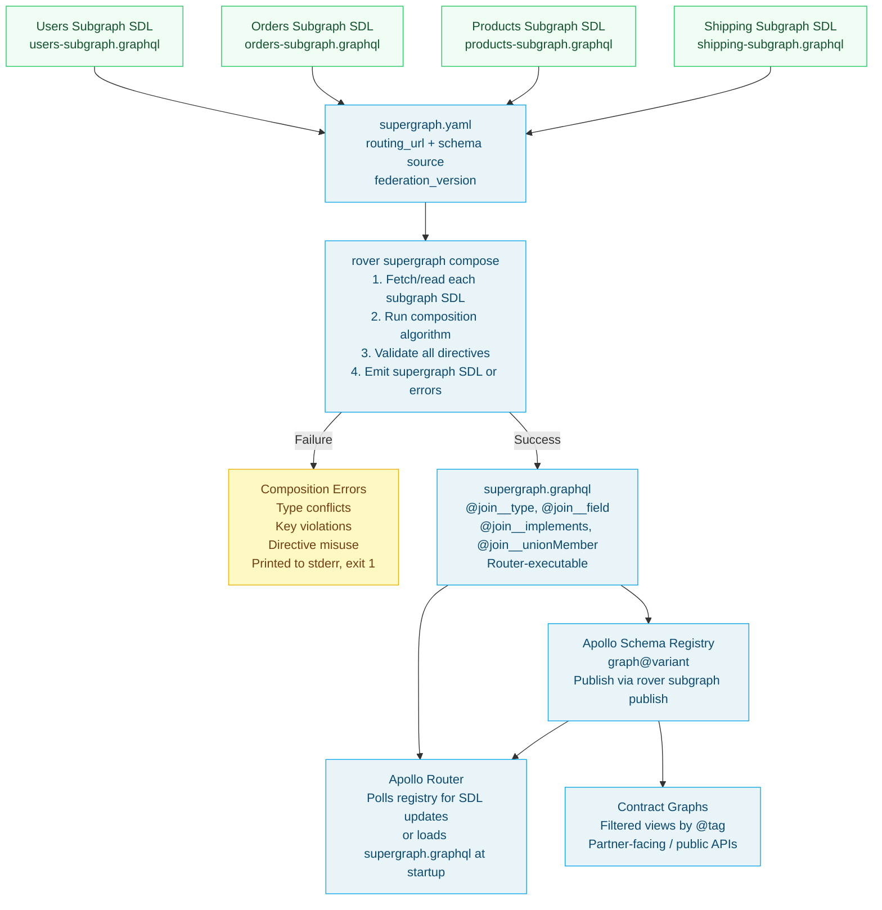

# 03 — Apollo Federation Composition

> **Purpose:** Explain exactly how Apollo Federation composition works — from collecting subgraph SDLs through validation and conflict detection to producing the supergraph SDL that the Apollo Router uses for query planning. Cover the `rover supergraph compose` workflow, CI validation with `rover subgraph check`, contract graphs, and operational patterns for managing composition in production.

---

## Learning Objectives

- [ ] Explain what composition produces and how the Apollo Router uses the output
- [ ] Identify the five categories of composition errors and how to fix each
- [ ] Write a `supergraph.yaml` configuration file for a multi-subgraph system
- [ ] Set up `rover subgraph check` in a CI pipeline to catch breaking changes before merge
- [ ] Create and manage contract graphs using `@tag` annotations and Apollo Studio
- [ ] Describe the managed federation model and how the router receives supergraph updates

---

## Overview

Composition is the process that transforms a set of independent subgraph schemas into a single, consistent, router-executable supergraph schema. It is the mechanical backbone of Apollo Federation — the algorithm that makes "multiple teams, one API" possible without human schema negotiation for every field.

At its simplest, composition takes N subgraph SDLs and produces one supergraph SDL. The supergraph SDL encodes:
- Every field visible in the unified schema
- Which subgraph owns each field (encoded in `@join__field` annotations)
- How entities can be resolved across subgraph boundaries (encoded in `@join__type` and `@join__implements` annotations)
- The query plan metadata the router needs to decompose any possible client query into subgraph fetches

Composition fails fast and descriptively. A type conflict between two subgraphs, an `@external` field with the wrong type, or a `@key` field that is nullable — all of these produce build failures with specific error messages, before any code is deployed. This is one of federation's most important safety properties: **schema correctness is enforced at composition time, not at runtime.**

In practice, composition runs in three places: locally on a developer's machine during schema development, in CI on every pull request that modifies a subgraph schema, and on the Apollo Router at startup when it fetches the latest supergraph from the Apollo Schema Registry.

---

## Architecture: Composition Pipeline



---

## Core Concepts

### What Composition Produces

The output of composition is a **supergraph SDL** — a GraphQL schema document that is a strict superset of any individual subgraph schema. It includes every type and field from every subgraph, merged according to federation's composition rules, plus the router's `@join__` metadata annotations.

A minimal excerpt of a composed supergraph SDL:

```graphql
schema
  @link(url: "https://specs.apollo.dev/link/v1.0")
  @link(url: "https://specs.apollo.dev/join/v0.4", for: EXECUTION)
  @link(url: "https://specs.apollo.dev/tag/v0.3") {
  query: Query
  mutation: Mutation
}

enum join__Graph {
  ORDERS @join__graph(name: "orders", url: "http://orders-service:4002/graphql")
  PRODUCTS @join__graph(name: "products", url: "http://products-service:4003/graphql")
  SHIPPING @join__graph(name: "shipping", url: "http://shipping-service:4004/graphql")
  USERS @join__graph(name: "users", url: "http://users-service:4001/graphql")
}

type User
  @join__type(graph: USERS, key: "id")
  @join__type(graph: ORDERS, key: "id", extension: true)
  @join__type(graph: SHIPPING, key: "id", extension: true)
  @tag(name: "public") {
  id: ID!
  name: String!                   @join__field(graph: USERS) @tag(name: "public")
  email: String!                  @join__field(graph: USERS) @tag(name: "public") @tag(name: "pii")
  tier: CustomerTier!             @join__field(graph: USERS) @tag(name: "public")
  address: Address                @join__field(graph: USERS) @tag(name: "public")
  orders(
    first: Int = 10
    after: String
    status: [OrderStatus!]
  ): OrderConnection!             @join__field(graph: ORDERS) @tag(name: "public")
  orderCount: Int!                @join__field(graph: ORDERS) @tag(name: "public")
  totalSpent: Money!              @join__field(graph: ORDERS) @tag(name: "public")
  shippingOptions: [ShippingOption!]!
                                  @join__field(graph: SHIPPING, requires: "address { city state country postalCode }")
                                  @tag(name: "public")
}
```

The `@join__field` annotations tell the router's query planner which subgraph to contact for each field. The `requires` attribute on `@join__field` encodes the `@requires` dependency so the query planner can insert the appropriate Sequence node.

### Composition Rules

Federation composition enforces these rules mechanically. Violations produce errors with specific error codes.

#### Value Type Consistency

Any non-entity type that appears in more than one subgraph must be structurally identical. This applies to `@shareable` types, shared enums, shared scalars, and shared input types.

```graphql
# VALID: both subgraphs define Money identically
# users-subgraph
type Money @shareable { amount: Float! currency: String! }

# orders-subgraph
type Money @shareable { amount: Float! currency: String! }

# INVALID: field type mismatch → composition error
# ERROR: [INVALID_FIELD_SHARING] Field "Money.amount" is defined differently across subgraphs:
#   users-subgraph: Float!
#   orders-subgraph: Decimal!

# orders-subgraph (wrong)
type Money @shareable { amount: Decimal! currency: String! }
```

#### `@key` Field Constraints

`@key` fields must be:
- Non-nullable (`ID!` not `ID`)
- Present on the type in the owning subgraph
- Not argument-bearing (fields without arguments only)

```graphql
# INVALID: nullable @key field
type Order @key(fields: "id") {
  id: ID    # ERROR: @key field "id" must be non-nullable
  status: OrderStatus!
}

# VALID:
type Order @key(fields: "id") {
  id: ID!   # Non-nullable
  status: OrderStatus!
}
```

#### `@external` Field Type Matching

`@external` field types must exactly match their definition in the owning subgraph.

```graphql
# Users subgraph defines:
type User @key(fields: "id") {
  id: ID!
  address: Address
}

# Shipping subgraph references (correct):
type User @key(fields: "id") {
  id: ID! @external
  address: Address @external  # matches exactly: nullable Address
  shippingOptions: [ShippingOption!]! @requires(fields: "address { city country postalCode }")
}

# INVALID — type mismatch:
type User @key(fields: "id") {
  id: ID! @external
  address: Address! @external  # ERROR: Users defines 'address: Address' (nullable), not 'Address!'
  shippingOptions: [ShippingOption!]! @requires(fields: "address { city country postalCode }")
}
```

#### `@requires` Field Existence

Fields listed in `@requires(fields: "...")` must be declared as `@external` on the same type, and must exist in the owning subgraph.

```graphql
# INVALID: @requires references a field not declared @external
type User @key(fields: "id") {
  id: ID! @external
  # address is NOT declared @external
  shippingOptions: [ShippingOption!]!
    @requires(fields: "address { city country }")
  # ERROR: Field "User.address" used in @requires is not declared @external in shipping subgraph
}
```

#### Query Root Field Uniqueness

Root-level Query/Mutation fields can only be defined in one subgraph (unless `@shareable`). Two subgraphs cannot both define `Query.user`.

```graphql
# users-subgraph
type Query { user(id: ID!): User }

# admin-subgraph (INVALID — duplicate root field)
type Query { user(id: ID!): User }
# ERROR: [INVALID_FIELD_SHARING] Field "Query.user" is defined in multiple subgraphs
#   and is not marked @shareable

# admin-subgraph (valid — override)
type Query { user(id: ID!): User @shareable }
```

---

## The `supergraph.yaml` Configuration

The `supergraph.yaml` (or `supergraph.config.yaml`) file tells `rover supergraph compose` where to find each subgraph's SDL and what routing URL to embed in the supergraph SDL.

```yaml
# supergraph.yaml
federation_version: =2.6.0   # Pin to exact version — avoid floating 2.x

subgraphs:
  users:
    routing_url: http://users-service:4001/graphql
    schema:
      # Option 1: fetch SDL from live subgraph (introspection)
      subgraph_url: http://users-service:4001/graphql

  orders:
    routing_url: http://orders-service:4002/graphql
    schema:
      # Option 2: read from local SDL file
      file: ./subgraphs/orders/schema.graphql

  products:
    routing_url: http://products-service:4003/graphql
    schema:
      # Option 3: fetch from a separate schema registry/file server
      subgraph_url: http://products-service:4003/graphql

  shipping:
    routing_url: http://shipping-service:4004/graphql
    schema:
      file: ./subgraphs/shipping/schema.graphql

  inventory:
    routing_url: http://inventory-service:4005/graphql
    schema:
      subgraph_url: http://inventory-service:4005/graphql

  notifications:
    routing_url: http://notifications-service:4006/graphql
    schema:
      file: ./subgraphs/notifications/schema.graphql
```

**Configuration field notes:**

- `federation_version`: Always pin to an exact version using the `=` prefix (`=2.6.0`). Without pinning, rover may use a newer composition library version that introduces different validation rules, causing unexpected failures.
- `routing_url`: The URL the router will use to contact this subgraph at runtime. This is embedded in the supergraph SDL's `@join__graph` annotations.
- `schema.subgraph_url`: URL for fetching the SDL during composition (via `_service { sdl }`). Can differ from `routing_url` — useful in development where SDL is fetched from localhost but the router routes to a cluster DNS name.
- `schema.file`: Path to a local SDL file. Preferred in CI pipelines where subgraphs may not be running. Subgraph teams should commit their `schema.graphql` to their repository and export it to a known location.

---

## Rover CLI: Composition Commands

### Local Composition

```bash
# Install Rover CLI
curl -sSL https://rover.apollo.dev/nix/latest | sh
rover --version  # Confirm installation: rover 0.23.2

# Compose locally, outputting to a file
rover supergraph compose \
  --config supergraph.yaml \
  --output supergraph.graphql

# Compose and print to stdout (useful in scripts)
rover supergraph compose --config supergraph.yaml

# Compose with debug output to see fetch timing per subgraph
rover supergraph compose --config supergraph.yaml --log debug 2>&1 | head -100
```

The exit code is 0 on success, 1 on composition failure. Composition errors are printed to stderr with error codes:

```
error[INVALID_FIELD_SHARING]: Non-shareable field "Money.amount" is resolved by multiple subgraphs:
it is resolved by "orders" and "users" and defined as non-shareable in all of them.
  - users: subgraphs/users/schema.graphql:42:3
  - orders: subgraphs/orders/schema.graphql:67:3

error[EXTERNAL_TYPE_MISMATCH]: Field "User.address" is declared @external in shipping subgraph
but the type mismatch with the definition in users subgraph:
  - users: address: Address (nullable)
  - shipping: address: Address! (non-nullable)
  - shipping: subgraphs/shipping/schema.graphql:18:3
```

### Subgraph Check Against the Registry

`rover subgraph check` validates a proposed schema change against the current state of the schema registry. It checks:

1. **Composition validity** — the proposed schema composes successfully with all other registered subgraphs
2. **Breaking change detection** — the proposed change doesn't break existing client operations (based on usage data from Apollo Studio)
3. **Contract validity** — the change doesn't break any contract graph derived from this supergraph

```bash
# Authenticate Rover CLI with Apollo Studio
export APOLLO_KEY="service:my-graph:xxxxxxxxxxxxxxxxxxxxxxxx"

# Check a proposed schema change for the 'users' subgraph
rover subgraph check my-graph@production \
  --schema ./subgraphs/users/schema.graphql \
  --name users

# Check with explicit routing URL
rover subgraph check my-graph@production \
  --schema ./subgraphs/orders/schema.graphql \
  --name orders \
  --routing-url http://orders-service:4002/graphql

# Check with a URL (instead of local file)
rover subgraph check my-graph@production \
  --schema http://localhost:4001/graphql \
  --name users
```

Example output from a check that detects breaking changes:

```
Checking 'users' against 'my-graph@production' ...

Change   │ Code                    │ Description
─────────┼─────────────────────────┼────────────────────────────────────────────────────────────
FAIL     │ FIELD_REMOVED           │ Field `User.phone` was removed.
FAIL     │ FIELD_TYPE_CHANGED      │ Field `User.tier` changed type from `CustomerTier!` to `String!`
PASS     │ FIELD_ADDED             │ Field `User.preferredLanguage` was added.

Composition: PASSED
Checks: FAILED

1 check task has failures.
See https://studio.apollographql.com/graph/my-graph/checks/... for details.
```

### Publishing Subgraph Schemas

After a subgraph is deployed to production, publish its schema to the registry:

```bash
# Publish the users subgraph schema after deployment
rover subgraph publish my-graph@production \
  --schema ./subgraphs/users/schema.graphql \
  --name users \
  --routing-url http://users-service.prod.svc.cluster.local:4001/graphql

# Publish by introspecting the live subgraph
rover subgraph publish my-graph@production \
  --schema http://users-service:4001/graphql \
  --name users \
  --routing-url http://users-service.prod.svc.cluster.local:4001/graphql
```

Publishing triggers a new composition run in Apollo Studio. If composition succeeds, the router receives the new supergraph SDL on its next polling interval.

---

## CI Validation Pipeline

Every pull request that modifies a subgraph schema should run `rover subgraph check`. Here is a complete GitHub Actions workflow for the Users subgraph:

```yaml
# .github/workflows/graphql-check.yml
name: GraphQL Schema Check

on:
  pull_request:
    paths:
      - "subgraphs/users/**"
      - "subgraphs/users/schema.graphql"

jobs:
  federation-check:
    name: Federation Schema Check
    runs-on: ubuntu-latest

    steps:
      - name: Checkout
        uses: actions/checkout@v4

      - name: Install Rover CLI
        run: |
          curl -sSL https://rover.apollo.dev/nix/latest | sh
          echo "$HOME/.rover/bin" >> $GITHUB_PATH

      - name: Check Users Subgraph Schema
        env:
          APOLLO_KEY: ${{ secrets.APOLLO_KEY }}
        run: |
          rover subgraph check ${{ vars.APOLLO_GRAPH_REF }} \
            --schema ./subgraphs/users/schema.graphql \
            --name users

      - name: Local Composition Validation
        # Also compose locally to catch issues before check
        run: |
          rover supergraph compose \
            --config supergraph.yaml \
            --output /tmp/supergraph-test.graphql

      - name: Comment Check Results on PR
        if: always()
        uses: actions/github-script@v7
        with:
          script: |
            const { execSync } = require('child_process');
            // Post check URL from rover output to PR as a comment
            github.rest.issues.createComment({
              issue_number: context.issue.number,
              owner: context.repo.owner,
              repo: context.repo.repo,
              body: '### GraphQL Schema Check\nCheck the Apollo Studio results linked in the CI logs above.'
            });
```

### Multi-Subgraph Monorepo

In a monorepo where multiple subgraphs live in subdirectories, use a path filter to trigger the appropriate check:

```yaml
# .github/workflows/federation-check.yml
name: Federation Schema Check — All Subgraphs

on:
  pull_request:
    paths:
      - "services/*/graphql/schema.graphql"

jobs:
  detect-changed-subgraphs:
    runs-on: ubuntu-latest
    outputs:
      matrix: ${{ steps.detect.outputs.matrix }}
    steps:
      - uses: actions/checkout@v4
        with:
          fetch-depth: 0

      - name: Detect changed subgraph schemas
        id: detect
        run: |
          CHANGED=$(git diff --name-only origin/main...HEAD \
            | grep 'services/.*/graphql/schema.graphql' \
            | sed 's|services/\(.*\)/graphql/schema.graphql|\1|')
          MATRIX=$(echo "$CHANGED" | jq -R -s -c 'split("\n") | map(select(length > 0))')
          echo "matrix=$MATRIX" >> $GITHUB_OUTPUT

  check-subgraphs:
    needs: detect-changed-subgraphs
    runs-on: ubuntu-latest
    if: ${{ needs.detect-changed-subgraphs.outputs.matrix != '[]' }}
    strategy:
      matrix:
        subgraph: ${{ fromJson(needs.detect-changed-subgraphs.outputs.matrix) }}
      fail-fast: false  # Check all changed subgraphs even if one fails

    steps:
      - uses: actions/checkout@v4

      - name: Install Rover
        run: |
          curl -sSL https://rover.apollo.dev/nix/latest | sh
          echo "$HOME/.rover/bin" >> $GITHUB_PATH

      - name: Check ${{ matrix.subgraph }} subgraph
        env:
          APOLLO_KEY: ${{ secrets.APOLLO_KEY }}
        run: |
          rover subgraph check ${{ vars.APOLLO_GRAPH_REF }} \
            --schema ./services/${{ matrix.subgraph }}/graphql/schema.graphql \
            --name ${{ matrix.subgraph }}
```

---

## Managed Federation

In production, the Apollo Router does not compose subgraph schemas itself. Instead, it uses **managed federation**: the router polls Apollo Studio's Uplink service for the latest composed supergraph SDL. When a new supergraph is available (after a successful composition triggered by `rover subgraph publish`), the router hot-reloads the new schema without restarting.

```yaml
# router.yaml — managed federation configuration
uplink:
  endpoints:
    - https://uplink.api.apollographql.com/
  poll_interval: 10s   # How often to check for new supergraph SDL
  timeout: 30s

# The APOLLO_KEY and APOLLO_GRAPH_REF environment variables
# tell the router which graph and variant to poll from:
# APOLLO_KEY=service:my-graph:xxxxxxxxxxxxx
# APOLLO_GRAPH_REF=my-graph@production
```

The managed federation flow:

```
1. Engineer merges PR with schema change to users-subgraph
2. CI pipeline deploys new users-service pod
3. Post-deployment hook runs:
   rover subgraph publish my-graph@production \
     --schema ./schema.graphql \
     --name users \
     --routing-url http://users-service.prod.svc.cluster.local:4001/graphql
4. Apollo Studio runs composition with the new users schema
5. Composition succeeds → new supergraph SDL stored in registry
6. Router polls Uplink every 10 seconds, detects new supergraph
7. Router hot-reloads: new query plans are built for the new schema
8. In-flight requests complete with old plans; new requests use new plans
```

---

## Contract Graphs

A **contract graph** is a filtered view of the supergraph, exposing only the types and fields matching specified `@tag` criteria. Contracts allow you to:

- Create a public-facing API that exposes only `@tag(name: "public")` fields
- Create partner-specific APIs with a limited set of fields
- Keep internal implementation details out of external schemas

### Creating a Contract in Apollo Studio

Contracts are created through the Apollo Studio UI or via the Studio API. The contract configuration specifies which tags to include or exclude:

```json
{
  "filterConfig": {
    "include": ["public"],
    "exclude": ["internal", "pii", "beta"]
  }
}
```

Given the Users subgraph with these tags:

```graphql
type User @key(fields: "id") @tag(name: "public") {
  id: ID! @tag(name: "public")
  name: String! @tag(name: "public")
  email: String! @tag(name: "public") @tag(name: "pii")
  phone: String @tag(name: "internal") @tag(name: "pii")
  status: UserStatus! @tag(name: "internal")
  tier: CustomerTier! @tag(name: "public")
  address: Address @tag(name: "public")
  internalFlags: [String!]! @inaccessible @tag(name: "internal")
}
```

The `public` contract includes:
- `User.id`, `User.name`, `User.tier`, `User.address` (tagged `public`, not `pii`)
- Excludes `User.email` (tagged `public` AND `pii` — `pii` exclusion wins)
- Excludes `User.phone` (tagged `internal`)
- Excludes `User.status` (tagged `internal`)
- Excludes `User.internalFlags` (`@inaccessible`)

### Contract Routing

Each contract graph gets its own router endpoint. You can deploy a separate Apollo Router instance for each contract, or use a single router with multiple supergraph configurations.

```bash
# Router instance for public-facing API
APOLLO_GRAPH_REF=my-graph@public-contract \
APOLLO_KEY=service:my-graph:xxxxxxxxxx \
./router --config router-public.yaml

# Router instance for internal API
APOLLO_GRAPH_REF=my-graph@production \
APOLLO_KEY=service:my-graph:xxxxxxxxxx \
./router --config router-internal.yaml
```

---

## Composition Errors: Common Cases and Fixes

### Error: FIELD_ARGUMENT_DEFAULT_MISMATCH

```
error[FIELD_ARGUMENT_DEFAULT_MISMATCH]: Argument "User.orders(first:)" has incompatible defaults
across subgraphs: will use default value `10` (from subgraph "orders") but subgraph "analytics"
uses default value `20`.
```

**Fix:** Make argument defaults consistent across all subgraphs that define the argument.

### Error: OVERRIDE_FROM_SELF_ERROR

```
error[OVERRIDE_FROM_SELF_ERROR]: Field "Product.inventory" on subgraph "products" cannot
be marked with @override(from: "products"): a subgraph cannot override a field from itself.
```

**Fix:** `@override(from: ...)` must reference a *different* subgraph name.

### Error: REQUIRED_INACCESSIBLE

```
error[REQUIRED_INACCESSIBLE]: Field "User.address" is @inaccessible but is required by
@requires in subgraph "shipping": "@requires(fields: \"address { city country postalCode }\")"
```

**Fix:** Fields used in `@requires` cannot be `@inaccessible`. Either remove `@inaccessible` from `address` or restructure to avoid the requirement.

### Error: KEY_FIELDS_SELECT_INVALID_TYPE

```
error[KEY_FIELDS_SELECT_INVALID_TYPE]: Key @key(fields: "id") on type "Order" in subgraph
"analytics" references field "Order.id" which is of type "ID" (nullable), but @key fields
must be non-nullable.
```

**Fix:** Change the `@key` field to non-nullable: `id: ID!`.

### Error: INVALID_FIELD_SHARING

```
error[INVALID_FIELD_SHARING]: Non-shareable field "Money.amount" is defined in multiple
subgraphs (users, orders) without being marked @shareable. Add @shareable to both definitions.
```

**Fix:** Add `@shareable` to the `Money` type (or just the `amount` field) in every subgraph that defines it.

---

## Production Considerations

### Performance

**Composition is not on the hot path.** Composition runs at deploy time, not per-request. A 10-second composition time for 30 subgraphs is acceptable. However, slow SDL fetches from live subgraphs (when using `subgraph_url`) can delay local development iteration. Prefer local SDL files for CI and `subgraph_url` for integration environments.

**Hot reload latency.** When the router hot-reloads a new supergraph SDL, it must rebuild query plan caches. Expect a brief period where cache hit rate drops to zero. Pre-warm the cache by sending representative queries after each reload.

### Security

**SDL confidentiality.** The subgraph SDL is fetched by `rover supergraph compose` via the `_service { sdl }` endpoint. Restrict access to this endpoint in production — it exposes your full internal schema, including `@inaccessible` fields and internal naming conventions. The `_service` endpoint should be accessible only from the composition pipeline and the router, not from public networks.

**Apollo Uplink authentication.** The router authenticates to Apollo Uplink using the `APOLLO_KEY` environment variable. Treat this key as a secret — store it in Kubernetes Secrets or a secrets manager, never in source code or container images.

### Observability

Monitor these metrics to detect composition health:

| Metric | Source | Alert Threshold |
|---|---|---|
| `apollo_router_schema_reload_total` | Router Prometheus | Increasing = composition happening (good) |
| `apollo_router_schema_reload_error_total` | Router Prometheus | Any non-zero = composition/reload failing |
| Rover CLI exit code in CI | CI system | Non-zero exit = block merge |
| Apollo Studio check pass rate | Studio metrics | Below 95% = composition health concern |

---

## Best Practices

1. **Pin the federation version.** Use `federation_version: =2.6.0` (exact pin) in `supergraph.yaml`. Floating versions (`2.x`) can silently introduce composition rule changes when rover updates.

2. **Commit SDL files to source control.** Each subgraph team should commit their `schema.graphql` to their repository. CI composition uses SDL files, not live introspection, ensuring reproducible builds.

3. **Run `rover supergraph compose` locally before push.** Add this to git pre-push hooks or Makefiles. Catching composition errors locally is faster than waiting for CI.

4. **Use a staging graph variant.** Maintain separate variants (`staging`, `production`). Check schemas against `staging` in feature branches; only push to `production` after staging validation.

5. **Block merges on failing schema checks.** Configure `rover subgraph check` as a required CI status check. A failing check should block the PR from merging, not just be a warning.

6. **Publish schemas atomically with deployments.** Schema publication should happen in the same CI step as the service deployment (or immediately after). A lag between deployment and schema publication means the registry is out of sync with production.

7. **Use `--format json` for machine-readable output.** When integrating Rover into scripts or dashboards, `rover subgraph check ... --format json` produces parseable output for automated processing.

---

## Anti-Patterns

**Composing only in production.** If composition only runs when publishing to the production registry, schema conflicts go undetected until deployment day. Run composition on every PR.

**Using `subgraph_url` in CI against live services.** If composition fetches SDLs from live services, CI is dependent on service availability. A staging service being down blocks schema validation. Use committed SDL files in CI.

**Ignoring composition warnings.** Rover emits warnings for deprecated directive usage, inconsistent defaults, and potential future breaking changes. Treat warnings as pre-errors — address them before they become failures.

**Large supergraph SDL in version control.** The composed `supergraph.graphql` is a generated artifact. Committing it to version control as a source of truth creates merge conflicts and drift. Store it in the Apollo Schema Registry, not Git.

---

## Operational Notes

- Rover CLI stores its credentials in `~/.rover/config.toml`. Do not commit this file. Add it to `.gitignore` in developer machines and use environment variables (`APOLLO_KEY`) in CI.
- Apollo Schema Registry retains composition history. You can roll back to a previous supergraph SDL via the Studio UI or `rover supergraph fetch my-graph@production --revision <rev>`.
- When composition fails in Apollo Studio (after `rover subgraph publish`), the router continues using the last successfully composed supergraph. The failed publish does not affect production.
- Use `rover config auth` for interactive authentication setup, or set `APOLLO_KEY` as an environment variable for non-interactive (CI) usage.
- `rover subgraph list my-graph@production` lists all registered subgraphs and their routing URLs — useful for auditing what the router currently uses.

---

## References

- [Rover CLI Documentation](https://www.apollographql.com/docs/rover/) — complete reference for all rover commands
- [Apollo Federation Composition Rules](https://www.apollographql.com/docs/federation/federated-types/composition/) — normative composition rules and error codes
- [Apollo Schema Registry and Managed Federation](https://www.apollographql.com/docs/graphos/schema-management/) — registry, publishing, and managed federation workflow

---

## Related Topics

- [01 — Federation Concepts](./01-federation-concepts.md) — foundational understanding of entities, subgraphs, and supergraph
- [02 — Federation Directives](./02-federation-directives.md) — directive-level composition rules
- [04 — Query Planning](./04-query-planning.md) — how the router uses the composed supergraph to plan queries
- [Chapter 11: CI/CD Automation](../11-ci-cd-automation/README.md) — full CI/CD pipeline for federated GraphQL
