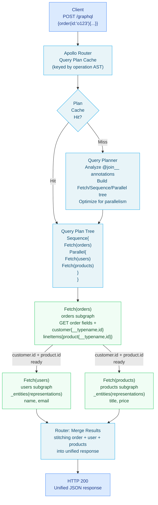

# 04 — Apollo Router Query Planning

> **Purpose:** Explain how the Apollo Router's query planner decomposes a supergraph query into a tree of subgraph fetches, executes them in the optimal order (parallel where possible, sequential when dependencies exist), and merges the results into a unified response. Understanding query planning is essential for diagnosing performance issues, optimizing schema design, and interpreting Apollo Studio's query plan viewer.

---

## Learning Objectives

- [ ] Explain the three query plan node types: Fetch, Sequence, and Parallel
- [ ] Trace a multi-subgraph query through its query plan and identify which subgraph fetches are parallel vs. sequential
- [ ] Explain how `@requires` creates Sequence nodes and `@provides` eliminates them
- [ ] Read and interpret the Apollo Studio query plan viewer output
- [ ] Identify query plan anti-patterns: deep Sequence chains, unbatched entity fetches, redundant fetches
- [ ] Apply schema design changes (`@provides`, entity key choices, subgraph boundary shifts) to optimize query plans

---

## Overview

The Apollo Router's query planner is the engine that makes federation transparent to clients. A client sends one GraphQL query to the router. The query planner analyzes the supergraph SDL's `@join__` metadata and produces an execution plan — a tree of instructions describing exactly which subgraphs to contact, in what order, with what query fragments, and how to combine their responses.

The planner must solve a constrained optimization problem: execute the minimum number of subgraph fetches, in the order dictated by data dependencies, with maximum parallelism where dependencies allow. A well-designed federated schema produces plans with broad Parallel nodes and shallow Sequence nesting. A poorly designed schema produces long sequential chains where each hop waits for the previous one.

Query plans are computed once per unique operation (the same operation with different variables reuses the cached plan). In production, well-utilized supergraphs achieve near-100% query plan cache hit rates, making planning cost negligible. The first request for each unique operation pays the planning cost; all subsequent requests execute the cached plan directly.

---

## Architecture: Query Plan Execution



---

## Core Concepts

### The Three Node Types

Query plans are trees composed of three node types:

**Fetch node:** Executes a single GraphQL query against one subgraph. Contains:
- `subgraph`: which subgraph to contact
- `query`: the GraphQL query fragment to send
- `path` (optional): where in the merged response to attach the result
- `representations` (for entity fetches): the entity references to send in `$representations`

**Sequence node:** Contains an ordered list of child nodes that must execute one after another. A Sequence is required when node B needs data from node A's result. The output of node A is used to construct the input for node B.

**Parallel node:** Contains an unordered list of child nodes that can execute concurrently. The router starts all children simultaneously and waits for all to complete before proceeding.

The planner generates the most parallel plan possible given the data dependencies imposed by the schema's `@requires`, `@key`, and `@provides` directives.

### Entity Resolution: The `_entities` Query

When the router needs fields from a referenced entity (e.g., `User` data from the Users subgraph after fetching `order.customer.id` from the Orders subgraph), it sends an `_entities` query with a `representations` array:

```graphql
# Router sends this to the Users subgraph
query FetchEntities($representations: [_Any!]!) {
  _entities(representations: $representations) {
    ... on User {
      name
      email
      tier
    }
  }
}
```

```json
{
  "representations": [
    { "__typename": "User", "id": "user-alice-001" },
    { "__typename": "User", "id": "user-bob-002" }
  ]
}
```

Critically, the router **batches** entity representations. If a query returns 20 orders each with a `customer: User!`, the router collects all 20 User entity references and sends them in a single `_entities` call with a 20-element `representations` array. This is automatic — the planner always batches entity fetches by subgraph and by type within that subgraph.

### How `@requires` Creates Sequence Nodes

When a field has `@requires(fields: "x { y z }")`, the query planner must:
1. First fetch `x { y z }` from the subgraph that owns those fields
2. Then, using the fetched values, call the `@requires`-bearing field's resolver

This mandatory ordering becomes a Sequence node. The `@requires` fields are not optional — the downstream resolver cannot execute without them.

### How `@provides` Eliminates Sequence Nodes

When a field has `@provides(fields: "x y")`, the query planner knows that fetching this field will also return `x` and `y` from the related entity — without an additional `_entities` fetch to the owning subgraph.

`@provides` converts a Sequence node into either a single Fetch node (if the provided fields are all that's needed) or a more parallel plan (by eliminating the data dependency that forced the sequence).

---

## Complete Worked Example

### The Client Query

```graphql
query GetOrderDetails($orderId: ID!) {
  order(id: $orderId) {
    id
    status
    total {
      amount
      currency
    }
    customer {
      name
      email
      tier
    }
    lineItems {
      id
      quantity
      unitPrice {
        amount
        currency
      }
      product {
        title
        price {
          amount
          currency
        }
        category {
          name
        }
      }
    }
  }
}
```

### Subgraph Field Ownership (from supergraph SDL)

| Field Path | Owner Subgraph |
|---|---|
| `Query.order` | orders |
| `Order.id`, `.status`, `.total` | orders |
| `Order.customer` → `User.name`, `.email`, `.tier` | users (via `_entities`) |
| `Order.lineItems[].id`, `.quantity`, `.unitPrice` | orders |
| `LineItem.product` → `Product.title`, `.price`, `.category.name` | products (via `_entities`) |
| `Category.name` (owned by products subgraph) | products (no separate fetch needed) |

### The Query Plan

```
Sequence {
  Fetch(subgraph: "orders") {
    query {
      order(id: $orderId) {
        id
        status
        total { amount currency }
        customer { __typename id }
        lineItems {
          id
          quantity
          unitPrice { amount currency }
          product { __typename id }
        }
      }
    }
  }

  Parallel {
    Fetch(subgraph: "users", path: ["order", "customer"]) {
      query($representations: [_Any!]!) {
        _entities(representations: $representations) {
          ... on User {
            name
            email
            tier
          }
        }
      }
      representations: [{ __typename: "User", id: $customer.id }]
    }

    Fetch(subgraph: "products", path: ["order", "lineItems", "@", "product"]) {
      query($representations: [_Any!]!) {
        _entities(representations: $representations) {
          ... on Product {
            title
            price { amount currency }
            category { name }
          }
        }
      }
      representations: [for each lineItem: { __typename: "Product", id: $product.id }]
    }
  }
}
```

### Actual Subgraph Requests

**Request 1 — Orders subgraph:**

```
POST http://orders-service:4002/graphql
Content-Type: application/json

{
  "query": "query FetchOrder($orderId: ID!) { order(id: $orderId) { id status total { amount currency } customer { __typename id } lineItems { id quantity unitPrice { amount currency } product { __typename id } } } }",
  "variables": { "orderId": "ord-xyz-789" }
}
```

**Response from Orders subgraph:**

```json
{
  "data": {
    "order": {
      "id": "ord-xyz-789",
      "status": "DELIVERED",
      "total": { "amount": 89.97, "currency": "USD" },
      "customer": { "__typename": "User", "id": "user-alice-001" },
      "lineItems": [
        {
          "id": "li-001",
          "quantity": 2,
          "unitPrice": { "amount": 29.99, "currency": "USD" },
          "product": { "__typename": "Product", "id": "prod-widget-42" }
        },
        {
          "id": "li-002",
          "quantity": 1,
          "unitPrice": { "amount": 29.99, "currency": "USD" },
          "product": { "__typename": "Product", "id": "prod-gadget-17" }
        }
      ]
    }
  }
}
```

**Requests 2a and 2b — executed in parallel:**

Users subgraph (`_entities`):
```
POST http://users-service:4001/graphql
{
  "query": "query($representations: [_Any!]!) { _entities(representations: $representations) { ... on User { name email tier } } }",
  "variables": {
    "representations": [{ "__typename": "User", "id": "user-alice-001" }]
  }
}
```

Products subgraph (`_entities`):
```
POST http://products-service:4003/graphql
{
  "query": "query($representations: [_Any!]!) { _entities(representations: $representations) { ... on Product { title price { amount currency } category { name } } } }",
  "variables": {
    "representations": [
      { "__typename": "Product", "id": "prod-widget-42" },
      { "__typename": "Product", "id": "prod-gadget-17" }
    ]
  }
}
```

Note that both products from both line items are batched into a single `_entities` call.

**Merged response sent to client:**

```json
{
  "data": {
    "order": {
      "id": "ord-xyz-789",
      "status": "DELIVERED",
      "total": { "amount": 89.97, "currency": "USD" },
      "customer": {
        "name": "Alice Nguyen",
        "email": "alice@example.com",
        "tier": "GOLD"
      },
      "lineItems": [
        {
          "id": "li-001",
          "quantity": 2,
          "unitPrice": { "amount": 29.99, "currency": "USD" },
          "product": {
            "title": "Precision Widget Pro",
            "price": { "amount": 29.99, "currency": "USD" },
            "category": { "name": "Tools & Equipment" }
          }
        },
        {
          "id": "li-002",
          "quantity": 1,
          "unitPrice": { "amount": 29.99, "currency": "USD" },
          "product": {
            "title": "Smart Gadget V2",
            "price": { "amount": 29.99, "currency": "USD" },
            "category": { "name": "Electronics" }
          }
        }
      ]
    }
  }
}
```

---

## How `@requires` Changes the Plan

Consider adding a `shippingOptions` field that uses `@requires`:

```graphql
# shipping-subgraph schema
type User @key(fields: "id") {
  id: ID! @external
  address: Address @external
  shippingOptions: [ShippingOption!]!
    @requires(fields: "address { city state country postalCode }")
}
```

Now add `shippingOptions` to the client query:

```graphql
query GetOrderWithShipping($orderId: ID!) {
  order(id: $orderId) {
    customer {
      name
      address { city country }
      shippingOptions { carrier service estimatedDays price { amount currency } }
    }
  }
}
```

The query plan becomes a two-level Sequence:

```
Sequence {
  Fetch(subgraph: "orders") {
    order(id: $orderId) {
      customer { __typename id }
    }
  }

  Sequence {
    Fetch(subgraph: "users", path: ["order", "customer"]) {
      _entities(representations: [{ __typename: "User", id: $id }]) {
        ... on User {
          name
          address { city state country postalCode }  # must fetch postalCode too for @requires
        }
      }
    }

    Fetch(subgraph: "shipping", path: ["order", "customer"]) {
      _entities(representations: [{ __typename: "User", id: $id, address: $address }]) {
        ... on User {
          shippingOptions { carrier service estimatedDays price { amount currency } }
        }
      }
    }
  }
}
```

Total: 3 sequential subgraph round-trips (orders → users → shipping). This is the cost of `@requires`.

### Eliminating the Extra Hop with `@provides`

If the Orders subgraph fetches the customer's address as part of the order query (via a database JOIN), it can declare `@provides`:

```graphql
# orders-subgraph schema
type Order @key(fields: "id") {
  id: ID!
  customer: User! @provides(fields: "address { street city state country postalCode }")
}

type User @key(fields: "id") {
  id: ID! @external
  address: Address @external
}
```

Now the plan changes:

```
Sequence {
  Fetch(subgraph: "orders") {
    order(id: $orderId) {
      customer {
        __typename
        id
        address { street city state country postalCode }  # provided by orders!
      }
    }
  }

  Parallel {
    Fetch(subgraph: "users", path: ["order", "customer"]) {
      _entities([{ __typename: "User", id: $id }]) {
        ... on User { name }
      }
    }

    Fetch(subgraph: "shipping", path: ["order", "customer"]) {
      # address is already in the representation — no need to fetch it from users first
      _entities([{ __typename: "User", id: $id, address: $address }]) {
        ... on User {
          shippingOptions { carrier service estimatedDays price { amount currency } }
        }
      }
    }
  }
}
```

Result: the Users and Shipping fetches now run in Parallel. Total round-trips: 2 (orders → parallel users+shipping). The `@provides` eliminated one sequential hop.

---

## Interpreting the Apollo Studio Query Plan Viewer

Apollo Studio's Operations tab shows query plans for traced operations. The viewer renders:

```
▼ Sequence
  ▼ Fetch (orders)
    GET order(id: "o123") { ... }
    └── 34ms
  ▼ Parallel
    ▼ Fetch (users)
      GET _entities([User id:"user-abc"]) { name email tier }
      └── 12ms
    ▼ Fetch (products)
      GET _entities([Product id:"prod-1", Product id:"prod-2"]) { title price { ... } }
      └── 18ms
  Total plan execution: 52ms (34ms + max(12ms, 18ms))
```

Key observations from this output:

1. **Sequential latency adds up.** The 34ms orders fetch + 18ms max(users, products) = 52ms total. If orders took 100ms, total would be 118ms.

2. **Parallel savings.** Users (12ms) and Products (18ms) run concurrently. The plan pays max(12, 18) = 18ms, not 12+18=30ms.

3. **Fetch count matters.** Each Fetch node is one HTTP round-trip plus GraphQL execution on the subgraph. Reducing Fetch node count reduces both latency and load on subgraphs.

4. **Representation batching is visible.** The Products fetch shows two representations in one call — this is the automatic batching at work.

### Analyzing Slow Query Plans in Studio

When a query's P95 latency is high, look at:
- Which Fetch node has the longest individual time → that subgraph's resolver or database query is the bottleneck
- Whether Sequence depth is more than 2 → indicates `@requires` chains or poorly designed entity boundaries
- Whether the same subgraph appears multiple times in the plan → indicates a schema design opportunity to consolidate fetches via `@provides`

---

## Query Plan Optimization Strategies

### Strategy 1: Flatten `@requires` Chains with `@provides`

**Symptom:** Query plan has 3+ Sequence levels. Latency is additive across all levels.

**Fix:** Add `@provides` in the upstream subgraph to make required fields available earlier in the plan.

Before:
```
Sequence: orders (30ms) → users (25ms) → shipping (40ms) = 95ms total
```

After (orders `@provides` user.address):
```
Sequence: orders (35ms) → Parallel[users(25ms), shipping(40ms)] = 75ms total
```

### Strategy 2: Denormalize Hot-Path Entity Fields

**Symptom:** A high-frequency query always fetches the same few fields from an entity in a different subgraph (e.g., `order.customer.name` is in 95% of order queries).

**Fix:** Use `@provides` to include `customer.name` inline in the Order fetch. The Orders database stores a denormalized copy of `customerName` for display purposes.

This is a tradeoff: data freshness vs. latency. Evaluate whether the few-millisecond latency savings justify denormalization complexity.

### Strategy 3: Merge Small Subgraphs

**Symptom:** A subgraph contains only 2-3 fields and always appears in the query plan alongside another subgraph. The overhead of an extra HTTP round-trip exceeds the value of separation.

**Fix:** Merge the small subgraph into the related larger subgraph. Federation is not free — each Fetch node costs at minimum 1ms for local network overhead.

### Strategy 4: Use Persistent Queries for Plan Cache Efficiency

**Symptom:** Query plan cache hit rate is below 80%. Planning time is visible in traces.

**Fix:** Implement persisted queries (APQ). Clients send a hash of their operation; the router looks up the full operation by hash. This ensures every client query matches a pre-registered operation, maximizing cache hits.

```yaml
# router.yaml
persisted_queries:
  enabled: true
  safelist:
    enabled: true
    require_id: true  # Reject operations not in the safelist
```

### Strategy 5: Optimize Entity Key Lookup Performance

**Symptom:** `_entities` queries are slow — the Fetch(users) node consistently takes 50ms+.

**Fix:** Ensure the subgraph's `__resolveReference` implementation uses DataLoader batching. The router batches representations into one `_entities` call, but inside the subgraph, a naive `getUserById` in a loop will make N database queries for N representations.

```typescript
// BAD: N database queries for N representations
User: {
  __resolveReference: async ({ id }, { db }) => {
    return db.users.findById(id); // Called N times, each time hits DB
  },
}

// GOOD: DataLoader batches all IDs into one query
import DataLoader from 'dataloader';

function createUserLoader(db: Database) {
  return new DataLoader<string, User>(async (ids) => {
    const users = await db.users.findByIds(ids as string[]); // One query, returns N users
    const userMap = new Map(users.map(u => [u.id, u]));
    return ids.map(id => userMap.get(id) ?? null);
  });
}

User: {
  __resolveReference: async ({ id }, { loaders }) => {
    return loaders.user.load(id);
  },
}
```

---

## Advanced: Query Plan Fetch Deduplication

The Apollo Router supports variable deduplication — when multiple entity representations share the same variable values, they are deduplicated before being sent as `_entities` representations.

Enable in `router.yaml`:

```yaml
traffic_shaping:
  all:
    deduplicate_variables: true
```

Example: A query that returns an order with 5 line items, all of which are the same product. Without deduplication, the router sends 5 identical Product representations to the Products subgraph. With deduplication, it sends 1. The router then fans the result back to all 5 line items.

---

## Query Plan Introspection

The router supports a `QueryPlanExperimentalOne` operation to retrieve the query plan for a given operation without executing it:

```graphql
# Development-only: introspect the query plan for an operation
# (not available in production — disable with queryPlan: false in router.yaml)

query GetOrderPlan {
  __queryPlan {
    text
  }
}
```

Alternatively, use Apollo Studio's Operations tab and click "View Query Plan" on any traced operation.

For automated analysis, the router exposes query plan information via OpenTelemetry span attributes:

```yaml
# router.yaml
telemetry:
  instrumentation:
    spans:
      subgraph:
        attributes:
          graphql.operation.name: true
          graphql.operation.type: true
          subgraph.name: true
          http.request.body.size: true
```

---

## Production Considerations

### Performance

**Query plan cache sizing.** The router's in-memory query plan cache has a default capacity of 512 entries. Production supergraphs with thousands of distinct operations may exceed this. Configure:

```yaml
# router.yaml
supergraph:
  query_planning:
    cache:
      in_memory:
        limit: 4096  # Number of cached query plans
```

**Warm the cache on startup.** After a router restart, the query plan cache is empty. High-traffic operations will pay planning cost on first request. Use a warm-up script that sends representative queries immediately after startup.

**Subgraph timeouts.** Each Fetch node has a timeout. If a subgraph is slow, the entire Sequence waits. Configure per-subgraph timeouts and implement circuit breakers:

```yaml
# router.yaml
traffic_shaping:
  subgraphs:
    orders:
      timeout: 5s
    users:
      timeout: 3s
    products:
      timeout: 3s
    shipping:
      timeout: 10s  # Shipping API is legitimately slower
```

### Security

**Disable query plan introspection in production.** The `__queryPlan` field exposes internal routing architecture. Disable it:

```yaml
supergraph:
  introspection: false
```

**Validate operation complexity before planning.** Complex queries (deeply nested, many entity types) produce expensive query plans. Implement operation complexity limits at the router level to prevent plan complexity attacks:

```yaml
limits:
  max_depth: 15
  max_height: 200
  max_aliases: 30
  max_root_fields: 20
```

### Observability

Trace every subgraph fetch with these span attributes to enable per-subgraph latency analysis:

```yaml
# router.yaml
telemetry:
  instrumentation:
    spans:
      subgraph:
        attributes:
          subgraph.name: true
          graphql.operation.name: true
          graphql.operation.type: true
          http.response.status_code: true
```

Create these dashboards for query plan health:

| Dashboard | Metric | Query |
|---|---|---|
| Subgraph P95 latency | `apollo_router_http_requests_duration_seconds` | Group by `subgraph` label |
| Entity fetch rate | `apollo_router_graphql_requests_total` | Filter on `operation_type = "entity"` |
| Query plan cache hit rate | `apollo_router_cache_hit_total / total` | Cache type = "query_plan" |
| Plan complexity | Custom span attribute | `graphql.document.complexity` |

---

## Best Practices

1. **Target 2 or fewer Sequence levels.** A plan with 3+ Sequence levels indicates either `@requires` chains or deep cross-subgraph dependencies that should be redesigned. Two sequential hops (e.g., fetch order → fetch user) is acceptable; three (fetch order → fetch user → fetch shipping preference) is a performance problem.

2. **Use `@provides` for high-frequency field combinations.** If more than 50% of queries that fetch `Order` also fetch `customer.name`, use `@provides` so the Orders database JOIN includes the name. The planning cost savings compound at scale.

3. **DataLoader is non-negotiable for `__resolveReference`.** Every `__resolveReference` implementation must use DataLoader or equivalent batching. The router sends all entity representations in one call — if the resolver makes individual DB queries per representation, you've re-introduced N+1 at the subgraph level.

4. **Avoid deeply nested entity chains.** `Order → User → Address → Region` where each type is in a different subgraph creates unavoidable Sequence nodes. Flatten the entity graph by keeping related entities in the same subgraph.

5. **Monitor `apollo_router_query_planning_time_seconds`.** Planning time should be sub-millisecond for cached plans. Consistently high planning times indicate cache pressure or abnormally complex operations.

6. **Use operation names for cache effectiveness.** Anonymous operations (`{ order(id: "123") { ... } }`) each have different cache keys. Named operations (`query GetOrder { order(id: $id) { ... } }`) share cache keys across variable values. Require operation names in production.

7. **Test query plans, not just responses.** In integration tests, assert on the query plan structure (number of fetches, Sequence depth) in addition to response correctness. Schema changes that worsen query plans should fail CI.

---

## Anti-Patterns

**Deep Sequence chains.** Three or more sequential subgraph fetches for a single client query. Each hop adds 10-100ms of latency. Redesign entities and use `@provides` to flatten the chain.

**Unbatched entity resolution.** Implementing `__resolveReference` with direct DB queries instead of DataLoader. Converts the router's efficient single `_entities` call into N sequential DB queries inside the subgraph.

**Returning entity stubs without the expected provided fields.** When `@provides(fields: "name email")` is declared but the resolver returns `{ id: "..." }` without `name` and `email`, the query planner has already skipped the Users subgraph fetch. The client gets null for those fields without any error.

**Over-fetching in entity representations.** The router sends only the `@key` fields plus `@requires` fields in entity representations. Subgraphs that try to read additional fields from the representation (fields not in the key or requirements) will get undefined values — not an error, just missing data.

**Ignoring query plan cache churn.** If the router restarts frequently or the cache fills with low-frequency operations, popular operations pay planning cost repeatedly. Size the cache appropriately and monitor hit rates.

---

## Operational Notes

- Query plan changes are triggered by supergraph SDL changes (new composition). Existing cached plans are invalidated. Plan warmup period follows every router restart or schema reload.
- The Apollo Router's query planner is implemented in Rust with a TypeScript shim for custom logic. Query planning is single-threaded per-operation but the router handles planning for many concurrent operations.
- In Apollo Studio, Operations tab shows plan diagrams for operations that have been traced. Enable full tracing (`telemetry.exporters.tracing.common.sampler = "always_on"`) in staging to capture all operations for plan review.
- The `@apollo/query-planner` npm package (used in older gateway setups) produces human-readable plan representations. The Apollo Router's native planner is a Rust rewrite and produces equivalent plans but with different internal representation.
- Query planning complexity is bounded by the supergraph schema size and the operation's selection set depth. Pathological cases (extremely wide selection sets with many cross-subgraph entities) can spike planning time. The router exposes `apollo_router_query_planning_time_seconds` to monitor this.

---

## References

- [Apollo Router Query Planning](https://www.apollographql.com/docs/router/executing-operations/query-planner/) — official query planner documentation
- [Apollo Federation: How Query Planning Works](https://www.apollographql.com/docs/federation/query-plans/) — conceptual explanation with visual examples
- [OpenTelemetry Instrumentation for Apollo Router](https://www.apollographql.com/docs/router/configuration/telemetry/instrumentation/spans/) — configuring tracing spans for per-subgraph observability

---

## Related Topics

- [01 — Federation Concepts](./01-federation-concepts.md) — the `_entities` query and entity reference resolution
- [02 — Federation Directives](./02-federation-directives.md) — how `@requires` and `@provides` affect plan shape
- [03 — Composition](./03-composition.md) — how the supergraph SDL used by the planner is produced
- [05 — Federation Patterns](./05-federation-patterns.md) — schema design choices that optimize query plans
