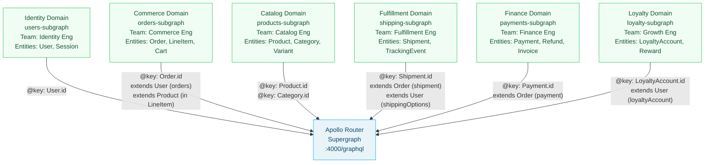

# 05 — Federation Design Patterns

> **Purpose:** Document the production-tested design patterns for structuring Apollo Federation subgraphs in enterprise environments. Covers entity ownership principles, bounded context alignment, shared value type management, schema boundary design, migration from monolith to federation, and multi-team governance. This document is the reference for architecture decisions, not implementation mechanics.

---

## Learning Objectives

- [ ] Apply the entity ownership principle to assign clear field ownership across subgraphs
- [ ] Align subgraph boundaries with Domain-Driven Design bounded contexts
- [ ] Design and maintain shared value types (Money, Address, PageInfo) consistently across subgraphs
- [ ] Execute a strangler-fig migration from a monolith GraphQL schema to federation using `@override`
- [ ] Establish governance rules for cross-subgraph entity changes and `@key` field modifications
- [ ] Identify and refactor common anti-patterns: mega-entities, circular dependencies, leaky boundaries

---

## Overview

Federation mechanics are straightforward once you understand entities and directives. The harder problem is *where to draw subgraph boundaries* and *who owns what*. Poor boundary decisions cause schema sprawl, brittle cross-subgraph dependencies, and coordination overhead that defeats federation's purpose.

Good federation schema design is a specialization of Domain-Driven Design. Subgraphs should align with bounded contexts — cohesive sets of business capabilities owned by one team, with well-defined interfaces at their edges. The schema boundaries between subgraphs are the schema's domain model — they should reflect how the business organizes its domains, not how the database is structured or how services happened to be split.

The patterns in this document come from production e-commerce, fintech, and SaaS systems with 5 to 50+ subgraphs. They are organized from foundational (entity ownership) to advanced (progressive migration and governance).

---

## Architecture: Domain Boundaries in E-Commerce



---

## Pattern 1: Entity Ownership

### The Principle

Each entity has exactly one **owning subgraph** that:
- Defines the entity's `@key` field(s)
- Owns the entity's core identifying and descriptive fields
- Provides the authoritative `__resolveReference` implementation
- Is the source of truth for that entity's data

Other subgraphs may **extend** the entity by adding fields from their own domain. Extending subgraphs hold the `@key` field as `@external` and add only fields they own.

### What "Owning" Means in Practice

| Concern | Owner Responsibility | Extending Subgraph Responsibility |
|---|---|---|
| `@key` field changes | Coordinate with all extending subgraphs | Accept and adapt |
| Core field deprecation | Notify consumers, set timeline | Update client queries |
| `__resolveReference` | Implement authoritatively | Implement only for own added fields |
| Schema governance | Approve changes to own fields | Can add own fields unilaterally |

### E-Commerce Entity Ownership Map

```graphql
# ══════════════════════════════════════════════════════════════
# ENTITY: User — Owned by: Identity Subgraph
# ══════════════════════════════════════════════════════════════

# identity-subgraph/schema.graphql
type User @key(fields: "id") {
  id: ID!
  name: String!
  email: String!
  phone: String
  status: UserStatus!
  tier: CustomerTier!
  createdAt: DateTime!
  updatedAt: DateTime!
  address: Address
  # Identity subgraph owns: who the user IS
}

# commerce-subgraph/schema.graphql — extends User
type User @key(fields: "id") {
  id: ID! @external
  orders(first: Int = 10, after: String): OrderConnection!
  cart: Cart
  orderCount: Int!
  totalSpent: Money!
  # Commerce subgraph owns: what the user BUYS
}

# loyalty-subgraph/schema.graphql — extends User
type User @key(fields: "id") {
  id: ID! @external
  loyaltyAccount: LoyaltyAccount
  rewards: [Reward!]!
  rewardPoints: Int!
  # Loyalty subgraph owns: what the user EARNS
}

# shipping-subgraph/schema.graphql — extends User
type User @key(fields: "id") {
  id: ID! @external
  address: Address @external
  shippingOptions: [ShippingOption!]!
    @requires(fields: "address { city state country postalCode }")
  preferredCarrier: String
  # Shipping subgraph owns: how the user RECEIVES goods
}

# ══════════════════════════════════════════════════════════════
# ENTITY: Order — Owned by: Commerce Subgraph
# ══════════════════════════════════════════════════════════════

# commerce-subgraph/schema.graphql
type Order @key(fields: "id") {
  id: ID!
  status: OrderStatus!
  total: Money!
  subtotal: Money!
  taxAmount: Money!
  placedAt: DateTime!
  customer: User!
  lineItems: [LineItem!]!
  couponCode: String
  # Commerce subgraph owns: the commercial transaction
}

# shipping-subgraph/schema.graphql — extends Order
type Order @key(fields: "id") {
  id: ID! @external
  shipment: Shipment
  trackingEvents: [TrackingEvent!]!
  estimatedDelivery: DateTime
  # Shipping subgraph owns: how the order MOVES
}

# payments-subgraph/schema.graphql — extends Order
type Order @key(fields: "id") {
  id: ID! @external
  payment: Payment
  invoice: Invoice
  refunds: [Refund!]!
  # Payments subgraph owns: how the order is PAID FOR
}
```

### Ownership Boundaries Table

| Entity | Owner | Core Fields | Extending Subgraphs |
|---|---|---|---|
| User | identity | id, name, email, status, tier, address | commerce, loyalty, shipping |
| Order | commerce | id, status, total, lineItems, placedAt | shipping, payments |
| Product | catalog | id, title, description, price, sku, status | inventory, reviews |
| Cart | commerce | id, items, total, expiresAt | promotions |
| Shipment | shipping | id, carrier, trackingNumber, status | — |
| Payment | payments | id, amount, method, status | — |

---

## Pattern 2: Bounded Context Alignment

### DDD Bounded Contexts as Subgraphs

Domain-Driven Design defines a bounded context as a semantic boundary within which a specific domain model applies. A "User" in the Identity bounded context is different from a "Seller" in the Marketplace bounded context, even if they share a database record. Federation subgraphs should map directly to bounded contexts.

**Anti-pattern: Technical layer separation**
```
api-gateway-subgraph   (all client-facing queries)
data-access-subgraph   (all database reads)
mutation-subgraph      (all writes)
```
This splits the functionality of each domain across multiple subgraphs with no business meaning. Teams have no clear ownership — every feature touches all three subgraphs.

**Pattern: Domain-driven separation**
```
identity-subgraph      (users, authentication, authorization)
commerce-subgraph      (orders, carts, promotions)
catalog-subgraph       (products, categories, search)
fulfillment-subgraph   (shipping, tracking, returns)
payments-subgraph      (payments, invoicing, refunds)
```
Each subgraph is a bounded context with clear business ownership and a team that understands the domain end-to-end.

### Recognizing Boundary Violations

Signs that a subgraph boundary is wrong:

**Too many `@requires`:** If a subgraph needs `@requires` on many of its resolvers, it may be missing context that should be part of its own data store. Consider whether the required fields should be denormalized into the subgraph's database.

**Circular entity references:** Subgraph A has an entity that references an entity from Subgraph B, which has an entity that references back to Subgraph A. This creates query plan cycles and indicates an incorrectly placed entity.

**Teams constantly coordinating on the same types:** If two teams frequently negotiate changes to the same entity, the entity's fields may be split between the wrong teams. Consider whether one team should own all those fields.

**Empty subgraphs:** A subgraph with fewer than 5 meaningful types is probably not a bounded context — it's a technical artifact. Merge it into the adjacent domain.

### Applying Context Mapping to Federation

DDD's context map patterns apply directly to federation design:

| DDD Pattern | Federation Equivalent |
|---|---|
| Shared Kernel | Shared value types (`Money`, `Address`) with `@shareable` |
| Customer/Supplier | Owning subgraph (supplier) defines entity; extending subgraph (customer) adds fields |
| Conformist | Extending subgraph accepts the owning subgraph's entity model without negotiation |
| Anti-Corruption Layer | Resolver transforms external data model into the subgraph's domain model |
| Separate Ways | Independent subgraph with no entity references to others |

---

## Pattern 3: Shared Value Types

### The Problem

Value types like `Money`, `Address`, `PageInfo`, `DateRange`, and `Coordinates` appear across multiple subgraphs. If not managed carefully, each subgraph defines its own version — and subtle differences (nullable vs. non-nullable, field names, field count) cause composition failures.

### The Solution: Identical `@shareable` Types

Maintain a shared SDL file in the repository that defines all shared value types. Each subgraph includes this file in its schema. CI validates consistency:

```graphql
# shared/value-types.graphql
# This file is the source of truth for all shared value types.
# Every subgraph that uses these types must include this file verbatim.
# Changes require review from all consuming teams.

type Money @shareable {
  amount: Float!
  currency: String!  # ISO 4217: "USD", "EUR", "GBP"
}

type Address @shareable {
  street: String!
  city: String!
  state: String!    # ISO 3166-2 subdivision code
  country: String!  # ISO 3166-1 alpha-2 country code
  postalCode: String!
}

type PageInfo @shareable {
  hasNextPage: Boolean!
  hasPreviousPage: Boolean!
  startCursor: String
  endCursor: String
}

type DateRange @shareable {
  from: DateTime!
  to: DateTime!
}

type Coordinates @shareable {
  latitude: Float!
  longitude: Float!
}

type Image @shareable {
  url: String!
  width: Int!
  height: Int!
  altText: String
}
```

### CI Consistency Validation

A simple script to verify shared value types are identical across subgraphs:

```bash
#!/bin/bash
# scripts/check-shared-types.sh
# Verifies that shared value types are identical across all subgraphs.

SHARED_TYPES_FILE="shared/value-types.graphql"
SUBGRAPH_DIRS=$(find services -name "schema.graphql" -path "*/graphql/*")

ERRORS=0

for SCHEMA in $SUBGRAPH_DIRS; do
  SUBGRAPH_NAME=$(echo $SCHEMA | cut -d'/' -f2)

  # Extract Money type definition from each subgraph schema
  MONEY_DEF=$(grep -A 5 "type Money" "$SCHEMA" | head -6)
  EXPECTED_MONEY=$(grep -A 5 "type Money" "$SHARED_TYPES_FILE" | head -6)

  if [ "$MONEY_DEF" != "$EXPECTED_MONEY" ]; then
    echo "ERROR: Money type mismatch in $SUBGRAPH_NAME"
    echo "Expected: $EXPECTED_MONEY"
    echo "Got: $MONEY_DEF"
    ERRORS=$((ERRORS + 1))
  fi
done

if [ $ERRORS -gt 0 ]; then
  echo "$ERRORS shared type inconsistencies found. See errors above."
  exit 1
fi

echo "All shared value types are consistent."
```

### When a Value Type Needs to Change

Because shared value types must be identical across subgraphs, changing them requires coordinating all consuming teams. The process:

1. Propose the change in the Schema Governance forum (see Pattern 6)
2. Create a migration timeline — all subgraphs must update simultaneously
3. If backward compatibility is needed, add a new field alongside the old one
4. After all subgraphs are updated, remove the old field

For example, adding a `formatted` field to `Money`:

```graphql
# Phase 1: Add new field (all subgraphs update simultaneously)
type Money @shareable {
  amount: Float!
  currency: String!
  formatted: String!  # e.g., "$49.99" — added in all subgraphs at once
}

# There is no Phase 2 — it's a coordinated atomic update
```

---

## Pattern 4: The Strangler Fig Migration

### Context

The strangler fig pattern describes migrating from a monolith to microservices by gradually routing traffic to new services while the monolith handles the rest. In federation, this pattern uses `@override` to progressively move fields from a monolith subgraph to a new purpose-built subgraph.

### Starting Point: The Monolith Subgraph

```graphql
# monolith-subgraph/schema.graphql
# A single subgraph that owns everything (legacy state)

type Query {
  user(id: ID!): User
  order(id: ID!): Order
  product(id: ID!): Product
}

type User @key(fields: "id") {
  id: ID!
  name: String!
  email: String!
  orders: [Order!]!
  loyaltyPoints: Int!
  shippingOptions: [ShippingOption!]!
}

type Order @key(fields: "id") {
  id: ID!
  status: OrderStatus!
  total: Money!
  lineItems: [LineItem!]!
  shipment: Shipment
  payment: Payment
}

type Product @key(fields: "id") {
  id: ID!
  title: String!
  price: Money!
  inventoryCount: Int!
  reviews: [Review!]!
}

# ... all types in one place
```

### Migration Playbook: Extracting the Commerce Subgraph

**Step 1: Create the new subgraph (no traffic yet)**

```graphql
# commerce-subgraph/schema.graphql
extend schema
  @link(url: "https://specs.apollo.dev/federation/v2.6", import: ["@key", "@override"])

type Query {
  order(id: ID!): Order
}

# All Order fields declared, @override from monolith — 0% traffic initially
type Order @key(fields: "id") {
  id: ID!
  status: OrderStatus!    @override(from: "MonolithSubgraph", label: "percent(0)")
  total: Money!           @override(from: "MonolithSubgraph", label: "percent(0)")
  lineItems: [LineItem!]! @override(from: "MonolithSubgraph", label: "percent(0)")
}
```

Deploy the commerce subgraph. No traffic is affected — `percent(0)` means the monolith still handles 100%.

**Step 2: Begin progressive rollout at 10%**

```graphql
type Order @key(fields: "id") {
  id: ID!
  status: OrderStatus!    @override(from: "MonolithSubgraph", label: "percent(10)")
  total: Money!           @override(from: "MonolithSubgraph", label: "percent(10)")
  lineItems: [LineItem!]! @override(from: "MonolithSubgraph", label: "percent(10)")
}
```

Monitor: compare error rates and latency between the two resolvers. Compare data consistency (spot-check that same order ID returns identical data from both resolvers).

**Step 3: Increment percentage over several deployments**

```
10% → monitor (2 hours)
25% → monitor (4 hours)
50% → monitor (24 hours)
75% → monitor (24 hours)
100% → full cutover
```

**Step 4: Complete cutover — remove `label`**

```graphql
type Order @key(fields: "id") {
  id: ID!
  status: OrderStatus!    @override(from: "MonolithSubgraph")
  total: Money!           @override(from: "MonolithSubgraph")
  lineItems: [LineItem!]! @override(from: "MonolithSubgraph")
}
```

**Step 5: Remove from monolith**

```graphql
# monolith-subgraph/schema.graphql
# Remove Order type (or leave as @inaccessible stub if needed)
# Remove Query.order
```

**Step 6: Remove `@override` — field now owned by commerce**

```graphql
type Order @key(fields: "id") {
  id: ID!
  status: OrderStatus!
  total: Money!
  lineItems: [LineItem!]!
  # No @override — commerce subgraph owns these fields outright
}
```

### Tracking Migration State

Maintain a migration tracking document (not in schema — in your team's project management tool) with the current `percent()` value and target dates for each field migration. Schema archaeology should not be needed to determine "where is this migration?" — that information belongs in a visible tracking system.

---

## Pattern 5: Progressive Schema Splitting

Sometimes you need to split an entity across subgraphs not as part of a monolith migration, but because a domain has grown and one team can no longer own all of its fields.

### Scenario: The Mega-Entity Problem

After two years of development, `type Product` in the Catalog subgraph has 150 fields owned by 8 different teams: Pricing, Inventory, Reviews, Recommendations, SEO, Media, Localization, and A/B Testing. Every team is blocked on every other team's schema changes.

**Solution: Entity ownership split**

```graphql
# ── catalog-subgraph (owns core product identity) ───────────────
type Product @key(fields: "id") {
  id: ID!
  title: String!
  description: String
  sku: String!
  status: ProductStatus!
  category: Category!
  # Only: what a product IS
}

# ── pricing-subgraph (new) ───────────────────────────────────────
type Product @key(fields: "id") {
  id: ID! @external
  basePrice: Money!
  salePrice: Money
  priceRules: [PriceRule!]!
  # Only: what a product COSTS
}

# ── inventory-subgraph (new) ─────────────────────────────────────
type Product @key(fields: "id") {
  id: ID! @external
  inventoryCount: Int!
  backorderAvailable: Boolean!
  warehouseLocations: [WarehouseLocation!]!
  # Only: how many products EXIST
}

# ── reviews-subgraph (new) ───────────────────────────────────────
type Product @key(fields: "id") {
  id: ID! @external
  reviews(first: Int = 20, after: String): ReviewConnection!
  averageRating: Float
  reviewCount: Int!
  # Only: what customers THINK of the product
}

# ── media-subgraph (new) ─────────────────────────────────────────
type Product @key(fields: "id") {
  id: ID! @external
  images(size: ImageSize): [ProductImage!]!
  videos: [ProductVideo!]!
  threeDModel: ModelFile
  # Only: how the product LOOKS
}
```

Each team now deploys their subgraph independently. The `Product` entity composes cleanly because each field is owned by exactly one subgraph.

---

## Pattern 6: Multi-Team Governance

### The Governance Problem

Federation shifts schema coordination from a central team to distributed teams. This is usually an improvement — teams can move faster. But some changes require cross-team coordination:

- **`@key` field changes** affect every subgraph that references the entity
- **Entity type renames** break all `_entities` queries that use `__typename`
- **`@requires` additions** add sequential round-trips to all queries that include those fields
- **Shared value type changes** require simultaneous updates across all consuming subgraphs

Without governance rules, these changes can be deployed unilaterally, breaking consumers without warning.

### Governance Model: Two-Track Schema Changes

**Track 1: Autonomous changes (no approval needed)**

A team can make these changes to their own subgraph without consulting other teams:
- Adding new fields to entities they own
- Adding new types that don't conflict with existing types
- Adding `@deprecated` to fields they own
- Internal resolver changes (same schema, different implementation)
- Marking their own fields `@inaccessible`

**Track 2: Coordinated changes (require cross-team approval)**

| Change Type | Who Must Approve |
|---|---|
| Changing a `@key` field name or type | All subgraphs that reference this entity |
| Removing or renaming a shared value type | All subgraphs that use the type |
| Changing `@requires` fields | The subgraph that owns the required fields |
| Adding `@override` | The subgraph being overridden |
| Changing an entity's primary `@key` | Platform/Architecture team |

### RFC Process for Coordinated Changes

Large schema changes should go through an RFC (Request for Comments) process before implementation:

```markdown
# Schema Change RFC: Rename User.tier to User.membershipLevel

**Author:** Identity Team
**Status:** Draft
**Date:** 2026-05-01
**Target Date:** 2026-06-15

## Summary
Rename `User.tier: CustomerTier!` to `User.membershipLevel: MembershipLevel!`
for clarity. Deprecate the old field for 90 days before removal.

## Impact Analysis
- Commerce subgraph: uses `user.tier` in loyalty discount calculations (0 schema changes)
- Loyalty subgraph: displays `user.tier` in rewards UI (client change needed)
- Shipping subgraph: no usage
- API clients: 3 known clients use `User.tier` (migration needed)

## Migration Plan
1. Add `User.membershipLevel: MembershipLevel!` @shareable alongside `User.tier`
2. Deprecate `User.tier` with `@deprecated(reason: "Use membershipLevel")`
3. Notify clients — 90 day deprecation window
4. Remove `User.tier` after all clients have migrated
5. Clean up `@deprecated` annotations

## Breaking Change Assessment
No breaking change at the schema level — old field kept as deprecated.
Breaking change for clients that ignore deprecation warnings (tracked separately).

## Approvals Required
- [x] Identity Team (author)
- [ ] Commerce Team (Eng Lead: Sam K.)
- [ ] Loyalty Team (Eng Lead: Priya M.)
- [ ] API Gateway Team (for client notification)
```

### `@key` Change Moratorium

Changing an entity's `@key` field is high-risk. Establish a rule: `@key` field changes require:
1. RFC with 2-week comment period
2. Approval from all subgraph teams that reference the entity
3. A migration plan with `@override`-based progressive rollout
4. Canary deployment with rollback plan

Treat `@key` fields like database primary keys — they are contracts between services.

### Tooling for Governance

```bash
# List all subgraphs and their entity references (custom script)
# Useful for impact analysis before making entity changes
node scripts/analyze-entity-references.js --entity User

# Output:
# Entity: User
# Owner: identity-subgraph
# Key fields: id (ID!)
# Referenced by:
#   - commerce-subgraph (adds: orders, cart, orderCount, totalSpent)
#   - loyalty-subgraph  (adds: loyaltyAccount, rewards, rewardPoints)
#   - shipping-subgraph (adds: shippingOptions @requires address, preferredCarrier)
# 
# Impact of @key field change: 3 subgraphs affected
```

---

## Pattern 7: Federation Schema Versioning

### There Is No Supergraph Version

Federation does not have API versioning in the traditional sense. The supergraph is always the latest composition of all subgraphs. There is no "v1" and "v2" of the supergraph running simultaneously.

This is intentional: versioning a GraphQL API typically means running two full stacks, which defeats the efficiency of federation. Instead, federation relies on:

1. **Deprecation** — mark old fields `@deprecated`, give clients a migration window
2. **Inaccessible fields** — hide fields from new clients while old clients still use them
3. **Contract graphs** — expose different schema subsets to different consumers
4. **Breaking change detection** — use `rover subgraph check` to catch removals before they reach production

### Field Lifecycle

```graphql
# Stage 1: New field (available to all clients)
type User @key(fields: "id") {
  id: ID!
  membershipLevel: MembershipLevel!  # new field, stage 1
  tier: CustomerTier! @deprecated(reason: "Use membershipLevel. Removal: 2026-09-01")
}

# Stage 2: Old field deprecated, both available
# (no schema change — deprecation was already in place)

# Stage 3: Old field hidden from public contracts (still in schema for compatibility)
type User @key(fields: "id") {
  id: ID!
  membershipLevel: MembershipLevel!
  tier: CustomerTier!
    @deprecated(reason: "Use membershipLevel. Will be removed 2026-09-01")
    @inaccessible  # hidden from new contract consumers
}

# Stage 4: Remove field entirely after migration window
type User @key(fields: "id") {
  id: ID!
  membershipLevel: MembershipLevel!
  # tier removed — all clients have migrated
}
```

---

## Complete Domain Model Example: E-Commerce Supergraph

The following shows the complete schema for a five-subgraph e-commerce system applying all the patterns above.

### Identity Subgraph (User Entity Owner)

```graphql
extend schema
  @link(
    url: "https://specs.apollo.dev/federation/v2.6"
    import: ["@key", "@shareable", "@inaccessible", "@tag"]
  )

type Query {
  user(id: ID!): User @tag(name: "internal")
  me: User @tag(name: "public")
}

type Mutation {
  updateProfile(input: UpdateProfileInput!): UpdateProfilePayload!
  deactivateAccount: DeactivateAccountPayload!
}

type User @key(fields: "id") @tag(name: "public") {
  id: ID!
  name: String!
  email: String! @tag(name: "pii")
  phone: String @tag(name: "pii")
  status: UserStatus!
  tier: CustomerTier! @deprecated(reason: "Use membershipLevel") @tag(name: "public")
  membershipLevel: MembershipLevel! @tag(name: "public")
  createdAt: DateTime!
  updatedAt: DateTime!
  address: Address @tag(name: "public")
  internalUserId: String! @inaccessible  # legacy internal identifier
}

type Address @shareable @tag(name: "public") {
  street: String!
  city: String!
  state: String!
  country: String!
  postalCode: String!
}

type UpdateProfileInput {
  name: String
  phone: String
  address: AddressInput
}

input AddressInput {
  street: String!
  city: String!
  state: String!
  country: String!
  postalCode: String!
}

type UpdateProfilePayload {
  user: User
  errors: [UserError!]!
}

type DeactivateAccountPayload {
  success: Boolean!
  errors: [UserError!]!
}

type UserError {
  field: String
  message: String!
  code: UserErrorCode!
}

enum UserStatus { ACTIVE SUSPENDED DEACTIVATED }
enum CustomerTier { STANDARD SILVER GOLD PLATINUM }
enum MembershipLevel { BASIC SILVER GOLD PLATINUM ELITE }
enum UserErrorCode { VALIDATION_ERROR PERMISSION_DENIED NOT_FOUND }
scalar DateTime
```

### Commerce Subgraph (Order Entity Owner)

```graphql
extend schema
  @link(
    url: "https://specs.apollo.dev/federation/v2.6"
    import: ["@key", "@external", "@provides", "@shareable", "@tag"]
  )

type Query {
  order(id: ID!): Order @tag(name: "public")
  orders(
    first: Int = 20
    after: String
    filter: OrderFilterInput
  ): OrderConnection! @tag(name: "internal")
}

type Mutation {
  placeOrder(input: PlaceOrderInput!): PlaceOrderPayload!
  cancelOrder(orderId: ID!, reason: String): CancelOrderPayload!
  updateOrderNote(orderId: ID!, note: String!): Order
}

# Entity reference — adds commerce domain to User
type User @key(fields: "id") {
  id: ID! @external
  orders(
    first: Int = 10
    after: String
    status: [OrderStatus!]
  ): OrderConnection! @tag(name: "public")
  cart: Cart @tag(name: "public")
  orderCount: Int! @tag(name: "public")
  totalSpent: Money! @tag(name: "public")
}

# Core entity — owned by commerce
type Order @key(fields: "id") @tag(name: "public") {
  id: ID!
  status: OrderStatus!
  total: Money!
  subtotal: Money!
  taxAmount: Money!
  shippingAmount: Money!
  discountAmount: Money!
  placedAt: DateTime!
  updatedAt: DateTime!
  customer: User! @provides(fields: "name email")
  lineItems: [LineItem!]!
  couponCode: String
  notes: String
}

type LineItem {
  id: ID!
  quantity: Int!
  unitPrice: Money!
  subtotal: Money!
  product: Product!
}

# Entity stub for Product (owned by catalog subgraph)
type Product @key(fields: "id") {
  id: ID! @external
}

type Cart @key(fields: "id") {
  id: ID!
  items: [CartItem!]!
  subtotal: Money!
  expiresAt: DateTime!
}

type CartItem {
  id: ID!
  quantity: Int!
  product: Product!
  unitPrice: Money!
}

type OrderConnection {
  edges: [OrderEdge!]!
  pageInfo: PageInfo!
  totalCount: Int!
}

type OrderEdge { cursor: String! node: Order! }

type Money @shareable { amount: Float! currency: String! }

type PageInfo @shareable {
  hasNextPage: Boolean!
  hasPreviousPage: Boolean!
  startCursor: String
  endCursor: String
}

input OrderFilterInput {
  status: [OrderStatus!]
  placedAfter: DateTime
  placedBefore: DateTime
  minimumTotal: Float
  customerId: ID
}

input PlaceOrderInput {
  cartId: ID!
  shippingAddress: AddressInput!
  paymentMethodId: ID!
  couponCode: String
}

input AddressInput {
  street: String!; city: String!; state: String!; country: String!; postalCode: String!
}

type PlaceOrderPayload { order: Order; errors: [OrderError!]! }
type CancelOrderPayload { order: Order; errors: [OrderError!]! }
type OrderError { field: String; message: String!; code: OrderErrorCode! }

enum OrderStatus { PENDING CONFIRMED PROCESSING SHIPPED DELIVERED CANCELLED REFUNDED }
enum OrderErrorCode { VALIDATION_ERROR PAYMENT_FAILED ITEM_UNAVAILABLE NOT_FOUND PERMISSION_DENIED }
scalar DateTime
```

### Catalog Subgraph (Product Entity Owner)

```graphql
extend schema
  @link(
    url: "https://specs.apollo.dev/federation/v2.6"
    import: ["@key", "@shareable", "@tag"]
  )

type Query {
  product(id: ID!): Product @tag(name: "public")
  products(
    first: Int = 20
    after: String
    filter: ProductFilterInput
    sort: ProductSortInput
  ): ProductConnection! @tag(name: "public")
  category(id: ID!): Category @tag(name: "public")
  categories(parentId: ID): [Category!]! @tag(name: "public")
  searchProducts(query: String!, first: Int = 20): ProductConnection! @tag(name: "public")
}

type Product @key(fields: "id") @tag(name: "public") {
  id: ID!
  title: String!
  description: String
  shortDescription: String
  sku: String!
  slug: String!
  status: ProductStatus!
  category: Category!
  tags: [String!]!
  attributes: [ProductAttribute!]!
  variants: [ProductVariant!]!
  createdAt: DateTime!
  updatedAt: DateTime!
}

type ProductVariant @key(fields: "id") {
  id: ID!
  title: String!
  sku: String!
  attributes: [ProductAttribute!]!
  product: Product!
}

type Category @key(fields: "id") {
  id: ID!
  name: String!
  slug: String!
  description: String
  parentCategory: Category
  childCategories: [Category!]!
  productCount: Int!
}

type ProductAttribute {
  name: String!
  value: String!
}

type Money @shareable { amount: Float! currency: String! }

type PageInfo @shareable {
  hasNextPage: Boolean!; hasPreviousPage: Boolean!; startCursor: String; endCursor: String
}

type ProductConnection { edges: [ProductEdge!]!; pageInfo: PageInfo!; totalCount: Int! }
type ProductEdge { cursor: String!; node: Product! }

input ProductFilterInput {
  categoryId: ID; status: ProductStatus; searchQuery: String; tags: [String!]; priceRange: PriceRangeInput
}

input PriceRangeInput { min: Float; max: Float; currency: String! }
input ProductSortInput { field: ProductSortField!; direction: SortDirection! }

enum ProductStatus { ACTIVE DRAFT ARCHIVED OUT_OF_STOCK }
enum ProductSortField { TITLE CREATED_AT UPDATED_AT PRICE RELEVANCE }
enum SortDirection { ASC DESC }
scalar DateTime
```

---

## Best Practices

1. **One bounded context, one subgraph.** The team that owns the business domain owns the subgraph. Do not split a domain across multiple subgraphs for technical reasons (separate caches, different databases) — federation handles that internally.

2. **Establish `@key` field governance before the first entity is referenced.** Once another subgraph references your entity, changing the `@key` is a breaking change with blast radius proportional to the number of referencing subgraphs. Design `@key` fields to be stable identifiers.

3. **Prefer globally unique IDs for `@key` fields.** UUIDs, nanoids, or application-scoped global IDs (e.g., `gid://platform/Order/12345`) avoid collisions across databases and services. Auto-increment integers leak data volume and may collide across shards.

4. **Keep shared value types in a committed SDL file.** A canonical file (`shared/value-types.graphql`) that every subgraph copies verbatim prevents drift. Automate consistency checking in CI.

5. **Use the RFC process for all coordinated changes.** Any change that affects another team's subgraph requires advance notice and approval. A two-week comment period prevents surprises.

6. **Run `rover subgraph check` before every subgraph deploy.** Catching composition failures before deployment is strictly better than catching them in production. Make it a required CI step.

7. **Deprecate, don't remove.** Field removal is the most common source of breaking changes in federation. Always deprecate first, communicate removal timelines explicitly, and monitor client usage before removing.

8. **Design for the strangler fig.** When building a new subgraph that will eventually absorb fields from an existing one, plan the `@override` migration path from day one. Know what percentage of traffic you'll send to the new subgraph and over what timeline.

---

## Anti-Patterns

**The mega-entity.** A `User` type with 200 fields contributed by 15 teams is not a domain entity — it's a dumping ground. Split it using the entity ownership split pattern. Each team owns their domain's extension of User.

**Schema-as-API-contract without client consideration.** Designing the subgraph schema purely around the database model (exposing `user_id`, `created_at_utc`, `is_active_flag`) forces clients to do data transformation. Schema design should reflect client needs, not database schema.

**Premature federation.** Splitting a 3-person team's single service into 6 subgraphs "for future scale" adds coordination overhead with no benefit. Federation is for when teams are blocked by shared schema ownership — not as a default architecture.

**Cross-subgraph business logic.** Business rules that span multiple subgraphs should live in one subgraph (the domain owner) or in a dedicated service behind a resolver. Do not implement business logic in the router using custom plugins when it belongs in a subgraph resolver.

**Using federation to solve authorization.** Federation is schema composition, not access control. Authorization logic (who can see which fields) belongs in resolver middleware, not in federation directives. `@inaccessible` is for schema migration, not runtime access control.

**The "utilities" subgraph.** A subgraph named `utils`, `common`, or `shared` that contains miscellaneous types from many teams. This recreates the monolith problem inside federation. Every type should belong to a specific domain.

---

## Operational Notes

- When extracting a new subgraph from a monolith, deploy the new subgraph in shadow mode first (receive traffic but discard results) to validate correctness before `@override` rollout.
- Track entity reference counts. A `rover` custom script that counts how many subgraphs reference each entity helps prioritize governance effort on high-impact entities.
- Federation schema design reviews should include engineers from *consuming* subgraphs, not just the owning team. Consuming teams have the best visibility into whether the entity model serves their needs.
- After each `@override` migration completes, verify the old subgraph's field resolver code is removed. Dead code in the old subgraph will confuse future maintainers.
- The Apollo Schema Registry's changelog is a valuable audit trail. Every `rover subgraph publish` is recorded with a diff. Use it to investigate unexpected query plan changes.

---

## References

- [Domain-Driven Design Reference — Eric Evans](https://www.domainlanguage.com/wp-content/uploads/2016/05/DDD_Reference_2015-03.pdf) — foundational DDD concepts including bounded contexts
- [Apollo Federation Best Practices](https://www.apollographql.com/docs/federation/building-supergraphs/best-practices/) — Apollo's official guidance on subgraph design
- [Principled GraphQL — The One Graph Principle](https://principledgraphql.com/integrity#1-one-graph) — architectural principles that underpin federation design

---

## Related Topics

- [01 — Federation Concepts](./01-federation-concepts.md) — entity ownership mechanics and `__resolveReference`
- [02 — Federation Directives](./02-federation-directives.md) — `@override`, `@provides`, `@requires` directive reference
- [03 — Composition](./03-composition.md) — how schema boundaries are validated at composition time
- [04 — Query Planning](./04-query-planning.md) — how subgraph boundary decisions affect query plan efficiency
- [Chapter 09: Schema Governance](../09-schema-governance/README.md) — enterprise-scale schema change coordination processes
- [Chapter 25: Enterprise Patterns](../25-enterprise-patterns/README.md) — broader enterprise GraphQL architectural patterns
