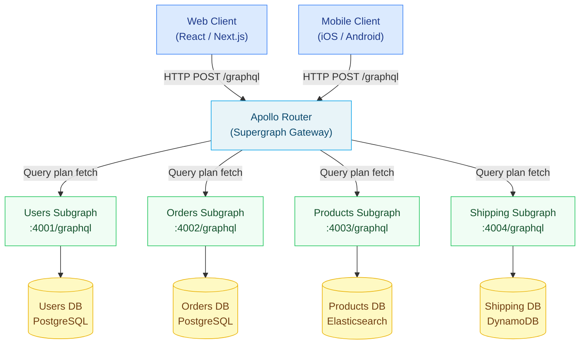

# Chapter 07: Apollo Federation v2

> **Purpose:** This chapter is the authoritative reference for Apollo Federation v2 in enterprise GraphQL deployments. It covers the full federation lifecycle: why federation exists, how subgraphs are designed and composed, how the Apollo Router builds query plans, and the patterns that keep a multi-team supergraph healthy at scale. Engineers building or operating federated GraphQL services should read this chapter before writing their first subgraph.

---

## What Federation Solves

A monolithic GraphQL schema works well for a single team. It fails at scale. When 50 product teams contribute to one `schema.graphql`, every schema change requires coordination across teams, a shared deployment pipeline, and centralized schema ownership that becomes a bottleneck. Teams building the Orders service shouldn't need to wait on the Users team to ship a new field.

Apollo Federation v2 solves this by letting each team own an independent **subgraph** — a standalone GraphQL server that implements the part of the schema their team owns. The **Apollo Router** composes all subgraph schemas into a single **supergraph SDL** at startup, and routes incoming client queries to the correct subgraphs. Clients see one unified GraphQL API. Teams deploy independently.

---

## Federation Architecture



---

## How It Works — Three Sentences

1. Each team runs a subgraph server that exposes a standard GraphQL endpoint plus a `_service` introspection endpoint the router uses to fetch the subgraph's SDL.
2. The Apollo Router (or `rover supergraph compose`) merges all subgraph SDLs through **composition** — validating cross-subgraph consistency and producing a supergraph SDL with an embedded query plan schema.
3. When a client query arrives, the router's **query planner** decomposes it into a tree of subgraph fetches (parallel where possible, sequential when one result depends on another), executes them, and merges the results into a single response.

---

## Prerequisites

Before working through this chapter, ensure you are comfortable with:

- **GraphQL SDL fundamentals** — types, fields, scalars, interfaces, unions, input types. See [Chapter 01: GraphQL Fundamentals](../01-graphql-fundamentals/README.md).
- **Resolver execution** — how a GraphQL server executes a query against resolvers. See [Chapter 04: Resolvers and Execution](../04-resolvers-and-execution/README.md).
- **Schema design principles** — nullable vs. non-nullable, pagination patterns, naming conventions. See [Chapter 03: Schema Design](../03-schema-design/README.md).
- **Basic Docker/Kubernetes** — federation subgraphs are deployed as independent services. See [Chapter 15: Kubernetes Deployment](../15-kubernetes-deployment/README.md).

Tool versions assumed throughout this chapter:

| Tool | Minimum Version |
|---|---|
| Apollo Router | 1.40.0 |
| Rover CLI | 0.23.0 |
| Apollo Federation Spec | 2.6 |
| Node.js (for subgraph examples) | 20 LTS |
| `@apollo/subgraph` npm package | 2.7.0 |

---

## Chapter Contents

| File | Topic |
|---|---|
| [01-federation-concepts.md](./01-federation-concepts.md) | Core concepts: subgraphs, supergraph, entities, `@key`, composition, the `_entities` query |
| [02-federation-directives.md](./02-federation-directives.md) | Every federation directive with working SDL examples and common mistakes |
| [03-composition.md](./03-composition.md) | How composition works, `rover supergraph compose`, CI validation, contract graphs |
| [04-query-planning.md](./04-query-planning.md) | Router query plan mechanics, Fetch/Sequence/Parallel nodes, optimization |
| [05-federation-patterns.md](./05-federation-patterns.md) | Design patterns: entity ownership, bounded contexts, migration, team governance |

---

## Key Terms at a Glance

| Term | Definition |
|---|---|
| **Subgraph** | An independent GraphQL server that owns part of the supergraph schema |
| **Supergraph** | The unified schema produced by composing all subgraph schemas |
| **Entity** | A type with a `@key` directive — it can be referenced and extended across subgraphs |
| **Composition** | The process of merging all subgraph SDLs into a single supergraph SDL |
| **Query Plan** | The router's execution plan: a tree of Fetch, Sequence, and Parallel nodes |
| **Apollo Router** | The Rust-based gateway that routes queries using the supergraph |
| **Rover CLI** | The command-line tool for schema composition, validation, and registry operations |
| **Contract Graph** | A filtered view of the supergraph, limited by `@tag` annotations |

---

## Quick Start: Running the Example Supergraph Locally

```bash
# 1. Install Rover CLI
curl -sSL https://rover.apollo.dev/nix/latest | sh

# 2. Clone the example subgraphs (from this handbook's companion repo)
git clone https://github.com/your-org/graphql-handbook-examples
cd graphql-handbook-examples/07-federation

# 3. Start all four subgraph services
docker compose up -d users-service orders-service products-service shipping-service

# 4. Compose the supergraph locally
rover supergraph compose --config supergraph.yaml --output supergraph.graphql

# 5. Start the Apollo Router
./router --config router.yaml --supergraph supergraph.graphql

# 6. Query the supergraph
curl -X POST http://localhost:4000/graphql \
  -H "Content-Type: application/json" \
  -d '{"query":"{ me { name orders(first:5) { edges { node { id status total { amount currency } } } } } }"}'
```

---

## Related Chapters

- [Chapter 08: Supergraph Architecture](../08-supergraph-architecture/README.md) — broader supergraph design beyond federation mechanics
- [Chapter 09: Schema Governance](../09-schema-governance/README.md) — how teams coordinate schema changes at enterprise scale
- [Chapter 11: CI/CD Automation](../11-ci-cd-automation/README.md) — automating `rover subgraph check` in pull request pipelines
- [Chapter 14: Observability](../14-observability/README.md) — distributed tracing across subgraph fetches
- [Chapter 18: API Gateway vs. Federation](../18-api-gateway-vs-federation/README.md) — when to use federation vs. REST gateway
