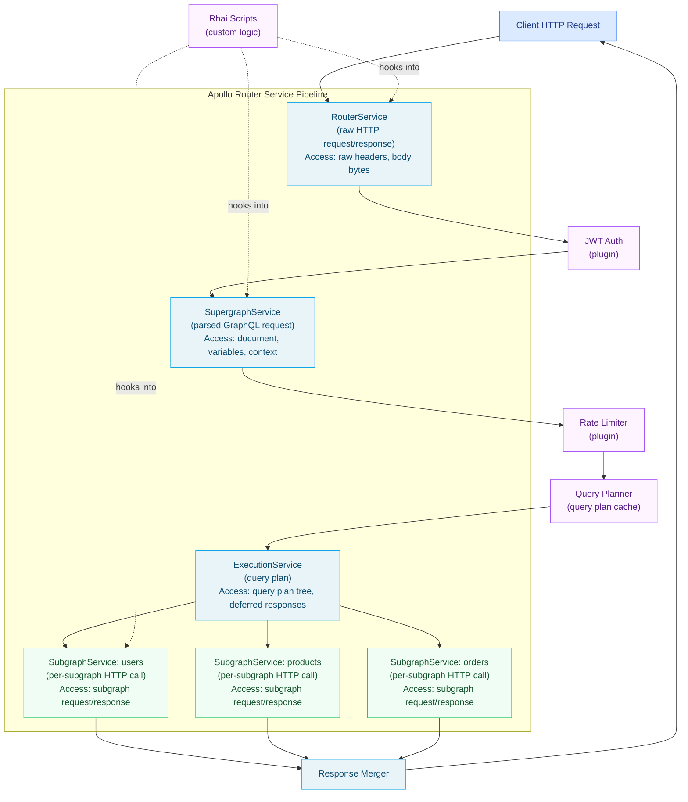

# 01 — Apollo Router: The Supergraph Runtime

> Apollo Router is the production-grade, Rust-based runtime for Apollo Federation v2 supergraphs.
> It receives GraphQL requests from clients, executes a query plan across one or more subgraphs in
> parallel, and merges the results. It handles authentication, rate limiting, header propagation,
> entity caching, and telemetry — all configured through a single `router.yaml` file, with
> extensibility hooks via Rhai scripts and compiled Rust plugins.

---

## Learning Objectives

- [ ] Explain why Apollo Router is implemented in Rust and what operational guarantees that provides
- [ ] Describe the service pipeline model: RouterService → SupergraphService → ExecutionService → SubgraphService
- [ ] Write a complete, annotated `router.yaml` covering auth, traffic shaping, telemetry, and CORS
- [ ] Implement a Rhai script for custom header injection and request logging
- [ ] Configure WASM extensibility and understand when to use Rhai vs. a compiled Rust plugin
- [ ] Set up hot reload from Apollo GraphOS and from a local supergraph file
- [ ] Verify router health using the built-in health check endpoints

---

## Overview and Architecture

### Why Rust?

Apollo Router was rewritten from the JavaScript `@apollo/gateway` into Rust for a single reason:
predictability at scale. The original JavaScript gateway processed hundreds of millions of requests per
day across Apollo's managed fleet, but garbage collection pauses introduced tail latency spikes that were
impossible to eliminate from a Node.js runtime. Rust has no garbage collector. Memory is managed via
ownership and borrow checking at compile time, which means there are no GC pauses, no stop-the-world
events, and no unpredictable latency spikes under memory pressure.

The practical result: Apollo Router handles over 10 billion requests per day across all its managed
deployments, with p99 router-added latency (excluding subgraph time) consistently under 2 milliseconds.
A single router pod with 2 vCPU and 2Gi RAM can sustain approximately 5,000 requests per second at this
latency profile. This means the router is almost never the bottleneck — subgraph response time and
network latency dominate the budget.

### Async I/O and the Tokio Runtime

Apollo Router uses Tokio — Rust's most widely adopted async runtime — for all I/O operations. Tokio
uses an M:N threading model: many async tasks are multiplexed over a small number of OS threads (by
default, one thread per CPU core). This means the router can handle thousands of in-flight requests
simultaneously without spawning thousands of OS threads. The cost of context-switching between async
tasks is measured in nanoseconds rather than microseconds. For a request that must fan out to three
subgraphs in parallel, all three HTTP calls are in-flight concurrently on the same small thread pool,
with near-zero scheduling overhead.

The Tokio runtime also makes Apollo Router's networking layer non-blocking end to end: accepting
connections, reading request bodies, making subgraph HTTP calls, and writing response bodies are all
async and never block OS threads. This produces a flat latency curve under load that is qualitatively
different from the staircase-shaped latency curve of a thread-per-request model under connection
pressure.

### Service Pipeline Architecture

Apollo Router is structured as a pipeline of composable services. Each service in the pipeline wraps
the next, forming an onion model similar to HTTP middleware. Plugins and coprocessors attach to
specific layers of this pipeline, which determines what data they can read and modify.



**RouterService** operates on the raw HTTP layer before GraphQL parsing. This is the correct attachment
point for plugins that need to inspect or modify raw headers, reject requests based on IP allowlists,
or handle non-GraphQL traffic (health checks, metrics endpoints). Modifying the request at this layer
is cheap because no parsing has occurred yet.

**SupergraphService** operates on the parsed GraphQL request: the document AST, variables, and
operation name are available. JWT claims have been validated and placed in the request context. This
is the correct layer for operation-level authorization, persisted query validation, and custom error
shaping based on operation type.

**ExecutionService** operates on the query plan. By the time a plugin reaches this layer, the router
has already determined which subgraphs to call and in what order. Plugins here can observe the plan
(useful for cost-based rate limiting) but cannot change which subgraphs are called.

**SubgraphService** fires once per subgraph call, per request. A single client request that touches
three subgraphs will produce three SubgraphService invocations (potentially concurrent). This is the
correct layer for per-subgraph header injection, response caching, retry logic, and circuit breaking.

---

## Core Concepts

### Query Planning and the Plan Cache

When Apollo Router receives a GraphQL request, the first thing it does is look up the operation in
its query plan cache. The cache key is a normalized form of the GraphQL document (variable values are
not included in the key — only the document structure and operation name). If a cached plan exists,
the router skips the planner entirely and proceeds directly to execution. This is important for
performance: the query planner is computationally expensive for complex federated queries, but the
cache ensures that repeated operation shapes (as seen in a real production API where clients repeat
the same operations with different variables) pay the planning cost only once.

The in-memory plan cache defaults to 512 entries and is tunable via `router.yaml`. For production
deployments with many unique operation shapes, increase this limit. Monitor the cache hit rate via
the `apollo_router_cache_hit_count` and `apollo_router_cache_miss_count` Prometheus metrics. A cache
hit rate below 80% on a mature production system usually indicates a problem with operation
normalization (e.g., clients are sending non-normalized documents with random whitespace or comment
variations).

### Schema Hot Reload

Apollo Router supports hot reload of the supergraph schema without process restart. The reload
mechanism depends on how the router is configured to source its schema:

**From Apollo GraphOS (recommended for production):** The router polls the Apollo Uplink at a
configurable interval (default: 10 seconds). When GraphOS publishes a new schema version (triggered
by a `rover subgraph publish` command), the router downloads the new supergraph SDL, re-runs
composition validation, and atomically swaps the schema in memory. In-flight requests complete
against the old schema; new requests use the new schema. There is no restart, no dropped connections,
and no impact on the query plan cache for operation shapes that remain valid.

**From a local file:** The router watches the supergraph SDL file on disk using OS file-system
notifications. This mode is used in local development and in CI pipelines where the supergraph SDL
is pre-composed and delivered to the router pod via a ConfigMap.

### JWT Authentication

Apollo Router's built-in JWT plugin validates bearer tokens against a JWKS endpoint before the
request reaches any subgraph. The plugin performs standard JWT validation: signature verification,
`exp` claim check, `aud` claim check (optional), and `iss` claim check (optional). On success, the
decoded claims are placed in the request context under a well-known key. Downstream Rhai scripts and
coprocessors can read the claims from context without re-parsing the token.

Subgraphs should not re-validate JWTs. Instead, they should trust forwarded headers (e.g.,
`x-user-id`, `x-user-roles`) that the router injects from the validated JWT claims. This pattern
centralizes auth at the router layer and keeps subgraphs stateless with respect to authentication.

### WASM Extensibility

Apollo Router's plugin API allows extensibility at three levels of increasing complexity:

**Rhai scripts** are embedded scripts written in the Rhai scripting language (a lightweight, statically
typed scripting language designed for embedding in Rust programs). Rhai scripts can be loaded at
startup and hot-reloaded when the file changes. They can hook into every service layer, read and
write request headers and context, and return errors. Rhai is the right choice for lightweight
customization: header manipulation, logging, simple request blocking.

**Compiled Rust plugins** are Rust crates that implement the `Plugin` trait and are compiled into the
router binary. They have access to the full service pipeline and can perform arbitrary async
operations (external service calls, database lookups, etc.). Compiled plugins require maintaining a
custom router build but provide maximum flexibility and zero-overhead extensibility.

**Coprocessors** are external HTTP services that the router calls at configurable pipeline stages. They
are language-agnostic (any HTTP server) and are deployed separately from the router. The router makes
an HTTP call to the coprocessor, waits for the response, and applies any mutations to the request or
response that the coprocessor specifies. Coprocessors are the right choice when the extension logic
already exists in another service, when the team is not comfortable with Rhai or Rust, or when the
extension needs access to resources (databases, other APIs) that are inconvenient to access from
within the router process.

---

## Real-World Implementation

### Complete Annotated router.yaml

The following `router.yaml` is a production-grade configuration for an enterprise supergraph. Each
section is annotated to explain the rationale for each setting.

```yaml
# ============================================================
# Apollo Router — Production Configuration
# ============================================================
# This file is the single source of truth for router behavior.
# It is committed to version control and deployed via ConfigMap
# in Kubernetes. Changes go through the standard PR + deploy
# pipeline. Never apply ad-hoc changes directly to production
# pods.
# ============================================================

supergraph:
  # Bind to all interfaces inside the pod; the Kubernetes
  # Service or Ingress handles external exposure.
  listen: 0.0.0.0:4000

  # Disable introspection in production. Clients should use
  # the Apollo Studio Explorer or a local copy of the schema
  # for development. Exposing introspection in production
  # leaks schema structure to potential attackers.
  introspection: false

  # Query plan cache: 512 entries is sufficient for APIs with
  # up to ~300 unique operation shapes in regular use.
  # Each plan entry is typically 50-200KB in memory.
  # 512 entries × 200KB ≈ 100MB maximum cache footprint.
  query_planning:
    cache:
      in_memory:
        limit: 512
    # Warn (but do not reject) queries that produce a plan
    # estimated to require more than 100 resolver calls.
    # This catches accidentally expensive operations early.
    experimental_plans_limit: 100

# Pin the federation composition version. Never use a floating
# version in production; pin to a specific release to prevent
# unexpected behavior changes when Apollo ships updates.
federation_version: =2.9.0

# ============================================================
# Authentication
# ============================================================
authentication:
  router:
    jwt:
      jwks:
        # Primary JWKS endpoint for your identity provider.
        # The router caches the JWKS and refreshes it every
        # 5 minutes (configurable via cache_poll_interval).
        - url: "https://auth.example.com/.well-known/jwks.json"
          issuer: "https://auth.example.com/"
          audiences:
            - "https://api.example.com"
          algorithms:
            - RS256
            - ES256
        # Secondary JWKS for partner tokens (machine-to-machine).
        # Partner tokens use a different issuer and a restricted
        # audience.
        - url: "https://partner-auth.example.com/.well-known/jwks.json"
          issuer: "https://partner-auth.example.com/"
          audiences:
            - "https://partner-api.example.com"

# ============================================================
# Traffic Shaping
# ============================================================
traffic_shaping:
  router:
    # Global rate limit applied to all requests at the router
    # level, before routing to any subgraph. This protects
    # the entire supergraph from request floods.
    # 2000 req/s per router replica × 3 replicas = 6000 req/s
    # effective cluster limit (when using a round-robin LB).
    global_rate_limit:
      capacity: 2000
      interval: 1s

  all:
    # Collapse identical in-flight GraphQL queries into a
    # single upstream call. This is especially valuable for
    # high-traffic read endpoints (product listings, catalog
    # browsing) where many concurrent clients may send the
    # same query at the same time.
    deduplicate_query: true

    # Enable gzip compression for subgraph responses. This
    # reduces bandwidth between the router and subgraphs
    # when responses contain large JSON payloads.
    compression: gzip

    # Global subgraph timeout. Subgraph calls that do not
    # complete within 30 seconds are cancelled and the
    # router returns an error for the affected fields.
    timeout: 30s

# ============================================================
# Header Propagation
# ============================================================
headers:
  all:
    request:
      # Remove any x-user-id header that came from the client.
      # This prevents clients from spoofing their identity.
      - remove:
          named: x-user-id
      # Inject the authenticated user's subject claim as a
      # forwarded header. Subgraphs trust this header because
      # the router strips any client-supplied version of it
      # above, and the router validates the JWT before reaching
      # this point.
      - insert:
          name: x-user-id
          value: "{jwt.claims.sub}"
      # Propagate the request ID for distributed tracing
      # correlation. Generate a UUID if the client did not
      # supply one.
      - propagate:
          named: x-request-id
          default: "{$uuid}"
      # Remove the Authorization header before forwarding to
      # subgraphs. Subgraphs receive the decoded x-user-id
      # instead. Do NOT forward raw JWTs to subgraphs —
      # they should not re-validate tokens.
      - remove:
          named: authorization

# ============================================================
# Entity Caching (Redis)
# ============================================================
# Entity caching stores the result of @key-based entity
# resolution in Redis, keyed by the entity type and key
# field values. On a cache hit, the router skips the
# subgraph call entirely.
entity_cache:
  enabled: true
  redis:
    urls:
      - "redis://redis-cache-primary:6379"
      - "redis://redis-cache-replica:6379"
    ttl: 300s
    # Use TLS for Redis connections in production.
    tls:
      certificate_authorities: /certs/redis-ca.pem
  subgraphs:
    products:
      # Products change infrequently. Cache for 1 hour.
      ttl: 3600s
    users:
      # User profiles change moderately. Cache for 5 minutes.
      ttl: 300s
    orders:
      # Orders are transactional. Never cache.
      ttl: 0s
    inventory:
      # Inventory levels change frequently. Cache for 30 seconds.
      ttl: 30s

# ============================================================
# Telemetry
# ============================================================
telemetry:
  # Service name appears in all traces and metrics.
  service_name: "apollo-router"
  service_version: "${ROUTER_VERSION}"

  exporters:
    tracing:
      # Export traces to an OpenTelemetry Collector via gRPC.
      # The Collector is responsible for forwarding to your
      # APM backend (Jaeger, Tempo, Datadog, etc.).
      otlp:
        endpoint: "http://otel-collector.observability.svc:4317"
        protocol: grpc
        grpc:
          # Export up to 1000 spans per batch to reduce
          # the number of network round trips.
          batch_processor:
            max_export_batch_size: 1000
            max_queue_size: 8192
            scheduled_delay: 5s

    metrics:
      # Export metrics to Prometheus via a dedicated scrape
      # endpoint. Your cluster's Prometheus instance scrapes
      # this endpoint on its normal interval (30s default).
      prometheus:
        enabled: true
        listen: 0.0.0.0:9090
        path: /metrics

  # Instrument individual GraphQL operations.
  instrumentation:
    spans:
      router:
        # Add these attributes to every router span.
        attributes:
          http.request.header.x-request-id:
            request_header: x-request-id
          http.response.header.content-type:
            response_header: content-type
      supergraph:
        attributes:
          graphql.document: true
          graphql.operation.name: true
          graphql.operation.type: true
      subgraph:
        attributes:
          subgraph.name: true
          subgraph.graphql.document: true

# ============================================================
# CORS
# ============================================================
cors:
  # Restrict origins to known application domains.
  # Never use '*' in production for an authenticated API.
  origins:
    - "https://app.example.com"
    - "https://admin.example.com"
    - "https://partner-portal.example.com"
  allow_credentials: true
  methods:
    - GET
    - POST
    - OPTIONS
  headers:
    - content-type
    - authorization
    - x-request-id
    - x-apollo-operation-name
    - apollographql-client-name
    - apollographql-client-version

# ============================================================
# Coprocessor
# ============================================================
# The coprocessor is an external HTTP service that the router
# calls at specific pipeline stages. Here it is called on
# every inbound router request (before JWT auth) to enforce
# IP allowlists and log audit events.
coprocessor:
  url: "http://auth-coprocessor.gateway.svc:8080"
  timeout: 500ms
  router:
    request:
      headers: true
      body: false  # Do not send body to coprocessor; saves bandwidth
      context: true
      sdl: false

# ============================================================
# Health Checks
# ============================================================
health_check:
  # The health check endpoint is served on the main port.
  # Kubernetes liveness and readiness probes use this.
  listen: 0.0.0.0:8088
  path: /health
  # Report live=true only when the supergraph schema has been
  # loaded. This prevents the router from receiving traffic
  # before it is ready to serve queries.
  enabled: true

# ============================================================
# Sandbox (Development Only)
# ============================================================
# Disable the Apollo Sandbox in production. It is enabled
# by default in development mode.
sandbox:
  enabled: false

# ============================================================
# Persisted Queries
# ============================================================
# Persisted queries restrict the router to only execute
# pre-approved operation shapes. This is a defense-in-depth
# measure that prevents arbitrary query injection.
persisted_queries:
  enabled: true
  safelist:
    enabled: true
    require_id: true
  log_unknown: true
```

### Rhai Script: Custom Header Injection and Request Logging

Rhai scripts are stored in the `rhai` directory and loaded by the router at startup. The following
script performs two common operations: injecting a correlation ID header if one is not present, and
logging a structured audit event for all mutation operations.

```rhai
// rhai/request-enrichment.rhai
//
// This script runs at the SupergraphService request stage.
// At this point:
//   - JWT claims are available in context
//   - The GraphQL document has been parsed
//   - Variables are available
//
// Purpose:
//   1. Ensure every request has a correlation ID
//   2. Log mutation operations for audit purposes
//   3. Inject tenant ID from JWT claims

fn supergraph_service(service) {
    // Register a callback on the request stage.
    // `request` is a mutable object representing the
    // current GraphQL request.
    let request_callback = |request| {
        // ------------------------------------------------
        // 1. Correlation ID injection
        // ------------------------------------------------
        // If the client did not supply a correlation ID,
        // generate one and attach it. This ID will be
        // propagated to all subgraph calls and included
        // in every trace span.
        let correlation_id = request.headers["x-correlation-id"];
        if correlation_id == () {
            // Generate a pseudo-random ID. In production Rhai,
            // use the router's built-in UUID generation.
            let new_id = `router-${Date()}`;
            request.headers["x-correlation-id"] = new_id;
            request.context["correlation_id"] = new_id;
        } else {
            request.context["correlation_id"] = correlation_id;
        }

        // ------------------------------------------------
        // 2. Tenant ID injection from JWT
        // ------------------------------------------------
        // The JWT plugin has already validated the token and
        // placed the decoded claims in context. Extract the
        // tenant_id claim and inject it as a forwarded header
        // so subgraphs can scope their queries.
        let claims = request.context["apollo_authentication::JWT::claims"];
        if claims != () {
            let tenant_id = claims["tenant_id"];
            if tenant_id != () {
                request.headers["x-tenant-id"] = tenant_id;
                request.context["tenant_id"] = tenant_id;
            }
        }

        // ------------------------------------------------
        // 3. Mutation audit logging
        // ------------------------------------------------
        // Parse the operation type from the GraphQL document.
        // If this is a mutation, emit a structured log entry
        // for compliance purposes.
        let operation_name = request.graphql.operation_name;
        let body = request.graphql.body;

        // Detect mutations by looking for the `mutation` keyword
        // at the start of the operation. This is a simple check;
        // a full implementation would inspect the AST.
        if body.contains("mutation") {
            let user_id = "";
            if claims != () {
                user_id = claims["sub"];
            }
            // Emit a structured log entry.
            // The router's Rust logging layer will format this
            // as JSON when the log format is set to "json".
            log_info(`AUDIT mutation=${operation_name} user=${user_id} tenant=${request.context["tenant_id"]}`);
        }
    };

    service.map_request(request_callback);
}

fn subgraph_service(service, subgraph_name) {
    // This function is called once per subgraph service
    // registration. Use `subgraph_name` to apply
    // subgraph-specific logic.
    let request_callback = |request| {
        // Propagate the correlation ID to every subgraph call.
        // This ensures the correlation ID appears in subgraph
        // traces and logs, enabling end-to-end request tracing.
        let correlation_id = request.context["correlation_id"];
        if correlation_id != () {
            request.headers["x-correlation-id"] = correlation_id;
        }

        // For the payments subgraph only: add an HMAC signature
        // header so the payments service can verify that the
        // request originated from the trusted router.
        // In production, the HMAC key is injected via an
        // environment variable, not hardcoded.
        if subgraph_name == "payments" {
            // Placeholder: in real Rhai, you would compute HMAC
            // using the router's built-in crypto functions.
            request.headers["x-router-signature"] = "hmac-placeholder";
        }
    };

    service.map_request(request_callback);
}
```

To load this script, add the following to `router.yaml`:

```yaml
rhai:
  scripts: ./rhai
  main: request-enrichment.rhai
```

### Helm Values for Kubernetes Deployment

Apollo Router ships an official Helm chart (`oci://ghcr.io/apollographql/helm-charts/router`). The
following `values.yaml` configures the router for a production cluster with 3 replicas, resource
limits, config from a ConfigMap, and environment variable injection from Secrets.

```yaml
# helm/router/values.yaml

replicaCount: 3

image:
  repository: ghcr.io/apollographql/router
  # Pin to a specific release. Never use `latest` in production.
  tag: "v1.52.0"
  pullPolicy: IfNotPresent

router:
  args:
    - --config
    - /etc/router/router.yaml
    - --supergraph
    - /etc/router/supergraph.graphql
  configuration:
    # The router.yaml content is mounted from a ConfigMap.
    # Use Helm's `--set-file` or a Kustomize overlay to
    # inject environment-specific values.
    existingConfigMap: apollo-router-config

extraEnvVars:
  # Apollo Uplink credentials for schema hot reload from GraphOS.
  - name: APOLLO_KEY
    valueFrom:
      secretKeyRef:
        name: apollo-router-secrets
        key: apollo-key
  - name: APOLLO_GRAPH_REF
    valueFrom:
      secretKeyRef:
        name: apollo-router-secrets
        key: apollo-graph-ref
  # Router version injected into telemetry spans.
  - name: ROUTER_VERSION
    value: "1.52.0"

resources:
  requests:
    cpu: "500m"
    memory: "512Mi"
  limits:
    cpu: "2000m"
    memory: "2Gi"

livenessProbe:
  httpGet:
    path: /health
    port: 8088
  initialDelaySeconds: 10
  periodSeconds: 10
  failureThreshold: 3

readinessProbe:
  httpGet:
    path: /health
    port: 8088
  initialDelaySeconds: 5
  periodSeconds: 5
  failureThreshold: 2

service:
  type: ClusterIP
  port: 4000

serviceMonitor:
  # Enable if using Prometheus Operator.
  enabled: true
  interval: 30s
  path: /metrics
  port: 9090
```

---

## Production Considerations

### Performance

**Query plan cache warm-up.** On a fresh router pod start (after a deployment rollout or node failure),
the query plan cache is empty. The first execution of each unique operation shape must run through the
query planner, which is 5-20x slower than a cache hit for complex federated queries. During a
deployment rollout with traffic being shifted to new pods, this causes a transient spike in p99
latency. Mitigate this by: (1) using a slow rollout strategy (maxSurge: 1, maxUnavailable: 0) so
new pods receive traffic gradually while old pods handle the majority; (2) sending synthetic traffic
to new pods before they enter the load balancer rotation (a pre-warm init container or a readiness
probe that delays ready=true until a warm-up script completes).

**Compression cost.** Enabling `compression: gzip` on subgraph responses reduces bandwidth but adds
CPU cost at both ends of the subgraph connection. For subgraphs co-located in the same Kubernetes
cluster (intra-cluster traffic), the bandwidth savings rarely justify the CPU cost. Enable compression
only for inter-datacenter subgraph calls or when subgraph responses are large (>10KB per response).

**Connection pooling.** Apollo Router maintains an HTTP/1.1 or HTTP/2 connection pool to each subgraph.
For HTTP/2 subgraphs, a single connection can multiplex many concurrent requests, which is ideal for
the router's fan-out pattern. Configure subgraphs to accept HTTP/2 (h2c for plain text, h2 for TLS).

### Security

**Never forward raw JWTs to subgraphs.** The router should strip the `Authorization` header and
replace it with decoded, verified claims (e.g., `x-user-id`, `x-user-roles`). Subgraphs that receive
raw JWTs are tempted to re-validate them, which duplicates the validation logic and creates a surface
for desync bugs when the JWT algorithm or JWKS rotates.

**Use persisted queries in production.** The persisted query safelist prevents clients from executing
arbitrary operations against your production supergraph. Combined with introspection disabled, this
makes it substantially harder for an attacker to explore your schema and craft targeted queries.

**Rotate Apollo API keys regularly.** The `APOLLO_KEY` environment variable is a long-lived credential
that authorizes the router to download schema updates from Apollo GraphOS. Treat it as a service
account credential: store it in a secrets manager (AWS Secrets Manager, HashiCorp Vault), rotate it
quarterly, and audit access to it.

### Scaling

Apollo Router scales horizontally without any coordination between replicas. Each replica maintains
its own in-memory query plan cache; there is no shared state between replicas. This means scaling up
adds capacity immediately (no warm-up coordination required between replicas), but the aggregate cache
warm-up time per request shape scales as O(replicas) during a fresh deployment. Use the Horizontal Pod
Autoscaler keyed on CPU utilization (target: 60%) or on a custom metric from the Prometheus query
`rate(apollo_router_http_requests_total[1m])`.

### Observability

Apollo Router emits the following metrics categories to Prometheus:

- `apollo_router_http_requests_total` — counter, labeled by `status`, `method`, `path`
- `apollo_router_http_request_duration_seconds` — histogram, labeled by `status`
- `apollo_router_cache_hit_count` / `apollo_router_cache_miss_count` — query plan cache hit rate
- `apollo_router_subgraph_requests_total` — counter per subgraph, labeled by `subgraph_name`, `status`
- `apollo_router_subgraph_request_duration_seconds` — histogram per subgraph
- `apollo_router_timeout_count` — timeout counter per subgraph
- `apollo_router_entity_cache_hit_count` — entity cache effectiveness

Create Grafana dashboards for: overall request rate and error rate, p50/p95/p99 latency, per-subgraph
latency and error rates, cache hit rates, and timeout counts. Alert on: error rate >1% (warning),
>5% (critical); p99 latency >2s; cache hit rate <70% for 10+ minutes.

---

## Best Practices

1. **Pin the federation version in router.yaml.** Using `federation_version: =2.9.0` (with the
   equals prefix) pins to an exact version. Never use a floating version like `=2` or omit the
   field entirely. Federation version upgrades are breaking changes in composition behavior and
   must be tested explicitly.

2. **Disable introspection in production.** Introspection reveals the full schema structure,
   including deprecated fields, internal types, and argument names that can be used to craft
   targeted attacks. Provide schema access through Apollo Studio or a managed schema registry
   instead.

3. **Use persisted queries for all production clients.** Clients should register their operations
   at build time. At runtime, they send only the operation ID. This eliminates the query parsing
   attack surface and allows the router to reject any unregistered operation shape.

4. **Strip the Authorization header before subgraph forwarding.** Subgraphs should receive
   trusted, decoded identity headers (x-user-id, x-user-roles, x-tenant-id) that the router
   injects from validated JWT claims. Never forward raw tokens to subgraphs.

5. **Set explicit timeouts for every subgraph.** The global `timeout: 30s` under `all` is a
   safe default, but some subgraphs (payments, identity) should have shorter timeouts. A slow
   payments subgraph should fail fast (5-10s) rather than holding a router goroutine for 30s
   and blocking other requests.

6. **Use the Prometheus metrics endpoint for SLO tracking.** Define your GraphQL SLOs in terms
   of router-measured latency (not client-measured latency, which includes network). The router's
   histogram buckets give you accurate p95 and p99 latency values per operation type.

7. **Test Rhai scripts in a local development environment.** Rhai is evaluated at request time.
   A Rhai script with a runtime error will cause requests to fail. Use the router's local
   development mode (`--dev` flag) to test scripts before deploying. Write unit tests for
   complex Rhai logic using the `rhai` crate's test harness.

8. **Monitor schema propagation lag.** The router polls GraphOS every 10 seconds. After a
   `rover subgraph publish`, there is up to a 10-second window where the router serves the
   old schema. During this window, if the new subgraph deployment has already received traffic,
   the router may send queries that reference fields the old subgraph does not understand.
   Use a blue-green deployment strategy for subgraph schema changes that remove fields.

---

## Anti-Patterns

**Running a single router replica in production.** A single router pod is a single point of
failure. Apollo Router pod restarts are fast (typically <5 seconds to load schema and be ready),
but during that window all traffic to your supergraph fails. Always run a minimum of 3 replicas
spread across availability zones.

**Forwarding all headers to all subgraphs.** Using a wildcard header propagation rule (`propagate: *`)
sends every client header, including potentially sensitive ones, to every subgraph. Be explicit
about which headers each subgraph should receive. Sensitive headers (Authorization, Cookie,
x-forwarded-for) should be stripped, not forwarded.

**Using router.yaml to store secrets.** `router.yaml` is committed to version control. API keys,
HMAC secrets, Redis passwords, and TLS private key paths should be injected as environment
variables or mounted as Kubernetes Secrets, never hardcoded in the config file. Use `${VARIABLE_NAME}`
syntax in router.yaml to reference environment variables.

**Ignoring the query plan cache miss rate.** A sustained high miss rate (>30%) means the planner
is running for most requests. On a complex supergraph with many federated entities, query
planning can take 10-50ms per unique operation. This is invisible in small-scale testing (where
the same operations repeat and fill the cache quickly) but becomes a significant latency source
at scale when many unique operation shapes are in flight simultaneously.

**Setting entity cache TTLs uniformly.** Different entity types have radically different mutation
rates. Caching orders (which are mutated frequently) for the same TTL as products (which change
rarely) either results in stale order data being served to users or wastes Redis memory on
aggressively short product cache entries. Set per-subgraph TTLs based on the actual mutation
rate of the entities that subgraph owns.

---

## Operational Notes

- Apollo Router logs are structured JSON when the `--log json` flag is passed. In production,
  always use JSON log format so log aggregators (Loki, Elasticsearch, Splunk) can parse fields
  without grok rules.
- The `/.well-known/apollo/server-health` endpoint returns HTTP 200 `{"status":"pass"}` when
  the router is healthy. The `/health` endpoint (configurable path) is the recommended Kubernetes
  probe target.
- Apollo Router ships with a built-in Apollo Studio Explorer at the `/_sandbox` path when
  `sandbox.enabled: true`. Disable this in production; enable only in development and staging.
- The Tokio async runtime thread count defaults to the number of logical CPU cores. For a pod
  with a 2-CPU limit, the router will use 2 Tokio worker threads. Increase the CPU limit if
  you need more parallelism; do not attempt to tune the Tokio thread count directly.
- Environment variable expansion in `router.yaml` uses `${VAR_NAME}` syntax. Variables that are
  not set will cause the router to fail at startup with a clear error message.

---

## References

1. [Apollo Router Documentation](https://www.apollographql.com/docs/router/) — official configuration
   reference, plugin API, and deployment guides
2. [Apollo Router GitHub Repository](https://github.com/apollographql/router) — source code, issue
   tracker, and release notes (Apache 2.0 license)
3. [Rhai Scripting Language Book](https://rhai.rs/book/) — complete Rhai language reference for
   writing router scripts
4. [OpenTelemetry Semantic Conventions for GraphQL](https://opentelemetry.io/docs/specs/semconv/graphql/) —
   standard attribute names for GraphQL spans and metrics

---

## Related Topics

- [02 — Router Configuration](./02-router-configuration.md) — deep-dive into traffic shaping, entity caching, coprocessors
- [04 — Router at Scale](./04-router-at-scale.md) — HA deployment, multi-region, cost analysis
- Chapter 07 — Federation — subgraph authoring prerequisites
- Chapter 14 — Observability — full OpenTelemetry pipeline configuration
- Chapter 15 — Kubernetes Deployment — HPA configuration, resource sizing
