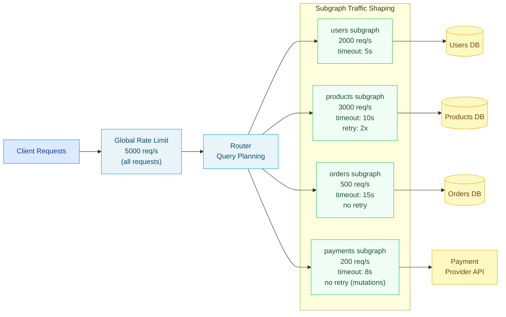

# 02 — Router Configuration: Traffic Shaping, Entity Caching, and Coprocessors

> Apollo Router configuration is a single `router.yaml` file that controls every behavioral dimension
> of the supergraph runtime: how traffic is shaped and rate-limited (globally and per-subgraph), how
> entity resolution results are cached in Redis, how coprocessors extend the request pipeline with
> external logic, how subgraph connections are secured with mTLS, and how the development sandbox
> is exposed for engineers. This document provides a complete reference with annotated examples for
> each configuration domain.

---

## Learning Objectives

- [ ] Configure per-subgraph traffic shaping with different rate limits, timeouts, and retry policies
- [ ] Implement entity caching in Redis with per-entity-type TTLs and cache invalidation strategy
- [ ] Understand request deduplication and when it reduces subgraph load vs. when it causes issues
- [ ] Build a coprocessor service and wire it into the router pipeline at the correct stage
- [ ] Configure mTLS for encrypted, mutually authenticated connections to subgraphs
- [ ] Override header propagation rules per subgraph rather than applying them globally
- [ ] Expose and secure the Apollo Sandbox for development and staging environments

---

## Overview and Architecture

### Configuration as the Control Plane

Apollo Router's `router.yaml` is the control plane for the supergraph runtime. Unlike a code-based
gateway (such as `@apollo/gateway`) where behavioral customization requires writing and deploying
JavaScript, the router configuration file is declarative: you specify what behavior you want and the
router enforces it. This separation of configuration from code is a deliberate design choice. It
means operations engineers can tune traffic shaping, timeouts, and caching without touching the
application code that defines subgraph schemas.

In practice, `router.yaml` is versioned in the same git repository as the Kubernetes manifests that
deploy the router. Changes go through a pull request, CI validation (using the router binary's
`--validate-config` flag), and a deployment pipeline. Environment-specific values (API keys,
Redis URLs, subgraph URLs) are injected via environment variables referenced from the config file
using `${VAR_NAME}` syntax. The committed config file never contains secrets.

The router watches for changes to `router.yaml` and reloads the configuration without restart when
the file changes on disk. This allows operators to adjust rate limits, timeouts, and CORS origins
without downtime. Note that not all configuration keys support hot reload — the documentation for
each key indicates whether it requires a restart.

### The Traffic Shaping Model

Apollo Router's traffic shaping operates at two levels. The first level is the **router global**
rate limit, which applies to all incoming requests before any routing decision is made. This is the
outer defense against traffic floods. The second level is **per-subgraph** rate limits and timeout
policies, which apply independently to each subgraph connection. This two-level model allows you to
express policies like: "the supergraph as a whole handles 5,000 req/s, but the orders subgraph,
which hits a legacy database, is limited to 500 req/s of entity resolution calls."



---

## Core Concepts

### Request Deduplication

When `deduplicate_query: true` is enabled globally or for a specific subgraph, the router tracks
all in-flight GraphQL requests and collapses identical concurrent requests into a single upstream
call. Two requests are considered identical if they have the same normalized GraphQL document and
the same variables. The first request proceeds to the subgraph; subsequent identical requests wait
for the first request's response and then receive the same result.

This is most valuable for high-traffic read endpoints. Consider a product listing page that many
users visit simultaneously: hundreds of concurrent requests for `{ products { id name price } }` can
be collapsed into a single subgraph call. The subgraph sees one request instead of hundreds; the
router serves all clients from that single response.

There are two important caveats. First, deduplication only works for queries — mutations are always
sent individually to their subgraph. Second, deduplication is inappropriate when the response
should differ based on user identity (e.g., personalized queries where the subgraph uses the
`x-user-id` header to filter results). In those cases, identical documents would be collapsed even
though different users should get different results. Disable deduplication per-subgraph for any
subgraph that returns user-specific data driven by forwarded headers rather than query variables.

### Entity Caching Mechanics

Entity caching works at the Federation entity resolution layer. When the query plan calls the
`_entities` resolver on a subgraph (to resolve entity references returned by another subgraph),
the router checks Redis for a cached response keyed by `{entity_type}:{key_field_values}`. On a
cache hit, the subgraph call is skipped entirely. On a cache miss, the subgraph call is made and
the result is stored in Redis before being returned to the router.

The cache key format is deterministic and based on the entity's `@key` fields. For an entity
declared as:

```graphql
type Product @key(fields: "id") {
  id: ID!
  name: String!
  price: Float!
}
```

The cache key for product with `id: "prod-123"` would be:
`entity_cache:products:Product:{"id":"prod-123"}`

For composite keys:

```graphql
type OrderItem @key(fields: "orderId itemId") {
  orderId: ID!
  itemId: ID!
  quantity: Int!
}
```

The key would be:
`entity_cache:orders:OrderItem:{"orderId":"ord-456","itemId":"item-789"}`

### Coprocessor Architecture

Coprocessors are external HTTP services that Apollo Router calls at specific stages of the request
pipeline. The router sends a JSON payload describing the current request state; the coprocessor
responds with instructions to modify the request, block it entirely, or allow it through unchanged.

The coprocessor integration is synchronous from the router's perspective: the router waits for the
coprocessor response before proceeding. This means coprocessor latency directly adds to the overall
request latency. A coprocessor that takes 50ms to respond adds 50ms to every request that triggers
it. Design coprocessors to be fast (target <20ms p99) and to have low tail latency. Use the
coprocessor's `timeout` configuration in `router.yaml` to circuit-break coprocessors that are slow.

Coprocessors are called at four possible stages:

- **RouterRequest**: before JWT validation, before GraphQL parsing. Receives raw HTTP headers.
  Use for IP allowlisting, WAF-style request blocking, and pre-auth audit logging.
- **RouterResponse**: after the full response is assembled. Receives response headers and body.
  Use for response transformation, response header injection, and post-request audit logging.
- **SubgraphRequest**: before each subgraph call. Receives the subgraph-specific GraphQL request.
  Use for per-subgraph authorization (if the subgraph has its own permission model), request
  signing (HMAC headers), and request enrichment.
- **SubgraphResponse**: after each subgraph response is received. Receives the subgraph response
  body. Use for response validation, error transformation, and subgraph response caching.

### mTLS for Subgraph Connections

In a zero-trust network model, the router should authenticate itself to each subgraph using mutual
TLS (mTLS). The subgraph presents a server certificate; the router presents a client certificate.
Each subgraph verifies that the client certificate was issued by a trusted internal CA (not the
public internet CA hierarchy). This prevents non-router services from calling subgraph endpoints
directly, even within the cluster.

The mTLS configuration in `router.yaml` specifies the client certificate and key for the router,
and the CA certificate bundle for verifying subgraph server certificates. Different subgraphs can
require different client certificates if they are owned by different teams with different trust roots.

---

## Real-World Implementation

### Complete Traffic Shaping Configuration

```yaml
# ============================================================
# Traffic Shaping — Complete Production Configuration
# ============================================================
# Reference: https://www.apollographql.com/docs/router/configuration/traffic-shaping/
#
# Traffic shaping is applied in this order:
#   1. Global router rate limit (blocks traffic before routing)
#   2. Per-subgraph rate limit (blocks specific subgraph calls)
#   3. Per-subgraph timeout (cancels slow subgraph calls)
#   4. Per-subgraph retry (retries failed calls within the TTL)

traffic_shaping:
  router:
    # --------------------------------------------------------
    # Global Rate Limit
    # --------------------------------------------------------
    # This limit applies to all requests arriving at the router,
    # across all clients and all operation types. It is the
    # first line of defense against traffic floods and DDoS.
    #
    # Capacity: 5000 requests per 1-second window.
    # When exceeded, the router returns HTTP 429.
    # Algorithm: token bucket (allows short bursts above the
    # average rate as long as tokens are available).
    global_rate_limit:
      capacity: 5000
      interval: 1s

  all:
    # --------------------------------------------------------
    # Global Subgraph Defaults
    # --------------------------------------------------------
    # These settings apply to all subgraph calls unless
    # overridden in the subgraph-specific section below.

    # Collapse identical concurrent in-flight queries.
    # See the Core Concepts section for caveats.
    deduplicate_query: true

    # Gzip compress subgraph request bodies and accept
    # gzip-compressed responses. Enable for large payloads.
    compression: gzip

    # Default timeout for all subgraph calls. If a subgraph
    # does not respond within 30 seconds, the router cancels
    # the call and returns an error for the affected fields.
    timeout: 30s

  subgraphs:
    # --------------------------------------------------------
    # users subgraph
    # --------------------------------------------------------
    # The users subgraph handles identity and profile lookups.
    # It runs against a replicated PostgreSQL cluster and
    # can handle high concurrency. It should respond quickly
    # (target: <50ms p99).
    users:
      timeout: 5s
      # No per-subgraph rate limit; the global 5000 req/s
      # limit is sufficient for this subgraph.
      # Do NOT deduplicate queries here — user data is
      # personalized and must not be shared between users.
      deduplicate_query: false

    # --------------------------------------------------------
    # products subgraph
    # --------------------------------------------------------
    # The products subgraph serves catalog data from a
    # read-replica PostgreSQL cluster. Responses are largely
    # identical across users (same product data for all).
    # Deduplication is safe and beneficial here.
    products:
      timeout: 10s
      deduplicate_query: true
      retry:
        # Allow at least 10 retries per second for failed calls.
        min_per_sec: 10
        # Retry window. After this TTL, the retry budget resets.
        ttl: 10s
        # Never retry mutations. Retrying a failed write can
        # cause duplicate operations (double charges, double
        # orders). Only query calls are retried.
        retry_mutations: false
        # HTTP status codes that are eligible for retry.
        # 503 (Service Unavailable) and 429 (Too Many Requests)
        # are transient errors worth retrying.
        retriable_status_codes:
          - 503
          - 429

    # --------------------------------------------------------
    # orders subgraph
    # --------------------------------------------------------
    # The orders subgraph calls a legacy database with limited
    # connection pool capacity. Rate limit it to protect the
    # database from being overwhelmed during traffic spikes.
    orders:
      global_rate_limit:
        capacity: 500
        interval: 1s
      timeout: 15s
      # No retry for orders. Order creation is a mutation
      # (retry_mutations: false would apply anyway). Order
      # reads hitting the legacy DB should fail fast rather
      # than retry, because the DB is unlikely to recover
      # within the retry TTL.
      deduplicate_query: false

    # --------------------------------------------------------
    # payments subgraph
    # --------------------------------------------------------
    # The payments subgraph calls an external payment provider
    # API (e.g., Stripe). External API calls have higher and
    # more variable latency than internal subgraphs. Set a
    # moderate timeout and strict rate limit to protect against
    # cascading failures when the payment provider is slow.
    payments:
      global_rate_limit:
        capacity: 200
        interval: 1s
      timeout: 8s
      # Never retry payments. Retrying a failed payment call
      # risks double-charging the customer.
      retry:
        retry_mutations: false
        min_per_sec: 0

    # --------------------------------------------------------
    # inventory subgraph
    # --------------------------------------------------------
    # The inventory subgraph serves near-real-time stock
    # levels. It is read-heavy and can handle high concurrency.
    # Allow a moderate rate limit and a short timeout.
    inventory:
      timeout: 5s
      global_rate_limit:
        capacity: 2000
        interval: 1s
      retry:
        min_per_sec: 20
        ttl: 5s
        retry_mutations: false
        retriable_status_codes:
          - 503
```

### Entity Caching Configuration

```yaml
# ============================================================
# Entity Caching — Complete Production Configuration
# ============================================================
# Reference: https://www.apollographql.com/docs/router/configuration/entity-caching/
#
# Entity caching requires the Apollo Router Enterprise license.
# It caches the results of _entities resolver calls in Redis,
# keyed by entity type and @key field values.
#
# IMPORTANT: Cache TTLs must be set based on the actual mutation
# rate of each entity type. Aggressive TTLs on mutable data
# cause stale responses that are difficult to debug. When in
# doubt, use a shorter TTL (or 0s to disable) and lengthen it
# as you gain confidence in the mutation rate.

entity_cache:
  enabled: true

  redis:
    # Use a Redis Cluster or Redis Sentinel for production HA.
    # The router supports multiple URL entries for Sentinel mode.
    urls:
      - "redis://redis-cache-primary.cache.svc:6379/0"
      - "redis://redis-cache-replica-1.cache.svc:6379/0"
      - "redis://redis-cache-replica-2.cache.svc:6379/0"

    # Default TTL for all cached entities. Individual subgraphs
    # can override this (see subgraphs section below).
    ttl: 300s

    # Redis connection pool configuration.
    # Max connections = router CPU count × pool_size_per_cpu.
    pool_size: 20
    connection_timeout: 2s
    request_timeout: 500ms

    # TLS configuration for encrypted Redis connections.
    # Required in production; never use unencrypted Redis for
    # caching data that may contain PII.
    tls:
      certificate_authorities: /etc/ssl/certs/redis-ca.pem

    # Key prefix for all entity cache keys. Useful when multiple
    # environments or services share the same Redis cluster.
    key_separator: ":"
    prefix: "le-supergraph:entity"

  subgraphs:
    # --------------------------------------------------------
    # products: long TTL (products change rarely)
    # --------------------------------------------------------
    # Product catalog data (names, descriptions, base prices)
    # changes at most a few times per day when the catalog team
    # publishes updates. A 1-hour TTL is safe and provides
    # excellent cache efficiency.
    products:
      ttl: 3600s
      enabled: true

    # --------------------------------------------------------
    # users: medium TTL (profiles change occasionally)
    # --------------------------------------------------------
    # User profile data (name, email, preferences) changes
    # when users edit their profiles. A 5-minute TTL provides
    # freshness for most use cases. If a user edits their name
    # and expects to see the change immediately in a different
    # part of the UI, 5 minutes may be too long.
    # In that case, emit a cache invalidation event from the
    # users subgraph on profile mutation (see invalidation below).
    users:
      ttl: 300s
      enabled: true

    # --------------------------------------------------------
    # orders: no caching (orders are transactional)
    # --------------------------------------------------------
    # Orders change state frequently (created → confirmed →
    # shipped → delivered) and must always reflect the current
    # state. Never cache orders.
    orders:
      ttl: 0s
      enabled: false

    # --------------------------------------------------------
    # inventory: short TTL (stock levels change frequently)
    # --------------------------------------------------------
    # Inventory levels change with every purchase. A 30-second
    # TTL means that displayed stock levels can be up to 30
    # seconds stale — acceptable for a non-critical display
    # (the actual stock check happens at checkout, not here).
    inventory:
      ttl: 30s
      enabled: true

    # --------------------------------------------------------
    # payments: no caching (financial data must be fresh)
    # --------------------------------------------------------
    payments:
      ttl: 0s
      enabled: false
```

### Coprocessor Configuration and Reference Implementation

The following `router.yaml` section configures a coprocessor that is called on every router request
for IP allowlist checking and audit logging.

```yaml
# ============================================================
# Coprocessor Configuration
# ============================================================
# Reference: https://www.apollographql.com/docs/router/customizations/coprocessor/
#
# The coprocessor is called at specific pipeline stages.
# The router awaits the coprocessor response before proceeding.
# Keep the coprocessor fast: add it only to stages where you
# need it, and implement it with a fast response path.

coprocessor:
  url: "http://router-coprocessor.gateway.svc.cluster.local:8080"
  # Hard timeout for coprocessor calls. If the coprocessor
  # does not respond within 250ms, the router treats it as
  # a failure. Configure your failure policy (fail open / fail
  # closed) in the coprocessor service itself.
  timeout: 250ms

  router:
    request:
      # Send request headers to the coprocessor. Used for:
      #   - IP allowlist (x-forwarded-for, x-real-ip)
      #   - User agent filtering
      #   - Pre-auth rate limiting by API key
      headers: true
      # Do not send the body — we do not need GraphQL content
      # at this stage, and sending the body costs bandwidth.
      body: false
      # Send the router context. Used for:
      #   - Passing request metadata between coprocessor calls
      context: true
      sdl: false

    response:
      # Called after the full response is assembled.
      # Used for response header injection and audit logging.
      headers: true
      body: false
      context: true
      sdl: false

  subgraph:
    all:
      request:
        # Called before each subgraph call.
        # Used for per-subgraph request signing.
        headers: true
        body: false
        context: true
        uri: true
        method: true
        service_name: true

      response:
        # Called after each subgraph response.
        # Used for response validation and error transformation.
        headers: true
        body: true  # Need body for response inspection
        context: true
        service_name: true
        status_code: true
```

The following is a reference implementation of the coprocessor service in TypeScript (Node.js with
Fastify). This service performs IP allowlisting on router requests and injects HMAC signatures on
subgraph requests.

```typescript
// coprocessor/src/server.ts
// Router Coprocessor — Reference Implementation
//
// This service implements the Apollo Router coprocessor protocol.
// It receives JSON payloads from the router at configured pipeline
// stages and responds with instructions to modify or block requests.

import Fastify, { FastifyInstance, FastifyRequest, FastifyReply } from "fastify";
import crypto from "crypto";

// ---------------------------------------------------------------------------
// Types: Apollo Router Coprocessor Protocol
// ---------------------------------------------------------------------------

interface CoprocessorRequest {
  version: number;
  stage: "RouterRequest" | "RouterResponse" | "SubgraphRequest" | "SubgraphResponse";
  control: "continue" | { break: number };
  id: string;
  headers?: Record<string, string[]>;
  body?: string;
  context?: Record<string, unknown>;
  sdl?: string;
  uri?: string;
  method?: string;
  service_name?: string;
  status_code?: number;
}

interface CoprocessorResponse {
  version: number;
  stage: string;
  control: "continue" | { break: number };
  headers?: Record<string, string[]>;
  body?: string;
  context?: Record<string, unknown>;
}

// ---------------------------------------------------------------------------
// Configuration
// ---------------------------------------------------------------------------

const ALLOWED_IP_RANGES = (process.env.ALLOWED_IPS || "").split(",").filter(Boolean);
const HMAC_SECRET = process.env.SUBGRAPH_HMAC_SECRET!;
const AUDIT_LOG_ENDPOINT = process.env.AUDIT_LOG_ENDPOINT!;

// ---------------------------------------------------------------------------
// Helpers
// ---------------------------------------------------------------------------

function getClientIp(headers: Record<string, string[]>): string {
  // Prefer x-real-ip (set by ingress controller) over
  // x-forwarded-for (can be spoofed by client).
  const realIp = headers["x-real-ip"]?.[0];
  if (realIp) return realIp;
  // Fall back to the first IP in x-forwarded-for.
  const forwarded = headers["x-forwarded-for"]?.[0];
  if (forwarded) return forwarded.split(",")[0].trim();
  return "unknown";
}

function isIpAllowed(ip: string): boolean {
  // In production, use a proper CIDR matching library.
  // This simplified check matches exact IPs.
  if (ALLOWED_IP_RANGES.length === 0) return true; // No allowlist → allow all
  return ALLOWED_IP_RANGES.some((allowed) => ip.startsWith(allowed));
}

function computeHmac(payload: string, secret: string): string {
  return crypto.createHmac("sha256", secret).update(payload).digest("hex");
}

// ---------------------------------------------------------------------------
// Handlers
// ---------------------------------------------------------------------------

async function handleRouterRequest(
  payload: CoprocessorRequest
): Promise<CoprocessorResponse> {
  const headers = payload.headers ?? {};
  const clientIp = getClientIp(headers);

  // IP allowlist check.
  if (!isIpAllowed(clientIp)) {
    console.warn(`BLOCKED ip=${clientIp} stage=RouterRequest`);
    return {
      version: payload.version,
      stage: payload.stage,
      // Return HTTP 403 Forbidden.
      control: { break: 403 },
      body: JSON.stringify({
        errors: [{ message: "Forbidden: IP not in allowlist", extensions: { code: "FORBIDDEN" } }],
      }),
    };
  }

  // Inject a request-start timestamp for latency tracking.
  const context = payload.context ?? {};
  context["request_start_ms"] = Date.now();
  context["client_ip"] = clientIp;

  return {
    version: payload.version,
    stage: payload.stage,
    control: "continue",
    context,
  };
}

async function handleRouterResponse(
  payload: CoprocessorRequest
): Promise<CoprocessorResponse> {
  // Calculate total request latency and emit an audit log entry.
  const context = payload.context ?? {};
  const startMs = context["request_start_ms"] as number | undefined;
  const latencyMs = startMs ? Date.now() - startMs : -1;

  // Emit to audit log asynchronously. Do not await — we do not
  // want to block the response path for logging.
  if (AUDIT_LOG_ENDPOINT) {
    fetch(AUDIT_LOG_ENDPOINT, {
      method: "POST",
      headers: { "content-type": "application/json" },
      body: JSON.stringify({
        event: "graphql_request",
        request_id: payload.id,
        client_ip: context["client_ip"],
        user_id: context["apollo_authentication::JWT::claims"]?.sub,
        latency_ms: latencyMs,
        status_code: payload.status_code,
        timestamp: new Date().toISOString(),
      }),
    }).catch((err) => console.error("Audit log error:", err));
  }

  // Inject security headers into the response.
  const responseHeaders = payload.headers ?? {};
  responseHeaders["x-content-type-options"] = ["nosniff"];
  responseHeaders["x-frame-options"] = ["DENY"];
  responseHeaders["cache-control"] = ["no-store"];

  return {
    version: payload.version,
    stage: payload.stage,
    control: "continue",
    headers: responseHeaders,
  };
}

async function handleSubgraphRequest(
  payload: CoprocessorRequest
): Promise<CoprocessorResponse> {
  const headers = payload.headers ?? {};
  const serviceName = payload.service_name;
  const uri = payload.uri;
  const method = payload.method;

  // Add HMAC signature for all subgraph calls.
  // The subgraph verifies this signature to ensure the request
  // originated from the trusted router, not a rogue caller.
  const timestamp = Date.now().toString();
  const signingPayload = `${method}:${uri}:${timestamp}`;
  const signature = computeHmac(signingPayload, HMAC_SECRET);

  headers["x-router-timestamp"] = [timestamp];
  headers["x-router-signature"] = [signature];
  headers["x-router-service"] = ["apollo-router"];

  console.info(`SubgraphRequest service=${serviceName} method=${method} uri=${uri}`);

  return {
    version: payload.version,
    stage: payload.stage,
    control: "continue",
    headers,
  };
}

async function handleSubgraphResponse(
  payload: CoprocessorRequest
): Promise<CoprocessorResponse> {
  const statusCode = payload.status_code ?? 200;
  const serviceName = payload.service_name;

  // Log subgraph errors for alerting.
  if (statusCode >= 500) {
    console.error(
      `SubgraphError service=${serviceName} status=${statusCode} id=${payload.id}`
    );
  }

  // Pass the response through unchanged.
  return {
    version: payload.version,
    stage: payload.stage,
    control: "continue",
  };
}

// ---------------------------------------------------------------------------
// Server Setup
// ---------------------------------------------------------------------------

async function buildServer(): Promise<FastifyInstance> {
  const server = Fastify({
    logger: { level: process.env.LOG_LEVEL ?? "info" },
  });

  server.post(
    "/",
    async (request: FastifyRequest<{ Body: CoprocessorRequest }>, reply: FastifyReply) => {
      const payload = request.body;

      let response: CoprocessorResponse;

      switch (payload.stage) {
        case "RouterRequest":
          response = await handleRouterRequest(payload);
          break;
        case "RouterResponse":
          response = await handleRouterResponse(payload);
          break;
        case "SubgraphRequest":
          response = await handleSubgraphRequest(payload);
          break;
        case "SubgraphResponse":
          response = await handleSubgraphResponse(payload);
          break;
        default:
          // Unknown stage — pass through without modification.
          response = { version: payload.version, stage: payload.stage, control: "continue" };
      }

      reply.send(response);
    }
  );

  // Health check for Kubernetes probes.
  server.get("/health", async (_request, reply) => {
    reply.send({ status: "ok" });
  });

  return server;
}

async function main() {
  const server = await buildServer();
  await server.listen({ host: "0.0.0.0", port: 8080 });
}

main().catch((err) => {
  console.error("Failed to start coprocessor server:", err);
  process.exit(1);
});
```

### mTLS Configuration for Subgraph Connections

```yaml
# ============================================================
# TLS Configuration for Subgraph Connections
# ============================================================
# mTLS requires the subgraph to present a server certificate
# and the router to present a client certificate. Both are
# verified against their respective CA bundles.
#
# Certificate lifecycle:
#   - Use cert-manager in Kubernetes to issue and rotate
#     certificates automatically.
#   - Certificates are mounted as Kubernetes Secrets into
#     the router pod at the paths referenced below.
#   - Rotate certificates before expiry. cert-manager can
#     trigger rolling restarts on certificate renewal.

tls:
  subgraph:
    all:
      # CA certificate bundle for verifying subgraph server certs.
      # All subgraphs must present certificates signed by this CA.
      certificate_authorities: /etc/ssl/certs/internal-ca.pem

      # Router client certificate and private key.
      # The subgraph verifies this against the same CA bundle.
      client_authentication:
        certificate_chain: /etc/ssl/certs/router-client-cert.pem
        key: /etc/ssl/private/router-client-key.pem

    # Override for a specific subgraph that uses a different CA.
    # This is common when subgraphs are deployed in different
    # Kubernetes clusters with different internal CAs.
    payments:
      certificate_authorities: /etc/ssl/certs/payments-ca.pem
      client_authentication:
        certificate_chain: /etc/ssl/certs/router-payments-cert.pem
        key: /etc/ssl/private/router-payments-key.pem
```

### Per-Subgraph Header Override Configuration

```yaml
# ============================================================
# Per-Subgraph Header Configuration
# ============================================================
# Global header rules (under `headers.all`) apply to all
# subgraph calls. Per-subgraph rules extend or override the
# global rules for specific subgraphs.
#
# Rule evaluation order (per subgraph call):
#   1. Global `headers.all.request` rules are applied
#   2. Subgraph-specific rules are applied (may override)

headers:
  all:
    request:
      # Strip the Authorization header before forwarding.
      - remove:
          named: authorization
      # Inject the authenticated user's subject claim.
      - insert:
          name: x-user-id
          value: "{jwt.claims.sub}"
      # Inject a request correlation ID.
      - propagate:
          named: x-request-id
          default: "{$uuid}"

  subgraphs:
    # The payments subgraph needs additional claims from the JWT:
    # the user's payment method preferences and spending limits.
    payments:
      request:
        - insert:
            name: x-user-payment-tier
            value: "{jwt.claims.payment_tier}"
        - insert:
            name: x-user-spending-limit
            value: "{jwt.claims.spending_limit_cents}"

    # The inventory subgraph is a legacy service that requires
    # a specific header format for its authentication.
    inventory:
      request:
        # The inventory service uses a static service-to-service
        # API key (injected from an environment variable) rather
        # than per-user auth. The global x-user-id injection
        # is irrelevant here but harmless.
        - insert:
            name: x-service-api-key
            value: "${INVENTORY_API_KEY}"
        - insert:
            name: x-caller
            value: "apollo-router"

    # The reporting subgraph receives additional analytics context.
    reporting:
      request:
        - insert:
            name: x-client-name
            value: "{client_name}"
        - insert:
            name: x-client-version
            value: "{client_version}"
        - insert:
            name: x-operation-name
            value: "{operation_name}"
```

### Apollo Sandbox Configuration for Development and Staging

```yaml
# ============================================================
# Apollo Sandbox — Development Configuration
# ============================================================
# The Sandbox provides an in-browser IDE for exploring and
# testing the GraphQL API. It is served by the router at the
# configured path.
#
# Security rules:
#   - NEVER enable sandbox in production (introspection leak)
#   - Enable in development and staging environments only
#   - Restrict sandbox CORS to internal tooling domains

sandbox:
  # Enable/disable the sandbox. Controlled by an environment
  # variable so the same router.yaml works across environments.
  # Set SANDBOX_ENABLED=true in dev/staging; false in prod.
  enabled: "${SANDBOX_ENABLED:-false}"

# Introspection must be enabled for the Sandbox to work.
# Toggle this in tandem with sandbox.enabled.
supergraph:
  introspection: "${INTROSPECTION_ENABLED:-false}"

# Development-only CORS: allow the Sandbox origin.
cors:
  origins:
    - "https://studio.apollographql.com"
    - "http://localhost:3000"
    - "http://localhost:4000"
  # Only in development — in production, list specific origins.
  allow_any_origin: false
```

---

## Production Considerations

### Performance: Choosing the Right Cache TTL

Entity cache TTL selection is a tradeoff between freshness and cache efficiency. The right TTL for
a given entity type depends on: the mutation rate of that entity (how often it changes), the
acceptable staleness for your use case (can a user see a 5-minute-old product price?), and the
cost of a cache miss (a subgraph call is cheap for a fast subgraph, expensive for a slow external
API). Use the following framework: (1) Measure the actual mutation rate using your change data
capture pipeline or database change logs. (2) Agree on an acceptable staleness window with the
product team. (3) Set the TTL to the minimum of the two. (4) Monitor the cache hit rate and
adjust the TTL upward if the hit rate is low (indicating the TTL is too short relative to the
mutation rate).

### Security: Coprocessor Failure Policy

When a coprocessor is unavailable or exceeds its timeout, you must decide whether to fail open
(allow the request through) or fail closed (reject the request). For a coprocessor implementing
critical security controls (IP allowlisting, authorization), fail closed: when the coprocessor
is unreachable, reject the request with HTTP 503. For a coprocessor implementing non-critical
enrichment (audit logging, analytics tagging), fail open: when the coprocessor is unreachable,
allow the request through and log the coprocessor failure. Implement the failure policy in the
coprocessor service by returning an appropriate control value; the router does not impose a
default failure policy for coprocessor timeouts (it currently fails open). Override this with a
Rhai script that checks for the coprocessor result in context and blocks the request if the
coprocessor check was skipped.

### Scaling: Redis for Entity Caching

The entity cache Redis cluster must be sized for the peak entity resolution rate. At 5,000 req/s
with an average of 10 entity resolutions per request (a complex federated query might resolve many
products, users, and inventory records), the cache sees 50,000 potential cache reads per second.
At a 70% hit rate, that is 35,000 Redis reads per second and 15,000 subgraph calls per second.
A Redis Cluster with 3 primary nodes can handle 100,000+ simple GET operations per second, making
Redis the non-bottleneck in this scenario. Size Redis memory based on the number of unique
entities (not requests per second): if you have 1 million unique products at 500 bytes per cached
entity, that is 500MB of cache memory.

### Observability: Coprocessor Metrics

Instrument the coprocessor service with Prometheus metrics:
- `coprocessor_requests_total{stage, status}` — counter for all coprocessor calls
- `coprocessor_request_duration_seconds{stage}` — histogram for coprocessor latency
- `coprocessor_blocked_requests_total{reason}` — counter for blocked requests

Alert on: coprocessor p99 latency > 100ms (it is adding more than 100ms to every request);
coprocessor error rate > 1% (the coprocessor is unreliable and the fail-open policy is masking
failures); blocked request rate spike (potential attack or misconfigured allowlist).

---

## Best Practices

1. **Apply rate limits at both the router level and per-subgraph level.** The router global rate
   limit protects against floods that would overwhelm any subgraph. Per-subgraph limits protect
   individual downstream systems (legacy databases, external APIs) that have their own capacity
   constraints. Do not rely on a single rate limit at either level.

2. **Set entity cache TTLs based on measured mutation rates, not intuition.** Instrument your
   subgraphs with metrics that count mutations per entity type per minute. Use these measurements
   to set TTLs that result in a cache miss rate matching the mutation rate (e.g., if products
   mutate at 10/minute and the cache holds 100,000 products, a 1-hour TTL causes ~600 cache
   misses per minute due to mutation, which is acceptable).

3. **Keep coprocessors fast and stateless.** The coprocessor adds latency to every request at
   the stages where it is configured. Target <20ms p99 for all coprocessor stages. Avoid database
   calls in the hot path; use in-memory caches (allowlists, configuration) that are refreshed
   in the background.

4. **Use subgraph-specific header rules for sensitive claims.** Only forward JWT claims that
   a specific subgraph actually needs. The payments subgraph needs spending limit claims; the
   inventory subgraph does not. Forwarding unnecessary claims increases the blast radius if a
   subgraph is compromised.

5. **Enable mTLS for all subgraph connections in production.** mTLS prevents any service within
   the cluster from calling subgraph endpoints directly (bypassing the router and all its
   security controls). Use cert-manager to automate certificate issuance and rotation.

6. **Test entity cache invalidation before enabling caching.** Before setting a non-zero TTL
   on a cached entity, verify that your invalidation strategy works correctly. If the entity
   is mutated but the cache is not invalidated, users will see stale data for the full TTL
   duration. Implement cache invalidation via cache key deletion from the mutation resolvers.

7. **Disable deduplication for personalized queries.** Any subgraph that returns user-specific
   data driven by forwarded headers (not by query variables) must have deduplication disabled.
   With deduplication enabled, the first user's response would be served to subsequent users
   who happen to send the same query document — a serious data privacy bug.

---

## Anti-Patterns

**Setting a high global rate limit without per-subgraph limits.** A 10,000 req/s global limit
allows all 10,000 requests to route to a single subgraph if the query plan requires it. If that
subgraph has a database connection pool of 100 connections, it will be overwhelmed. Always set
per-subgraph limits for subgraphs backed by capacity-constrained resources.

**Using the coprocessor for every pipeline stage.** Adding the coprocessor to all four pipeline
stages (RouterRequest, RouterResponse, SubgraphRequest, SubgraphResponse) means every request
triggers four external HTTP calls. For a 200ms target response time, each coprocessor call must
complete in <50ms — a tight budget. Add the coprocessor only to the stages where you actually
need it. Most use cases need only RouterRequest (for blocking) and SubgraphRequest (for signing).

**Caching entities without a TTL review process.** Initial TTLs are guesses. Over time, mutation
rates change (a new feature causes more frequent updates to an entity), staleness tolerance
changes (a product price showing 1 hour old becomes a business problem), and cache size grows
(more entities means more memory). Review entity cache TTLs quarterly and adjust based on
measured cache effectiveness and staleness incident reports.

**Forwarding raw client headers to subgraphs.** A wildcard header propagation rule
(`- propagate: matching: ".*"`) forwards every client header to every subgraph. This includes
potentially sensitive client-supplied headers (custom auth headers, internal debugging headers
that clients add in development). Be explicit: enumerate the headers each subgraph should receive.

---

## Operational Notes

- The `router --validate-config` flag runs a dry-run validation of `router.yaml` without starting
  the server. Use this in CI to catch configuration errors before deployment.
- Environment variable references in `router.yaml` use `${VAR_NAME}` syntax. Missing variables
  cause a startup failure with a descriptive error. This is a feature, not a bug: it prevents
  the router from starting in a misconfigured state.
- Entity caching requires the **Apollo Router Enterprise** license. Verify the license key is
  present in the `APOLLO_KEY` environment variable and that the graph ref matches an Enterprise
  plan in Apollo GraphOS.
- The coprocessor protocol version is included in every payload (`"version": 1`). When Apollo
  ships protocol updates, they increment the version. Implement version checking in your
  coprocessor to handle protocol migrations gracefully.

---

## References

1. [Apollo Router Traffic Shaping Reference](https://www.apollographql.com/docs/router/configuration/traffic-shaping/)
   — official documentation for rate limiting, timeout, retry, and deduplication configuration
2. [Apollo Router Entity Caching](https://www.apollographql.com/docs/router/configuration/entity-caching/)
   — Redis-backed entity caching configuration and invalidation patterns
3. [Apollo Router Coprocessor Protocol](https://www.apollographql.com/docs/router/customizations/coprocessor/)
   — coprocessor protocol specification, payload schema, and reference implementations

---

## Related Topics

- [01 — Apollo Router](./01-apollo-router.md) — router architecture, Rhai scripts, plugin model
- [04 — Router at Scale](./04-router-at-scale.md) — HA Kubernetes configuration, resource sizing
- Chapter 05 — Security — JWT validation, persisted queries, field-level authorization
- Chapter 17 — Caching Strategies — Redis topology, cache invalidation patterns, CDN caching
