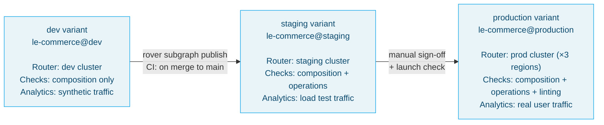
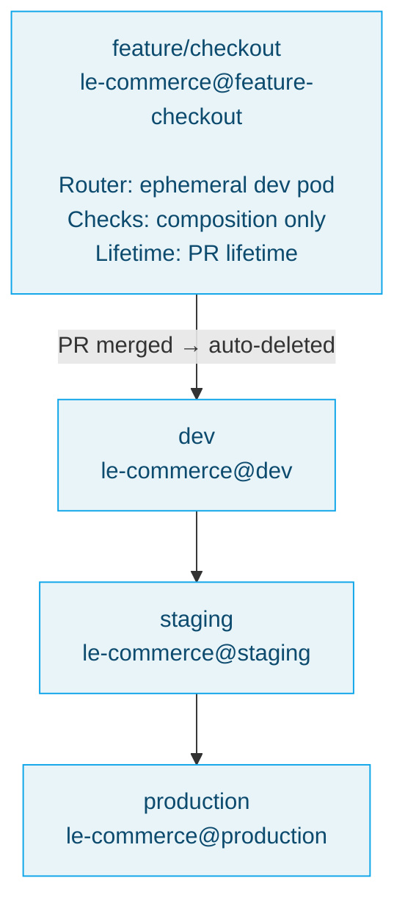
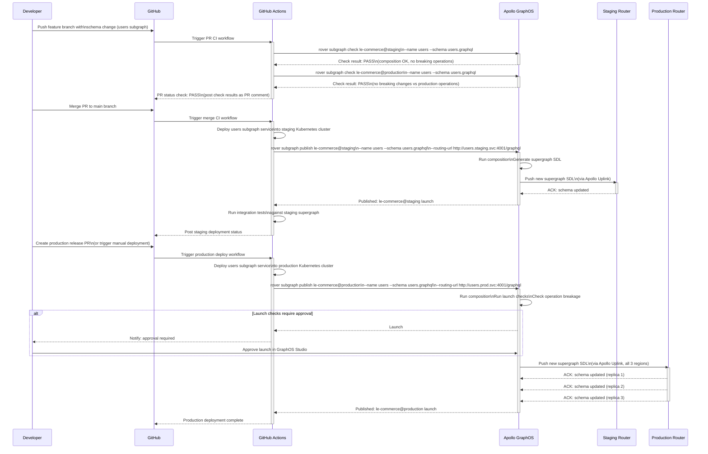

# 03 — Graph Variants: Multi-Environment Schema Management

> In Apollo GraphOS, a **variant** is a named instance of a graph — an isolated configuration of the
> supergraph schema, its router settings, its schema check policies, and its analytics data. Every
> enterprise GraphQL deployment has at minimum three variants: development, staging, and production.
> Variants enable schema evolution to flow safely through environments (feature branch → staging →
> production) with automated checks at each gate, and they power contract graphs that expose a
> filtered view of the supergraph to partner consumers.

---

## Learning Objectives

- [ ] Explain what a graph variant is and why it is distinct from environment configuration
- [ ] Publish subgraph schemas to multiple variants using the rover CLI
- [ ] Configure per-variant schema check policies and understand what each check validates
- [ ] Implement a GitOps promotion workflow that prevents breaking changes from reaching production
- [ ] Create a contract graph that exposes a subset of the supergraph to a partner consumer
- [ ] Write `apollo.config.ts` to configure check thresholds as code
- [ ] Understand launch checks and how to require sign-off before schema promotion

---

## Overview and Architecture

### What Is a Variant?

A variant is an independently managed version of a graph in Apollo GraphOS. Every graph has at
least one variant. The graph reference format is `{graph-id}@{variant-name}`, for example:
`le-commerce@production`, `le-commerce@staging`, `le-commerce@dev`.

Each variant maintains its own:

- **Schema history**: the sequence of composition results for that variant, with each entry showing
  which subgraph published a change, what the resulting supergraph SDL looked like, and whether
  composition succeeded or failed.
- **Check configuration**: the schema check policies (operation checks, composition checks,
  linting rules) that apply to proposed changes against this variant.
- **Analytics data**: field usage statistics, operation signatures, and client usage data for
  traffic running through routers configured with this variant's graph ref.
- **Launch history**: the sequence of router schema updates, including which router instances
  acknowledged the update and when.
- **Contract graphs**: filtered views of this variant's schema that are published to partner
  consumers (explained in the Contract Graphs section below).

Variants are not just environment configuration — they are independent schema contexts. A feature
team can work on a `feature/new-checkout` variant without affecting the `staging` or `production`
variant schemas. The router associated with a variant only serves the schema for that variant.

### The Variant Promotion Model

The canonical promotion model for enterprise GraphQL deployments has three tiers (with optional
feature variant support):



Feature variants can be created on demand for individual features:



---

## Core Concepts

### Schema Checks

Schema checks are the primary quality gate that prevents breaking changes from propagating through
variants. When a subgraph team runs `rover subgraph check`, Apollo GraphOS performs up to four
categories of checks:

**Composition check**: Can the proposed schema compose with all other current subgraph schemas in
this variant? This check catches type conflicts, incompatible federation directives, and syntax
errors. It runs for every variant that serves as a check target and is mandatory — there is no
way to publish a schema that fails composition.

**Operations check**: Does the proposed schema remove or change any fields, arguments, or types
that are currently being used by operations in the operation registry? The operation registry is
populated from traffic analytics: Apollo Router reports every unique operation shape it executes
to GraphOS, along with usage counts. The operations check compares the proposed schema against
the operations registry for the check target variant (typically production). Any schema change
that breaks an operation that has been used in the last N days (configurable) is flagged as a
breaking change.

**Linting**: Does the proposed schema comply with the graph's linting rules? Linting rules can
enforce naming conventions (camelCase field names, PascalCase type names), documentation
requirements (all types must have descriptions), deprecation policy (deprecated fields must have
a reason), and custom rules.

**Proposal checks** (Apollo GraphOS Enterprise): If the graph uses the schema proposal workflow,
schema changes must be approved as proposals before they can be published. Proposal checks verify
that the change has been approved.

### Contract Graphs

A contract graph is a derived variant of a supergraph that exposes only the subset of the schema
tagged with specific `@tag` directives. Contract graphs are the standard solution for the partner
API problem: you want external partners to access a curated subset of your supergraph without
exposing your internal types, administrative fields, or fields that the partner has not been
licensed to access.

The contract workflow:

1. Annotate your supergraph schema with `@tag` directives identifying which fields/types are
   accessible to which consumers.
2. Create a contract graph in GraphOS that filters the supergraph by one or more tag names.
3. Deploy a router configured with the contract variant's graph ref. This router serves only the
   filtered schema to the partner.

The contract router and the primary router share the same subgraph backends — there is no
duplication of business logic or data stores. The contract is a schema-level filter applied at
the router; subgraph behavior is identical regardless of which router variant is calling.

### Apollo Configuration as Code (apollo.config.ts)

The `apollo.config.ts` file (or `apollo.config.js`) allows you to configure schema check behavior
as code in the repository. This configuration is read by the rover CLI when running checks and
by Apollo's VS Code extension when providing in-editor feedback.

```typescript
// apollo.config.ts — Configuration as code for schema checks
//
// This file configures:
//   - Which graph ref to check against (for schema diff)
//   - Check thresholds (how many days of operation history to use)
//   - Whether operations with low usage are excluded from checks
//   - Linting rules

import type { ApolloConfig } from "@apollo/utils.apollo-config";

const config: ApolloConfig = {
  client: {
    service: {
      // The graph ref to use for schema checks and type generation.
      // In CI, this is overridden by the APOLLO_GRAPH_REF env variable.
      name: "le-commerce@production",
      url: "http://localhost:4000",
    },
  },
};

export default config;
```

### Rover CLI Reference for Variant Management

The rover CLI is the primary interface for interacting with Apollo GraphOS variants. All CI
pipeline interactions with GraphOS go through rover.

---

## Real-World Implementation

### Rover Commands for Variant Management

```bash
# ============================================================
# Setup: Authenticate rover with Apollo GraphOS
# ============================================================
# The APOLLO_KEY environment variable must be set before any
# rover command that interacts with GraphOS. In CI, this is
# injected as a secret. Never hardcode the key.

export APOLLO_KEY="service:le-commerce:your-api-key-here"

# ============================================================
# Publishing subgraph schemas to variants
# ============================================================

# Publish a subgraph schema to the dev variant.
# --name: the subgraph name as registered in GraphOS
# --schema: path to the subgraph's SDL file
# --routing-url: the URL the router should use to reach this subgraph
# This is typically called in CI on every merge to the main branch.
rover subgraph publish le-commerce@dev \
  --name users \
  --schema ./services/users/schema.graphql \
  --routing-url "http://users.dev.svc.cluster.local:4001/graphql"

# Publish to staging after the dev deployment succeeds.
rover subgraph publish le-commerce@staging \
  --name users \
  --schema ./services/users/schema.graphql \
  --routing-url "http://users.staging.svc.cluster.local:4001/graphql"

# Publish to production. This triggers a launch check in GraphOS.
# If launch checks are configured to require sign-off, this command
# publishes the schema but does NOT deploy it until approved.
rover subgraph publish le-commerce@production \
  --name users \
  --schema ./services/users/schema.graphql \
  --routing-url "http://users.prod.svc.cluster.local:4001/graphql"

# ============================================================
# Running schema checks
# ============================================================

# Check a proposed schema change against the production variant.
# This runs composition, operations, and linting checks.
# Returns exit code 0 on success, non-zero on failure.
# Run this in CI before any deployment.
rover subgraph check le-commerce@production \
  --name users \
  --schema ./services/users/schema.graphql

# Check against staging (for changes that are in staging but
# not yet in production).
rover subgraph check le-commerce@staging \
  --name orders \
  --schema ./services/orders/schema.graphql

# ============================================================
# Fetching schemas from variants
# ============================================================

# Fetch the composed supergraph SDL from a variant.
# Use this to provide the supergraph SDL to the router
# in CI pipelines where you want to pre-compose locally.
rover supergraph fetch le-commerce@production \
  --output ./supergraph.graphql

# Fetch a single subgraph's SDL as registered in GraphOS.
rover subgraph fetch le-commerce@production \
  --name products \
  --output ./products-from-registry.graphql

# ============================================================
# Contract graph management
# ============================================================

# Create a new contract graph that exposes only the fields
# tagged with the "partner-a" tag. The source graph is
# le-commerce@production. The contract is published as a new
# variant: le-commerce@partner-a.
rover contract publish le-commerce \
  --source le-commerce@production \
  --name le-commerce@partner-a \
  --include-tags partner-a \
  --hide-unreachable-types

# Update an existing contract to add more tags.
rover contract publish le-commerce \
  --source le-commerce@production \
  --name le-commerce@partner-b \
  --include-tags partner-b,public \
  --hide-unreachable-types

# ============================================================
# Variant and graph management
# ============================================================

# List all subgraphs in a variant.
rover subgraph list le-commerce@production

# Delete a subgraph from a variant (use with care in production).
rover subgraph delete le-commerce@feature-checkout \
  --name users \
  --confirm

# Graph introspection via rover.
rover graph introspect http://localhost:4000 \
  --output ./introspected-schema.graphql
```

### Complete GitOps Promotion Workflow

The following sequence diagram shows the complete lifecycle of a schema change from a feature
branch through to production, with checks at every gate.



### GitHub Actions Workflow: Schema Check on PR

```yaml
# .github/workflows/schema-check.yml
# Runs Apollo Router schema checks on every PR that modifies a subgraph schema.
# Blocks merge if checks fail.

name: GraphQL Schema Check

on:
  pull_request:
    paths:
      - "services/*/schema.graphql"
      - "services/*/src/**/*.graphql"

env:
  APOLLO_KEY: ${{ secrets.APOLLO_KEY }}

jobs:
  detect-changed-subgraphs:
    runs-on: ubuntu-latest
    outputs:
      subgraphs: ${{ steps.changed.outputs.subgraphs }}
    steps:
      - uses: actions/checkout@v4
        with:
          fetch-depth: 0

      - name: Detect changed subgraph schemas
        id: changed
        run: |
          # Find which subgraph schemas changed in this PR.
          CHANGED=$(git diff --name-only origin/${{ github.base_ref }}...HEAD \
            | grep 'services/.*/schema.graphql' \
            | sed 's|services/\(.*\)/schema.graphql|\1|' \
            | jq -R -s -c 'split("\n") | map(select(length > 0))')
          echo "subgraphs=${CHANGED}" >> $GITHUB_OUTPUT

  schema-check:
    needs: detect-changed-subgraphs
    runs-on: ubuntu-latest
    if: needs.detect-changed-subgraphs.outputs.subgraphs != '[]'
    strategy:
      # Run checks for all changed subgraphs in parallel.
      matrix:
        subgraph: ${{ fromJson(needs.detect-changed-subgraphs.outputs.subgraphs) }}
      fail-fast: false

    steps:
      - uses: actions/checkout@v4

      - name: Install Rover CLI
        run: |
          curl -sSL https://rover.apollo.dev/nix/latest | sh
          echo "$HOME/.rover/bin" >> $GITHUB_PATH

      - name: Check against staging variant
        id: check-staging
        run: |
          rover subgraph check le-commerce@staging \
            --name ${{ matrix.subgraph }} \
            --schema services/${{ matrix.subgraph }}/schema.graphql \
            --format json \
            > /tmp/staging-check-result.json
          cat /tmp/staging-check-result.json
        continue-on-error: true

      - name: Check against production variant
        id: check-production
        run: |
          rover subgraph check le-commerce@production \
            --name ${{ matrix.subgraph }} \
            --schema services/${{ matrix.subgraph }}/schema.graphql \
            --format json \
            > /tmp/production-check-result.json
          cat /tmp/production-check-result.json
        continue-on-error: true

      - name: Post check results as PR comment
        uses: actions/github-script@v7
        with:
          script: |
            const fs = require('fs');
            const subgraph = '${{ matrix.subgraph }}';

            let stagingResult = 'Could not read staging result';
            let productionResult = 'Could not read production result';

            try {
              stagingResult = JSON.parse(
                fs.readFileSync('/tmp/staging-check-result.json', 'utf-8')
              );
            } catch (e) {}

            try {
              productionResult = JSON.parse(
                fs.readFileSync('/tmp/production-check-result.json', 'utf-8')
              );
            } catch (e) {}

            const stagingStatus = stagingResult?.data?.diff?.severity ?? 'UNKNOWN';
            const productionStatus = productionResult?.data?.diff?.severity ?? 'UNKNOWN';

            const statusEmoji = (s) => s === 'PASS' ? '✅' : s === 'WARN' ? '⚠️' : '❌';

            const body = `### Schema Check Results: \`${subgraph}\`

            | Variant | Status | Details |
            |---------|--------|---------|
            | \`le-commerce@staging\` | ${statusEmoji(stagingStatus)} ${stagingStatus} | Composition + operations check |
            | \`le-commerce@production\` | ${statusEmoji(productionStatus)} ${productionStatus} | Composition + operations + linting |

            View full results in [Apollo Studio](https://studio.apollographql.com/graph/le-commerce).`;

            await github.rest.issues.createComment({
              issue_number: context.issue.number,
              owner: context.repo.owner,
              repo: context.repo.repo,
              body,
            });

      - name: Fail if production check failed
        if: steps.check-production.outcome == 'failure'
        run: |
          echo "Production schema check failed for subgraph: ${{ matrix.subgraph }}"
          echo "Review the check results in Apollo Studio before merging."
          exit 1
```

### GitHub Actions Workflow: Publish to Staging on Merge

```yaml
# .github/workflows/publish-staging.yml
# Publishes changed subgraph schemas to the staging variant
# after a PR is merged to the main branch.

name: Publish to Staging

on:
  push:
    branches:
      - main
    paths:
      - "services/*/schema.graphql"

env:
  APOLLO_KEY: ${{ secrets.APOLLO_KEY }}

jobs:
  publish-staging:
    runs-on: ubuntu-latest
    steps:
      - uses: actions/checkout@v4
        with:
          fetch-depth: 0

      - name: Install Rover CLI
        run: |
          curl -sSL https://rover.apollo.dev/nix/latest | sh
          echo "$HOME/.rover/bin" >> $GITHUB_PATH

      - name: Find changed subgraph schemas
        id: changed
        run: |
          PREV_SHA=$(git rev-parse HEAD~1)
          CHANGED=$(git diff --name-only ${PREV_SHA} HEAD \
            | grep 'services/.*/schema.graphql' \
            | sed 's|services/\(.*\)/schema.graphql|\1|')
          echo "Changed subgraphs: ${CHANGED}"
          echo "subgraphs=${CHANGED}" >> $GITHUB_OUTPUT

      - name: Publish changed subgraphs to staging
        run: |
          for SUBGRAPH in ${{ steps.changed.outputs.subgraphs }}; do
            echo "Publishing ${SUBGRAPH} to le-commerce@staging"
            rover subgraph publish le-commerce@staging \
              --name "${SUBGRAPH}" \
              --schema "services/${SUBGRAPH}/schema.graphql" \
              --routing-url "http://${SUBGRAPH}.staging.svc.cluster.local:4001/graphql"
          done
```

### Contract Graph Schema Tagging

The following example shows how to annotate a supergraph schema with `@tag` directives to enable
contract graphs. Tags are applied in subgraph schemas, not in the composed supergraph SDL.

```graphql
# services/products/schema.graphql
# Tags on types and fields control which contract graphs see them.
# A contract configured with --include-tags partner-a will expose
# only the types and fields tagged @tag(name: "partner-a").
# A contract configured with --include-tags public will expose
# only publicly tagged types and fields.

extend schema
  @link(url: "https://specs.apollo.dev/federation/v2.9",
    import: ["@key", "@tag", "@shareable", "@inaccessible"])

# ---------------------------------------------------------------
# Product type: tagged for all consumers
# ---------------------------------------------------------------
type Product @key(fields: "id") {
  # id and name are public — all partners and internal consumers
  # can see them.
  id: ID! @tag(name: "public") @tag(name: "partner-a") @tag(name: "partner-b")
  name: String! @tag(name: "public") @tag(name: "partner-a") @tag(name: "partner-b")

  # price is visible to partner-a (licensed reseller) and internal.
  price: Float! @tag(name: "partner-a") @tag(name: "internal")

  # costPrice is internal only — never exposed to any partner.
  # Not tagged with any partner tag; only appears in the internal
  # supergraph.
  costPrice: Float! @tag(name: "internal")

  # inventory is tagged for partner-b (logistics partner) but not
  # partner-a (reseller does not need stock levels).
  currentStock: Int @tag(name: "partner-b") @tag(name: "internal")

  # description is public.
  description: String @tag(name: "public") @tag(name: "partner-a") @tag(name: "partner-b")

  # internalSku is not tagged — it is @inaccessible and hidden
  # from all external schemas.
  internalSku: String @inaccessible
}

# ---------------------------------------------------------------
# Query type: root fields tagged per consumer
# ---------------------------------------------------------------
type Query {
  # products is public — appears in all contract graphs.
  products(first: Int, after: String): ProductConnection!
    @tag(name: "public")
    @tag(name: "partner-a")
    @tag(name: "partner-b")

  # product lookup: partner-a and partner-b can look up individual products.
  product(id: ID!): Product
    @tag(name: "partner-a")
    @tag(name: "partner-b")

  # adminProducts: internal only — never in any partner contract.
  adminProducts(filter: AdminProductFilter): [Product!]!
    @tag(name: "internal")

  # search: public read-only search.
  searchProducts(query: String!): [Product!]!
    @tag(name: "public")
    @tag(name: "partner-a")
}
```

---

## Production Considerations

### Performance: Schema Check Latency in CI

Schema checks against production involve querying the operation registry, which contains months of
operation history. For graphs with high traffic (millions of operations per day), the check can
take 30-120 seconds. This is acceptable for a PR gate but unacceptable for a blocking step in a
fast CI pipeline. Mitigate by: (1) running checks in parallel for each changed subgraph; (2) using
rover's `--background` flag (when available) to submit the check and poll for results separately,
allowing other CI steps to proceed; (3) caching the rover binary in CI to avoid re-downloading it
on every run.

### Security: Contract Graph Isolation

Contract graphs should be served by dedicated router deployments, not by the same router pods that
serve internal traffic. A shared router that serves both internal and partner traffic creates
operational coupling: a partner traffic spike can affect internal request latency. Dedicate a
router deployment (with its own Kubernetes Deployment, Service, and HPA) to each contract variant.
This also allows you to apply different rate limits, authentication requirements, and network
policies per contract.

### Scaling: Variant Count and Registry Performance

Apollo GraphOS does not impose a hard limit on the number of variants per graph, but each variant
creates additional schema composition work, analytics storage, and check history. In practice,
limit variants to: `dev`, `staging`, `production`, plus one contract variant per partner (typically
<10), plus short-lived feature variants that are deleted when the PR is merged. Do not create a
permanent variant per developer; use a shared `dev` variant instead, or use `rover dev` for fully
local development.

### Observability: Tracking Which Variant Caused a Regression

When a production incident involves a field that was recently changed, use the GraphOS launch
history to find the exact publish event. The launch history shows: which subgraph published the
change, the full before/after diff, which operations were flagged by the operations check (if any),
and the exact timestamp when each router replica acknowledged the schema update. This audit trail
is the primary debugging tool for schema-related incidents.

---

## Best Practices

1. **Use `rover subgraph check` against the production variant on every PR, not just staging.**
   The operations check against production is the most valuable check — it uses real user traffic
   to identify breaking changes. Checking only against staging tells you about composition validity
   but not about real-world operation breakage.

2. **Configure check thresholds to match your deployment frequency.** The default operations check
   window is 7 days. If you deploy daily, a 7-day window provides good coverage. If you deploy
   monthly, increase the window to 30 days so that infrequent operations (month-end reports,
   quarterly batch jobs) are included in the check.

3. **Delete feature variants when their PRs are merged.** Feature variants accumulate in GraphOS
   and pollute the variant list. Add a CI step that deletes the feature variant after the PR is
   merged: `rover subgraph delete le-commerce@feature-{branch-name} --confirm`.

4. **Apply contract tags in subgraph schemas, not in router configuration.** Tags are part of the
   schema's public contract. They should be versioned alongside the schema in the subgraph
   repository. Using router configuration to filter fields is fragile and bypasses the type-safe
   contract mechanism.

5. **Require human sign-off for production schema changes that flag breaking changes.** Configure
   GraphOS launch checks to require approval when the operations check finds operations that use
   changed or removed fields. Automate the non-breaking-change path (green check → auto-deploy)
   and route the breaking-change path to a human reviewer.

6. **Use `--hide-unreachable-types` when creating contract graphs.** Without this flag, types that
   are no longer reachable in the filtered schema (because all fields that referenced them were
   filtered out) still appear in the contract schema. This can expose internal type names and
   structure to partners. Always hide unreachable types in partner contracts.

7. **Monitor contract graph composition after every production schema change.** When the source
   variant's schema changes, all contract graphs derived from it are automatically recomposed.
   A change to the production schema can break a contract graph's composition if it removes a
   tagged field that is required by the contract. Set up alerts for contract composition failures.

---

## Anti-Patterns

**Using a single production-only variant.** Without a staging variant, schema changes go directly
to production. There is no environment where you can publish and test the new schema with the
actual router before it affects real users. Always maintain at minimum dev and production variants,
ideally with a staging variant in between.

**Ignoring the operations check because it flags false positives.** Operations checks occasionally
flag operations as breaking when they are actually safe (e.g., the operation is from a client
that was decommissioned but its operations are still in the registry). The correct response is to
exclude specific clients from the check using GraphOS client segment configuration, not to disable
the operations check entirely. Disabling the check removes the primary safety mechanism for
catching breaking changes.

**Sharing a contract router with the primary supergraph router.** A dedicated contract router
allows you to apply partner-specific rate limits, security policies, and network rules. A shared
router means that a misbehaving partner can affect internal traffic, and that applying a partner-
specific security rule (blocking a partner's API key) requires changes to the shared configuration.

**Not tagging the Query type root fields.** If the Query type root fields are not tagged, the
contract graph will have no entry points and be effectively empty (even if the types and their
fields are tagged). Always tag Query fields in addition to the types they return.

---

## Operational Notes

- The `APOLLO_KEY` environment variable must match the target graph. A key scoped to
  `le-commerce` cannot publish to `le-other-graph`. Verify the key scope before debugging
  "permission denied" errors from rover.
- `rover subgraph publish` is idempotent: publishing the same schema twice has no effect and
  does not create a new launch entry in GraphOS. This makes it safe to re-run publish commands
  in retry scenarios.
- Contract graph composition can add 10-30 seconds of latency after a publish event before the
  contract variant is updated. This is expected; the router polling interval (10s) means the
  contract router may serve the old schema for up to 40 seconds after a source variant change.
- Apollo GraphOS retains schema history indefinitely for paid plans. For cost management on
  free/developer plans, history may be limited. Enterprise deployments should always be on paid
  plans to ensure full history retention for compliance.

---

## References

1. [Apollo GraphOS Variants Documentation](https://www.apollographql.com/docs/graphos/graphs/variants/)
   — official guide to creating and managing variants, check configuration, and launch history
2. [Apollo Contract Graphs](https://www.apollographql.com/docs/graphos/delivery/contracts/)
   — complete guide to creating contract graphs with `@tag` directives and rover CLI
3. [Rover CLI Reference](https://www.apollographql.com/docs/rover/)
   — full CLI command reference for `subgraph publish`, `subgraph check`, `contract publish`, and all other rover commands
4. [Apollo Schema Checks Deep Dive](https://www.apollographql.com/docs/graphos/delivery/schema-checks/)
   — operation check mechanics, client segmentation, check thresholds, and break condition configuration

---

## Related Topics

- [01 — Apollo Router](./01-apollo-router.md) — how the router fetches schema updates from GraphOS
- [04 — Router at Scale](./04-router-at-scale.md) — multi-region router deployment, schema propagation latency
- Chapter 09 — Schema Governance — ownership model, review process, deprecation policy
- Chapter 11 — CI/CD Automation — complete GitHub Actions pipelines for schema management
- Chapter 12 — GitHub Actions — reusable workflows for rover check and publish steps
