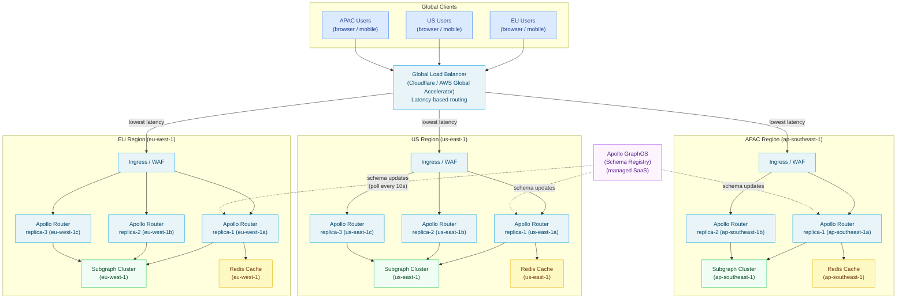

# 04 — Apollo Router at Scale: High Availability, Multi-Region, and Disaster Recovery

> Running Apollo Router in production at enterprise scale is an operations engineering problem, not
> a GraphQL problem. The router is stateless, horizontally scalable, and handles 10B+ requests/day
> in managed deployments — but achieving five-nines availability, sub-100ms p99 latency across
> regions, and graceful degradation during subgraph and registry failures requires deliberate
> infrastructure design. This document covers the full operational picture: Kubernetes deployment
> patterns, multi-region architecture, cost modeling, disaster recovery runbooks, and canary
> deployment strategy.

---

## Learning Objectives

- [ ] Design a high-availability router deployment with pod anti-affinity and disruption budgets
- [ ] Configure topology spread constraints for cross-AZ zone spreading
- [ ] Implement a multi-region router fleet with latency-based global routing
- [ ] Quantify the CPU and memory cost of Apollo Router at a given request rate
- [ ] Understand and mitigate the query plan cache cold-start problem during deployments
- [ ] Configure Apollo Router's offline mode for resilience when GraphOS is unreachable
- [ ] Design a canary deployment strategy using Kubernetes traffic splitting

---

## Overview and Architecture

### The Statefulness Problem (and Its Absence)

Apollo Router is designed to be stateless. There is no leader election, no distributed coordination,
no cluster membership. Every router pod is identical and interchangeable. The only per-pod state is
the in-memory query plan cache (which warms up from live traffic) and the in-memory JWKS cache
(which is refreshed from the identity provider). Neither of these requires coordination between
pods. This makes horizontal scaling trivial: add pods to add capacity.

The one external dependency that introduces coordination complexity is the schema registry
(Apollo GraphOS). The router polls the registry for schema updates. During a schema update, all
router pods transition from the old schema to the new schema independently, within a window of up
to 10 seconds (the polling interval). This asynchronous schema propagation is the primary source of
consistency concern in a router fleet. During the transition window, some pods serve the old schema
and some serve the new schema. This is safe for additive schema changes (adding fields does not
break old clients); it requires careful sequencing for removal changes (removing fields from the
schema before removing them from the subgraph causes errors for in-flight requests that are still
using the old schema).

### Multi-Region Architecture Overview



---

## Core Concepts

### Query Plan Cache Cold Start

When a router pod starts (whether after a deployment rollout, a pod eviction, or a node failure),
its query plan cache is empty. The first time each unique operation shape is executed, the router
must run the query planner before executing the operation. Query planning time scales with query
complexity: simple queries plan in <1ms; complex federated queries with many entity joins can take
10-50ms to plan. During the cold-start period (typically 5-15 minutes of traffic until the cache
reaches steady state), p99 latency is elevated compared to steady-state operation.

This effect is amplified during rolling deployments. A rolling deployment replaces pods one at a
time (with `maxUnavailable: 0`). Each new pod starts cold and receives production traffic immediately
after its readiness probe passes. If the readiness probe only checks that the router has loaded its
schema (not that the cache is warmed), the pod enters the load balancer rotation before it is truly
ready to serve at steady-state performance.

**Mitigation strategy:** Use a warm-up readiness probe that sends a synthetic set of representative
operations to the router before it enters the LB rotation. This can be implemented as an init
container or a pre-readiness hook that replays a set of common operation shapes against the local
router port. The operations used for warming should be the top-N operations by frequency from the
production operation registry.

### Apollo Router Offline Mode

Apollo Router continues to serve traffic using the last-known supergraph schema when it cannot
reach Apollo GraphOS (the Uplink). This offline mode is automatic and requires no configuration
— the router caches the schema in memory and does not require GraphOS connectivity to process
requests. The cached schema is valid indefinitely; the router does not expire the cache.

However, offline mode has two important implications:

1. **Schema updates are paused.** While the router is disconnected from GraphOS, new subgraph
   publications do not reach the router. Deployments of schema changes proceed (the subgraph is
   deployed and the schema is published to GraphOS), but the router does not update until
   connectivity is restored.

2. **Apollo Studio analytics are paused.** The router cannot send operation traces to GraphOS when
   disconnected. Traces are buffered in memory (up to a configurable limit) and flushed when
   connectivity is restored. If the buffer overflows, traces are dropped.

The practical recommendation: treat Apollo GraphOS connectivity as non-critical to serving traffic
(the router handles it gracefully) but critical to schema governance. Monitor GraphOS connectivity
in your alerting stack and alert when the router has been disconnected for more than 5 minutes.

### Circuit Breaking and Retry Budget

The router implements circuit breaking at the subgraph connection level through its retry and
timeout configuration. Apollo Router does not implement a traditional circuit breaker state machine
(open/half-open/closed) in its current release; instead, it relies on timeouts and per-request
retry budgets to handle subgraph failures.

For production deployments that need a full circuit breaker, add a service mesh sidecar (Istio or
Linkerd) that implements circuit breaking for outbound connections from the router pod. The service
mesh handles the circuit breaker state machine; the router sees either a successful subgraph
connection or a fast-fail from the sidecar. This separation of concerns keeps the router focused
on query planning and response merging, while the service mesh handles connection-level resilience.

### Cost Analysis

The following cost model applies to a single-region production deployment serving 5,000 requests
per second (req/s) as a steady state, with a typical query complexity of 3 subgraph calls per
request.

**Request math:**
- 5,000 router req/s × 3 subgraph calls/req = 15,000 subgraph HTTP calls/s
- Average response size: 5KB per subgraph response → 75MB/s of data flowing through the router
- Average request duration: 150ms (dominated by subgraph response time)
- Concurrency: 5,000 req/s × 0.150s avg duration = 750 concurrent requests in flight

**Per-pod resource consumption (measured on production deployments):**
- CPU: The router is CPU-bound for query planning and JSON serialization/deserialization.
  At 5,000 req/s total with 3 pods (1,667 req/s per pod), each pod uses approximately 1.2 vCPU
  at steady state (cache-warm) and up to 2.0 vCPU during cold start (extra planning CPU).
  Resource request: 1.0 vCPU. Limit: 2.0 vCPU.
- Memory: The Tokio runtime, query plan cache (512 entries × ~150KB average = ~75MB), and
  connection pools consume approximately 400-600MB per pod at steady state.
  Resource request: 512Mi. Limit: 2Gi.

**3-pod production cluster:**
- CPU: 3 pods × 1.0 vCPU request = 3.0 vCPU reserved (burst to 6.0)
- Memory: 3 pods × 512Mi = 1.5Gi reserved (burst to 6Gi)
- On AWS EKS (m5.xlarge, 4 vCPU / 16Gi): the router fleet fits on 1 dedicated node with room for
  the entity cache Redis and ingress controller. Cost: approximately $140/month per node.
- For a 3-region deployment (3 × 3 pods = 9 pods total): approximately $420/month in node costs
  for router compute alone, excluding subgraph compute and Redis.

**Entity cache sizing:**
- 1 million unique product entities × 500 bytes per cached entity = 500MB Redis memory
- 1 million unique user entities × 300 bytes per cached entity = 300MB Redis memory
- Total Redis memory: ~1GB for entity cache, with 2× headroom → provision 2GB Redis cluster

---

## Real-World Implementation

### Complete Kubernetes Deployment: High Availability

The following Kubernetes manifests deploy Apollo Router with full high-availability configuration:
3 replicas, anti-affinity for zone spreading, topology spread constraints, PodDisruptionBudget,
HPA, and production resource limits.

```yaml
# kubernetes/router/deployment.yaml
# Apollo Router — Production High Availability Deployment
#
# Prerequisites:
#   - cert-manager for TLS certificate management
#   - Prometheus Operator for ServiceMonitor
#   - External Secrets Operator or sealed-secrets for Secret management

apiVersion: apps/v1
kind: Deployment
metadata:
  name: apollo-router
  namespace: gateway
  labels:
    app: apollo-router
    app.kubernetes.io/name: apollo-router
    app.kubernetes.io/component: api-gateway
    app.kubernetes.io/part-of: le-commerce
  annotations:
    # Track the deployed router version for rollback.
    deployment.kubernetes.io/revision: "1"
spec:
  replicas: 3

  selector:
    matchLabels:
      app: apollo-router

  strategy:
    type: RollingUpdate
    rollingUpdate:
      # Never take a pod down before a new one is ready.
      # This ensures full capacity is maintained during rollouts.
      maxUnavailable: 0
      # Bring up one new pod at a time. Slower rollouts but
      # limits the blast radius of a bad deployment.
      maxSurge: 1

  template:
    metadata:
      labels:
        app: apollo-router
        app.kubernetes.io/name: apollo-router
        version: "1.52.0"  # Used by Istio traffic splitting for canary
      annotations:
        # Force pod restart when the ConfigMap changes.
        # Checksum is injected by Helm/Kustomize during deployment.
        checksum/config: "{{ include (print $.Template.BasePath \"/configmap.yaml\") . | sha256sum }}"
        # Prometheus scrape annotations (for non-Operator setups).
        prometheus.io/scrape: "true"
        prometheus.io/port: "9090"
        prometheus.io/path: "/metrics"

    spec:
      # --------------------------------------------------------
      # Service Account
      # --------------------------------------------------------
      serviceAccountName: apollo-router
      automountServiceAccountToken: false

      # --------------------------------------------------------
      # Pod Anti-Affinity: Zone Spreading
      # --------------------------------------------------------
      # Prefer (but do not require) that router pods run in
      # different availability zones. Using preferredDuringScheduling
      # (soft rule) rather than requiredDuringScheduling (hard rule)
      # prevents scheduling deadlocks when the cluster has fewer
      # nodes than desired pods.
      affinity:
        podAntiAffinity:
          # Hard rule: never schedule two router pods on the SAME node.
          # This ensures a single node failure does not take down multiple
          # router replicas.
          requiredDuringSchedulingIgnoredDuringExecution:
            - labelSelector:
                matchExpressions:
                  - key: app
                    operator: In
                    values:
                      - apollo-router
              topologyKey: kubernetes.io/hostname

          # Soft rule: prefer to spread across availability zones.
          # Weight 100: this preference is heavily weighted in the
          # scheduler's scoring, but it can be overridden if zone
          # capacity is unbalanced.
          preferredDuringSchedulingIgnoredDuringExecution:
            - weight: 100
              podAffinityTerm:
                labelSelector:
                  matchExpressions:
                    - key: app
                      operator: In
                      values:
                        - apollo-router
                topologyKey: topology.kubernetes.io/zone

      # --------------------------------------------------------
      # Topology Spread Constraints
      # --------------------------------------------------------
      # Ensure pods are spread evenly across availability zones.
      # maxSkew: 1 means the difference between the most-loaded
      # and least-loaded zone is at most 1 pod.
      # whenUnsatisfiable: ScheduleAnyway allows scheduling even
      # if the spread constraint cannot be satisfied (e.g., if a
      # zone has no capacity).
      topologySpreadConstraints:
        - maxSkew: 1
          topologyKey: topology.kubernetes.io/zone
          whenUnsatisfiable: ScheduleAnyway
          labelSelector:
            matchLabels:
              app: apollo-router
        - maxSkew: 1
          topologyKey: kubernetes.io/hostname
          whenUnsatisfiable: DoNotSchedule
          labelSelector:
            matchLabels:
              app: apollo-router

      # --------------------------------------------------------
      # Security Context
      # --------------------------------------------------------
      securityContext:
        runAsNonRoot: true
        runAsUser: 1000
        runAsGroup: 1000
        fsGroup: 1000
        seccompProfile:
          type: RuntimeDefault

      # --------------------------------------------------------
      # Init Container: Query Plan Cache Warm-Up
      # --------------------------------------------------------
      # This init container sends a set of representative queries
      # to the router before the readiness probe passes. This
      # pre-warms the query plan cache and reduces the cold-start
      # latency spike during rolling deployments.
      initContainers:
        - name: warmup
          image: curlimages/curl:8.4.0
          command:
            - sh
            - -c
            - |
              set -e
              echo "Waiting for router to start..."
              until curl -sf http://localhost:8088/health; do
                sleep 1
              done
              echo "Router is healthy. Warming up query plan cache..."
              # Send the top-5 most common production operations
              # to pre-populate the query plan cache.
              curl -sf -X POST http://localhost:4000/graphql \
                -H 'content-type: application/json' \
                -d '{"query":"{ products(first: 20) { id name price } }"}' || true
              curl -sf -X POST http://localhost:4000/graphql \
                -H 'content-type: application/json' \
                -d '{"query":"{ user { id email preferences { theme } } }"}' || true
              curl -sf -X POST http://localhost:4000/graphql \
                -H 'content-type: application/json' \
                -d '{"query":"{ orders(first: 10) { id status items { product { name } quantity } } }"}' || true
              echo "Warm-up complete."
          resources:
            requests:
              cpu: "10m"
              memory: "16Mi"
            limits:
              cpu: "50m"
              memory: "32Mi"

      containers:
        - name: router
          image: ghcr.io/apollographql/router:v1.52.0
          imagePullPolicy: IfNotPresent

          args:
            - --config
            - /etc/router/router.yaml

          ports:
            - name: graphql
              containerPort: 4000
              protocol: TCP
            - name: health
              containerPort: 8088
              protocol: TCP
            - name: metrics
              containerPort: 9090
              protocol: TCP

          # --------------------------------------------------------
          # Environment Variables
          # --------------------------------------------------------
          env:
            - name: APOLLO_KEY
              valueFrom:
                secretKeyRef:
                  name: apollo-router-secrets
                  key: apollo-key
            - name: APOLLO_GRAPH_REF
              valueFrom:
                secretKeyRef:
                  name: apollo-router-secrets
                  key: apollo-graph-ref
            - name: ROUTER_VERSION
              value: "1.52.0"
            - name: INVENTORY_API_KEY
              valueFrom:
                secretKeyRef:
                  name: subgraph-api-keys
                  key: inventory-api-key
            - name: SUBGRAPH_HMAC_SECRET
              valueFrom:
                secretKeyRef:
                  name: router-coprocessor-secrets
                  key: hmac-secret
            # Rust logging level. In production, use "warn" to reduce
            # log volume. Use "info" for debugging.
            - name: RUST_LOG
              value: "warn,apollo_router=info"
            # JSON log format for structured logging aggregators.
            - name: APOLLO_ROUTER_LOG_FORMAT
              value: "json"

          # --------------------------------------------------------
          # Resource Requests and Limits
          # --------------------------------------------------------
          resources:
            requests:
              # Conservative request: sufficient for steady-state
              # with warm cache at ~1500 req/s per pod.
              cpu: "500m"
              memory: "512Mi"
            limits:
              # Burst limit: 2 vCPU for cold-start planning spikes
              # and burst traffic. Memory limit prevents OOM from
              # cache growth.
              cpu: "2000m"
              memory: "2Gi"

          # --------------------------------------------------------
          # Probes
          # --------------------------------------------------------
          livenessProbe:
            httpGet:
              path: /health
              port: health
            # Give the router 10 seconds to start loading the schema
            # before the first liveness check.
            initialDelaySeconds: 10
            periodSeconds: 10
            # 3 consecutive failures before the pod is restarted.
            failureThreshold: 3
            successThreshold: 1
            timeoutSeconds: 5

          readinessProbe:
            httpGet:
              path: /health
              port: health
            # Check every 5 seconds. A pod that fails 2 consecutive
            # checks is removed from the Service endpoints.
            periodSeconds: 5
            failureThreshold: 2
            successThreshold: 1
            timeoutSeconds: 3
            # Initial delay of 5 seconds: the router typically loads
            # the schema within 3 seconds.
            initialDelaySeconds: 5

          startupProbe:
            httpGet:
              path: /health
              port: health
            # Allow up to 60 seconds for startup (30 retries × 2s interval).
            # This accommodates slow network environments where schema
            # download takes longer.
            periodSeconds: 2
            failureThreshold: 30

          # --------------------------------------------------------
          # Volume Mounts
          # --------------------------------------------------------
          volumeMounts:
            - name: config
              mountPath: /etc/router
              readOnly: true
            - name: router-tls
              mountPath: /etc/ssl/certs/router
              readOnly: true
            - name: redis-ca
              mountPath: /etc/ssl/certs/redis
              readOnly: true
            - name: tmp
              mountPath: /tmp

          # --------------------------------------------------------
          # Security Context (Container)
          # --------------------------------------------------------
          securityContext:
            allowPrivilegeEscalation: false
            readOnlyRootFilesystem: true
            capabilities:
              drop:
                - ALL

      # --------------------------------------------------------
      # Volumes
      # --------------------------------------------------------
      volumes:
        - name: config
          configMap:
            name: apollo-router-config
        - name: router-tls
          secret:
            secretName: router-client-tls
        - name: redis-ca
          secret:
            secretName: redis-ca-cert
        - name: tmp
          emptyDir: {}

      # --------------------------------------------------------
      # Graceful Shutdown
      # --------------------------------------------------------
      # Allow 30 seconds for in-flight requests to complete before
      # the pod is terminated. The router stops accepting new
      # connections immediately when it receives SIGTERM, but
      # completes existing requests within this window.
      terminationGracePeriodSeconds: 30

      # --------------------------------------------------------
      # Node Selection
      # --------------------------------------------------------
      # Schedule router pods on nodes with the "gateway" label.
      # This isolates router compute from subgraph compute and
      # prevents noisy-neighbor interference.
      nodeSelector:
        node-role: gateway
```

```yaml
# kubernetes/router/pdb.yaml
# PodDisruptionBudget: ensure at least 2 router pods are available
# during voluntary disruptions (node drains, cluster upgrades).
# With 3 replicas and minAvailable: 2, at most 1 pod can be
# voluntarily disrupted at a time.

apiVersion: policy/v1
kind: PodDisruptionBudget
metadata:
  name: apollo-router-pdb
  namespace: gateway
spec:
  minAvailable: 2
  selector:
    matchLabels:
      app: apollo-router
```

```yaml
# kubernetes/router/hpa.yaml
# HorizontalPodAutoscaler: scale the router fleet based on CPU
# utilization. Target 60% CPU utilization to leave headroom for
# traffic spikes. Scale from 3 to 20 pods.

apiVersion: autoscaling/v2
kind: HorizontalPodAutoscaler
metadata:
  name: apollo-router-hpa
  namespace: gateway
spec:
  scaleTargetRef:
    apiVersion: apps/v1
    kind: Deployment
    name: apollo-router

  minReplicas: 3
  maxReplicas: 20

  metrics:
    - type: Resource
      resource:
        name: cpu
        target:
          type: Utilization
          averageUtilization: 60

    - type: Resource
      resource:
        name: memory
        target:
          type: Utilization
          averageUtilization: 70

  behavior:
    # Scale up quickly to handle traffic spikes.
    scaleUp:
      stabilizationWindowSeconds: 30
      policies:
        - type: Percent
          value: 100
          periodSeconds: 60
        - type: Pods
          value: 4
          periodSeconds: 60
      selectPolicy: Max

    # Scale down slowly to avoid thrashing.
    # Do not scale below minReplicas for 5 minutes after a spike.
    scaleDown:
      stabilizationWindowSeconds: 300
      policies:
        - type: Percent
          value: 10
          periodSeconds: 60
      selectPolicy: Min
```

```yaml
# kubernetes/router/service.yaml
# Service: ClusterIP for internal cluster traffic.
# The Ingress or load balancer sits in front of this Service.

apiVersion: v1
kind: Service
metadata:
  name: apollo-router
  namespace: gateway
  labels:
    app: apollo-router
spec:
  type: ClusterIP
  selector:
    app: apollo-router
  ports:
    - name: graphql
      port: 4000
      targetPort: graphql
      protocol: TCP
    - name: health
      port: 8088
      targetPort: health
      protocol: TCP
    - name: metrics
      port: 9090
      targetPort: metrics
      protocol: TCP
```

```yaml
# kubernetes/router/servicemonitor.yaml
# ServiceMonitor: Prometheus Operator scrape configuration.
# Prometheus scrapes the /metrics endpoint every 30 seconds.

apiVersion: monitoring.coreos.com/v1
kind: ServiceMonitor
metadata:
  name: apollo-router
  namespace: gateway
  labels:
    app: apollo-router
    # Label required by your Prometheus Operator instance
    # to discover this ServiceMonitor. Check your Prometheus
    # Operator configuration for the required label selector.
    prometheus: kube-prometheus
spec:
  selector:
    matchLabels:
      app: apollo-router
  endpoints:
    - port: metrics
      path: /metrics
      interval: 30s
      scrapeTimeout: 10s
```

### Canary Deployment with Istio Traffic Splitting

A canary deployment routes a small percentage of production traffic to the new router version,
allowing you to verify the new version's behavior before completing the rollout.

```yaml
# kubernetes/router/canary-virtualservice.yaml
# Istio VirtualService: route 5% of traffic to the canary router
# deployment and 95% to the stable deployment.
#
# Prerequisites:
#   - Istio installed in the cluster
#   - Both stable (apollo-router) and canary (apollo-router-canary)
#     Deployments exist with different pod label versions.
#   - DestinationRule defining stable and canary subsets.

apiVersion: networking.istio.io/v1beta1
kind: VirtualService
metadata:
  name: apollo-router
  namespace: gateway
spec:
  hosts:
    - apollo-router
  http:
    - match:
        # Route requests with the X-Canary header to the canary
        # deployment. Use this for internal testing before enabling
        # the percentage-based split.
        - headers:
            x-canary:
              exact: "true"
      route:
        - destination:
            host: apollo-router
            subset: canary
          weight: 100

    # Default: 95% stable, 5% canary.
    - route:
        - destination:
            host: apollo-router
            subset: stable
          weight: 95
        - destination:
            host: apollo-router
            subset: canary
          weight: 5
```

```yaml
# kubernetes/router/canary-destinationrule.yaml
apiVersion: networking.istio.io/v1beta1
kind: DestinationRule
metadata:
  name: apollo-router
  namespace: gateway
spec:
  host: apollo-router
  subsets:
    - name: stable
      labels:
        version: "1.51.0"
    - name: canary
      labels:
        version: "1.52.0"
```

### Disaster Recovery Runbook

The following runbook documents the recovery procedure for each failure mode.

```markdown
# Apollo Router Disaster Recovery Runbook

## Failure Mode 1: Apollo GraphOS Unreachable

**Symptoms:**
- Router logs contain: "Failed to poll Apollo Uplink"
- Schema updates are not propagating to the router fleet
- Apollo Studio shows no incoming operation traces

**Impact:**
- Serving: NONE. The router continues to serve traffic with the last-known schema.
- Schema updates: BLOCKED. New subgraph publishes do not reach the router.
- Observability: DEGRADED. Operation traces are buffered in memory; flush happens when connectivity restores.

**Response:**
1. Verify the outage: check Apollo's status page at https://status.apollographql.com/
2. Monitor the router logs for "Successfully polled Apollo Uplink" to confirm when connectivity restores.
3. After connectivity restores, verify that the router has the current schema:
   `kubectl exec -n gateway deployment/apollo-router -- curl -s localhost:8088/health`
4. If schema was updated during the outage, verify that the router received the update after reconnection.
5. If the outage lasts >30 minutes, consider whether any schema changes are blocked and need to be replayed.

**Escalation:** If GraphOS is unreachable for >1 hour during a scheduled deployment that requires schema changes, pause the deployment and wait for GraphOS to recover.

---

## Failure Mode 2: All Router Pods Crash-Loop

**Symptoms:**
- All router pods in CrashLoopBackOff state
- HTTP 503 errors on all GraphQL requests
- Kubernetes events show repeated pod restarts

**Immediate Response (< 5 minutes):**
1. Check pod logs for the most recent crash:
   `kubectl logs -n gateway -l app=apollo-router --previous`
2. Check if the ConfigMap was recently updated:
   `kubectl get cm -n gateway apollo-router-config -o yaml | grep 'resourceVersion'`
3. If a bad ConfigMap was deployed:
   a. Roll back the ConfigMap: `kubectl rollout undo deployment/apollo-router -n gateway`
   b. OR manually restore the previous ConfigMap from git and apply it.
4. Verify the rollback: `kubectl rollout status deployment/apollo-router -n gateway`

**Root Cause Investigation:**
1. Review the router startup logs. Common crash causes:
   - Invalid `router.yaml` syntax (validate with `--validate-config`)
   - Missing required environment variables (check Secret contents)
   - Network policy blocking the router from reaching Apollo Uplink
   - TLS certificate expired (check cert-manager events)

---

## Failure Mode 3: Single Subgraph is Down

**Symptoms:**
- Requests that include fields from the affected subgraph return partial results with errors
- Router metrics show elevated error rate for subgraph_{name}_requests_total
- The affected subgraph's health check is failing

**Impact:**
- Requests that ONLY use fields from healthy subgraphs: UNAFFECTED
- Requests that require the affected subgraph: DEGRADED (partial results with null fields + errors)
- Entity resolution for entities owned by the affected subgraph: FAILING

**Response:**
1. Confirm the subgraph is down:
   `kubectl get pods -n {subgraph-namespace} -l app={subgraph-name}`
2. Check the subgraph's recent events:
   `kubectl events -n {subgraph-namespace} --for deployment/{subgraph-name}`
3. If entity caching is enabled, check if cached entities can serve recent requests:
   - Monitor: `apollo_router_entity_cache_hit_count` should be elevated (cache serving stale data)
   - This extends the window before users see errors
4. Escalate to the subgraph's owning team.
5. If the subgraph is down for >5 minutes, consider enabling a maintenance mode GraphQL error
   response via the coprocessor (return a user-friendly error for affected operations).

---

## Failure Mode 4: Entity Cache (Redis) is Down

**Symptoms:**
- Router logs: "Redis connection failed"
- Elevated subgraph call rate (all entity resolutions bypass cache)
- Latency increase (cache misses cause extra subgraph calls)

**Impact:**
- Serving: DEGRADED but functional. The router falls back to direct subgraph calls.
- Performance: DEGRADED. Expected 2-5× increase in subgraph call rate.
- Cost: INCREASED. Subgraphs are receiving more calls than their normal load.

**Response:**
1. Verify Redis cluster health:
   `kubectl get pods -n cache -l app=redis`
2. Check if subgraphs can handle the increased load:
   - Monitor subgraph error rates and latency
   - If subgraphs are overwhelmed, reduce the router rate limits temporarily
3. Restore Redis. Do not attempt to restore stale data from backup — simply allow the cache
   to warm from live traffic after Redis is restored.
4. After Redis is restored, verify cache hit rate returns to baseline within 5 minutes.
```

---

## Production Considerations

### Performance: Latency Budget Allocation

For a 200ms end-to-end P99 latency target from the client's perspective, allocate the budget as
follows:

- Network (client to CDN/LB): 10ms (geography-dependent; this is the primary variable)
- CDN / load balancer: 2ms
- Router overhead (auth, query planning from cache, response merging): 5ms
- Subgraph call overhead (router to subgraph, TCP + HTTP): 3ms per subgraph call
- Subgraph processing time: 80ms (budget for the actual business logic)
- Response serialization and network return: 10ms

Total: ~130ms for a single subgraph call path; ~160ms for a 3-subgraph parallel path. This leaves
40ms of headroom for cache misses and request handling variance.

### Security: Network Policy for the Router Fleet

Implement Kubernetes NetworkPolicies to restrict router network access:

```yaml
# kubernetes/router/networkpolicy.yaml
apiVersion: networking.k8s.io/v1
kind: NetworkPolicy
metadata:
  name: apollo-router
  namespace: gateway
spec:
  podSelector:
    matchLabels:
      app: apollo-router

  policyTypes:
    - Ingress
    - Egress

  ingress:
    # Allow traffic from the ingress controller only.
    - from:
        - namespaceSelector:
            matchLabels:
              kubernetes.io/metadata.name: ingress-nginx
      ports:
        - port: 4000
    # Allow Prometheus scraping from the monitoring namespace.
    - from:
        - namespaceSelector:
            matchLabels:
              kubernetes.io/metadata.name: monitoring
      ports:
        - port: 9090

  egress:
    # Allow traffic to subgraph namespaces only.
    - to:
        - namespaceSelector:
            matchLabels:
              role: subgraph
      ports:
        - port: 4001
        - port: 4002
        - port: 4003
        - port: 4004
        - port: 4005
    # Allow traffic to Redis cache.
    - to:
        - namespaceSelector:
            matchLabels:
              kubernetes.io/metadata.name: cache
      ports:
        - port: 6379
    # Allow traffic to Apollo Uplink and JWKS endpoint.
    # This requires DNS resolution (port 53) and HTTPS (port 443).
    - to:
        - ipBlock:
            cidr: 0.0.0.0/0
            except:
              - 10.0.0.0/8
              - 172.16.0.0/12
              - 192.168.0.0/16
      ports:
        - port: 443
        - port: 53
          protocol: UDP
    # Allow traffic to OTel Collector.
    - to:
        - namespaceSelector:
            matchLabels:
              kubernetes.io/metadata.name: observability
      ports:
        - port: 4317
```

### Observability: Key Grafana Dashboard Panels

The following PromQL queries define the most important panels for an Apollo Router Grafana dashboard.

```promql
# Request rate (requests per second)
rate(apollo_router_http_requests_total[1m])

# Error rate (percentage of 5xx responses)
sum(rate(apollo_router_http_requests_total{status=~"5.."}[5m]))
  / sum(rate(apollo_router_http_requests_total[5m])) * 100

# P95 router latency (excluding subgraph time)
histogram_quantile(0.95,
  rate(apollo_router_http_request_duration_seconds_bucket[5m])
)

# Per-subgraph P95 latency
histogram_quantile(0.95,
  rate(apollo_router_subgraph_request_duration_seconds_bucket[5m])
) by (subgraph_name)

# Query plan cache hit rate
rate(apollo_router_cache_hit_count[5m])
  / (rate(apollo_router_cache_hit_count[5m]) + rate(apollo_router_cache_miss_count[5m]))
  * 100

# Entity cache hit rate
rate(apollo_router_entity_cache_hit_count[5m])
  / (rate(apollo_router_entity_cache_hit_count[5m]) + rate(apollo_router_entity_cache_miss_count[5m]))
  * 100

# Subgraph timeout rate per subgraph
rate(apollo_router_timeout_count[5m]) by (subgraph_name)
```

---

## Best Practices

1. **Run a minimum of 3 router replicas across 3 availability zones in production.** A 2-replica
   deployment with `minAvailable: 1` means a rolling deployment removes one replica, leaving only
   one pod serving all traffic. Use 3 replicas with `minAvailable: 2` to ensure 2-pod minimum
   capacity throughout deployments and disruptions.

2. **Set `maxUnavailable: 0` in rolling deployment strategy.** Never take a pod down before a new
   one is ready. The brief period of extra resource consumption (running 4 pods during a 3-pod
   rollout) is acceptable cost compared to the risk of running at reduced capacity during deployment.

3. **Define a PodDisruptionBudget with `minAvailable: 2`.** Without a PDB, cluster operations
   (node drains, cluster upgrades) can simultaneously evict all router pods. A PDB is the only
   Kubernetes mechanism that protects against multi-pod voluntary disruptions.

4. **Configure the HPA with a stabilization window of 300 seconds for scale-down.** Router pods
   warm up their query plan cache from live traffic over 5-15 minutes. If the HPA scales down
   during a traffic lull and the traffic returns, the new pods start cold. A 5-minute scale-down
   stabilization window prevents premature scale-down.

5. **Monitor query plan cache hit rate and alert below 70%.** A sustained low hit rate means the
   planner is running frequently, adding planning time to many requests. Investigate whether
   clients are sending non-normalized documents, whether there is an unusually large number of
   unique operation shapes, or whether the cache size limit needs to be increased.

6. **Use a global load balancer with latency-based routing for multi-region.** Route each client
   to the nearest region by latency, not by round-robin or geographic region assignment. A US
   client on the East Coast routes to the US region; during a US region outage, the GLB
   automatically reroutes to the EU region (with higher latency, but no service disruption).

7. **Test disaster recovery scenarios quarterly.** Simulate Apollo GraphOS unreachability, Redis
   cluster failure, and single-subgraph failure in a staging environment. Verify that the runbook
   steps are accurate and that the actual recovery time meets your SLO requirements.

8. **Set a `terminationGracePeriodSeconds` of at least 30 seconds.** When Kubernetes sends SIGTERM
   to a router pod, the router stops accepting new connections but must complete in-flight requests.
   At p99 request duration of 200ms, 30 seconds of grace period is more than sufficient — but the
   default Kubernetes grace period of 30 seconds is often reduced by operators who assume services
   shut down instantly. Verify this setting is not reduced by a cluster-level override.

---

## Anti-Patterns

**Running router pods on the same nodes as subgraph pods.** When a router pod and a subgraph pod
share a node, a node failure eliminates both the router capacity and the subgraph capacity
simultaneously. Use node selectors or taints to separate the router fleet from subgraph pods.

**Using the HPA's default CPU target of 80%.** At 80% CPU, the router has minimal headroom for
traffic spikes. When a spike arrives, the HPA triggers scale-out, but new pods take 30-60 seconds
to start and warm up. During that window, the existing pods are at >80% CPU, causing latency
degradation. Target 60% CPU to maintain headroom for spikes while new pods start.

**Deploying schema changes to the supergraph router before the new subgraph version is deployed.**
If the supergraph schema declares a new field and the router publishes it before the subgraph code
that implements it is deployed, queries for that new field will return errors until the subgraph
deployment completes. Always deploy the subgraph first, then publish the schema.

**Disabling the PodDisruptionBudget to speed up cluster upgrades.** Kubernetes node drain
operations honor PodDisruptionBudgets. Disabling the PDB allows the cluster upgrade to proceed
faster but risks taking all router pods offline simultaneously. The PDB exists specifically to
prevent this; do not remove it for convenience.

---

## Operational Notes

- Monitor the Apollo Uplink polling interval in router logs. If logs show "Schema unchanged after
  polling" every 10 seconds for more than a minute after a schema publish, the router may be
  caching an error response from Uplink. Restart one router pod to force a fresh poll.
- The router's memory footprint grows as the query plan cache fills. This growth plateaus when the
  cache reaches its limit (512 entries × average plan size). Monitor memory usage and set the
  resource limit to at least 3× the expected steady-state memory footprint.
- Apollo Router does not support `SIGHUP`-based configuration reload. Configuration changes require
  either a file-system watch reload (when using a file-backed config) or a pod restart. Plan
  configuration changes to be applied during off-peak hours via a rolling restart.
- The `--dev` flag enables the Apollo Sandbox and sets more verbose defaults. Never use `--dev`
  in production manifests.

---

## References

1. [Apollo Router Kubernetes Helm Chart](https://github.com/apollographql/helm-charts/tree/main/charts/router)
   — official Helm chart with values reference for production deployment
2. [Apollo Router Performance Benchmarks](https://www.apollographql.com/blog/apollo-router-1-0-rs-graph-router)
   — published performance benchmarks and the rationale for the Rust rewrite
3. [Kubernetes Pod Disruption Budgets](https://kubernetes.io/docs/tasks/run-application/configure-pdb/)
   — official Kubernetes documentation for configuring disruption budgets
4. [Istio Traffic Management](https://istio.io/latest/docs/concepts/traffic-management/)
   — Istio VirtualService and DestinationRule configuration for canary deployments

---

## Related Topics

- [01 — Apollo Router](./01-apollo-router.md) — router architecture, plugin model, Rhai scripts
- [02 — Router Configuration](./02-router-configuration.md) — traffic shaping, entity caching, coprocessors
- [03 — Graph Variants](./03-graph-variants.md) — schema propagation, variant promotion workflow
- Chapter 14 — Observability — full OpenTelemetry pipeline, distributed tracing, Grafana dashboards
- Chapter 16 — Service Mesh Integration — Istio mTLS, circuit breaking, traffic management
- Chapter 34 — Cost Optimization — right-sizing router resources, spot instances, multi-tenant routing
