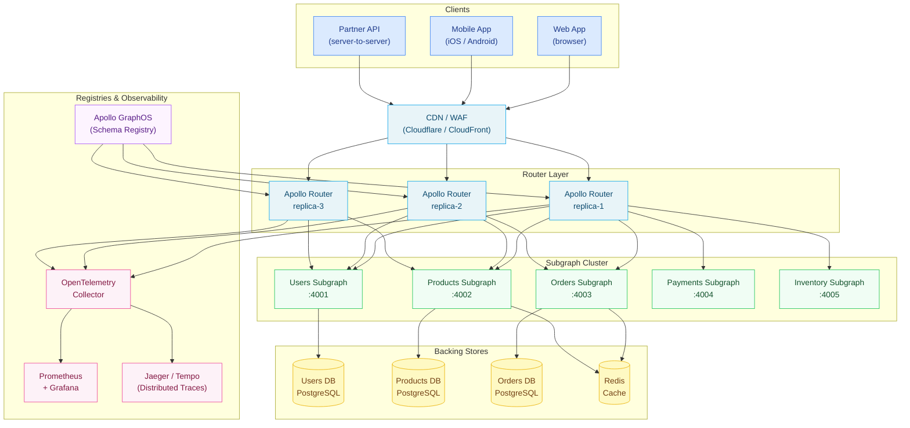

# 08 — Supergraph Architecture

> A supergraph is the composed, federated schema plus the runtime infrastructure that serves it. The schema
> is built from many independently-deployed subgraphs; Apollo Router (or a compatible gateway) executes
> queries against that schema at runtime. This chapter documents every layer: the router itself, its
> configuration surface, multi-variant schema management, and the operational practices required to run
> the supergraph reliably at enterprise scale.

---

## What Is the Supergraph?

The term **supergraph** has two distinct meanings that are often conflated and must be understood separately.

**The supergraph schema** is the unified, composed GraphQL schema produced by the Apollo Federation
composition engine. It is not served directly — clients never receive the raw supergraph SDL. Instead the
composition output (a supergraph SDL or a build artifact stored in Apollo GraphOS) is consumed by the
router at startup. The registry (Apollo GraphOS, WunderGraph Cosmo, or GraphQL Hive) is the source of
truth for this schema. Subgraph teams publish their partial schemas to the registry; the registry runs
composition and validates the result; the router fetches the composed schema on a polling interval or
webhook push.

**The supergraph runtime** is Apollo Router — a Rust binary that accepts client requests, runs the query
planner to determine which subgraphs to call, fans out the subgraph requests in parallel (or serially when
data dependencies require it), merges the responses, and streams the result back to the client. Apollo
Router also enforces authentication, applies rate limits, injects headers, emits OpenTelemetry traces and
Prometheus metrics, and can be extended via Rhai scripts or compiled Rust plugins.

The distinction matters operationally: the schema and the router are deployed independently. A subgraph
can publish a new schema version without restarting the router (hot reload). The router can be scaled
horizontally without touching any subgraph.

---

## Architecture Overview

---

## Prerequisites

Before working through this chapter, you should be comfortable with the concepts covered in
**Chapter 07 — Federation**:

- Apollo Federation v2 directives (`@key`, `@external`, `@provides`, `@requires`, `@shareable`, `@override`)
- Subgraph schema authoring and the `_entities` query
- The query planning algorithm and how entity resolution works
- The difference between a gateway (JavaScript, `@apollo/gateway`) and Apollo Router (Rust)
- Rover CLI basics: `rover subgraph publish`, `rover graph fetch`

If those concepts are unfamiliar, complete Chapter 07 first.

---

## Files in This Chapter

| File | Topic |
|------|-------|
| [01-apollo-router.md](./01-apollo-router.md) | Apollo Router architecture, `router.yaml` reference, WASM plugins, Rhai scripting |
| [02-router-configuration.md](./02-router-configuration.md) | Traffic shaping, entity caching, coprocessors, per-subgraph overrides, mTLS |
| [03-graph-variants.md](./03-graph-variants.md) | Apollo GraphOS variants, contract graphs, GitOps promotion, schema checks |
| [04-router-at-scale.md](./04-router-at-scale.md) | High availability, multi-region, cost analysis, disaster recovery, canary deploys |

---

## Key Tooling Referenced

- **Apollo Router** — the Rust-based supergraph runtime (open source, Apache 2.0)
- **Apollo GraphOS** — managed schema registry, launch checks, analytics, contract graphs
- **rover CLI** — the official CLI for interacting with Apollo GraphOS (publish, check, fetch, contract)
- **WunderGraph Cosmo** — open-source alternative schema registry and router (self-hosted)
- **GraphQL Hive** — open-source schema registry with schema checks and analytics (CDN delivery)

---

## Related Chapters

- Chapter 07 — Federation (subgraph authoring, `@key`, entity resolution)
- Chapter 09 — Schema Governance (breaking change policies, ownership, review workflow)
- Chapter 11 — CI/CD Automation (rover in pipelines, automated schema checks)
- Chapter 14 — Observability (OpenTelemetry integration, distributed tracing)
- Chapter 15 — Kubernetes Deployment (router Helm chart, HPA, resource tuning)
