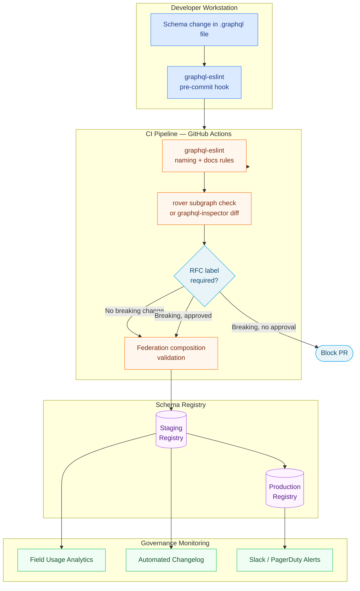

# 01 — Schema Governance Framework

> **Purpose:** Establish the organizational and technical foundation for schema governance — selecting the right governance model for your team structure, comparing tooling options, defining the RFC process for breaking changes, and composing the schema review board that enforces policy decisions.

## Learning Objectives

- [ ] Understand the three positions on the governance spectrum and the failure modes of each extreme
- [ ] Select the appropriate governance model given team size, subgraph count, and organizational structure
- [ ] Compare Apollo GraphOS, GraphQL Hive, WunderGraph Cosmo, and graphql-inspector on hosted/self-hosted capability, breaking change detection, and usage analytics
- [ ] Define an RFC process that scales from a 5-person startup to a 500-engineer enterprise
- [ ] Compose a schema review board with clear quorum rules, decision timelines, and escalation paths
- [ ] Configure graphql-eslint to enforce naming conventions and documentation requirements as automated policy

---

## Overview: What Schema Governance Actually Governs

Schema governance is frequently misunderstood as "schema review" — the practice of having someone read a schema diff before it merges. That is necessary but not sufficient. Full schema governance covers four domains:

**Structural governance** controls what changes can be made to the schema, in what order, and under what conditions. It answers: can this field be removed? Is this naming convention acceptable? Does this type need documentation? This domain is enforced through linting (graphql-eslint), breaking change detection (rover subgraph check, graphql-inspector), and composition validation.

**Process governance** controls who can make decisions about schema changes, how those decisions are communicated, and what approval is required before a change ships. It answers: who approves a breaking change RFC? What is the minimum migration window? Who is notified when a field is deprecated? This domain is enforced through RFC templates, PR labels, CODEOWNERS, and automated notifications.

**Operational governance** controls how schema changes move through environments, how rollbacks work, and how incidents are detected and resolved. This domain is enforced through CI/CD pipelines, staging publish gates, smoke tests, and on-call playbooks.

**Economic governance** tracks the cost of schema complexity — unused fields that must be maintained, over-broad types that create cross-team coupling, and schema growth that slows composition. This domain is driven by field usage analytics from Apollo GraphOS or GraphQL Hive.

A mature schema governance framework addresses all four domains. Most organizations start with structural governance (linting and breaking change detection) and add process governance as team count grows.

### Why Governance Fails Without Tooling

Organizations frequently adopt governance as a social contract: "we agreed in the team meeting that we won't remove fields without a deprecation period." Social contracts degrade under pressure. When a deadline approaches, a developer removes the field. When a new engineer joins, they don't know the convention. When a team grows from 3 to 15, the team meeting where the contract was made is distant history.

Every governance policy in this handbook has a corresponding technical enforcement mechanism. If you cannot point to a CI check, a linter rule, or a registry validation that enforces a policy, the policy does not reliably exist.

---

## Architecture: The Governance Stack

The governance stack sits between the subgraph developer and the production supergraph router. It intercepts schema changes at every stage of the delivery pipeline.



---

## Core Concepts

### The Governance Spectrum

Schema governance exists on a spectrum from complete centralization to complete decentralization. Neither extreme is viable at enterprise scale.

#### Centralized Governance

In centralized governance, a dedicated schema team owns all type definitions across the organization. Other teams submit schema change requests to the schema team, which designs and publishes the changes on their behalf.

**Advantages:**
- Complete consistency in naming, type design, and documentation
- A single team with deep schema expertise
- Clear accountability for schema quality

**Failure modes:**
- The schema team becomes a bottleneck. Feature teams cannot ship until the schema team processes their request. The schema team's queue grows; feature velocity drops.
- Schema design becomes disconnected from domain knowledge. The schema team does not understand the Orders domain deeply enough to make good decisions about the `Fulfillment` type — but they own it anyway.
- Resentment builds between the schema team and feature teams, eventually causing the governance model to be bypassed.

Centralized governance is practical for organizations with fewer than 3 subgraphs and fewer than 10 engineers touching the schema.

#### Pure Anarchy (Decentralized Without Policy)

In decentralized-without-policy, each team owns their subgraph and makes all schema decisions independently. There is no shared review process, no linting, and no breaking change detection.

**Advantages:**
- Maximum team autonomy and velocity
- No cross-team coordination overhead

**Failure modes:**
- Naming conventions diverge. The `products` subgraph uses `camelCase` for enum values; the `orders` subgraph uses `SCREAMING_SNAKE_CASE`. Both are technically valid GraphQL; both are now permanent inconsistencies.
- Breaking changes ship without warning. A developer renames `User.email` to `User.emailAddress` because it feels cleaner. Mobile clients that have not been updated begin returning errors.
- The supergraph composition fails in production because two subgraphs define conflicting types, and nobody catches it until a runtime query fails.
- No team can confidently remove anything because no team knows who is using what.

Pure decentralization without policy enforcement is common in early-stage organizations and consistently produces the same categories of incident.

#### Hybrid Governance (Recommended)

Hybrid governance separates policy from ownership. Each team owns their subgraph schema — they design it, they publish it, they deprecate fields on their timeline. But the policies that govern how changes can be made are centrally defined and technically enforced.

**The platform team's role in hybrid governance:**
- Defines and maintains the linting rules (graphql-eslint configuration)
- Maintains the CI pipeline that enforces breaking change detection
- Operates the schema registry (Apollo GraphOS, GraphQL Hive, or WunderGraph Cosmo)
- Chairs the schema review board
- Publishes and maintains the RFC template

**The feature team's role in hybrid governance:**
- Designs and owns their subgraph schema
- Is responsible for documenting fields and deprecation reasons
- Submits RFCs for breaking changes
- Monitors usage of their deprecated fields
- Provides migration guides for consumers of their schema

This model scales to hundreds of engineers and dozens of subgraphs because the platform team's governance work is amortized across all teams via shared tooling. The per-team overhead is low: follow the linter, run the check, write an RFC for breaking changes.

---

### Tooling Comparison

Selecting the right governance tool is an architectural decision. The choice affects self-hosting ability, compliance posture, vendor lock-in, and the richness of analytics available to drive deprecation decisions.

| Capability | Apollo GraphOS | GraphQL Hive | WunderGraph Cosmo | graphql-inspector |
|---|---|---|---|---|
| **Hosted (SaaS)** | Yes | Yes | Yes | No |
| **Self-hosted** | No (Enterprise only, partial) | Yes (Docker Compose) | Yes (Kubernetes, Helm chart) | Yes (CLI only) |
| **Schema registry** | Yes | Yes | Yes | No |
| **Breaking change detection** | Yes (via `rover subgraph check`) | Yes (via `hive schema:check`) | Yes (via `wgc subgraph check`) | Yes (via CLI diff) |
| **Operation usage tracking** | Yes (Apollo Studio) | Yes (usage reporting agent) | Yes (built-in to router) | No |
| **Field-level usage analytics** | Yes | Yes | Yes (in development) | No |
| **Federation v2 support** | Yes (native) | Yes | Yes (native, WG federation) | Partial |
| **Composition validation** | Yes | Yes | Yes | No |
| **Changelog generation** | Yes | Yes | Yes | Via CI scripting |
| **GraphQL-native access control** | Yes (Studio roles) | Yes (organization roles) | Yes (RBAC) | No |
| **Price model** | Paid (usage-based) | Open-source + paid hosted | Open-source + paid hosted | Free (MIT) |
| **Primary use case** | Apollo Federation orgs | Vendor-neutral / OSS | Federation + self-hosted | CLI scripting |

**Choosing between them:**

- **Apollo GraphOS**: Best choice when your organization is already committed to Apollo Federation and prefers a managed SaaS. The operation usage tracking is the most mature in the ecosystem, making it the best tool for confident field deprecation.

- **GraphQL Hive**: Best choice when your organization requires self-hosting for compliance (SOC 2, FedRAMP, data residency requirements) or wants vendor neutrality. The Docker Compose deployment is straightforward for most organizations.

- **WunderGraph Cosmo**: Best choice when your organization is building a new federated platform and wants a fully open-source, Kubernetes-native solution. The router, composition engine, and registry are all part of a single integrated system.

- **graphql-inspector**: Best choice as a supplementary tool when you want breaking change detection in CI without committing to a registry. Pairs well with any registry tool. Cannot replace a registry because it has no usage tracking.

---

### The RFC Process

An RFC (Request for Comments) is required for any schema change that is classified as breaking (see `03-breaking-change-policies.md` for the complete classification). The RFC serves two purposes: it forces the proposing team to think through the migration path before making the change, and it creates a written record of why the change was approved.

#### When an RFC is Required

An RFC is required when the proposed schema change:

1. Removes a field, type, argument, or directive from the public API
2. Changes the type of an existing field in a way that is not backward-compatible
3. Makes a nullable field non-nullable (changes the nullability contract)
4. Removes a value from an enum type
5. Changes `@key` fields on a federated entity type
6. Removes or renames a query or mutation root field
7. Changes an argument from optional to required

An RFC is NOT required for:
- Adding new fields to existing types
- Adding new optional arguments to existing fields
- Adding new query or mutation root fields
- Adding new enum values (with caveats — see `02-schema-lifecycle.md`)
- Adding new directive usage that does not affect the query planner
- Updating field descriptions and documentation

#### RFC Document Structure

The RFC template is stored in `.github/schema-rfc-template.md`. Every RFC must contain:

```markdown
# Schema RFC: [Short Title]

**Subgraph:** [name of affected subgraph]
**Proposed by:** [team name + GitHub handle of author]
**Date submitted:** [ISO 8601 date]
**Target merge window:** [e.g., "Week of 2026-06-01"]
**RFC status:** [ ] Draft | [ ] Submitted | [ ] Approved | [ ] Rejected | [ ] Implemented

---

## Summary

One paragraph describing the change and why it is needed. Include the business context.

## Proposed Schema Changes

\`\`\`graphql
# Before
type User {
  username: String!
}

# After
type User {
  username: String! @deprecated(reason: "Use `handle` instead")
  handle: String!
}
\`\`\`

## Breaking Change Classification

List each breaking change and its classification:
- `User.username` removal: **BREAKING** — removes existing field

## Client Impact Analysis

List all known clients that use the affected fields. Include data from Apollo GraphOS / Hive usage report:
- iOS app (team: mobile-clients) — uses `User.username` in 3 operations
- Partner API consumer (Acme Corp) — uses `User.username` in integration

## Migration Path

Step-by-step instructions for each affected client team:
1. Replace `username` with `handle` in all GraphQL operations
2. The fields return identical values during the transition period
3. `username` will be removed after [date]

## Migration SLA

**Deprecation date:** [date the @deprecated directive is added]
**Sunset warning date:** [date 30 days before removal, additional notice sent]
**Removal date:** [date the field is removed — minimum 90 days after deprecation]

## Rollback Plan

If the change causes unexpected production issues, describe how it will be reverted.

## Reviewer Sign-off

- [ ] Platform engineer (required)
- [ ] Domain engineer 1 (required)
- [ ] Domain engineer 2 (required)
- [ ] Affected client team lead (required if external team is impacted)
```

#### RFC Submission and Review Timeline

| Stage | Owner | SLA |
|---|---|---|
| Author drafts RFC | Proposing team | No SLA |
| RFC submitted (PR opened with `schema-rfc` label) | Proposing team | — |
| Initial triage | Schema review board chair | 2 business days |
| Review period open | All stakeholders | 5 business days |
| Review board decision | Schema review board | 2 business days after review period |
| RFC approved / rejected notification | Chair | Same day as decision |
| Implementation after approval | Proposing team | Within 30 days of approval |

---

### Schema Review Board

The schema review board is the decision-making body for breaking change RFCs. It is not a committee that reviews every schema change — routine changes (adding fields, updating descriptions) bypass the board entirely and are governed by automated CI.

#### Composition

The schema review board consists of:

- **1 Platform engineer** (permanent member, typically the chair): provides expertise on federation composition, registry operations, and tooling. Has veto power over changes that would break the supergraph or violate operational policies.

- **2 Domain engineers** (rotating, 3-month terms): senior engineers from feature teams. The rotation prevents the board from becoming a platform-only body that loses touch with the concerns of schema consumers and producers.

- **1 Client representative** (invited for RFCs that affect external clients): a lead from the mobile team or a partner integration team. Participates in the specific RFC discussion but is not a permanent board member.

#### Decision Rules

- **Quorum**: 3 of the permanent 3 members (platform + 2 domain engineers) must participate in the review. Decisions cannot be made without quorum.

- **Approval**: Simple majority of quorum participants. Abstentions count toward quorum but not toward the majority.

- **Rejection**: Any permanent member can block an RFC by voting "reject with required changes." The rejection must include specific, actionable feedback. The proposing team may revise and resubmit.

- **Escalation**: If the proposing team disagrees with a rejection, the RFC can be escalated to the VP of Engineering within 5 business days. The VP's decision is final.

- **Emergency approval**: A breaking change that is required to remediate a production security incident or data corruption issue may be approved by the platform engineer alone within 24 hours, with a post-hoc RFC submitted within 5 business days.

---

### Schema Change Lifecycle State Machine

The following state diagram captures the complete lifecycle of a schema change from initial draft through field removal.

```mermaid
stateDiagram-v2
    [*] --> Draft: Developer opens schema change PR

    Draft --> RFCSubmitted: Breaking change detected;\nPR labeled schema-rfc

    Draft --> CIValidation: Non-breaking change;\nno RFC required

    RFCSubmitted --> Approved: Schema review board\napproves RFC

    RFCSubmitted --> Rejected: Schema review board\nrejects RFC

    Rejected --> Draft: Author revises RFC

    Rejected --> [*]: Author abandons change

    Approved --> CIValidation: PR labeled\napproved-breaking-change

    CIValidation --> StagingPublished: All CI checks pass;\nPR merged

    CIValidation --> Draft: CI fails;\nauthor fixes issues

    StagingPublished --> ProductionPublished: Staging smoke tests pass;\nCD pipeline promotes

    StagingPublished --> Draft: Staging tests fail;\nautomatic rollback

    ProductionPublished --> Deprecated: @deprecated directive added\nto affected fields

    ProductionPublished --> [*]: Non-breaking change;\nno deprecation cycle needed

    Deprecated --> SunsetWarning: Usage monitoring shows\nconsumers still present;\n30-day warning issued

    Deprecated --> Removed: Usage drops to 0;\nfield safe to remove

    SunsetWarning --> Removed: Migration SLA expires\nor usage drops to 0

    Removed --> [*]: Field gone from schema
```

---

## Real-World Implementation

### graphql-eslint Configuration

The following graphql-eslint configuration enforces naming conventions, documentation requirements, and deprecation best practices across all subgraphs. Store this in the repository root as `.graphqlrc.yml` or configure it per-subgraph.

```yaml
# .graphqlrc.yml
schema: "./schema.graphql"
documents: "./src/**/*.graphql"
extensions:
  languageService:
    cacheSchemas: true
```

```javascript
// .eslintrc.js (or eslint.config.js for flat config)
module.exports = {
  overrides: [
    {
      files: ["*.graphql", "**/*.graphql"],
      parser: "@graphql-eslint/eslint-plugin",
      parserOptions: {
        schema: "./schema.graphql",
        // For federation subgraphs, point to the federated schema
        // schema: { "http://localhost:4001/graphql": {} }
      },
      plugins: ["@graphql-eslint"],
      rules: {
        // --- Naming Conventions ---
        "@graphql-eslint/naming-convention": [
          "error",
          {
            // Types: PascalCase
            "TypeDefinition": { style: "PascalCase" },
            // Fields: camelCase
            "FieldDefinition": { style: "camelCase" },
            // Arguments: camelCase
            "InputValueDefinition": { style: "camelCase" },
            // Enum values: UPPER_CASE
            "EnumValueDefinition": { style: "UPPER_CASE" },
            // Fragments (in operations): PascalCase
            "FragmentDefinition": { style: "PascalCase" },
          },
        ],

        // --- Documentation Requirements ---
        // All public types must have descriptions
        "@graphql-eslint/require-description": [
          "error",
          {
            types: true,
            FieldDefinition: true,
            InputValueDefinition: false, // relax for input args
            EnumValueDefinition: false,  // relax for enum values
          },
        ],

        // --- Deprecation Rules ---
        // @deprecated must include a reason
        "@graphql-eslint/no-deprecated": "warn",

        // --- Schema Design Rules ---
        // No fields named `id` on non-root types without a type prefix
        // (custom rule — see custom-rules/prefixed-id.js)

        // Avoid overly generic types
        "@graphql-eslint/no-typename-prefix": "error",

        // All queries/mutations must be named (no anonymous operations)
        "@graphql-eslint/no-anonymous-operations": "error",

        // --- Federation-Specific ---
        // @key fields must be non-nullable scalar or ID
        // (enforced via rover subgraph check composition)

        // --- Relay / Pagination ---
        // Connections must follow Relay pagination spec
        "@graphql-eslint/relay-arguments": "warn",
        "@graphql-eslint/relay-connection-types": "warn",
        "@graphql-eslint/relay-edge-types": "warn",
        "@graphql-eslint/relay-page-info": "warn",
      },
    },
  ],
};
```

### Pre-Commit Hook with Husky

Enforce linting before commits reach CI, reducing the feedback loop from minutes to seconds.

```bash
# Install dependencies
npm install --save-dev husky @graphql-eslint/eslint-plugin graphql

# Initialize husky
npx husky install
npx husky add .husky/pre-commit "npx eslint --ext .graphql ."
```

### GitHub Actions Lint Workflow

```yaml
# .github/workflows/schema-lint.yml
name: Schema Lint

on:
  pull_request:
    paths:
      - "**.graphql"
      - ".eslintrc.js"
      - ".graphqlrc.yml"

jobs:
  lint:
    name: Lint GraphQL Schema
    runs-on: ubuntu-latest
    steps:
      - name: Checkout
        uses: actions/checkout@v4

      - name: Setup Node.js
        uses: actions/setup-node@v4
        with:
          node-version: "20"
          cache: "npm"

      - name: Install dependencies
        run: npm ci

      - name: Run graphql-eslint
        run: npx eslint --ext .graphql . --format json --output-file lint-results.json
        continue-on-error: true

      - name: Annotate PR with lint results
        uses: ataylorme/eslint-annotate-action@v2
        with:
          report-json: "lint-results.json"
        env:
          GITHUB_TOKEN: ${{ secrets.GITHUB_TOKEN }}

      - name: Fail on lint errors
        run: |
          ERRORS=$(jq '[.[].messages[] | select(.severity == 2)] | length' lint-results.json)
          if [ "$ERRORS" -gt "0" ]; then
            echo "Found $ERRORS ESLint errors"
            exit 1
          fi
```

---

## Production Considerations

### Performance

graphql-eslint runs the full schema parse on every invocation, which is acceptably fast (< 2s) for schemas up to ~5,000 lines. For very large schemas (monorepos with dozens of subgraphs), consider:

- Running graphql-eslint only on changed `.graphql` files using `eslint --cache`
- Running it per-subgraph in parallel matrix jobs rather than on the full composed schema

The `rover subgraph check` call makes a network request to the Apollo GraphOS API. Budget 10–30 seconds per call in CI. If multiple subgraphs are checked in one pipeline run, parallelize the checks.

### Security

The schema registry contains your complete API surface, which is valuable information for an attacker. Apply the following controls regardless of which registry tool you use:

- **API key rotation**: Apollo GraphOS graph keys and GraphQL Hive tokens should be rotated quarterly and stored as GitHub Actions secrets, not hardcoded in workflow files.
- **Least privilege for CI keys**: The CI key should have `publish` permission to the specific graph/subgraph, not admin access to the organization.
- **Audit logs**: Apollo GraphOS and GraphQL Hive both maintain audit logs of schema publishes. Enable log export to your SIEM.
- **Schema as sensitive asset**: Do not publish your production schema to a public GraphQL Hive instance. Self-host or use a private workspace.

### Scaling Governance

As the number of subgraphs grows, governance overhead grows proportionally if you are not careful. Mitigate this:

- **Automate the RFC triage**: Use a GitHub Actions workflow to automatically label PRs as `needs-rfc` when `rover subgraph check` detects a breaking change. Reduce manual triage work.
- **Schema review board rotation**: A board that meets weekly with a predictable two-day review window prevents RFC backlogs.
- **Self-service for safe changes**: The CI pipeline should be fast enough that non-breaking changes can merge on the author's schedule without waiting for any human review.

### Observability

Instrument governance as a first-class metric:

```yaml
# Governance metrics to track (publish to your observability platform)
governance_metrics:
  - name: schema_change_lead_time_hours
    description: Time from PR open to production publish
    target: p50 < 24h for safe changes, p50 < 5 business days for breaking changes

  - name: rfc_compliance_rate
    description: Percentage of breaking changes that went through RFC process
    target: 100%
    alert_threshold: < 95% over trailing 30 days

  - name: breaking_changes_in_production
    description: Number of unplanned breaking changes detected in production
    target: 0
    alert_threshold: > 0 per month

  - name: deprecated_field_usage_count
    description: Number of deprecated fields with active usage after SLA expiry
    target: 0
    alert_threshold: > 0 per subgraph
```

---

## Best Practices

1. **Start with linting before adding a registry.** graphql-eslint with naming convention rules gives you 80% of the benefit of a full governance framework with minimal infrastructure investment. Add the registry when you have multiple teams publishing independently.

2. **Make the RFC process lightweight.** The RFC template above is thorough but not bureaucratic. An RFC should take 1–2 hours to write for straightforward breaking changes. If it takes longer, the change is probably too large to be a single PR.

3. **Tie the breaking change gate to PR labels, not file names.** The `approved-breaking-change` label approach allows the RFC process to be decoupled from the CI pipeline — governance board approves in GitHub, CI enforces via label presence.

4. **Publish to staging before production, always.** The staging publish is the canary that catches composition failures. A composition failure in staging is an incident drill. A composition failure in production is an incident.

5. **Use the operations registry for deprecation decisions, not intuition.** "Nobody is using this field" is not sufficient justification for removal. The operations registry (Apollo GraphOS Studio, GraphQL Hive usage report) provides a ground-truth record of which operations were executed in the last 30/60/90 days. Use it.

6. **Document the governance process in the schema itself.** Use schema descriptions to explain not just what a field does, but when it was deprecated, what replaces it, and when it will be removed. Descriptions are visible in any GraphQL explorer and serve as in-situ documentation that does not go stale.

7. **Review board decisions must be written.** The approval or rejection of an RFC must include a written rationale. Oral decisions in a Slack thread evaporate; written decisions in the RFC PR become searchable history.

---

## Anti-Patterns

**Anti-pattern: Using the schema review board as a design committee.** The board's mandate is to evaluate breaking change risk and approve or reject RFCs. It should not redesign the schema on behalf of the proposing team. If the board has design concerns, it returns the RFC with feedback; the proposing team revises. The board does not write the revised RFC.

**Anti-pattern: Bypassing CI with emergency deploys.** When a production incident creates urgency, the temptation to push a schema change directly to the registry is strong. This bypasses composition validation and may introduce a second incident. Emergency changes should still flow through CI with an expedited approval, not bypass it.

**Anti-pattern: Treating graphql-eslint as optional.** An `.eslintrc.js` configuration that is not enforced in CI has no governance value. Every lint rule must be enforced as a required CI status check on every PR that touches a `.graphql` file.

**Anti-pattern: RFC theater.** Writing an RFC with the foregone conclusion that it will be approved, then doing a fast-track review with no real scrutiny, defeats the purpose of the process. The review board must have genuine authority to reject or request changes.

**Anti-pattern: A governance process with no SLAs.** If an RFC can sit unreviewed for 3 weeks, feature teams will route around the process or stop submitting breaking changes through it. Published SLAs with public tracking create accountability.

---

## Operational Notes

- **graphql-eslint version pinning**: Pin the graphql-eslint version in `package.json` and update it deliberately. Linter upgrades can introduce new failing rules that break all PRs unexpectedly.

- **Schema review board meeting cadence**: Weekly 30-minute synchronous session is recommended. Async review for straightforward RFCs; sync discussion for complex ones.

- **RFC numbering**: Number RFCs sequentially (RFC-001, RFC-002) and store them in `docs/schema-rfcs/`. This creates a searchable history of governance decisions.

- **Governance retrospective**: Quarterly retrospective of governance metrics. Is the RFC process creating bottlenecks? Are breaking changes slipping through? Adjust the policy, not just the enforcement.

---

## References

- [Apollo GraphOS Schema Checks documentation](https://www.apollographql.com/docs/graphos/delivery/schema-checks/)
- [GraphQL Hive — Schema Registry and Usage Reporting](https://the-guild.dev/graphql/hive/docs)
- [graphql-eslint rules reference](https://the-guild.dev/graphql/eslint/rules)
- [WunderGraph Cosmo — Schema Federation and Governance](https://cosmo-docs.wundergraph.com/)
- [The Guild — GraphQL Inspector documentation](https://the-guild.dev/graphql/inspector/docs)

---

## Related Topics

- [02 — Schema Lifecycle](./02-schema-lifecycle.md) — field deprecation, sunset policies, and the @deprecated directive
- [03 — Breaking Change Policies](./03-breaking-change-policies.md) — `rover subgraph check`, override procedures, and emergency protocols
- [04 — Team Governance](./04-team-governance.md) — subgraph ownership, cross-team coordination, and on-call for schema incidents
- [11 — CI/CD Automation](../11-ci-cd-automation/README.md) — complete CI/CD pipeline patterns that include governance gates
- [07 — Federation](../07-federation/README.md) — Apollo Federation v2 fundamentals required for understanding federated governance
