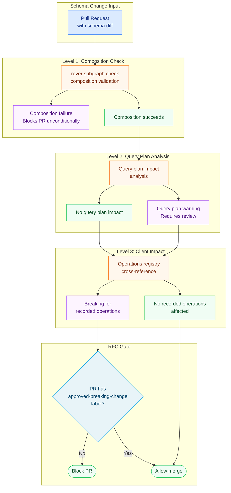

# 03 — Breaking Change Policies

> **Purpose:** Define what constitutes a breaking change in the context of Apollo Federation, establish the technical enforcement mechanism via `rover subgraph check` and the operations registry, document the override policy for emergencies, and provide a complete, production-ready GitHub Actions workflow that enforces these policies on every pull request.

## Learning Objectives

- [ ] Distinguish breaking changes in a federated supergraph from breaking changes in a monolithic GraphQL API
- [ ] Understand how `rover subgraph check` uses the operations registry to detect client-impacting breaks versus theoretical breaks
- [ ] Configure the Apollo GraphOS operations registry to collect operation signatures from production traffic
- [ ] Implement a GitHub Actions workflow that blocks PRs with unapproved breaking changes
- [ ] Apply the override policy for emergencies, including the post-hoc RFC requirement
- [ ] Use the dual-field `@override` pattern to implement a field rename without a breaking change
- [ ] Identify "safe unsafe" changes that are technically breaking but can be executed safely with proper coordination

---

## Overview: Why Federation Changes the Breaking Change Definition

In a monolithic GraphQL API, a breaking change is straightforward: if a query that was valid before the change becomes invalid or returns different data after the change, it is breaking. The definition is schema-level — it can be evaluated purely by diffing the old and new SDL.

In a federated supergraph, the definition becomes more nuanced. The supergraph is composed from multiple subgraph schemas, and changes can break at three different levels:

**Level 1: Composition breaking.** The change prevents the supergraph from composing at all. This is the most severe class — the entire supergraph becomes unresolvable. Example: removing a `@key` field that another subgraph uses to reference an entity.

**Level 2: Query plan breaking.** The change composes successfully but changes how the router plans queries, potentially causing runtime failures for specific operations. Example: adding `@requires` to a field that was previously independently resolvable.

**Level 3: Client breaking.** The change composes and plans correctly but causes errors or unexpected behavior for specific client operations. Example: removing a field that clients are actively querying.

Schema-level diffing tools (graphql-inspector) can detect levels 1 and 3. Only a tool with access to the operations registry (rover subgraph check, Hive schema:check) can reliably detect level 3 in terms of client impact — it knows which operations are in use and can cross-reference the change against them.

The architecture of the breaking change detection pipeline must address all three levels.



---

## Core Concepts

### Federation-Specific Breaking Changes

The following categories of breaking changes are specific to federated schemas or have additional nuance compared to monolithic GraphQL.

#### 1. Removing or Modifying @key Fields

The `@key` directive designates the fields that uniquely identify an entity across the federation. Any subgraph that references an entity type relies on the `@key` fields to resolve cross-subgraph queries.

```graphql
# users-subgraph — BEFORE
type User @key(fields: "id") {
  id: ID!
  handle: String!
}

# users-subgraph — AFTER (breaking: id is no longer the key)
type User @key(fields: "handle") {
  handle: String!
  email: String!
}
```

This change breaks at level 1 (composition failure) for any subgraph that references `User` by `id`. The composition engine cannot build a valid query plan because the key used by the referring subgraph no longer exists.

**Safe migration path:** Add the new key while retaining the old key, using `@key(fields: "id") @key(fields: "handle")`, and migrate references across subgraphs over multiple deployments. Remove the old key only after all referring subgraphs have been updated.

#### 2. Changes to Entity Resolver Input Shape

Entity resolvers are called by the router with the key fields as input. If the key shape changes, the router cannot construct valid entity resolution requests.

```typescript
// In users-subgraph resolver — BEFORE
// Router calls: { __typename: "User", id: "123" }
User: {
  __resolveReference({ id }: { id: string }) {
    return db.users.findById(id);
  }
}

// AFTER key change to `handle` — router now calls:
// { __typename: "User", handle: "alice" }
User: {
  __resolveReference({ handle }: { handle: string }) {
    return db.users.findByHandle(handle);
  }
}
```

The entity resolver shape must match the `@key` field definition. Any mismatch causes runtime entity resolution failures.

#### 3. Adding @requires Without Careful Coordination

The `@requires` directive tells the query planner that a field in subgraph B needs specific fields from subgraph A in order to resolve. Adding `@requires` is not immediately client-breaking — the query still returns — but it changes the query plan.

```graphql
# products-subgraph — BEFORE
type Product @key(fields: "id") {
  id: ID!
  price: Float!
}

# products-subgraph — AFTER (adds @requires for fulfillment cost calculation)
extend type User @key(fields: "id") {
  id: ID! @external
  shippingRegion: String! @external
}

type Product @key(fields: "id") {
  id: ID!
  price: Float!
  # Now requires User.shippingRegion from the users-subgraph
  adjustedPrice(userId: ID!): Float! @requires(fields: "shippingRegion")
}
```

If the `users-subgraph` does not expose `shippingRegion`, the composition fails. If it does expose it but the field name changes, the composition fails. This is a composition-level breaking change that requires coordinated deployment across subgraphs.

#### 4. Removing @provides (Performance Breaking, Not Client Breaking)

`@provides` is an optimization hint that tells the query planner a subgraph can provide fields that are technically owned by another subgraph. Removing `@provides` is technically safe for the client API surface but may cause performance regressions by forcing the router to make an additional subgraph call.

```graphql
# orders-subgraph — BEFORE
type Order @key(fields: "id") {
  id: ID!
  # @provides tells the router: if you're already hitting the orders subgraph,
  # I can give you User.name without an additional trip to the users subgraph
  user: User! @provides(fields: "name")
}

# orders-subgraph — AFTER (removes @provides — one more network hop per order query)
type Order @key(fields: "id") {
  id: ID!
  user: User!
}
```

Classification: not technically client-breaking, but should be reviewed for latency impact before merging.

#### 5. Changing @shareable Field Types

In Apollo Federation v2, `@shareable` marks a field as resolvable by multiple subgraphs. If the type of a `@shareable` field differs between subgraphs, composition fails.

```graphql
# subgraph-a
type Position @shareable {
  x: Float!  # Float
  y: Float!
}

# subgraph-b — BREAKING: type mismatch on @shareable field
type Position @shareable {
  x: Int!  # Int — composition fails
  y: Int!
}
```

`@shareable` fields must have identical types across all subgraphs that declare them.

---

### rover subgraph check: Mechanics

`rover subgraph check` is the primary tool for automated breaking change detection in the Apollo ecosystem. Understanding its mechanics is essential for interpreting its output correctly.

#### How rover subgraph check Works

The check operation sends your proposed subgraph schema to the Apollo GraphOS service, which:

1. **Runs composition** against the proposed subgraph schema combined with all other subgraphs in the target variant. If composition fails, the check fails immediately with a composition error.

2. **Diffs the proposed supergraph schema** against the current production supergraph schema. This produces a list of changes, each tagged as `FAILURE`, `WARNING`, or `NOTICE`.

3. **Cross-references changes against the operations registry.** The operations registry contains operation signatures collected from production traffic over the last 30 days (configurable). For each schema change classified as potentially breaking, the check queries the registry: "is there any recorded operation that would be affected by this change?" If the answer is yes, the check fails. If the answer is no — the field was never queried — the check passes, even if the change is theoretically breaking.

This registry-based check is the key differentiator from pure schema diffing. It allows you to safely remove a field that has never been queried in production, which would otherwise be classified as a breaking change by a schema-only diff.

#### What the Operations Registry Contains

The operations registry is populated by the Apollo Router's built-in operation reporting. Every operation that reaches the router is normalized (whitespace stripped, field ordering normalized, operation name preserved) and its signature is sent to Apollo GraphOS.

```yaml
# router.yaml — configure operation reporting to populate the registry
telemetry:
  apollo:
    # Required: set your graph reference
    graph_ref: "my-graph@production"

    # Operation signatures are sent every 60 seconds
    batch_processor:
      max_export_batch_size: 1000
      scheduled_delay: 60s

    # Include client identification for per-client usage breakdowns
    # (reads from request headers)
    client_name_header: "apollographql-client-name"
    client_version_header: "apollographql-client-version"
```

For GraphQL Hive, the usage reporting agent performs the equivalent function:

```typescript
// In the router or gateway — configure Hive usage reporting
import { createYoga } from "graphql-yoga";
import { useHive } from "@graphql-hive/client";

const yoga = createYoga({
  plugins: [
    useHive({
      token: process.env.HIVE_TOKEN,
      usage: { enabled: true },
      reporting: { enabled: true, author: "router", commit: process.env.GIT_SHA },
    }),
  ],
});
```

#### Interpreting rover subgraph check Output

```bash
# Example rover subgraph check invocation
rover subgraph check my-graph@production \
  --schema ./users-subgraph/schema.graphql \
  --name users \
  --format json \
  > check-result.json

# Example output (formatted for readability)
{
  "data": {
    "composition": {
      "checkSchemaResult": {
        "targetUrl": "https://studio.apollographql.com/graph/my-graph/checks/...",
        "diffToPrevious": {
          "numberOfCheckedOperations": 1247,
          "changes": [
            {
              "code": "FIELD_REMOVED",
              "description": "Field `User.username` was removed from object type `User`",
              "severity": "FAILURE",
              "affectedClients": [
                {
                  "clientName": "ios-app",
                  "affectedOperationCount": 3
                },
                {
                  "clientName": "android-app",
                  "affectedOperationCount": 2
                }
              ]
            },
            {
              "code": "FIELD_ADDED",
              "description": "Field `User.handle` was added to object type `User`",
              "severity": "NOTICE",
              "affectedClients": []
            }
          ]
        }
      }
    }
  }
}
```

The `severity` field takes three values:
- `FAILURE`: The change breaks one or more recorded operations. The check fails.
- `WARNING`: The change is potentially breaking but no recorded operations are affected. The check passes but flags for review.
- `NOTICE`: The change is safe. Informational only.

The `affectedClients` array shows exactly which clients sent operations that would break. This is the data that drives client notification.

---

### The Operations Registry Coverage Problem

`rover subgraph check` is only as reliable as the operations registry data. A field that has been queried by a client only once in the past 30 days will appear in the registry. A field queried exclusively by a client that does not report to the registry (an undeclared client, a client using persisted queries with no registry reporting, a partner API that bypasses the router) will not appear — and the check will incorrectly classify its removal as safe.

Mitigate registry coverage gaps:

1. **Enforce router-level operation reporting for all clients.** Every client must route through the Apollo Router or a proxy that reports to the registry. Direct subgraph access bypasses both reporting and breaking change detection.

2. **Configure a minimum operations threshold.** Do not use the check result alone for fields with fewer than N recorded operations in 30 days. Treat low-usage fields as potentially uncovered.

3. **Use graphql-inspector as a secondary check** for schema-level diff analysis that does not depend on the operations registry:

```bash
# graphql-inspector schema:diff — purely schema-level, no registry needed
npx graphql-inspector schema:diff \
  old-schema.graphql \
  new-schema.graphql \
  --rule suppressRemovalOfDeprecatedField
```

4. **Require opt-in client registration.** Require all clients that consume the schema to register in a client registry (even a simple spreadsheet). The client registry is the ground truth for "who could be affected by this change."

---

## Real-World Implementation: Complete GitHub Actions Breaking Change Workflow

The following GitHub Actions workflow provides production-grade breaking change enforcement. It runs on every pull request that modifies a `.graphql` file, checks for breaking changes using `rover subgraph check`, and blocks the PR if breaking changes are found without the `approved-breaking-change` label.

```yaml
# .github/workflows/schema-breaking-change.yml
name: Schema Breaking Change Check

on:
  pull_request:
    paths:
      - "**/*.graphql"
      - "subgraphs/*/schema.graphql"
    types: [opened, synchronize, reopened, labeled, unlabeled]

env:
  APOLLO_KEY: ${{ secrets.APOLLO_KEY }}
  APOLLO_VCS_COMMIT: ${{ github.sha }}

jobs:
  # ────────────────────────────────────────────────────────────
  # Job 1: Detect which subgraphs changed in this PR
  # ────────────────────────────────────────────────────────────
  detect-changed-subgraphs:
    name: Detect Changed Subgraphs
    runs-on: ubuntu-latest
    outputs:
      subgraphs: ${{ steps.changes.outputs.subgraphs }}
      has_changes: ${{ steps.changes.outputs.has_changes }}
    steps:
      - name: Checkout
        uses: actions/checkout@v4
        with:
          fetch-depth: 0

      - name: Detect changed subgraph schemas
        id: changes
        run: |
          # Find subgraph directories that contain changed .graphql files
          CHANGED_FILES=$(git diff --name-only origin/${{ github.base_ref }}...HEAD)
          
          SUBGRAPHS=()
          while IFS= read -r file; do
            if [[ "$file" =~ ^subgraphs/([^/]+)/schema\.graphql$ ]]; then
              SUBGRAPH="${BASH_REMATCH[1]}"
              SUBGRAPHS+=("$SUBGRAPH")
            fi
          done <<< "$CHANGED_FILES"
          
          # Deduplicate
          UNIQUE_SUBGRAPHS=($(echo "${SUBGRAPHS[@]}" | tr ' ' '\n' | sort -u | tr '\n' ' '))
          
          if [ ${#UNIQUE_SUBGRAPHS[@]} -eq 0 ]; then
            echo "has_changes=false" >> "$GITHUB_OUTPUT"
            echo "subgraphs=[]" >> "$GITHUB_OUTPUT"
          else
            echo "has_changes=true" >> "$GITHUB_OUTPUT"
            # Output as JSON array for matrix strategy
            SUBGRAPHS_JSON=$(printf '%s\n' "${UNIQUE_SUBGRAPHS[@]}" | jq -R . | jq -sc .)
            echo "subgraphs=$SUBGRAPHS_JSON" >> "$GITHUB_OUTPUT"
            echo "Changed subgraphs: $SUBGRAPHS_JSON"
          fi

  # ────────────────────────────────────────────────────────────
  # Job 2: Run rover subgraph check for each changed subgraph
  # ────────────────────────────────────────────────────────────
  breaking-change-check:
    name: Check ${{ matrix.subgraph }} for Breaking Changes
    runs-on: ubuntu-latest
    needs: detect-changed-subgraphs
    if: needs.detect-changed-subgraphs.outputs.has_changes == 'true'
    strategy:
      fail-fast: false  # Check all subgraphs even if one fails
      matrix:
        subgraph: ${{ fromJson(needs.detect-changed-subgraphs.outputs.subgraphs) }}
    
    steps:
      - name: Checkout
        uses: actions/checkout@v4

      - name: Install rover CLI
        run: |
          curl -sSL https://rover.apollo.dev/nix/latest | sh
          echo "$HOME/.rover/bin" >> "$GITHUB_PATH"

      - name: Load subgraph configuration
        id: config
        run: |
          # Load subgraph metadata from a config file in each subgraph directory
          # subgraphs/$SUBGRAPH/.governance.json contains:
          # { "graphId": "my-graph", "variant": "production", "subgraphName": "users" }
          CONFIG_FILE="subgraphs/${{ matrix.subgraph }}/.governance.json"
          if [ ! -f "$CONFIG_FILE" ]; then
            echo "ERROR: Missing .governance.json in subgraphs/${{ matrix.subgraph }}"
            exit 1
          fi
          
          GRAPH_ID=$(jq -r '.graphId' "$CONFIG_FILE")
          VARIANT=$(jq -r '.variant' "$CONFIG_FILE")
          SUBGRAPH_NAME=$(jq -r '.subgraphName' "$CONFIG_FILE")
          
          echo "graph_id=$GRAPH_ID" >> "$GITHUB_OUTPUT"
          echo "variant=$VARIANT" >> "$GITHUB_OUTPUT"
          echo "subgraph_name=$SUBGRAPH_NAME" >> "$GITHUB_OUTPUT"

      - name: Run rover subgraph check
        id: rover_check
        run: |
          SCHEMA_FILE="subgraphs/${{ matrix.subgraph }}/schema.graphql"
          GRAPH_REF="${{ steps.config.outputs.graph_id }}@${{ steps.config.outputs.variant }}"
          SUBGRAPH_NAME="${{ steps.config.outputs.subgraph_name }}"
          
          echo "Checking $SUBGRAPH_NAME against $GRAPH_REF"
          
          rover subgraph check "$GRAPH_REF" \
            --schema "$SCHEMA_FILE" \
            --name "$SUBGRAPH_NAME" \
            --format json \
            > check-result-${{ matrix.subgraph }}.json \
            || true  # Don't fail here; we parse the result below
          
          cat check-result-${{ matrix.subgraph }}.json | jq '.'

      - name: Parse breaking changes and enforce RFC policy
        id: enforce_policy
        run: |
          RESULT_FILE="check-result-${{ matrix.subgraph }}.json"
          
          # Check if rover returned an error (composition failure)
          if jq -e '.error' "$RESULT_FILE" > /dev/null 2>&1; then
            ERROR_MSG=$(jq -r '.error.message' "$RESULT_FILE")
            echo "COMPOSITION FAILURE: $ERROR_MSG"
            
            # Composition failures always block — no RFC override possible
            echo "::error title=Composition Failure (${{ matrix.subgraph }})::$ERROR_MSG"
            exit 1
          fi
          
          # Extract breaking changes
          BREAKING_CHANGES=$(jq '[
            .data.composition.checkSchemaResult.diffToPrevious.changes[] 
            | select(.severity == "FAILURE")
          ]' "$RESULT_FILE")
          
          BREAKING_COUNT=$(echo "$BREAKING_CHANGES" | jq 'length')
          
          echo "breaking_count=$BREAKING_COUNT" >> "$GITHUB_OUTPUT"
          
          if [ "$BREAKING_COUNT" -eq "0" ]; then
            echo "No breaking changes detected for ${{ matrix.subgraph }}"
            exit 0
          fi
          
          echo "Breaking changes detected ($BREAKING_COUNT):"
          echo "$BREAKING_CHANGES" | jq -r '.[] | "  - [\(.severity)] \(.description)"'
          
          # Check for RFC approval label
          PR_LABELS=$(gh pr view "${{ github.event.pull_request.number }}" \
            --json labels \
            --jq '[.labels[].name]')
          
          HAS_RFC_LABEL=$(echo "$PR_LABELS" | jq 'contains(["approved-breaking-change"])')
          
          if [ "$HAS_RFC_LABEL" = "true" ]; then
            echo "Breaking changes are approved (approved-breaking-change label present)"
            
            # Post an informational comment summarizing the approved breaking changes
            SUMMARY=$(echo "$BREAKING_CHANGES" | jq -r '.[] | "- \(.description) (affects: \(.affectedClients | map(.clientName) | join(", ")))"' | head -20)
            
            gh pr comment "${{ github.event.pull_request.number }}" \
              --body "**Schema Breaking Change Check — ${{ matrix.subgraph }}**

Approved breaking changes detected:
$SUMMARY

RFC label \`approved-breaking-change\` is present. Proceeding with merge." \
              || true  # Don't fail if comment cannot be posted
            
            exit 0
          else
            # Breaking changes without RFC label — block the PR
            AFFECTED_CLIENTS=$(echo "$BREAKING_CHANGES" | jq -r '
              [.[].affectedClients[] | .clientName] | unique | .[]
            ' | sort | head -10)
            
            echo "::error title=Breaking Changes Require RFC (${{ matrix.subgraph }})::Breaking changes detected that affect recorded client operations. Apply the approved-breaking-change label after completing the RFC process."
            
            # Post a blocking comment with details
            CHANGES_LIST=$(echo "$BREAKING_CHANGES" | jq -r '.[] | "- **\(.code)**: \(.description)"')
            CLIENTS_LIST=$(echo "$AFFECTED_CLIENTS" | sed 's/^/- /')
            
            gh pr comment "${{ github.event.pull_request.number }}" \
              --body "**Schema Breaking Change Check — ${{ matrix.subgraph }} — BLOCKED**

Breaking changes were detected that affect recorded client operations.

**Breaking changes:**
$CHANGES_LIST

**Affected clients:**
$CLIENTS_LIST

**What to do:**
1. Complete the [Schema RFC process](../docs/09-schema-governance/01-governance-framework.md#rfc-process)
2. Get approval from the Schema Review Board
3. Have a board member apply the \`approved-breaking-change\` label to this PR
4. Re-run this check

If this is an emergency, contact the platform team in \`#schema-governance\`." \
              || true
            
            exit 1
          fi
        env:
          GH_TOKEN: ${{ secrets.GITHUB_TOKEN }}

      - name: Upload check results as artifact
        if: always()
        uses: actions/upload-artifact@v4
        with:
          name: schema-check-${{ matrix.subgraph }}-${{ github.sha }}
          path: check-result-${{ matrix.subgraph }}.json
          retention-days: 30

  # ────────────────────────────────────────────────────────────
  # Job 3: Post summary to PR when all checks complete
  # ────────────────────────────────────────────────────────────
  breaking-change-summary:
    name: Schema Check Summary
    runs-on: ubuntu-latest
    needs: [detect-changed-subgraphs, breaking-change-check]
    if: always() && needs.detect-changed-subgraphs.outputs.has_changes == 'true'
    steps:
      - name: Post overall summary
        run: |
          if [ "${{ needs.breaking-change-check.result }}" = "success" ]; then
            STATUS="All schema checks passed"
            ICON="✓"
          else
            STATUS="One or more schema checks failed"
            ICON="✗"
          fi
          
          echo "$ICON $STATUS for subgraphs: ${{ needs.detect-changed-subgraphs.outputs.subgraphs }}"
        env:
          GH_TOKEN: ${{ secrets.GITHUB_TOKEN }}
```

### Subgraph Governance Configuration File

Each subgraph must include a `.governance.json` configuration that the CI workflow reads:

```json
{
  "graphId": "my-supergraph",
  "variant": "production",
  "subgraphName": "users",
  "team": "users-platform",
  "slackChannel": "#users-team-graphql",
  "breakingChangeSLA": 90,
  "enterpriseClients": false,
  "oncallRotation": "users-oncall"
}
```

---

### The Override Policy: Emergency Breaking Changes

The RFC process exists to protect consumers. Emergency situations — security vulnerabilities, data corruption, compliance requirements — can create pressure to bypass the process. The override policy defines exactly what authority is granted and what obligations are created by using it.

#### When Override Is Authorized

An emergency override (breaking change deployed without completing the normal RFC review cycle) is authorized only when:

1. The change is required to remediate an active security incident (data exposure, unauthorized access)
2. The change is required to stop active data corruption or data loss
3. A compliance deadline (regulatory, contractual) cannot be met under the normal 5-business-day RFC review timeline
4. **AND** a written written justification is provided to the platform team before the change is deployed

#### Override Authorization Chain

```
Proposing engineer → Platform on-call engineer → VP Engineering (final authority)
```

The VP Engineering sign-off is required before a breaking change is deployed via override. In a security incident at 2am, this means waking up the VP. This is intentional: the consequence makes the override rare.

#### Override Procedure

```bash
# Emergency override procedure — execute only after VP sign-off

# Step 1: Tag the commit with the override reason
git tag -a "schema-override-$(date +%Y%m%d)-$SUBGRAPH_NAME" \
  -m "Emergency override: [reason]. Authorized by: [VP name]. Incident: [incident ID]"

# Step 2: Force-apply the approved-breaking-change label via GitHub API
gh pr edit $PR_NUMBER \
  --add-label "approved-breaking-change" \
  --add-label "emergency-override"

# Step 3: Document in the incident Slack channel
# #schema-governance: "Emergency schema override approved for users subgraph.
#   PR #1234. Authorized by: Jane Smith (VP Eng). Incident: INC-4567."

# Step 4: Proceed with normal CI merge
# The approved-breaking-change label causes the CI gate to pass
```

#### Post-Hoc Obligations After Override

Within 5 business days of an emergency override:
1. The proposing team submits a post-hoc RFC documenting the change, the incident, and the business justification
2. The schema review board retroactively reviews and documents the decision
3. The affected clients are notified immediately (no SLA grace period — the change is already in production)
4. A migration guide is published within 24 hours of the override deployment

Failure to complete post-hoc obligations results in the proposing team's next RFC being escalated to VP review regardless of complexity.

---

### Retroactive Deprecation

Retroactive deprecation is the practice of adding `@deprecated` to a field that has been in production without a deprecation directive, in preparation for its eventual removal. This is safe and does not require RFC approval — adding `@deprecated` is not a breaking change.

```graphql
# Adding @deprecated retroactively to a field that has always existed
type User {
  """
  The user's login name.

  DEPRECATED (retroactive): Previously undocumented deprecation.
  Use `handle` instead. Removal date: 2026-09-01.
  RFC: https://github.com/org/repo/pull/1456
  """
  username: String!
    @deprecated(reason: "Use `handle` instead. Removal date: 2026-09-01.")

  handle: String!
}
```

Retroactive deprecation is appropriate when:
- The field was always intended to be temporary but the deprecation was not added at the time
- A design review identifies an old field as suboptimal and schedules it for replacement
- A security review identifies a field that exposes more data than necessary

---

### The Dual-Field Pattern: Safe Field Rename

Renaming a field in GraphQL is always breaking — it is a combination of removing the old field and adding a new field. The dual-field pattern executes a field rename without a breaking change by running both fields simultaneously during the migration period.

This pattern uses Apollo Federation's `@override` directive to handle the case where the rename spans a subgraph boundary.

#### Within a Single Subgraph

```graphql
# Step 1: Add the new field — non-breaking
type User @key(fields: "id") {
  id: ID!
  username: String!  # existing field

  """
  The user's public handle. Replaces `username`.
  """
  handle: String!    # new field — resolves to the same value
}
```

```typescript
// Resolver: both fields return the same underlying value
const resolvers = {
  User: {
    // Both resolve to the same database column
    username: (user: UserRecord) => user.handle_value,
    handle: (user: UserRecord) => user.handle_value,
  },
};
```

```graphql
# Step 2 (after migration SLA): Deprecate the old field
type User @key(fields: "id") {
  id: ID!
  username: String! @deprecated(reason: "Use `handle` instead. Removal: 2026-09-01.")
  handle: String!
}
```

```graphql
# Step 3 (after zero usage confirmed): Remove the old field
type User @key(fields: "id") {
  id: ID!
  handle: String!
}
```

#### Across Subgraphs Using @override

When a field needs to be renamed and ownership moves between subgraphs, `@override` provides a controlled migration path:

```graphql
# users-subgraph — original owner
type User @key(fields: "id") {
  id: ID!
  username: String!
}

# profile-subgraph — new owner (during migration)
type User @key(fields: "id") {
  id: ID! @external

  # @override tells the query planner: I own this field now, ignore users-subgraph
  # label: "username-to-handle-migration" — enables gradual traffic shifting (progressive @override)
  handle: String! @override(from: "users", label: "username-to-handle-migration")
}
```

Progressive `@override` (Apollo Federation v2.7+) allows traffic to be shifted gradually between the old and new field implementation, enabling a canary-style migration:

```yaml
# router.yaml — enable progressive @override
override_propagation:
  username-to-handle-migration:
    percentage: 10  # Start at 10% — shift 10% of traffic to profile-subgraph's handle field
```

---

## Production Considerations

### Performance: rover subgraph check Latency in CI

`rover subgraph check` makes a synchronous HTTP request to the Apollo GraphOS API and can take 15–45 seconds for large schemas with many recorded operations. Optimize CI performance:

- Run checks in parallel using the matrix strategy (as shown in the workflow above)
- Cache the rover binary installation between runs using GitHub Actions cache
- Use `--background` flag (available in Apollo GraphOS Enterprise) for non-blocking async checks with a status callback

### Security: Protecting APOLLO_KEY in CI

The `APOLLO_KEY` is an organization-level credential that provides access to all schemas in your Apollo GraphOS account. Treat it with the same care as database credentials:

- Store it as an encrypted GitHub Actions secret, never as an environment variable in `.github/workflows/` files
- Use a graph-scoped API key rather than a user key when possible
- Rotate the key quarterly
- Use different keys for staging and production graph variants
- Review Apollo Studio audit logs quarterly for unexpected key usage

### Scaling: Multi-Subgraph Monorepo Patterns

For organizations with 10+ subgraphs in a monorepo, the matrix strategy above can generate 10+ parallel jobs on every PR. Optimize:

```yaml
# Limit parallel jobs to avoid exhausting runner capacity
strategy:
  fail-fast: false
  max-parallel: 5  # Never run more than 5 rover checks simultaneously
  matrix:
    subgraph: ${{ fromJson(needs.detect-changed-subgraphs.outputs.subgraphs) }}
```

Consider using self-hosted GitHub Actions runners for schema check jobs, as they have predictable capacity and faster artifact access.

### Observability: Tracking Policy Compliance

```typescript
// Emit governance metrics after each PR merge to main
// Track: did breaking changes go through the RFC process?

interface GovernanceEvent {
  type: "schema_merge";
  subgraph: string;
  hadBreakingChanges: boolean;
  hadRFCLabel: boolean;
  hadEmergencyOverride: boolean;
  checkResult: "pass" | "fail" | "skip";
  prNumber: number;
  mergedAt: string;
}

async function recordGovernanceEvent(event: GovernanceEvent): Promise<void> {
  // RFC compliance rate = events where hadBreakingChanges && hadRFCLabel / total breaking change events
  const isCompliant =
    !event.hadBreakingChanges ||
    event.hadRFCLabel ||
    event.hadEmergencyOverride;

  // Post to your governance metrics endpoint or observability platform
  await fetch(process.env.GOVERNANCE_METRICS_ENDPOINT!, {
    method: "POST",
    headers: { "content-type": "application/json" },
    body: JSON.stringify({ ...event, isCompliant }),
  });
}
```

---

## Best Practices

1. **Always run `rover subgraph check` against the production variant, not staging.** Staging may have different operation signatures or may be missing client traffic from partners. Production has the authoritative operations registry data.

2. **Combine rover subgraph check with graphql-inspector for defense in depth.** rover subgraph check requires network access and Apollo GraphOS credentials. graphql-inspector runs offline and can catch schema-level breaks that are not reflected in the operations registry (new clients, partner APIs not reporting to the registry).

3. **Archive check results as CI artifacts.** The JSON output from `rover subgraph check` is the evidentiary record that the RFC process was followed. Retain it for 30 days minimum.

4. **Post check results as PR comments, not just CI status.** Engineers on the PR thread need to understand what broke and for which clients, not just that a check failed. The workflow above posts structured comments.

5. **Test the CI workflow itself.** The schema governance CI workflow is governance infrastructure. Maintain a suite of test PRs (or test repositories) that trigger each branch of the workflow to verify it behaves correctly before it is needed in production.

6. **Treat composition failures differently from client-breaking changes.** Composition failures block the supergraph for all consumers. They are never acceptable, not even with an RFC approval. The workflow must hard-fail on composition errors with no override path.

---

## Anti-Patterns

**Anti-pattern: Using schema-only diff as the sole breaking change gate.** A field with zero recorded operations in the registry is safe to remove even if schema diffing classifies it as "BREAKING". Requiring RFC approval for fields that nobody queries creates unnecessary overhead and trains teams to ignore the process.

**Anti-pattern: Checking against staging instead of production.** Staging may have fewer clients reporting operations. A check against staging may show "no affected operations" while the production registry shows 10,000 affected operations per day.

**Anti-pattern: The `approved-breaking-change` label as a rubber stamp.** The label should only be applied after genuine RFC review. If the label is applied as a workaround to get a PR unblocked without completing the RFC process, the governance system has been defeated.

**Anti-pattern: Skipping the check for "internal" fields.** Internal fields (used only within the company, not by external partners) still require breaking change review. Internal clients have their own deployment schedules and cannot absorb uncoordinated breaking changes.

**Anti-pattern: Not validating the operations registry has meaningful coverage.** If the router has been running for only 3 days, the operations registry contains only 3 days of traffic. A field queried monthly would not appear. Check the registry coverage period and compare it to your field usage patterns before relying on the "no affected operations" determination.

---

## Operational Notes

- **rover CLI version pinning**: Pin the rover CLI version in CI to avoid behavior changes from upgrades. The `curl -sSL https://rover.apollo.dev/nix/latest` installer installs the latest version. Use the versioned installer URL instead: `https://rover.apollo.dev/nix/v0.23.0`.

- **GraphQL Hive alternative**: If using GraphQL Hive instead of Apollo GraphOS, replace `rover subgraph check` with `hive schema:check --registry.accessToken $HIVE_TOKEN --registry.endpoint $HIVE_ENDPOINT`. The PR workflow structure is identical.

- **WunderGraph Cosmo alternative**: Use `wgc subgraph check $SUBGRAPH_NAME --schema $SCHEMA_FILE --routing-url $ROUTING_URL` with your Cosmo Cloud token.

- **graphql-inspector fallback**: If neither Apollo GraphOS nor Hive is available, use `npx graphql-inspector schema:diff $OLD_SCHEMA $NEW_SCHEMA --format json` as a schema-level fallback. It cannot detect client impact but can detect composition-level breaks.

---

## References

- [Apollo rover CLI — subgraph check](https://www.apollographql.com/docs/rover/commands/subgraphs#subgraph-check)
- [Apollo GraphOS — Schema Checks configuration](https://www.apollographql.com/docs/graphos/delivery/schema-checks)
- [graphql-inspector — schema:diff documentation](https://the-guild.dev/graphql/inspector/docs/essentials/diff)
- [Apollo Federation — @override directive](https://www.apollographql.com/docs/federation/federated-types/federated-directives#override)
- [Apollo Federation — Progressive @override](https://www.apollographql.com/docs/federation/entities/migrate-fields/)
- [GraphQL Hive — Schema Checks](https://the-guild.dev/graphql/hive/docs/management/schema-checks)

---

## Related Topics

- [01 — Governance Framework](./01-governance-framework.md) — the RFC process and review board that authorize breaking changes
- [02 — Schema Lifecycle](./02-schema-lifecycle.md) — the @deprecated directive and field lifecycle model
- [04 — Team Governance](./04-team-governance.md) — cross-team coordination for breaking changes that affect multiple subgraphs
- [11 — CI/CD Automation](../11-ci-cd-automation/README.md) — complete pipeline patterns including staging promotion gates
- [07 — Federation](../07-federation/README.md) — @key, @override, @requires, @provides directive semantics
