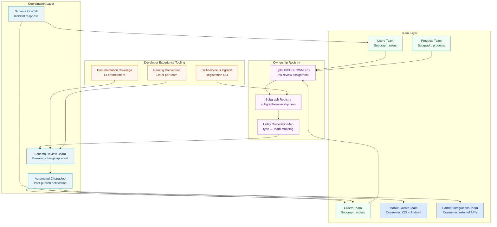

# 04 — Team Governance in a Federated Organization

> **Purpose:** Define the organizational structures, coordination patterns, and operational procedures that make schema governance work across multiple teams — covering subgraph ownership models, the cross-team RFC process, automated schema changelog generation, on-call responsibilities for schema incidents, and the developer experience tools that make governance self-service rather than bureaucratic.

## Learning Objectives

- [ ] Design a subgraph ownership registry that maps every type and field to a responsible team
- [ ] Resolve the "who owns the @key" question when entity definitions span subgraph boundaries
- [ ] Execute the cross-subgraph RFC process for changes that affect multiple owning teams
- [ ] Implement automated schema changelog generation and Slack delivery after each staging publish
- [ ] Define what constitutes a schema incident and respond to it using the incident playbook
- [ ] Track governance compliance metrics and use them to improve the process over time
- [ ] Configure the developer experience tooling that reduces governance overhead per team

---

## Overview: Governance is Organizational Infrastructure

The tools covered in previous sections — graphql-eslint, rover subgraph check, the RFC template — are technical systems. They enforce policies that were designed by people and serve organizational goals. Technical governance without organizational governance is a linter with no one reading the output.

Team governance addresses the organizational dimension: who is responsible for each piece of the schema, how do teams coordinate when their schemas interact, what happens when something breaks in production, and how does the organization track whether its governance investment is working.

In a federated supergraph, organizational design and schema design are coupled. The boundaries of your subgraphs reflect — and reinforce — the boundaries of your teams. Conway's Law applies directly to GraphQL federation: your supergraph will mirror your organizational chart. Team governance is the practice of making that mirroring deliberate rather than accidental.

### The Three Coordination Problems in Federated Governance

**Coordination problem 1: Entity ownership ambiguity.** When the `Orders` subgraph defines a `User` entity with `@key(fields: "id")` to reference users in order records, and the `Users` subgraph is the canonical owner of the `User` type, who is responsible for the `@key` definition in the `Orders` subgraph? What happens if the Users team changes the `User.id` field?

**Coordination problem 2: Cross-subgraph breaking changes.** A change to the `Users` subgraph that removes a field can break the `Orders` subgraph if the Orders subgraph uses that field in a `@requires` directive. The Users team does not own the Orders subgraph and may not know about the dependency. The breaking change check catches this at the schema level, but the coordination — who notifies whom, who is responsible for the fix — requires organizational policy.

**Coordination problem 3: Deprecation coordination.** When a field is deprecated in the `Users` subgraph, the consuming team with the highest-priority migration path may not be the team that depends most urgently on the field. Coordinating migration priorities across multiple consumer teams requires a defined process.

---

## Architecture: The Federated Team Governance Stack



---

## Core Concepts

### The Subgraph Ownership Registry

The subgraph ownership registry is the source of truth for which team owns each subgraph and which team is responsible for each entity type in the supergraph. It is a structured configuration file stored in the repository root, not a wiki page or Confluence document.

```json
// subgraph-ownership.json — root of the monorepo
{
  "$schema": "https://internal.engineering/schemas/subgraph-ownership.json",
  "version": "1.0",
  "lastUpdated": "2026-01-15",
  "subgraphs": {
    "users": {
      "team": "users-platform",
      "slackChannel": "#users-team-graphql",
      "oncallRotation": "users-oncall",
      "schemaPath": "subgraphs/users/schema.graphql",
      "routingUrl": {
        "staging": "https://users-staging.internal/graphql",
        "production": "https://users.internal/graphql"
      },
      "breakingChangeSLA": 90,
      "externalConsumers": false,
      "governanceFile": "subgraphs/users/.governance.json",
      "rfcContacts": [
        "alice@company.com",
        "bob@company.com"
      ]
    },
    "orders": {
      "team": "fulfillment-eng",
      "slackChannel": "#fulfillment-graphql",
      "oncallRotation": "fulfillment-oncall",
      "schemaPath": "subgraphs/orders/schema.graphql",
      "routingUrl": {
        "staging": "https://orders-staging.internal/graphql",
        "production": "https://orders.internal/graphql"
      },
      "breakingChangeSLA": 90,
      "externalConsumers": false,
      "governanceFile": "subgraphs/orders/.governance.json",
      "rfcContacts": [
        "carol@company.com"
      ]
    },
    "products": {
      "team": "catalog-team",
      "slackChannel": "#catalog-graphql",
      "oncallRotation": "catalog-oncall",
      "schemaPath": "subgraphs/products/schema.graphql",
      "routingUrl": {
        "staging": "https://products-staging.internal/graphql",
        "production": "https://products.internal/graphql"
      },
      "breakingChangeSLA": 180,
      "externalConsumers": true,
      "externalConsumerContact": "partner-apis@company.com",
      "governanceFile": "subgraphs/products/.governance.json",
      "rfcContacts": [
        "dave@company.com",
        "eve@company.com"
      ]
    }
  },
  "entityOwnership": {
    "User": "users",
    "Order": "orders",
    "OrderLineItem": "orders",
    "Product": "products",
    "ProductVariant": "products",
    "Review": "reviews",
    "ShippingAddress": "users"
  },
  "reviewBoard": {
    "chair": "frank@company.com",
    "permanentMembers": [
      "frank@company.com",
      "grace@company.com",
      "henry@company.com"
    ],
    "rotationTermMonths": 3,
    "meetingSchedule": "Mondays 14:00 UTC",
    "rfcReviewSLADays": 5,
    "decisionSLADays": 2
  }
}
```

### CODEOWNERS for Subgraph Schema Files

The GitHub CODEOWNERS file extends subgraph ownership into the PR review process. Changes to a subgraph's schema automatically request review from the owning team:

```
# .github/CODEOWNERS

# Platform team reviews all governance configuration
/subgraph-ownership.json          @company/platform-eng
/.github/workflows/schema-*.yml   @company/platform-eng
/docs/09-schema-governance/       @company/platform-eng

# Users subgraph — users-platform team must review schema changes
/subgraphs/users/schema.graphql   @company/users-platform

# Orders subgraph — fulfillment-eng team must review schema changes
/subgraphs/orders/schema.graphql  @company/fulfillment-eng

# Products subgraph — catalog-team must review schema changes
/subgraphs/products/schema.graphql @company/catalog-team

# Review board members review all RFCs (label: schema-rfc)
# Note: label-based CODEOWNERS requires a GitHub Action — not native CODEOWNERS
# See .github/workflows/rfc-routing.yml
```

---

### Who Owns the @key?

The `@key` directive in Apollo Federation marks which fields uniquely identify an entity. When the `Orders` subgraph references the `User` entity, it re-declares `User` with `@key(fields: "id")`. This creates a subtle ownership question: who is responsible for keeping the `@key` declaration in the `Orders` subgraph aligned with the canonical `User` type definition in the `Users` subgraph?

**Policy: The canonical subgraph owns the @key definition. Referring subgraphs own their @external declarations.**

This means:
- The `Users` team owns `type User @key(fields: "id")` in the users subgraph
- The `Orders` team owns `extend type User @key(fields: "id") { id: ID! @external }` in the orders subgraph
- When the `Users` team proposes changing the `@key` from `id` to `(fields: "id externalId")`, they must notify all teams that have `@external` declarations of `User` — because those teams must update their declarations in a coordinated deploy

The responsibility for identifying affected referring subgraphs falls on the `Users` team as part of their RFC. The `entityOwnership` map in `subgraph-ownership.json` enables this: query the map for all entity references to find affected teams.

```bash
#!/bin/bash
# find-entity-references.sh — identify which subgraphs reference a given entity type
# Usage: ./find-entity-references.sh User

ENTITY_TYPE="$1"
OWNERSHIP_FILE="subgraph-ownership.json"

# Find all subgraph schema files
SUBGRAPHS=$(jq -r '.subgraphs | to_entries[] | .value.schemaPath' "$OWNERSHIP_FILE")

echo "Subgraphs that reference entity $ENTITY_TYPE:"
while IFS= read -r schema_path; do
  if grep -q "extend type $ENTITY_TYPE\|@key.*$ENTITY_TYPE\|: $ENTITY_TYPE" "$schema_path" 2>/dev/null; then
    SUBGRAPH_NAME=$(basename "$(dirname "$schema_path")")
    TEAM=$(jq -r ".subgraphs.\"$SUBGRAPH_NAME\".team" "$OWNERSHIP_FILE")
    CHANNEL=$(jq -r ".subgraphs.\"$SUBGRAPH_NAME\".slackChannel" "$OWNERSHIP_FILE")
    echo "  - $SUBGRAPH_NAME (team: $TEAM, channel: $CHANNEL)"
  fi
done <<< "$SUBGRAPHS"
```

---

### Cross-Subgraph RFC Process

A cross-subgraph RFC is required when a proposed change to one subgraph's schema affects another subgraph's schema — for example, changing a `@key` field that is `@external` in other subgraphs, or removing a field that is referenced via `@requires` in a downstream subgraph.

The cross-subgraph RFC adds two steps to the standard RFC process:

1. **Impact assessment**: The proposing team must identify all affected subgraphs using the entity reference search above and include them in the RFC.

2. **Multi-team sign-off**: The RFC must include sign-off from the owning team of every affected subgraph, in addition to the standard review board approval.

```markdown
# Cross-Subgraph RFC Section (additional to standard RFC template)

## Affected Subgraphs

| Subgraph | Owning Team | Impact | Required Migration |
|---|---|---|---|
| orders | fulfillment-eng | `@external` User declaration must add `externalId` field | Update `extend type User` declaration |
| reviews | content-team | `@requires(fields: "id externalId")` on Review.authorProfile | Update @requires fields list |

## Cross-Team Coordination Timeline

| Milestone | Date | Owner |
|---|---|---|
| RFC submitted | 2026-01-20 | users-platform |
| All affected teams notified | 2026-01-20 | users-platform |
| fulfillment-eng sign-off | 2026-01-25 (5 days) | fulfillment-eng |
| content-team sign-off | 2026-01-25 (5 days) | content-team |
| Review board decision | 2026-01-27 | review board |
| Coordinated deployment | Week of 2026-02-10 | all teams |

## Coordinated Deployment Plan

Subgraph deployments must happen in this order:
1. users-subgraph: Add `externalId` field and new `@key(fields: "id externalId")`
2. orders-subgraph: Update `@external` declaration (can deploy same day as step 1)
3. reviews-subgraph: Update `@requires` to include `externalId` (deploy after step 1 is stable)

## Multi-Team Sign-offs

- [ ] users-platform (proposing team)
- [ ] fulfillment-eng (@external owner)
- [ ] content-team (@requires dependent)
- [ ] Schema Review Board
```

---

### Schema Changelog: Automated Generation and Delivery

After each successful staging publish, the CI pipeline generates a schema changelog and posts it to the relevant Slack channels. This is the primary communication mechanism for schema changes to consuming teams.

#### Changelog Generation Script

```typescript
// scripts/generate-changelog.ts
// Generates a structured schema changelog by comparing current and previous schema versions

import { buildSchema, lexicographicSortSchema, printSchema } from "graphql";
import { diff } from "@graphql-inspector/core";
import * as fs from "fs";

interface SchemaChange {
  message: string;
  path: string;
  type:
    | "FIELD_ADDED"
    | "FIELD_REMOVED"
    | "FIELD_DEPRECATED"
    | "FIELD_TYPE_CHANGED"
    | "TYPE_ADDED"
    | "TYPE_REMOVED"
    | "ARGUMENT_ADDED"
    | "ARGUMENT_REMOVED"
    | string;
  breaking: boolean;
  dangerous: boolean;
}

interface ChangelogEntry {
  subgraph: string;
  team: string;
  slackChannel: string;
  publishedAt: string;
  gitSha: string;
  changes: SchemaChange[];
  breakingChanges: SchemaChange[];
  safeChanges: SchemaChange[];
}

async function generateChangelog(
  subgraphName: string,
  previousSchemaPath: string,
  currentSchemaPath: string
): Promise<ChangelogEntry> {
  const ownership = JSON.parse(
    fs.readFileSync("subgraph-ownership.json", "utf-8")
  );
  const subgraphConfig = ownership.subgraphs[subgraphName];

  if (!subgraphConfig) {
    throw new Error(`Subgraph ${subgraphName} not found in ownership registry`);
  }

  const previousSDL = fs.readFileSync(previousSchemaPath, "utf-8");
  const currentSDL = fs.readFileSync(currentSchemaPath, "utf-8");

  const previousSchema = lexicographicSortSchema(buildSchema(previousSDL));
  const currentSchema = lexicographicSortSchema(buildSchema(currentSDL));

  const changes = diff(previousSchema, currentSchema) as SchemaChange[];

  const breakingChanges = changes.filter((c) => c.breaking);
  const safeChanges = changes.filter((c) => !c.breaking);

  return {
    subgraph: subgraphName,
    team: subgraphConfig.team,
    slackChannel: subgraphConfig.slackChannel,
    publishedAt: new Date().toISOString(),
    gitSha: process.env.GIT_SHA || "unknown",
    changes,
    breakingChanges,
    safeChanges,
  };
}

export { generateChangelog, ChangelogEntry, SchemaChange };
```

#### Slack Notification Script

```typescript
// scripts/post-publish-notification.ts
// Posts schema change summary to Slack after a successful staging publish

import { ChangelogEntry, SchemaChange } from "./generate-changelog";

interface SlackBlock {
  type: string;
  [key: string]: unknown;
}

function buildSlackMessage(
  entry: ChangelogEntry
): { text: string; blocks: SlackBlock[] } {
  const hasBreaking = entry.breakingChanges.length > 0;
  const icon = hasBreaking ? ":warning:" : ":white_check_mark:";
  const headerText = hasBreaking
    ? `${icon} Breaking schema changes published to staging — *${entry.subgraph}*`
    : `${icon} Schema update published to staging — *${entry.subgraph}*`;

  const blocks: SlackBlock[] = [
    // Header
    {
      type: "header",
      text: {
        type: "plain_text",
        text: `Schema Update: ${entry.subgraph}`,
        emoji: true,
      },
    },

    // Summary line
    {
      type: "section",
      text: {
        type: "mrkdwn",
        text: headerText,
      },
      accessory: {
        type: "button",
        text: { type: "plain_text", text: "View in Studio", emoji: true },
        url: `https://studio.apollographql.com/graph/${process.env.APOLLO_GRAPH_ID}/changelog`,
        action_id: "view_studio",
      },
    },

    // Divider
    { type: "divider" },

    // Metadata
    {
      type: "section",
      fields: [
        {
          type: "mrkdwn",
          text: `*Team:*\n${entry.team}`,
        },
        {
          type: "mrkdwn",
          text: `*Published:*\n${new Date(entry.publishedAt).toLocaleString("en-US", { timeZone: "UTC" })} UTC`,
        },
        {
          type: "mrkdwn",
          text: `*Commit:*\n<https://github.com/${process.env.GITHUB_REPOSITORY}/commit/${entry.gitSha}|\`${entry.gitSha.slice(0, 8)}\`>`,
        },
        {
          type: "mrkdwn",
          text: `*Changes:*\n${entry.breakingChanges.length} breaking, ${entry.safeChanges.length} safe`,
        },
      ],
    },
  ];

  // Breaking changes section (if any)
  if (entry.breakingChanges.length > 0) {
    blocks.push({ type: "divider" });
    blocks.push({
      type: "section",
      text: {
        type: "mrkdwn",
        text: `:warning: *Breaking Changes (${entry.breakingChanges.length})*`,
      },
    });

    // Show up to 5 breaking changes inline; link to full report for more
    const displayBreaking = entry.breakingChanges.slice(0, 5);
    const breakingList = displayBreaking
      .map((c) => `• \`${c.path}\` — ${c.message}`)
      .join("\n");

    blocks.push({
      type: "section",
      text: {
        type: "mrkdwn",
        text: breakingList,
      },
    });

    if (entry.breakingChanges.length > 5) {
      blocks.push({
        type: "context",
        elements: [
          {
            type: "mrkdwn",
            text: `_...and ${entry.breakingChanges.length - 5} more breaking changes. View the full changelog in Apollo Studio._`,
          },
        ],
      });
    }
  }

  // Safe changes section (summarized)
  if (entry.safeChanges.length > 0) {
    blocks.push({ type: "divider" });
    blocks.push({
      type: "section",
      text: {
        type: "mrkdwn",
        text: `:white_check_mark: *Safe Changes (${entry.safeChanges.length})*`,
      },
    });

    const displaySafe = entry.safeChanges.slice(0, 3);
    const safeList = displaySafe
      .map((c) => `• \`${c.path}\` — ${c.message}`)
      .join("\n");

    blocks.push({
      type: "section",
      text: { type: "mrkdwn", text: safeList },
    });

    if (entry.safeChanges.length > 3) {
      blocks.push({
        type: "context",
        elements: [
          {
            type: "mrkdwn",
            text: `_...and ${entry.safeChanges.length - 3} more safe changes._`,
          },
        ],
      });
    }
  }

  // Action buttons
  blocks.push({ type: "divider" });
  blocks.push({
    type: "actions",
    elements: [
      {
        type: "button",
        text: { type: "plain_text", text: "View Schema Changelog", emoji: true },
        url: `https://studio.apollographql.com/graph/${process.env.APOLLO_GRAPH_ID}/changelog`,
        style: hasBreaking ? "danger" : "primary",
        action_id: "view_changelog",
      },
      {
        type: "button",
        text: { type: "plain_text", text: "View PR", emoji: true },
        url: `https://github.com/${process.env.GITHUB_REPOSITORY}/pull/${process.env.PR_NUMBER}`,
        action_id: "view_pr",
      },
    ],
  });

  return {
    text: headerText,
    blocks,
  };
}

async function notifySchemaChange(entry: ChangelogEntry): Promise<void> {
  const webhookUrl = process.env.SLACK_WEBHOOK_URL;
  if (!webhookUrl) {
    console.warn("SLACK_WEBHOOK_URL not set — skipping Slack notification");
    return;
  }

  const message = buildSlackMessage(entry);

  const response = await fetch(webhookUrl, {
    method: "POST",
    headers: { "Content-Type": "application/json" },
    body: JSON.stringify(message),
  });

  if (!response.ok) {
    const body = await response.text();
    throw new Error(`Slack notification failed: ${response.status} — ${body}`);
  }

  console.log(`Schema change notification posted to ${entry.slackChannel}`);

  // If there are breaking changes, also notify consuming team channels
  if (entry.breakingChanges.length > 0) {
    await notifyConsumers(entry);
  }
}

async function notifyConsumers(entry: ChangelogEntry): Promise<void> {
  // Load consumer registry to find which teams consume this subgraph
  // In a real implementation, this comes from the subgraph-ownership.json
  // "consumers" field or from the Apollo GraphOS field usage report

  const ownership = JSON.parse(
    require("fs").readFileSync("subgraph-ownership.json", "utf-8")
  );

  const consumers: Array<{ team: string; channel: string }> =
    ownership.consumers?.[entry.subgraph] || [];

  for (const consumer of consumers) {
    const consumerWebhookUrl =
      process.env[
        `SLACK_WEBHOOK_${consumer.channel.replace("#", "").replace(/-/g, "_").toUpperCase()}`
      ];

    if (!consumerWebhookUrl) {
      console.warn(
        `No webhook configured for ${consumer.channel} — skipping consumer notification`
      );
      continue;
    }

    const consumerMessage = {
      text: `:warning: Breaking schema changes in *${entry.subgraph}* may affect your team`,
      blocks: [
        {
          type: "section",
          text: {
            type: "mrkdwn",
            text: `:warning: *Action Required: Schema Changes in ${entry.subgraph}*\n\nThe *${entry.team}* team has published breaking schema changes that may affect your operations.\n\n*Breaking changes (${entry.breakingChanges.length}):*\n${entry.breakingChanges
              .slice(0, 3)
              .map((c: SchemaChange) => `• \`${c.path}\` — ${c.message}`)
              .join("\n")}`,
          },
        },
        {
          type: "actions",
          elements: [
            {
              type: "button",
              text: { type: "plain_text", text: "View Migration Guide" },
              url: `https://engineering.internal/schema-rfcs/latest`,
              action_id: "view_migration",
            },
            {
              type: "button",
              text: { type: "plain_text", text: "Contact Schema Team" },
              url: `https://slack.com/app_redirect?channel=${entry.slackChannel.replace("#", "")}`,
              action_id: "contact_team",
            },
          ],
        },
      ],
    };

    const resp = await fetch(consumerWebhookUrl, {
      method: "POST",
      headers: { "Content-Type": "application/json" },
      body: JSON.stringify(consumerMessage),
    });

    if (resp.ok) {
      console.log(`Consumer notification sent to ${consumer.channel}`);
    } else {
      console.error(
        `Failed to notify ${consumer.channel}: ${resp.status}`
      );
    }
  }
}

export { notifySchemaChange, buildSlackMessage };
```

#### GitHub Actions Integration for Post-Publish Notification

```yaml
# .github/workflows/schema-publish.yml (post-publish step)

- name: Generate and post schema changelog
  if: success()
  run: |
    # Fetch the previous schema from the registry for comparison
    rover subgraph fetch "${{ env.APOLLO_GRAPH_ID }}@staging" \
      --name "${{ matrix.subgraph }}" \
      > previous-schema-${{ matrix.subgraph }}.graphql

    # Generate the changelog
    npx ts-node scripts/generate-and-notify.ts \
      --subgraph "${{ matrix.subgraph }}" \
      --previous "previous-schema-${{ matrix.subgraph }}.graphql" \
      --current "subgraphs/${{ matrix.subgraph }}/schema.graphql"
  env:
    SLACK_WEBHOOK_URL: ${{ secrets.SCHEMA_CHANGELOG_WEBHOOK }}
    APOLLO_GRAPH_ID: ${{ secrets.APOLLO_GRAPH_ID }}
    GIT_SHA: ${{ github.sha }}
    PR_NUMBER: ${{ github.event.pull_request.number }}
    GITHUB_REPOSITORY: ${{ github.repository }}
```

---

### On-Call for Schema Incidents

Schema incidents are a distinct category of production incident. They require specific expertise (GraphQL federation, composition, schema registry operations) and have specific response procedures.

#### What Constitutes a Schema Incident

| Event | Incident? | Severity | Immediate action |
|---|---|---|---|
| Composition failure in production | Yes | P0 | Roll back the schema publish that caused the failure |
| Field removal that caused client errors | Yes | P1 | Add the field back with an emergency publish; notify affected clients |
| Supergraph serving 5XX errors after schema publish | Yes | P0 | Roll back schema publish; investigate composition |
| Deprecated field removal with active usage | Yes | P1 | Emergency re-add the field; extend deprecation SLA |
| Naming convention violation published to production | No (governance issue) | Low | Submit PR to fix; no emergency |
| Schema publish failed in CI | No (CI issue) | Low | Fix the CI pipeline; no production impact |
| Staging composition failure | No (caught before production) | Medium | Fix the schema change; no emergency |
| Single query returning unexpected null | Possibly | P2 | Investigate resolver; may be schema-related |
| `@requires` field not being fetched | Yes | P1 | Inspect query plan; may require schema rollback |

#### Schema Incident Response Playbook

**Step 1: Identify the schema change that caused the incident**

```bash
# Get the recent schema publish history from Apollo Studio
rover graph fetch "$APOLLO_GRAPH_ID@production" > current-schema.graphql

# Check the Apollo Studio publish history via API
curl "https://graphql.api.apollographql.com/api/graphql" \
  -H "x-api-key: $APOLLO_KEY" \
  -H "content-type: application/json" \
  -d '{
    "query": "query PublishHistory($graphId: ID!) { graph(id: $graphId) { variants { name latestPublication { createdAt schema { document } } } } }",
    "variables": { "graphId": "my-graph" }
  }'
```

**Step 2: Roll back the schema publish**

```bash
# Roll back by re-publishing the previous schema version
# Retrieve previous schema from git history or the registry
git show HEAD~1:subgraphs/users/schema.graphql > rollback-schema.graphql

# Publish the rollback schema
rover subgraph publish "$APOLLO_GRAPH_ID@production" \
  --schema rollback-schema.graphql \
  --name users \
  --routing-url "https://users.internal/graphql"

echo "Schema rollback published. Monitor for composition success."
```

**Step 3: Verify composition after rollback**

```bash
# Verify the supergraph is composable after rollback
rover supergraph fetch "$APOLLO_GRAPH_ID@production" > post-rollback-supergraph.graphql
echo "Supergraph fetched successfully — composition valid"

# Check router health
curl -f "https://router.production.internal/.well-known/apollo/server-health" && \
  echo "Router healthy" || echo "Router unhealthy — check router logs"
```

**Step 4: Communicate**

Within 15 minutes of declaring a schema incident:
- Post in `#incidents` with a brief description and the schema change that caused it
- Page the team that owns the affected subgraph via the on-call rotation
- Notify the affected client teams (mobile, partners) if client-facing errors are occurring

**Step 5: Post-incident review**

Within 5 business days of a schema incident, the owning team submits a post-incident review covering:
- Root cause (what schema change caused the incident?)
- Detection time (how long before the incident was detected?)
- Was the change detected by `rover subgraph check`? If not, why not?
- What process improvement would have prevented the incident?

#### On-Call Rotation Configuration

The schema on-call is separate from the general engineering on-call. It is staffed by engineers who have expertise in GraphQL federation and can perform emergency schema rollbacks.

```yaml
# pagerduty-schema-oncall.yml (or equivalent in your on-call tool)
# Schema Governance On-Call Rotation

schedule:
  name: "Schema Governance On-Call"
  timezone: "UTC"
  rotation_type: "weekly"
  participants:
    - name: "Alice (Users Platform)"
      email: "alice@company.com"
      subgraph_expertise: ["users", "auth"]
    - name: "Carol (Fulfillment)"
      email: "carol@company.com"
      subgraph_expertise: ["orders", "shipping"]
    - name: "Dave (Catalog)"
      email: "dave@company.com"
      subgraph_expertise: ["products", "pricing"]
    - name: "Frank (Platform)"
      email: "frank@company.com"
      subgraph_expertise: ["all"]  # Platform engineer covers all subgraphs

escalation_policy:
  - level: 1
    delay_minutes: 5
    responders: ["schema-oncall"]
  - level: 2
    delay_minutes: 15
    responders: ["platform-team-lead"]
  - level: 3
    delay_minutes: 30
    responders: ["vp-engineering"]
```

---

### Governance Metrics

Governance metrics provide the feedback loop that allows the process to improve. Track these metrics monthly and review them in the governance retrospective.

#### Metric 1: RFC Compliance Rate

```
RFC Compliance Rate = (Breaking changes with approved RFC) / (Total breaking changes) × 100
```

Target: 100%. Anything below 95% indicates that the process is being bypassed or that the RFC requirement is being misapplied (too many changes classified as breaking when they are not).

#### Metric 2: Schema Change Lead Time

```
Lead Time = (Production publish timestamp) - (PR open timestamp)
```

Measure separately for:
- Safe changes (target: p50 < 24 hours)
- Breaking changes (target: p50 < 5 business days including RFC review)

High lead time for safe changes indicates CI pipeline problems. High lead time for breaking changes indicates RFC process bottlenecks.

#### Metric 3: Schema Incident Rate

```
Schema Incident Rate = Count of schema incidents per 30 days
```

Target: 0 per month. Each incident should trigger a process improvement.

#### Metric 4: Deprecated Field Compliance

```
Deprecated Field Compliance = (Deprecated fields at zero usage by removal date) / (Total deprecated fields at removal date) × 100
```

Target: 100%. Fields removed with active usage indicate either process failure (usage not checked before removal) or registry coverage gaps.

#### Metric 5: Subgraph Documentation Coverage

```
Documentation Coverage = (Fields with non-empty descriptions) / (Total fields) × 100
```

Enforced via graphql-eslint `require-description` rule. Target: 100% for public types and fields. Track coverage per subgraph.

```typescript
// scripts/governance-metrics.ts
// Generate and post governance metrics to your observability platform

interface GovernanceMetrics {
  period: string; // ISO 8601 date range
  rfcComplianceRate: number;
  schemaChangeLeadTimeP50Hours: number;
  schemaIncidentCount: number;
  deprecatedFieldComplianceRate: number;
  documentationCoverageRate: number;
  subgraphMetrics: Record<
    string,
    {
      changeCount: number;
      breakingChangeCount: number;
      rfcComplianceRate: number;
      incidentCount: number;
    }
  >;
}

async function generateGovernanceReport(
  startDate: Date,
  endDate: Date
): Promise<GovernanceMetrics> {
  // In a real implementation, pull data from:
  // - GitHub API (PR labels, merge timestamps)
  // - Apollo GraphOS API (deprecated field usage, schema changes)
  // - PagerDuty API (incident count filtered by "schema" tag)
  // - graphql-inspector output stored in CI artifacts

  // Stub structure for the return type
  return {
    period: `${startDate.toISOString()}/${endDate.toISOString()}`,
    rfcComplianceRate: 100,
    schemaChangeLeadTimeP50Hours: 18,
    schemaIncidentCount: 0,
    deprecatedFieldComplianceRate: 100,
    documentationCoverageRate: 94,
    subgraphMetrics: {
      users: {
        changeCount: 12,
        breakingChangeCount: 1,
        rfcComplianceRate: 100,
        incidentCount: 0,
      },
      orders: {
        changeCount: 8,
        breakingChangeCount: 0,
        rfcComplianceRate: 100,
        incidentCount: 0,
      },
    },
  };
}
```

---

### Developer Experience: Self-Service Tooling

Governance creates the most friction at the moment a developer first registers a new subgraph. Self-service tooling reduces this friction while enforcing governance requirements.

#### Self-Service Subgraph Registration CLI

```bash
#!/bin/bash
# scripts/register-subgraph.sh
# Interactive CLI for registering a new subgraph in the governance registry

set -euo pipefail

echo "=== Schema Governance: New Subgraph Registration ==="
echo ""

# Collect subgraph metadata
read -rp "Subgraph name (lowercase, hyphenated): " SUBGRAPH_NAME
read -rp "Owning team (GitHub team slug): " TEAM_SLUG
read -rp "Slack channel (e.g. #my-team-graphql): " SLACK_CHANNEL
read -rp "On-call rotation name: " ONCALL_ROTATION
read -rp "Staging routing URL: " STAGING_URL
read -rp "Production routing URL: " PROD_URL
read -rp "External consumers? (y/n): " HAS_EXTERNAL

BREAKING_SLA=90
if [ "$HAS_EXTERNAL" = "y" ]; then
  BREAKING_SLA=180
  echo "External consumers detected — setting breaking change SLA to 180 days"
fi

# Create the subgraph directory structure
mkdir -p "subgraphs/$SUBGRAPH_NAME"

# Create the governance config file
cat > "subgraphs/$SUBGRAPH_NAME/.governance.json" << EOF
{
  "graphId": "$(jq -r '.subgraphs | to_entries[0].value.governanceFile | split("/")[2]' subgraph-ownership.json 2>/dev/null || echo 'my-graph')",
  "variant": "production",
  "subgraphName": "$SUBGRAPH_NAME",
  "team": "$TEAM_SLUG",
  "slackChannel": "$SLACK_CHANNEL",
  "oncallRotation": "$ONCALL_ROTATION",
  "routingUrl": {
    "staging": "$STAGING_URL",
    "production": "$PROD_URL"
  },
  "breakingChangeSLA": $BREAKING_SLA,
  "externalConsumers": $([ "$HAS_EXTERNAL" = "y" ] && echo "true" || echo "false")
}
EOF

# Create a starter schema file
cat > "subgraphs/$SUBGRAPH_NAME/schema.graphql" << EOF
# ${SUBGRAPH_NAME} subgraph schema
# Owned by: ${TEAM_SLUG}
# Governance: See .governance.json

extend schema
  @link(url: "https://specs.apollo.dev/federation/v2.5", import: ["@key", "@shareable", "@external", "@requires", "@provides", "@inaccessible", "@override"])

# Add your types here
# All public types and fields must have descriptions (enforced by graphql-eslint)
EOF

echo ""
echo "Subgraph $SUBGRAPH_NAME registered:"
echo "  Directory: subgraphs/$SUBGRAPH_NAME/"
echo "  Governance config: subgraphs/$SUBGRAPH_NAME/.governance.json"
echo "  Schema stub: subgraphs/$SUBGRAPH_NAME/schema.graphql"
echo ""
echo "Next steps:"
echo "  1. Add your CODEOWNERS entry in .github/CODEOWNERS"
echo "  2. Add the subgraph to subgraph-ownership.json"
echo "  3. Design your initial schema types with descriptions"
echo "  4. Run: rover subgraph publish \$APOLLO_GRAPH_ID@staging --schema subgraphs/$SUBGRAPH_NAME/schema.graphql --name $SUBGRAPH_NAME --routing-url $STAGING_URL"
```

---

## Production Considerations

### Performance: Changelog Generation at Scale

At organizations with 50+ subgraphs, generating changelogs for every publish can be slow. Optimize:

- Run changelog generation in parallel with the production publish step rather than blocking on it
- Cache the previous schema in CI artifacts rather than fetching from the registry on every run (the registry fetch adds 5–15 seconds)
- Use `graphql-inspector` for changelog diff, which runs in O(schema size) time and does not require a network call

### Security: Slack Webhook Management

Slack incoming webhooks are URLs that anyone who has them can post messages to your channels. Treat them as secrets:

- Store each channel webhook as a separate GitHub Actions secret (one per channel, not one shared webhook)
- Rotate webhooks quarterly or whenever a team member with access leaves
- Use Slack app-level tokens (OAuth) for higher security environments instead of incoming webhooks
- Never log the webhook URL in CI output

### Scaling: Multi-Repository Governance

Large organizations may have subgraphs in separate repositories rather than a monorepo. In this case:

- Store `subgraph-ownership.json` in a dedicated governance repository that all subgraph repositories read from (via a git submodule or a published npm package)
- Use a centralized GitHub Actions workflow (stored in the governance repository, called via `uses: org/governance-repo/.github/workflows/schema-check.yml@main`) to keep CI logic consistent
- Use Apollo GraphOS or GraphQL Hive's organization-level API keys so that the centralized workflow can access all subgraph schemas without per-subgraph credentials

### Observability: Governance Dashboards

Create a governance dashboard in your observability platform with the following panels:

1. **RFC compliance trend** — monthly bar chart of RFC compliance rate by team
2. **Schema change lead time** — p50/p90 distribution over time
3. **Deprecated fields by team** — table showing deprecated fields and their usage count
4. **Documentation coverage by subgraph** — bar chart from graphql-eslint report
5. **Schema incident timeline** — count of schema incidents per month with root cause tags

---

## Best Practices

1. **The subgraph ownership registry must be treated as code, not documentation.** It lives in version control, has a JSON schema for validation, and is read by CI scripts. A Confluence page with the same information is an organizational anti-pattern because it goes stale within weeks.

2. **On-call for schema governance is a distinct rotation from application on-call.** Schema incidents require federation expertise. Do not route schema incidents to a general on-call engineer who may not know the difference between a composition failure and a resolver bug.

3. **Slack notifications must be actionable, not informational.** Every notification should include the affected changes, the team to contact, and a direct link to the migration guide or RFC. A notification that says "schema changed" with no actionable information will be ignored.

4. **Cross-subgraph RFCs require all affected teams to sign off before implementation begins.** It is not sufficient to notify affected teams — they must explicitly approve the migration plan and commit to their part of the coordinated deployment.

5. **Governance retrospectives must produce written action items.** A retrospective that concludes "we should do better" without specific process changes is theater. Every retrospective should produce 1–3 specific, assigned action items with completion dates.

6. **Track governance metrics per team, not just organization-wide.** A 98% RFC compliance rate across the organization can hide one team with 70% compliance. Per-team visibility enables targeted intervention and coaching.

7. **Make it easier to follow the process than to bypass it.** If the self-service registration CLI, the RFC template, and the automated CI checks are all set up correctly, following the governance process requires less effort than workarounds. Invest in DX so that governance is the path of least resistance.

---

## Anti-Patterns

**Anti-pattern: Governance as a tax on fast-moving teams.** If teams perceive governance as a bureaucratic tax, they will bypass it whenever possible. Frame governance as a service the platform team provides to protect feature teams from production incidents caused by schema changes. The RFC process protects the proposing team from the consequences of an uncoordinated breaking change, not just the consumers.

**Anti-pattern: Schema on-call coverage gaps.** An on-call rotation that does not include someone with deep federation knowledge is not a schema on-call — it is a general on-call that sometimes gets schema incidents it cannot resolve. Cover all time zones or accept the risk of slow response during off-hours.

**Anti-pattern: Changelog noise that trains teams to ignore it.** A Slack notification for every single schema change (including trivial description updates) trains teams to stop reading the notifications. Gate notifications on meaningful changes: new fields, deprecated fields, breaking changes, type additions. Add a filter for "safe, documentation-only" changes that are posted to a low-traffic channel.

**Anti-pattern: Per-subgraph governance configuration that diverges.** If each subgraph team configures its own lint rules, SLA policies, and CI pipelines independently, governance becomes fragmented. The platform team should provide centralized, versioned governance tooling that each subgraph opts into, not configures from scratch.

**Anti-pattern: Treating governance metrics as a performance review metric.** If teams are penalized for breaking change incidents in ways that affect compensation or promotion, they will hide incidents rather than report them. Use governance metrics for process improvement, not for individual performance evaluation.

---

## Operational Notes

- **Subgraph ownership registry validation**: Add a CI check that validates `subgraph-ownership.json` against its JSON schema on every PR that modifies it. A malformed ownership registry causes all downstream tooling that reads it to fail silently.

- **CODEOWNERS coverage audit**: Run a quarterly audit to verify that every `subgraphs/*/schema.graphql` file has a CODEOWNERS entry. New subgraphs that are added without CODEOWNERS entries bypass the review requirement.

- **Slack webhook rotation reminder**: Add a calendar reminder for quarterly webhook rotation. Webhooks that have not been rotated in 12 months should be considered potentially compromised and rotated immediately.

- **Governance process version control**: The RFC template, the on-call playbook, and the governance policy documents should be versioned in the same repository as the schemas they govern. Changes to governance process documents should themselves follow a lightweight review process.

- **New engineer onboarding**: Schema governance documentation should be part of the engineering onboarding checklist. New engineers who are not aware of the RFC process are the most common source of accidental breaking change deployments.

---

## References

- [Apollo GraphOS — Subgraph publishing and CODEOWNERS integration](https://www.apollographql.com/docs/graphos/delivery/publishing-schemas)
- [GitHub CODEOWNERS documentation](https://docs.github.com/en/repositories/managing-your-repositorys-settings-and-features/customizing-your-repository/about-code-owners)
- [GraphQL Hive — Team management and access control](https://the-guild.dev/graphql/hive/docs/management/organizations)
- [WunderGraph Cosmo — RBAC for federated schemas](https://cosmo-docs.wundergraph.com/studio/access-management)
- [Slack Block Kit Builder](https://app.slack.com/block-kit-builder) — for designing the notification message format
- [PagerDuty — On-call schedule management](https://developer.pagerduty.com/docs/ZG9jOjQ1MTQ3Ng-schedules-api)

---

## Related Topics

- [01 — Governance Framework](./01-governance-framework.md) — the schema review board, RFC process, and tooling comparison
- [02 — Schema Lifecycle](./02-schema-lifecycle.md) — field deprecation, usage analytics, and sunset policies
- [03 — Breaking Change Policies](./03-breaking-change-policies.md) — `rover subgraph check`, override procedures, and the dual-field pattern
- [11 — CI/CD Automation](../11-ci-cd-automation/README.md) — complete CD pipeline patterns including staging promotion and rollback
- [33 — Incident Management](../33-incident-management/README.md) — general incident response playbooks that complement the schema incident playbook
- [07 — Federation](../07-federation/README.md) — Apollo Federation v2 @key, @requires, @external directive semantics
