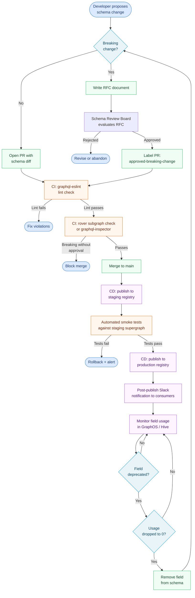

# 09 — Schema Governance

Schema governance is the set of processes, tools, and policies that ensure the GraphQL schema evolves safely across teams and over time. Without deliberate governance, breaking changes reach production without notice, naming conventions diverge across subgraphs, schema quality degrades through accumulated shortcuts, and the API surface becomes a liability rather than an asset.

Governance is not gatekeeping. Its purpose is to give every team the confidence to move quickly while protecting the teams that depend on the schema. When governance works well, a developer can propose a field deprecation, see exactly which clients are still using that field from a dashboard, set a migration deadline, and remove it cleanly — without a production incident.

## Why Schema Governance Matters at Enterprise Scale

In a small team running a monolithic GraphQL API, governance is informal: one or two engineers know the schema by heart, review each PR, and catch problems before they ship. That model breaks down the moment you have:

- Multiple subgraphs owned by different teams
- External clients (mobile apps, partner APIs) that cannot be redeployed on demand
- A compliance requirement to version or audit schema changes
- A federated supergraph where a single subgraph change can break the composed schema for every consumer

At that scale, governance moves from a social convention to an engineering system — enforced in CI, tracked in a registry, and owned by a clearly defined process.

## Governance Lifecycle

The schema change lifecycle flows through a defined set of stages, each with clear entry/exit criteria and responsible parties. The diagram below shows the full lifecycle from a developer's initial change through production deployment and eventual field removal.

## Contents of This Section

| File | Topic |
|---|---|
| [01-governance-framework.md](./01-governance-framework.md) | Governance spectrum, tooling comparison, RFC process, schema review board |
| [02-schema-lifecycle.md](./02-schema-lifecycle.md) | Field lifecycle, @deprecated directive, deprecation SLA, sunset policies |
| [03-breaking-change-policies.md](./03-breaking-change-policies.md) | Defining breaking changes, rover subgraph check, override procedures |
| [04-team-governance.md](./04-team-governance.md) | Subgraph ownership, cross-team coordination, changelog, on-call |

## Prerequisites

Before working through this section, ensure you have read:

- **07 — Federation**: Understanding Apollo Federation v2, subgraphs, and the supergraph composition model is required context for everything in this section. Governance policies are meaningless without understanding what they govern.
- **08 — Supergraph Architecture**: The supergraph router, schema registry, and composition pipeline are the infrastructure that governance policies enforce.
- **03 — Schema Design**: Naming conventions, type design, and field design decisions are what governance policies protect and extend.

## Tooling Referenced in This Section

This section uses the following real tools:

| Tool | Role in Governance |
|---|---|
| **Apollo GraphOS** | Hosted schema registry, breaking change detection, field-level usage analytics, operations registry |
| **GraphQL Hive** | Open-source alternative registry (self-hosted via Docker, or hosted) |
| **WunderGraph Cosmo** | Open-source federation platform with built-in governance (self-hosted via K8s) |
| **rover CLI** | Apollo's CLI for subgraph schema publishing and checking |
| **graphql-inspector** | Open-source CLI for breaking change detection, schema diffing, schema coverage |
| **graphql-eslint** | ESLint plugin for GraphQL SDL linting — naming conventions, deprecation rules, documentation rules |

## Key Principles

**1. Policy as code, not policy as documentation.** If a governance rule is not enforced in CI, it is not a rule — it is a suggestion. Every policy in this section has a corresponding tooling implementation.

**2. Consumer protection over developer convenience.** When governance creates friction, that friction exists to protect the teams that cannot react instantly to a schema change. External mobile clients release on a two-week cycle. Partner integrations may take months to update. Schema changes are irreversible in practice.

**3. Gradual formality.** Not every team needs the full governance stack on day one. This section describes the complete model; adopt the pieces that match your current scale and complexity.

**4. Visibility drives compliance.** The most effective governance mechanism is a clear, real-time view of who is using each field and how. When a developer can see that 12 clients are still calling a deprecated field, they write the migration guide. When they cannot see usage, they guess — and they guess wrong.
